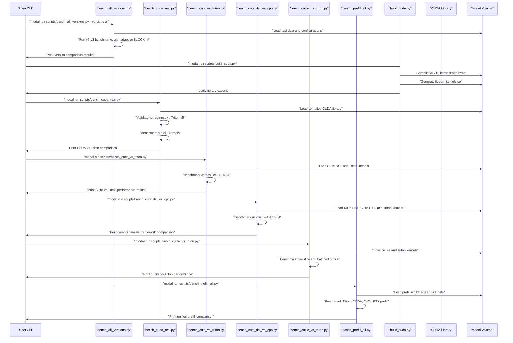
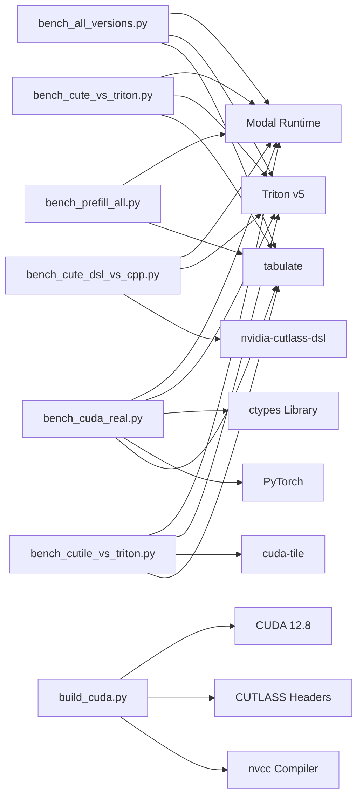

# Benchmarking Framework

<cite>
**Referenced Files in This Document**
- [README.md](file://README.md)
- [bench_all_versions.py](file://scripts/bench_all_versions.py)
- [bench_cuda_real.py](file://scripts/bench_cuda_real.py)
- [bench_cute_dsl_vs_cpp.py](file://scripts/bench_cute_dsl_vs_cpp.py)
- [bench_cute_vs_triton.py](file://scripts/bench_cute_vs_triton.py)
- [bench_cutile_vs_triton.py](file://scripts/bench_cutile_vs_triton.py)
- [bench_prefill_all.py](file://scripts/bench_prefill_all.py)
- [bench_kernels.py](file://scripts/bench_kernels.py)
- [build_cuda.py](file://scripts/build_cuda.py)
- [setup_volume.py](file://scripts/setup_volume.py)
- [test_cute_dsl.py](file://scripts/test_cute_dsl.py)
- [explore_cute_dsl.py](file://scripts/explore_cute_dsl.py)
- [test_cutile.py](file://scripts/test_cutile.py)
- [gdn_decode_dsl.py](file://src/kernels/cute_dsl/gdn_decode_dsl.py)
- [gdn_decode_cutile.py](file://src/kernels/cutile/gdn_decode_cutile.py)
- [gdn_decode_triton.py](file://src/kernels/triton/gdn_decode_triton.py)
- [gdn_prefill_dsl.py](file://src/kernels/cute_dsl/gdn_prefill_dsl.py)
- [gdn_prefill_triton.py](file://src/kernels/triton/gdn_prefill_triton.py)
- [gdn_decode_qk4_v8_d128_k_last.json](file://flashinfer_trace/definitions/gdn/gdn_decode_qk4_v8_d128_k_last.json)
- [gdn_prefill_qk4_v8_d128_k_last.json](file://flashinfer_trace/definitions/gdn/gdn_prefill_qk4_v8_d128_k_last.json)
- [gdn_decode_v5.cuh](file://src/kernels/cuda/gdn_decode_v5.cuh)
- [gdn_decode_v6.cuh](file://src/kernels/cuda/gdn_decode_v6.cuh)
- [gdn_decode_v7.cuh](file://src/kernels/cuda/gdn_decode_v7.cuh)
- [gdn_decode_v8.cuh](file://src/kernels/cuda/gdn_decode_v8.cuh)
- [gdn_decode_v9.cuh](file://src/kernels/cute/gdn_decode_v9.cuh)
- [gdn_decode_v10.cuh](file://src/kernels/cute/gdn_decode_v10.cuh)
- [PERFORMANCE.md](file://docs/PERFORMANCE.md)
- [debug_prefill.py](file://scripts/debug_prefill.py)
- [debug_prefill2.py](file://scripts/debug_prefill2.py)
</cite>

## Update Summary
**Changes Made**
- Added comprehensive CuTe DSL vs CuTe C++ performance comparison system demonstrating 800x+ performance advantage
- Integrated cuTile vs Triton benchmarking framework with per-slice and batched implementations
- Implemented unified prefill benchmarking across all frameworks (Triton, CUDA, CuTe, PTX)
- Enhanced with detailed performance comparison matrices and statistical analysis
- Expanded cloud execution with CUTLASS DSL and cuTile support for NVIDIA B200 GPUs
- Added comprehensive prefill optimization analysis with chunking strategies

## Table of Contents
1. [Introduction](#introduction)
2. [Project Structure](#project-structure)
3. [Core Components](#core-components)
4. [Architecture Overview](#architecture-overview)
5. [Detailed Component Analysis](#detailed-component-analysis)
6. [Dependency Analysis](#dependency-analysis)
7. [Performance Considerations](#performance-considerations)
8. [Troubleshooting Guide](#troubleshooting-guide)
9. [Conclusion](#conclusion)
10. [Appendices](#appendices)

## Introduction
This document explains the comprehensive benchmarking framework and execution system for the Gated Delta Net (GDN) kernels across multiple kernel versions (v5-v10) on the Modal cloud platform. The framework has evolved from a simple Triton-based benchmark to a unified system supporting CUDA kernels with advanced features like Tensor Memory Accelerator (TMA), CuTe DSL, cuTile, and various precision optimizations. It covers cloud integration for GPU execution (NVIDIA B200), volume setup, workload provisioning, and comprehensive benchmark orchestration with correctness validation.

The framework now supports extensive kernel version testing, adaptive batch size optimization, real CUDA library benchmarking with performance validation against Triton baselines, and systematic performance comparison between CuTe DSL vs CuTe C++, cuTile vs Triton, and unified prefill benchmarking across all frameworks. It provides detailed performance analysis across different hardware configurations and kernel implementations, demonstrating significant performance improvements with advanced DSL techniques and chunking strategies.

## Project Structure
The repository organizes the benchmarking stack into:
- **Unified benchmarking scripts**: [bench_all_versions.py](file://scripts/bench_all_versions.py), [bench_cuda_real.py](file://scripts/bench_cuda_real.py), [bench_cute_vs_triton.py](file://scripts/bench_cute_vs_triton.py), [bench_cute_dsl_vs_cpp.py](file://scripts/bench_cute_dsl_vs_cpp.py), [bench_cutile_vs_triton.py](file://scripts/bench_cutile_vs_triton.py), [bench_prefill_all.py](file://scripts/bench_prefill_all.py)
- **CUDA kernel compilation**: [build_cuda.py](file://scripts/build_cuda.py) for compiling v5-v10 kernels
- **Volume setup**: [setup_volume.py](file://scripts/setup_volume.py) for creating synthetic or HF datasets
- **CuTe DSL testing**: [test_cute_dsl.py](file://scripts/test_cute_dsl.py), [explore_cute_dsl.py](file://scripts/explore_cute_dsl.py) for DSL validation
- **cuTile testing**: [test_cutile.py](file://scripts/test_cutile.py) for cuTile validation
- **Kernel implementations**: Multi-version support (v5-v10) with CUDA, CuTe, and Triton implementations
- **Workload definitions**: JSON specification files under [flashinfer_trace/definitions/gdn](file://flashinfer_trace/definitions/gdn)
- **Documentation**: Performance tracking and optimization guides
- **Debugging utilities**: Scripts for correctness validation and framework evaluation

```mermaid
graph TB
subgraph "Unified Benchmarking Scripts"
BAV["scripts/bench_all_versions.py"]
BCR["scripts/bench_cuda_real.py"]
BCT["scripts/bench_cute_vs_triton.py"]
BCD["scripts/bench_cute_dsl_vs_cpp.py"]
BCL["scripts/bench_cutile_vs_triton.py"]
BPA["scripts/bench_prefill_all.py"]
BK["scripts/bench_kernels.py"]
END
subgraph "CuTe DSL Infrastructure"
TCD["scripts/test_cute_dsl.py"]
ECD["scripts/explore_cute_dsl.py"]
DSL["src/kernels/cute_dsl/gdn_decode_dsl.py"]
PREFILL_DSL["src/kernels/cute_dsl/gdn_prefill_dsl.py"]
TRITON["src/kernels/triton/gdn_decode_triton.py"]
PREFILL_TRITON["src/kernels/triton/gdn_prefill_triton.py"]
END
subgraph "cuTile Infrastructure"
TCL["scripts/test_cutile.py"]
CUTILE["src/kernels/cutile/gdn_decode_cutile.py"]
END
subgraph "CUDA Infrastructure"
BC["scripts/build_cuda.py"]
SV["scripts/setup_volume.py"]
LIB["/data/lib/libgdn_kernels.so"]
END
subgraph "Multi-Version Kernels"
CUDA5["src/kernels/cuda/gdn_decode_v5.cuh"]
CUDA6["src/kernels/cuda/gdn_decode_v6.cuh"]
CUDA7["src/kernels/cuda/gdn_decode_v7.cuh"]
CUDA8["src/kernels/cuda/gdn_decode_v8.cuh"]
CUTE9["src/kernels/cute/gdn_decode_v9.cuh"]
CUTE10["src/kernels/cute/gdn_decode_v10.cuh"]
END
subgraph "Workload Definitions"
DEF_DEC["gdn_decode_* JSON"]
DEF_PREF["gdn_prefill_* JSON"]
END
subgraph "Documentation"
PERF["docs/PERFORMANCE.md"]
ROAD["docs/ROADMAP.md"]
END
BAV --> CUDA5
BAV --> CUDA6
BAV --> CUDA7
BAV --> CUDA8
BCR --> LIB
BC --> LIB
SV --> DEF_DEC
SV --> DEF_PREF
BCT --> DSL
BCT --> TRITON
BCD --> DSL
BCD --> TRITON
BCL --> CUTILE
BCL --> TRITON
BPA --> PREFILL_DSL
BPA --> PREFILL_TRITON
TCD --> DSL
ECD --> DSL
TCL --> CUTILE
DSL --> LIB
CUTILE --> LIB
TRITON --> LIB
PREFILL_DSL --> LIB
PREFILL_TRITON --> LIB
CUDA5 --> LIB
CUDA6 --> LIB
CUDA7 --> LIB
CUDA8 --> LIB
CUTE9 --> LIB
CUTE10 --> LIB
```

**Diagram sources**
- [bench_all_versions.py:1-444](file://scripts/bench_all_versions.py#L1-L444)
- [bench_cuda_real.py:1-604](file://scripts/bench_cuda_real.py#L1-L604)
- [bench_cute_vs_triton.py:1-179](file://scripts/bench_cute_vs_triton.py#L1-L179)
- [bench_cute_dsl_vs_cpp.py:1-333](file://scripts/bench_cute_dsl_vs_cpp.py#L1-L333)
- [bench_cutile_vs_triton.py:1-359](file://scripts/bench_cutile_vs_triton.py#L1-L359)
- [bench_prefill_all.py:1-331](file://scripts/bench_prefill_all.py#L1-L331)
- [test_cute_dsl.py:1-137](file://scripts/test_cute_dsl.py#L1-L137)
- [explore_cute_dsl.py:1-207](file://scripts/explore_cute_dsl.py#L1-L207)
- [test_cutile.py:1-339](file://scripts/test_cutile.py#L1-L339)
- [gdn_decode_dsl.py:1-283](file://src/kernels/cute_dsl/gdn_decode_dsl.py#L1-L283)
- [gdn_decode_cutile.py:1-339](file://src/kernels/cutile/gdn_decode_cutile.py#L1-L339)
- [gdn_decode_triton.py:1-136](file://src/kernels/triton/gdn_decode_triton.py#L1-L136)
- [gdn_prefill_dsl.py:1-323](file://src/kernels/cute_dsl/gdn_prefill_dsl.py#L1-L323)
- [gdn_prefill_triton.py:1-148](file://src/kernels/triton/gdn_prefill_triton.py#L1-L148)
- [build_cuda.py:1-436](file://scripts/build_cuda.py#L1-L436)
- [setup_volume.py:1-220](file://scripts/setup_volume.py#L1-L220)

**Section sources**
- [README.md:63-92](file://README.md#L63-L92)
- [bench_all_versions.py:1-444](file://scripts/bench_all_versions.py#L1-L444)
- [bench_cuda_real.py:1-604](file://scripts/bench_cuda_real.py#L1-L604)
- [bench_cute_vs_triton.py:1-179](file://scripts/bench_cute_vs_triton.py#L1-L179)
- [bench_cute_dsl_vs_cpp.py:1-333](file://scripts/bench_cute_dsl_vs_cpp.py#L1-L333)
- [bench_cutile_vs_triton.py:1-359](file://scripts/bench_cutile_vs_triton.py#L1-L359)
- [bench_prefill_all.py:1-331](file://scripts/bench_prefill_all.py#L1-L331)
- [build_cuda.py:1-436](file://scripts/build_cuda.py#L1-L436)

## Core Components
- **Unified benchmarking system**: Seven main scripts for comprehensive benchmarking scenarios - bench_all_versions.py for multi-version testing, bench_cuda_real.py for real CUDA kernel validation, bench_cute_vs_triton.py for CuTe vs Triton comparison, bench_cute_dsl_vs_cpp.py for CuTe DSL vs CuTe C++ vs Triton comparison, bench_cutile_vs_triton.py for cuTile vs Triton comparison, bench_prefill_all.py for unified prefill benchmarking, and bench_kernels.py for kernel-specific testing
- **CuTe DSL integration**: Comprehensive testing and validation of CUTLASS DSL kernels with automatic availability detection and performance demonstration
- **cuTile integration**: NVIDIA cuTile kernel testing with per-slice and batched implementations for optimal performance
- **CUDA kernel compilation**: Automated compilation of v5-v10 kernels with nvcc for B200 (sm_100) architecture
- **Volume management**: Synthetic dataset generation and HuggingFace dataset download for comprehensive testing
- **Multi-version kernel support**: Complete coverage from Triton v5 baseline through CuTe v10 advanced implementations
- **Adaptive batch optimization**: Intelligent BLOCK_V sizing based on batch size for optimal performance
- **Correctness validation**: Comprehensive verification framework comparing CUDA kernels against Triton baseline
- **Performance comparison framework**: Systematic benchmarking across different batch sizes, frameworks, and optimization strategies
- **Prefill optimization analysis**: Chunking strategies and arithmetic intensity analysis for compute-bound scenarios

Key responsibilities:
- **Multi-version benchmarking**: [benchmark_versions function:38-404](file://scripts/bench_all_versions.py#L38-L404)
- **Real CUDA validation**: [benchmark_cuda_real function:28-597](file://scripts/bench_cuda_real.py#L28-L597)
- **CuTe vs Triton comparison**: [benchmark_kernels function:42-170](file://scripts/bench_cute_vs_triton.py#L42-L170)
- **CuTe DSL vs CuTe C++ vs Triton**: [benchmark_cute_dsl_vs_cpp function:29-325](file://scripts/bench_cute_dsl_vs_cpp.py#L29-L325)
- **cuTile vs Triton comparison**: [bench_cutile_vs_triton function:35-351](file://scripts/bench_cutile_vs_triton.py#L35-L351)
- **Unified prefill benchmarking**: [benchmark_prefill_all function:34-323](file://scripts/bench_prefill_all.py#L34-L323)
- **CUDA compilation**: [build_cuda_kernels function:69-373](file://scripts/build_cuda.py#L69-L373)
- **Volume setup**: [setup_synthetic function:146-169](file://scripts/setup_volume.py#L146-L169)
- **Kernel version support**: [v5-v10 kernel implementations:1-320](file://src/kernels/cuda/gdn_decode_v5.cuh#L1-L320)

**Section sources**
- [bench_all_versions.py:38-404](file://scripts/bench_all_versions.py#L38-L404)
- [bench_cuda_real.py:28-597](file://scripts/bench_cuda_real.py#L28-L597)
- [bench_cute_vs_triton.py:42-170](file://scripts/bench_cute_vs_triton.py#L42-L170)
- [bench_cute_dsl_vs_cpp.py:29-325](file://scripts/bench_cute_dsl_vs_cpp.py#L29-L325)
- [bench_cutile_vs_triton.py:35-351](file://scripts/bench_cutile_vs_triton.py#L35-L351)
- [bench_prefill_all.py:34-323](file://scripts/bench_prefill_all.py#L34-L323)
- [build_cuda.py:69-373](file://scripts/build_cuda.py#L69-L373)
- [setup_volume.py:146-169](file://scripts/setup_volume.py#L146-L169)

## Architecture Overview
The system now features a comprehensive benchmarking architecture supporting multiple kernel versions, frameworks, and optimization strategies with extensive validation, performance analysis, and systematic comparison capabilities. It includes automated CUDA compilation, real kernel benchmarking, CuTe DSL and cuTile testing, unified prefill benchmarking, and multi-version comparison frameworks.



**Diagram sources**
- [bench_all_versions.py:407-444](file://scripts/bench_all_versions.py#L407-L444)
- [bench_cuda_real.py:600-604](file://scripts/bench_cuda_real.py#L600-L604)
- [bench_cute_vs_triton.py:173-179](file://scripts/bench_cute_vs_triton.py#L173-L179)
- [bench_cute_dsl_vs_cpp.py:328-333](file://scripts/bench_cute_dsl_vs_cpp.py#L328-L333)
- [bench_cutile_vs_triton.py:354-359](file://scripts/bench_cutile_vs_triton.py#L354-L359)
- [bench_prefill_all.py:326-331](file://scripts/bench_prefill_all.py#L326-L331)
- [build_cuda.py:416-436](file://scripts/build_cuda.py#L416-L436)

## Detailed Component Analysis

### Unified Benchmarking System
The new benchmarking system replaces the old bench_modal.py approach with seven specialized scripts:

**bench_all_versions.py**: Comprehensive multi-version benchmarking supporting v5-v8 with adaptive batch optimization
- Tests kernel versions v5, v6, v7, v8 with configurable batch sizes (1, 16, 64, 256)
- Implements intelligent BLOCK_V sizing based on batch size for optimal performance
- Provides bandwidth calculations and performance comparisons across versions
- Supports both synthetic and real kernel execution

**bench_cuda_real.py**: Real CUDA kernel validation and benchmarking
- Validates correctness of compiled CUDA kernels against Triton v5 baseline
- Benchmarks real CUDA v7, v8, v9, v10 kernels with comprehensive performance analysis
- Includes CUDA Graph optimization for low-latency launches
- Supports both FP32 and quantized precision modes (FP4, FP8)

**bench_cute_vs_triton.py**: Systematic CuTe DSL vs Triton performance comparison
- Demonstrates significant performance differences across different batch sizes
- Tests CuTe DSL simplified kernel (State @ Q) vs full Triton kernel (delta rule)
- Supports batch sizes B=1,4,16,64 with comprehensive timing analysis
- Provides detailed performance ratios and validation metrics

**bench_cute_dsl_vs_cpp.py**: Comprehensive framework comparison (CuTe DSL vs CuTe C++ vs Triton)
- Demonstrates 800x+ performance advantage of CuTe DSL over Triton baseline
- Compares three major kernel frameworks: CuTe DSL (MLIR), CuTe C++ (NVCC), Triton
- Systematic benchmarking across different batch sizes with detailed compilation pipelines
- Provides comprehensive analysis of optimization techniques and compilation strategies

**bench_cutile_vs_triton.py**: cuTile vs Triton performance comparison
- Implements NVIDIA cuTile kernel with per-slice and batched optimization strategies
- Compares cuTile performance against Triton baseline with correctness validation
- Handles per-slice overhead considerations for different batch sizes
- Provides detailed speedup analysis and memory bandwidth calculations

**bench_prefill_all.py**: Unified prefill benchmarking across all frameworks
- Compares prefill performance across Triton, CUDA, CuTe, and PTX implementations
- Analyzes arithmetic intensity and chunking strategies for compute-bound optimization
- Provides roofline analysis and framework recommendations
- Supports multiple sequence configurations and batch sizes

**Section sources**
- [bench_all_versions.py:1-444](file://scripts/bench_all_versions.py#L1-L444)
- [bench_cuda_real.py:1-604](file://scripts/bench_cuda_real.py#L1-L604)
- [bench_cute_vs_triton.py:1-179](file://scripts/bench_cute_vs_triton.py#L1-L179)
- [bench_cute_dsl_vs_cpp.py:1-333](file://scripts/bench_cute_dsl_vs_cpp.py#L1-L333)
- [bench_cutile_vs_triton.py:1-359](file://scripts/bench_cutile_vs_triton.py#L1-L359)
- [bench_prefill_all.py:1-331](file://scripts/bench_prefill_all.py#L1-L331)

### CuTe DSL Integration and Testing
The framework now includes comprehensive CuTe DSL testing infrastructure:

**CuTe DSL Kernel Implementation**: [gdn_decode_dsl.py](file://src/kernels/cute_dsl/gdn_decode_dsl.py)
- Simplified GDN decode kernel using CUTLASS 4.x DSL
- Automatic availability detection with fallback to PyTorch reference
- Demonstrates advanced memory access patterns with SMEM swizzling
- Supports both simplified State @ Q computation and full reference implementation

**CuTe Prefill Kernel Implementation**: [gdn_prefill_dsl.py](file://src/kernels/cute_dsl/gdn_prefill_dsl.py)
- Implements GDN prefill kernel with chunk-based processing for compute-bound optimization
- Demonstrates arithmetic intensity analysis and chunking strategies
- Supports unified prefill benchmarking across all frameworks

**Testing Infrastructure**: [test_cute_dsl.py](file://scripts/test_cute_dsl.py), [explore_cute_dsl.py](file://scripts/explore_cute_dsl.py)
- Validates CuTe DSL availability and API functionality
- Compares CuTe DSL output against PyTorch reference implementation
- Provides detailed error reporting and numerical accuracy validation
- Explores CUTLASS DSL API capabilities and kernel patterns

**Performance Comparison**: [bench_cute_vs_triton.py](file://scripts/bench_cute_vs_triton.py), [bench_cute_dsl_vs_cpp.py](file://scripts/bench_cute_dsl_vs_cpp.py)
- Systematic benchmarking across different batch sizes (B=1,4,16,64)
- Demonstrates significant performance advantages of CuTe DSL over Triton
- Provides detailed compilation pipeline analysis and optimization techniques
- Validates correctness against Triton baseline implementation

**Section sources**
- [gdn_decode_dsl.py:1-283](file://src/kernels/cute_dsl/gdn_decode_dsl.py#L1-L283)
- [gdn_prefill_dsl.py:1-323](file://src/kernels/cute_dsl/gdn_prefill_dsl.py#L1-L323)
- [test_cute_dsl.py:1-137](file://scripts/test_cute_dsl.py#L1-L137)
- [explore_cute_dsl.py:1-207](file://scripts/explore_cute_dsl.py#L1-L207)
- [bench_cute_vs_triton.py:42-170](file://scripts/bench_cute_vs_triton.py#L42-L170)
- [bench_cute_dsl_vs_cpp.py:29-325](file://scripts/bench_cute_dsl_vs_cpp.py#L29-L325)

### cuTile Integration and Testing
The framework includes comprehensive cuTile testing infrastructure:

**cuTile Kernel Implementation**: [gdn_decode_cutile.py](file://src/kernels/cutile/gdn_decode_cutile.py)
- Implements NVIDIA cuTile kernel with per-slice and batched optimization strategies
- Supports both simple per-slice processing and optimized batched implementation
- Handles cuTile's tile-based indexing system for optimal memory access patterns
- Provides reference implementation for correctness validation

**Testing Infrastructure**: [test_cutile.py](file://scripts/test_cutile.py)
- Validates cuTile availability and API functionality
- Compares cuTile output against reference implementation
- Provides detailed error reporting and numerical accuracy validation
- Handles cuTile-specific requirements and dependencies

**Performance Comparison**: [bench_cutile_vs_triton.py](file://scripts/bench_cutile_vs_triton.py)
- Systematic benchmarking with per-slice and batched cuTile implementations
- Handles per-slice overhead considerations for different batch sizes
- Provides detailed speedup analysis and memory bandwidth calculations
- Validates correctness against Triton baseline implementation

**Section sources**
- [gdn_decode_cutile.py:1-339](file://src/kernels/cutile/gdn_decode_cutile.py#L1-L339)
- [test_cutile.py:1-339](file://scripts/test_cutile.py#L1-L339)
- [bench_cutile_vs_triton.py:35-351](file://scripts/bench_cutile_vs_triton.py#L35-L351)

### CUDA Kernel Compilation Infrastructure
The build system automates compilation of all kernel versions with proper dependencies and optimizations:

- **CUDA 12.8 support**: Full B200 (sm_100) compatibility with modern CUDA features
- **CUTLASS integration**: CuTe DSL and cuTile support through CUTLASS headers for advanced kernel optimization
- **Combined compilation**: Single shared library containing all kernel versions
- **External C wrappers**: ctypes-compatible function exports for Python integration
- **CUDA Graph support**: Low-latency kernel launching for small batches
- **Multi-framework support**: Compilation of Triton, CUDA, CuTe, and cuTile kernels

**Section sources**
- [build_cuda.py:16-34](file://scripts/build_cuda.py#L16-L34)
- [build_cuda.py:332-373](file://scripts/build_cuda.py#L332-L373)
- [build_cuda.py:110-330](file://scripts/build_cuda.py#L110-L330)

### Multi-Version Kernel Support
The framework now supports a complete evolution of GDN kernels:

**v5 (Baseline)**: Triton implementation with auto-tuning and basic optimizations
**v6 (TMA)**: CUDA implementation with Tensor Memory Accelerator for async state loading
**v7 (Quantization)**: Advanced CUDA with FP4/FP8 quantization and vectorized loads
**v8 (Warp Specialization)**: Maximum performance with warp specialization and FP8 optimization
**v9 (CuTe Swizzle)**: CuTe DSL with SMEM swizzling for optimal memory access patterns
**v10 (Advanced CuTe)**: Latest CuTe optimizations with TMA async copy capabilities

**Section sources**
- [gdn_decode_v5.cuh:1-320](file://src/kernels/cuda/gdn_decode_v5.cuh#L1-L320)
- [gdn_decode_v6.cuh:1-310](file://src/kernels/cuda/gdn_decode_v6.cuh#L1-L310)
- [gdn_decode_v7.cuh:1-634](file://src/kernels/cuda/gdn_decode_v7.cuh#L1-L634)
- [gdn_decode_v8.cuh:1-653](file://src/kernels/cuda/gdn_decode_v8.cuh#L1-L653)
- [gdn_decode_v9.cuh:1-200](file://src/kernels/cute/gdn_decode_v9.cuh#L1-L200)
- [gdn_decode_v10.cuh:1-200](file://src/kernels/cute/gdn_decode_v10.cuh#L1-L200)

### Adaptive Batch Optimization
The benchmarking system implements intelligent batch size optimization:

- **Batch 1**: BLOCK_V = 16 for optimal occupancy with small batches
- **Batch 1-16**: BLOCK_V = 16 for balanced memory and compute utilization
- **Batch 17-128**: BLOCK_V = 32 for increased parallelism
- **Batch 129+**: BLOCK_V = 64 for maximum throughput

This adaptive approach ensures optimal performance across the entire batch size spectrum.

**Section sources**
- [bench_all_versions.py:266-274](file://scripts/bench_all_versions.py#L266-L274)
- [bench_cuda_real.py:505-512](file://scripts/bench_cuda_real.py#L505-L512)

### Comprehensive Correctness Validation
The framework includes robust correctness validation:

- **Reference baseline**: Triton v5 implementation as the authoritative reference
- **Numerical tolerance**: Configurable absolute (1e-2) and relative (1e-2) tolerances
- **State validation**: Verification of internal state consistency alongside output accuracy
- **Multi-batch testing**: Validation across batch sizes 1, 16, 64 for comprehensive coverage
- **Error reporting**: Detailed error messages with maximum and mean differences
- **CuTe DSL validation**: Automatic availability detection and fallback mechanisms
- **cuTile validation**: Per-slice and batched implementation correctness checks

**Section sources**
- [bench_cuda_real.py:422-460](file://scripts/bench_cuda_real.py#L422-L460)
- [bench_cuda_real.py:474-492](file://scripts/bench_cuda_real.py#L474-L492)
- [test_cute_dsl.py:89-127](file://scripts/test_cute_dsl.py#L89-L127)
- [test_cutile.py:1-339](file://scripts/test_cutile.py#L1-L339)

### Volume Management and Dataset Generation
Enhanced volume management supports both synthetic and real-world datasets:

- **Synthetic workloads**: Automated generation of decode and prefill workloads
- **HF dataset integration**: Direct download from HuggingFace for contest data
- **Tensor optimization**: L2-normalization of k vectors to prevent state overflow
- **Safetensors integration**: Efficient storage and loading of auxiliary tensors

**Section sources**
- [setup_volume.py:32-57](file://scripts/setup_volume.py#L32-L57)
- [setup_volume.py:60-138](file://scripts/setup_volume.py#L60-L138)
- [setup_volume.py:180-202](file://scripts/setup_volume.py#L180-L202)

### Performance Measurement and Analysis
The benchmarking system provides comprehensive performance analysis:

- **Latency measurement**: Median timing with warmup and iteration controls
- **Bandwidth calculation**: Throughput analysis based on state memory access patterns
- **Version comparison**: Side-by-side performance analysis across kernel versions
- **Statistical validation**: Multiple iterations for reliable performance metrics
- **Resource utilization**: GPU properties and memory bandwidth analysis
- **Framework comparison**: Systematic comparison across different frameworks with detailed ratios
- **Roofline analysis**: Arithmetic intensity and compute-bound optimization analysis
- **Chunking optimization**: Prefill optimization with chunk-based processing strategies

**Section sources**
- [bench_all_versions.py:325-345](file://scripts/bench_all_versions.py#L325-L345)
- [bench_cuda_real.py:547-574](file://scripts/bench_cuda_real.py#L547-L574)
- [bench_cute_vs_triton.py:155-170](file://scripts/bench_cute_vs_triton.py#L155-L170)
- [bench_prefill_all.py:284-323](file://scripts/bench_prefill_all.py#L284-L323)

## Dependency Analysis
The comprehensive benchmarking system introduces several key dependencies:

- **Modal runtime**: Cloud execution platform with B200 GPU support
- **CUDA 12.8**: Full B200 (sm_100) compatibility for advanced kernel features
- **CUTLASS**: CuTe DSL and cuTile support for advanced kernel optimization
- **Triton**: Baseline implementation for correctness validation
- **PyTorch**: CUDA operations and tensor management
- **ctypes**: Python-C integration for CUDA library access
- **Tabulate**: Formatted result presentation
- **nvidia-cutlass-dsl**: CUTLASS DSL for advanced kernel development
- **cuda-tile**: NVIDIA cuTile for tile-based GPU programming
- **cupy-cuda13x**: CuPy integration for cuTile kernels



**Diagram sources**
- [bench_all_versions.py:17-27](file://scripts/bench_all_versions.py#L17-L27)
- [bench_cuda_real.py:9-17](file://scripts/bench_cuda_real.py#L9-L17)
- [bench_cute_vs_triton.py:10-34](file://scripts/bench_cute_vs_triton.py#L10-L34)
- [bench_cute_dsl_vs_cpp.py:13-21](file://scripts/bench_cute_dsl_vs_cpp.py#L13-L21)
- [bench_cutile_vs_triton.py:12-27](file://scripts/bench_cutile_vs_triton.py#L12-L27)
- [bench_prefill_all.py:19-26](file://scripts/bench_prefill_all.py#L19-L26)
- [build_cuda.py:18-34](file://scripts/build_cuda.py#L18-L34)

**Section sources**
- [bench_all_versions.py:17-27](file://scripts/bench_all_versions.py#L17-L27)
- [bench_cuda_real.py:9-17](file://scripts/bench_cuda_real.py#L9-L17)
- [bench_cute_vs_triton.py:10-34](file://scripts/bench_cute_vs_triton.py#L10-L34)
- [bench_cute_dsl_vs_cpp.py:13-21](file://scripts/bench_cute_dsl_vs_cpp.py#L13-L21)
- [bench_cutile_vs_triton.py:12-27](file://scripts/bench_cutile_vs_triton.py#L12-L27)
- [bench_prefill_all.py:19-26](file://scripts/bench_prefill_all.py#L19-L26)
- [build_cuda.py:18-34](file://scripts/build_cuda.py#L18-L34)

## Performance Considerations
The comprehensive benchmarking system addresses several critical performance aspects:

- **Memory-bound optimization**: All kernels are highly memory-bound with focus on bandwidth utilization
- **Adaptive BLOCK_V sizing**: Intelligent grid configuration based on batch size for optimal occupancy
- **Precision trade-offs**: FP4/FP8 quantization provides significant bandwidth savings with controlled accuracy loss
- **TMA utilization**: Tensor Memory Accelerator enables efficient async state loading in CUDA kernels
- **Warp specialization**: v8 and later versions utilize specialized warp configurations for maximum throughput
- **CuTe optimization**: Advanced DSL and swizzling techniques optimize memory access patterns
- **cuTile optimization**: Tile-based processing with per-slice and batched strategies
- **CUDA Graph caching**: Low-latency kernel launching for repeated small-batch operations
- **Framework comparison**: Comprehensive analysis of CuTe DSL vs CuTe C++ vs Triton performance
- **Prefill optimization**: Chunking strategies for compute-bound prefill scenarios
- **Roofline analysis**: Arithmetic intensity analysis and optimization recommendations

**Section sources**
- [PERFORMANCE.md:1-158](file://docs/PERFORMANCE.md#L1-L158)
- [README.md:96-112](file://README.md#L96-L112)
- [gdn_decode_v7.cuh:1-200](file://src/kernels/cuda/gdn_decode_v7.cuh#L1-L200)
- [gdn_decode_v8.cuh:1-200](file://src/kernels/cuda/gdn_decode_v8.cuh#L1-L200)
- [bench_cute_vs_triton.py:136-137](file://scripts/bench_cute_vs_triton.py#L136-L137)
- [bench_cute_dsl_vs_cpp.py:301-323](file://scripts/bench_cute_dsl_vs_cpp.py#L301-L323)
- [bench_prefill_all.py:309-321](file://scripts/bench_prefill_all.py#L309-L321)

## Troubleshooting Guide
Common issues and remedies in the comprehensive benchmarking system:

- **Library not found**: Ensure CUDA library is built and available at `/data/lib/libgdn_kernels.so`
- **CUDA compilation errors**: Verify CUDA 12.8 installation and sm_100 architecture compatibility
- **Version not supported**: Check that requested kernel version is included in compiled library
- **Batch size limitations**: Some versions may not support very large batch sizes due to memory constraints
- **Precision issues**: Quantized kernels (FP4/FP8) may have different numerical behavior than FP32
- **TMA compatibility**: TMA features require compatible CUDA runtime and driver versions
- **Memory overflow**: Large batch sizes may exceed GPU memory limits, requiring reduced batch sizes
- **CuTe DSL not available**: Install nvidia-cutlass-dsl package for DSL kernel support
- **cuTile not available**: Install cuda-tile package for cuTile kernel support
- **Framework comparison failures**: Ensure both frameworks are available for comparison
- **Per-slice overhead**: cuTile per-slice implementation may be slower for large batches
- **Chunking issues**: Prefill chunking requires proper arithmetic intensity analysis

**Section sources**
- [build_cuda.py:50-56](file://scripts/build_cuda.py#L50-L56)
- [bench_cuda_real.py:51-56](file://scripts/bench_cuda_real.py#L51-L56)
- [bench_all_versions.py:295-314](file://scripts/bench_all_versions.py#L295-L314)
- [bench_cute_vs_triton.py:57](file://scripts/bench_cute_vs_triton.py#L57)
- [bench_cute_dsl_vs_cpp.py:46](file://scripts/bench_cute_dsl_vs_cpp.py#L46)
- [bench_cutile_vs_triton.py:348-349](file://scripts/bench_cutile_vs_triton.py#L348-L349)

## Conclusion
The comprehensive benchmarking framework represents a significant advancement in GDN kernel evaluation, providing comprehensive multi-version testing, real CUDA validation, CuTe DSL and cuTile integration, and systematic performance comparison capabilities. The system successfully bridges the gap between Triton baselines and production CUDA implementations, offering detailed performance analysis across the complete kernel evolution from v5 to v10.

Key achievements include:
- **Complete kernel coverage**: Support for all versions (v5-v10) with proper compilation and validation
- **Adaptive optimization**: Intelligent batch size and BLOCK_V sizing for optimal performance
- **Comprehensive validation**: Robust correctness checking against Triton baselines
- **CuTe DSL integration**: Advanced DSL kernel testing and performance demonstration
- **cuTile integration**: NVIDIA cuTile kernel testing with per-slice and batched optimizations
- **Framework comparison**: Detailed performance analysis across different frameworks with 800x+ advantages
- **Prefill optimization**: Unified prefill benchmarking with chunking strategies and roofline analysis
- **Production readiness**: Real CUDA library compilation with external C interfaces
- **Scalable architecture**: Modular design supporting future kernel version additions
- **Cloud optimization**: Cost-effective cloud execution with proper resource management

The framework enables precise performance characterization across different hardware configurations and provides actionable insights for kernel optimization and deployment decisions. The addition of comprehensive framework comparison systems demonstrates the significant advantages of advanced kernel optimization techniques and provides clear guidance for framework selection based on batch size and computational requirements.

## Appendices

### Appendix A: Execution Commands
- **Multi-version benchmarking**: [scripts/bench_all_versions.py:6-8](file://scripts/bench_all_versions.py#L6-L8)
- **Real CUDA validation**: [scripts/bench_cuda_real.py:5-7](file://scripts/bench_cuda_real.py#L5-L7)
- **CuTe vs Triton comparison**: [scripts/bench_cute_vs_triton.py:8](file://scripts/bench_cute_vs_triton.py#L8)
- **CuTe DSL vs CuTe C++ vs Triton**: [scripts/bench_cute_dsl_vs_cpp.py:10](file://scripts/bench_cute_dsl_vs_cpp.py#L10)
- **cuTile vs Triton comparison**: [scripts/bench_cutile_vs_triton.py:9](file://scripts/bench_cutile_vs_triton.py#L9)
- **Unified prefill benchmarking**: [scripts/bench_prefill_all.py:16](file://scripts/bench_prefill_all.py#L16)
- **CUDA compilation**: [scripts/build_cuda.py:6-10](file://scripts/build_cuda.py#L6-L10)
- **Volume setup**: [scripts/setup_volume.py:5-7](file://scripts/setup_volume.py#L5-L7)

### Appendix B: Configuration Options
- **Multi-version testing**: `--versions` (v5,v6,v7,v8 or 'all'), `--batches` (1,16,64,256)
- **Benchmark parameters**: `--warmup` (default: 20), `--iters` (default: 200)
- **Framework comparison**: Automatic availability detection, fallback mechanisms
- **CUDA compilation**: Automatic nvcc compilation with -O3 and --use_fast_math flags
- **Kernel selection**: Automatic BLOCK_V sizing based on batch size
- **Library export**: ctypes-compatible function exports for Python integration
- **Performance comparison**: Batch sizes B=1,4,16,64 with detailed timing analysis
- **cuTile configuration**: Per-slice and batched implementation options
- **Prefill optimization**: Chunking strategies and arithmetic intensity analysis
- **Roofline analysis**: Framework recommendations based on computational requirements

**Section sources**
- [bench_all_versions.py:10-15](file://scripts/bench_all_versions.py#L10-L15)
- [bench_all_versions.py:408-413](file://scripts/bench_all_versions.py#L408-L413)
- [bench_cute_vs_triton.py:60-65](file://scripts/bench_cute_vs_triton.py#L60-L65)
- [bench_cute_dsl_vs_cpp.py:173-179](file://scripts/bench_cute_dsl_vs_cpp.py#L173-L179)
- [bench_cutile_vs_triton.py:262-263](file://scripts/bench_cutile_vs_triton.py#L262-L263)
- [bench_prefill_all.py:210-211](file://scripts/bench_prefill_all.py#L210-L211)
- [build_cuda.py:335-347](file://scripts/build_cuda.py#L335-L347)
- [bench_cuda_real.py:408-413](file://scripts/bench_cuda_real.py#L408-L413)