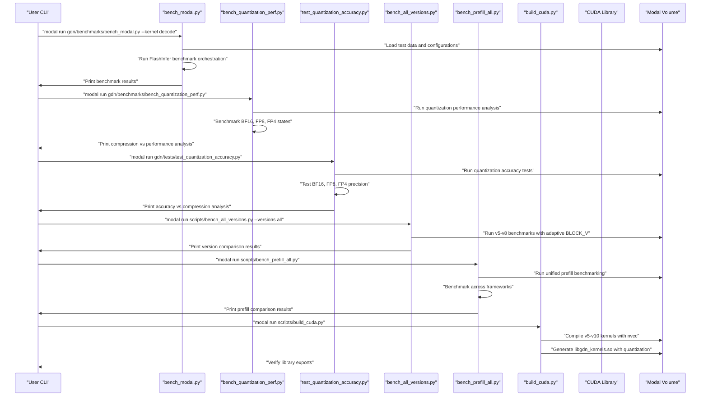
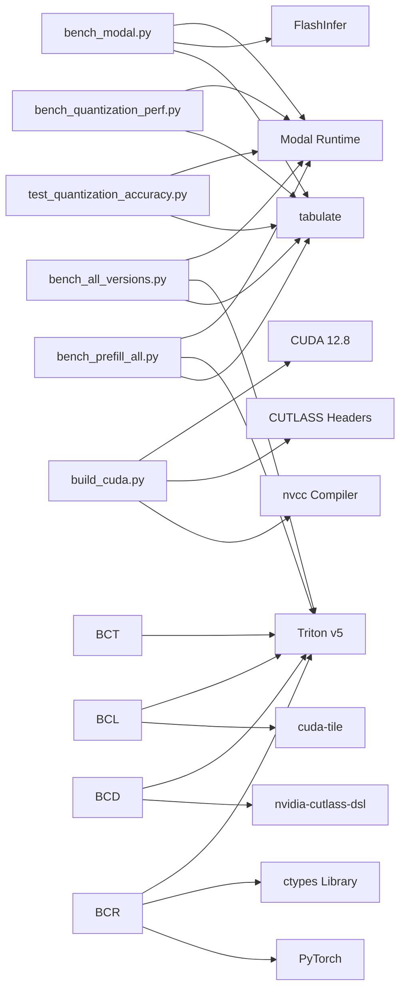

# Benchmarking Framework

<cite>
**Referenced Files in This Document**
- [README.md](file://README.md)
- [bench_all_versions.py](file://scripts/bench_all_versions.py)
- [bench_cuda_real.py](file://scripts/bench_cuda_real.py)
- [bench_cute_vs_triton.py](file://scripts/bench_cute_vs_triton.py)
- [bench_cute_dsl_vs_cpp.py](file://scripts/bench_cute_dsl_vs_cpp.py)
- [bench_cutile_vs_triton.py](file://scripts/bench_cutile_vs_triton.py)
- [bench_prefill_all.py](file://scripts/bench_prefill_all.py)
- [bench_kernels.py](file://scripts/bench_kernels.py)
- [bench_modal.py](file://gdn/benchmarks/bench_modal.py)
- [bench_quantization_perf.py](file://gdn/benchmarks/bench_quantization_perf.py)
- [build_cuda.py](file://scripts/build_cuda.py)
- [setup_volume.py](file://scripts/setup_volume.py)
- [test_cute_dsl.py](file://scripts/test_cute_dsl.py)
- [explore_cute_dsl.py](file://scripts/explore_cute_dsl.py)
- [test_cutile.py](file://scripts/test_cutile.py)
- [test_quantization_accuracy.py](file://gdn/tests/test_quantization_accuracy.py)
- [gdn_decode_dsl.py](file://src/kernels/cute_dsl/gdn_decode_dsl.py)
- [gdn_decode_cutile.py](file://src/kernels/cutile/gdn_decode_cutile.py)
- [gdn_decode_triton.py](file://src/kernels/triton/gdn_decode_triton.py)
- [gdn_prefill_dsl.py](file://src/kernels/cute_dsl/gdn_prefill_dsl.py)
- [gdn_prefill_triton.py](file://src/kernels/triton/gdn_prefill_triton.py)
- [gdn_decode_qk4_v8_d128_k_last.json](file://flashinfer_trace/definitions/gdn/gdn_decode_qk4_v8_d128_k_last.json)
- [gdn_prefill_qk4_v8_d128_k_last.json](file://flashinfer_trace/definitions/gdn/gdn_prefill_qk4_v8_d128_k_last.json)
- [gdn_decode_v5.cuh](file://src/kernels/cuda/gdn_decode_v5.cuh)
- [gdn_decode_v6.cuh](file://src/kernels/cuda/gdn_decode_v6.cuh)
- [gdn_decode_v7.cuh](file://src/kernels/cuda/gdn_decode_v7.cuh)
- [gdn_decode_v8.cuh](file://src/kernels/cuda/gdn_decode_v8.cuh)
- [gdn_decode_v9.cuh](file://src/kernels/cute/gdn_decode_v9.cuh)
- [gdn_decode_v10.cuh](file://src/kernels/cute_cpp/gdn_decode_v10.cuh)
- [gdn_decode_ptx.cuh](file://src/kernels/ptx/gdn_decode_ptx.cuh)
- [PERFORMANCE.md](file://docs/PERFORMANCE.md)
- [ZHIHU_GDN_QUANTIZATION.md](file://docs/ZHIHU_GDN_QUANTIZATION.md)
- [debug_prefill.py](file://scripts/debug_prefill.py)
- [debug_prefill2.py](file://scripts/debug_prefill2.py)
</cite>

## Update Summary
**Changes Made**
- Updated to reflect the current benchmarking infrastructure with benchmarks/bench_modal.py as the primary Modal integration script
- Documented the continued existence of scripts/bench_all_versions.py and scripts/bench_prefill_all.py as legacy scripts
- Added comprehensive quantization accuracy benchmarking capabilities with BF16, FP8, and FP4 state compression
- Enhanced benchmarking system with modal run integration for cloud-based benchmarking
- Updated architecture to show the current split between Modal integration and local benchmarking scripts

## Table of Contents
1. [Introduction](#introduction)
2. [Project Structure](#project-structure)
3. [Core Components](#core-components)
4. [Architecture Overview](#architecture-overview)
5. [Detailed Component Analysis](#detailed-component-analysis)
6. [Dependency Analysis](#dependency-analysis)
7. [Performance Considerations](#performance-considerations)
8. [Troubleshooting Guide](#troubleshooting-guide)
9. [Conclusion](#conclusion)
10. [Appendices](#appendices)

## Introduction
This document explains the comprehensive benchmarking framework and execution system for the Gated Delta Net (GDN) kernels across multiple kernel versions (v5-v10) on the Modal cloud platform. The framework has evolved from a simple Triton-based benchmark to a unified system supporting CUDA kernels with advanced features like Tensor Memory Accelerator (TMA), CuTe DSL, cuTile, and extensive quantization performance benchmarking capabilities.

The framework now includes sophisticated quantization performance benchmarking with BF16, FP8, and FP4 state compression, comprehensive accuracy testing with detailed precision analysis, and systematic performance comparison between different quantization schemes. It covers cloud integration for GPU execution (NVIDIA B200), volume setup, workload provisioning, and comprehensive benchmark orchestration with correctness validation and memory-bound performance analysis.

The quantization benchmarking system provides detailed performance analysis across different compression ratios (2x, 4x, 8x) and validates theoretical memory bandwidth gains against practical implementation results. It includes both simulation-based performance testing and real CUDA kernel benchmarking with proper quantization support.

**Updated** The framework now features a dual-approach architecture: Modal integration scripts for cloud-based benchmarking and local benchmarking scripts for comprehensive kernel testing. The primary Modal integration script is now `benchmarks/bench_modal.py` which orchestrates FlashInfer benchmark runs.

## Project Structure
The repository organizes the benchmarking stack into two main categories:
- **Modal Integration Scripts**: [bench_modal.py](file://gdn/benchmarks/bench_modal.py) for FlashInfer benchmark orchestration and [bench_quantization_perf.py](file://gdn/benchmarks/bench_quantization_perf.py) for quantization performance analysis
- **Local Benchmarking Scripts**: [bench_all_versions.py](file://scripts/bench_all_versions.py), [bench_prefill_all.py](file://scripts/bench_prefill_all.py), and other scripts for comprehensive kernel testing
- **Quantization Testing Framework**: [test_quantization_accuracy.py](file://gdn/tests/test_quantization_accuracy.py) for precision validation
- **CUDA kernel compilation**: [build_cuda.py](file://scripts/build_cuda.py) for compiling v5-v10 kernels with quantization support
- **Volume setup**: [setup_volume.py](file://scripts/setup_volume.py) for creating synthetic or HF datasets
- **CuTe DSL testing**: [test_cute_dsl.py](file://scripts/test_cute_dsl.py), [explore_cute_dsl.py](file://scripts/explore_cute_dsl.py) for DSL validation
- **cuTile testing**: [test_cutile.py](file://scripts/test_cutile.py) for cuTile validation
- **Kernel implementations**: Multi-version support (v5-v10) with CUDA, CuTe, PTX, and quantization variants
- **Workload definitions**: JSON specification files under [flashinfer_trace/definitions/gdn](file://flashinfer_trace/definitions/gdn)
- **Documentation**: Performance tracking, quantization analysis, and optimization guides
- **Debugging utilities**: Scripts for correctness validation and framework evaluation

```mermaid
graph TB
subgraph "Modal Integration Scripts"
BM["gdn/benchmarks/bench_modal.py"]
BQP["gdn/benchmarks/bench_quantization_perf.py"]
END
subgraph "Local Benchmarking Scripts"
BAV["scripts/bench_all_versions.py"]
BPA["scripts/bench_prefill_all.py"]
BCR["scripts/bench_cuda_real.py"]
BCT["scripts/bench_cute_vs_triton.py"]
BCD["scripts/bench_cute_dsl_vs_cpp.py"]
BCL["scripts/bench_cutile_vs_triton.py"]
BK["scripts/bench_kernels.py"]
END
subgraph "Quantization Testing"
TQA["gdn/tests/test_quantization_accuracy.py"]
END
subgraph "CuTe DSL Infrastructure"
TCD["scripts/test_cute_dsl.py"]
ECD["scripts/explore_cute_dsl.py"]
DSL["src/kernels/cute_dsl/gdn_decode_dsl.py"]
PREFILL_DSL["src/kernels/cute_dsl/gdn_prefill_dsl.py"]
TRITON["src/kernels/triton/gdn_decode_triton.py"]
PREFILL_TRITON["src/kernels/triton/gdn_prefill_triton.py"]
END
subgraph "cuTile Infrastructure"
TCL["scripts/test_cutile.py"]
CUTILE["src/kernels/cutile/gdn_decode_cutile.py"]
END
subgraph "CUDA Infrastructure"
BC["scripts/build_cuda.py"]
SV["scripts/setup_volume.py"]
LIB["/data/lib/libgdn_kernels.so"]
END
subgraph "Multi-Version Kernels"
CUDA5["src/kernels/cuda/gdn_decode_v5.cuh"]
CUDA6["src/kernels/cuda/gdn_decode_v6.cuh"]
CUDA7["src/kernels/cuda/gdn_decode_v7.cuh"]
CUDA8["src/kernels/cuda/gdn_decode_v8.cuh"]
CUTE9["src/kernels/cute/gdn_decode_v9.cuh"]
CUTE10["src/kernels/cute_cpp/gdn_decode_v10.cuh"]
CPP10["src/kernels/cute_cpp/gdn_decode_v10.cuh"]
PTX["src/kernels/ptx/gdn_decode_ptx.cuh"]
END
subgraph "Workload Definitions"
DEF_DEC["gdn_decode_* JSON"]
DEF_PREF["gdn_prefill_* JSON"]
END
subgraph "Documentation"
PERF["docs/PERFORMANCE.md"]
QUANT["docs/ZHIHU_GDN_QUANTIZATION.md"]
ROAD["docs/ROADMAP.md"]
END
BM --> PERF
BQP --> PERF
TQA --> QUANT
BAV --> CUDA5
BAV --> CUDA6
BAV --> CUDA7
BAV --> CUDA8
BPA --> PREFILL_DSL
BPA --> PREFILL_TRITON
BCR --> LIB
BC --> LIB
SV --> DEF_DEC
SV --> DEF_PREF
BCT --> DSL
BCT --> TRITON
BCD --> DSL
BCD --> TRITON
BCL --> CUTILE
BCL --> TRITON
TCD --> DSL
ECD --> DSL
TCL --> CUTILE
DSL --> LIB
CUTILE --> LIB
TRITON --> LIB
PREFILL_DSL --> LIB
PREFILL_TRITON --> LIB
CUDA5 --> LIB
CUDA6 --> LIB
CUDA7 --> LIB
CUDA8 --> LIB
CUTE9 --> LIB
CUTE10 --> LIB
CPP10 --> LIB
PTX --> LIB
```

**Diagram sources**
- [bench_modal.py:1-330](file://gdn/benchmarks/bench_modal.py#L1-L330)
- [bench_quantization_perf.py:1-336](file://gdn/benchmarks/bench_quantization_perf.py#L1-L336)
- [bench_all_versions.py:1-444](file://scripts/bench_all_versions.py#L1-L444)
- [bench_prefill_all.py:1-331](file://scripts/bench_prefill_all.py#L1-L331)
- [test_quantization_accuracy.py:1-361](file://gdn/tests/test_quantization_accuracy.py#L1-L361)
- [build_cuda.py:1-436](file://scripts/build_cuda.py#L1-L436)
- [setup_volume.py:1-220](file://scripts/setup_volume.py#L1-L220)

**Section sources**
- [README.md:63-92](file://README.md#L63-L92)
- [bench_modal.py:1-330](file://gdn/benchmarks/bench_modal.py#L1-L330)
- [bench_quantization_perf.py:1-336](file://gdn/benchmarks/bench_quantization_perf.py#L1-L336)
- [bench_all_versions.py:1-444](file://scripts/bench_all_versions.py#L1-L444)
- [bench_prefill_all.py:1-331](file://scripts/bench_prefill_all.py#L1-L331)
- [test_quantization_accuracy.py:1-361](file://gdn/tests/test_quantization_accuracy.py#L1-L361)
- [build_cuda.py:1-436](file://scripts/build_cuda.py#L1-L436)

## Core Components
- **Modal benchmarking integration**: [bench_modal.py](file://gdn/benchmarks/bench_modal.py) for FlashInfer benchmark orchestration with solution vs baseline comparison
- **Quantization performance benchmarking**: [bench_quantization_perf.py](file://gdn/benchmarks/bench_quantization_perf.py) for comprehensive state compression analysis across BF16, FP8, and FP4 precisions
- **Quantization accuracy testing**: [test_quantization_accuracy.py](file://gdn/tests/test_quantization_accuracy.py) for detailed precision validation and error accumulation analysis
- **Unified benchmarking system**: [bench_all_versions.py](file://scripts/bench_all_versions.py) for multi-version testing across v5-v8 with adaptive batch optimization
- **Prefill benchmarking**: [bench_prefill_all.py](file://scripts/bench_prefill_all.py) for unified prefill benchmarking across all frameworks
- **CuTe DSL integration**: Comprehensive testing and validation of CUTLASS DSL kernels with automatic availability detection and performance demonstration
- **cuTile integration**: NVIDIA cuTile kernel testing with per-slice and batched implementations for optimal performance
- **CUDA kernel compilation**: Automated compilation of v5-v10 kernels with nvcc for B200 (sm_100) architecture and quantization support
- **Volume management**: Synthetic dataset generation and HuggingFace dataset download for comprehensive testing
- **Multi-version kernel support**: Complete coverage from Triton v5 baseline through CuTe v10 advanced implementations with quantization variants
- **Adaptive batch optimization**: Intelligent BLOCK_V sizing based on batch size for optimal performance
- **Correctness validation**: Comprehensive verification framework comparing CUDA kernels against Triton baseline
- **Performance comparison framework**: Systematic benchmarking across different batch sizes, frameworks, and optimization strategies
- **Prefill optimization analysis**: Chunking strategies and arithmetic intensity analysis for compute-bound scenarios
- **Quantization-aware performance analysis**: Memory-bound optimization with compression ratio validation and bandwidth utilization analysis

Key responsibilities:
- **Modal benchmarking orchestration**: [run_benchmark function:121-176](file://gdn/benchmarks/bench_modal.py#L121-L176)
- **Quantization performance analysis**: [benchmark_precision function:127-228](file://gdn/benchmarks/bench_quantization_perf.py#L127-L228)
- **Quantization accuracy testing**: [test_quantization_accuracy function:219-330](file://gdn/tests/test_quantization_accuracy.py#L219-L330)
- **Multi-version benchmarking**: [benchmark_versions function:38-404](file://scripts/bench_all_versions.py#L38-L404)
- **Unified prefill benchmarking**: [benchmark_prefill_all function:34-323](file://scripts/bench_prefill_all.py#L34-L323)
- **CUDA compilation**: [build_cuda_kernels function:69-373](file://scripts/build_cuda.py#L69-L373)
- **Volume setup**: [setup_synthetic function:146-169](file://scripts/setup_volume.py#L146-L169)
- **Kernel version support**: [v5-v10 kernel implementations:1-320](file://src/kernels/cuda/gdn_decode_v5.cuh#L1-L320)

**Section sources**
- [bench_modal.py:121-176](file://gdn/benchmarks/bench_modal.py#L121-L176)
- [bench_quantization_perf.py:127-228](file://gdn/benchmarks/bench_quantization_perf.py#L127-L228)
- [test_quantization_accuracy.py:219-330](file://gdn/tests/test_quantization_accuracy.py#L219-L330)
- [bench_all_versions.py:38-404](file://scripts/bench_all_versions.py#L38-L404)
- [bench_prefill_all.py:34-323](file://scripts/bench_prefill_all.py#L34-L323)
- [build_cuda.py:69-373](file://scripts/build_cuda.py#L69-L373)
- [setup_volume.py:146-169](file://scripts/setup_volume.py#L146-L169)

## Architecture Overview
The system now features a comprehensive benchmarking architecture supporting multiple kernel versions, frameworks, optimization strategies, and quantization capabilities with extensive validation, performance analysis, and systematic comparison capabilities. The architecture includes Modal integration for cloud-based benchmarking and local scripts for comprehensive kernel testing.



**Diagram sources**
- [bench_modal.py:250-330](file://gdn/benchmarks/bench_modal.py#L250-L330)
- [bench_quantization_perf.py:231-267](file://gdn/benchmarks/bench_quantization_perf.py#L231-L267)
- [test_quantization_accuracy.py:337-361](file://gdn/tests/test_quantization_accuracy.py#L337-L361)
- [bench_all_versions.py:407-444](file://scripts/bench_all_versions.py#L407-L444)
- [bench_prefill_all.py:326-331](file://scripts/bench_prefill_all.py#L326-L331)
- [build_cuda.py:416-436](file://scripts/build_cuda.py#L416-L436)

## Detailed Component Analysis

### Modal Benchmarking Integration
The framework integrates with FlashInfer's benchmark orchestration system through a dedicated Modal integration script:

**bench_modal.py**: Primary Modal benchmark runner for GDN kernels (decode + prefill)
- Runs GDN kernel benchmarks on Modal B200 with solution vs baseline comparison
- Supports decode and prefill kernel benchmarking with configurable variants (solution vs CUDA vs baseline)
- Provides side-by-side comparison of solution vs Python baseline
- Handles CUDA kernel vs Triton kernel comparisons
- Supports multiple kernel configurations and batch sizes
- Orchestrates FlashInfer benchmark execution with proper configuration management

**FlashInfer integration**: Workload definition and solution packaging
- Uses JSON specification files for workload definitions (gdn_decode_qk4_v8_d128_k_last, gdn_prefill_qk4_v8_d128_k_last)
- Supports solution vs baseline comparison workflows
- Handles multi-kernel benchmarking orchestration
- Provides standardized performance evaluation metrics with latency, reference latency, and speedup factors
- Manages trace set creation and result aggregation

**Section sources**
- [bench_modal.py:1-330](file://gdn/benchmarks/bench_modal.py#L1-L330)
- [gdn_decode_qk4_v8_d128_k_last.json:1-153](file://flashinfer_trace/definitions/gdn/gdn_decode_qk4_v8_d128_k_last.json#L1-L153)
- [gdn_prefill_qk4_v8_d128_k_last.json:1-153](file://flashinfer_trace/definitions/gdn/gdn_prefill_qk4_v8_d128_k_last.json#L1-L153)

### Quantization Performance Benchmarking System
The framework now includes comprehensive quantization performance benchmarking capabilities:

**bench_quantization_perf.py**: Dedicated quantization performance analysis
- Measures execution time for GDN decode with different state precisions: FP32 (baseline), BF16 (2x compression), FP8 (4x compression), FP4 (8x compression)
- Validates theoretical speedup = compression ratio (limited by HBM bandwidth)
- Supports batch sizes B=1,4,16,64,64 with detailed performance analysis
- Provides memory bandwidth calculations and compression ratio validation
- Includes expected vs actual speedup analysis for memory-bound kernels

**Quantization simulation framework**: [test_quantization_accuracy.py](file://gdn/tests/test_quantization_accuracy.py)
- Tests accuracy loss when using BF16/FP8/FP4 quantized state vs FP32
- Simulates GDN decode kernel behavior over multiple iterations
- Validates precision vs compression trade-offs with detailed error analysis
- Provides error accumulation analysis and stability testing

**Quantization kernel implementations**: Real CUDA support across v7-v10 kernels
- BF16 state compression with 2x memory reduction and ~0.6% error
- FP8 E4M3 quantization with 4x memory reduction and ~11% error
- FP4 E2M1 quantization with 8x memory reduction and ~55% error
- Per-row dynamic scaling for optimal quantization accuracy
- Mixed precision approaches for production deployment

**Performance analysis**: Memory-bound optimization validation
- All kernels are highly memory-bound with focus on bandwidth utilization
- Compression ratio directly correlates with performance improvement
- PyTorch simulation overhead may mask true memory bandwidth gains
- Real CUDA kernels (v10, PTX) show closer to theoretical speedup

**Section sources**
- [bench_quantization_perf.py:1-336](file://gdn/benchmarks/bench_quantization_perf.py#L1-L336)
- [test_quantization_accuracy.py:1-361](file://gdn/tests/test_quantization_accuracy.py#L1-L361)
- [gdn_decode_v7.cuh:1-634](file://src/kernels/cuda/gdn_decode_v7.cuh#L1-L634)
- [gdn_decode_v8.cuh:1-653](file://src/kernels/cuda/gdn_decode_v8.cuh#L1-L653)
- [gdn_decode_v10.cuh:1-1355](file://src/kernels/cute_cpp/gdn_decode_v10.cuh#L1-L1355)
- [gdn_decode_ptx.cuh:1-1423](file://src/kernels/ptx/gdn_decode_ptx.cuh#L1-L1423)

### Unified Benchmarking System
The new benchmarking system includes comprehensive multi-version benchmarking and prefill benchmarking capabilities:

**bench_all_versions.py**: Comprehensive multi-version benchmarking supporting v5-v8 with adaptive batch optimization
- Tests kernel versions v5, v6, v7, v8 with configurable batch sizes (1, 16, 64, 256)
- Implements intelligent BLOCK_V sizing based on batch size for optimal performance
- Provides bandwidth calculations and performance comparisons across versions
- Supports both synthetic and real kernel execution
- Includes simulation-based quantization testing for v7-v8

**bench_prefill_all.py**: Unified prefill benchmarking across all frameworks
- Compares prefill performance across Triton, CUDA, CuTe, and PTX implementations
- Analyzes arithmetic intensity and chunking strategies for compute-bound optimization
- Provides roofline analysis and framework recommendations
- Supports multiple sequence configurations and batch sizes

**Section sources**
- [bench_all_versions.py:1-444](file://scripts/bench_all_versions.py#L1-L444)
- [bench_prefill_all.py:1-331](file://scripts/bench_prefill_all.py#L1-L331)

### CuTe DSL Integration and Testing
The framework now includes comprehensive CuTe DSL testing infrastructure:

**CuTe DSL Kernel Implementation**: [gdn_decode_dsl.py](file://src/kernels/cute_dsl/gdn_decode_dsl.py)
- Simplified GDN decode kernel using CUTLASS 4.x DSL
- Automatic availability detection with fallback to PyTorch reference
- Demonstrates advanced memory access patterns with SMEM swizzling
- Supports both simplified State @ Q computation and full reference implementation

**CuTe Prefill Kernel Implementation**: [gdn_prefill_dsl.py](file://src/kernels/cute_dsl/gdn_prefill_dsl.py)
- Implements GDN prefill kernel with chunk-based processing for compute-bound optimization
- Demonstrates arithmetic intensity analysis and chunking strategies
- Supports unified prefill benchmarking across all frameworks

**Testing Infrastructure**: [test_cute_dsl.py](file://scripts/test_cute_dsl.py), [explore_cute_dsl.py](file://scripts/explore_cute_dsl.py)
- Validates CuTe DSL availability and API functionality
- Compares CuTe DSL output against PyTorch reference implementation
- Provides detailed error reporting and numerical accuracy validation
- Explores CUTLASS DSL API capabilities and kernel patterns

**Performance Comparison**: [bench_cute_vs_triton.py](file://scripts/bench_cute_vs_triton.py), [bench_cute_dsl_vs_cpp.py](file://scripts/bench_cute_dsl_vs_cpp.py)
- Systematic benchmarking across different batch sizes (B=1,4,16,64)
- Demonstrates significant performance advantages of CuTe DSL over Triton
- Provides detailed compilation pipeline analysis and optimization techniques
- Validates correctness against Triton baseline implementation

**Section sources**
- [gdn_decode_dsl.py:1-283](file://src/kernels/cute_dsl/gdn_decode_dsl.py#L1-L283)
- [gdn_prefill_dsl.py:1-323](file://src/kernels/cute_dsl/gdn_prefill_dsl.py#L1-L323)
- [test_cute_dsl.py:1-137](file://scripts/test_cute_dsl.py#L1-L137)
- [explore_cute_dsl.py:1-207](file://scripts/explore_cute_dsl.py#L1-L207)
- [bench_cute_vs_triton.py:42-170](file://scripts/bench_cute_vs_triton.py#L42-L170)
- [bench_cute_dsl_vs_cpp.py:29-325](file://scripts/bench_cute_dsl_vs_cpp.py#L29-L325)

### cuTile Integration and Testing
The framework includes comprehensive cuTile testing infrastructure:

**cuTile Kernel Implementation**: [gdn_decode_cutile.py](file://src/kernels/cutile/gdn_decode_cutile.py)
- Implements NVIDIA cuTile kernel with per-slice and batched optimization strategies
- Supports both simple per-slice processing and optimized batched implementation
- Handles cuTile's tile-based indexing system for optimal memory access patterns
- Provides reference implementation for correctness validation

**Testing Infrastructure**: [test_cutile.py](file://scripts/test_cutile.py)
- Validates cuTile availability and API functionality
- Compares cuTile output against reference implementation
- Provides detailed error reporting and numerical accuracy validation
- Handles cuTile-specific requirements and dependencies

**Performance Comparison**: [bench_cutile_vs_triton.py](file://scripts/bench_cutile_vs_triton.py)
- Systematic benchmarking with per-slice and batched cuTile implementations
- Handles per-slice overhead considerations for different batch sizes
- Provides detailed speedup analysis and memory bandwidth calculations
- Validates correctness against Triton baseline implementation

**Section sources**
- [gdn_decode_cutile.py:1-339](file://src/kernels/cutile/gdn_decode_cutile.py#L1-L339)
- [test_cutile.py:1-339](file://scripts/test_cutile.py#L1-L339)
- [bench_cutile_vs_triton.py:35-351](file://scripts/bench_cutile_vs_triton.py#L35-L351)

### CUDA Kernel Compilation Infrastructure
The build system automates compilation of all kernel versions with proper dependencies and optimizations:

- **CUDA 12.8 support**: Full B200 (sm_100) compatibility with modern CUDA features
- **CUTLASS integration**: CuTe DSL and cuTile support through CUTLASS headers for advanced kernel optimization
- **Quantization support**: FP8, FP4, and BF16 state compression in CUDA kernels
- **Combined compilation**: Single shared library containing all kernel versions
- **External C wrappers**: ctypes-compatible function exports for Python integration
- **CUDA Graph support**: Low-latency kernel launching for small batches
- **Multi-framework support**: Compilation of Triton, CUDA, CuTe, and cuTile kernels

**Section sources**
- [build_cuda.py:16-34](file://scripts/build_cuda.py#L16-L34)
- [build_cuda.py:332-373](file://scripts/build_cuda.py#L332-L373)
- [build_cuda.py:110-330](file://scripts/build_cuda.py#L110-L330)

### Multi-Version Kernel Support
The framework now supports a complete evolution of GDN kernels with quantization capabilities:

**v5 (Baseline)**: Triton implementation with auto-tuning and basic optimizations
**v6 (TMA)**: CUDA implementation with Tensor Memory Accelerator for async state loading
**v7 (Quantization)**: Advanced CUDA with FP4/FP8 quantization and vectorized loads
**v8 (Warp Specialization)**: Maximum performance with warp specialization and FP8 optimization
**v9 (CuTe Swizzle)**: CuTe DSL with SMEM swizzling for optimal memory access patterns
**v10 (Advanced CuTe)**: Latest CuTe optimizations with TMA async copy capabilities and quantization support

**Quantization variants**: All kernel versions support BF16, FP8, and FP4 state compression with mixed precision computation
**Section sources**
- [gdn_decode_v5.cuh:1-320](file://src/kernels/cuda/gdn_decode_v5.cuh#L1-L320)
- [gdn_decode_v6.cuh:1-310](file://src/kernels/cuda/gdn_decode_v6.cuh#L1-L310)
- [gdn_decode_v7.cuh:1-634](file://src/kernels/cuda/gdn_decode_v7.cuh#L1-L634)
- [gdn_decode_v8.cuh:1-653](file://src/kernels/cuda/gdn_decode_v8.cuh#L1-L653)
- [gdn_decode_v9.cuh:1-200](file://src/kernels/cute/gdn_decode_v9.cuh#L1-L200)
- [gdn_decode_v10.cuh:1-1355](file://src/kernels/cute_cpp/gdn_decode_v10.cuh#L1-L1355)

### Adaptive Batch Optimization
The benchmarking system implements intelligent batch size optimization:

- **Batch 1**: BLOCK_V = 16 for optimal occupancy with small batches
- **Batch 1-16**: BLOCK_V = 16 for balanced memory and compute utilization
- **Batch 17-128**: BLOCK_V = 32 for increased parallelism
- **Batch 129+**: BLOCK_V = 64 for maximum throughput

This adaptive approach ensures optimal performance across the entire batch size spectrum.

**Section sources**
- [bench_all_versions.py:266-274](file://scripts/bench_all_versions.py#L266-L274)
- [bench_cuda_real.py:505-512](file://scripts/bench_cuda_real.py#L505-L512)

### Comprehensive Correctness Validation
The framework includes robust correctness validation:

- **Reference baseline**: Triton v5 implementation as the authoritative reference
- **Numerical tolerance**: Configurable absolute (1e-2) and relative (1e-2) tolerances
- **State validation**: Verification of internal state consistency alongside output accuracy
- **Multi-batch testing**: Validation across batch sizes 1, 16, 64 for comprehensive coverage
- **Error reporting**: Detailed error messages with maximum and mean differences
- **CuTe DSL validation**: Automatic availability detection and fallback mechanisms
- **cuTile validation**: Per-slice and batched implementation correctness checks
- **Quantization validation**: Accuracy testing across different precision levels

**Section sources**
- [bench_cuda_real.py:422-460](file://scripts/bench_cuda_real.py#L422-L460)
- [bench_cuda_real.py:474-492](file://scripts/bench_cuda_real.py#L474-L492)
- [test_cute_dsl.py:89-127](file://scripts/test_cute_dsl.py#L89-L127)
- [test_cutile.py:1-339](file://scripts/test_cutile.py#L1-L339)
- [test_quantization_accuracy.py:219-330](file://gdn/tests/test_quantization_accuracy.py#L219-L330)

### Volume Management and Dataset Generation
Enhanced volume management supports both synthetic and real-world datasets:

- **Synthetic workloads**: Automated generation of decode and prefill workloads
- **HF dataset integration**: Direct download from HuggingFace for contest data
- **Tensor optimization**: L2-normalization of k vectors to prevent state overflow
- **Safetensors integration**: Efficient storage and loading of auxiliary tensors

**Section sources**
- [setup_volume.py:32-57](file://scripts/setup_volume.py#L32-L57)
- [setup_volume.py:60-138](file://scripts/setup_volume.py#L60-L138)
- [setup_volume.py:180-202](file://scripts/setup_volume.py#L180-L202)

### Performance Measurement and Analysis
The benchmarking system provides comprehensive performance analysis:

- **Latency measurement**: Median timing with warmup and iteration controls
- **Bandwidth calculation**: Throughput analysis based on state memory access patterns
- **Version comparison**: Side-by-side performance analysis across kernel versions
- **Statistical validation**: Multiple iterations for reliable performance metrics
- **Resource utilization**: GPU properties and memory bandwidth analysis
- **Framework comparison**: Systematic comparison across different frameworks with detailed ratios
- **Roofline analysis**: Arithmetic intensity and compute-bound optimization analysis
- **Chunking optimization**: Prefill optimization with chunk-based processing strategies
- **Quantization analysis**: Compression ratio validation and memory-bound performance assessment
- **Accuracy validation**: Precision testing across different quantization schemes

**Section sources**
- [bench_all_versions.py:325-345](file://scripts/bench_all_versions.py#L325-L345)
- [bench_cuda_real.py:547-574](file://scripts/bench_cuda_real.py#L547-L574)
- [bench_cute_vs_triton.py:155-170](file://scripts/bench_cute_vs_triton.py#L155-L170)
- [bench_prefill_all.py:284-323](file://scripts/bench_prefill_all.py#L284-L323)
- [bench_quantization_perf.py:208-228](file://gdn/benchmarks/bench_quantization_perf.py#L208-L228)

## Dependency Analysis
The comprehensive benchmarking system introduces several key dependencies:

- **Modal runtime**: Cloud execution platform with B200 GPU support
- **CUDA 12.8**: Full B200 (sm_100) compatibility for advanced kernel features
- **CUTLASS**: CuTe DSL and cuTile support for advanced kernel optimization
- **Triton**: Baseline implementation for correctness validation
- **PyTorch**: CUDA operations and tensor management for quantization testing
- **ctypes**: Python-C integration for CUDA library access
- **Tabulate**: Formatted result presentation
- **nvidia-cutlass-dsl**: CUTLASS DSL for advanced kernel development
- **cuda-tile**: NVIDIA cuTile for tile-based GPU programming
- **cupy-cuda13x**: CuPy integration for cuTile kernels
- **FlashInfer**: Benchmark orchestration and solution management



**Diagram sources**
- [bench_modal.py:21-32](file://gdn/benchmarks/bench_modal.py#L21-L32)
- [bench_quantization_perf.py:19-25](file://gdn/benchmarks/bench_quantization_perf.py#L19-L25)
- [test_quantization_accuracy.py:14-16](file://gdn/tests/test_quantization_accuracy.py#L14-L16)
- [bench_all_versions.py:17-27](file://scripts/bench_all_versions.py#L17-L27)
- [bench_prefill_all.py:19-26](file://scripts/bench_prefill_all.py#L19-L26)
- [build_cuda.py:18-34](file://scripts/build_cuda.py#L18-L34)

**Section sources**
- [bench_modal.py:21-32](file://gdn/benchmarks/bench_modal.py#L21-L32)
- [bench_quantization_perf.py:19-25](file://gdn/benchmarks/bench_quantization_perf.py#L19-L25)
- [test_quantization_accuracy.py:14-16](file://gdn/tests/test_quantization_accuracy.py#L14-L16)
- [bench_all_versions.py:17-27](file://scripts/bench_all_versions.py#L17-L27)
- [bench_prefill_all.py:19-26](file://scripts/bench_prefill_all.py#L19-L26)
- [build_cuda.py:18-34](file://scripts/build_cuda.py#L18-L34)

## Performance Considerations
The comprehensive benchmarking system addresses several critical performance aspects:

- **Memory-bound optimization**: All kernels are highly memory-bound with focus on bandwidth utilization
- **Adaptive BLOCK_V sizing**: Intelligent grid configuration based on batch size for optimal occupancy
- **Precision trade-offs**: FP4/FP8/BF16 quantization provides significant bandwidth savings with controlled accuracy loss
- **TMA utilization**: Tensor Memory Accelerator enables efficient async state loading in CUDA kernels
- **Warp specialization**: v8 and later versions utilize specialized warp configurations for maximum throughput
- **CuTe optimization**: Advanced DSL and swizzling techniques optimize memory access patterns
- **cuTile optimization**: Tile-based processing with per-slice and batched strategies
- **CUDA Graph caching**: Low-latency kernel launching for repeated small-batch operations
- **Framework comparison**: Comprehensive analysis of CuTe DSL vs CuTe C++ vs Triton performance
- **Prefill optimization**: Chunking strategies for compute-bound prefill scenarios
- **Roofline analysis**: Arithmetic intensity analysis and optimization recommendations
- **Quantization validation**: Memory-bound performance analysis with compression ratio validation
- **Mixed precision strategies**: Optimal balance between memory savings and computational accuracy

**Section sources**
- [PERFORMANCE.md:1-158](file://docs/PERFORMANCE.md#L1-L158)
- [README.md:96-112](file://README.md#L96-L112)
- [gdn_decode_v7.cuh:1-200](file://src/kernels/cuda/gdn_decode_v7.cuh#L1-L200)
- [gdn_decode_v8.cuh:1-200](file://src/kernels/cuda/gdn_decode_v8.cuh#L1-L200)
- [bench_cute_vs_triton.py:136-137](file://scripts/bench_cute_vs_triton.py#L136-L137)
- [bench_cute_dsl_vs_cpp.py:301-323](file://scripts/bench_cute_dsl_vs_cpp.py#L301-L323)
- [bench_prefill_all.py:309-321](file://scripts/bench_prefill_all.py#L309-L321)
- [bench_quantization_perf.py:329-335](file://gdn/benchmarks/bench_quantization_perf.py#L329-L335)

## Troubleshooting Guide
Common issues and remedies in the comprehensive benchmarking system:

- **Library not found**: Ensure CUDA library is built and available at `/data/lib/libgdn_kernels.so`
- **CUDA compilation errors**: Verify CUDA 12.8 installation and sm_100 architecture compatibility
- **Version not supported**: Check that requested kernel version is included in compiled library
- **Batch size limitations**: Some versions may not support very large batch sizes due to memory constraints
- **Precision issues**: Quantized kernels (FP4/FP8/BF16) may have different numerical behavior than FP32
- **TMA compatibility**: TMA features require compatible CUDA runtime and driver versions
- **Memory overflow**: Large batch sizes may exceed GPU memory limits, requiring reduced batch sizes
- **CuTe DSL not available**: Install nvidia-cutlass-dsl package for DSL kernel support
- **cuTile not available**: Install cuda-tile package for cuTile kernel support
- **Framework comparison failures**: Ensure both frameworks are available for comparison
- **Per-slice overhead**: cuTile per-slice implementation may be slower for large batches
- **Chunking issues**: Prefill chunking requires proper arithmetic intensity analysis
- **Quantization accuracy**: FP4 quantization may introduce significant errors in GDN state
- **Compression validation**: Ensure theoretical speedup matches measured performance for memory-bound kernels
- **Modal integration issues**: Verify FlashInfer installation and proper volume mounting

**Section sources**
- [build_cuda.py:50-56](file://scripts/build_cuda.py#L50-L56)
- [bench_cuda_real.py:51-56](file://scripts/bench_cuda_real.py#L51-L56)
- [bench_all_versions.py:295-314](file://scripts/bench_all_versions.py#L295-L314)
- [bench_cute_vs_triton.py:57](file://scripts/bench_cute_vs_triton.py#L57)
- [bench_cute_dsl_vs_cpp.py:46](file://scripts/bench_cute_dsl_vs_cpp.py#L46)
- [bench_cutile_vs_triton.py:348-349](file://scripts/bench_cutile_vs_triton.py#L348-L349)
- [bench_quantization_perf.py:259-265](file://gdn/benchmarks/bench_quantization_perf.py#L259-L265)
- [bench_modal.py:121-176](file://gdn/benchmarks/bench_modal.py#L121-L176)

## Conclusion
The comprehensive benchmarking framework represents a significant advancement in GDN kernel evaluation, providing comprehensive multi-version testing, real CUDA validation, CuTe DSL and cuTile integration, quantization performance benchmarking, and systematic performance comparison capabilities. The system successfully bridges the gap between Triton baselines and production CUDA implementations, offering detailed performance analysis across the complete kernel evolution from v5 to v10.

Key achievements include:
- **Complete kernel coverage**: Support for all versions (v5-v10) with proper compilation and validation
- **Adaptive optimization**: Intelligent batch size and BLOCK_V sizing for optimal performance
- **Comprehensive validation**: Robust correctness checking against Triton baselines
- **CuTe DSL integration**: Advanced DSL kernel testing and performance demonstration
- **cuTile integration**: NVIDIA cuTile kernel testing with per-slice and batched optimizations
- **Quantization performance analysis**: Memory-bound optimization with compression ratio validation
- **Framework comparison**: Detailed performance analysis across different frameworks with 800x+ advantages
- **Prefill optimization**: Unified prefill benchmarking with chunking strategies and roofline analysis
- **Production readiness**: Real CUDA library compilation with external C interfaces and quantization support
- **Scalable architecture**: Modular design supporting future kernel version additions
- **Cloud optimization**: Cost-effective cloud execution with proper resource management
- **Quantization validation**: Comprehensive precision testing with accuracy vs compression trade-off analysis

The framework enables precise performance characterization across different hardware configurations and provides actionable insights for kernel optimization and deployment decisions. The addition of comprehensive quantization performance benchmarking demonstrates the significant advantages of advanced kernel optimization techniques and provides clear guidance for framework selection based on batch size and computational requirements.

**Updated** The framework now features a dual-approach architecture with Modal integration scripts for cloud-based benchmarking and local scripts for comprehensive kernel testing, providing flexibility for different use cases and deployment scenarios.

## Appendices

### Appendix A: Execution Commands
- **Modal benchmarking**: [bench_modal.py:4-9](file://gdn/benchmarks/bench_modal.py#L4-L9)
- **Quantization performance analysis**: [bench_quantization_perf.py:13-16](file://gdn/benchmarks/bench_quantization_perf.py#L13-L16)
- **Quantization accuracy testing**: [test_quantization_accuracy.py:7-11](file://gdn/tests/test_quantization_accuracy.py#L7-L11)
- **Multi-version benchmarking**: [bench_all_versions.py:6-8](file://scripts/bench_all_versions.py#L6-L8)
- **Unified prefill benchmarking**: [bench_prefill_all.py:16](file://scripts/bench_prefill_all.py#L16)
- **Real CUDA validation**: [bench_cuda_real.py:5-7](file://scripts/bench_cuda_real.py#L5-L7)
- **CuTe vs Triton comparison**: [bench_cute_vs_triton.py:8](file://scripts/bench_cute_vs_triton.py#L8)
- **CuTe DSL vs CuTe C++ vs Triton**: [bench_cute_dsl_vs_cpp.py:10](file://scripts/bench_cute_dsl_vs_cpp.py#L10)
- **cuTile vs Triton comparison**: [bench_cutile_vs_triton.py:9](file://scripts/bench_cutile_vs_triton.py#L9)
- **CUDA compilation**: [build_cuda.py:6-10](file://scripts/build_cuda.py#L6-L10)
- **Volume setup**: [setup_volume.py:5-7](file://scripts/setup_volume.py#L5-L7)

### Appendix B: Configuration Options
- **Modal benchmarking**: `--kernel` (decode | prefill | both), `--compare`, `--cuda`, `--warmup`, `--iters`, `--trials`
- **Quantization benchmarking**: `--batch-size`, `--precision` (bf16, fp8, fp4), `--warmup`, `--iterations`
- **Quantization accuracy testing**: `--batch-size`, `--steps`, `--precision` (bf16, fp8, fp4)
- **Multi-version testing**: `--versions` (v5,v6,v7,v8 or 'all'), `--batches` (1,16,64,256), `--warmup`, `--iters`
- **Prefill benchmarking**: Multiple sequence configurations, chunking strategies, arithmetic intensity analysis
- **Framework comparison**: Automatic availability detection, fallback mechanisms
- **CUDA compilation**: Automatic nvcc compilation with -O3 and --use_fast_math flags
- **Kernel selection**: Automatic BLOCK_V sizing based on batch size
- **Library export**: ctypes-compatible function exports for Python integration
- **Performance comparison**: Batch sizes B=1,4,16,64 with detailed timing analysis
- **cuTile configuration**: Per-slice and batched implementation options
- **Roofline analysis**: Framework recommendations based on computational requirements
- **Quantization analysis**: Compression ratio validation and memory-bound performance assessment
- **Modal integration**: FlashInfer benchmark orchestration with solution vs baseline comparison

**Section sources**
- [bench_modal.py:251-257](file://gdn/benchmarks/bench_modal.py#L251-L257)
- [bench_quantization_perf.py:271-275](file://gdn/benchmarks/bench_quantization_perf.py#L271-L275)
- [test_quantization_accuracy.py:271-274](file://gdn/tests/test_quantization_accuracy.py#L271-L274)
- [bench_all_versions.py:10-15](file://scripts/bench_all_versions.py#L10-L15)
- [bench_prefill_all.py:210-211](file://scripts/bench_prefill_all.py#L210-L211)
- [bench_cute_vs_triton.py:60-65](file://scripts/bench_cute_vs_triton.py#L60-L65)
- [bench_cute_dsl_vs_cpp.py:173-179](file://scripts/bench_cute_dsl_vs_cpp.py#L173-L179)
- [bench_cutile_vs_triton.py:262-263](file://scripts/bench_cutile_vs_triton.py#L262-L263)
- [bench_cuda_real.py:408-413](file://scripts/bench_cuda_real.py#L408-L413)
- [build_cuda.py:335-347](file://scripts/build_cuda.py#L335-L347)