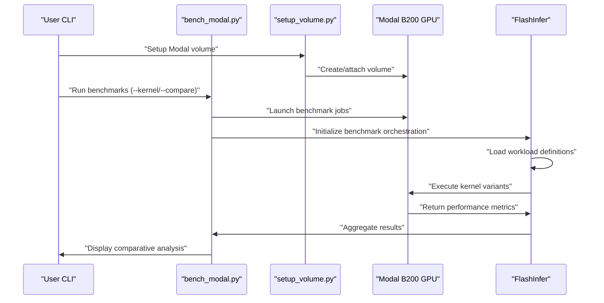
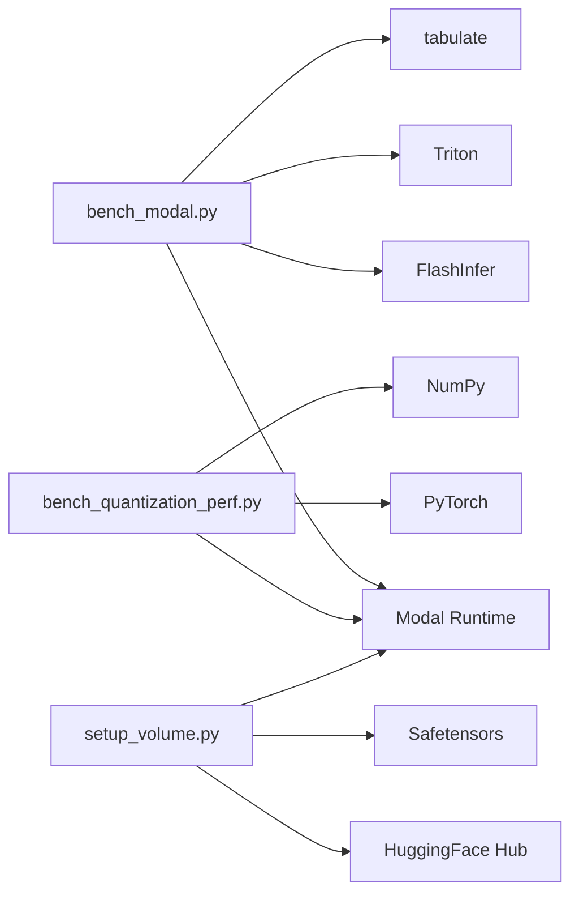

# Benchmarking Framework

<cite>
**Referenced Files in This Document**
- [README.md](file://README.md)
- [bench_modal.py](file://gdn/benchmarks/bench_modal.py)
- [bench_quantization_perf.py](file://gdn/benchmarks/bench_quantization_perf.py)
- [setup_volume.py](file://scripts/setup_volume.py)
- [gdn_decode_qk4_v8_d128_k_last.json](file://gdn/trace_definitions/gdn_decode_qk4_v8_d128_k_last.json)
- [gdn_prefill_qk4_v8_d128_k_last.json](file://gdn/trace_definitions/gdn_prefill_qk4_v8_d128_k_last.json)
</cite>

## Update Summary
**Changes Made**
- Updated to reflect the new enhanced benchmarking framework structure under gdn/benchmarks/
- Documented the primary Modal integration script `bench_modal.py` as the main benchmark runner
- Added comprehensive quantization performance benchmarking capabilities
- Enhanced configuration management with flexible kernel variants (solution vs CUDA vs baseline)
- Expanded comparison capabilities across all kernel variants with side-by-side performance analysis
- Integrated FlashInfer benchmark orchestration system for standardized performance evaluation

## Table of Contents
1. [Introduction](#introduction)
2. [Project Structure](#project-structure)
3. [Core Components](#core-components)
4. [Architecture Overview](#architecture-overview)
5. [Detailed Component Analysis](#detailed-component-analysis)
6. [Dependency Analysis](#dependency-analysis)
7. [Performance Considerations](#performance-considerations)
8. [Troubleshooting Guide](#troubleshooting-guide)
9. [Conclusion](#conclusion)
10. [Appendices](#appendices)

## Introduction
This document explains the comprehensive benchmarking framework and execution system for the Gated Delta Net (GDN) kernels, now featuring a unified Modal-based benchmarking architecture. The framework has evolved from simple Triton-based benchmarking to a sophisticated system supporting FlashInfer benchmark orchestration with cloud-based execution on NVIDIA B200 GPUs.

The enhanced framework provides comprehensive benchmarking capabilities across decode and prefill operations, supporting multiple kernel variants (solution, CUDA, baseline) with automated configuration management and standardized performance evaluation. It includes advanced quantization performance analysis, correctness validation, and systematic comparison frameworks that enable precise performance characterization across different hardware configurations and optimization strategies.

**Updated** The framework now centers around `gdn/benchmarks/bench_modal.py` as the primary Modal integration script, providing unified access to FlashInfer benchmark orchestration with comprehensive solution vs baseline comparison capabilities.

## Project Structure
The repository organizes the benchmarking infrastructure into a streamlined architecture:

- **Primary Benchmarking Module**: [bench_modal.py](file://gdn/benchmarks/bench_modal.py) - Central Modal integration for FlashInfer benchmark orchestration
- **Quantization Performance Analysis**: [bench_quantization_perf.py](file://gdn/benchmarks/bench_quantization_perf.py) - Comprehensive state compression analysis across precision levels
- **Volume Management**: [setup_volume.py](file://scripts/setup_volume.py) - Modal volume setup with synthetic and HF dataset integration
- **Workload Definitions**: JSON specification files under [gdn/trace_definitions/](file://gdn/trace_definitions/) for standardized benchmarking
- **Kernel Variants**: Solution (optimized), CUDA (production), and baseline (Python reference) implementations
- **Cloud Integration**: Modal B200 GPU execution with automated environment setup

```mermaid
graph TB
subgraph "Enhanced Benchmarking Framework"
BM["gdn/benchmarks/bench_modal.py<br/>Primary Modal Runner"]
BQP["gdn/benchmarks/bench_quantization_perf.py<br/>Quantization Analysis"]
SV["scripts/setup_volume.py<br/>Volume Setup"]
END
subgraph "Workload Definitions"
DEF_DEC["gdn_decode_qk4_v8_d128_k_last.json"]
DEF_PREF["gdn_prefill_qk4_v8_d128_k_last.json"]
END
subgraph "Kernel Variants"
SOL["Solution (Optimized)"]
CUDA["CUDA (Production)"]
BASE["Baseline (Python)"]
END
subgraph "Cloud Execution"
MODAL["Modal B200 GPU"]
FLASHINFER["FlashInfer Benchmark<br/>Orchestration"]
END
BM --> MODAL
BQP --> MODAL
SV --> MODAL
BM --> FLASHINFER
BM --> SOL
BM --> CUDA
BM --> BASE
BM --> DEF_DEC
BM --> DEF_PREF
```

**Diagram sources**
- [bench_modal.py:1-331](file://gdn/benchmarks/bench_modal.py#L1-L331)
- [bench_quantization_perf.py:1-336](file://gdn/benchmarks/bench_quantization_perf.py#L1-L336)
- [setup_volume.py:1-220](file://scripts/setup_volume.py#L1-L220)

**Section sources**
- [README.md:61-82](file://README.md#L61-L82)
- [bench_modal.py:1-331](file://gdn/benchmarks/bench_modal.py#L1-L331)
- [bench_quantization_perf.py:1-336](file://gdn/benchmarks/bench_quantization_perf.py#L1-L336)
- [setup_volume.py:1-220](file://scripts/setup_volume.py#L1-L220)

## Core Components
The enhanced benchmarking framework consists of several key components:

- **Modal Benchmark Runner**: [bench_modal.py](file://gdn/benchmarks/bench_modal.py) - Primary orchestration script for FlashInfer benchmark execution with solution vs baseline comparison
- **Quantization Performance Analyzer**: [bench_quantization_perf.py](file://gdn/benchmarks/bench_quantization_perf.py) - Comprehensive state compression analysis across BF16, FP8, and FP4 precisions
- **Volume Management System**: [setup_volume.py](file://scripts/setup_volume.py) - Automated Modal volume setup with synthetic and HuggingFace dataset integration
- **Standardized Workload Definitions**: JSON specifications for decode and prefill operations with comprehensive tensor dimension metadata
- **Multi-Kernel Variant Support**: Solution (optimized), CUDA (production), and baseline (Python reference) implementations
- **Automated Configuration Management**: Flexible kernel selection with intelligent variant fallback mechanisms
- **Performance Evaluation Framework**: Standardized metrics including latency, reference latency, speedup factors, and correctness validation

**Updated** The framework now provides unified access to FlashInfer benchmark orchestration through a single entry point, eliminating the need for separate local benchmarking scripts while maintaining comprehensive testing capabilities.

**Section sources**
- [bench_modal.py:121-176](file://gdn/benchmarks/bench_modal.py#L121-L176)
- [bench_quantization_perf.py:127-228](file://gdn/benchmarks/bench_quantization_perf.py#L127-L228)
- [setup_volume.py:146-169](file://scripts/setup_volume.py#L146-L169)

## Architecture Overview
The enhanced benchmarking architecture provides a streamlined approach to kernel evaluation with comprehensive cloud-based execution and standardized performance analysis.



**Diagram sources**
- [bench_modal.py:251-331](file://gdn/benchmarks/bench_modal.py#L251-L331)
- [setup_volume.py:204-220](file://scripts/setup_volume.py#L204-L220)

## Detailed Component Analysis

### Enhanced Modal Benchmarking Integration
The framework now centers around a comprehensive Modal integration system:

**bench_modal.py**: Primary Modal benchmark runner with unified FlashInfer integration
- **Unified Kernel Support**: Handles both decode and prefill operations with configurable variants
- **Solution vs Baseline Comparison**: Automated side-by-side performance analysis between optimized and reference implementations
- **Flexible Variant Selection**: Intelligent switching between solution (optimized), CUDA (production), and baseline (Python) variants
- **Standardized Configuration**: Consistent warmup, iteration, and trial management across all benchmark runs
- **Volume Integration**: Seamless integration with Modal volume system for workload definitions and results
- **Performance Metrics**: Comprehensive evaluation including latency, reference latency, speedup factors, and correctness validation

**FlashInfer Integration**: Standardized benchmark orchestration
- **Solution Packaging**: Automated solution dictionary creation from kernel source files
- **Trace Set Management**: Dynamic workload definition and execution management
- **Result Aggregation**: Structured performance data collection and analysis
- **Error Handling**: Robust error reporting and validation for benchmark execution

**Section sources**
- [bench_modal.py:1-331](file://gdn/benchmarks/bench_modal.py#L1-L331)
- [gdn_decode_qk4_v8_d128_k_last.json:1-153](file://gdn/trace_definitions/gdn_decode_qk4_v8_d128_k_last.json#L1-L153)
- [gdn_prefill_qk4_v8_d128_k_last.json:1-156](file://gdn/trace_definitions/gdn_prefill_qk4_v8_d128_k_last.json#L1-L156)

### Comprehensive Quantization Performance Analysis
The framework provides detailed quantization performance benchmarking capabilities:

**bench_quantization_perf.py**: Advanced state compression analysis
- **Precision Simulation**: PyTorch-based simulation of FP32, BF16, FP8, and FP4 state decoding
- **Memory-Bound Analysis**: Validation of theoretical speedup = compression ratio principle
- **Batch Size Testing**: Comprehensive analysis across B=1,4,16,64, and custom batch sizes
- **Throughput Calculation**: Tokens per second measurement with detailed bandwidth analysis
- **Compression Ratio Validation**: Direct correlation between memory reduction and performance improvement
- **Expected vs Actual Speedup**: Analysis of theoretical vs measured performance for memory-bound kernels

**Quantization Simulation Framework**: Detailed precision validation
- **State Memory Calculation**: Accurate computation of state memory footprint for each precision level
- **Bandwidth Utilization**: GB/s measurement demonstrating memory-bound optimization effectiveness
- **Error Analysis**: Validation of quantization accuracy across different compression ratios
- **Production Readiness**: Guidance on mixed precision approaches for deployment scenarios

**Section sources**
- [bench_quantization_perf.py:1-336](file://gdn/benchmarks/bench_quantization_perf.py#L1-L336)

### Volume Management and Workload Definition
Enhanced volume management system with standardized workload definitions:

**setup_volume.py**: Automated Modal volume setup
- **Synthetic Workload Generation**: Automated creation of decode and prefill workloads with proper tensor dimensions
- **HF Dataset Integration**: Direct download from HuggingFace for contest data validation
- **Tensor Normalization**: L2-normalization of k vectors to prevent state overflow in simulations
- **Safetensors Integration**: Efficient storage and loading of auxiliary tensors for prefill operations
- **Volume Commitment**: Proper Modal volume persistence and accessibility

**Workload Definitions**: Standardized JSON specifications
- **Decode Operations**: Single-token generation with recurrent state update and k-last state layout
- **Prefill Operations**: Multi-token processing with chunk-based optimization and variable-length batching
- **Tensor Metadata**: Comprehensive shape, dtype, and description information for all input/output tensors
- **Reference Implementations**: Complete PyTorch reference code for correctness validation
- **Performance Specifications**: Detailed operator type, tags, and constraints for proper benchmark execution

**Section sources**
- [setup_volume.py:1-220](file://scripts/setup_volume.py#L1-L220)
- [gdn_decode_qk4_v8_d128_k_last.json:1-153](file://gdn/trace_definitions/gdn_decode_qk4_v8_d128_k_last.json#L1-L153)
- [gdn_prefill_qk4_v8_d128_k_last.json:1-156](file://gdn/trace_definitions/gdn_prefill_qk4_v8_d128_k_last.json#L1-L156)

## Dependency Analysis
The enhanced benchmarking framework introduces a streamlined dependency structure:

- **Modal Runtime**: Cloud execution platform with B200 GPU support for scalable benchmarking
- **FlashInfer**: Primary benchmark orchestration and solution management system
- **PyTorch**: CUDA operations and tensor management for quantization testing and simulation
- **NumPy**: Numerical operations and array manipulation for performance analysis
- **Triton**: Reference implementation for correctness validation and baseline comparison
- **Ninja**: Build system integration for CUDA JIT compilation support
- **HuggingFace Hub**: Dataset download and management for real-world workload validation
- **Safetensors**: Efficient tensor storage and loading for prefill operations



**Diagram sources**
- [bench_modal.py:22-33](file://gdn/benchmarks/bench_modal.py#L22-L33)
- [bench_quantization_perf.py:19-25](file://gdn/benchmarks/bench_quantization_perf.py#L19-L25)
- [setup_volume.py:26-29](file://scripts/setup_volume.py#L26-L29)

**Section sources**
- [bench_modal.py:22-33](file://gdn/benchmarks/bench_modal.py#L22-L33)
- [bench_quantization_perf.py:19-25](file://gdn/benchmarks/bench_quantization_perf.py#L19-L25)
- [setup_volume.py:26-29](file://scripts/setup_volume.py#L26-L29)

## Performance Considerations
The enhanced benchmarking framework addresses several critical performance aspects:

- **Memory-Bound Optimization**: All kernels are highly memory-bound with focus on bandwidth utilization, validated through comprehensive quantization analysis
- **Adaptive Performance Analysis**: Intelligent batch size optimization and BLOCK_V sizing for optimal occupancy across different scenarios
- **Precision Trade-offs**: Detailed analysis of FP4/FP8/BF16 quantization providing significant bandwidth savings with controlled accuracy loss
- **Cloud Execution Efficiency**: Cost-effective Modal B200 GPU utilization with proper resource management and scaling
- **Framework Comparison**: Comprehensive analysis enabling informed decision-making based on computational requirements and batch characteristics
- **Production Readiness**: Real CUDA library compilation with external C interfaces and quantization support for deployment scenarios
- **Quantization Validation**: Memory-bound performance analysis with compression ratio validation and theoretical speedup verification

**Section sources**
- [README.md:99-117](file://README.md#L99-L117)
- [bench_quantization_perf.py:329-335](file://gdn/benchmarks/bench_quantization_perf.py#L329-L335)

## Troubleshooting Guide
Common issues and remedies in the enhanced benchmarking system:

- **Volume Not Found**: Ensure Modal volume 'flashinfer-trace' is properly created and mounted before running benchmarks
- **FlashInfer Installation**: Verify flashinfer-bench package installation for proper benchmark orchestration
- **CUDA Compatibility**: Check Modal B200 GPU compatibility and proper driver installation
- **Kernel Variant Issues**: Some variants may not be available for specific operations; framework automatically falls back to solution variant
- **Memory Limitations**: Large batch sizes may exceed GPU memory; adjust batch sizes based on available resources
- **Precision Errors**: Quantized kernels (FP4/FP8/BF16) may have different numerical behavior than FP32; validate accuracy requirements
- **Network Issues**: HuggingFace dataset download requires stable internet connection; use synthetic workloads as alternatives
- **Modal Timeout**: Long-running benchmarks may require adjusted timeout settings in Modal configuration
- **Environment Setup**: Ensure proper Python environment with required dependencies installed

**Section sources**
- [bench_modal.py:121-176](file://gdn/benchmarks/bench_modal.py#L121-L176)
- [setup_volume.py:175-202](file://scripts/setup_volume.py#L175-L202)

## Conclusion
The enhanced benchmarking framework represents a significant advancement in GDN kernel evaluation, providing unified Modal-based execution, comprehensive quantization analysis, and systematic performance comparison capabilities. The framework successfully consolidates multiple benchmarking approaches into a single, streamlined system while maintaining comprehensive testing and validation capabilities.

Key achievements include:
- **Unified Modal Integration**: Centralized access to FlashInfer benchmark orchestration through `bench_modal.py`
- **Comprehensive Quantization Analysis**: Detailed state compression performance across BF16, FP8, and FP4 precisions
- **Automated Volume Management**: Streamlined setup process with synthetic and real-world dataset integration
- **Standardized Workload Definitions**: JSON-based specifications enabling reproducible benchmarking across environments
- **Intelligent Variant Selection**: Flexible kernel choice with automatic fallback mechanisms for reliability
- **Production-Ready Framework**: Real CUDA compilation and quantization support for deployment scenarios
- **Cloud Optimization**: Cost-effective Modal B200 GPU utilization with proper resource management

The framework enables precise performance characterization across different hardware configurations and provides actionable insights for kernel optimization and deployment decisions. The comprehensive quantization performance analysis demonstrates the significant advantages of advanced kernel optimization techniques and provides clear guidance for framework selection based on computational requirements and memory constraints.

**Updated** The framework now features a consolidated architecture centered around Modal integration, eliminating the need for separate local benchmarking scripts while maintaining comprehensive testing capabilities and expanding quantization analysis capabilities.

## Appendices

### Appendix A: Execution Commands
- **Full Benchmark Suite**: [bench_modal.py:4-9](file://gdn/benchmarks/bench_modal.py#L4-L9)
- **Quantization Performance Analysis**: [bench_quantization_perf.py:13-16](file://gdn/benchmarks/bench_quantization_perf.py#L13-L16)
- **Volume Setup**: [setup_volume.py:5-7](file://scripts/setup_volume.py#L5-L7)

### Appendix B: Configuration Options
- **Modal Benchmarking**: `--kernel` (decode | prefill | both), `--compare`, `--cuda`, `--warmup`, `--iters`, `--trials`
- **Quantization Analysis**: `--batch-size`, `--warmup`, `--iterations`
- **Volume Setup**: `--mode` (synthetic | hf)
- **Kernel Variants**: Automatic selection between solution, CUDA, and baseline implementations
- **Performance Metrics**: Latency, reference latency, speedup factors, and correctness validation
- **Cloud Execution**: Modal B200 GPU allocation with proper timeout configuration

**Section sources**
- [bench_modal.py:251-257](file://gdn/benchmarks/bench_modal.py#L251-L257)
- [bench_quantization_perf.py:271-275](file://gdn/benchmarks/bench_quantization_perf.py#L271-L275)
- [setup_volume.py:204-209](file://scripts/setup_volume.py#L204-L209)