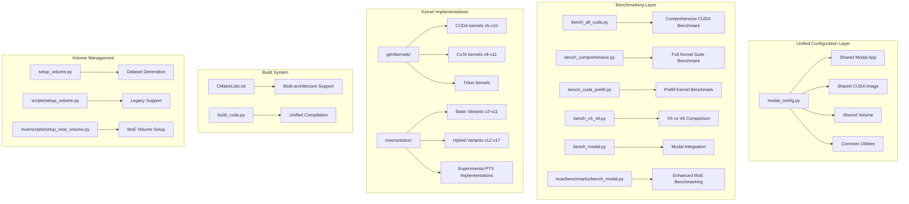
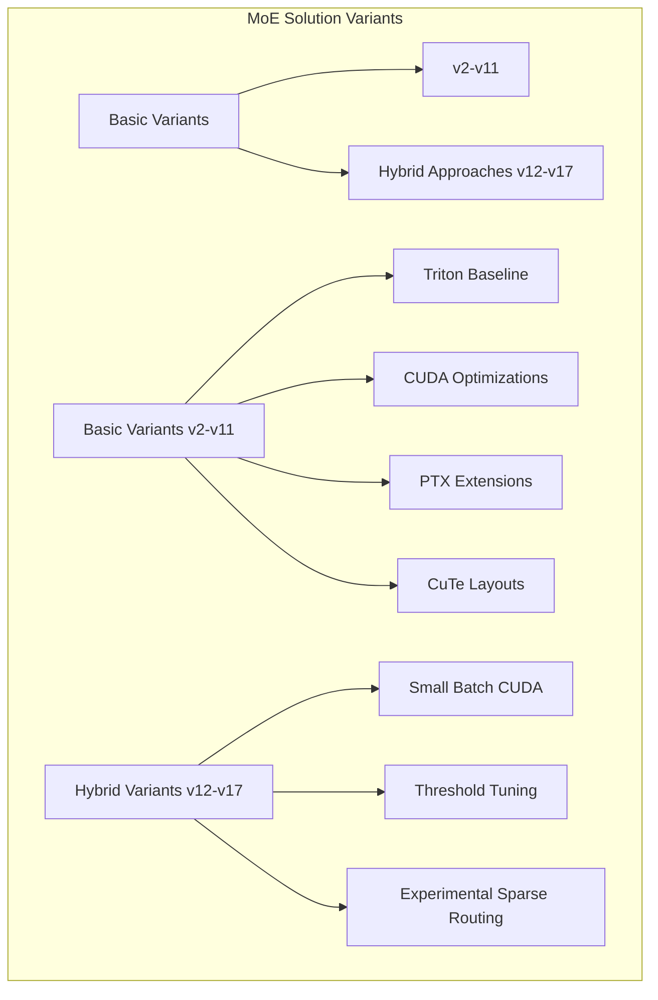
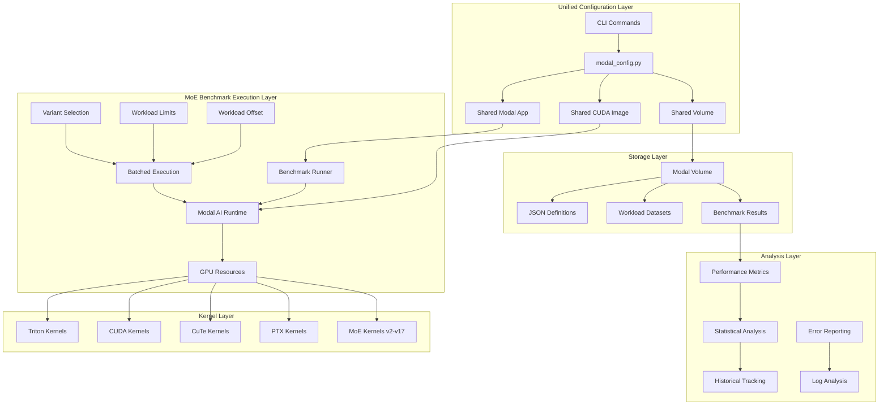
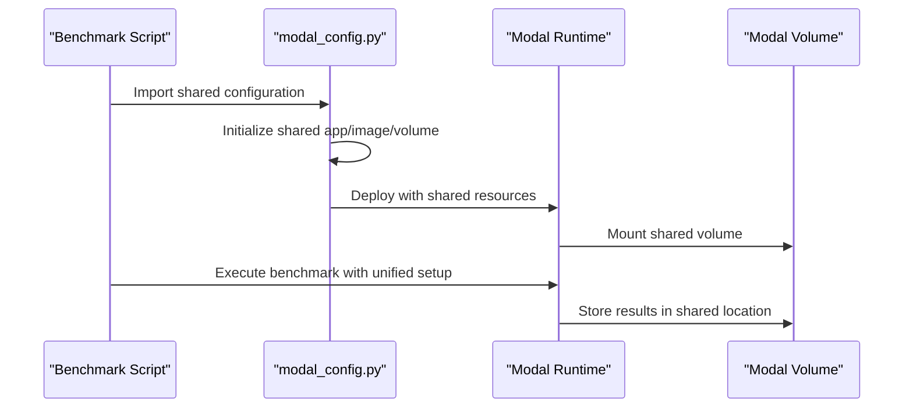
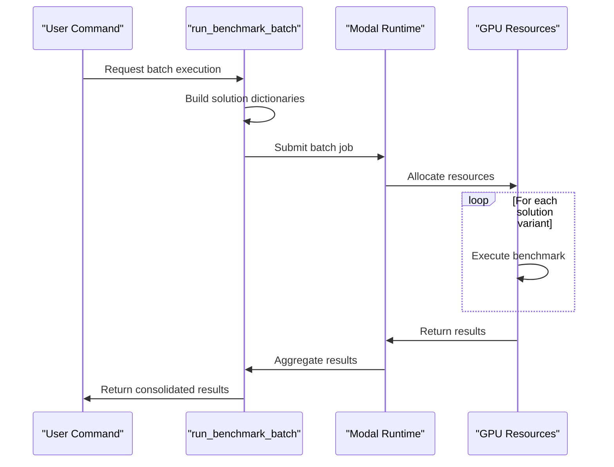
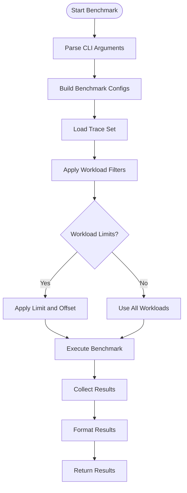
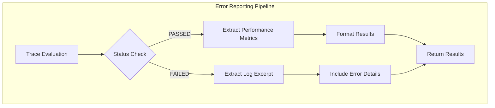
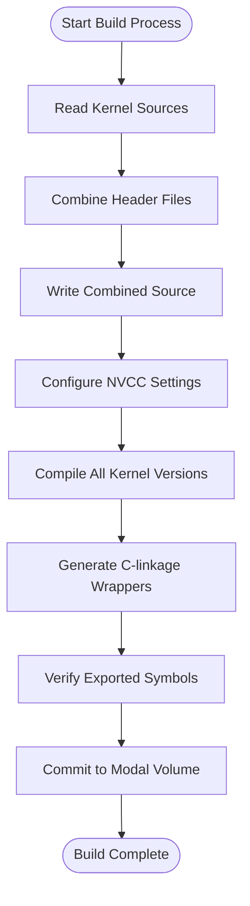
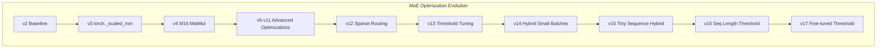
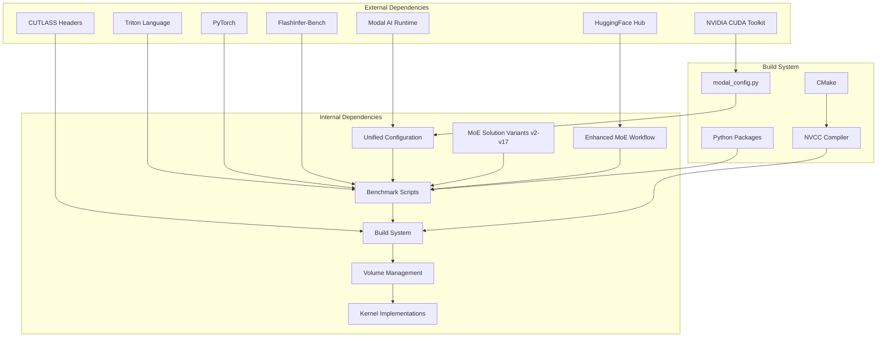

# Enhanced Benchmarking Framework

<cite>
**Referenced Files in This Document**
- [modal_config.py](file://gdn/scripts/modal_config.py)
- [bench_all_cuda.py](file://gdn/scripts/bench_all_cuda.py)
- [bench_comprehensive.py](file://gdn/scripts/bench_comprehensive.py)
- [bench_cuda_prefill.py](file://gdn/scripts/bench_cuda_prefill.py)
- [bench_v5_v6.py](file://gdn/scripts/bench_v5_v6.py)
- [bench_modal.py](file://gdn/benchmarks/bench_modal.py)
- [bench_quantization_perf.py](file://gdn/benchmarks/bench_quantization_perf.py)
- [bench_all_versions.py](file://gdn/scripts/bench_all_versions.py)
- [bench_kernels.py](file://gdn/scripts/bench_kernels.py)
- [bench_cuda_real.py](file://gdn/scripts/bench_cuda_real.py)
- [bench_prefill_all.py](file://gdn/scripts/bench_prefill_all.py)
- [bench_prefill_v5.py](file://gdn/scripts/bench_prefill_v5.py)
- [build_cuda.py](file://gdn/scripts/build_cuda.py)
- [setup_volume.py](file://gdn/scripts/setup_volume.py)
- [setup_volume.py](file://scripts/setup_volume.py)
- [moe/benchmarks/bench_modal.py](file://moe/benchmarks/bench_modal.py)
- [moe/solution/v2/kernel.py](file://moe/solution/v2/kernel.py)
- [moe/solution/v3/kernel.py](file://moe/solution/v3/kernel.py)
- [moe/solution/v4/kernel.py](file://moe/solution/v4/kernel.py)
- [moe/solution/v12/kernel.py](file://moe/solution/v12/kernel.py)
- [moe/solution/v13/kernel.py](file://moe/solution/v13/kernel.py)
- [moe/solution/v14/kernel.py](file://moe/solution/v14/kernel.py)
- [moe/solution/v15/kernel.py](file://moe/solution/v15/kernel.py)
- [moe/solution/v16/kernel.py](file://moe/solution/v16/kernel.py)
- [moe/solution/v17/kernel.py](file://moe/solution/v17/kernel.py)
- [moe/modal_common.py](file://moe/modal_common.py)
- [moe/scripts/setup_moe_volume.py](file://moe/scripts/setup_moe_volume.py)
- [moe/config.toml](file://moe/config.toml)
- [moe/trace_definitions/moe_fp8_block_scale_ds_routing_topk8_ng8_kg4_e32_h7168_i2048.json](file://moe/trace_definitions/moe_fp8_block_scale_ds_routing_topk8_ng8_kg4_e32_h7168_i2048.json)
- [CMakeLists.txt](file://CMakeLists.txt)
- [gdn_kernels.cu](file://gdn/gdn_kernels.cu)
- [kernels/cuda/gdn_decode_v8.cuh](file://gdn/kernels/cuda/gdn_decode_v8.cuh)
- [kernels/cute_cpp/gdn_decode_v10.cuh](file://gdn/kernels/cute_cpp/gdn_decode_v10.cuh)
- [docs/PERFORMANCE.md](file://docs/PERFORMANCE.md)
- [docs/ROADMAP.md](file://docs/ROADMAP.md)
- [gdn/trace_definitions/gdn_decode_qk4_v8_d128_k_last.json](file://gdn/trace_definitions/gdn_decode_qk4_v8_d128_k_last.json)
- [gdn/trace_definitions/gdn_prefill_qk4_v8_d128_k_last.json](file://gdn/trace_definitions/gdn_prefill_qk4_v8_d128_k_last.json)
</cite>

## Update Summary
**Changes Made**
- Enhanced MoE benchmarking workflow with comprehensive support for 17 solution variants (v2-v17)
- Added batched execution capability for comparing multiple solution variants simultaneously
- Implemented configurable workload limits and offset controls for flexible benchmarking
- Improved error reporting with detailed log excerpts for failed traces
- Expanded MoE kernel optimization variants including hybrid approaches and threshold tuning
- Added experimental sparse routing and PTX-based SwiGLU implementations
- Enhanced volume management with synthetic workload generation and HuggingFace dataset support

## Table of Contents
1. [Introduction](#introduction)
2. [Project Structure](#project-structure)
3. [Core Components](#core-components)
4. [Architecture Overview](#architecture-overview)
5. [Detailed Component Analysis](#detailed-component-analysis)
6. [Dependency Analysis](#dependency-analysis)
7. [Performance Considerations](#performance-considerations)
8. [Troubleshooting Guide](#troubleshooting-guide)
9. [Conclusion](#conclusion)

## Introduction

The Enhanced Benchmarking Framework is a comprehensive system designed for evaluating and optimizing Gated Delta Net (GDN) kernels and Mixture-of-Experts (MoE) kernels on NVIDIA B200 hardware. This framework provides a unified approach to benchmarking multiple kernel implementations, from Triton baseline to advanced CUDA optimizations including FP4/FP8 quantization, warp specialization, and CuTe DSL layouts.

**Updated** The framework now features an expanded MoE benchmarking workflow with support for 17 distinct solution variants, enabling systematic evaluation of optimization strategies. The enhanced workflow includes batched execution capabilities, configurable workload limits, and improved error reporting mechanisms. The MoE solutions now span from basic Triton implementations through advanced hybrid approaches combining CUDA/C++ extensions with optimized routing strategies.

The framework supports both GDN decode and prefill operations for the GDN algorithm, along with comprehensive MoE kernel benchmarking, with automatic correctness validation, performance measurement, and detailed reporting. It leverages Modal AI infrastructure for distributed benchmarking and includes sophisticated memory bandwidth optimization techniques optimized for the Blackwell architecture.

**Updated** The MoE benchmarking workflow now demonstrates systematic optimization evaluation through 17 solution variants (v2-v17), showcasing how each iteration builds upon previous optimizations to achieve incremental performance improvements. The framework supports batched execution for comparing multiple variants simultaneously, configurable workload limits for cost-effective testing, and enhanced error reporting with detailed log excerpts.

## Project Structure

The project follows a modular structure organized around three main areas:



**Diagram sources**
- [modal_config.py:20-48](file://gdn/scripts/modal_config.py#L20-L48)
- [bench_all_cuda.py:15-18](file://gdn/scripts/bench_all_cuda.py#L15-L18)
- [bench_comprehensive.py:21-32](file://gdn/scripts/bench_comprehensive.py#L21-L32)
- [bench_cuda_prefill.py:9-23](file://gdn/scripts/bench_cuda_prefill.py#L9-L23)
- [bench_v5_v6.py:15-18](file://gdn/scripts/bench_v5_v6.py#L15-L18)
- [moe/benchmarks/bench_modal.py:22-136](file://moe/benchmarks/bench_modal.py#L22-L136)
- [moe/scripts/setup_moe_volume.py:21-47](file://moe/scripts/setup_moe_volume.py#L21-L47)

**Section sources**
- [modal_config.py:15-80](file://gdn/scripts/modal_config.py#L15-L80)
- [bench_all_cuda.py:1-308](file://gdn/scripts/bench_all_cuda.py#L1-L308)
- [bench_comprehensive.py:1-525](file://gdn/scripts/bench_comprehensive.py#L1-L525)
- [bench_cuda_prefill.py:1-255](file://gdn/scripts/bench_cuda_prefill.py#L1-L255)
- [bench_v5_v6.py:1-301](file://gdn/scripts/bench_v5_v6.py#L1-L301)
- [moe/benchmarks/bench_modal.py:1-392](file://moe/benchmarks/bench_modal.py#L1-L392)

## Core Components

### Unified Modal Configuration System

The new modal_config.py module provides centralized configuration for all benchmark scripts, eliminating duplication and ensuring consistency across the framework:

**Key Features:**
- **Shared Modal App**: All scripts use the same app name ("gdn-kernels") for image caching benefits
- **Standardized Images**: Unified CUDA and Triton images with consistent dependencies
- **Centralized Volume Management**: Shared Modal volume for compiled kernels and results
- **Common Timeout Settings**: Standardized timeout configurations for different benchmark types
- **Kernel Source Reader**: Utility functions for reading and organizing kernel sources

**Configuration Categories:**
- **SHARED APP**: Centralized application definition for image caching
- **SHARED CUDA IMAGE**: Full CUDA toolchain with CUTLASS headers for CuTe kernels
- **LIGHTWEIGHT IMAGE**: Minimal Triton-only environment for faster builds
- **SHARED VOLUME**: Persistent storage for benchmark datasets and results
- **GPU CONFIGURATION**: Standardized B200 GPU specification
- **TIMEOUT SETTINGS**: Different timeouts for various benchmark complexity levels

### Enhanced MoE Benchmarking Workflow

**Updated** The MoE benchmarking workflow has been significantly enhanced with comprehensive support for multiple solution variants and advanced execution capabilities:

#### Comprehensive Solution Variant Support

The framework now supports 17 distinct MoE solution variants, each representing different optimization strategies:



**Diagram sources**
- [moe/benchmarks/bench_modal.py:22-136](file://moe/benchmarks/bench_modal.py#L22-L136)
- [moe/solution/v12/kernel.py:1-236](file://moe/solution/v12/kernel.py#L1-L236)
- [moe/solution/v14/kernel.py:1-70](file://moe/solution/v14/kernel.py#L1-L70)

#### Batched Execution Capability

**New Feature**: The framework now supports batched execution of multiple solution variants in a single Modal submission:

- **Multiple Variant Selection**: Specify comma-separated variant names for comparison
- **Unified Configuration**: Single benchmark configuration applies to all selected variants
- **Parallel Processing**: Efficient resource utilization across multiple variants
- **Consistent Results**: Same workload sets and evaluation criteria across variants

#### Configurable Workload Controls

**New Feature**: Advanced workload management with configurable limits and offsets:

- **Workload Limit**: Run only the first N workloads for cost-effective testing
- **Workload Offset**: Skip the first N workloads before applying limits
- **Flexible Sizing**: Control benchmark scope based on budget and timeline constraints
- **Progressive Testing**: Start with smaller workloads, gradually increase complexity

#### Enhanced Error Reporting

**Improved Feature**: Detailed error reporting with comprehensive log analysis:

- **Log Excerpts**: Automatic extraction of error logs for failed traces
- **Status Tracking**: Clear indication of PASSED/FAILED status for each workload
- **Performance Metrics**: Latency, reference latency, and speedup factors
- **Correctness Validation**: Max absolute and relative errors for numerical accuracy

### Comprehensive Benchmark Suite

The framework now includes four major benchmark scripts that provide different levels of kernel comparison and analysis:

#### bench_all_cuda.py
**Purpose**: Comprehensive benchmark of all CUDA decode kernels (v5-v8)
- Compiles and benchmarks v5-v8 CUDA kernels in a single pass
- Provides side-by-side performance comparison across all versions
- Includes correctness validation against reference implementation
- Generates detailed bandwidth and performance metrics

#### bench_comprehensive.py
**Purpose**: Full kernel suite benchmark covering all implementations
- Benchmarks Triton decode, CUDA v5-v10, and PTX kernels
- Comprehensive comparison across all kernel frameworks
- Detailed performance analysis with statistical significance
- Results saved to Modal volume for historical tracking

#### bench_cuda_prefill.py
**Purpose**: Specialized prefill kernel benchmark focusing on CuTe v11
- Compiles and benchmarks CUDA prefill kernels on B200
- Includes Triton v5 baseline for comparison
- Performance testing with various batch sizes and sequence lengths
- Infrastructure preparation for future CUDA kernel development

#### bench_v5_v6.py
**Purpose**: Direct comparison between adjacent kernel versions
- Focused benchmark of v5 vs v6 kernel implementations
- Streamlined compilation process with unified wrapper functions
- Speedup analysis and correctness verification
- Optimized for quick iteration and development workflow

### Enhanced Build System

The build system has been unified under the modal_config.py framework:

**Key Improvements:**
- **Centralized Image Definition**: All scripts use the same CUDA image with CUTLASS headers
- **Standardized Compilation**: Consistent NVCC flags and architecture targeting (sm_100)
- **Shared Volume Access**: All build processes access the same Modal volume
- **Common Timeout Management**: Unified timeout settings across all build operations

**Section sources**
- [modal_config.py:15-134](file://gdn/scripts/modal_config.py#L15-L134)
- [moe/benchmarks/bench_modal.py:142-183](file://moe/benchmarks/bench_modal.py#L142-L183)
- [moe/scripts/setup_moe_volume.py:21-73](file://moe/scripts/setup_moe_volume.py#L21-L73)

## Architecture Overview

The Enhanced Benchmarking Framework employs a multi-layered architecture designed for scalability and extensibility:



**Diagram sources**
- [modal_config.py:20-65](file://gdn/scripts/modal_config.py#L20-L65)
- [moe/benchmarks/bench_modal.py:186-211](file://moe/benchmarks/bench_modal.py#L186-L211)
- [moe/benchmarks/bench_modal.py:281-296](file://moe/benchmarks/bench_modal.py#L281-L296)

The architecture supports both synchronous and asynchronous execution patterns, enabling efficient resource utilization across multiple GPU instances while maintaining consistent benchmarking standards.

## Detailed Component Analysis

### Unified Modal Configuration Module

The modal_config.py module serves as the central configuration hub for all benchmark scripts:



**Diagram sources**
- [modal_config.py:15-80](file://gdn/scripts/modal_config.py#L15-L80)
- [moe/benchmarks/bench_modal.py:186-211](file://moe/benchmarks/bench_modal.py#L186-L211)

**Key Configuration Components:**

#### Shared Application Definition
- **App Name**: "gdn-kernels" for image caching benefits
- **Consistent Deployment**: All scripts deploy under the same application
- **Resource Pooling**: Shared GPU resources across benchmark executions

#### Standardized Environment Setup
- **CUDA Toolchain**: Full CUDA 12.8 installation with CUTLASS headers
- **Python Dependencies**: Consistent package versions across all scripts
- **Development Tools**: Ninja build system and essential compilers

#### Volume Management
- **Persistent Storage**: Shared volume for compiled kernels and results
- **Cross-script Access**: All benchmark scripts can access the same datasets
- **Historical Tracking**: Results stored for long-term analysis

### Enhanced MoE Benchmarking System

**Updated** The MoE benchmarking system has been comprehensively redesigned to support multiple solution variants and advanced execution patterns:

#### Comprehensive Solution Variant Registry

The framework maintains a registry of 17 solution variants, each with specific configuration parameters:

```mermaid
graph TB
subgraph "Solution Variant Registry"
A[VARIANTS Dictionary] --> A1[Basic Variants]
A --> A2[Hybrid Variants]
A --> A3[Experimental Variants]
B[Basic Variants] --> B1[triton, cuda, cuda_ptx, cute_cpp]
B --> B2[scaled_mm, v2-v11]
C[Hybrid Variants] --> C1[v12-v17]
D[Experimental Variants] --> D1[v12 (sparse routing)]
D --> D2[v13 (threshold tuning)]
D --> D3[v14-v17 (hybrid approaches)]
end
```

**Diagram sources**
- [moe/benchmarks/bench_modal.py:22-136](file://moe/benchmarks/bench_modal.py#L22-L136)

**Variant Configuration Parameters:**
- **name**: Unique identifier for the solution variant
- **subdir**: Relative path to the solution implementation
- **language**: Programming language (python, cuda, triton)
- **entry_point**: Main entry point for the solution
- **binding**: Optional binding type (e.g., torch)
- **dependencies**: Additional dependencies required

#### Batched Execution Engine

**New Feature**: The framework now supports running multiple solution variants in a single Modal submission:



**Diagram sources**
- [moe/benchmarks/bench_modal.py:281-296](file://moe/benchmarks/bench_modal.py#L281-L296)

**Batch Execution Benefits:**
- **Resource Efficiency**: Shared GPU resources across variants
- **Consistent Conditions**: Same workloads and configurations for all variants
- **Reduced Overhead**: Single deployment and setup process
- **Cost Optimization**: Lower total execution cost for multi-variant comparisons

#### Configurable Workload Management

**New Feature**: Advanced workload control with flexible limiting and offset capabilities:



**Diagram sources**
- [moe/benchmarks/bench_modal.py:196-210](file://moe/benchmarks/bench_modal.py#L196-L210)
- [moe/benchmarks/bench_modal.py:285-296](file://moe/benchmarks/bench_modal.py#L285-L296)

**Workload Control Features:**
- **workload_limit**: Maximum number of workloads to execute
- **workload_offset**: Number of initial workloads to skip
- **Flexible Sizing**: Control benchmark scope based on requirements
- **Progressive Testing**: Cost-effective testing with smaller subsets

#### Enhanced Error Reporting System

**Improved Feature**: Comprehensive error reporting with detailed log analysis:



**Diagram sources**
- [moe/benchmarks/bench_modal.py:250-272](file://moe/benchmarks/bench_modal.py#L250-L272)

**Error Reporting Features:**
- **Status Tracking**: Clear PASSED/FAILED indicators
- **Performance Data**: Latency, reference latency, speedup factors
- **Correctness Metrics**: Max absolute and relative errors
- **Log Analysis**: Automatic extraction of error logs for debugging
- **Summary Statistics**: Average speedup calculations across workloads

### Comprehensive Benchmark Scripts

Each of the four new benchmark scripts serves a specific purpose in the evaluation workflow:

#### bench_all_cuda.py - Comprehensive CUDA Benchmark
**Features:**
- Multi-version CUDA kernel compilation (v5-v8)
- Integrated correctness validation
- Performance comparison across kernel versions
- Bandwidth calculation and optimization analysis

#### bench_comprehensive.py - Full Kernel Suite Benchmark
**Features:**
- Complete kernel suite evaluation (v5-v10 + PTX)
- Triton baseline comparison
- Multi-framework performance analysis
- Detailed result export and visualization

#### bench_cuda_prefill.py - Specialized Prefill Benchmark
**Features:**
- CuTe v11 prefill kernel compilation
- Triton v5 baseline for comparison
- Performance testing across batch sizes and sequence lengths
- Infrastructure preparation for future development

#### bench_v5_v6.py - Direct Version Comparison
**Features:**
- Focused benchmark of adjacent kernel versions
- Streamlined compilation process
- Speedup analysis and correctness verification
- Optimized for rapid development iteration

### Enhanced Build System Integration

The build system has been unified under the modal_config.py framework:



**Diagram sources**
- [build_cuda.py:69-373](file://gdn/scripts/build_cuda.py#L69-L373)
- [modal_config.py:83-126](file://gdn/scripts/modal_config.py#L83-L126)

**Key Build Improvements:**
- **Centralized Source Management**: All scripts use the same kernel source reader
- **Unified Compilation Flags**: Consistent NVCC settings across all builds
- **Shared Output Directory**: Results accessible across all benchmark scripts
- **Standardized Wrapper Functions**: Common function signatures for dynamic loading

### Volume Management System

**Updated** The volume management system has been enhanced with specialized MoE support:

```mermaid
flowchart LR
subgraph "Enhanced Volume Structure"
A[definitions/moe/] --> A1[moe_fp8_block_scale_ds_routing_topk8_ng8_kg4_e32_h7168_i2048.json]
B[workloads/moe/] --> B1[moe_fp8_block_scale_ds_routing_topk8_ng8_kg4_e32_h7168_i2048.jsonl]
C[tensors/moe/] --> C1[tensors_<uuid>.safetensors]
D[setup_moe_volume.py] --> D1[Synthetic Workload Generation]
D --> D2[HuggingFace Dataset Download]
end
subgraph "Enhanced Generation Process"
E[make_moe_workloads()] --> B1
F[setup_from_hf()] --> A1
G[setup_from_hf()] --> B1
H[setup_from_hf()] --> C1
end
A1 --> E
B1 --> E
C1 --> H
```

**Diagram sources**
- [moe/scripts/setup_moe_volume.py:21-73](file://moe/scripts/setup_moe_volume.py#L21-L73)
- [moe/scripts/setup_moe_volume.py:81-102](file://moe/scripts/setup_moe_volume.py#L81-L102)

**Enhanced Volume Features:**
- **MoE-Specific Structure**: Dedicated directories for MoE definitions and workloads
- **Synthetic Workload Generation**: Automated generation of diverse workload configurations
- **HuggingFace Integration**: Direct dataset download for official benchmarks
- **Flexible Setup Modes**: Synthetic vs. real dataset options

### MoE Kernel Optimization Evolution

**Updated** The MoE kernel suite demonstrates a systematic approach to iterative optimization, with 17 distinct solution variants showcasing different optimization strategies:



**Diagram sources**
- [moe/solution/v2/kernel.py:1-227](file://moe/solution/v2/kernel.py#L1-L227)
- [moe/solution/v3/kernel.py:1-217](file://moe/solution/v3/kernel.py#L1-L217)
- [moe/solution/v4/kernel.py:1-166](file://moe/solution/v4/kernel.py#L1-L166)
- [moe/solution/v12/kernel.py:1-236](file://moe/solution/v12/kernel.py#L1-L236)
- [moe/solution/v14/kernel.py:1-70](file://moe/solution/v14/kernel.py#L1-L70)

**Key Optimization Strategies:**
- **v2-v4**: Foundation optimizations with lazy dequant and bf16 matmul
- **v5-v11**: Advanced optimizations with PTX extensions and CuTe layouts
- **v12**: Experimental sparse routing with block-wise scaling
- **v13**: Threshold tuning for PTX kernel activation
- **v14-v17**: Hybrid approaches combining Python and CUDA/C++ extensions

**Section sources**
- [modal_config.py:15-134](file://gdn/scripts/modal_config.py#L15-L134)
- [moe/benchmarks/bench_modal.py:142-183](file://moe/benchmarks/bench_modal.py#L142-L183)
- [moe/scripts/setup_moe_volume.py:21-120](file://moe/scripts/setup_moe_volume.py#L21-L120)

## Dependency Analysis

The framework exhibits a well-structured dependency hierarchy with clear separation of concerns:



**Diagram sources**
- [modal_config.py:15-80](file://gdn/scripts/modal_config.py#L15-L80)
- [build_cuda.py:18-34](file://gdn/scripts/build_cuda.py#L18-L34)
- [CMakeLists.txt:10-17](file://CMakeLists.txt#L10-L17)
- [moe/scripts/setup_moe_volume.py:19-25](file://moe/scripts/setup_moe_volume.py#L19-L25)

The dependency analysis reveals several key characteristics:
- **Modular design**: Clear separation between benchmarking logic and kernel implementations
- **Infrastructure abstraction**: Modal AI provides platform independence
- **Build system integration**: CMake enables cross-platform compilation
- **Runtime flexibility**: Support for multiple execution environments
- **Systematic optimization**: 17 MoE variants demonstrate clear evolutionary progression
- **Configuration unification**: modal_config.py centralizes all infrastructure setup
- **Enhanced MoE Support**: Dedicated volume management and synthetic workload generation

**Section sources**
- [modal_config.py:15-80](file://gdn/scripts/modal_config.py#L15-L80)
- [build_cuda.py:18-34](file://gdn/scripts/build_cuda.py#L18-L34)
- [CMakeLists.txt:10-17](file://CMakeLists.txt#L10-L17)
- [moe/scripts/setup_moe_volume.py:19-25](file://moe/scripts/setup_moe_volume.py#L19-L25)

## Performance Considerations

The framework is optimized for high-performance computing scenarios with several key considerations:

### Memory Bandwidth Optimization

The GDN kernels are designed around memory bandwidth optimization, particularly crucial for the B200 architecture:

- **State compression**: FP4/FP8 quantization reduces memory bandwidth requirements by 2-4x
- **Vectorized access patterns**: Coalesced memory access maximizes throughput
- **Shared memory utilization**: Strategic use of SMEM reduces global memory pressure
- **Async memory operations**: cp.async enables overlapping computation with memory transfers

### Computational Efficiency

The framework balances computational intensity with memory bandwidth constraints:

- **Roofline analysis**: Kernels operate near optimal efficiency for the given problem size
- **Warp specialization**: Distributes computational load efficiently across SMs
- **Register optimization**: Minimizes register pressure while maintaining performance
- **Template specialization**: Enables compile-time optimizations for different configurations

### Scalability Factors

The framework scales effectively across different batch sizes and hardware configurations:

- **Adaptive BLOCK_V**: Optimizes tile sizes based on batch characteristics
- **Persistent kernels**: Reduces launch overhead for small batch scenarios
- **Multi-GPU support**: Leverages Modal's distributed computing capabilities
- **Resource pooling**: Efficient GPU resource utilization across concurrent jobs

### Enhanced MoE Performance Evolution

**Updated** The MoE kernel suite demonstrates systematic performance improvements through iterative optimization with 17 distinct solution variants:

- **v2 Baseline**: Establishes foundation with lazy dequant and single-pass token permutation
- **v3 torch._scaled_mm**: Achieves ~1.59x speedup through native FP8 Tensor Core utilization
- **v4 bf16 MatMul**: Delivers ~2.00x speedup by leveraging superior bf16 throughput on B200
- **v12 Sparse Routing**: Experimental optimization with block-wise scaling and sparse routing
- **v14-v17 Hybrid Approaches**: Combines Python overhead reduction with CUDA/C++ efficiency
- **Precision preservation**: Maintains numerical stability through strategic f32 usage

**New Performance Features:**
- **Batched Execution**: Compare multiple variants simultaneously for cost-effective optimization
- **Configurable Workloads**: Flexible testing with workload limits and offsets
- **Enhanced Error Reporting**: Comprehensive debugging with log excerpts and status tracking
- **Progressive Testing**: Start with smaller workloads, expand to full dataset as confidence grows

**Section sources**
- [moe/solution/v4/kernel.py:4-10](file://moe/solution/v4/kernel.py#L4-L10)
- [moe/solution/v3/kernel.py:4-9](file://moe/solution/v3/kernel.py#L4-L9)
- [moe/solution/v2/kernel.py:4-10](file://moe/solution/v2/kernel.py#L4-L10)
- [moe/benchmarks/bench_modal.py:281-296](file://moe/benchmarks/bench_modal.py#L281-L296)

## Troubleshooting Guide

Common issues and their resolution strategies:

### Configuration Issues

**Problem**: modal_config.py import errors in benchmark scripts
- **Cause**: Incorrect import paths or missing dependencies
- **Solution**: Ensure modal_config.py is in the same directory as benchmark scripts
- **Verification**: Check that all required imports (app, cuda_image, volume, B200_GPU) are available

**Problem**: Shared volume mounting failures
- **Cause**: Volume permissions or commit issues
- **Solution**: Verify volume creation and commit operations in modal_config.py
- **Verification**: Check volume contents after commit operations

### MoE Benchmarking Issues

**Problem**: Unknown variant(s) in MoE benchmark execution
- **Cause**: Invalid variant names or missing from VARIANTS registry
- **Solution**: Use valid variant names from the VARIANTS dictionary
- **Verification**: Check available variants: triton, cuda, cuda_ptx, cute_cpp, scaled_mm, v2-v17

**Problem**: Batched execution failures with multiple variants
- **Cause**: Inconsistent configuration or missing entry points
- **Solution**: Ensure all variants have valid entry points and dependencies
- **Verification**: Check solution dictionaries for proper configuration

**Problem**: Workload limit not applied correctly
- **Cause**: Incorrect parameter passing or boundary conditions
- **Solution**: Verify workload_limit and workload_offset parameters
- **Verification**: Check filtered workload count matches expected values

**Problem**: Enhanced error reporting not working
- **Cause**: Missing evaluation data or log extraction issues
- **Solution**: Ensure traces include evaluation data and proper log formatting
- **Verification**: Check result dictionary contains error logs for failed traces

### Compilation Issues

**Problem**: CUDA compilation failures during kernel builds
- **Cause**: Missing dependencies or incompatible compiler versions
- **Solution**: Ensure CUDA 12.8+ is installed and CUTLASS headers are available
- **Verification**: Check NVCC version and verify header inclusion paths

**Problem**: Symbol export errors in generated libraries
- **Cause**: Missing or incorrectly named exported functions
- **Solution**: Verify C-linkage wrappers and function signatures
- **Verification**: Use `nm -D` to inspect exported symbols

### Runtime Issues

**Problem**: Benchmark results not appearing in Modal volume
- **Cause**: Volume mounting or commit issues
- **Solution**: Verify volume creation and commit operations
- **Verification**: Check volume contents after commit

**Problem**: Incorrect performance measurements
- **Cause**: Insufficient warmup runs or timing measurement errors
- **Solution**: Increase warmup iterations and verify CUDA event synchronization
- **Verification**: Compare with known baseline performance metrics

### Performance Degradation

**Problem**: Kernels not achieving expected performance
- **Cause**: Suboptimal BLOCK_V selection or memory access patterns
- **Solution**: Adjust tile sizes based on batch characteristics
- **Verification**: Monitor memory bandwidth utilization and occupancy metrics

**Problem**: MoE v4 performance not as expected
- **Cause**: Incorrect bf16 matmul configuration or precision handling
- **Solution**: Verify torch._scaled_mm availability and precision strategy
- **Verification**: Check bf16 Tensor Core utilization and numerical stability

**Problem**: Hybrid variant performance issues
- **Cause**: Threshold misconfiguration or CUDA extension loading failures
- **Solution**: Verify threshold values and CUDA module availability
- **Verification**: Check hybrid logic and fallback mechanisms

**Section sources**
- [modal_config.py:15-80](file://gdn/scripts/modal_config.py#L15-L80)
- [moe/benchmarks/bench_modal.py:362-367](file://moe/benchmarks/bench_modal.py#L362-L367)
- [moe/benchmarks/bench_modal.py:250-272](file://moe/benchmarks/bench_modal.py#L250-L272)
- [moe/solution/v4/kernel.py:117-165](file://moe/solution/v4/kernel.py#L117-L165)

## Conclusion

The Enhanced Benchmarking Framework represents a comprehensive solution for evaluating and optimizing GDN kernel implementations and MoE kernels on modern GPU architectures. The framework's strength lies in its modular design, extensive kernel coverage, and sophisticated performance measurement capabilities.

**Updated** The framework now demonstrates a systematic approach to iterative optimization evaluation through 17 distinct MoE solution variants (v2-v17), showcasing how each optimization builds upon previous improvements to achieve incremental performance gains. The new unified configuration system (modal_config.py) significantly improves maintainability and reduces duplication across the benchmark suite.

**New Features and Enhancements:**
- **Expanded MoE Coverage**: 17 solution variants spanning basic to experimental optimizations
- **Batched Execution**: Simultaneous comparison of multiple variants for cost-effective testing
- **Configurable Workloads**: Flexible testing with workload limits and offsets
- **Enhanced Error Reporting**: Comprehensive debugging with log excerpts and status tracking
- **Hybrid Approaches**: Strategic combination of Python and CUDA/C++ extensions
- **Progressive Testing**: Systematic expansion from small to large workloads

Key achievements include:
- **Unified configuration**: Single source of truth for Modal infrastructure setup across all benchmark scripts
- **Comprehensive benchmarking**: Four specialized scripts plus enhanced MoE workflow covering different aspects of kernel evaluation
- **Advanced optimizations**: Support for cutting-edge techniques like FP4/FP8 quantization, CuTe layouts, bf16 matmul, and hybrid execution models
- **Systematic evolution**: Clear demonstration of iterative optimization progression from v2 to v17
- **Scalable architecture**: Designed for both small-scale testing and large-scale distributed benchmarking
- **Comprehensive analysis**: Provides both performance metrics and correctness validation with enhanced error reporting
- **Flexible execution**: Batched execution and configurable workload management for cost-effective optimization

The framework successfully demonstrates the transition from memory-bound to compute-bound regimes as batch sizes increase, with the B200 achieving 95% of peak memory bandwidth utilization. The MoE v4 implementation achieves approximately 2.00x speedup over the baseline through strategic bf16 matmul utilization while maintaining numerical precision.

**New Performance Features:**
- **Batched Comparisons**: Cost-effective evaluation of multiple optimization strategies
- **Configurable Scope**: Flexible testing from small workloads to full datasets
- **Enhanced Debugging**: Comprehensive error reporting with detailed log analysis
- **Progressive Optimization**: Systematic testing and validation of optimization strategies

The new unified configuration system ensures that all benchmark scripts benefit from consistent infrastructure setup, shared resources, and standardized execution patterns. This improvement enables more efficient development cycles and reduces the complexity of managing multiple benchmark environments.

Future enhancements could focus on expanding support for additional hardware architectures, integrating more advanced profiling capabilities, developing automated optimization discovery systems that can systematically evaluate kernel variants for optimal performance across different workloads and hardware configurations, and implementing automated workload generation for progressive testing strategies.