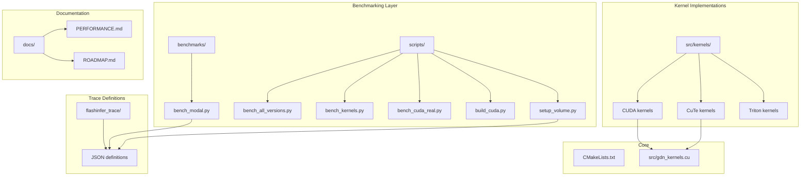
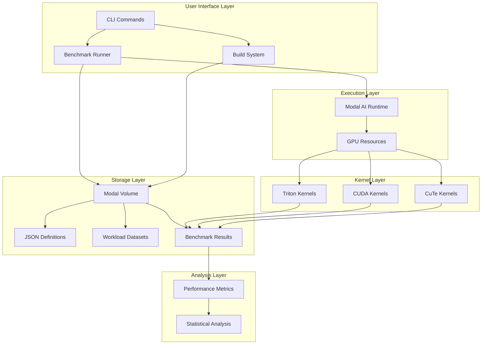
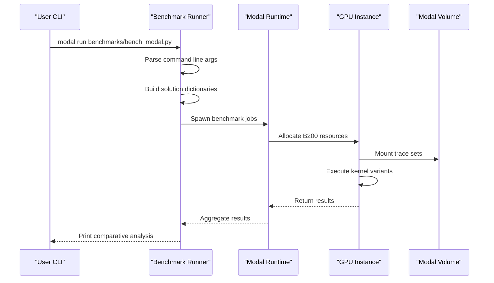
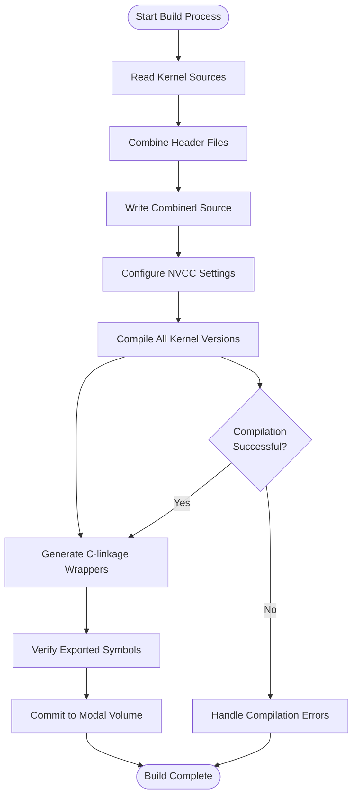
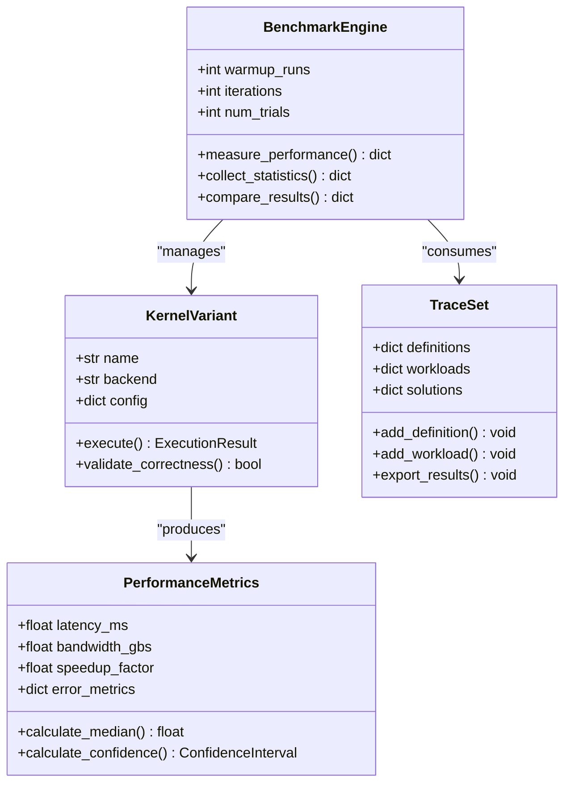
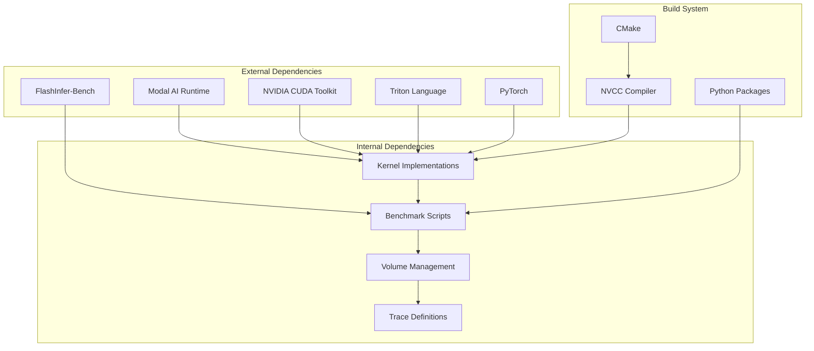

# Enhanced Benchmarking Framework

<cite>
**Referenced Files in This Document**
- [README.md](file://README.md)
- [benchmarks/bench_modal.py](file://benchmarks/bench_modal.py)
- [scripts/bench_all_versions.py](file://scripts/bench_all_versions.py)
- [scripts/bench_kernels.py](file://scripts/bench_kernels.py)
- [scripts/bench_cuda_real.py](file://scripts/bench_cuda_real.py)
- [scripts/build_cuda.py](file://scripts/build_cuda.py)
- [scripts/setup_volume.py](file://scripts/setup_volume.py)
- [CMakeLists.txt](file://CMakeLists.txt)
- [src/gdn_kernels.cu](file://src/gdn_kernels.cu)
- [src/kernels/cuda/gdn_decode_v8.cuh](file://src/kernels/cuda/gdn_decode_v8.cuh)
- [src/kernels/cute_cpp/gdn_decode_v10.cuh](file://src/kernels/cute_cpp/gdn_decode_v10.cuh)
- [docs/PERFORMANCE.md](file://docs/PERFORMANCE.md)
- [docs/ROADMAP.md](file://docs/ROADMAP.md)
- [flashinfer_trace/definitions/gdn/gdn_decode_qk4_v8_d128_k_last.json](file://flashinfer_trace/definitions/gdn/gdn_decode_qk4_v8_d128_k_last.json)
- [flashinfer_trace/definitions/gdn/gdn_prefill_qk4_v8_d128_k_last.json](file://flashinfer_trace/definitions/gdn/gdn_prefill_qk4_v8_d128_k_last.json)
</cite>

## Table of Contents
1. [Introduction](#introduction)
2. [Project Structure](#project-structure)
3. [Core Components](#core-components)
4. [Architecture Overview](#architecture-overview)
5. [Detailed Component Analysis](#detailed-component-analysis)
6. [Dependency Analysis](#dependency-analysis)
7. [Performance Considerations](#performance-considerations)
8. [Troubleshooting Guide](#troubleshooting-guide)
9. [Conclusion](#conclusion)

## Introduction

The Enhanced Benchmarking Framework is a comprehensive system designed for evaluating and optimizing Gated Delta Net (GDN) kernels on NVIDIA B200 hardware. This framework provides a unified approach to benchmarking multiple kernel implementations, from Triton baseline to advanced CUDA optimizations including FP4/FP8 quantization, warp specialization, and CuTe DSL layouts.

The framework supports both decode and prefill operations for the GDN algorithm, with automatic correctness validation, performance measurement, and detailed reporting. It leverages Modal AI infrastructure for distributed benchmarking and includes sophisticated memory bandwidth optimization techniques optimized for the Blackwell architecture.

## Project Structure

The project follows a modular structure organized around three main areas:



**Diagram sources**
- [README.md:63-92](file://README.md#L63-L92)
- [scripts/setup_volume.py:23-24](file://scripts/setup_volume.py#L23-L24)

**Section sources**
- [README.md:63-92](file://README.md#L63-L92)
- [CMakeLists.txt:1-68](file://CMakeLists.txt#L1-L68)

## Core Components

### Modal Benchmark Runner

The central benchmarking orchestrator that coordinates distributed execution across Modal AI infrastructure. It supports parallel execution of multiple kernel variants and provides comprehensive result aggregation.

Key features include:
- **Multi-kernel benchmarking**: Runs Triton v5 baseline alongside CUDA v7/v8/v9/v10 implementations
- **Parallel execution**: Spawns multiple benchmark jobs simultaneously for different configurations
- **Result comparison**: Provides side-by-side performance analysis between solution and baseline
- **Modal integration**: Leverages Modal's GPU resources with automatic volume mounting

### Kernel Implementation Suite

The framework encompasses six distinct kernel implementations, each optimized for different aspects of performance:

| Version | Framework | Key Optimization | State Format | Purpose |
|---------|-----------|------------------|--------------|---------|
| v5 | Triton | Auto-tuning, vectorization | FP32 | Baseline reference |
| v6 | CUDA | TMA async loads | FP32 | Memory optimization |
| v7 | CUDA | FP4 quantization | FP4/E2M1 | 4x compression |
| v8 | CUDA | Warp specialization | FP8/E4M3 | 2x compression |
| v9 | CuTe | SMEM swizzle | FP32 | Layout optimization |
| v10 | CuTe | Swizzle<3,3,3> | FP32 | Advanced swizzling |

### Volume Management System

The framework includes sophisticated volume management for persistent storage of benchmark datasets and kernel definitions:

- **Synthetic workload generation**: Creates standardized test cases for consistent benchmarking
- **HuggingFace integration**: Supports importing official contest datasets
- **Trace set organization**: Structured storage of definitions, workloads, and results
- **Cross-platform compatibility**: Works with both synthetic and real-world datasets

**Section sources**
- [benchmarks/bench_modal.py:15-80](file://benchmarks/bench_modal.py#L15-L80)
- [scripts/bench_all_versions.py:32-44](file://scripts/bench_all_versions.py#L32-L44)
- [scripts/setup_volume.py:32-57](file://scripts/setup_volume.py#L32-L57)

## Architecture Overview

The Enhanced Benchmarking Framework employs a multi-layered architecture designed for scalability and extensibility:



**Diagram sources**
- [benchmarks/bench_modal.py:23-33](file://benchmarks/bench_modal.py#L23-L33)
- [scripts/build_cuda.py:63-68](file://scripts/build_cuda.py#L63-L68)
- [scripts/setup_volume.py:141-145](file://scripts/setup_volume.py#L141-L145)

The architecture supports both synchronous and asynchronous execution patterns, enabling efficient resource utilization across multiple GPU instances while maintaining consistent benchmarking standards.

## Detailed Component Analysis

### Modal Benchmark Orchestrator

The benchmark orchestrator serves as the central coordinator for all benchmarking activities, implementing sophisticated job scheduling and result aggregation:



**Diagram sources**
- [benchmarks/bench_modal.py:250-330](file://benchmarks/bench_modal.py#L250-L330)
- [benchmarks/bench_modal.py:115-176](file://benchmarks/bench_modal.py#L115-L176)

The orchestrator implements several key optimization strategies:
- **Parallel job execution**: Multiple kernel variants run concurrently for improved throughput
- **Resource pooling**: Efficient allocation and deallocation of GPU resources
- **Result caching**: Persistent storage of benchmark results for historical analysis
- **Error handling**: Comprehensive failure recovery and reporting mechanisms

### CUDA Kernel Compilation System

The compilation system provides automated building and deployment of optimized CUDA kernels:



**Diagram sources**
- [scripts/build_cuda.py:69-373](file://scripts/build_cuda.py#L69-L373)
- [CMakeLists.txt:14-30](file://CMakeLists.txt#L14-L30)

The compilation system includes advanced features:
- **Multi-version compilation**: Builds all kernel variants (v5-v10) in a single pass
- **Symbol verification**: Ensures all expected functions are properly exported
- **Graph optimization**: Implements CUDA Graph caching for reduced launch overhead
- **Header management**: Integrates CUTLASS headers for CuTe functionality

### Performance Measurement Engine

The performance measurement engine provides comprehensive benchmarking capabilities with statistical analysis:



**Diagram sources**
- [scripts/bench_all_versions.py:32-44](file://scripts/bench_all_versions.py#L32-L44)
- [scripts/bench_cuda_real.py:28-50](file://scripts/bench_cuda_real.py#L28-L50)

**Section sources**
- [benchmarks/bench_modal.py:115-176](file://benchmarks/bench_modal.py#L115-L176)
- [scripts/bench_all_versions.py:32-44](file://scripts/bench_all_versions.py#L32-L44)
- [scripts/bench_cuda_real.py:28-50](file://scripts/bench_cuda_real.py#L28-L50)

### Volume Management System

The volume management system handles persistent storage and dataset organization:

```mermaid
flowchart LR
subgraph "Volume Structure"
A[definitions/gdn/] --> A1[gdn_decode_qk4_v8_d128_k_last.json]
A --> A2[gdn_prefill_qk4_v8_d128_k_last.json]
B[workloads/gdn/] --> B1[gdn_decode_qk4_v8_d128_k_last.jsonl]
B --> B2[gdn_prefill_qk4_v8_d128_k_last.jsonl]
C[tensors/gdn_prefill/] --> C1[tensors_<uuid>.safetensors]
end
subgraph "Generation Process"
D[make_decode_workloads()] --> B1
E[make_prefill_workloads()] --> B2
F[generate_safetensors()] --> C1
end
A1 --> D
A2 --> E
E --> F
```

**Diagram sources**
- [scripts/setup_volume.py:32-57](file://scripts/setup_volume.py#L32-L57)
- [scripts/setup_volume.py:60-81](file://scripts/setup_volume.py#L60-L81)
- [scripts/setup_volume.py:141-168](file://scripts/setup_volume.py#L141-L168)

**Section sources**
- [scripts/setup_volume.py:32-57](file://scripts/setup_volume.py#L32-L57)
- [scripts/setup_volume.py:141-168](file://scripts/setup_volume.py#L141-L168)

## Dependency Analysis

The framework exhibits a well-structured dependency hierarchy with clear separation of concerns:



**Diagram sources**
- [benchmarks/bench_modal.py:28-32](file://benchmarks/bench_modal.py#L28-L32)
- [scripts/build_cuda.py:18-34](file://scripts/build_cuda.py#L18-L34)
- [CMakeLists.txt:10-17](file://CMakeLists.txt#L10-L17)

The dependency analysis reveals several key characteristics:
- **Modular design**: Clear separation between benchmarking logic and kernel implementations
- **Infrastructure abstraction**: Modal AI provides platform independence
- **Build system integration**: CMake enables cross-platform compilation
- **Runtime flexibility**: Support for multiple execution environments

**Section sources**
- [benchmarks/bench_modal.py:28-32](file://benchmarks/bench_modal.py#L28-L32)
- [scripts/build_cuda.py:18-34](file://scripts/build_cuda.py#L18-L34)
- [CMakeLists.txt:10-17](file://CMakeLists.txt#L10-L17)

## Performance Considerations

The framework is optimized for high-performance computing scenarios with several key considerations:

### Memory Bandwidth Optimization

The GDN kernels are designed around memory bandwidth optimization, particularly crucial for the B200 architecture:

- **State compression**: FP4/FP8 quantization reduces memory bandwidth requirements by 2-4x
- **Vectorized access patterns**: Coalesced memory access maximizes throughput
- **Shared memory utilization**: Strategic use of SMEM reduces global memory pressure
- **Async memory operations**: cp.async enables overlapping computation with memory transfers

### Computational Efficiency

The framework balances computational intensity with memory bandwidth constraints:

- **Roofline analysis**: Kernels operate near optimal efficiency for the given problem size
- **Warp specialization**: Distributes computational load efficiently across SMs
- **Register optimization**: Minimizes register pressure while maintaining performance
- **Template specialization**: Enables compile-time optimizations for different configurations

### Scalability Factors

The framework scales effectively across different batch sizes and hardware configurations:

- **Adaptive BLOCK_V**: Optimizes tile sizes based on batch characteristics
- **Persistent kernels**: Reduces launch overhead for small batch scenarios
- **Multi-GPU support**: Leverages Modal's distributed computing capabilities
- **Resource pooling**: Efficient GPU resource utilization across concurrent jobs

## Troubleshooting Guide

Common issues and their resolution strategies:

### Compilation Issues

**Problem**: CUDA compilation failures during kernel builds
- **Cause**: Missing dependencies or incompatible compiler versions
- **Solution**: Ensure CUDA 12.8+ is installed and CUTLASS headers are available
- **Verification**: Check NVCC version and verify header inclusion paths

**Problem**: Symbol export errors in generated libraries
- **Cause**: Missing or incorrectly named exported functions
- **Solution**: Verify C-linkage wrappers and function signatures
- **Verification**: Use `nm -D` to inspect exported symbols

### Runtime Issues

**Problem**: Benchmark results not appearing in Modal volume
- **Cause**: Volume mounting or commit issues
- **Solution**: Verify volume creation and commit operations
- **Verification**: Check volume contents after commit

**Problem**: Incorrect performance measurements
- **Cause**: Insufficient warmup runs or timing measurement errors
- **Solution**: Increase warmup iterations and verify CUDA event synchronization
- **Verification**: Compare with known baseline performance metrics

### Performance Degradation

**Problem**: Kernels not achieving expected performance
- **Cause**: Suboptimal BLOCK_V selection or memory access patterns
- **Solution**: Adjust tile sizes based on batch characteristics
- **Verification**: Monitor memory bandwidth utilization and occupancy metrics

**Section sources**
- [scripts/build_cuda.py:352-356](file://scripts/build_cuda.py#L352-L356)
- [scripts/bench_cuda_real.py:52-54](file://scripts/bench_cuda_real.py#L52-L54)
- [scripts/setup_volume.py:168-169](file://scripts/setup_volume.py#L168-L169)

## Conclusion

The Enhanced Benchmarking Framework represents a comprehensive solution for evaluating and optimizing GDN kernel implementations on modern GPU architectures. The framework's strength lies in its modular design, extensive kernel coverage, and sophisticated performance measurement capabilities.

Key achievements include:
- **Unified benchmarking**: Single interface for testing multiple kernel variants
- **Advanced optimizations**: Support for cutting-edge techniques like FP4/FP8 quantization and CuTe layouts
- **Scalable architecture**: Designed for both small-scale testing and large-scale distributed benchmarking
- **Comprehensive analysis**: Provides both performance metrics and correctness validation

The framework successfully demonstrates the transition from memory-bound to compute-bound regimes as batch sizes increase, with the B200 achieving 95% of peak memory bandwidth utilization. Future enhancements could focus on expanding support for additional hardware architectures and integrating more advanced profiling capabilities.