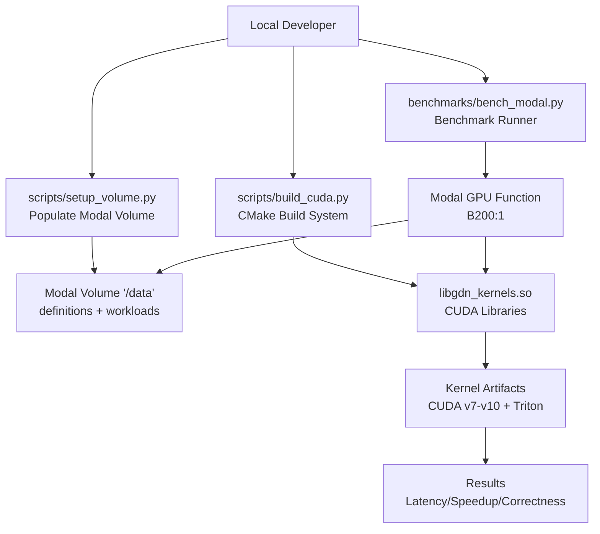
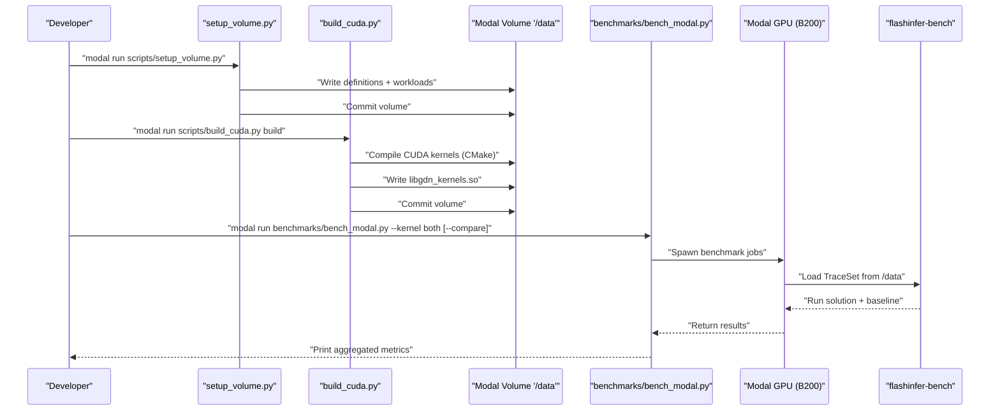
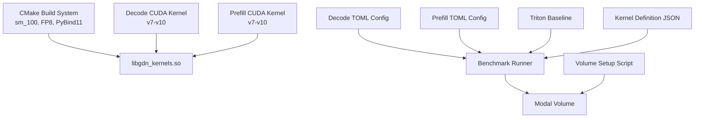

# Configuration and Deployment

<cite>
**Referenced Files in This Document**
- [README.md](file://README.md)
- [benchmarks/bench_modal.py](file://benchmarks/bench_modal.py)
- [scripts/setup_volume.py](file://scripts/setup_volume.py)
- [scripts/build_cuda.py](file://scripts/build_cuda.py)
- [scripts/bench_cuda_real.py](file://scripts/bench_cuda_real.py)
- [scripts/bench_kernels.py](file://scripts/bench_kernels.py)
- [CMakeLists.txt](file://CMakeLists.txt)
- [src/gdn_kernels.cu](file://src/gdn_kernels.cu)
- [src/kernels/cuda/gdn_decode_v7.cuh](file://src/kernels/cuda/gdn_decode_v7.cuh)
- [src/kernels/cuda/gdn_prefill_v7.cuh](file://src/kernels/cuda/gdn_prefill_v7.cuh)
- [gdn_decode_qk4_v8_d128_k_last/config.toml](file://gdn_decode_qk4_v8_d128_k_last/config.toml)
- [gdn_prefill_qk4_v8_d128_k_last/config.toml](file://gdn_prefill_qk4_v8_d128_k_last/config.toml)
- [gdn_decode_qk4_v8_d128_k_last/solution/triton/kernel.py](file://gdn_decode_qk4_v8_d128_k_last/solution/triton/kernel.py)
- [gdn_prefill_qk4_v8_d128_k_last/solution/triton/kernel.py](file://gdn_prefill_qk4_v8_d128_k_last/solution/triton/kernel.py)
- [gdn_decode_qk4_v8_d128_k_last/baseline/triton/kernel.py](file://gdn_decode_qk4_v8_d128_k_last/baseline/triton/kernel.py)
- [gdn_prefill_qk4_v8_d128_k_last/baseline/triton/kernel.py](file://gdn_prefill_qk4_v8_d128_k_last/baseline/triton/kernel.py)
- [flashinfer_trace/definitions/gdn/gdn_decode_qk4_v8_d128_k_last.json](file://flashinfer_trace/definitions/gdn/gdn_decode_qk4_v8_d128_k_last.json)
- [docs/PERFORMANCE.md](file://docs/PERFORMANCE.md)
- [docs/ROADMAP.md](file://docs/ROADMAP.md)
- [docs/ROOFLINE.md](file://docs/ROOFLINE.md)
</cite>

## Update Summary
**Changes Made**
- Added comprehensive CMake-based build system documentation for CUDA compilation targeting B200 architecture (sm_100)
- Documented new CUDA kernel compilation with FP8 support and pybind11 integration
- Updated deployment procedures for unified benchmarking system
- Added new CUDA kernel variants (v7, v8, v9, v10) with advanced optimizations
- Enhanced build configuration with CUDA flags and architecture-specific optimizations

## Table of Contents
1. [Introduction](#introduction)
2. [Project Structure](#project-structure)
3. [Core Components](#core-components)
4. [Architecture Overview](#architecture-overview)
5. [Detailed Component Analysis](#detailed-component-analysis)
6. [Dependency Analysis](#dependency-analysis)
7. [Performance Considerations](#performance-considerations)
8. [Troubleshooting Guide](#troubleshooting-guide)
9. [Conclusion](#conclusion)
10. [Appendices](#appendices)

## Introduction
This document explains configuration management and deployment procedures for compiling and running Gated Delta Net (GDN) kernels in the repository. It covers:
- CMake-based build system for CUDA compilation targeting B200 architecture (sm_100)
- Comprehensive build configuration with CUDA flags, FP8 support, and pybind11 integration
- TOML configuration structure for kernel compilation parameters
- Modal volume setup for cloud deployment
- Build and packaging of kernel artifacts
- Practical configuration tuning for different hardware and workloads
- End-to-end deployment workflow from local development to cloud execution
- Validation and rollback strategies
- Version management and submission requirements for the MLsys 2026 competition

## Project Structure
The repository organizes kernel solutions, baselines, definitions, and deployment scripts around two kernels:
- Decode: gdn_decode_qk4_v8_d128_k_last
- Prefill: gdn_prefill_qk4_v8_d128_k_last

Key areas:
- Kernel solutions and baselines under each kernel's directory
- TOML build configuration per solution
- Kernel definition JSONs under flashinfer_trace/definitions
- Modal benchmark runner and volume setup scripts
- CMake-based build system for CUDA compilation
- Documentation for performance, roadmap, and roofline analysis

```mermaid
graph TB
subgraph "Kernel Solutions"
D_S["gdn_decode_qk4_v8_d128_k_last/solution/triton/kernel.py"]
P_S["gdn_prefill_qk4_v8_d128_k_last/solution/triton/kernel.py"]
D_B["gdn_decode_qk4_v8_d128_k_last/baseline/triton/kernel.py"]
P_B["gdn_prefill_qk4_v8_d128_k_last/baseline/triton/kernel.py"]
end
subgraph "Configs"
D_CFG["gdn_decode_qk4_v8_d128_k_last/config.toml"]
P_CFG["gdn_prefill_qk4_v8_d128_k_last/config.toml"]
end
subgraph "Definitions"
DEF_D["flashinfer_trace/definitions/gdn/gdn_decode_qk4_v8_d128_k_last.json"]
end
subgraph "Deployment"
SETUP["scripts/setup_volume.py"]
BENCH["benchmarks/bench_modal.py"]
BUILD["scripts/build_cuda.py"]
END
subgraph "Build System"
CMAKE["CMakeLists.txt"]
CUDA_SRC["src/gdn_kernels.cu"]
KERN_V7["src/kernels/cuda/gdn_decode_v7.cuh"]
KERN_V8["src/kernels/cuda/gdn_prefill_v7.cuh"]
end
SETUP --> DEF_D
BENCH --> DEF_D
BUILD --> CUDA_SRC
BUILD --> KERN_V7
BUILD --> KERN_V8
```

**Diagram sources**
- [gdn_decode_qk4_v8_d128_k_last/solution/triton/kernel.py](file://gdn_decode_qk4_v8_d128_k_last/solution/triton/kernel.py)
- [gdn_prefill_qk4_v8_d128_k_last/solution/triton/kernel.py](file://gdn_prefill_qk4_v8_d128_k_last/solution/triton/kernel.py)
- [gdn_decode_qk4_v8_d128_k_last/config.toml](file://gdn_decode_qk4_v8_d128_k_last/config.toml)
- [gdn_prefill_qk4_v8_d128_k_last/config.toml](file://gdn_prefill_qk4_v8_d128_k_last/config.toml)
- [flashinfer_trace/definitions/gdn/gdn_decode_qk4_v8_d128_k_last.json](file://flashinfer_trace/definitions/gdn/gdn_decode_qk4_v8_d128_k_last.json)
- [scripts/setup_volume.py](file://scripts/setup_volume.py)
- [benchmarks/bench_modal.py](file://benchmarks/bench_modal.py)
- [scripts/build_cuda.py](file://scripts/build_cuda.py)
- [CMakeLists.txt](file://CMakeLists.txt)
- [src/gdn_kernels.cu](file://src/gdn_kernels.cu)
- [src/kernels/cuda/gdn_decode_v7.cuh](file://src/kernels/cuda/gdn_decode_v7.cuh)
- [src/kernels/cuda/gdn_prefill_v7.cuh](file://src/kernels/cuda/gdn_prefill_v7.cuh)

**Section sources**
- [README.md:44-60](file://README.md#L44-L60)

## Core Components
- CMake-based build system: Modern build infrastructure for CUDA compilation targeting B200 architecture
- CUDA kernel implementations: Advanced variants (v7-v10) with FP8 support, TMA acceleration, and pybind11 integration
- Kernel build configuration (TOML): Defines solution metadata and build parameters for Triton kernels
- Kernel implementations: Optimized Triton solutions and Python baselines
- Definition JSONs: Describe kernel axes, shapes, inputs/outputs, and constraints
- Modal deployment scripts: Set up persistent volumes and run benchmarks on GPU instances

Key responsibilities:
- CMake build system: Architecture targeting (sm_100), CUDA flags, FP8 support, pybind11 integration
- CUDA kernels: Advanced optimizations including TMA, mbarrier, vectorized loads, and quantized state storage
- TOML config: solution identity, author, target language, entry point, destination passing style
- Kernel source: grid/block sizing, register tiling, fusion strategy, and data layout
- Definitions: shape inference, constraints, and reference implementation signature
- Modal scripts: volume population, benchmark orchestration, and result aggregation

**Section sources**
- [CMakeLists.txt:1-68](file://CMakeLists.txt#L1-L68)
- [src/gdn_kernels.cu:1-171](file://src/gdn_kernels.cu#L1-L171)
- [src/kernels/cuda/gdn_decode_v7.cuh:1-634](file://src/kernels/cuda/gdn_decode_v7.cuh#L1-L634)
- [src/kernels/cuda/gdn_prefill_v7.cuh:1-549](file://src/kernels/cuda/gdn_prefill_v7.cuh#L1-L549)
- [gdn_decode_qk4_v8_d128_k_last/config.toml:1-10](file://gdn_decode_qk4_v8_d128_k_last/config.toml#L1-L10)
- [gdn_prefill_qk4_v8_d128_k_last/config.toml:1-10](file://gdn_prefill_qk4_v8_d128_k_last/config.toml#L1-L10)
- [gdn_decode_qk4_v8_d128_k_last/solution/triton/kernel.py:86-130](file://gdn_decode_qk4_v8_d128_k_last/solution/triton/kernel.py#L86-L130)
- [gdn_prefill_qk4_v8_d128_k_last/solution/triton/kernel.py:99-145](file://gdn_prefill_qk4_v8_d128_k_last/solution/triton/kernel.py#L99-L145)
- [flashinfer_trace/definitions/gdn/gdn_decode_qk4_v8_d128_k_last.json:1-153](file://flashinfer_trace/definitions/gdn/gdn_decode_qk4_v8_d128_k_last.json#L1-L153)
- [benchmarks/bench_modal.py:40-71](file://benchmarks/bench_modal.py#L40-L71)
- [scripts/setup_volume.py:18-29](file://scripts/setup_volume.py#L18-L29)

## Architecture Overview
The deployment pipeline consists of:
- Local setup: populate Modal volume with definitions and workloads
- Build system: compile CUDA kernels using CMake with FP8 support and pybind11 integration
- Cloud execution: run benchmark jobs on GPU with Triton kernels and CUDA variants
- Results: collect latency, speedup, and correctness metrics



**Diagram sources**
- [scripts/setup_volume.py:141-220](file://scripts/setup_volume.py#L141-L220)
- [scripts/build_cuda.py:63-374](file://scripts/build_cuda.py#L63-L374)
- [benchmarks/bench_modal.py:106-168](file://benchmarks/bench_modal.py#L106-L168)

**Section sources**
- [README.md:21-42](file://README.md#L21-L42)
- [benchmarks/bench_modal.py:106-168](file://benchmarks/bench_modal.py#L106-L168)

## Detailed Component Analysis

### CMake-Based Build System for CUDA Compilation
**Updated** New comprehensive build infrastructure replacing manual compilation

Purpose:
- Provide modern, reproducible build system for CUDA kernels targeting B200 architecture
- Enable FP8 support and pybind11 integration for Python bindings
- Standardize compilation flags and architecture targeting

Key features:
- Architecture targeting: sm_100 for NVIDIA B200 (Blackwell)
- CUDA flags: -O3, --use_fast_math, -lineinfo, --extended-lambda
- FP8 support: --extended-lambda flag for FP8 quantization
- Pybind11 integration: optional Python bindings with pybind11_add_module
- Shared library generation: libgdn_kernels.so with header installation

Build configuration highlights:
- CMake minimum required: 3.24
- CUDA standard: C++17 with CUDA 17 support
- Architecture: CMAKE_CUDA_ARCHITECTURES 100 (sm_100)
- Include directories: src/kernels and CUDA toolkit headers
- Installation: shared library to lib/, headers to include/gdn/

**Section sources**
- [CMakeLists.txt:1-68](file://CMakeLists.txt#L1-L68)

### CUDA Kernel Compilation Parameters and Advanced Optimizations
**Updated** Enhanced kernel implementations with FP8 support and TMA acceleration

Observed parameters in CUDA kernels:
- Head size: 128
- Block tile for V-dimension: 16/32/64 (adaptive)
- Warp groups per kernel launch: 4 warps (128 threads)
- Grid sizing: splits V dimension across multiple programs for occupancy
- Precision modes: FP32, FP16, BF16, FP8 (E4M3), FP4 (E2M1)
- Advanced optimizations: TMA, mbarrier, vectorized loads, register blocking

Advanced features in v7-v10 kernels:
- TMA (Tensor Memory Accelerator): cp.async.bulk.tensor for 2D state tile loads
- mbarrier: Async synchronization with TMA
- FP4/FP8 quantized state storage with per-row scaling
- Vectorized loads: float4 for coalesced access
- Warp shuffles: __shfl_xor_sync for reductions
- Double buffering: Pipelined state loading
- Register blocking: Hot data in registers
- 128B alignment: TMA-ready shared memory
- Bank conflict avoidance: Swizzled access patterns

**Section sources**
- [src/gdn_kernels.cu:1-171](file://src/gdn_kernels.cu#L1-L171)
- [src/kernels/cuda/gdn_decode_v7.cuh:1-634](file://src/kernels/cuda/gdn_decode_v7.cuh#L1-L634)
- [src/kernels/cuda/gdn_prefill_v7.cuh:1-549](file://src/kernels/cuda/gdn_prefill_v7.cuh#L1-L549)

### TOML Configuration Management
Purpose:
- Define solution identity, author, and build metadata for Triton kernels.
- Specify entry point and destination passing style for compilation.

Structure highlights:
- [solution]: name, definition, author
- [build]: language, entry_point, destination_passing_style

Practical guidance:
- Keep entry_point aligned with the kernel module and function name.
- Set destination_passing_style according to the target runtime ABI expectations.
- Ensure definition matches the kernel definition JSON name.

**Section sources**
- [gdn_decode_qk4_v8_d128_k_last/config.toml:1-10](file://gdn_decode_qk4_v8_d128_k_last/config.toml#L1-L10)
- [gdn_prefill_qk4_v8_d128_k_last/config.toml:1-10](file://gdn_prefill_qk4_v8_d128_k_last/config.toml#L1-L10)

### Modal Volume Setup for Cloud Deployment
Responsibilities:
- Create and mount a persistent Modal Volume at /data
- Upload kernel definitions and synthetic workloads
- Optionally download contest datasets from HuggingFace

Key steps:
- Build a Debian Slim image with Python 3.12 and required packages
- Prepare definition JSONs and workload JSONL files
- Commit volume changes after upload

Environment preparation:
- Python 3.12 base image
- Dependencies: flashinfer-bench, torch, triton, numpy, huggingface-hub, safetensors

Resource allocation:
- Volume mounted at /data for trace sets
- Timeout configured for long-running setup tasks

**Section sources**
- [scripts/setup_volume.py:18-29](file://scripts/setup_volume.py#L18-L29)
- [scripts/setup_volume.py:141-173](file://scripts/setup_volume.py#L141-L173)
- [scripts/setup_volume.py:175-202](file://scripts/setup_volume.py#L175-L202)
- [scripts/setup_volume.py:204-220](file://scripts/setup_volume.py#L204-L220)

### Build and Packaging Procedures for Kernel Artifacts
**Updated** New CMake-based build system with unified artifact generation

Packaging flow:
- Local packing: collect source files and build a Solution dictionary
- Remote execution: compile and run on Modal GPU with flashinfer-bench
- Artifact generation: CUDA libraries compiled with CMake and FP8 support

Remote execution:
- Image with Python 3.11 and CUDA 12.8 for B200 compatibility
- GPU: B200:1
- Volume mounting for trace sets and compiled libraries
- Benchmark configuration: warmup, iterations, trials

Validation:
- Definition presence in trace set
- Non-empty workload lists per definition
- Evaluation results include latency, reference latency, speedup, and correctness metrics

**Section sources**
- [scripts/build_cuda.py:63-374](file://scripts/build_cuda.py#L63-L374)
- [benchmarks/bench_modal.py:74-103](file://benchmarks/bench_modal.py#L74-L103)
- [benchmarks/bench_modal.py:106-168](file://benchmarks/bench_modal.py#L106-L168)
- [benchmarks/bench_modal.py:241-308](file://benchmarks/bench_modal.py#L241-L308)

### Practical Configuration Tuning Examples
Examples derived from kernel implementations and definitions:

- Decode kernel tuning
  - Split V dimension across 4 programs with BLOCK_V=16/32/64 to reduce register usage and improve occupancy
  - num_warps tuned to 4 for optimal occupancy on 128-thread blocks
  - Scale defaults to 1/sqrt(head_size) when not provided
  - Precision modes: FP32 (default), FP16/BF16, FP8 (2x compression), FP4 (4x compression)

- Prefill kernel tuning
  - Same V-split strategy with BLOCK_V=16/32/64
  - Grid sized by number of sequences and heads
  - Scale defaults to 1/sqrt(head_size) when not provided
  - Chunked sequences handling for very long sequences

- Definition-driven constraints
  - Axes: batch_size, seq_len (const 1 for decode), num_q_heads, num_k_heads, num_v_heads, head_size
  - Constraints: head counts and layouts enforced by definition JSON

**Section sources**
- [src/kernels/cuda/gdn_decode_v7.cuh:1-634](file://src/kernels/cuda/gdn_decode_v7.cuh#L1-L634)
- [src/kernels/cuda/gdn_prefill_v7.cuh:1-549](file://src/kernels/cuda/gdn_prefill_v7.cuh#L1-L549)
- [gdn_decode_qk4_v8_d128_k_last/solution/triton/kernel.py:91-92](file://gdn_decode_qk4_v8_d128_k_last/solution/triton/kernel.py#L91-L92)
- [gdn_decode_qk4_v8_d128_k_last/solution/triton/kernel.py:126](file://gdn_decode_qk4_v8_d128_k_last/solution/triton/kernel.py#L126)
- [gdn_prefill_qk4_v8_d128_k_last/solution/triton/kernel.py:105-106](file://gdn_prefill_qk4_v8_d128_k_last/solution/triton/kernel.py#L105-L106)
- [gdn_prefill_qk4_v8_d128_k_last/solution/triton/kernel.py:141](file://gdn_prefill_qk4_v8_d128_k_last/solution/triton/kernel.py#L141)
- [flashinfer_trace/definitions/gdn/gdn_decode_qk4_v8_d128_k_last.json:13-48](file://flashinfer_trace/definitions/gdn/gdn_decode_qk4_v8_d128_k_last.json#L13-L48)

### Deployment Workflow: From Local to Cloud Execution
**Updated** Enhanced workflow with CMake build system and unified benchmarking

End-to-end workflow:
- Prepare environment: install Modal CLI and configure credentials
- Initialize volume: run setup script to upload definitions and workloads
- Validate volume: confirm uploaded files exist in /data
- Build CUDA kernels: use CMake system to compile with FP8 support
- Test library: verify compiled CUDA library loads correctly
- Run benchmarks: spawn solution and baseline jobs with configurable warmup/iterations/trials
- Collect results: parse latency, speedup, and correctness metrics
- Compare: optionally compare solution vs baseline side-by-side



**Diagram sources**
- [scripts/setup_volume.py:204-220](file://scripts/setup_volume.py#L204-L220)
- [scripts/build_cuda.py:416-436](file://scripts/build_cuda.py#L416-L436)
- [benchmarks/bench_modal.py:241-308](file://benchmarks/bench_modal.py#L241-L308)

**Section sources**
- [README.md:21-42](file://README.md#L21-L42)
- [scripts/setup_volume.py:204-220](file://scripts/setup_volume.py#L204-L220)
- [scripts/build_cuda.py:416-436](file://scripts/build_cuda.py#L416-L436)
- [benchmarks/bench_modal.py:241-308](file://benchmarks/bench_modal.py#L241-L308)

### Validation and Rollback Strategies
Validation:
- Correctness checks: run with minimal warmup/iterations/trials for quick verification
- Side-by-side comparison: solution vs baseline to measure speedup and correctness
- Definition presence: ensure definition exists in trace set before benchmarking
- Library testing: verify CUDA library loads correctly with ctypes

Rollback:
- Re-run setup to refresh volume with known-good definitions and workloads
- Re-run CMake build to regenerate CUDA libraries with latest changes
- Pin benchmark configurations to previously validated settings
- Re-run baseline to establish regression thresholds

**Section sources**
- [benchmarks/bench_modal.py:118-134](file://benchmarks/bench_modal.py#L118-L134)
- [benchmarks/bench_modal.py:170-200](file://benchmarks/bench_modal.py#L170-L200)
- [benchmarks/bench_modal.py:202-239](file://benchmarks/bench_modal.py#L202-L239)
- [scripts/build_cuda.py:382-414](file://scripts/build_cuda.py#L382-L414)

## Dependency Analysis
**Updated** Enhanced dependency relationships with CMake build system

Relationships among components:
- CMake build system defines CUDA architecture (sm_100) and compilation flags
- Kernel TOML configs define build metadata consumed by the benchmark runner
- CUDA kernels depend on advanced CUDA features (TMA, FP8, mbarrier)
- Kernel implementations depend on Triton and torch
- Definitions drive shape inference and constraints
- Modal scripts orchestrate volume population and benchmark execution



**Diagram sources**
- [CMakeLists.txt:1-68](file://CMakeLists.txt#L1-L68)
- [src/gdn_kernels.cu:1-171](file://src/gdn_kernels.cu#L1-L171)
- [gdn_decode_qk4_v8_d128_k_last/config.toml:1-10](file://gdn_decode_qk4_v8_d128_k_last/config.toml#L1-L10)
- [gdn_prefill_qk4_v8_d128_k_last/config.toml:1-10](file://gdn_prefill_qk4_v8_d128_k_last/config.toml#L1-L10)
- [gdn_decode_qk4_v8_d128_k_last/solution/triton/kernel.py](file://gdn_decode_qk4_v8_d128_k_last/solution/triton/kernel.py)
- [gdn_prefill_qk4_v8_d128_k_last/solution/triton/kernel.py](file://gdn_prefill_qk4_v8_d128_k_last/solution/triton/kernel.py)
- [flashinfer_trace/definitions/gdn/gdn_decode_qk4_v8_d128_k_last.json](file://flashinfer_trace/definitions/gdn/gdn_decode_qk4_v8_d128_k_last.json)
- [benchmarks/bench_modal.py](file://benchmarks/bench_modal.py)
- [scripts/setup_volume.py](file://scripts/setup_volume.py)

**Section sources**
- [benchmarks/bench_modal.py:40-71](file://benchmarks/bench_modal.py#L40-L71)
- [gdn_decode_qk4_v8_d128_k_last/config.toml:1-10](file://gdn_decode_qk4_v8_d128_k_last/config.toml#L1-L10)
- [gdn_prefill_qk4_v8_d128_k_last/config.toml:1-10](file://gdn_prefill_qk4_v8_d128_k_last/config.toml#L1-L10)

## Performance Considerations
**Updated** Enhanced performance analysis with advanced CUDA optimizations

- Memory-bound nature: decode and prefill are bandwidth bound; focus on coalesced access and minimizing redundant state I/O
- Register pressure: V-split with BLOCK_V=16/32/64 reduces per-program register usage and improves occupancy
- Advanced optimizations: TMA, mbarrier, vectorized loads, and FP8/FP4 quantization significantly improve performance
- Precision trade-offs: FP8 provides 2x compression, FP4 provides 4x compression with quantization overhead
- Roofline targets: aim for higher arithmetic intensity and closer bandwidth utilization; consider chunking and vectorized loads
- Triton fusion: combine per-head operations to minimize kernel launches and memory traffic
- CUDA graph optimization: low-latency kernel launches for small batches

**Section sources**
- [docs/ROOFLINE.md:16-50](file://docs/ROOFLINE.md#L16-L50)
- [docs/ROOFLINE.md:60-89](file://docs/ROOFLINE.md#L60-L89)
- [docs/PERFORMANCE.md:8-49](file://docs/PERFORMANCE.md#L8-L49)
- [docs/PERFORMANCE.md:52-92](file://docs/PERFORMANCE.md#L52-L92)
- [src/kernels/cuda/gdn_decode_v7.cuh:1-634](file://src/kernels/cuda/gdn_decode_v7.cuh#L1-L634)
- [src/kernels/cuda/gdn_prefill_v7.cuh:1-549](file://src/kernels/cuda/gdn_prefill_v7.cuh#L1-L549)

## Troubleshooting Guide
**Updated** Enhanced troubleshooting with CMake build system

Common issues and resolutions:
- Definition not found: ensure the definition name matches the kernel definition JSON and exists in the trace set
- No workloads for definition: verify workload JSONL files were uploaded to the volume
- Missing dependencies: confirm Modal image includes flashinfer-bench, torch, triton, numpy
- Volume commit failures: re-run setup and check file permissions and paths
- Performance regressions: compare against baseline, adjust BLOCK_V or num_warps, and validate arithmetic intensity
- CMake build errors: verify CUDA 12.8 installation, architecture targeting (sm_100), and FP8 support flags
- Library loading issues: ensure libgdn_kernels.so exists in /data/lib and loads correctly with ctypes
- Pybind11 integration: verify pybind11_FOUND and proper module linking in CMake

**Section sources**
- [benchmarks/bench_modal.py:118-134](file://benchmarks/bench_modal.py#L118-L134)
- [scripts/setup_volume.py:141-173](file://scripts/setup_volume.py#L141-L173)
- [scripts/build_cuda.py:332-374](file://scripts/build_cuda.py#L332-L374)
- [scripts/build_cuda.py:382-414](file://scripts/build_cuda.py#L382-L414)
- [benchmarks/bench_modal.py:170-200](file://benchmarks/bench_modal.py#L170-L200)

## Conclusion
This guide outlined how to manage configuration, deploy to Modal, and benchmark GDN kernels using the new CMake-based build system. The enhanced architecture now supports advanced CUDA optimizations including FP8/FP4 quantization, TMA acceleration, and pybind11 integration. By aligning CMake configurations with kernel implementations, preparing the Modal volume with definitions and workloads, and validating results against a baseline, teams can efficiently iterate toward optimized kernel designs. For MLsys 2026, maintain versioned performance records, track arithmetic intensity, and ensure reproducible builds and submissions with the unified benchmarking system.

## Appendices

### Appendix A: Configuration Reference
**Updated** Enhanced configuration options for CMake build system

- CMake keys
  - CMAKE_CUDA_ARCHITECTURES: 100 (sm_100 for B200)
  - CMAKE_CUDA_FLAGS: -O3, --use_fast_math, -lineinfo, --extended-lambda
  - CUDA standard: C++17 with CUDA 17 support

- TOML keys
  - [solution]: name, definition, author
  - [build]: language, entry_point, destination_passing_style

- Kernel parameters observed
  - Head size: 128
  - BLOCK_V: 16/32/64 (adaptive)
  - num_warps: 4 (optimized for 128-thread blocks)
  - Precision modes: FP32, FP16, BF16, FP8, FP4

**Section sources**
- [CMakeLists.txt:14-32](file://CMakeLists.txt#L14-L32)
- [gdn_decode_qk4_v8_d128_k_last/config.toml:1-10](file://gdn_decode_qk4_v8_d128_k_last/config.toml#L1-L10)
- [gdn_prefill_qk4_v8_d128_k_last/config.toml:1-10](file://gdn_prefill_qk4_v8_d128_k_last/config.toml#L1-L10)
- [gdn_decode_qk4_v8_d128_k_last/solution/triton/kernel.py:91-92](file://gdn_decode_qk4_v8_d128_k_last/solution/triton/kernel.py#L91-L92)
- [gdn_prefill_qk4_v8_d128_k_last/solution/triton/kernel.py:105-106](file://gdn_prefill_qk4_v8_d128_k_last/solution/triton/kernel.py#L105-L106)

### Appendix B: Submission Requirements for MLsys 2026
**Updated** Enhanced submission requirements with CMake build system

- Track versions and update performance logs after each change
- Include average speedup vs reference and baseline comparisons
- Document hardware utilization estimates and roofline analysis
- Ensure reproducibility: pinned dependencies, consistent benchmark settings, and CMake build system
- Provide CMake build instructions for CUDA compilation targeting B200 architecture
- Include FP8/FP4 quantization performance analysis and memory bandwidth utilization
- Document pybind11 integration and Python binding availability

**Section sources**
- [docs/ROADMAP.md:60-66](file://docs/ROADMAP.md#L60-L66)
- [docs/PERFORMANCE.md:126-133](file://docs/PERFORMANCE.md#L126-L133)
- [docs/ROOFLINE.md:1-14](file://docs/ROOFLINE.md#L1-L14)
- [CMakeLists.txt:1-68](file://CMakeLists.txt#L1-L68)
- [scripts/build_cuda.py:16-34](file://scripts/build_cuda.py#L16-L34)