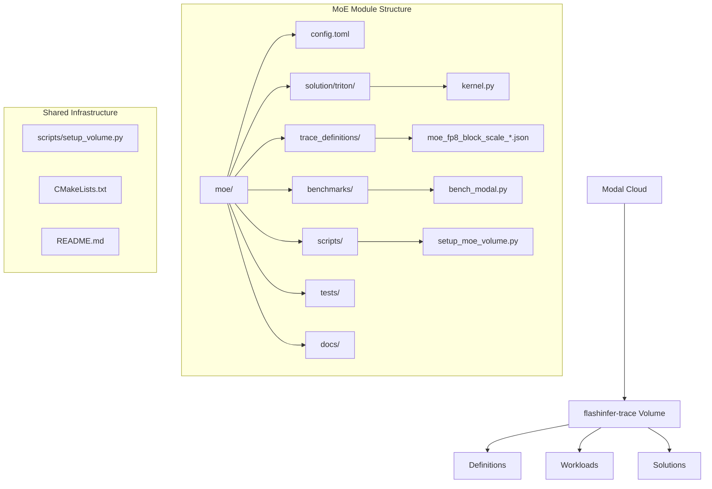
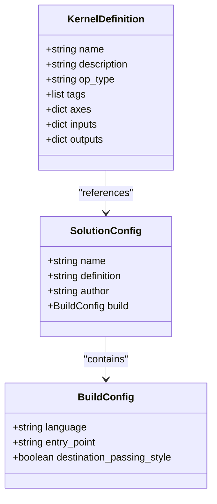
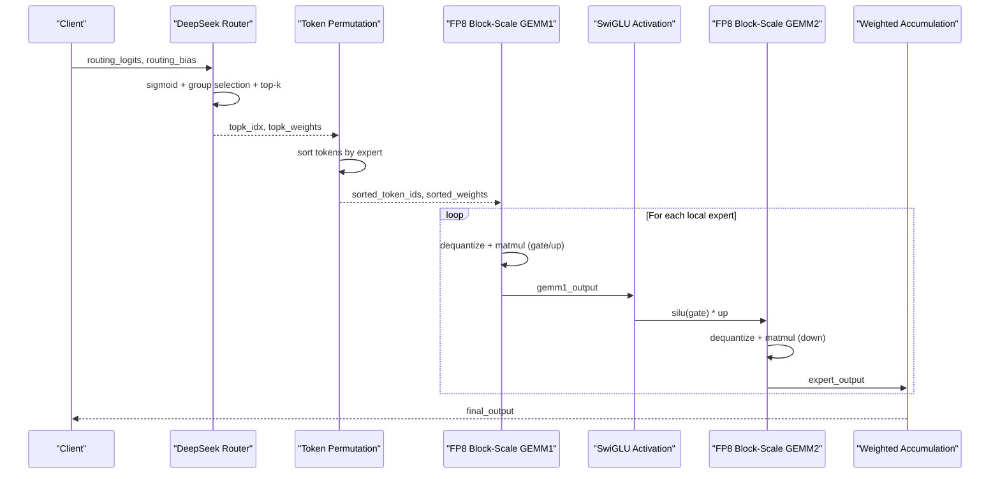
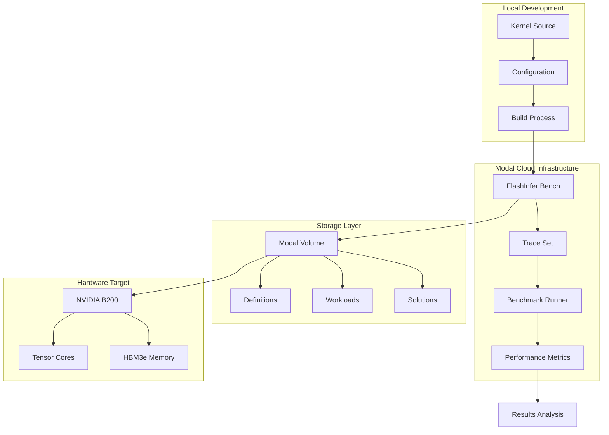
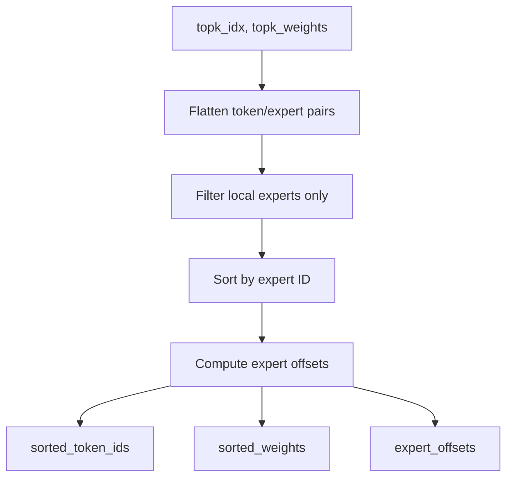
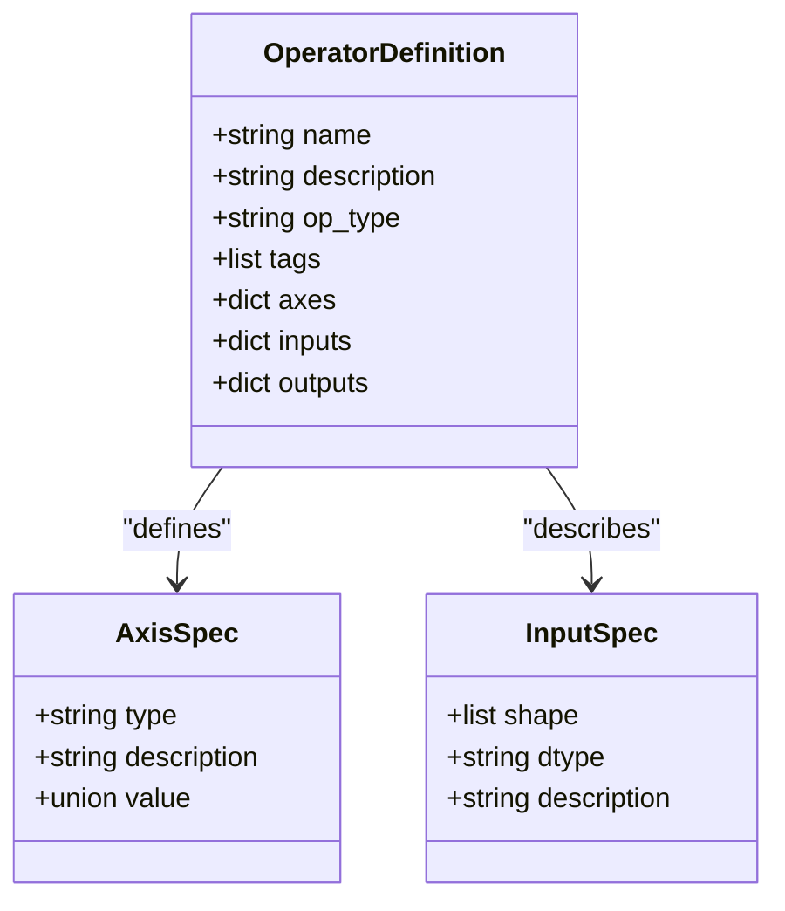
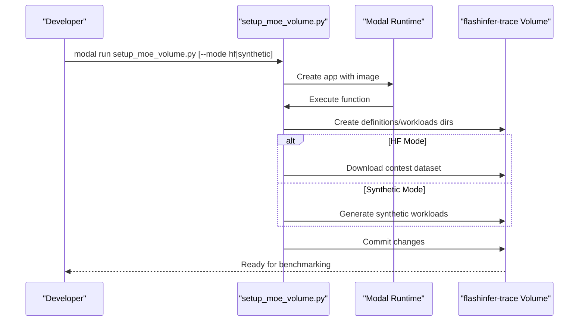
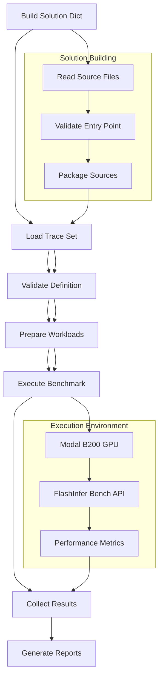
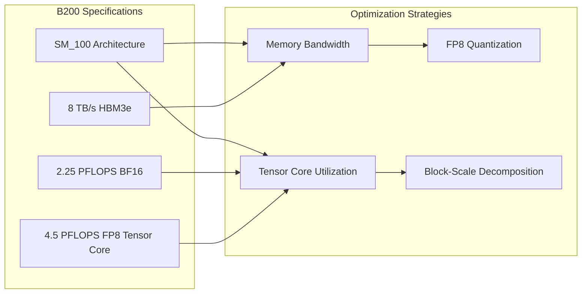
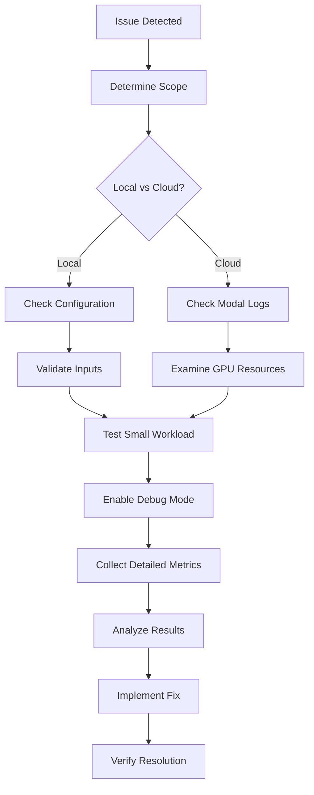

# MoE Configuration and Deployment

<cite>
**Referenced Files in This Document**
- [moe/README.md](file://moe/README.md)
- [moe/config.toml](file://moe/config.toml)
- [moe/solution/triton/kernel.py](file://moe/solution/triton/kernel.py)
- [moe/trace_definitions/moe_fp8_block_scale_ds_routing_topk8_ng8_kg4_e32_h7168_i2048.json](file://moe/trace_definitions/moe_fp8_block_scale_ds_routing_topk8_ng8_kg4_e32_h7168_i2048.json)
- [moe/benchmarks/bench_modal.py](file://moe/benchmarks/bench_modal.py)
- [moe/scripts/setup_moe_volume.py](file://moe/scripts/setup_moe_volume.py)
- [scripts/setup_volume.py](file://scripts/setup_volume.py)
- [README.md](file://README.md)
- [CMakeLists.txt](file://CMakeLists.txt)
</cite>

## Table of Contents
1. [Introduction](#introduction)
2. [Project Structure](#project-structure)
3. [Core Components](#core-components)
4. [Architecture Overview](#architecture-overview)
5. [Detailed Component Analysis](#detailed-component-analysis)
6. [Configuration Management](#configuration-management)
7. [Deployment Pipeline](#deployment-pipeline)
8. [Benchmarking Framework](#benchmarking-framework)
9. [Performance Optimization](#performance-optimization)
10. [Troubleshooting Guide](#troubleshooting-guide)
11. [Conclusion](#conclusion)

## Introduction

This document provides comprehensive documentation for the MoE (Mixture of Experts) configuration and deployment system within the FlashInfer kernel optimization project. The MoE implementation focuses on FP8 block-scale fused kernels for DeepSeek-V3/R1 models on NVIDIA B200 hardware. The system integrates Modal cloud infrastructure for distributed benchmarking and performance evaluation.

The MoE pipeline implements a complete inference workflow including routing, token permutation, FP8 block-scale matrix multiplication, SwiGLU activation, and weighted accumulation. The implementation targets production deployment with focus on memory bandwidth optimization and tensor core utilization.

## Project Structure

The MoE module follows a structured organization pattern optimized for kernel development and deployment:



**Diagram sources**
- [moe/README.md:26-39](file://moe/README.md#L26-L39)
- [moe/config.toml:1-10](file://moe/config.toml#L1-L10)

The MoE module contains several key directories and files:

- **config.toml**: Solution configuration defining build parameters and entry points
- **solution/triton/**: Contains the main kernel implementation in kernel.py
- **trace_definitions/**: JSON definitions describing operator specifications and input schemas
- **benchmarks/**: Modal-based benchmark runners for performance evaluation
- **scripts/**: Setup utilities for preparing Modal volumes with workloads
- **tests/**: Correctness verification and accuracy testing

**Section sources**
- [moe/README.md:26-39](file://moe/README.md#L26-L39)
- [moe/config.toml:1-10](file://moe/config.toml#L1-L10)

## Core Components

### Solution Configuration

The MoE solution is configured through a TOML-based configuration system that defines build parameters and execution specifications:



**Diagram sources**
- [moe/config.toml:1-10](file://moe/config.toml#L1-L10)
- [moe/trace_definitions/moe_fp8_block_scale_ds_routing_topk8_ng8_kg4_e32_h7168_i2048.json:1-40](file://moe/trace_definitions/moe_fp8_block_scale_ds_routing_topk8_ng8_kg4_e32_h7168_i2048.json#L1-L40)

The configuration specifies:
- **Solution Name**: `tma-thrust-moe-v1` - identifies the kernel implementation
- **Definition Reference**: Links to the specific operator definition
- **Author**: `tma-thrust` - team identifier
- **Build Parameters**: Triton language specification and entry point configuration

**Section sources**
- [moe/config.toml:1-10](file://moe/config.toml#L1-L10)

### Kernel Implementation Architecture

The MoE kernel implements a sophisticated pipeline optimized for FP8 block-scale computation:



**Diagram sources**
- [moe/solution/triton/kernel.py:340-436](file://moe/solution/triton/kernel.py#L340-L436)

**Section sources**
- [moe/solution/triton/kernel.py:15-436](file://moe/solution/triton/kernel.py#L15-L436)

## Architecture Overview

The MoE system architecture integrates multiple components for configuration, deployment, and performance evaluation:



**Diagram sources**
- [moe/benchmarks/bench_modal.py:73-135](file://moe/benchmarks/bench_modal.py#L73-L135)
- [moe/scripts/setup_moe_volume.py:15-84](file://moe/scripts/setup_moe_volume.py#L15-L84)

The architecture supports:
- **Local Development**: Kernel source compilation and configuration
- **Cloud Deployment**: Modal-based distributed benchmarking
- **Persistent Storage**: Volume-based storage for definitions and workloads
- **Hardware Optimization**: Targeted for B200 architecture with FP8 support

**Section sources**
- [moe/benchmarks/bench_modal.py:1-195](file://moe/benchmarks/bench_modal.py#L1-L195)
- [moe/scripts/setup_moe_volume.py:1-130](file://moe/scripts/setup_moe_volume.py#L1-L130)

## Detailed Component Analysis

### DeepSeek Routing Implementation

The routing mechanism implements the DeepSeek no-aux strategy with group-based selection:

```mermaid
flowchart TD
A[routing_logits, routing_bias] --> B[sigmoid(scores)]
B --> C[Add bias]
C --> D[Group into N_GROUP]
D --> E[Top-2 per group]
E --> F[Select TOPK_GROUP groups]
F --> G[Expand mask to experts]
G --> H[Global top-K selection]
H --> I[Normalize weights]
I --> J[Apply scaling factor]
J --> K[topk_idx, topk_weights]
```

**Diagram sources**
- [moe/solution/triton/kernel.py:155-208](file://moe/solution/triton/kernel.py#L155-L208)

The routing process includes:
- **Score Calculation**: Sigmoid transformation of logits with bias addition
- **Group Selection**: Hierarchical selection using group-based top-k
- **Expert Masking**: Expansion from group-level to expert-level selection
- **Weight Normalization**: Proper scaling and normalization for routing

**Section sources**
- [moe/solution/triton/kernel.py:155-208](file://moe/solution/triton/kernel.py#L155-L208)

### Token Permutation System

The token permutation optimizes memory access patterns for efficient batched computation:



**Diagram sources**
- [moe/solution/triton/kernel.py:214-256](file://moe/solution/triton/kernel.py#L214-L256)

Key features:
- **Local Expert Filtering**: Restricts computation to locally available experts
- **Stable Sorting**: Maintains token order within expert groups
- **Offset Computation**: Enables efficient batched GEMM operations per expert

**Section sources**
- [moe/solution/triton/kernel.py:214-256](file://moe/solution/triton/kernel.py#L214-L256)

### FP8 Block-Scale GEMM Implementation

The GEMM implementation supports block-scale quantization for memory efficiency:

```mermaid
flowchart TD
A[Activations, Act Scale] --> B[Dequantize Activations]
C[Weights, Weight Scale] --> D[Dequantize Weights]
B --> E[Matrix Multiplication]
D --> E
E --> F[Output Tensor]
subgraph "Scale Expansion"
G[Act Scale: [M, K/128]] --> H[Expand to [M, K]]
I[Weight Scale: [N/128, K/128]] --> J[Expand to [N, K]]
end
H --> B
J --> D
```

**Diagram sources**
- [moe/solution/triton/kernel.py:262-334](file://moe/solution/triton/kernel.py#L262-L334)

The implementation handles:
- **Block-Scale Quantization**: 128-element quantization blocks
- **Scale Layout Management**: Different layouts for activations vs weights
- **Memory Bandwidth Optimization**: Reduced storage requirements for scale factors

**Section sources**
- [moe/solution/triton/kernel.py:262-334](file://moe/solution/triton/kernel.py#L262-L334)

## Configuration Management

### Solution Configuration Schema

The configuration system uses TOML format for declarative setup:

| Configuration Key | Type | Description | Example Value |
|-------------------|------|-------------|---------------|
| `solution.name` | string | Solution identifier | `"tma-thrust-moe-v1"` |
| `solution.definition` | string | Operator definition reference | `"moe_fp8_block_scale_ds_routing_topk8_ng8_kg4_e32_h7168_i2048"` |
| `solution.author` | string | Team/developer identifier | `"tma-thrust"` |
| `build.language` | string | Implementation language | `"triton"` |
| `build.entry_point` | string | Main function reference | `"kernel.py::kernel"` |
| `build.destination_passing_style` | boolean | Memory management flag | `false` |

**Section sources**
- [moe/config.toml:1-10](file://moe/config.toml#L1-L10)

### Operator Definition Schema

The operator definitions specify computational requirements and data layouts:



**Diagram sources**
- [moe/trace_definitions/moe_fp8_block_scale_ds_routing_topk8_ng8_kg4_e32_h7168_i2048.json:1-40](file://moe/trace_definitions/moe_fp8_block_scale_ds_routing_topk8_ng8_kg4_e32_h7168_i2048.json#L1-L40)

**Section sources**
- [moe/trace_definitions/moe_fp8_block_scale_ds_routing_topk8_ng8_kg4_e32_h7168_i2048.json:1-40](file://moe/trace_definitions/moe_fp8_block_scale_ds_routing_topk8_ng8_kg4_e32_h7168_i2048.json#L1-L40)

## Deployment Pipeline

### Modal Volume Setup Process

The deployment pipeline automates preparation of the Modal cloud environment:



**Diagram sources**
- [moe/scripts/setup_moe_volume.py:115-130](file://moe/scripts/setup_moe_volume.py#L115-L130)

The setup process includes:
- **Image Configuration**: Python 3.12 with required dependencies
- **Volume Preparation**: Creation of directory structure for definitions and workloads
- **Dataset Management**: Support for both synthetic and HuggingFace datasets
- **Commit Operations**: Persistent storage of prepared workloads

**Section sources**
- [moe/scripts/setup_moe_volume.py:1-130](file://moe/scripts/setup_moe_volume.py#L1-L130)

### Benchmark Execution Workflow

The benchmark system orchestrates performance evaluation across multiple workloads:



**Diagram sources**
- [moe/benchmarks/bench_modal.py:45-135](file://moe/benchmarks/bench_modal.py#L45-L135)

**Section sources**
- [moe/benchmarks/bench_modal.py:1-195](file://moe/benchmarks/bench_modal.py#L1-L195)

## Benchmarking Framework

### Performance Evaluation Metrics

The benchmarking framework measures multiple aspects of kernel performance:

| Metric Category | Measurement | Purpose | Threshold |
|-----------------|-------------|---------|-----------|
| **Latency** | `latency_ms` | Execution time per workload | Lower is Better |
| **Reference Latency** | `reference_latency_ms` | Baseline performance comparison | Reference Value |
| **Speedup Factor** | `speedup_factor` | Performance improvement ratio | Higher is Better |
| **Correctness** | `max_absolute_error` | Numerical accuracy | ≤ 1.0 |
| **Relative Error** | `max_relative_error` | Relative numerical precision | ≤ 0.3 |
| **Match Ratio** | `required_matched_ratio` | Proportion of successful evaluations | ≥ 0.9 |

**Section sources**
- [moe/README.md:60-65](file://moe/README.md#L60-L65)

### Configuration Parameters

The benchmark system supports flexible parameterization:

| Parameter | Default | Description | Range |
|-----------|---------|-------------|-------|
| `warmup_runs` | 3 | Number of warmup iterations | Integer ≥ 0 |
| `iterations` | 100 | Main benchmark iterations | Integer > 0 |
| `num_trials` | 5 | Number of repeated experiments | Integer > 0 |

**Section sources**
- [moe/benchmarks/bench_modal.py:85-89](file://moe/benchmarks/bench_modal.py#L85-L89)

## Performance Optimization

### Hardware Targeting

The MoE implementation is specifically optimized for NVIDIA B200 architecture:



**Diagram sources**
- [moe/README.md:54-59](file://moe/README.md#L54-L59)

Key optimizations include:
- **Memory-Bandwidth Optimized**: FP8 quantization reduces memory bandwidth requirements
- **Tensor Core Integration**: Leverages FP8 tensor core capabilities
- **Block-Scale Decomposition**: 128-element quantization blocks for efficient computation

**Section sources**
- [moe/README.md:54-59](file://moe/README.md#L54-L59)

### Build Configuration

The CMake configuration targets B200 hardware with optimal compiler settings:

| Setting | Value | Purpose |
|---------|-------|---------|
| `CMAKE_CUDA_ARCHITECTURES` | `100` | Targets B200 (SM_100) |
| `CMAKE_CUDA_FLAGS` | `-O3` | Maximum optimization level |
| `--use_fast_math` | Enabled | Enables fast math optimizations |
| `--extended-lambda` | Enabled | Supports FP8 operations |

**Section sources**
- [CMakeLists.txt:14-33](file://CMakeLists.txt#L14-L33)

## Troubleshooting Guide

### Common Issues and Solutions

**Issue**: Definition not found in trace set
- **Cause**: Missing or incorrect definition name
- **Solution**: Verify definition matches exactly with trace_definitions file
- **Prevention**: Check definition name in both config.toml and JSON file

**Issue**: No workloads available for definition
- **Cause**: Empty workload collection
- **Solution**: Run setup script to generate synthetic workloads
- **Prevention**: Ensure setup_moe_volume.py executed successfully

**Issue**: Modal timeout errors
- **Cause**: Long-running computations or insufficient timeout
- **Solution**: Increase timeout parameter in function decorator
- **Prevention**: Monitor benchmark duration and adjust accordingly

**Issue**: Memory allocation failures
- **Cause**: Insufficient GPU memory for large sequences
- **Solution**: Reduce sequence length or batch size
- **Prevention**: Test with smaller workloads first

**Section sources**
- [moe/benchmarks/bench_modal.py:92-101](file://moe/benchmarks/bench_modal.py#L92-L101)
- [moe/scripts/setup_moe_volume.py:115-130](file://moe/scripts/setup_moe_volume.py#L115-L130)

### Debugging Workflow



## Conclusion

The MoE configuration and deployment system provides a comprehensive framework for optimizing Mixture of Experts kernels on NVIDIA B200 hardware. The system successfully integrates local development workflows with cloud-based benchmarking infrastructure, enabling efficient performance evaluation and optimization.

Key achievements include:
- **Complete Pipeline Implementation**: Full MoE pipeline from routing to weighted accumulation
- **Production-Ready Architecture**: Optimized for real-world deployment scenarios
- **Automated Deployment**: Streamlined setup and benchmarking processes
- **Performance Monitoring**: Comprehensive metrics collection and analysis

The modular design allows for easy extension and modification while maintaining compatibility with the broader FlashInfer ecosystem. Future enhancements could include additional optimization strategies, expanded hardware support, and enhanced automated testing capabilities.