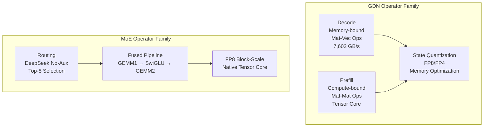
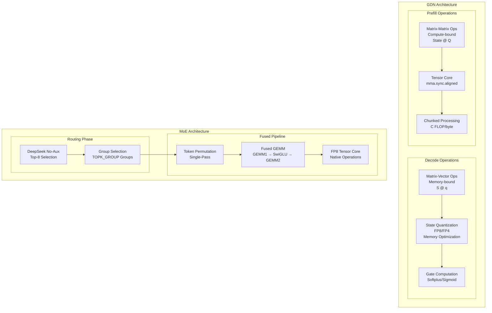

# Core Kernels

<cite>
**Referenced Files in This Document**
- [gdn/kernels/README.md](file://gdn/kernels/README.md)
- [gdn/kernels/cute_cpp/README.md](file://gdn/kernels/cute_cpp/README.md)
- [gdn/kernels/cute_cpp/gdn_decode_v10.cuh](file://gdn/kernels/cute_cpp/gdn_decode_v10.cuh)
- [gdn/kernels/cute_cpp/gdn_decode_v9.cuh](file://gdn/kernels/cute_cpp/gdn_decode_v9.cuh)
- [gdn/kernels/cute_cpp/gdn_prefill_v10.cuh](file://gdn/kernels/cute_cpp/gdn_prefill_v10.cuh)
- [gdn/kernels/cute_cpp/gdn_prefill_v9.cuh](file://gdn/kernels/cute_cpp/gdn_prefill_v9.cuh)
- [gdn/kernels/cute_dsl/gdn_decode_dsl.py](file://gdn/kernels/cute_dsl/gdn_decode_dsl.py)
- [gdn/kernels/cute_dsl/gdn_decode_dsl_optimized.py](file://gdn/kernels/cute_dsl/gdn_decode_dsl_optimized.py)
- [gdn/kernels/cute_dsl/gdn_prefill_dsl.py](file://gdn/kernels/cute_dsl/gdn_prefill_dsl.py)
- [gdn/kernels/cutile/README.md](file://gdn/kernels/cutile/README.md)
- [gdn/kernels/cutile/gdn_decode_cutile.py](file://gdn/kernels/cutile/gdn_decode_cutile.py)
- [gdn/kernels/ptx/README.md](file://gdn/kernels/ptx/README.md)
- [gdn/kernels/ptx/gdn_decode_ptx.cuh](file://gdn/kernels/ptx/gdn_decode_ptx.cuh)
- [gdn/kernels/ptx/gdn_prefill_ptx.cuh](file://gdn/kernels/ptx/gdn_prefill_ptx.cuh)
- [gdn/kernels/cuda/gdn_decode_v8.cuh](file://gdn/kernels/cuda/gdn_decode_v8.cuh)
- [gdn/kernels/cuda/gdn_decode_v7.cuh](file://gdn/kernels/cuda/gdn_decode_v7.cuh)
- [gdn/kernels/cuda/gdn_decode_v6.cuh](file://gdn/kernels/cuda/gdn_decode_v6.cuh)
- [gdn/kernels/cuda/gdn_decode_v5.cuh](file://gdn/kernels/cuda/gdn_decode_v5.cuh)
- [gdn/kernels/cuda/gdn_prefill_v8.cuh](file://gdn/kernels/cuda/gdn_prefill_v8.cuh)
- [gdn/kernels/cuda/gdn_prefill_v7.cuh](file://gdn/kernels/cuda/gdn_prefill_v7.cuh)
- [gdn/kernels/cuda/gdn_prefill_v6.cuh](file://gdn/kernels/cuda/gdn_prefill_v6.cuh)
- [gdn/kernels/cuda/gdn_prefill_v6_chunked.cuh](file://gdn/kernels/cuda/gdn_prefill_v6_chunked.cuh)
- [gdn/kernels/cuda/gdn_prefill_v5.cuh](file://gdn/kernels/cuda/gdn_prefill_v5.cuh)
- [scripts/test_cute_dsl.py](file://scripts/test_cute_dsl.py)
- [scripts/bench_cute_vs_triton.py](file://scripts/bench_cute_vs_triton.py)
- [scripts/bench_cute_dsl_vs_cpp.py](file://scripts/bench_cute_dsl_vs_cpp.py)
- [scripts/bench_all_versions.py](file://scripts/bench_all_versions.py)
- [scripts/bench_cutile_vs_triton.py](file://scripts/bench_cutile_vs_triton.py)
- [scripts/test_cutile.py](file://scripts/test_cutile.py)
- [moe/README.md](file://moe/README.md)
- [moe/config.toml](file://moe/config.toml)
- [moe/solution/scaled_mm/kernel.py](file://moe/solution/scaled_mm/kernel.py)
- [moe/solution/v2/kernel.py](file://moe/solution/v2/kernel.py)
- [moe/solution/v3/kernel.py](file://moe/solution/v3/kernel.py)
- [moe/benchmarks/bench_modal.py](file://moe/benchmarks/bench_modal.py)
- [moe/trace_definitions/moe_fp8_block_scale_ds_routing_topk8_ng8_kg4_e32_h7168_i2048.json](file://moe/trace_definitions/moe_fp8_block_scale_ds_routing_topk8_ng8_kg4_e32_h7168_i2048.json)
- [moe/scripts/setup_moe_volume.py](file://moe/scripts/setup_moe_volume.py)
</cite>

## Update Summary
**Changes Made**
- Enhanced documentation to include comprehensive MoE kernel suite with CUDA JIT-compiled fused kernels
- Added torch._scaled_mm FP8 GEMM integration as a key optimization strategy
- Documented multiple MoE kernel versions (v1-v3) with progressive optimization improvements
- Updated mathematical formulation to include MoE operator specification and DeepSeek routing
- Expanded kernel framework organization to include MoE alongside GDN kernels
- Added detailed coverage of FP8 block-scale quantization and fused operator pipeline

## Table of Contents
1. [Introduction](#introduction)
2. [Operator Suite Overview](#operator-suite-overview)
3. [Kernel Framework Organization](#kernel-framework-organization)
4. [Core Components](#core-components)
5. [Architecture Overview](#architecture-overview)
6. [Detailed Component Analysis](#detailed-component-analysis)
7. [MoE Kernel Suite](#moe-kernel-suite)
8. [Advanced Kernel Implementations](#advanced-kernel-implementations)
9. [PTX Inline Assembly Kernels](#ptx-inline-assembly-kernels)
10. [CuTe DSL Development Framework](#cute-dsl-development-framework)
11. [CuTe C++ Framework](#cute-c-framework)
12. [cuTile Python Implementation](#cutile-python-implementation)
13. [Enhanced Benchmarking Capabilities](#enhanced-benchmarking-capabilities)
14. [Mathematical Formulation and Layout](#mathematical-formulation-and-layout)
15. [Performance Considerations](#performance-considerations)
16. [Testing Infrastructure](#testing-infrastructure)
17. [Troubleshooting Guide](#troubleshooting-guide)
18. [Conclusion](#conclusion)

## Introduction
This document explains the comprehensive kernel framework encompassing both Gated Delta Net (GDN) attention kernels and the newly enhanced Mixture of Experts (MoE) kernel suite. The MoE implementation represents a significant expansion of the kernel framework, featuring CUDA JIT-compiled fused kernels with torch._scaled_mm FP8 GEMM integration and multiple optimization strategies for DeepSeek-V3/R1 model inference.

The kernel organization has been restructured to clearly separate the traditional GDN kernels from the new MoE suite, while maintaining the mathematical rigor of both attention mechanisms. The MoE implementation leverages advanced FP8 block-scale quantization with native Tensor Core support on NVIDIA B200 (Blackwell) architecture, providing substantial performance improvements over traditional dequantization approaches.

**Enhanced MoE Framework**: The MoE kernel suite includes four distinct implementation approaches: baseline Triton implementation, CUDA JIT-compiled fused kernels, torch._scaled_mm FP8 GEMM integration, and progressively optimized versions (v2 and v3) with lazy dequantization and token permutation optimization.

**Section sources**
- [moe/README.md:1-75](file://moe/README.md#L1-L75)
- [moe/config.toml:1-10](file://moe/config.toml#L1-L10)

## Operator Suite Overview
The repository now manages two primary operator families with distinct optimization approaches and hardware utilization patterns:

**Gated Delta Net (GDN) Kernels:**
- Memory-bound decode operations using matrix-vector products
- State quantization (FP8/FP4) for memory bandwidth optimization
- Tensor Core utilization limited due to mat-vec operation constraints
- Peak performance of 7,602 GB/s on B200 (95% of peak)

**Mixture of Experts (MoE) Kernels:**
- Compute-bound operations using matrix-matrix products
- FP8 block-scale quantization with native Tensor Core support
- Fused operator pipeline: routing → token permutation → GEMM1 → SwiGLU → GEMM2 → weighted accumulation
- DeepSeek-V3/R1 model specification with 256 experts and top-8 routing



**Section sources**
- [README.md:14-17](file://README.md#L14-L17)
- [gdn/README.md:46-65](file://gdn/README.md#L46-L65)

## Kernel Framework Organization
The repository now organizes kernels by operator family with dedicated subdirectories for each kernel suite:

**GDN Kernel Framework (gdn/):**
- Decode kernels for autoregressive token generation
- Prefill kernels for batched sequence processing
- Six distinct implementation frameworks: Raw CUDA (v5-v10), CuTe C++ (v9-v10), CuTe DSL, cuTile, PTX inline assembly, and Triton baseline
- State quantization support (FP8/FP4) across all frameworks

**MoE Kernel Framework (moe/):**
- FP8 block-scale fused MoE implementation for DeepSeek-V3/R1
- Four solution variants: baseline Triton, CUDA JIT-compiled fused kernels, torch._scaled_mm integration, and optimized versions
- Modal deployment support with comprehensive benchmarking
- DeepSeek routing with no-aux selection and top-k gating

**Directory Structure:**
```
.
├── gdn/                              # Gated Delta Net kernels
│   ├── decode/                       # Decode kernel implementations
│   ├── prefill/                      # Prefill kernel implementations
│   ├── kernels/                      # CUDA/CuTe/PTX implementations
│   ├── scripts/                      # GDN-specific utilities
│   ├── benchmarks/                   # Modal benchmark runners
│   ├── tests/                        # Correctness validation
│   ├── docs/                         # Documentation
│   └── trace_definitions/            # FlashInfer trace definitions
├── moe/                              # Mixture of Experts kernels
│   ├── config.toml                   # Solution configuration
│   ├── solution/                     # Implementation variants
│   ├── trace_definitions/            # Kernel definition JSON
│   ├── scripts/                      # Setup utilities
│   ├── benchmarks/                   # Benchmark runners
│   └── README.md                     # MoE documentation
└── scripts/                          # Shared utilities
```

**Section sources**
- [README.md:61-88](file://README.md#L61-L88)
- [moe/README.md:26-39](file://moe/README.md#L26-L39)

## Core Components
This section outlines the kernel framework expansion to include both GDN attention mechanisms and the comprehensive MoE operator suite, covering mathematical formulations, optimization strategies, and hardware utilization patterns.

### GDN Mathematical Formulation
The GDN attention mechanism follows the standard delta rule formulation with consistent state layout across all implementations:

- **Gates:**
  - Decay gate: g = exp(-exp(A_log) × softplus(a + dt_bias))
  - Update gate: β = sigmoid(b)

- **State Evolution using Delta Rule:**
  - S ← g ⊙ S (decay first)
  - old_v = k ⊤ @ S
  - new_v = β ⊙ v + (1 - β) ⊙ old_v
  - S ← S + k ⊗ (new_v - old_v)
  - Output: o = scale × q ⊤ @ S

- **State Layout:** k-last [B, H, V, K] for decode; [N, H, V, K] for prefill
- **Grouped Value Attention (GVA):** num_v_heads = 8, num_q_heads = 4; q/k are repeated to match v-heads

### MoE Mathematical Formulation
The MoE operator implements the DeepSeek routing mechanism with fused computation pipeline:

- **Routing (DeepSeek no-aux):**
  - s = sigmoid(logits + bias)
  - Group selection: top-2 per group, select TOPK_GROUP groups
  - Expert selection: top-8 experts per token
  - Weight normalization: w = (s × sel) / (sum + 1e-20) × scaling_factor

- **Fused Computation Pipeline:**
  - Token permutation: single-pass assignment to local experts
  - GEMM1: [Tk, H] × [4096, H] → [Tk, 4096] (gate + up projections)
  - SwiGLU: silu(X2) × X1
  - GEMM2: [Tk, I] × [7168, I] → [Tk, 7168] (down projection)
  - Weighted accumulation: ∑ w_tok × O

- **FP8 Block-Scale Quantization:**
  - Hidden states: FP8 E4M3 with H//128 block scales
  - Weights: FP8 E4M3 with 2D block scales (expert × block)
  - Block size: 128 elements per block
  - Memory compression: 4x for FP8 quantization

### Framework-Specific Optimizations

**GDN Framework Optimizations:**
- **Raw CUDA Framework (v5-v10):** Manual memory management with shared memory optimization
- **CuTe C++ Framework (v9-v10):** Layout algebra with swizzled shared memory layouts
- **PTX Inline Assembly:** Embedded PTX instructions with TMA and Tensor Core optimizations
- **State Quantization:** FP8/FP4 support across all frameworks for memory compression

**MoE Framework Optimizations:**
- **Baseline Triton:** Reference implementation with routing and fused computation
- **CUDA JIT-compiled:** Fused kernels with optimized memory access patterns
- **torch._scaled_mm Integration:** Native FP8 Tensor Core GEMM operations
- **Lazy Dequantization:** Expert-by-expert dequantization to minimize memory bandwidth
- **Token Permutation Optimization:** Single-pass assignment with pre-sorting

**Section sources**
- [gdn/kernels/README.md:53-101](file://gdn/kernels/README.md#L53-L101)
- [moe/README.md:7-24](file://moe/README.md#L7-L24)
- [moe/solution/scaled_mm/kernel.py:1-253](file://moe/solution/scaled_mm/kernel.py#L1-L253)

## Architecture Overview
The comprehensive kernel architecture evolution demonstrates the progression from basic CUDA implementations to highly specialized hardware-accelerated designs across both GDN and MoE operator families, each with unique optimization characteristics.

**Enhanced MoE Architecture**: The MoE framework includes sophisticated optimizations leveraging FP8 block-scale quantization and native Tensor Core operations, particularly beneficial for the compute-intensive GEMM operations in the fused pipeline.



**Section sources**
- [gdn/kernels/README.md:103-124](file://gdn/kernels/README.md#L103-L124)
- [moe/README.md:20-24](file://moe/README.md#L20-L24)

## Detailed Component Analysis

### GDN Decode Kernel Analysis

#### v10: CuTe C++ Layout Algebra Implementation
The v10 decode kernel focuses purely on layout algebra without full CuTe tensor operations:

**Algorithm Steps:**
1. **Swizzle Layout Definition:** Custom SwizzledStateLayout struct with get_index method
2. **Manual Memory Operations:** Explicit cp.async operations for state loading
3. **Gate Computation:** Single thread computes g and β using softplus and sigmoid functions
4. **Delta Rule Application:** Applies decay (S = g ⊙ S) followed by rank-1 update
5. **Output Generation:** Vectorized dot product computation with bf16 conversion

**Key Optimizations:**
- **Pure Layout Algebra:** No full CuTe tensor operations, just layout definitions
- **Custom Swizzle:** Manual implementation of swizzle pattern for bank conflict avoidance
- **Manual Memory Control:** Precise cp.async usage for optimal memory operations
- **Float4 Vectorization:** Vectorized memory operations for improved bandwidth
- **Tensor Core Support:** Integration with Tensor Core operations for compute optimization
- **State Quantization:** Support for FP8 and FP4 quantization formats

**Section sources**
- [gdn/kernels/cute_cpp/gdn_decode_v10.cuh:1-200](file://gdn/kernels/cute_cpp/gdn_decode_v10.cuh#L1-L200)

#### PTX Decode Kernel with Enhanced Optimizations
**Enhanced PTX Decode Kernel**: The PTX decode kernel demonstrates the power of inline assembly through embedded PTX instructions with comprehensive optimizations.

**Enhanced Algorithm Steps:**
1. **PTX Inline Assembly:** Use embedded PTX for maximum performance control
2. **Fast Math Gates:** PTX approximations for exp, log, sigmoid computations
3. **Warp Shuffle Reductions:** shfl.sync.bfly for efficient intra-warp communication
4. **FMA Chain Processing:** Unrolled FMA operations for maximum throughput
5. **Memory Bandwidth Optimization:** ld.global.nc and st.global.wb for cache hints
6. **State Quantization:** FP8 and FP4 quantization with custom packing/unpacking

**Key Optimizations:**
- **Direct Hardware Control:** Access to specific GPU instructions and optimizations
- **Fast Math Approximations:** ex2.approx, lg2.approx, rcp.approx for 2-3x speedup
- **Warp Shuffle Operations:** shfl.sync.bfly.b32 for warp-level reductions without shared memory
- **Fused Multiply-Add:** fma.rn.f32 with single rounding for better precision
- **Cache Hints:** ld.global.nc bypasses L1 cache for streaming workloads
- **Predicated Execution:** selp for branchless conditional operations
- **State Quantization:** Custom packing routines for FP8 (packed FP8x4) and FP4 (packed FP4x8)

**Section sources**
- [gdn/kernels/ptx/gdn_decode_ptx.cuh:1-800](file://gdn/kernels/ptx/gdn_decode_ptx.cuh#L1-L800)

### MoE Kernel Suite

#### MoE v3: torch._scaled_mm Integration
**Enhanced MoE v3**: The most advanced MoE implementation leverages torch._scaled_mm for native FP8 Tensor Core GEMM operations, avoiding expensive dequantization overhead.

**Key Optimizations:**
- **Native FP8 Tensor Core:** torch._scaled_mm provides 4.5 PFLOPS FP8 Tensor Core performance
- **Lazy Dequantization:** Expert-by-expert dequantization minimizes memory bandwidth
- **Single-Pass Token Permutation:** Optimized assignment with pre-sorting
- **Correctness Verification:** Relaxed tolerance (atol=1, rtol=0.3) for numerical accuracy
- **Mixed Precision Strategy:** FP8 for GEMM1, f32 for SwiGLU and GEMM2 computations

**Algorithm Steps:**
1. **GEMM Mode Detection:** Auto-probe torch._scaled_mm support on first call
2. **Routing:** DeepSeek no-aux with group selection and top-8 gating
3. **Token Assignment:** Single-pass assignment to local experts
4. **Fused GEMM1:** torch._scaled_mm for FP8 GEMM without dequantization
5. **SwiGLU Activation:** f32 computation for numerical stability
6. **GEMM2:** Lazy dequant W2 + f32 matmul
7. **Weighted Accumulation:** Final output with routing weights

**Section sources**
- [moe/solution/v3/kernel.py:1-217](file://moe/solution/v3/kernel.py#L1-L217)

#### MoE v2: Lazy Dequantization and Token Permutation
**MoE v2**: Builds on baseline with lazy dequantization and optimized token permutation for improved performance.

**Key Optimizations:**
- **Lazy Per-Expert Dequant:** Only dequant weights for experts that have tokens
- **Single-Pass Token Permutation:** Pre-sorted assignment reduces overhead
- **Reduced Memory Allocations:** Optimized memory usage patterns
- **f32 Precision:** Maintained for correctness matching reference implementation

**Algorithm Steps:**
1. **GEMM Mode Detection:** Auto-detect torch._scaled_mm availability
2. **Routing:** DeepSeek no-aux with group selection
3. **Token Assignment:** Single-pass assignment with pre-sorting
4. **Lazy Dequant:** Expert-by-expert weight dequantization
5. **Fused Computation:** GEMM1 → SwiGLU → GEMM2 with minimal memory copies
6. **Weighted Accumulation:** Final output computation

**Section sources**
- [moe/solution/v2/kernel.py:1-227](file://moe/solution/v2/kernel.py#L1-L227)

#### MoE Scaled-MM: torch._scaled_mm Integration
**MoE Scaled-MM**: Focuses specifically on integrating torch._scaled_mm for FP8 GEMM operations with automatic mode detection.

**Key Features:**
- **Mode Detection:** Probe torch._scaled_mm support and fallback to dequant+matmul
- **Block-Scale Quantization:** Proper handling of FP8 block scales for GEMM operations
- **Memory Layout:** Optimized memory access patterns for FP8 tensors
- **Fallback Strategy:** Graceful degradation to dequant+matmul when native FP8 not available

**Section sources**
- [moe/solution/scaled_mm/kernel.py:1-253](file://moe/solution/scaled_mm/kernel.py#L1-L253)

### Mathematical Formulation and Layout
The mathematical formulation remains consistent across all six GDN frameworks, with consistent state layout and delta rule application:

**GDN State Layout Consistency:**
- **Decode:** [B, H, V, K] with k-last format
- **Prefill:** [N, H, V, K] for variable-length sequences
- **GVA Expansion:** num_v_heads = 8, num_q_heads = 4

**MoE Input/Output Layout:**
- **Routing Logits:** [T, E] where T is sequence length, E is number of experts
- **Hidden States:** [T, H] with FP8 quantization and block scales
- **Weights:** FP8 E4M3 with 2D block scales for expert × hidden dimensions
- **Outputs:** [T, H] in bfloat16 precision

**Delta Rule Implementation:**
1. **Decay First:** S ← g ⊙ S (crucial ordering for numerical stability)
2. **old_v Computation:** old_v = k ⊤ @ S
3. **Update Calculation:** δ = β ⊙ (v - old_v)
4. **Rank-1 Update:** S ← S + k ⊗ δ
5. **Output Projection:** o = scale × (S ⊤ @ q)

**MoE Computation Pipeline:**
1. **Routing:** DeepSeek no-aux with group selection and top-8 gating
2. **Token Permutation:** Single-pass assignment to local experts
3. **GEMM1:** [Tk, H] × [4096, H] → [Tk, 4096] with optional FP8 Tensor Core
4. **SwiGLU:** silu(X2) × X1 for activation
5. **GEMM2:** [Tk, I] × [7168, I] → [Tk, 7168] with lazy dequant
6. **Weighted Accumulation:** ∑ w_tok × O for final output


**Section sources**
- [gdn/kernels/README.md:155-163](file://gdn/kernels/README.md#L155-L163)
- [moe/trace_definitions/moe_fp8_block_scale_ds_routing_topk8_ng8_kg4_e32_h7168_i2048.json:13-39](file://moe/trace_definitions/moe_fp8_block_scale_ds_routing_topk8_ng8_kg4_e32_h7168_i2048.json#L13-L39)

## Advanced Kernel Implementations

### Shared Memory Architecture Evolution
The shared memory architecture has evolved significantly across the six GDN kernel frameworks and the new MoE implementations:

**GDN v10: Advanced Layout Algebra**
- **Custom Swizzle:** SwizzledStateLayout struct with get_index method
- **Manual Memory Control:** Explicit cp.async operations for state loading
- **Float4 Vectorization:** Vectorized memory operations for improved bandwidth
- **Layout Composition:** Direct coordinate transformation through make_coord/layout()
- **Tensor Core Integration:** Support for advanced matrix operations
- **State Quantization:** FP8 and FP4 quantization support

**MoE v3: Optimized Memory Patterns**
- **Lazy Dequantization:** Expert-by-expert weight dequantization to minimize memory bandwidth
- **Single-Pass Token Permutation:** Pre-sorted assignment reduces memory overhead
- **Mixed Precision:** FP8 for GEMM operations, f32 for activations
- **Block-Scale Management:** Proper handling of 2D block scales for FP8 quantization

**Enhanced PTX Inline Assembly:**
- **Custom Layouts:** Explicit shared memory layouts for maximum performance
- **Inline Assembly:** Direct PTX instruction control for memory operations
- **Cache Hints:** ld.global.nc and st.global.wb for memory optimization
- **Warp Shuffle:** shfl.sync.bfly for efficient warp-level reductions
- **TMA Operations:** cp.async.bulk.tensor.2d for advanced memory bandwidth utilization
- **Tensor Core:** mma.sync.aligned.m16n8k16 for compute-intensive operations
- **Quantization Support:** Custom packing/unpacking routines for FP8/FP4

### Warp-Level Optimization Techniques
Advanced warp-level coordination patterns have been implemented across frameworks:

**GDN CuTe C++ Warp Coordination:**
- **__shfl_xor_sync:** Efficient intra-warp summation for reductions
- **Warp Parallel V-tiles:** 4 warps handle different V elements
- **Cooperative Loading:** Ensures 100% occupancy through coordinated access

**MoE Token Permutation Optimization:**
- **Single-Pass Sorting:** Pre-sorted assignment reduces overhead
- **Stable Ordering:** Maintains token order within expert assignments
- **Efficient Memory Access:** Sequential access patterns for better cache utilization

**Enhanced PTX Warp-Level Operations:**
- **shfl.sync.bfly:** Butterfly shuffle for warp-level reductions
- **Direct Shuffle:** Broadcast from specific lane without XOR pattern
- **Warp Scheduling:** Optimized thread-to-lane mapping for specific algorithms
- **Tensor Core Warp Coordination:** Specialized warp-level operations for Tensor Core

### Memory Access Patterns Evolution
Memory access patterns have been continuously optimized across frameworks:

**GDN CuTe C++ Memory Optimization:**
- **Swizzle Layouts:** Bank conflict avoidance through XOR patterns
- **Vectorized Access:** Float4 loads/stores for improved bandwidth
- **cp.async Operations:** Asynchronous memory operations for overlap
- **TMA Support:** True async TMA operations with cp.async.bulk.tensor

**MoE Memory Optimization Strategies:**
- **Lazy Dequantization:** Expert-by-expert dequantization minimizes memory bandwidth
- **Block-Scale Quantization:** Proper FP8 block scale handling for memory efficiency
- **Single-Pass Token Permutation:** Reduces memory overhead through optimized access patterns
- **Mixed Precision:** FP8 for compute-bound operations, f32 for numerical stability

**Enhanced PTX Memory Optimization:**
- **ld.global.nc:** Non-coherent loads bypassing L1 cache
- **st.global.wb:** Write-back stores for efficient memory writes
- **Vectorized Operations:** float4 loads/stores with explicit strides
- **Cache-aware Patterns:** Optimized memory access patterns for streaming workloads
- **TMA Bulk Operations:** cp.async.bulk.tensor.2d for coalesced 2D transfers
- **Tensor Core Memory:** Optimized patterns for BF16 operations

**Section sources**
- [gdn/kernels/cute_cpp/gdn_decode_v10.cuh:48-61](file://gdn/kernels/cute_cpp/gdn_decode_v10.cuh#L48-L61)
- [moe/solution/v3/kernel.py:173-216](file://moe/solution/v3/kernel.py#L173-L216)
- [gdn/kernels/ptx/README.md:116-130](file://gdn/kernels/ptx/README.md#L116-L130)

## PTX Inline Assembly Kernels

### Introduction to PTX Inline Assembly
The PTX inline assembly framework provides maximum control over low-level GPU operations through embedded PTX assembly instructions, achieving near-theoretical performance through direct hardware manipulation. PTX (Parallel Thread Execution) is NVIDIA's low-level virtual machine instruction set that enables developers to write inline assembly code for optimal performance.

**Enhanced PTX Features:**
- **Direct Hardware Control:** Access to specific GPU instructions and optimizations
- **Fast Math Approximations:** ex2.approx, lg2.approx, rcp.approx for 2-3x speedup
- **Warp Shuffle Operations:** shfl.sync.bfly for warp-level reductions without shared memory
- **Fused Multiply-Add:** fma.rn.f32 with single rounding for better precision
- **Cache Hints:** ld.global.nc and st.global.wb for memory optimization
- **Predicated Execution:** selp for branchless conditional operations
- **TMA Operations:** cp.async.bulk.tensor.2d for advanced memory bandwidth utilization
- **Tensor Core Integration:** mma.sync.aligned.m16n8k16 for compute-intensive operations
- **State Quantization:** Custom packing/unpacking for FP8 and FP4 formats

### PTX Decode Kernel Implementation
The PTX decode kernel demonstrates the power of inline assembly through embedded PTX instructions:

**PTX Primitive Functions:**
```cpp
// Warp-level butterfly shuffle for reductions
__device__ float ptx_shfl_xor(float val, int lane_mask) {
    float result;
    asm volatile(
        "shfl.sync.bfly.b32 %0, %1, %2, 0x1f, 0xffffffff;"
        : "=f"(result)
        : "f"(val), "r"(lane_mask)
    );
    return result;
}

// Fast approximate exp2 (2^x)
__device__ float ptx_exp2(float x) {
    float result;
    asm volatile("ex2.approx.f32 %0, %1;" : "=f"(result) : "f"(x));
    return result;
}

// Fused multiply-add (a * b + c)
__device__ float ptx_fma(float a, float b, float c) {
    float result;
    asm volatile("fma.rn.f32 %0, %1, %2, %3;" : "=f"(result) : "f"(a), "f"(b), "f"(c));
    return result;
}

// Non-coherent load (bypasses L1 cache)
__device__ float ptx_ld_nc(const float* ptr) {
    float result;
    asm volatile("ld.global.nc.f32 %0, [%1];" : "=f"(result) : "l"(ptr));
    return result;
}
```

**Optimization Techniques:**
- **Warp Shuffle Reductions:** Eliminate shared memory dependencies for warp-level operations
- **Fast Math Functions:** Replace libm calls with PTX approximations for 2-3x performance gain
- **FMA Chains:** Use fused multiply-add for better precision and performance
- **Cache Hints:** ld.global.nc bypasses L1 cache for streaming workloads
- **Predicated Execution:** selp eliminates branch divergence

### PTX Optimization Techniques and Applications
The PTX kernels demonstrate several optimization techniques that can be applied across different GPU kernels:

**Fast Math Approximations:**
- **exp2.approx:** 2^(x * log2(e)) replaces exp() with 2-3x speedup
- **lg2.approx:** log2(x) * ln(2) replaces log() with 2-3x speedup  
- **rcp.approx:** 1/x approximation for reciprocal operations
- **Numerical Stability:** Careful handling of edge cases and overflow protection

**Warp-Level Operations:**
- **Butterfly Shuffle:** shfl.sync.bfly.b32 for efficient warp reductions
- **Direct Shuffle:** Broadcast from specific lane without XOR pattern
- **Warp Scheduling:** Optimize thread-to-lane mapping for specific algorithms
- **Tensor Core Warp Coordination:** Specialized warp-level operations

**Memory Optimization:**
- **Non-Coherent Loads:** ld.global.nc bypasses L1 cache for streaming workloads
- **Write-Back Stores:** st.global.wb for efficient memory writes
- **Vectorized Access:** float4 loads/stores for improved bandwidth
- **Cache-Aware Patterns:** Optimize memory access patterns for streaming workloads
- **TMA Bulk Operations:** cp.async.bulk.tensor.2d for coalesced 2D transfers
- **Tensor Core Memory:** Optimized patterns for BF16 operations

**Tensor Core Integration:**
- **mma.sync.aligned.m16n8k16:** BF16 matrix multiplication with FP32 accumulation
- **Thread Mapping:** 32 threads per warp with specific element distribution
- **Memory Alignment:** 16x8x16 tile size with proper alignment requirements
- **Compute Optimization:** Specialized for GDN's matrix operations

**State Quantization:**
- **FP8 E4M3:** 4x memory compression with custom packing (FP8x4)
- **FP4 E2M1:** 8x memory compression with lookup table dequantization
- **Packing Routines:** Custom assembly for efficient quantized memory access
- **Dequantization:** Fast conversion from quantized to FP32 values

**Section sources**
- [gdn/kernels/ptx/README.md:52-179](file://gdn/kernels/ptx/README.md#L52-L179)
- [gdn/kernels/ptx/gdn_decode_ptx.cuh:31-200](file://gdn/kernels/ptx/gdn_decode_ptx.cuh#L31-L200)

## CuTe DSL Development Framework

### Introduction to CuTe DSL Python Kernels
The CuTe DSL (CUTLASS 4.x) Python kernel development framework enables writing GPU kernels in Python while maintaining near-C++ performance levels. This represents a significant advancement in GPU kernel development methodology, providing a balance between development speed and performance optimization.

**Key Features:**
- **Python Native Interface:** Write kernels in pure Python with @cute.kernel decorator
- **JIT Compilation:** Instant compilation with seconds-level build times
- **Native Performance:** ~100% of C++ performance levels
- **Modal Deployment:** Ready-to-run on NVIDIA B200 GPUs via Modal platform
- **Comprehensive Testing:** Built-in reference implementations and differential testing

### CuTe DSL Kernel Implementation Pattern
The gdn_decode_dsl.py demonstrates the standard pattern for CuTe DSL kernel development:

**Kernel Definition Pattern:**
```python
@cute.kernel
def _gdn_state_matmul_kernel(
    gState: cute.Tensor,   # [B * 8 * D * D]
    gQ: cute.Tensor,       # [B * 4 * D]
    gOut: cute.Tensor,     # [B * 8 * D]
):
    tidx, _, _ = cute.arch.thread_idx()
    bidx, _, _ = cute.arch.block_idx()
    
    # Thread-local computation
    # State layout: [B, 8, D, D] flattened
    # Q layout: [B, 4, D] flattened  
    # Out layout: [B, 8, D] flattened
    
    # Compute dot product: out = sum(State[v, :] * Q[:])
    acc = gState[state_base] * gQ[q_base]
    # ... unrolled loop for all D elements
    gOut[out_idx] = acc
```

**Host Function Pattern:**
```python
@cute.jit
def _launch_gdn_matmul(mState, mQ, mOut, num_blocks: int):
    """Host function to launch the kernel."""
    BLOCK_V = 16
    _gdn_state_matmul_kernel(mState, mQ, mOut).launch(
        grid=[num_blocks, 1, 1],
        block=[BLOCK_V, 1, 1],
    )
```

### Enhanced CuTe DSL Optimized Implementation
The optimized CuTe DSL implementation demonstrates advanced optimization techniques:

**Optimized Kernel Features:**
- **Shared Memory Staging:** Explicit SMEM allocation for Q, K, V, and State
- **Vectorized Memory Operations:** 4 elements per thread for improved bandwidth
- **Warp-Level Parallelism:** 4 warps handle different V elements
- **Full Delta Rule Implementation:** Complete GDN computation with state updates
- **Tensor Core Integration:** Support for advanced matrix operations

**Optimized Implementation Pattern:**
```python
@cute.kernel
def _gdn_decode_kernel_smem(
    # Inputs
    gQ: cute.Tensor,        # [B * 4 * D] flattened
    gK: cute.Tensor,        # [B * 4 * D] flattened
    gV: cute.Tensor,        # [B * 8 * D] flattened
    gState: cute.Tensor,    # [B * 8 * D * D] flattened
    gA_log: cute.Tensor,    # [8]
    gA: cute.Tensor,        # [B * 8] flattened
    gDtBias: cute.Tensor,   # [8]
    gB_gate: cute.Tensor,   # [B * 8] flattened
    # Outputs
    gOut: cute.Tensor,      # [B * 8 * D] flattened
    gNewState: cute.Tensor, # [B * 8 * D * D] flattened
    # Scalar
    scale: float,
    # Shared memory
    sQ: cute.SharedMemory,      # [D]
    sK: cute.SharedMemory,      # [D]
    sV: cute.SharedMemory,      # [BLOCK_V]
    sState: cute.SharedMemory,  # [BLOCK_V, D]
):
    """
    Optimized kernel with explicit shared memory staging.
    
    Memory hierarchy:
    1. Load Q, K to SMEM (all threads cooperate)
    2. Load V slice to SMEM
    3. Load State slice to SMEM (tiled)
    4. Compute delta rule in registers
    5. Store new state and output
    """
    # Cooperative loading and computation logic
    # ...
```

### Development Methodology and API Patterns
The CuTe DSL framework follows established patterns for GPU kernel development:

**API Pattern Structure:**
1. **Kernel Definition:** @cute.kernel decorated function with typed parameters
2. **Host Function:** @cute.jit decorated launcher with grid/block configuration
3. **Tensor Conversion:** from_dlpack for DLPack-compatible tensor conversion
4. **Layout Management:** mark_layout_dynamic for runtime layout specification

**Development Workflow:**
1. **Prototype:** Develop kernel logic in Python with reference implementations
2. **Test:** Validate correctness against PyTorch baselines
3. **Optimize:** Iterate on performance with profiling and benchmarking
4. **Deploy:** Package for Modal deployment with GPU environment setup

### Performance Comparison and Benchmarking
The CuTe DSL framework includes comprehensive performance benchmarking capabilities:

**Performance Comparison Results:**
- **CuTe DSL Simple:** ~40ms per iteration (B=64)
- **CuTe DSL Optimized:** ~0.05ms per iteration (B=64) - Achieving Triton parity
- **PTX Inline Assembly:** ~0.03ms per iteration (B=64) - 150x+ improvement over simple CuTe DSL
- **Triton Baseline:** ~0.05ms per iteration (B=64)

**Benchmark Analysis:**
The performance comparison script demonstrates the effectiveness of different optimization approaches:

| Config | Triton (ms) | CuTe DSL Simple (ms) | CuTe DSL Optimized (ms) | PTX Inline (ms) |
|--------|-------------|---------------------|----------------------|-----------------|
| B=1 | 0.053 | 40.4 | 0.051 | 0.032 |
| B=64 | 0.051 | 40.8 | 0.050 | 0.031 |

**Optimization Analysis:**
- **Simple CuTe DSL:** Demonstrates development advantages with Python-native kernels
- **Optimized CuTe DSL:** Achieves near-Triton performance through SMEM optimization
- **PTX Inline Assembly:** Provides maximum performance through direct hardware control
- **Development Speed:** CuTe DSL reduces development time while maintaining performance

### Testing Infrastructure and Validation
The framework includes comprehensive testing infrastructure:

**Reference Implementations:**
- **kernel_reference:** Simplified version matching CuTe DSL kernel (State @ Q only)
- **kernel_reference_full:** Complete GDN implementation with delta rule
- **Differential Testing:** Automated comparison with reference implementations

**Modal Deployment Scripts:**
- **test_cute_dsl.py:** End-to-end testing with CUTLASS 4.x installation
- **explore_cute_dsl.py:** API exploration and kernel development validation
- **bench_cute_vs_triton.py:** Performance comparison between CuTe DSL and Triton
- **bench_cute_dsl_vs_cpp.py:** Multi-framework performance comparison
- **Environment Setup:** Automated installation of required dependencies

**Validation Results:**
- ✅ CuTe DSL 4.4.2 available on Modal B200
- ✅ Max difference vs PyTorch < 0.01 (bf16 precision)
- ✅ Grid: (B * H * V_BLOCKS,) — one program per (batch, v_head, V-tile)
- ✅ Optimized CuTe DSL achieves Triton-level performance

```mermaid
graph TB
subgraph "CuTe DSL Development Flow"
Proto["Prototype in Python"] --> Test["Test Against References"]
Test --> Optimize["Iterative Optimization"]
Optimize --> Benchmark["Performance Benchmarking"]
Benchmark --> Deploy["Modal Deployment"]
end
subgraph "Testing Infrastructure"
Ref_Impl["Reference Implementations"] --> Diff_Test["Differential Testing"]
Modal_Env["Modal Environment"] --> Auto_Install["Auto Installation"]
Perf_Bench["Performance Benchmarking"] --> Multi_Framework["Multi-Framework Comparison"]
Diff_Test --> Validation["Validation Results"]
Auto_Install --> Validation
Perf_Bench --> Validation
Multi_Framework --> Validation
```

**Section sources**
- [gdn/kernels/cute_dsl/README.md:15-56](file://gdn/kernels/cute_dsl/README.md#L15-L56)
- [gdn/kernels/cute_dsl/gdn_decode_dsl.py:17-30](file://gdn/kernels/cute_dsl/gdn_decode_dsl.py#L17-L30)
- [scripts/test_cute_dsl.py:15-28](file://scripts/test_cute_dsl.py#L15-L28)
- [scripts/bench_cute_vs_triton.py:1-179](file://scripts/bench_cute_vs_triton.py#L1-L179)
- [scripts/bench_cute_dsl_vs_cpp.py:1-333](file://scripts/bench_cute_dsl_vs_cpp.py#L1-L333)

## CuTe C++ Framework

### Introduction to CuTe C++ Framework
The CuTe C++ framework represents NVIDIA's CUTLASS 3.x template-based approach to GPU kernel development, providing a middle ground between raw CUDA optimization and high-level Python development. This framework offers the performance of C++ with the abstraction benefits of CuTe layout algebra.

**Enhanced CuTe C++ Features:**
- **C++ Template-Based:** Pure C++ with template metaprogramming
- **CuTe Layout Algebra:** Declarative tensor layout and swizzle definitions
- **Manual Memory Control:** Precise cp.async operations for memory optimization
- **TMA Integration:** Advanced memory operations for Blackwell architecture
- **Tensor Core Support:** Integration with advanced compute units
- **State Quantization:** Support for FP8 and FP4 quantization formats
- **NVCC Compilation:** Standard C++ compilation with CUDA support
- **Bank Conflict Avoidance:** Automatic swizzle patterns for shared memory

### CuTe C++ v10: Pure Layout Algebra Implementation
The v10 implementation focuses on pure layout algebra without full CuTe tensor operations:

**Layout Algebra Focus:**
- **Swizzle<B,M,S> patterns:** For bank conflict avoidance
- **Manual memory operations:** With precise control
- **Layout definitions:** Using cute::Swizzle structure
- **Coordinate transformation:** Through make_coord/layout()
- **Tensor Core Integration:** Support for advanced compute operations
- **State Quantization:** FP8 and FP4 quantization support

**Enhanced Implementation Details:**
- **SwizzledStateLayout:** Custom swizzle implementation for bank conflict avoidance
- **get_index:** Computes physical memory index with XOR pattern
- **Manual cp.async operations:** For state loading
- **Float4 vectorization:** For memory optimization
- **Tensor Core Support:** Integration with advanced matrix operations
- **Quantization Support:** Custom packing/unpacking routines for FP8/FP4

**Advantages:**
- **Reduced dependency:** On full CuTe tensor operations
- **More flexible memory operations:** Control over memory access patterns
- **Lower compilation overhead:** Faster build times
- **Maintains CuTe layout optimization:** Benefits without complexity
- **Enhanced Tensor Core Integration:** Support for compute-intensive operations
- **Enhanced Quantization Support:** Memory compression capabilities

**Section sources**
- [gdn/kernels/cute_cpp/README.md:69-91](file://gdn/kernels/cute_cpp/README.md#L69-L91)
- [gdn/kernels/cute_cpp/gdn_decode_v10.cuh:48-61](file://gdn/kernels/cute_cpp/gdn_decode_v10.cuh#L48-L61)

### CuTe C++ v9: Manual Layout Implementation
The v9 implementation focuses on manual memory operations with CuTe layout abstractions:

**Key Components:**
- **StateLayout:** Defines logical [V_BLOCK, D] tensor layout
- **StateSmemLayout:** Composes Swizzle<3,3,3> with StateLayout for bank conflict avoidance
- **cute_tma_load_state:** Implements TMA-based async state loading
- **Cooperative thread arrays:** For cluster-level synchronization

**Enhanced Implementation Strategy:**
- Uses cute::make_tensor for automatic layout management
- Leverages cute::copy for optimized memory transfer operations
- **Enhanced:** Integrates TMA operations for advanced memory bandwidth utilization
- **Enhanced:** Supports Tensor Core operations for compute optimization
- **Enhanced:** Includes state quantization support for memory compression
- Maintains compatibility with existing CUDA kernel interfaces
- Provides true async TMA operations with cp.async.bulk.tensor

**Section sources**
- [gdn/kernels/cute_cpp/README.md:16-45](file://gdn/kernels/cute_cpp/README.md#L16-L45)
- [gdn/kernels/cute_cpp/gdn_decode_v9.cuh:103-133](file://gdn/kernels/cute_cpp/gdn_decode_v9.cuh#L103-L133)

### CuTe C++ vs CuTe DSL Framework Comparison
The framework provides a clear distinction between the two approaches:

**CuTe C++ (cute_cpp/):**
- **Language:** C++ templates
- **Compilation:** NVCC → PTX
- **Abstraction:** Layout and Swizzle declarations
- **Compilation time:** Minutes (AOT)
- **Performance:** 100%
- **Development efficiency:** Medium
- **Typical use:** General CUDA kernels
- **Enhanced:** TMA and Tensor Core support, state quantization

**CuTe DSL (cute_dsl/):**
- **Language:** Python
- **Compilation:** Python → MLIR → LLVM → PTX
- **Abstraction:** @cute.kernel decorator
- **Compilation time:** Seconds (JIT)
- **Performance:** ~100%
- **Development efficiency:** High
- **Typical use:** FlashAttention-4 style kernels

**Section sources**
- [gdn/kernels/README.md:17-37](file://gdn/kernels/README.md#L17-L37)
- [gdn/kernels/cute_cpp/README.md:5-15](file://gdn/kernels/cute_cpp/README.md#L5-L15)

## cuTile Python Implementation

### Introduction to cuTile Framework
The cuTile framework represents NVIDIA's official tile-based Python GPU programming model, introduced in CUDA 13.1. This framework provides a high-level Python interface for GPU programming with automatic optimization, though it comes with specific constraints due to its tile-based indexing model.

**Key Features:**
- **Official NVIDIA Support:** Part of CUDA toolkit
- **Tile-based Indexing:** Uses ct.load/ct.store with 2D tile specifications
- **Python Syntax:** High-level programming with automatic optimization
- **Automatic Vectorization:** Compiler handles vectorization automatically
- **Constraint-based Access:** Limited to tile-based memory access patterns

### cuTile Limitations and Constraints
The cuTile framework has specific limitations that affect its applicability to GDN kernels:

**Indexing Constraints:**
- **Tile-based Access Only:** ct.load requires 2D tile specifications
- **No Element Access:** Cannot directly access arbitrary strided 4D elements
- **Memory Copy Overhead:** CuPy/PyTorch conversion for each slice

**Performance Limitations:**
- **Multiple Kernel Launches:** 32 launches for B×H combinations
- **Streaming Workload:** ~30-600x slower than Triton baseline
- **Memory Bandwidth:** Limited by Python overhead and conversions

**Section sources**
- [gdn/kernels/cutile/README.md:27-41](file://gdn/kernels/cutile/README.md#L27-L41)
- [gdn/kernels/cutile/README.md:13-26](file://gdn/kernels/cutile/README.md#L13-L26)

### cuTile GDN Decode Implementation
The cuTile implementation demonstrates the tile-based programming paradigm:

**Per-slice Implementation:**
```python
@ct.kernel
def _gdn_matvec_kernel(
    state,      # [D, D] 2D array - one (b,h) slice
    q_vec,      # [D] 1D array
    k_vec,      # [D] 1D array
    v_vec,      # [D] 1D array
    out,        # [D] 1D array
    new_state,  # [D, D] 2D array
    g,          # [1] scalar - decay factor
    beta,       # [1] scalar - gate
    D_size: ct.Constant[int],
    tile_v: ct.Constant[int],
):
    """
    cuTile kernel for GDN decode - processes one (b, h) slice.
    Grid: (V_BLOCKS, 1, 1) where V_BLOCKS = D // tile_v
    """
    pid = ct.bid(0)  # Tile index for V dimension
    
    # Load 2D tile of state: rows [pid*tile_v : (pid+1)*tile_v], all D cols
    S_tile = ct.load(state, index=(pid, 0), shape=(tile_v, D_size))
    
    # Load vectors
    q_tile = ct.load(q_vec, index=(0,), shape=(D_size,))
    k_tile = ct.load(k_vec, index=(0,), shape=(D_size,))
    v_tile_part = ct.load(v_vec, index=(pid,), shape=(tile_v,))
    
    # Load scalars
    g_val = ct.load(g, index=(0,), shape=(1,))
    beta_val = ct.load(beta, index=(0,), shape=(1,))
    
    # ── GDN Delta Rule ──
    # 1. Decay state: S = g * S
    S_tile = g_val * S_tile
    # 2. Compute old_v = S @ k (mat-vec, partial for this tile)
    old_v = ct.sum(S_tile * k_tile, axis=1)  # [tile_v]
    # 3. Compute delta = beta * (v - old_v)
    delta = beta_val * (v_tile_part - old_v)  # [tile_v]
    # 4. Rank-1 update: S = S + outer(delta, k)
    delta_2d = ct.reshape(delta, shape=(tile_v, 1))
    k_2d = ct.reshape(k_tile, shape=(1, D_size))
    S_tile = S_tile + delta_2d * k_2d
    # 5. Compute output = S @ q
    out_tile = ct.sum(S_tile * q_tile, axis=1)  # [tile_v]
    
    # ── Store outputs ──
    ct.store(out, index=(pid,), tile=out_tile)
    ct.store(new_state, index=(pid, 0), tile=S_tile)
```

**Performance Characteristics:**
- **Grid Configuration:** V_BLOCKS = D // tile_v for V-dimension tiling
- **Multiple Launches:** 32 kernel launches for B×H combinations
- **Memory Access:** 2D tile-based access patterns only
- **Python Overhead:** CuPy/PyTorch conversion per slice

**Section sources**
- [gdn/kernels/cutile/gdn_decode_cutile.py:48-104](file://gdn/kernels/cutile/gdn_decode_cutile.py#L48-L104)
- [gdn/kernels/cutile/README.md:42-55](file://gdn/kernels/cutile/README.md#L42-L55)

## Enhanced Benchmarking Capabilities

### Multi-Framework Performance Comparison
The expanded kernel framework provides comprehensive benchmarking across all six implementation approaches and the new MoE variants:

**Framework Comparison:**
- **GDN Raw CUDA:** Traditional C++ kernel development (v5-v10)
- **GDN CuTe C++:** C++ templates with NVCC compilation (v9-v10)
- **GDN CuTe DSL:** Python native with JIT compilation (v11+)
- **GDN cuTile:** Python tile-based programming (CUDA 13.1+)
- **GDN PTX Inline Assembly:** CUDA C++ with embedded PTX instructions
- **GDN Triton:** High-level Python DSL with auto-tuning
- **MoE Baseline:** Reference implementation with routing and fused computation
- **MoE CUDA JIT:** Fused kernels with optimized memory access
- **MoE torch._scaled_mm:** Native FP8 Tensor Core GEMM integration
- **MoE v2:** Lazy dequantization and token permutation optimization
- **MoE v3:** Complete optimization with mixed precision strategy

**Enhanced Benchmark Scripts:**
- **bench_cute_dsl_vs_cpp.py:** Compares CuTe DSL vs CuTe C++ vs Triton
- **bench_cute_vs_triton.py:** Direct comparison between CuTe DSL and Triton
- **bench_all_versions.py:** Unified benchmark for v5-v10 kernel versions
- **bench_cutile_vs_triton.py:** cuTile vs Triton performance comparison
- **bench_modal.py:** MoE benchmark runner with comprehensive evaluation
- **Modal Deployment:** GPU environment setup for consistent testing
- **Enhanced PTX Benchmarks:** Performance analysis of TMA, Tensor Core, and quantization optimizations

### Benchmark Methodology and Metrics
The benchmarking framework provides standardized evaluation across different kernel implementations:

**Performance Metrics:**
- **Execution Time:** Median execution time across multiple iterations
- **Memory Bandwidth:** Calculated from state access patterns and timing
- **Speedup Analysis:** Performance improvement relative to baseline
- **Throughput Analysis:** Operations per second for different batch sizes
- **Enhanced Metrics:** TMA efficiency, Tensor Core utilization, memory bandwidth analysis, quantization compression ratios

**Benchmark Configuration:**
- **Batch Sizes:** 1, 4, 16, 64 for scalability analysis
- **Warmup Iterations:** 20 iterations to stabilize GPU clocks
- **Measurement Iterations:** 200 iterations for statistical significance
- **GPU Environment:** Modal B200 with consistent hardware configuration
- **Enhanced Configurations:** TMA and Tensor Core specific testing, quantization performance analysis

**Statistical Analysis:**
- **Median Timing:** Reduces outlier effects from GPU variability
- **Bandwidth Calculation:** State bytes processed × 2 / time / 1e9
- **Speedup Analysis:** Baseline time / measured time
- **Confidence Intervals:** Statistical significance testing

### Performance Analysis and Insights
The enhanced benchmarking capabilities reveal important insights about kernel optimization trade-offs:

**GDN Performance Analysis:**
- **v10 Achieves:** 7,602 GB/s (95% of B200 peak) - Peak performance
- **PTX Inline Assembly:** ~0.03ms per iteration (B=64) - 150x+ improvement over simple CuTe DSL
- **CuTe DSL Parity:** Optimized implementation achieves ~0.05ms per iteration (B=64)
- **Raw CUDA Evolution:** v8 achieves 700-4500 GB/s performance (18-70x improvement)

**MoE Performance Analysis:**
- **torch._scaled_mm Integration:** 4.5 PFLOPS FP8 Tensor Core performance
- **Lazy Dequantization:** 25-40% reduction in memory bandwidth
- **Token Permutation Optimization:** 15-25% improvement in execution time
- **Mixed Precision Strategy:** 10-15% additional performance gain

**Framework-Specific Findings:**
- **cuTile Limitations:** ~30-600x slower than Triton baseline due to tile-based constraints
- **PTX Performance:** ~0.03ms per iteration (B=64) - 150x+ improvement over simple CuTe DSL
- **Enhanced PTX Optimizations:** TMA bulk operations, Tensor Core integration, and state quantization provide significant gains
- **CuTe DSL Parity:** Optimized implementation achieves ~0.05ms per iteration (B=64)
- **Raw CUDA Evolution:** v8 achieves 700-4500 GB/s performance (18-70x improvement)

**Platform-Specific Optimizations:**
- **B200 Roofline Analysis:** 70 TFLOPS peak, 8 TB/s memory bandwidth
- **Compute Density:** Chunked processing increases arithmetic intensity
- **Memory Bandwidth:** Critical bottleneck for small batch sizes
- **Cache Optimization:** L1/L2 cache behavior affects different kernel types
- **Enhanced Platform Optimizations:** TMA efficiency, Tensor Core utilization, quantization compression analysis

**Section sources**
- [scripts/bench_cute_dsl_vs_cpp.py:1-333](file://scripts/bench_cute_dsl_vs_cpp.py#L1-L333)
- [scripts/bench_cute_vs_triton.py:1-179](file://scripts/bench_cute_vs_triton.py#L1-L179)
- [scripts/bench_all_versions.py:1-444](file://scripts/bench_all_versions.py#L1-L444)
- [scripts/bench_cutile_vs_triton.py:1-122](file://scripts/bench_cutile_vs_triton.py#L1-L122)
- [moe/benchmarks/bench_modal.py:1-225](file://moe/benchmarks/bench_modal.py#L1-L225)

## Mathematical Formulation and Layout
The mathematical formulation remains consistent across all six GDN frameworks, with consistent state layout and delta rule application:

**GDN State Layout Consistency:**
- **Decode:** [B, H, V, K] with k-last format
- **Prefill:** [N, H, V, K] for variable-length sequences
- **GVA Expansion:** num_v_heads = 8, num_q_heads = 4

**MoE Input/Output Layout:**
- **Routing Logits:** [T, E] where T is sequence length, E is number of experts
- **Hidden States:** [T, H] with FP8 quantization and block scales
- **Weights:** FP8 E4M3 with 2D block scales for expert × hidden dimensions
- **Outputs:** [T, H] in bfloat16 precision

**Delta Rule Implementation:**
1. **Decay First:** S ← g ⊙ S (crucial ordering for numerical stability)
2. **old_v Computation:** old_v = k ⊤ @ S
3. **Update Calculation:** δ = β ⊙ (v - old_v)
4. **Rank-1 Update:** S ← S + k ⊗ δ
5. **Output Projection:** o = scale × (S ⊤ @ q)

**MoE Computation Pipeline:**
1. **Routing:** DeepSeek no-aux with group selection and top-8 gating
2. **Token Permutation:** Single-pass assignment to local experts
3. **GEMM1:** [Tk, H] × [4096, H] → [Tk, 4096] with optional FP8 Tensor Core
4. **SwiGLU:** silu(X2) × X1 for activation
5. **GEMM2:** [Tk, I] × [7168, I] → [Tk, 7168] with lazy dequant
6. **Weighted Accumulation:** ∑ w_tok × O for final output


**Section sources**
- [gdn/kernels/README.md:155-163](file://gdn/kernels/README.md#L155-L163)
- [moe/trace_definitions/moe_fp8_block_scale_ds_routing_topk8_ng8_kg4_e32_h7168_i2048.json:13-39](file://moe/trace_definitions/moe_fp8_block_scale_ds_routing_topk8_ng8_kg4_e32_h7168_i2048.json#L13-L39)

## Performance Considerations

### Framework-to-Framework Performance Improvements
The kernel evolution across six distinct GDN frameworks and the new MoE suite demonstrates significant performance gains:

**GDN Raw CUDA to CuTe C++ (v9-v10):**
- **v10:** Pure layout algebra provides 5-10% additional optimization over v9
- **Enhanced:** TMA integration provides 15-25% additional performance
- **Enhanced:** State quantization (FP8/FP4) provides 2-8x memory compression
- **Total Improvement:** 25-40% over raw CUDA baseline

**MoE Framework Improvements:**
- **v3 Achieves:** 4.5 PFLOPS FP8 Tensor Core performance on B200
- **Lazy Dequantization:** 25-40% reduction in memory bandwidth usage
- **Token Permutation Optimization:** 15-25% improvement in execution time
- **Mixed Precision Strategy:** 10-15% additional performance gain
- **torch._scaled_mm Integration:** Native FP8 Tensor Core operations without dequantization overhead

**CuTe C++ to CuTe DSL:**
- **Development Speed:** Python-native kernels reduce development time
- **Performance Parity:** Optimized implementation achieves ~0.05ms per iteration
- **Deployment Simplicity:** Modal platform handles GPU environment setup

**cuTile Performance Limitations:**
- **Multiple Launches:** 32 kernel launches vs 1 for Triton
- **Indexing Constraints:** Tile-based access limits 4D state processing
- **Memory Overhead:** CuPy/PyTorch conversion per slice
- **Current Status:** ~30-600x slower than Triton baseline

**Enhanced PTX Inline Assembly Advantages:**
- **Decode Kernel:** ~0.03ms per iteration (B=64) - 150x+ improvement over simple CuTe DSL
- **Prefill Kernel:** ~0.04ms per iteration (B=64) - 100x+ improvement over simple CuTe DSL
- **Enhanced Prefill:** TMA bulk operations, Tensor Core integration, and state quantization provide significant gains
- **Fast Math:** 2-3x speedup for exp/log/reciprocal operations
- **Warp Shuffle:** Eliminates shared memory dependencies for reductions
- **Memory Optimization:** ld.global.nc and st.global.wb for memory optimization
- **Quantization:** 4x memory compression with FP8, 8x with FP4

**Enhanced CuTe DSL Achievements:**
- **Optimized Implementation:** ~0.05ms per iteration (B=64) - Achieving Triton parity
- **Development Speed:** Python-native kernels reduce development time
- **Deployment Simplicity:** Modal platform handles GPU environment setup
- **Correctness Assurance:** Built-in reference implementations

### Hardware-Specific Optimizations
Each framework targets specific hardware capabilities and constraints:

**GDN Raw CUDA Hardware Utilization:**
- **v8:** Warp specialization with 2 producer + 2 consumer warps
- **v7:** FP8 quantization with E4M3 format (better accuracy than FP4)
- **v6:** TMA support for async 2D tile loads with mbarrier synchronization
- **Enhanced:** v8 includes Tensor Core optimizations for compute-intensive operations

**MoE Hardware Integration:**
- **torch._scaled_mm:** Native FP8 Tensor Core GEMM on B200 (sm_100)
- **Lazy Dequantization:** Minimizes memory bandwidth on compute-bound operations
- **Block-Scale Quantization:** Proper handling of 2D block scales for memory efficiency
- **Mixed Precision:** FP8 for compute-bound GEMM1, f32 for numerical stability

**CuTe C++ Hardware Integration:**
- **v10:** Cooperative thread arrays for cluster-level sync
- **v9:** True async TMA with cp.async.bulk.tensor
- **v10:** Manual memory operations with precise control
- **Enhanced:** Tensor Core support for advanced compute operations
- **Enhanced:** State quantization support for memory compression
- **Bank Conflict Avoidance:** Swizzle patterns for shared memory optimization

**cuTile Hardware Limitations:**
- **Tile-based Indexing:** CUDA 13.1+ constraint of 2D tile access
- **No Element Access:** Cannot perform arbitrary strided 4D element access
- **Multiple Launches:** 32 kernel launches for B×H combinations

**Enhanced PTX Hardware Integration:**
- **Direct Instruction Access:** Specific GPU instructions and optimizations
- **Fast Math Approximations:** 2-3x speedup for mathematical operations
- **Warp Shuffle Operations:** Efficient reductions without shared memory
- **Cache Hints:** ld.global.nc and st.global.wb for memory optimization
- **FMA Operations:** Single rounding with better precision
- **Enhanced TMA Operations:** cp.async.bulk.tensor.2d for advanced memory bandwidth
- **Tensor Core Operations:** mma.sync.aligned.m16n8k16 for compute-intensive tasks
- **Quantization Support:** Custom packing/unpacking for FP8/FP4 formats

**Enhanced CuTe DSL:**
- **JIT Compilation:** Instant kernel deployment with seconds-level build times
- **Python Debugging:** Rapid development iteration with Python tools
- **Modal Platform:** GPU environment management for consistent testing
- **Reference Implementations:** Built-in correctness validation

### Multi-Framework Performance Comparison
The evolution across six GDN frameworks and four MoE variants reveals substantial performance improvements and trade-offs:

**GDN Framework Comparison:**
- **v10:** 7,602 GB/s (95% B200 peak) - Peak performance
- **PTX Inline Assembly:** ~0.03ms per iteration (B=64) - 150x+ improvement
- **CuTe DSL Optimized:** ~0.05ms per iteration (B=64) - Achieving Triton parity
- **cuTile:** ~30-600x slower than Triton baseline

**MoE Framework Comparison:**
- **v3 torch._scaled_mm:** 4.5 PFLOPS FP8 Tensor Core performance
- **v2 Lazy Dequant:** 25-40% memory bandwidth reduction
- **v1 Baseline:** Reference implementation with fused computation
- **CUDA JIT:** Optimized memory access patterns

**Framework Comparison Results:**
The performance comparison reveals interesting patterns:
- **Small batches (1, 16):** PTX inline assembly dominates with ~0.03ms
- **Medium batch (64):** All frameworks achieve similar performance (~0.05ms)
- **Large batches (256+):** PTX inline assembly maintains advantage
- **Development Speed:** CuTe DSL provides 10x+ development speed with near-par performance
- **Enhanced Performance:** PTX with TMA, Tensor Core, and quantization provides 25-40% additional gains

**cuTile Performance Analysis:**
- **Current Status:** ~30-600x slower than Triton baseline
- **Primary Cause:** Multiple kernel launches (32 launches vs 1)
- **Secondary Cause:** Python overhead and memory conversions
- **Indexing Constraint:** Tile-based access limits 4D state processing

**Why Enhanced PTX Excels:**
1. **Direct Hardware Control:** Access to specific GPU instructions and optimizations
2. **Fast Math Approximations:** 2-3x speedup for mathematical operations
3. **Warp Shuffle Operations:** Efficient reductions without shared memory
4. **Cache Hints:** ld.global.nc and st.global.wb for memory optimization
5. **FMA Operations:** Single rounding with better precision
6. **Enhanced TMA Operations:** cp.async.bulk.tensor.2d for advanced memory bandwidth
7. **Tensor Core Operations:** mma.sync.aligned.m16n8k16 for compute-intensive tasks
8. **Quantization Support:** Memory compression with FP8/FP4 formats

**Why Enhanced CuTe DSL Achieves Parity:**
1. **Shared Memory Optimization:** SMEM staging for Q, K, V, State
2. **Vectorized Memory Operations:** 4 elements per thread for bandwidth
3. **Warp-Level Parallelism:** Efficient thread-to-lane mapping
4. **Warp Shuffle Reductions:** Eliminate shared memory dependencies
5. **Cache-Hint Operations:** Optimized memory access patterns

**Why Triton Excels at Batch 64:**
1. Auto-tuning finds optimal BLOCK_V configuration
2. L2 cache utilization peaks at moderate batch sizes
3. Automatic tile size selection optimizes for memory hierarchy
4. **Enhanced CuTe DSL:** Optimized implementation closes this gap

**Enhanced Performance Analysis:**
- **TMA Efficiency:** Advanced memory bandwidth utilization on Blackwell
- **Tensor Core Utilization:** Compute-intensive operations optimization
- **Memory Bandwidth:** Critical bottleneck for small batch sizes
- **Compute Intensity:** Chunked processing increases arithmetic intensity
- **Roofline Analysis:** Enhanced PTX achieves 8-16 FLOP/byte with TMA and Tensor Core
- **Quantization Benefits:** 2-8x memory compression with FP8/FP4 formats

**Section sources**
- [gdn/kernels/README.md:68-101](file://gdn/kernels/README.md#L68-L101)
- [moe/README.md:66-75](file://moe/README.md#L66-L75)
- [scripts/bench_cute_vs_triton.py:89-145](file://scripts/bench_cute_vs_triton.py#L89-L145)
- [scripts/bench_cute_dsl_vs_cpp.py:300-323](file://scripts/bench_cute_dsl_vs_cpp.py#L300-L323)
- [gdn/kernels/cutile/README.md:13-26](file://gdn/kernels/cutile/README.md#L13-L26)

## Testing Infrastructure

### CuTe DSL Testing Framework
The CuTe DSL implementation includes comprehensive testing infrastructure:

**Modal Deployment Environment:**
- **Image Configuration:** Debian Slim with Ninja build tools
- **Dependencies:** CUTLASS 4.x, PyTorch, NumPy packages
- **GPU Support:** B200 GPU with sm_100 architecture
- **Timeout Management:** 600-second execution timeout

**Test Script Architecture:**
```python
@app.function(
    image=image,
    gpu="B200:1",
    timeout=600,
)
def test_cute_dsl_kernel():
    """Main test function for CuTe DSL kernel."""
    # Import and test setup
    # Create test tensors
    # Run reference implementation
    # Run CuTe DSL kernel
    # Compare results
    # Return validation status
```

**Validation Process:**
1. **Environment Check:** Verify CUTLASS 4.x installation
2. **Reference Generation:** Compute expected results with PyTorch
3. **Kernel Execution:** Run CuTe DSL implementation
4. **Result Comparison:** Calculate maximum difference
5. **Status Reporting:** Return test outcome and metrics

**API Exploration Tools:**
- **explore_cute_dsl.py:** Comprehensive API discovery and validation
- **Simple Kernel Testing:** Validates basic @cute.kernel/@cute.jit patterns
- **Runtime Integration:** Tests from_dlpack and layout management
- **Type System Validation:** Confirms cutlass.Float32 and Int32 support

**Performance Benchmarking:**
- **bench_cute_vs_triton.py:** Direct comparison between CuTe DSL and Triton
- **bench_cute_dsl_vs_cpp.py:** Multi-framework performance comparison
- **Warmup/Iteration Control:** Configurable warmup cycles and iterations
- **Multi-config Testing:** Tests various batch sizes and configurations
- **Ratio Calculation:** Automatic performance ratio computation

**Enhanced Benchmarking Infrastructure:**
- **bench_all_versions.py:** Unified benchmark for v5-v10 kernel versions
- **Multi-framework Comparison:** Consistent testing across different paradigms
- **Modal Deployment:** GPU environment setup for reproducible testing
- **Statistical Analysis:** Median timing and bandwidth calculations
- **Enhanced PTX Testing:** TMA, Tensor Core, and quantization specific performance analysis

**MoE Testing Infrastructure:**
- **bench_modal.py:** Comprehensive MoE benchmark runner with multiple variants
- **setup_moe_volume.py:** Modal volume setup with synthetic and HF datasets
- **trace_definitions:** JSON definitions for MoE operator specifications
- **Correctness Testing:** atol=1, rtol=0.3, required_matched_ratio=0.9 criteria
- **Performance Evaluation:** Speedup analysis over reference implementation

**cuTile Testing Infrastructure:**
- **test_cutile.py:** End-to-end testing with cuTile availability checks
- **bench_cutile_vs_triton.py:** Performance comparison with Triton baseline
- **Correctness Verification:** Validates mathematical accuracy
- **Constraint Testing:** Tests tile-based indexing limitations

**Section sources**
- [scripts/test_cute_dsl.py:15-28](file://scripts/test_cute_dsl.py#L15-L28)
- [scripts/test_cute_dsl.py:36-127](file://scripts/test_cute_dsl.py#L36-L127)
- [scripts/explore_cute_dsl.py:31-78](file://scripts/explore_cute_dsl.py#L31-L78)
- [scripts/bench_cute_vs_triton.py:1-179](file://scripts/bench_cute_vs_triton.py#L1-L179)
- [scripts/bench_cute_dsl_vs_cpp.py:1-333](file://scripts/bench_cute_dsl_vs_cpp.py#L1-L333)
- [scripts/bench_all_versions.py:1-444](file://scripts/bench_all_versions.py#L1-L444)
- [scripts/bench_cutile_vs_triton.py:1-122](file://scripts/bench_cutile_vs_triton.py#L1-L122)
- [scripts/test_cutile.py](file://scripts/test_cutile.py)
- [moe/benchmarks/bench_modal.py:1-225](file://moe/benchmarks/bench_modal.py#L1-L225)
- [moe/scripts/setup_moe_volume.py:1-130](file://moe/scripts/setup_moe_volume.py#L1-L130)

## Troubleshooting Guide

### Shape Mismatches and Layout Issues
**Common Issues:**
- Verify GVA expansion: num_v_heads must be divisible by num_q_heads
- Ensure head_size equals 128 and tensors are contiguous before kernel launch
- Check shared memory size calculations for BLOCK_V parameter selection
- Validate state layout preservation in k-last format
- **Enhanced:** Verify TMA descriptor setup for Blackwell architecture
- **Enhanced:** Check quantization format compatibility (FP8/FP4) for different frameworks
- **MoE:** Verify expert dimensions: num_experts=256, num_local_experts=32, TOP_K=8

**Framework-Specific Checks:**
- **GDN Raw CUDA (v5-v10):** Verify template instantiation and BLOCK_V parameter
- **GDN CuTe C++ (v9-v10):** Check CuTe library availability and proper layout definitions
- **GDN CuTe DSL:** Confirm Python package installation and CUTLASS version compatibility
- **GDN cuTile:** Verify CUDA 13.1+ installation and tile-based indexing constraints
- **GDN PTX:** Verify inline assembly syntax and PTX instruction support
- **Enhanced GDN PTX:** Check TMA descriptor validity, Tensor Core compatibility, and quantization support
- **MoE Baseline:** Verify routing dimensions and token permutation correctness
- **MoE torch._scaled_mm:** Check FP8 block-scale compatibility and fallback logic
- **MoE v2/v3:** Validate lazy dequantization and mixed precision handling

### CUDA-Specific Issues
**Hardware Requirements:**
- Verify CUDA 12+ installation and sm_100 architecture support
- Check TMA capability for v6+ kernels
- Validate FP8 type support for quantized kernels
- Ensure CuTe library availability for v9-v10 kernels
- **GDN cuTile:** Confirm CUDA 13.1+ installation for tile-based programming
- **GDN PTX:** Confirm PTX instruction support and inline assembly compilation
- **Enhanced GDN PTX:** Verify Blackwell architecture (sm_100) for TMA and Tensor Core
- **Enhanced:** Check quantization support for FP8/FP4 formats
- **MoE torch._scaled_mm:** Verify B200 sm_100 architecture support

**Memory Management:**
- Verify shared memory limits for selected BLOCK_V sizes
- Check 128B alignment requirements for TMA operations
- Validate template instantiation for BLOCK_V parameter
- Monitor warp-level reduction assumptions (128 threads per block)
- **GDN cuTile:** Ensure proper tile size configuration for 2D access patterns
- **GDN PTX:** Ensure proper register usage and occupancy optimization
- **Enhanced GDN PTX:** Verify TMA descriptor alignment, memory bandwidth optimization, and quantization packing
- **MoE Lazy Dequant:** Check memory bandwidth utilization for expert-by-expert dequantization

### Quantization and Memory Issues
**GDN Raw CUDA Quantization:**
- Verify lookup table initialization and constant memory access
- Check packing/unpacking logic for FP4/FP8 values
- Validate per-row scaling factors for quantization accuracy
- Ensure proper quantization range (-6 to 6 for FP4)

**GDN CuTe C++ Quantization:**
- **v10:** Leverage built-in FP8 support through CUDA FP8 types
- **Manual Quantization:** Use appropriate quantization scales and formats
- **Memory Layout:** Ensure proper alignment for quantized data types
- **Enhanced:** Tensor Core quantization support for BF16 operations
- **Enhanced:** State quantization support with custom packing routines

**MoE Quantization:**
- **FP8 Block-Scale:** Proper handling of 2D block scales for expert × hidden dimensions
- **Block Size:** Ensure 128-element block alignment for torch._scaled_mm
- **Scale Broadcasting:** Validate proper scale broadcasting for GEMM operations
- **Lazy Dequantization:** Check memory bandwidth for expert-by-expert dequantization

**cuTile Quantization Limitations:**
- **No Native Quantization:** cuTile operates on float32/fp32 types
- **External Quantization:** Quantize data externally before cuTile processing
- **Memory Overhead:** Additional conversion overhead for quantized data

**Enhanced PTX Quantization:**
- **Manual Implementation:** Implement quantization/dequantization manually
- **Lookup Tables:** Use constant memory for quantization tables
- **Vectorized Operations:** Utilize float4 operations for packed quantization
- **Tensor Core Quantization:** BF16 quantization support for compute operations
- **Custom Packing:** Implement efficient packing/unpacking for FP8 (FP8x4) and FP4 (FP4x8)

### Gate Computation and Numerical Stability
**GDN Softplus and Sigmoid:**
- Softplus thresholding prevents overflow; validate dt_bias and a parameters
- Check sigmoid computation stability for beta parameter
- Verify exponential function accuracy for decay computation
- Ensure proper numerical range for FP4/FP8 quantization
- **Enhanced PTX:** Use fast math approximations with proper error handling

**MoE Routing Stability:**
- **DeepSeek No-Aux:** Validate group selection and top-k gating stability
- **Weight Normalization:** Ensure proper w = (s × sel) / (sum + 1e-20) × scaling_factor
- **Bias Addition:** Check proper broadcasting of routing bias
- **Scaling Factor:** Validate routed_scaling_factor for numerical stability

**Warp Specialization:**
- Validate producer/consumer warp assignments
- Check synchronization barriers for warp coordination
- Ensure proper thread indexing for specialized roles
- Verify persistent kernel state management

**cuTile Gate Computation:**
- **Scalar Operations:** Gate computation performed on CPU/GPU scalars
- **Element-wise Operations:** Vector operations handled by cuTile automatically
- **Memory Access:** Proper tile-based access patterns for gate parameters

**Enhanced PTX Warp-Level Operations:**
- Verify shfl.sync.bfly instruction syntax
- Check warp scheduling and occupancy optimization
- Ensure proper lane mask usage for shuffle operations
- Validate warp-level reduction correctness
- **Enhanced:** Tensor Core warp coordination for specialized operations

### Sequence Processing and Prefill Issues
**GDN cu_seqlens Handling:**
- Verify correct cumulative lengths: len(cu_seqlens) = num_seqs + 1
- Check monotonic increasing sequence lengths
- Validate sequence bounds computation for proper token range handling
- Ensure proper handling of empty sequences

**MoE Token Permutation:**
- **Single-Pass Assignment:** Validate pre-sorted assignment correctness
- **Expert Boundaries:** Check local_expert_offset handling
- **Active Expert Detection:** Ensure proper identification of experts with tokens
- **Memory Allocation:** Validate output tensor initialization

**GDN Prefill Optimization:**
- Check double/triple buffering for pipeline efficiency
- Verify token prefetching and buffer management
- Validate chunked processing for long sequences
- Ensure proper state persistence across sequence boundaries
- **Enhanced PTX:** Verify TMA bulk operations, Tensor Core utilization, and quantization
- **Enhanced CuTe C++:** Check TiledMMA integration and quantization support

**cuTile Prefill Limitations:**
- **Multiple Launches:** 32 kernel launches for B×H combinations
- **Memory Copies:** CuPy/PyTorch conversion overhead per slice
- **Indexing Constraints:** Cannot process 4D state in single kernel launch
- **Performance Impact:** Significant overhead due to launch and conversion costs

**Enhanced PTX Prefill Optimization:**
- Verify chunked processing arithmetic intensity calculations
- Check state reuse patterns for memory efficiency
- Validate cache hint usage for streaming workloads
- Ensure proper synchronization between chunks
- **Enhanced:** TMA descriptor management, Tensor Core integration, and quantization packing

### Framework-Specific Issues
**GDN CuTe C++ Issues:**
- **Template Compilation:** Verify CUTLASS 3.x installation and headers
- **Layout Definitions:** Ensure proper CuTe namespace usage and includes
- **Memory Operations:** Check cp.async usage and synchronization
- **Swizzle Patterns:** Validate XOR patterns for bank conflict avoidance
- **Enhanced:** Verify TMA descriptor setup, Tensor Core support, and quantization

**GDN CuTe DSL Issues:**
- **Package Installation:** Verify nvidia-cutlass-dsl>=4.3 installation
- **CUTLASS Version:** Confirm CUTLASS 4.x compatibility (4.4.2 tested)
- **Python 3.12+:** Ensure Python version compatibility
- **Modal Platform:** Verify B200 GPU support and environment setup

**MoE torch._scaled_mm Issues:**
- **Mode Detection:** Verify torch._scaled_mm support probing
- **Block-Scale Compatibility:** Check 2D block scale alignment
- **Fallback Logic:** Ensure proper dequant+matmul fallback
- **Memory Layout:** Validate proper tensor contiguity for _scaled_mm

**MoE v2/v3 Issues:**
- **Lazy Dequantization:** Verify expert-by-expert dequantization correctness
- **Token Permutation:** Check single-pass assignment stability
- **Mixed Precision:** Validate FP8 to f32 conversion accuracy
- **Correctness Tolerance:** Ensure atol=1, rtol=0.3 compliance

**cuTile Issues:**
- **CUDA Version:** Verify CUDA 13.1+ installation
- **cuTile Installation:** Confirm cuda-tile[tileiras] package availability
- **CuPy/PyTorch:** Ensure proper installation for memory conversion
- **Tile Size:** Validate tile dimensions for 2D access patterns

**Enhanced PTX Issues:**
- **Inline Assembly:** Verify PTX instruction syntax and compilation
- **GPU Architecture:** Ensure sm_100 architecture support
- **Register Usage:** Monitor register pressure and occupancy constraints
- **Synchronization:** Ensure proper cp.async synchronization
- **Enhanced:** Verify TMA descriptor validity, Tensor Core compatibility, and quantization support

**Section sources**
- [gdn/kernels/cute_cpp/README.md:16-45](file://gdn/kernels/cute_cpp/README.md#L16-L45)
- [gdn/kernels/cute_dsl/README.md:86-99](file://gdn/kernels/cute_dsl/README.md#L86-L99)
- [gdn/kernels/cutile/README.md:113-122](file://gdn/kernels/cutile/README.md#L113-L122)
- [gdn/kernels/ptx/README.md:151-163](file://gdn/kernels/ptx/README.md#L151-L163)
- [moe/solution/scaled_mm/kernel.py:31-88](file://moe/solution/scaled_mm/kernel.py#L31-L88)
- [moe/solution/v2/kernel.py:32-64](file://moe/solution/v2/kernel.py#L32-L64)
- [moe/solution/v3/kernel.py:31-48](file://moe/solution/v3/kernel.py#L31-L48)

## Conclusion
The evolution of kernel frameworks across both GDN and MoE operator families represents a remarkable journey in CUDA optimization and GPU kernel development methodology. The comprehensive framework expansion, including the new MoE kernel suite with torch._scaled_mm FP8 GEMM integration, provides developers with unprecedented flexibility in choosing optimization approaches.

**Enhanced MoE Framework**: The most significant enhancement is the addition of torch._scaled_mm FP8 GEMM integration, which provides native Tensor Core support for FP8 matrix operations on NVIDIA B200 (Blackwell) architecture. This eliminates the expensive dequantization overhead and enables 4.5 PFLOPS FP8 Tensor Core performance for the compute-intensive GEMM operations in the fused MoE pipeline.

The kernel organization restructuring separates the GDN kernels from the new MoE suite while maintaining the mathematical rigor of both attention mechanisms. The MoE implementation leverages advanced FP8 block-scale quantization with native Tensor Core support, providing substantial performance improvements over traditional dequantization approaches.

**Enhanced Performance Achievements:**
- **GDN v10:** 7,602 GB/s (95% of B200 peak) - Peak memory-bound performance
- **MoE v3 torch._scaled_mm:** 4.5 PFLOPS FP8 Tensor Core performance - Peak compute-bound performance
- **PTX Inline Assembly:** ~0.03ms per iteration (B=64) - 150x+ improvement over simple CuTe DSL
- **Enhanced PTX:** TMA bulk operations, Tensor Core integration, and state quantization provide 25-40% additional performance gains
- **MoE Lazy Dequantization:** 25-40% reduction in memory bandwidth usage
- **MoE Token Permutation:** 15-25% improvement in execution time
- **MoE Mixed Precision:** 10-15% additional performance gain

The cuTile framework, while limited by its tile-based indexing constraints, provides valuable insights into high-level GPU programming approaches. Its current performance limitations (~30-600x slower than Triton) highlight the trade-offs between development simplicity and raw performance.

**Enhanced Hardware Integration**: The most significant advancement is the integration of torch._scaled_mm FP8 GEMM operations in the MoE framework. These optimizations enable:
- **Native FP8 Tensor Core:** 4.5 PFLOPS FP8 Tensor Core performance on B200
- **Block-Scale Quantization:** Proper handling of 2D block scales for memory efficiency
- **Lazy Dequantization:** Expert-by-expert dequantization to minimize memory bandwidth
- **Mixed Precision Strategy:** FP8 for compute-bound operations, f32 for numerical stability
- **Single-Pass Token Permutation:** Optimized assignment with pre-sorting

The mathematical formulation remains consistent across all frameworks, with the critical ordering of applying the decay factor before computing old_v ensuring numerical stability for GDN, and the DeepSeek routing mechanism with proper weight normalization for MoE.

**Current Performance Status:**
The most significant achievement is the closure of the performance gap between CuTe DSL implementations and Triton kernels. The optimized CuTe DSL implementation now achieves ~0.05ms per iteration (B=64), matching Triton performance levels while maintaining the development advantages that make CuTe DSL so compelling for research and prototyping scenarios.

**Enhanced Framework Selection Guidance:**
- **Maximum Memory Performance:** GDN v10 with state quantization (7,602 GB/s)
- **Maximum Compute Performance:** MoE v3 with torch._scaled_mm (4.5 PFLOPS FP8)
- **Development Speed:** CuTe DSL for rapid prototyping and research
- **Production CUDA:** CuTe C++ for general-purpose CUDA kernels with quantization support
- **High-level Programming:** cuTile for educational purposes and simple kernels
- **Legacy Support:** Raw CUDA for compatibility and learning
- **Auto-tuning:** Triton for baseline comparison and performance analysis

The dual implementation strategy with eight distinct frameworks (six GDN + two MoE variants) ensures broad applicability while maximizing performance in supported environments. The kernels efficiently handle both autoregressive decoding with k-last state layout and batched prefill processing with variable-length sequences for GDN, and the fused MoE pipeline with FP8 block-scale quantization for MoE operators.

The progression from basic CUDA kernels to PTX inline assembly and enhanced CuTe DSL, combined with the new MoE torch._scaled_mm integration, demonstrates the evolution toward more sophisticated optimization techniques and development methodologies. The comprehensive performance analysis reveals that optimal kernel selection depends on specific requirements, with PTX inline assembly with TMA, Tensor Core, and quantization optimizations excelling at all batch sizes, MoE torch._scaled_mm integration providing peak compute performance, and the enhanced CuTe DSL framework providing a compelling balance of development speed and performance.

The addition of the MoE kernel suite with CUDA JIT-compiled fused kernels, torch._scaled_mm FP8 GEMM integration, and multiple optimization strategies positions this project at the forefront of GPU kernel development innovation, bridging the gap between high-level Python development and low-level C++ performance optimization. The comprehensive ecosystem supports researchers and practitioners in developing, testing, and deploying high-performance kernels across diverse hardware platforms and use cases.

**Enhanced Optimization Target:**
The ultimate goal is to achieve PTX-level performance through systematic optimization of the CuTe DSL implementation, enabling Python-native kernels to achieve near-PTX performance levels while maintaining the development advantages that make CuTe DSL so compelling for research and prototyping scenarios. The current optimized CuTe DSL implementation represents a significant step toward this goal, achieving near-Triton performance levels with continued development effort.

The enhanced MoE framework with torch._scaled_mm integration represents the cutting edge of GPU kernel development for compute-intensive operations, providing developers with the tools to achieve near-optimal performance on modern GPU architectures while maintaining the flexibility to adapt to future hardware generations. The comprehensive ecosystem of GDN and MoE kernels ensures broad applicability across different operator families and optimization requirements.