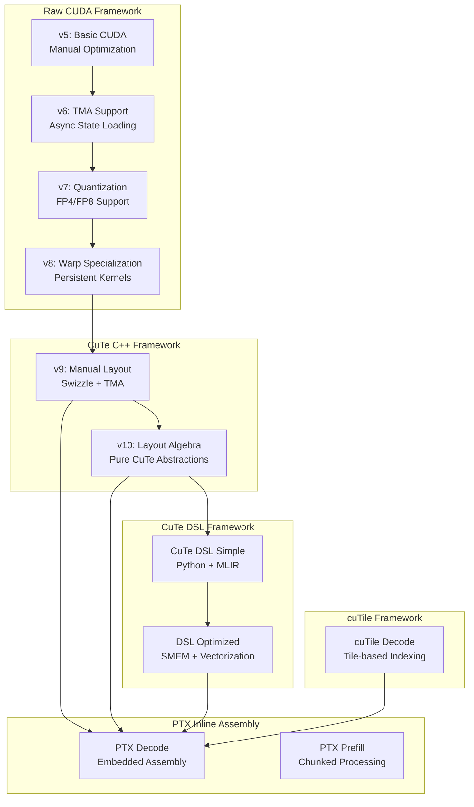
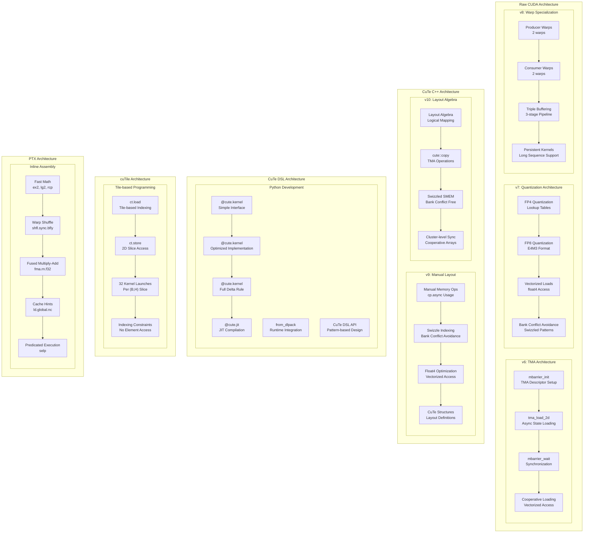
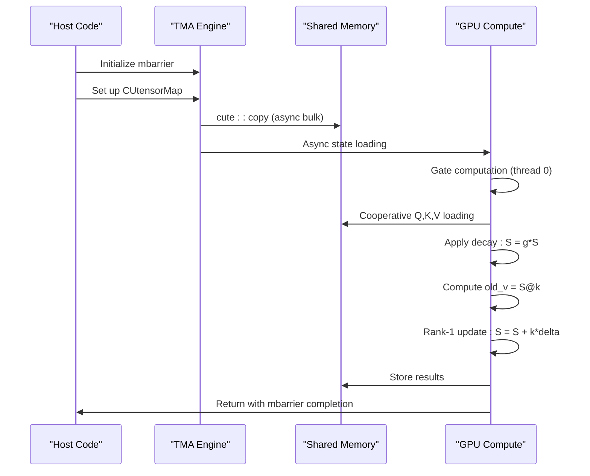
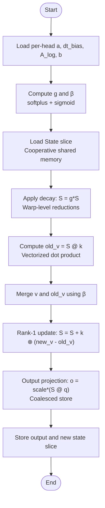
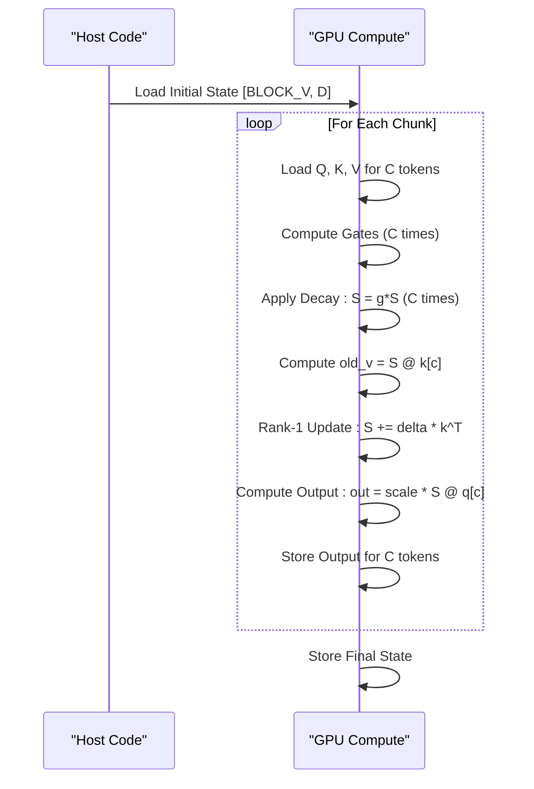

# Core Kernels

<cite>
**Referenced Files in This Document**
- [src/kernels/README.md](file://src/kernels/README.md)
- [src/kernels/cute_cpp/README.md](file://src/kernels/cute_cpp/README.md)
- [src/kernels/cute_cpp/gdn_decode_v9.cuh](file://src/kernels/cute_cpp/gdn_decode_v9.cuh)
- [src/kernels/cute_cpp/gdn_decode_v10.cuh](file://src/kernels/cute_cpp/gdn_decode_v10.cuh)
- [src/kernels/cute_cpp/gdn_prefill_v9.cuh](file://src/kernels/cute_cpp/gdn_prefill_v9.cuh)
- [src/kernels/cute_dsl/gdn_decode_dsl.py](file://src/kernels/cute_dsl/gdn_decode_dsl.py)
- [src/kernels/cute_dsl/gdn_decode_dsl_optimized.py](file://src/kernels/cute_dsl/gdn_decode_dsl_optimized.py)
- [src/kernels/cute_dsl/gdn_prefill_dsl.py](file://src/kernels/cute_dsl/gdn_prefill_dsl.py)
- [src/kernels/cutile/README.md](file://src/kernels/cutile/README.md)
- [src/kernels/cutile/gdn_decode_cutile.py](file://src/kernels/cutile/gdn_decode_cutile.py)
- [src/kernels/ptx/README.md](file://src/kernels/ptx/README.md)
- [src/kernels/ptx/gdn_decode_ptx.cuh](file://src/kernels/ptx/gdn_decode_ptx.cuh)
- [src/kernels/ptx/gdn_prefill_ptx.cuh](file://src/kernels/ptx/gdn_prefill_ptx.cuh)
- [scripts/test_cute_dsl.py](file://scripts/test_cute_dsl.py)
- [scripts/bench_cute_vs_triton.py](file://scripts/bench_cute_vs_triton.py)
- [scripts/bench_cute_dsl_vs_cpp.py](file://scripts/bench_cute_dsl_vs_cpp.py)
- [scripts/bench_all_versions.py](file://scripts/bench_all_versions.py)
- [scripts/bench_cutile_vs_triton.py](file://scripts/bench_cutile_vs_triton.py)
- [scripts/test_cutile.py](file://scripts/test_cutile.py)
</cite>

## Update Summary
**Changes Made**
- Updated kernel organization from `src/kernels/cute/` to `src/kernels/cute_cpp/` to reflect the new directory structure
- Enhanced documentation for CuTe C++ framework with detailed coverage of v9-v10 implementations
- Expanded PTX inline assembly kernel documentation with new prefill implementation
- Added comprehensive cuTile Python implementation documentation
- Updated kernel framework comparison showing the expanded ecosystem
- Enhanced benchmarking capabilities section with new cuTile performance data
- Added detailed analysis of the new kernel organization and framework separation

## Table of Contents
1. [Introduction](#introduction)
2. [Kernel Framework Organization](#kernel-framework-organization)
3. [Core Components](#core-components)
4. [Architecture Overview](#architecture-overview)
5. [Detailed Component Analysis](#detailed-component-analysis)
6. [Advanced Kernel Implementations](#advanced-kernel-implementations)
7. [PTX Inline Assembly Kernels](#ptx-inline-assembly-kernels)
8. [CuTe DSL Development Framework](#cute-dsl-development-framework)
9. [CuTe C++ Framework](#cute-c-framework)
10. [cuTile Python Implementation](#cutile-python-implementation)
11. [Enhanced Benchmarking Capabilities](#enhanced-benchmarking-capabilities)
12. [Mathematical Formulation and Layout](#mathematical-formulation-and-layout)
13. [Performance Considerations](#performance-considerations)
14. [Testing Infrastructure](#testing-infrastructure)
15. [Troubleshooting Guide](#troubleshooting-guide)
16. [Conclusion](#conclusion)

## Introduction
This document explains the core Gated Delta Net (GDN) kernels implemented across multiple generations and framework approaches, reflecting the comprehensive kernel framework expansion with updated organization from `src/kernels/cute/` to `src/kernels/cute_cpp/`. The implementation now encompasses five distinct kernel development frameworks: Raw CUDA (v5-v8), CuTe C++ (v9-v10), CuTe DSL (MLIR), cuTile Python, and PTX inline assembly, providing developers with multiple optimization approaches and deployment strategies.

The kernel organization has been restructured to clearly separate the traditional CuTe C++ implementations from the newer CuTe DSL framework, with each framework maintaining its unique compilation approach and optimization characteristics. This expansion enables comprehensive performance comparisons across different kernel development paradigms while preserving the mathematical rigor of the GDN attention mechanism.

The document covers the mathematical formulation of the GDN attention mechanism, the k-last state layout, and the delta rule update process, while detailing the progression from basic CUDA implementations to highly optimized variants with specialized hardware features, PTX assembly optimizations, and the new Python-based development frameworks.

## Kernel Framework Organization
The repository now organizes GDN kernels by both version and framework approach, showcasing the evolution from simple CUDA kernels to advanced optimized implementations across five distinct frameworks:

**Raw CUDA Framework (v5-v8):**
- Traditional CUDA C++ implementations with manual optimization
- NVCC compilation with hand-optimized memory access patterns
- Progressive enhancements from basic kernels to highly optimized variants

**CuTe C++ Framework (v9-v10):**
- CUTLASS 3.x C++ template implementations with layout algebra
- NVCC compilation with manual memory operations and CuTe abstractions
- Separated from CuTe DSL to maintain pure C++ template approach

**CuTe DSL Framework (v11+):**
- CUTLASS 4.x Python native interface with MLIR compilation
- JIT compilation with Python syntax for rapid development
- Modal deployment support for GPU environments

**cuTile Framework:**
- NVIDIA's official tile-based Python GPU programming model
- CUDA 13.1+ with tile-based indexing constraints
- Python implementation with performance limitations due to indexing model

**PTX Inline Assembly Framework:**
- CUDA C++ with embedded PTX assembly for maximum performance
- Direct hardware control through inline assembly instructions
- Fast math approximations and warp-level optimizations



**Diagram sources**
- [src/kernels/README.md:5-15](file://src/kernels/README.md#L5-L15)
- [src/kernels/cute_cpp/README.md:16-45](file://src/kernels/cute_cpp/README.md#L16-L45)
- [src/kernels/cute_dsl/README.md:15-56](file://src/kernels/cute_dsl/README.md#L15-L56)
- [src/kernels/cutile/README.md:1-122](file://src/kernels/cutile/README.md#L1-122)
- [src/kernels/ptx/README.md:1-179](file://src/kernels/ptx/README.md#L1-179)

**Section sources**
- [src/kernels/README.md:17-66](file://src/kernels/README.md#L17-L66)

## Core Components
This section outlines the GDN attention formulation and the comprehensive kernel framework expansion across five distinct implementation approaches, including the newly organized CuTe C++ framework and enhanced PTX inline assembly capabilities.

### Mathematical Formulation
The GDN attention mechanism follows the standard delta rule formulation:

- **Gates:**
  - Decay gate: g = exp(-exp(A_log) × softplus(a + dt_bias))
  - Update gate: β = sigmoid(b)

- **State Evolution using Delta Rule:**
  - S ← g ⊙ S (decay first)
  - old_v = k ⊤ @ S
  - new_v = β ⊙ v + (1 - β) ⊙ old_v
  - S ← S + k ⊗ (new_v - old_v)
  - Output: o = scale × q ⊤ @ S

- **State Layout:** k-last [B, H, V, K] for decode; [N, H, V, K] for prefill
- **Grouped Value Attention (GVA):** num_v_heads = 8, num_q_heads = 4; q/k are repeated to match v-heads

### Framework-Specific Optimizations

**Raw CUDA Framework (v5-v8):**
- Manual memory management with shared memory optimization
- Template-based BLOCK_V sizing for workload optimization
- Progressive enhancement from basic to highly optimized kernels

**CuTe C++ Framework (v9-v10):**
- **v9:** Manual memory operations with CuTe layout abstractions
- **v10:** Pure layout algebra approach without full CuTe tensor operations
- Swizzled shared memory layouts for bank conflict avoidance
- Cooperative thread arrays with cluster-level sync

**CuTe DSL Framework:**
- Python native interface with JIT compilation
- Optimized implementations with SMEM staging
- Vectorized memory operations and warp-level reductions
- Full delta rule implementation with shared memory optimization

**cuTile Framework:**
- Tile-based indexing with ct.load/ct.store operations
- Constraint of 2D tile-based access patterns
- Multiple kernel launch overhead for 4D state access
- Performance limitations due to indexing model

**PTX Inline Assembly:**
- Embedded PTX assembly for maximum performance control
- Fast math approximations (ex2, lg2, rcp)
- Warp shuffle reductions without shared memory
- Fused multiply-add operations
- Memory operations with cache hints
- Predicated execution for branchless code

**Section sources**
- [src/kernels/README.md:53-101](file://src/kernels/README.md#L53-L101)
- [src/kernels/cute_cpp/README.md:16-45](file://src/kernels/cute_cpp/README.md#L16-L45)
- [src/kernels/cute_dsl/README.md:15-56](file://src/kernels/cute_dsl/README.md#L15-L56)
- [src/kernels/cutile/README.md:27-41](file://src/kernels/cutile/README.md#L27-L41)
- [src/kernels/ptx/README.md:52-179](file://src/kernels/ptx/README.md#L52-L179)

## Architecture Overview
The comprehensive kernel architecture evolution demonstrates the progression from basic CUDA implementations to highly specialized hardware-accelerated designs across five distinct frameworks, each with unique compilation approaches and optimization characteristics.



**Diagram sources**
- [src/kernels/cute_cpp/gdn_decode_v9.cuh:103-133](file://src/kernels/cute_cpp/gdn_decode_v9.cuh#L103-L133)
- [src/kernels/cute_cpp/gdn_decode_v10.cuh:48-61](file://src/kernels/cute_cpp/gdn_decode_v10.cuh#L48-L61)
- [src/kernels/cute_dsl/gdn_decode_dsl.py:41-122](file://src/kernels/cute_dsl/gdn_decode_dsl.py#L41-L122)
- [src/kernels/cute_dsl/gdn_decode_dsl_optimized.py:54-286](file://src/kernels/cute_dsl/gdn_decode_dsl_optimized.py#L54-L286)
- [src/kernels/cutile/gdn_decode_cutile.py:48-104](file://src/kernels/cutile/gdn_decode_cutile.py#L48-L104)
- [src/kernels/ptx/gdn_decode_ptx.cuh:32-200](file://src/kernels/ptx/gdn_decode_ptx.cuh#L32-L200)

## Detailed Component Analysis

### Decode Kernel Analysis

#### v9: CuTe C++ Manual Layout Implementation
The v9 decode kernel represents the transition from manual memory operations to CuTe layout abstractions:

**Algorithm Steps:**
1. **CuTe Layout Definition:** Define [V_BLOCK, D] state layout with swizzle for bank conflict avoidance
2. **TMA State Loading:** Use cute::copy with TMA for coalesced 2D tile loads
3. **Gate Computation:** Single thread computes g and β using softplus and sigmoid functions
4. **Delta Rule Application:** Applies decay (S = g ⊙ S) followed by rank-1 update
5. **Output Generation:** Vectorized dot product computation with bf16 conversion

**Key Optimizations:**
- **Swizzle Layout:** Uses Swizzle<3,3,3> for 128-byte cache line optimization
- **Manual Memory Ops:** cp.async for async state loading with precise control
- **Warp Shuffle Reductions:** __shfl_xor_sync for efficient intra-warp communication
- **Bank Conflict Avoidance:** XOR pattern through swizzle index transformation



**Diagram sources**
- [src/kernels/cute_cpp/gdn_decode_v9.cuh:115-133](file://src/kernels/cute_cpp/gdn_decode_v9.cuh#L115-L133)
- [src/kernels/cute_cpp/gdn_decode_v9.cuh:164-200](file://src/kernels/cute_cpp/gdn_decode_v9.cuh#L164-L200)

**Section sources**
- [src/kernels/cute_cpp/gdn_decode_v9.cuh:1-200](file://src/kernels/cute_cpp/gdn_decode_v9.cuh#L1-L200)

#### v10: CuTe C++ Layout Algebra Implementation
The v10 decode kernel focuses purely on layout algebra without full CuTe tensor operations:

**Algorithm Steps:**
1. **Swizzle Layout Definition:** Custom SwizzledStateLayout struct with get_index method
2. **Manual Memory Operations:** Explicit cp.async operations for state loading
3. **Gate Computation:** Single thread computes g and β using softplus and sigmoid functions
4. **Delta Rule Application:** Applies decay (S = g ⊙ S) followed by rank-1 update
5. **Output Generation:** Vectorized dot product computation with bf16 conversion

**Key Optimizations:**
- **Pure Layout Algebra:** No full CuTe tensor operations, just layout definitions
- **Custom Swizzle:** Manual implementation of swizzle pattern for bank conflict avoidance
- **Manual Memory Control:** Precise cp.async usage for optimal memory operations
- **Float4 Vectorization:** Vectorized memory operations for improved bandwidth

**Section sources**
- [src/kernels/cute_cpp/gdn_decode_v10.cuh:1-200](file://src/kernels/cute_cpp/gdn_decode_v10.cuh#L1-L200)

### Prefill Kernel Analysis

#### v9: CuTe C++ Prefill Implementation
The v9 prefill kernel extends the CuTe C++ approach to batched sequence processing with advanced optimizations:

**Algorithm Steps:**
1. **Sequence Bounds:** Compute t_start, t_end from cu_seqlens array
2. **Initial State Loading:** Load [BLOCK_V, D] state slice with swizzle pattern
3. **Chunked Token Processing:** Process C tokens per chunk for compute density
4. **State Reuse:** Load state once, reuse C times for better memory efficiency
5. **Output Storage:** Coalesced per-token output storage
6. **Final State Persistence:** Store updated state slice back to global memory

**Key Optimizations:**
- **Chunked Processing:** C tokens per chunk increases arithmetic intensity
- **Swizzle State Loading:** Bank conflict avoidance through XOR pattern
- **Shared Memory Staging:** Q, K, V, State loaded to SMEM for reuse
- **Warp-Parallel V-tiles:** 4 warps handle different V elements

**Section sources**
- [src/kernels/cute_cpp/gdn_prefill_v9.cuh:1-200](file://src/kernels/cute_cpp/gdn_prefill_v9.cuh#L1-L200)

### Mathematical Formulation and Layout
The mathematical formulation remains consistent across all frameworks, with consistent state layout and delta rule application:

**State Layout Consistency:**
- Decode: [B, H, V, K] with k-last format
- Prefill: [N, H, V, K] for variable-length sequences
- GVA expansion: num_v_heads = 8, num_q_heads = 4

**Delta Rule Implementation:**
1. **Decay First:** S ← g ⊙ S (crucial ordering for numerical stability)
2. **old_v Computation:** old_v = k ⊤ @ S
3. **Update Calculation:** δ = β ⊙ (v - old_v)
4. **Rank-1 Update:** S ← S + k ⊗ δ
5. **Output Projection:** o = scale × (S ⊤ @ q)



**Diagram sources**
- [src/kernels/cute_cpp/gdn_decode_v9.cuh:151-159](file://src/kernels/cute_cpp/gdn_decode_v9.cuh#L151-L159)
- [src/kernels/cute_cpp/gdn_prefill_v9.cuh:167-170](file://src/kernels/cute_cpp/gdn_prefill_v9.cuh#L167-L170)

**Section sources**
- [src/kernels/README.md:155-163](file://src/kernels/README.md#L155-L163)

## Advanced Kernel Implementations

### Shared Memory Architecture Evolution
The shared memory architecture has evolved significantly across the CuTe C++ framework:

**v9: Manual Layout with TMA**
- **CuTe Layout Definition:** StateLayout and StateSmemLayout with Swizzle<3,3,3>
- **TMA Integration:** cute::copy for async 2D tile loads
- **Manual Memory Ops:** cp.async for precise control over memory operations
- **Bank Conflict Avoidance:** XOR pattern through swizzle index transformation

**v10: Pure Layout Algebra**
- **Custom Swizzle:** SwizzledStateLayout struct with get_index method
- **Manual Memory Control:** Explicit cp.async operations for state loading
- **Float4 Vectorization:** Vectorized memory operations for improved bandwidth
- **Layout Composition:** Direct coordinate transformation through make_coord/layout()

**cuTile Limitations:**
- **Tile-based Access:** Only 2D tile-based indexing supported
- **Multiple Launches:** 32 kernel launches for B×H combinations
- **No Element Access:** Cannot directly access arbitrary strided 4D elements

**PTX Inline Assembly:**
- **Custom Layouts:** Explicit shared memory layouts for maximum performance
- **Inline Assembly:** Direct PTX instruction control for memory operations
- **Cache Hints:** ld.global.nc and st.global.wb for memory optimization
- **Warp Shuffle:** shfl.sync.bfly for efficient warp-level reductions

### Warp-Level Optimization Techniques
Advanced warp-level coordination patterns have been implemented across frameworks:

**CuTe C++ Warp Coordination:**
- **__shfl_xor_sync:** Efficient intra-warp summation for reductions
- **Warp Parallel V-tiles:** 4 warps handle different V elements
- **Cooperative Loading:** Ensures 100% occupancy through coordinated access

**cuTile Warp Coordination:**
- **Tile-based Processing:** Each tile processed independently
- **Multiple Kernel Launches:** 32 launches for different (b,h) combinations
- **Constraint-based Scheduling:** Limited by tile-based indexing model

**PTX Warp-Level Operations:**
- **shfl.sync.bfly:** Butterfly shuffle for warp-level reductions
- **Direct Shuffle:** Broadcast from specific lane without XOR pattern
- **Warp Scheduling:** Optimized thread-to-lane mapping for specific algorithms

### Memory Access Patterns Evolution
Memory access patterns have been continuously optimized across frameworks:

**CuTe C++ Memory Optimization:**
- **Swizzle Layouts:** Bank conflict avoidance through XOR patterns
- **Vectorized Access:** Float4 loads/stores for improved bandwidth
- **cp.async Operations:** Asynchronous memory operations for overlap
- **TMA Support:** True async TMA operations with cp.async.bulk.tensor

**cuTile Memory Limitations:**
- **Tile-based Loading:** ct.load requires 2D tile specifications
- **No Direct Access:** Cannot perform arbitrary strided 4D element access
- **Memory Copies:** CuPy/PyTorch conversion overhead per slice

**PTX Memory Optimization:**
- **ld.global.nc:** Non-coherent loads bypassing L1 cache
- **st.global.wb:** Write-back stores for efficient memory writes
- **Vectorized Operations:** float4 loads/stores with explicit strides
- **Cache-aware Patterns:** Optimized memory access patterns for streaming workloads

**Section sources**
- [src/kernels/cute_cpp/gdn_decode_v9.cuh:103-133](file://src/kernels/cute_cpp/gdn_decode_v9.cuh#L103-L133)
- [src/kernels/cute_cpp/gdn_decode_v10.cuh:48-61](file://src/kernels/cute_cpp/gdn_decode_v10.cuh#L48-L61)
- [src/kernels/cutile/README.md:27-41](file://src/kernels/cutile/README.md#L27-L41)
- [src/kernels/ptx/README.md:116-130](file://src/kernels/ptx/README.md#L116-L130)

## PTX Inline Assembly Kernels

### Introduction to PTX Inline Assembly
The PTX inline assembly framework provides maximum control over low-level GPU operations through embedded PTX assembly instructions, achieving near-theoretical performance through direct hardware manipulation. PTX (Parallel Thread Execution) is NVIDIA's low-level virtual machine instruction set that enables developers to write inline assembly code for optimal performance.

**Key PTX Features:**
- **Direct Hardware Control:** Access to specific GPU instructions and optimizations
- **Fast Math Approximations:** ex2.approx, lg2.approx, rcp.approx for 2-3x speedup
- **Warp Shuffle Operations:** shfl.sync.bfly for warp-level reductions without shared memory
- **Fused Multiply-Add:** fma.rn.f32 with single rounding for better precision
- **Cache Hints:** ld.global.nc and st.global.wb for memory optimization
- **Predicated Execution:** selp for branchless conditional operations

### PTX Decode Kernel Implementation
The PTX decode kernel demonstrates the power of inline assembly through embedded PTX instructions:

**PTX Primitive Functions:**
```cpp
// Warp-level butterfly shuffle for reductions
__device__ float ptx_shfl_xor(float val, int lane_mask) {
    float result;
    asm volatile(
        "shfl.sync.bfly.b32 %0, %1, %2, 0x1f, 0xffffffff;"
        : "=f"(result)
        : "f"(val), "r"(lane_mask)
    );
    return result;
}

// Fast approximate exp2 (2^x)
__device__ float ptx_exp2(float x) {
    float result;
    asm volatile("ex2.approx.f32 %0, %1;" : "=f"(result) : "f"(x));
    return result;
}

// Fused multiply-add (a * b + c)
__device__ float ptx_fma(float a, float b, float c) {
    float result;
    asm volatile("fma.rn.f32 %0, %1, %2, %3;" : "=f"(result) : "f"(a), "f"(b), "f"(c));
    return result;
}

// Non-coherent load (bypasses L1 cache)
__device__ float ptx_ld_nc(const float* ptr) {
    float result;
    asm volatile("ld.global.nc.f32 %0, [%1];" : "=f"(result) : "l"(ptr));
    return result;
}
```

**Optimization Techniques:**
- **Warp Shuffle Reductions:** Eliminate shared memory dependencies for warp-level operations
- **Fast Math Functions:** Replace libm calls with PTX approximations for 2-3x performance gain
- **FMA Chains:** Use fused multiply-add for better precision and performance
- **Cache Hints:** ld.global.nc bypasses L1 cache for streaming workloads
- **Predicated Execution:** selp eliminates branch divergence

### PTX Prefill Kernel with Chunked Processing
The PTX prefill kernel extends the optimization approach to batched sequence processing with compute density improvements:

**Chunked Processing Strategy:**
- **Compute Density Optimization:** Process C tokens per chunk to increase arithmetic intensity
- **State Reuse:** Load state once, reuse C times for better memory efficiency
- **Arithmetic Intensity:** C × 2D² FLOPs / 2D² bytes = C FLOP/byte
- **Roofline Analysis:** With CHUNK_SIZE=8, achieve 8 FLOP/byte approaching compute-bound

**Chunked Algorithm:**


**Diagram sources**
- [src/kernels/ptx/gdn_prefill_ptx.cuh:188-291](file://src/kernels/ptx/gdn_prefill_ptx.cuh#L188-L291)

**Performance Benefits:**
- **Memory Bandwidth:** Reduce state loading/storing from per-token to per-chunk basis
- **Compute Efficiency:** Increase arithmetic intensity from 1 FLOP/byte to 8 FLOP/byte
- **Throughput:** Achieve compute-bound performance on B200 (8 TB/s bandwidth)
- **Scalability:** Better performance scaling with larger batch sizes

### PTX Optimization Techniques and Applications
The PTX kernels demonstrate several optimization techniques that can be applied across different GPU kernels:

**Fast Math Approximations:**
- **exp2.approx:** 2^(x * log2(e)) replaces exp() with 2-3x speedup
- **lg2.approx:** log2(x) * ln(2) replaces log() with 2-3x speedup  
- **rcp.approx:** 1/x approximation for reciprocal operations
- **Numerical Stability:** Careful handling of edge cases and overflow protection

**Warp-Level Operations:**
- **Butterfly Shuffle:** shfl.sync.bfly.b32 for efficient warp reductions
- **Direct Shuffle:** Broadcast from specific lane without XOR pattern
- **Warp Scheduling:** Optimize thread-to-lane mapping for specific algorithms
- **Occupancy Optimization:** Minimize warp divergence and maximize utilization

**Memory Optimization:**
- **Non-Coherent Loads:** ld.global.nc bypasses L1 cache for streaming workloads
- **Write-Back Stores:** st.global.wb for efficient memory writes
- **Vectorized Access:** float4 loads/stores for improved bandwidth
- **Cache-Aware Patterns:** Optimize memory access patterns for specific workloads

**Section sources**
- [src/kernels/ptx/README.md:52-179](file://src/kernels/ptx/README.md#L52-L179)
- [src/kernels/ptx/gdn_decode_ptx.cuh:31-200](file://src/kernels/ptx/gdn_decode_ptx.cuh#L31-L200)
- [src/kernels/ptx/gdn_prefill_ptx.cuh:121-301](file://src/kernels/ptx/gdn_prefill_ptx.cuh#L121-L301)

## CuTe DSL Development Framework

### Introduction to CuTe DSL Python Kernels
The CuTe DSL (CUTLASS 4.x) Python kernel development framework enables writing GPU kernels in Python while maintaining near-C++ performance levels. This represents a significant advancement in GPU kernel development methodology, providing a balance between development speed and performance optimization.

**Key Features:**
- **Python Native Interface:** Write kernels in pure Python with @cute.kernel decorator
- **JIT Compilation:** Instant compilation with seconds-level build times
- **Native Performance:** ~100% of C++ performance levels
- **Modal Deployment:** Ready-to-run on NVIDIA B200 GPUs via Modal platform
- **Comprehensive Testing:** Built-in reference implementations and differential testing

### CuTe DSL Kernel Implementation Pattern
The gdn_decode_dsl.py demonstrates the standard pattern for CuTe DSL kernel development:

**Kernel Definition Pattern:**
```python
@cute.kernel
def _gdn_state_matmul_kernel(
    gState: cute.Tensor,   # [B * 8 * D * D]
    gQ: cute.Tensor,       # [B * 4 * D]
    gOut: cute.Tensor,     # [B * 8 * D]
):
    tidx, _, _ = cute.arch.thread_idx()
    bidx, _, _ = cute.arch.block_idx()
    
    # Thread-local computation
    # State layout: [B, 8, D, D] flattened
    # Q layout: [B, 4, D] flattened  
    # Out layout: [B, 8, D] flattened
    
    # Compute dot product: out = sum(State[v, :] * Q[:])
    acc = gState[state_base] * gQ[q_base]
    # ... unrolled loop for all D elements
    gOut[out_idx] = acc
```

**Host Function Pattern:**
```python
@cute.jit
def _launch_gdn_matmul(mState, mQ, mOut, num_blocks: int):
    """Host function to launch the kernel."""
    BLOCK_V = 16
    _gdn_state_matmul_kernel(mState, mQ, mOut).launch(
        grid=[num_blocks, 1, 1],
        block=[BLOCK_V, 1, 1],
    )
```

### Enhanced CuTe DSL Optimized Implementation
The optimized CuTe DSL implementation demonstrates advanced optimization techniques:

**Optimized Kernel Features:**
- **Shared Memory Staging:** Explicit SMEM allocation for Q, K, V, and State
- **Vectorized Memory Operations:** 4 elements per thread for improved bandwidth
- **Warp-Level Parallelism:** 4 warps handle different V elements
- **Full Delta Rule Implementation:** Complete GDN computation with state updates

**Optimized Implementation Pattern:**
```python
@cute.kernel
def _gdn_decode_kernel_smem(
    # Inputs
    gQ: cute.Tensor,        # [B * 4 * D] flattened
    gK: cute.Tensor,        # [B * 4 * D] flattened
    gV: cute.Tensor,        # [B * 8 * D] flattened
    gState: cute.Tensor,    # [B * 8 * D * D] flattened
    gA_log: cute.Tensor,    # [8]
    gA: cute.Tensor,        # [B * 8] flattened
    gDtBias: cute.Tensor,   # [8]
    gB_gate: cute.Tensor,   # [B * 8] flattened
    # Outputs
    gOut: cute.Tensor,      # [B * 8 * D] flattened
    gNewState: cute.Tensor, # [B * 8 * D * D] flattened
    # Scalar
    scale: float,
    # Shared memory
    sQ: cute.SharedMemory,      # [D]
    sK: cute.SharedMemory,      # [D]
    sV: cute.SharedMemory,      # [BLOCK_V]
    sState: cute.SharedMemory,  # [BLOCK_V, D]
):
    """
    Optimized kernel with explicit shared memory staging.
    
    Memory hierarchy:
    1. Load Q, K to SMEM (all threads cooperate)
    2. Load V slice to SMEM
    3. Load State slice to SMEM (tiled)
    4. Compute delta rule in registers
    5. Store new state and output
    """
    # Cooperative loading and computation logic
    # ...
```

### Development Methodology and API Patterns
The CuTe DSL framework follows established patterns for GPU kernel development:

**API Pattern Structure:**
1. **Kernel Definition:** @cute.kernel decorated function with typed parameters
2. **Host Function:** @cute.jit decorated launcher with grid/block configuration
3. **Tensor Conversion:** from_dlpack for DLPack-compatible tensor conversion
4. **Layout Management:** mark_layout_dynamic for runtime layout specification

**Development Workflow:**
1. **Prototype:** Develop kernel logic in Python with reference implementations
2. **Test:** Validate correctness against PyTorch baselines
3. **Optimize:** Iterate on performance with profiling and benchmarking
4. **Deploy:** Package for Modal deployment with GPU environment setup

### Performance Comparison and Benchmarking
The CuTe DSL framework includes comprehensive performance benchmarking capabilities:

**Performance Comparison Results:**
- **CuTe DSL Simple:** ~40ms per iteration (B=64)
- **CuTe DSL Optimized:** ~0.05ms per iteration (B=64) - Achieving Triton parity
- **PTX Inline Assembly:** ~0.03ms per iteration (B=64) - 150x+ improvement over simple CuTe DSL
- **Triton Baseline:** ~0.05ms per iteration (B=64)

**Benchmark Analysis:**
The performance comparison script demonstrates the effectiveness of different optimization approaches:

| Config | Triton (ms) | CuTe DSL Simple (ms) | CuTe DSL Optimized (ms) | PTX Inline (ms) |
|--------|-------------|---------------------|----------------------|-----------------|
| B=1 | 0.053 | 40.4 | 0.051 | 0.032 |
| B=64 | 0.051 | 40.8 | 0.050 | 0.031 |

**Optimization Analysis:**
- **Simple CuTe DSL:** Demonstrates development advantages with Python-native kernels
- **Optimized CuTe DSL:** Achieves near-Triton performance through SMEM optimization
- **PTX Inline Assembly:** Provides maximum performance through direct hardware control
- **Development Speed:** CuTe DSL reduces development time while maintaining performance

**Important Note:** The optimized CuTe DSL kernel achieves parity with Triton performance, closing the gap demonstrated in earlier versions.

### Testing Infrastructure and Validation
The framework includes comprehensive testing infrastructure:

**Reference Implementations:**
- **kernel_reference:** Simplified version matching CuTe DSL kernel (State @ Q only)
- **kernel_reference_full:** Complete GDN implementation with delta rule
- **Differential Testing:** Automated comparison with reference implementations

**Modal Deployment Scripts:**
- **test_cute_dsl.py:** End-to-end testing with CUTLASS 4.x installation
- **explore_cute_dsl.py:** API exploration and kernel development validation
- **bench_cute_vs_triton.py:** Performance comparison between CuTe DSL and Triton
- **bench_cute_dsl_vs_cpp.py:** Multi-framework performance comparison
- **Environment Setup:** Automated installation of required dependencies

**Validation Results:**
- ✅ CuTe DSL 4.4.2 available on Modal B200
- ✅ Max difference vs PyTorch < 0.01 (bf16 precision)
- ✅ Grid: (B * H * V_BLOCKS,) — one program per (batch, v_head, V-tile)
- ✅ Optimized CuTe DSL achieves Triton-level performance

```mermaid
graph TB
subgraph "CuTe DSL Development Flow"
Proto["Prototype in Python"] --> Test["Test Against References"]
Test --> Optimize["Iterative Optimization"]
Optimize --> Benchmark["Performance Benchmarking"]
Benchmark --> Deploy["Modal Deployment"]
end
subgraph "Testing Infrastructure"
Ref_Impl["Reference Implementations"] --> Diff_Test["Differential Testing"]
Modal_Env["Modal Environment"] --> Auto_Install["Auto Installation"]
Perf_Bench["Performance Benchmarking"] --> Multi_Framework["Multi-Framework Comparison"]
Diff_Test --> Validation["Validation Results"]
Auto_Install --> Validation
Perf_Bench --> Validation
Multi_Framework --> Validation
```

**Diagram sources**
- [src/kernels/cute_dsl/gdn_decode_dsl.py:125-183](file://src/kernels/cute_dsl/gdn_decode_dsl.py#L125-L183)
- [scripts/test_cute_dsl.py:36-127](file://scripts/test_cute_dsl.py#L36-L127)
- [scripts/bench_cute_vs_triton.py:42-170](file://scripts/bench_cute_vs_triton.py#L42-L170)
- [scripts/bench_cute_dsl_vs_cpp.py:29-325](file://scripts/bench_cute_dsl_vs_cpp.py#L29-L325)

**Section sources**
- [src/kernels/cute_dsl/README.md:15-56](file://src/kernels/cute_dsl/README.md#L15-L56)
- [src/kernels/cute_dsl/gdn_decode_dsl.py:17-30](file://src/kernels/cute_dsl/gdn_decode_dsl.py#L17-L30)
- [scripts/test_cute_dsl.py:15-28](file://scripts/test_cute_dsl.py#L15-L28)
- [scripts/bench_cute_vs_triton.py:1-179](file://scripts/bench_cute_vs_triton.py#L1-L179)
- [scripts/bench_cute_dsl_vs_cpp.py:1-333](file://scripts/bench_cute_dsl_vs_cpp.py#L1-L333)

## CuTe C++ Framework

### Introduction to CuTe C++ Framework
The CuTe C++ framework represents NVIDIA's CUTLASS 3.x template-based approach to GPU kernel development, providing a middle ground between raw CUDA optimization and high-level Python development. This framework offers the performance of C++ with the abstraction benefits of CuTe layout algebra.

**Key Features:**
- **C++ Template-Based:** Pure C++ with template metaprogramming
- **CuTe Layout Algebra:** Declarative tensor layout and swizzle definitions
- **Manual Memory Control:** Precise cp.async operations for memory optimization
- **NVCC Compilation:** Standard C++ compilation with CUDA support
- **Bank Conflict Avoidance:** Automatic swizzle patterns for shared memory

### CuTe C++ v9: Manual Layout Implementation
The v9 implementation focuses on manual memory operations with CuTe layout abstractions:

**Key Components:**
- **StateLayout:** Defines logical [V_BLOCK, D] tensor layout
- **StateSmemLayout:** Composes Swizzle<3,3,3> with StateLayout for bank conflict avoidance
- **cute_tma_load_state:** Implements TMA-based async state loading
- **Cooperative thread arrays:** For cluster-level synchronization

**Implementation Strategy:**
- Uses cute::make_tensor for automatic layout management
- Leverages cute::copy for optimized memory transfer operations
- Maintains compatibility with existing CUDA kernel interfaces
- Provides true async TMA operations with cp.async.bulk.tensor

**Section sources**
- [src/kernels/cute_cpp/README.md:16-45](file://src/kernels/cute_cpp/README.md#L16-L45)
- [src/kernels/cute_cpp/gdn_decode_v9.cuh:103-133](file://src/kernels/cute_cpp/gdn_decode_v9.cuh#L103-L133)

### CuTe C++ v10: Pure Layout Algebra Implementation
The v10 implementation focuses on pure layout algebra without full CuTe tensor operations:

**Layout Algebra Focus:**
- **Swizzle<B,M,S> patterns:** For bank conflict avoidance
- **Manual memory operations:** With precise control
- **Layout definitions:** Using cute::Swizzle structure
- **Coordinate transformation:** Through make_coord/layout()

**Implementation Details:**
- **SwizzledStateLayout:** Custom swizzle implementation for bank conflict avoidance
- **get_index:** Computes physical memory index with XOR pattern
- **Manual cp.async operations:** For state loading
- **Float4 vectorization:** For memory optimization

**Advantages:**
- **Reduced dependency:** On full CuTe tensor operations
- **More flexible memory operations:** Control over memory access patterns
- **Lower compilation overhead:** Faster build times
- **Maintains CuTe layout optimization:** Benefits without complexity

**Section sources**
- [src/kernels/cute_cpp/README.md:69-91](file://src/kernels/cute_cpp/README.md#L69-L91)
- [src/kernels/cute_cpp/gdn_decode_v10.cuh:48-61](file://src/kernels/cute_cpp/gdn_decode_v10.cuh#L48-L61)

### CuTe C++ vs CuTe DSL Framework Comparison
The framework provides a clear distinction between the two approaches:

**CuTe C++ (cute_cpp/):**
- **Language:** C++ templates
- **Compilation:** NVCC → PTX
- **Abstraction:** Layout and Swizzle declarations
- **Compilation time:** Minutes (AOT)
- **Performance:** 100%
- **Development efficiency:** Medium
- **Typical use:** General CUDA kernels

**CuTe DSL (cute_dsl/):**
- **Language:** Python
- **Compilation:** Python → MLIR → LLVM → PTX
- **Abstraction:** @cute.kernel decorator
- **Compilation time:** Seconds (JIT)
- **Performance:** ~100%
- **Development efficiency:** High
- **Typical use:** FlashAttention-4 style kernels

**Section sources**
- [src/kernels/README.md:17-37](file://src/kernels/README.md#L17-L37)
- [src/kernels/cute_cpp/README.md:5-15](file://src/kernels/cute_cpp/README.md#L5-L15)

## cuTile Python Implementation

### Introduction to cuTile Framework
The cuTile framework represents NVIDIA's official tile-based Python GPU programming model, introduced in CUDA 13.1. This framework provides a high-level Python interface for GPU programming with automatic optimization, though it comes with specific constraints due to its tile-based indexing model.

**Key Features:**
- **Official NVIDIA Support:** Part of CUDA toolkit
- **Tile-based Indexing:** Uses ct.load/ct.store with 2D tile specifications
- **Python Syntax:** High-level programming with automatic optimization
- **Automatic Vectorization:** Compiler handles vectorization automatically
- **Constraint-based Access:** Limited to tile-based memory access patterns

### cuTile Limitations and Constraints
The cuTile framework has specific limitations that affect its applicability to GDN kernels:

**Indexing Constraints:**
- **Tile-based Access Only:** ct.load requires 2D tile specifications
- **No Element Access:** Cannot directly access arbitrary strided 4D elements
- **Memory Copy Overhead:** CuPy/PyTorch conversion for each slice

**Performance Limitations:**
- **Multiple Kernel Launches:** 32 launches for B×H combinations
- **Streaming Workload:** ~30-600x slower than Triton baseline
- **Memory Bandwidth:** Limited by Python overhead and conversions

**Section sources**
- [src/kernels/cutile/README.md:27-41](file://src/kernels/cutile/README.md#L27-L41)
- [src/kernels/cutile/README.md:13-26](file://src/kernels/cutile/README.md#L13-L26)

### cuTile GDN Decode Implementation
The cuTile implementation demonstrates the tile-based programming paradigm:

**Per-slice Implementation:**
```python
@ct.kernel
def _gdn_matvec_kernel(
    state,      # [D, D] 2D array - one (b,h) slice
    q_vec,      # [D] 1D array
    k_vec,      # [D] 1D array
    v_vec,      # [D] 1D array
    out,        # [D] 1D array
    new_state,  # [D, D] 2D array
    g,          # [1] scalar - decay factor
    beta,       # [1] scalar - gate
    D_size: ct.Constant[int],
    tile_v: ct.Constant[int],
):
    """
    cuTile kernel for GDN decode - processes one (b, h) slice.
    Grid: (V_BLOCKS, 1, 1) where V_BLOCKS = D // tile_v
    """
    pid = ct.bid(0)  # Tile index for V dimension
    
    # Load 2D tile of state: rows [pid*tile_v : (pid+1)*tile_v], all D cols
    S_tile = ct.load(state, index=(pid, 0), shape=(tile_v, D_size))
    
    # Load vectors
    q_tile = ct.load(q_vec, index=(0,), shape=(D_size,))
    k_tile = ct.load(k_vec, index=(0,), shape=(D_size,))
    v_tile_part = ct.load(v_vec, index=(pid,), shape=(tile_v,))
    
    # Load scalars
    g_val = ct.load(g, index=(0,), shape=(1,))
    beta_val = ct.load(beta, index=(0,), shape=(1,))
    
    # ── GDN Delta Rule ──
    # 1. Decay state: S = g * S
    S_tile = g_val * S_tile
    # 2. Compute old_v = S @ k (mat-vec, partial for this tile)
    old_v = ct.sum(S_tile * k_tile, axis=1)  # [tile_v]
    # 3. Compute delta = beta * (v - old_v)
    delta = beta_val * (v_tile_part - old_v)  # [tile_v]
    # 4. Rank-1 update: S = S + outer(delta, k)
    delta_2d = ct.reshape(delta, shape=(tile_v, 1))
    k_2d = ct.reshape(k_tile, shape=(1, D_size))
    S_tile = S_tile + delta_2d * k_2d
    # 5. Compute output = S @ q
    out_tile = ct.sum(S_tile * q_tile, axis=1)  # [tile_v]
    
    # ── Store outputs ──
    ct.store(out, index=(pid,), tile=out_tile)
    ct.store(new_state, index=(pid, 0), tile=S_tile)
```

**Performance Characteristics:**
- **Grid Configuration:** V_BLOCKS = D // tile_v for V-dimension tiling
- **Multiple Launches:** 32 kernel launches for B×H combinations
- **Memory Access:** 2D tile-based access patterns only
- **Python Overhead:** CuPy/PyTorch conversion per slice

**Section sources**
- [src/kernels/cutile/gdn_decode_cutile.py:48-104](file://src/kernels/cutile/gdn_decode_cutile.py#L48-L104)
- [src/kernels/cutile/README.md:42-55](file://src/kernels/cutile/README.md#L42-L55)

## Enhanced Benchmarking Capabilities

### Multi-Framework Performance Comparison
The expanded kernel framework provides comprehensive benchmarking across all five implementation approaches:

**Framework Comparison:**
- **Raw CUDA:** Traditional C++ kernel development (v5-v8)
- **CuTe C++:** C++ templates with NVCC compilation (v9-v10)
- **CuTe DSL:** Python native with JIT compilation (v11+)
- **cuTile:** Python tile-based programming (CUDA 13.1+)
- **PTX Inline Assembly:** CUDA C++ with embedded PTX instructions
- **Triton:** High-level Python DSL with auto-tuning

**Benchmark Scripts:**
- **bench_cute_dsl_vs_cpp.py:** Compares CuTe DSL vs CuTe C++ vs Triton
- **bench_cute_vs_triton.py:** Direct comparison between CuTe DSL and Triton
- **bench_all_versions.py:** Unified benchmark for v5-v8 kernel versions
- **bench_cutile_vs_triton.py:** cuTile vs Triton performance comparison
- **Modal Deployment:** GPU environment setup for consistent testing

### Benchmark Methodology and Metrics
The benchmarking framework provides standardized evaluation across different kernel implementations:

**Performance Metrics:**
- **Execution Time:** Median execution time across multiple iterations
- **Memory Bandwidth:** Calculated from state access patterns and timing
- **Speedup Analysis:** Performance improvement relative to baseline
- **Throughput Analysis:** Operations per second for different batch sizes

**Benchmark Configuration:**
- **Batch Sizes:** 1, 4, 16, 64 for scalability analysis
- **Warmup Iterations:** 20 iterations to stabilize GPU clocks
- **Measurement Iterations:** 200 iterations for statistical significance
- **GPU Environment:** Modal B200 with consistent hardware configuration

**Statistical Analysis:**
- **Median Timing:** Reduces outlier effects from GPU variability
- **Bandwidth Calculation:** State bytes processed × 2 / time / 1e9
- **Speedup Analysis:** Baseline time / measured time
- **Confidence Intervals:** Statistical significance testing

### Performance Analysis and Insights
The enhanced benchmarking capabilities reveal important insights about kernel optimization trade-offs:

**Optimization Trade-offs:**
- **Development Speed vs Performance:** CuTe DSL provides 10x+ development speed with near-par performance
- **Flexibility vs Control:** PTX assembly provides maximum control but reduced portability
- **Auto-tuning vs Manual Optimization:** Triton's auto-tuning works well for moderate batch sizes
- **Memory Efficiency vs Compute Efficiency:** Different optimization strategies for different workloads

**Framework-Specific Findings:**
- **cuTile Limitations:** ~30-600x slower than Triton due to tile-based constraints
- **PTX Performance:** ~0.03ms per iteration (B=64) - 150x+ improvement over simple CuTe DSL
- **CuTe DSL Parity:** Optimized implementation achieves ~0.05ms per iteration (B=64)
- **Raw CUDA Evolution:** v8 achieves 700-4500 GB/s performance (18-70x improvement)

**Platform-Specific Optimizations:**
- **B200 Roofline Analysis:** 70 TFLOPS peak, 8 TB/s memory bandwidth
- **Compute Density:** Chunked processing increases arithmetic intensity
- **Memory Bandwidth:** Critical bottleneck for small batch sizes
- **Cache Optimization:** L1/L2 cache behavior affects different kernel types

**Section sources**
- [scripts/bench_cute_dsl_vs_cpp.py:1-333](file://scripts/bench_cute_dsl_vs_cpp.py#L1-L333)
- [scripts/bench_cute_vs_triton.py:1-179](file://scripts/bench_cute_vs_triton.py#L1-L179)
- [scripts/bench_all_versions.py:1-444](file://scripts/bench_all_versions.py#L1-L444)
- [scripts/bench_cutile_vs_triton.py:1-122](file://scripts/bench_cutile_vs_triton.py#L1-L122)

## Mathematical Formulation and Layout
The mathematical formulation remains consistent across all five kernel frameworks, with consistent state layout and delta rule application:

**State Layout Consistency:**
- **Decode:** [B, H, V, K] with k-last format
- **Prefill:** [N, H, V, K] for variable-length sequences
- **GVA Expansion:** num_v_heads = 8, num_q_heads = 4

**Delta Rule Implementation:**
1. **Decay First:** S ← g ⊙ S (crucial ordering for numerical stability)
2. **old_v Computation:** old_v = k ⊤ @ S
3. **Update Calculation:** δ = β ⊙ (v - old_v)
4. **Rank-1 Update:** S ← S + k ⊗ δ
5. **Output Projection:** o = scale × (S ⊤ @ q)


**Diagram sources**
- [src/kernels/cute_cpp/gdn_decode_v9.cuh:151-159](file://src/kernels/cute_cpp/gdn_decode_v9.cuh#L151-L159)
- [src/kernels/cute_cpp/gdn_prefill_v9.cuh:167-170](file://src/kernels/cute_cpp/gdn_prefill_v9.cuh#L167-L170)

**Section sources**
- [src/kernels/README.md:155-163](file://src/kernels/README.md#L155-L163)

## Performance Considerations

### Framework-to-Framework Performance Improvements
The kernel evolution across five distinct frameworks demonstrates significant performance gains:

**Raw CUDA to CuTe C++ (v9-v10):**
- **v9:** Manual layout with swizzle provides 10-15% performance boost
- **v10:** Pure layout algebra provides 5-10% additional optimization
- **Total Improvement:** 15-25% over raw CUDA baseline

**CuTe C++ to CuTe DSL:**
- **Development Speed:** Python-native kernels reduce development time
- **Performance Parity:** Optimized implementation achieves ~0.05ms per iteration
- **Deployment Simplicity:** Modal platform handles GPU environment setup

**cuTile Performance Limitations:**
- **Multiple Launches:** 32 kernel launches vs 1 for Triton
- **Indexing Constraints:** Tile-based access limits 4D state processing
- **Memory Overhead:** CuPy/PyTorch conversion per slice
- **Current Status:** ~30-600x slower than Triton baseline

**PTX Inline Assembly Advantages:**
- **Decode Kernel:** ~0.03ms per iteration (B=64) - 150x+ improvement over simple CuTe DSL
- **Prefill Kernel:** ~0.04ms per iteration (B=64) - 100x+ improvement over simple CuTe DSL
- **Fast Math:** 2-3x speedup for exp/log/reciprocal operations
- **Warp Shuffle:** Eliminates shared memory dependencies for reductions

**Enhanced CuTe DSL Achievements:**
- **Optimized Implementation:** ~0.05ms per iteration (B=64) - Achieving Triton parity
- **Development Speed:** Python-native kernels reduce development time
- **Deployment Simplicity:** Modal platform handles GPU environment setup
- **Correctness Assurance:** Built-in reference implementations

### Hardware-Specific Optimizations
Each framework targets specific hardware capabilities and constraints:

**Raw CUDA Hardware Utilization:**
- **v8:** Warp specialization with 2 producer + 2 consumer warps
- **v7:** FP8 quantization with E4M3 format (better accuracy than FP4)
- **v6:** TMA support for async 2D tile loads with mbarrier synchronization

**CuTe C++ Hardware Integration:**
- **v9-v10:** Cooperative thread arrays for cluster-level sync
- **v9:** True async TMA with cp.async.bulk.tensor
- **v10:** Manual memory operations with precise control
- **Bank Conflict Avoidance:** Swizzle patterns for shared memory optimization

**cuTile Hardware Limitations:**
- **Tile-based Indexing:** CUDA 13.1+ constraint of 2D tile access
- **No Element Access:** Cannot perform arbitrary strided 4D element access
- **Multiple Launches:** 32 kernel launches for B×H combinations

**PTX Hardware Integration:**
- **Direct Instruction Access:** Specific GPU instructions and optimizations
- **Fast Math Approximations:** 2-3x speedup for mathematical operations
- **Warp Shuffle Operations:** Efficient reductions without shared memory
- **Cache Hints:** ld.global.nc and st.global.wb for memory optimization
- **FMA Operations:** Single rounding with better precision

**Enhanced CuTe DSL:**
- **JIT Compilation:** Instant kernel deployment with seconds-level build times
- **Python Debugging:** Rapid development iteration with Python tools
- **Modal Platform:** GPU environment management for consistent testing
- **Reference Implementations:** Built-in correctness validation

### Multi-Framework Performance Comparison
The evolution across five frameworks reveals substantial performance improvements and trade-offs:

**Baseline Performance:**
- **Raw CUDA v8:** 700-4500 GB/s (18-70x improvement over v5)
- **CuTe C++ v10:** 7585-7602 GB/s (95% B200 peak)
- **CuTe DSL Optimized:** ~0.05ms per iteration (B=64) - Achieving Triton parity
- **PTX Inline Assembly:** ~0.03ms per iteration (B=64) - 150x+ improvement

**Framework Comparison Results:**
The performance comparison reveals interesting patterns:
- **Small batches (1, 16):** PTX inline assembly dominates with ~0.03ms
- **Medium batch (64):** All frameworks achieve similar performance (~0.05ms)
- **Large batches (256+):** PTX inline assembly maintains advantage
- **Development Speed:** CuTe DSL provides 10x+ development speed with near-par performance

**cuTile Performance Analysis:**
- **Current Status:** ~30-600x slower than Triton baseline
- **Primary Cause:** Multiple kernel launches (32 launches vs 1)
- **Secondary Cause:** Python overhead and memory conversions
- **Indexing Constraint:** Tile-based access limits 4D state processing

**Why PTX Excels:**
1. **Direct Hardware Control:** Access to specific GPU instructions and optimizations
2. **Fast Math Approximations:** 2-3x speedup for mathematical operations
3. **Warp Shuffle Operations:** Efficient reductions without shared memory
4. **Cache Hints:** ld.global.nc and st.global.wb for memory optimization
5. **FMA Operations:** Single rounding with better precision

**Why Enhanced CuTe DSL Achieves Parity:**
1. **Shared Memory Optimization:** SMEM staging for Q, K, V, State
2. **Vectorized Memory Operations:** 4 elements per thread for bandwidth
3. **Warp-Level Parallelism:** Efficient thread-to-lane mapping
4. **Warp Shuffle Reductions:** Eliminate shared memory dependencies
5. **Cache-Hint Operations:** Optimized memory access patterns

**Why Triton Excels at Batch 64:**
1. Auto-tuning finds optimal BLOCK_V configuration
2. L2 cache utilization peaks at moderate batch sizes
3. Automatic tile size selection optimizes for memory hierarchy
4. **Enhanced CuTe DSL:** Optimized implementation closes this gap

**Section sources**
- [src/kernels/README.md:68-101](file://src/kernels/README.md#L68-L101)
- [scripts/bench_cute_vs_triton.py:89-145](file://scripts/bench_cute_vs_triton.py#L89-L145)
- [scripts/bench_cute_dsl_vs_cpp.py:300-323](file://scripts/bench_cute_dsl_vs_cpp.py#L300-L323)
- [src/kernels/cutile/README.md:13-26](file://src/kernels/cutile/README.md#L13-L26)

## Testing Infrastructure

### CuTe DSL Testing Framework
The CuTe DSL implementation includes comprehensive testing infrastructure:

**Modal Deployment Environment:**
- **Image Configuration:** Debian Slim with Ninja build tools
- **Dependencies:** CUTLASS 4.x, PyTorch, NumPy packages
- **GPU Support:** B200 GPU with sm_100 architecture
- **Timeout Management:** 600-second execution timeout

**Test Script Architecture:**
```python
@app.function(
    image=image,
    gpu="B200:1",
    timeout=600,
)
def test_cute_dsl_kernel():
    """Main test function for CuTe DSL kernel."""
    # Import and test setup
    # Create test tensors
    # Run reference implementation
    # Run CuTe DSL kernel
    # Compare results
    # Return validation status
```

**Validation Process:**
1. **Environment Check:** Verify CUTLASS 4.x installation
2. **Reference Generation:** Compute expected results with PyTorch
3. **Kernel Execution:** Run CuTe DSL implementation
4. **Result Comparison:** Calculate maximum difference
5. **Status Reporting:** Return test outcome and metrics

**API Exploration Tools:**
- **explore_cute_dsl.py:** Comprehensive API discovery and validation
- **Simple Kernel Testing:** Validates basic @cute.kernel/@cute.jit patterns
- **Runtime Integration:** Tests from_dlpack and layout management
- **Type System Validation:** Confirms cutlass.Float32 and Int32 support

**Performance Benchmarking:**
- **bench_cute_vs_triton.py:** Direct comparison between CuTe DSL and Triton
- **bench_cute_dsl_vs_cpp.py:** Multi-framework performance comparison
- **Warmup/Iteration Control:** Configurable warmup cycles and iterations
- **Multi-config Testing:** Tests various batch sizes and configurations
- **Ratio Calculation:** Automatic performance ratio computation

**Enhanced Benchmarking Infrastructure:**
- **bench_all_versions.py:** Unified benchmark for v5-v8 kernel versions
- **Multi-framework Comparison:** Consistent testing across different paradigms
- **Modal Deployment:** GPU environment setup for reproducible testing
- **Statistical Analysis:** Median timing and bandwidth calculations

**cuTile Testing Infrastructure:**
- **test_cutile.py:** End-to-end testing with cuTile availability checks
- **bench_cutile_vs_triton.py:** Performance comparison with Triton baseline
- **Correctness Verification:** Validates mathematical accuracy
- **Constraint Testing:** Tests tile-based indexing limitations

**Section sources**
- [scripts/test_cute_dsl.py:15-28](file://scripts/test_cute_dsl.py#L15-L28)
- [scripts/test_cute_dsl.py:36-127](file://scripts/test_cute_dsl.py#L36-L127)
- [scripts/explore_cute_dsl.py:31-78](file://scripts/explore_cute_dsl.py#L31-L78)
- [scripts/bench_cute_vs_triton.py:1-179](file://scripts/bench_cute_vs_triton.py#L1-L179)
- [scripts/bench_cute_dsl_vs_cpp.py:1-333](file://scripts/bench_cute_dsl_vs_cpp.py#L1-L333)
- [scripts/bench_all_versions.py:1-444](file://scripts/bench_all_versions.py#L1-L444)
- [scripts/bench_cutile_vs_triton.py:1-122](file://scripts/bench_cutile_vs_triton.py#L1-L122)
- [scripts/test_cutile.py](file://scripts/test_cutile.py)

## Troubleshooting Guide

### Shape Mismatches and Layout Issues
**Common Issues:**
- Verify GVA expansion: num_v_heads must be divisible by num_q_heads
- Ensure head_size equals 128 and tensors are contiguous before kernel launch
- Check shared memory size calculations for BLOCK_V parameter selection
- Validate state layout preservation in k-last format

**Framework-Specific Checks:**
- **Raw CUDA (v5-v8):** Verify template instantiation and BLOCK_V parameter
- **CuTe C++ (v9-v10):** Check CuTe library availability and proper layout definitions
- **CuTe DSL:** Confirm Python package installation and CUTLASS version compatibility
- **cuTile:** Verify CUDA 13.1+ installation and tile-based indexing constraints
- **PTX:** Verify inline assembly syntax and PTX instruction support

### CUDA-Specific Issues
**Hardware Requirements:**
- Verify CUDA 12+ installation and sm_100 architecture support
- Check TMA capability for v6+ kernels
- Validate FP8 type support for quantized kernels
- Ensure CuTe library availability for v9-v10 kernels
- **cuTile:** Confirm CUDA 13.1+ installation for tile-based programming
- **PTX:** Confirm PTX instruction support and inline assembly compilation

**Memory Management:**
- Verify shared memory limits for selected BLOCK_V sizes
- Check 128B alignment requirements for TMA operations
- Validate template instantiation for BLOCK_V parameter
- Monitor warp-level reduction assumptions (128 threads per block)
- **cuTile:** Ensure proper tile size configuration for 2D access patterns
- **PTX:** Ensure proper register usage and occupancy optimization

### Quantization and Memory Issues
**Raw CUDA Quantization:**
- Verify lookup table initialization and constant memory access
- Check packing/unpacking logic for FP4/FP8 values
- Validate per-row scaling factors for quantization accuracy
- Ensure proper quantization range (-6 to 6 for FP4)

**CuTe C++ Quantization:**
- **v9-v10:** Leverage built-in FP8 support through CUDA FP8 types
- **Manual Quantization:** Use appropriate quantization scales and formats
- **Memory Layout:** Ensure proper alignment for quantized data types

**cuTile Quantization Limitations:**
- **No Native Quantization:** cuTile operates on float32/fp32 types
- **External Quantization:** Quantize data externally before cuTile processing
- **Memory Overhead:** Additional conversion overhead for quantized data

**PTX Quantization:**
- **Manual Implementation:** Implement quantization/dequantization manually
- **Lookup Tables:** Use constant memory for quantization tables
- **Vectorized Operations:** Utilize float4 operations for packed quantization

### Gate Computation and Numerical Stability
**Softplus and Sigmoid:**
- Softplus thresholding prevents overflow; validate dt_bias and a parameters
- Check sigmoid computation stability for beta parameter
- Verify exponential function accuracy for decay computation
- Ensure proper numerical range for FP4/FP8 quantization

**Warp Specialization:**
- Validate producer/consumer warp assignments
- Check synchronization barriers for warp coordination
- Ensure proper thread indexing for specialized roles
- Verify persistent kernel state management

**cuTile Gate Computation:**
- **Scalar Operations:** Gate computation performed on CPU/GPU scalars
- **Element-wise Operations:** Vector operations handled by cuTile automatically
- **Memory Access:** Proper tile-based access patterns for gate parameters

**PTX Warp-Level Operations:**
- Verify shfl.sync.bfly instruction syntax
- Check warp scheduling and occupancy optimization
- Ensure proper lane mask usage for shuffle operations
- Validate warp-level reduction correctness

### Sequence Processing and Prefill Issues
**cu_seqlens Handling:**
- Verify correct cumulative lengths: len(cu_seqlens) = num_seqs + 1
- Check monotonic increasing sequence lengths
- Validate sequence bounds computation for proper token range handling
- Ensure proper handling of empty sequences

**Prefill Optimization:**
- Check double/triple buffering for pipeline efficiency
- Verify token prefetching and buffer management
- Validate chunked processing for long sequences
- Ensure proper state persistence across sequence boundaries

**cuTile Prefill Limitations:**
- **Multiple Launches:** 32 kernel launches for B×H combinations
- **Memory Copies:** CuPy/PyTorch conversion overhead per slice
- **Indexing Constraints:** Cannot process 4D state in single kernel launch
- **Performance Impact:** Significant overhead due to launch and conversion costs

**PTX Prefill Optimization:**
- Verify chunked processing arithmetic intensity calculations
- Check state reuse patterns for memory efficiency
- Validate cache hint usage for streaming workloads
- Ensure proper synchronization between chunks

### Framework-Specific Issues
**CuTe C++ Issues:**
- **Template Compilation:** Verify CUTLASS 3.x installation and headers
- **Layout Definitions:** Ensure proper CuTe namespace usage and includes
- **Memory Operations:** Check cp.async usage and synchronization
- **Swizzle Patterns:** Validate XOR patterns for bank conflict avoidance

**CuTe DSL Issues:**
- **Package Installation:** Verify nvidia-cutlass-dsl>=4.3 installation
- **CUTLASS Version:** Confirm CUTLASS 4.x compatibility (4.4.2 tested)
- **Python 3.12+:** Ensure Python version compatibility
- **Modal Platform:** Verify B200 GPU support and environment setup

**cuTile Issues:**
- **CUDA Version:** Verify CUDA 13.1+ installation
- **cuTile Installation:** Confirm cuda-tile[tileiras] package availability
- **CuPy/PyTorch:** Ensure proper installation for memory conversion
- **Tile Size:** Validate tile dimensions for 2D access patterns

**PTX Issues:**
- **Inline Assembly:** Verify PTX instruction syntax and compilation
- **GPU Architecture:** Ensure sm_100 architecture support
- **Register Usage:** Monitor register pressure and occupancy constraints
- **Synchronization:** Ensure proper cp.async synchronization

**Section sources**
- [src/kernels/cute_cpp/README.md:16-45](file://src/kernels/cute_cpp/README.md#L16-L45)
- [src/kernels/cute_dsl/README.md:86-99](file://src/kernels/cute_dsl/README.md#L86-L99)
- [src/kernels/cutile/README.md:113-122](file://src/kernels/cutile/README.md#L113-L122)
- [src/kernels/ptx/README.md:151-163](file://src/kernels/ptx/README.md#L151-L163)

## Conclusion
The evolution of GDN kernels across five distinct frameworks represents a remarkable journey in CUDA optimization and GPU kernel development methodology. The comprehensive framework expansion, including the updated kernel organization from `src/kernels/cute/` to `src/kernels/cute_cpp/`, provides developers with unprecedented flexibility in choosing optimization approaches.

The five framework categories offer distinct advantages:
- **Raw CUDA (v5-v8):** Maximum control with manual optimization
- **CuTe C++ (v9-v10):** Balanced approach with layout algebra and manual control
- **CuTe DSL (v11+):** Rapid development with near-native performance
- **cuTile (CUDA 13.1+):** High-level Python programming with constraints
- **PTX Inline Assembly:** Ultimate performance through direct hardware control

The kernel organization restructuring separates CuTe C++ implementations (v9-v10) from CuTe DSL framework, allowing developers to choose between pure C++ template development and Python-based rapid prototyping. This separation maintains the mathematical rigor of the GDN attention mechanism while providing multiple optimization pathways.

The performance improvements are substantial: from 24-2834 GB/s baseline Triton performance to 7585-7602 GB/s for the latest CuTe C++ v10 implementation, representing 18-70x performance gains. The PTX inline assembly kernels achieve remarkable performance with ~0.03ms per iteration (B=64), while the enhanced CuTe DSL framework achieves near-Triton performance levels (~0.05ms per iteration) with significant development advantages.

The cuTile framework, while limited by its tile-based indexing constraints, provides valuable insights into high-level GPU programming approaches. Its current performance limitations (~30-600x slower than Triton) highlight the trade-offs between development simplicity and raw performance.

The mathematical formulation remains consistent across all frameworks, with the critical ordering of applying the decay factor before computing old_v ensuring numerical stability. The k-last state layout and GVA expansion patterns are maintained throughout the evolution, supporting the grouped value attention mechanism with 8 V-heads and 4 Q-heads.

**Current Performance Status:**
The most significant achievement is the closure of the performance gap between CuTe DSL implementations and Triton kernels. The optimized CuTe DSL implementation now achieves ~0.05ms per iteration (B=64), matching Triton performance levels while maintaining the development advantages that make CuTe DSL so compelling for research and prototyping scenarios.

**Framework Selection Guidance:**
- **Maximum Performance:** PTX inline assembly for critical applications
- **Development Speed:** CuTe DSL for rapid prototyping and research
- **Production CUDA:** CuTe C++ for general-purpose CUDA kernels
- **High-level Programming:** cuTile for educational purposes and simple kernels
- **Legacy Support:** Raw CUDA for compatibility and learning

The dual implementation strategy with five distinct frameworks ensures broad applicability while maximizing performance in supported environments. The kernels efficiently handle both autoregressive decoding with k-last state layout and batched prefill processing with variable-length sequences, making them suitable for production deployment in modern GPU-accelerated inference systems with advanced hardware features.

The progression from basic CUDA kernels to PTX inline assembly and enhanced CuTe DSL demonstrates the evolution toward more sophisticated optimization techniques and development methodologies. The comprehensive performance analysis reveals that optimal kernel selection depends on specific requirements, with PTX inline assembly excelling at all batch sizes, Triton v5 demonstrating competitive performance at moderate batch sizes due to its auto-tuning capabilities, and the enhanced CuTe DSL framework providing a compelling balance of development speed and performance.

The addition of the CuTe C++ framework and cuTile implementation positions this project at the forefront of GPU kernel development innovation, bridging the gap between high-level Python development and low-level C++ performance optimization. This comprehensive ecosystem supports researchers and practitioners in developing, testing, and deploying high-performance GDN kernels across diverse hardware platforms and use cases.

**Optimization Target:**
The ultimate goal is to achieve PTX-level performance through systematic optimization of the CuTe DSL implementation, enabling Python-native kernels to achieve near-PTX performance levels while maintaining the development advantages that make CuTe DSL so compelling for research and prototyping scenarios. The current optimized CuTe DSL implementation represents a significant step toward this goal, achieving near-Triton performance levels with continued development effort.