# CuTe DSL Development Framework

<cite>
**Referenced Files in This Document**
- [README.md](file://README.md)
- [CMakeLists.txt](file://CMakeLists.txt)
- [src/gdn_kernels.cu](file://src/gdn_kernels.cu)
- [src/kernels/README.md](file://src/kernels/README.md)
- [src/kernels/cute_dsl/gdn_decode_dsl.py](file://src/kernels/cute_dsl/gdn_decode_dsl.py)
- [src/kernels/cute_dsl/gdn_decode_dsl_optimized.py](file://src/kernels/cute_dsl/gdn_decode_dsl_optimized.py)
- [src/kernels/cute_dsl/gdn_prefill_dsl.py](file://src/kernels/cute_dsl/gdn_prefill_dsl.py)
- [scripts/test_cute_dsl.py](file://scripts/test_cute_dsl.py)
- [scripts/bench_cute_dsl_vs_cpp.py](file://scripts/bench_cute_dsl_vs_cpp.py)
- [scripts/explore_cute_dsl.py](file://scripts/explore_cute_dsl.py)
- [docs/ROADMAP.md](file://docs/ROADMAP.md)
- [docs/OPTIMIZATION_LOG.md](file://docs/OPTIMIZATION_LOG.md)
</cite>

## Table of Contents
1. [Introduction](#introduction)
2. [Project Structure](#project-structure)
3. [Core Components](#core-components)
4. [Architecture Overview](#architecture-overview)
5. [Detailed Component Analysis](#detailed-component-analysis)
6. [Dependency Analysis](#dependency-analysis)
7. [Performance Considerations](#performance-considerations)
8. [Troubleshooting Guide](#troubleshooting-guide)
9. [Conclusion](#conclusion)

## Introduction

The CuTe DSL Development Framework is a comprehensive CUDA kernel development system designed for the Gated Delta Net (GDN) algorithm on NVIDIA B200 hardware. This framework provides multiple implementation approaches for optimal performance, ranging from high-level Python-based DSL to low-level CUDA C++ templates.

The framework focuses on two primary computational kernels: GDN decode (single-token generation with recurrent state updates) and GDN prefill (multi-token sequence processing). It leverages NVIDIA's CUTLASS library to provide a unified development experience across different optimization levels and compilation strategies.

**Key Features:**
- Multi-framework support (CuTe C++, CuTe DSL, Triton, PTX)
- Memory-bound optimization for large batch sizes
- Quantization techniques (FP4, FP8) for state compression
- Automatic optimization through MLIR compilation pipeline
- Comprehensive benchmarking and validation suite

## Project Structure

The repository follows a modular architecture organized by implementation frameworks and kernel variants:

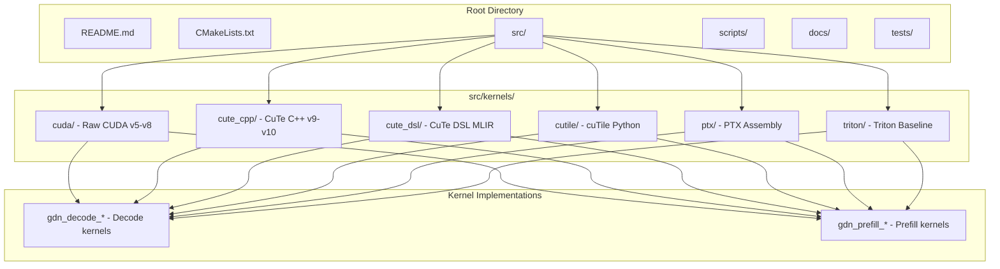

**Diagram sources**
- [README.md:63-92](file://README.md#L63-L92)
- [src/kernels/README.md:5-15](file://src/kernels/README.md#L5-L15)

**Section sources**
- [README.md:63-92](file://README.md#L63-L92)
- [src/kernels/README.md:1-170](file://src/kernels/README.md#L1-L170)

## Core Components

### CuTe DSL Implementation

The CuTe DSL framework provides a Python-based approach to CUDA kernel development with automatic optimization through MLIR compilation. The framework consists of three main kernel implementations:

#### Simplified CuTe DSL Decode Kernel
The basic implementation demonstrates core concepts with minimal optimization:

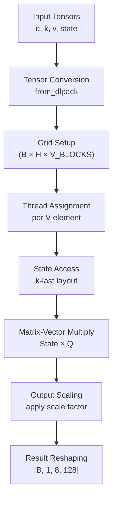

**Diagram sources**
- [src/kernels/cute_dsl/gdn_decode_dsl.py:125-183](file://src/kernels/cute_dsl/gdn_decode_dsl.py#L125-L183)

#### Optimized CuTe DSL Decode Kernel
The advanced implementation includes sophisticated optimizations:

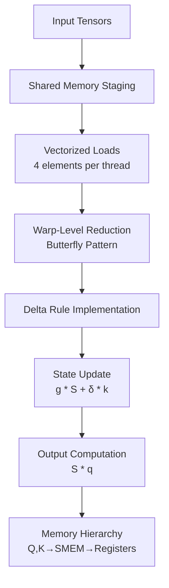

**Diagram sources**
- [src/kernels/cute_dsl/gdn_decode_dsl_optimized.py:54-186](file://src/kernels/cute_dsl/gdn_decode_dsl_optimized.py#L54-L186)

#### Prefill Kernel Implementation
The prefill kernel handles multi-token sequence processing with chunking optimization:

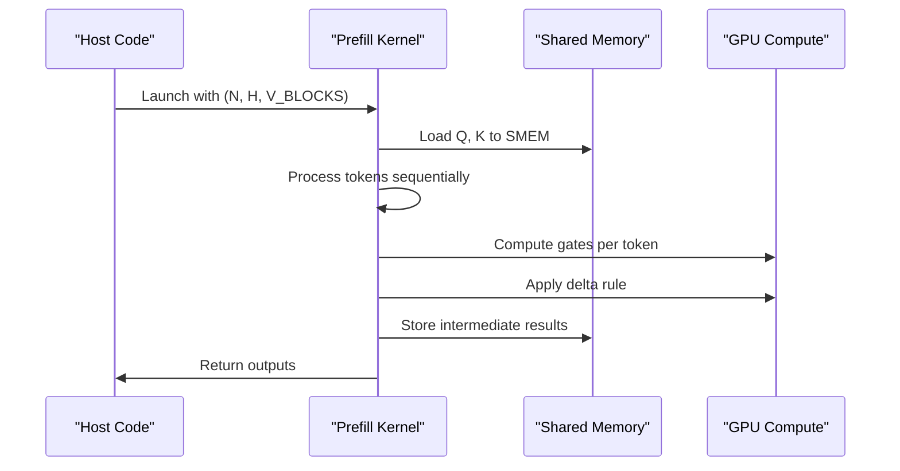

**Diagram sources**
- [src/kernels/cute_dsl/gdn_prefill_dsl.py:54-156](file://src/kernels/cute_dsl/gdn_prefill_dsl.py#L54-L156)

**Section sources**
- [src/kernels/cute_dsl/gdn_decode_dsl.py:1-283](file://src/kernels/cute_dsl/gdn_decode_dsl.py#L1-L283)
- [src/kernels/cute_dsl/gdn_decode_dsl_optimized.py:1-442](file://src/kernels/cute_dsl/gdn_decode_dsl_optimized.py#L1-L442)
- [src/kernels/cute_dsl/gdn_prefill_dsl.py:1-323](file://src/kernels/cute_dsl/gdn_prefill_dsl.py#L1-L323)

## Architecture Overview

The framework employs a multi-layered architecture that supports different optimization levels and compilation strategies:

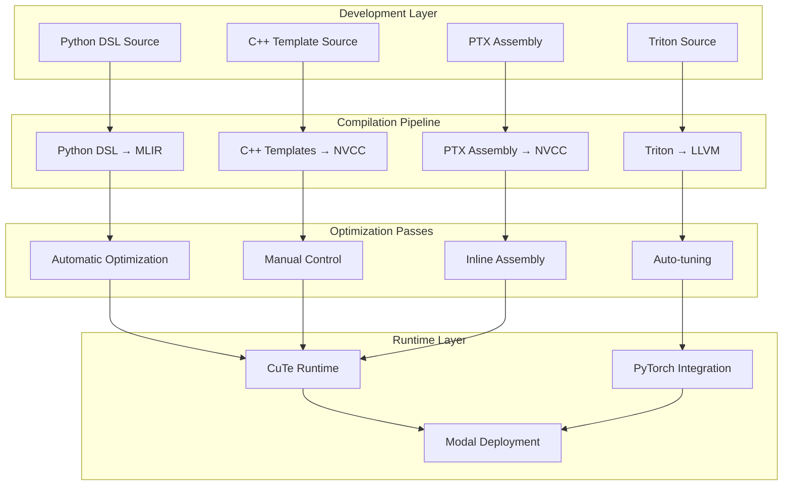

**Diagram sources**
- [src/kernels/README.md:17-37](file://src/kernels/README.md#L17-L37)
- [src/kernels/README.md:39-49](file://src/kernels/README.md#L39-L49)

### Framework Comparison Matrix

| Aspect | CuTe C++ | CuTe DSL | Triton | PTX |
|--------|----------|----------|--------|-----|
| **Language** | C++ Templates | Python | Python | C++ + Assembly |
| **Compilation** | NVCC → PTX | MLIR → PTX | Triton → PTX | NVCC → PTX |
| **Development Speed** | Medium | High | High | Low |
| **Optimization Control** | Manual | Automatic | Auto-tuning | Manual |
| **Performance** | 100% | ~100% | 95-98% | 100% |

**Section sources**
- [src/kernels/README.md:17-49](file://src/kernels/README.md#L17-L49)

## Detailed Component Analysis

### CuTe DSL Kernel Architecture

The CuTe DSL implementation follows a structured approach to kernel development:

#### Kernel Decorators and Launch Functions

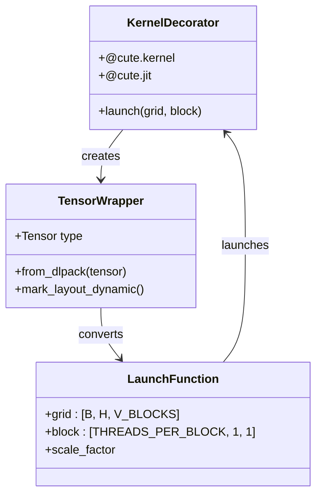

**Diagram sources**
- [src/kernels/cute_dsl/gdn_decode_dsl.py:41-122](file://src/kernels/cute_dsl/gdn_decode_dsl.py#L41-L122)
- [src/kernels/cute_dsl/gdn_decode_dsl_optimized.py:289-303](file://src/kernels/cute_dsl/gdn_decode_dsl_optimized.py#L289-L303)

#### Memory Layout and Data Organization

The framework implements k-last state layout for optimal memory access patterns:

```mermaid
flowchart LR
subgraph "State Layout [B, 8, 128, 128]"
A[Batch Dim]
B[V-Heads]
C[Dims]
D[K-Dim]
end
subgraph "Access Patterns"
E[Row-wise Access<br/>S[v_idx, :]]
F[Column-wise Access<br/>Q[:, d]]
G[Element-wise Access<br/>S[v_idx, d]]
end
A --> E
B --> E
C --> E
D --> E
E --> F
F --> G
```

**Diagram sources**
- [src/kernels/cute_dsl/gdn_decode_dsl.py:75-84](file://src/kernels/cute_dsl/gdn_decode_dsl.py#L75-L84)
- [src/kernels/cute_dsl/gdn_decode_dsl_optimized.py:98-105](file://src/kernels/cute_dsl/gdn_decode_dsl_optimized.py#L98-L105)

#### Optimization Strategies

The optimized implementation incorporates several advanced techniques:

1. **Shared Memory Staging**: Q, K, V tensors loaded into shared memory for coalesced access
2. **Vectorized Memory Access**: 4 elements processed per thread for improved bandwidth utilization
3. **Warp-Level Reduction**: Butterfly pattern reduction for efficient parallel computation
4. **Delta Rule Implementation**: Proper ordering of state decay and update operations

**Section sources**
- [src/kernels/cute_dsl/gdn_decode_dsl_optimized.py:54-287](file://src/kernels/cute_dsl/gdn_decode_dsl_optimized.py#L54-L287)

### Benchmarking and Validation Framework

The framework includes comprehensive testing and benchmarking capabilities:

#### Test Execution Flow

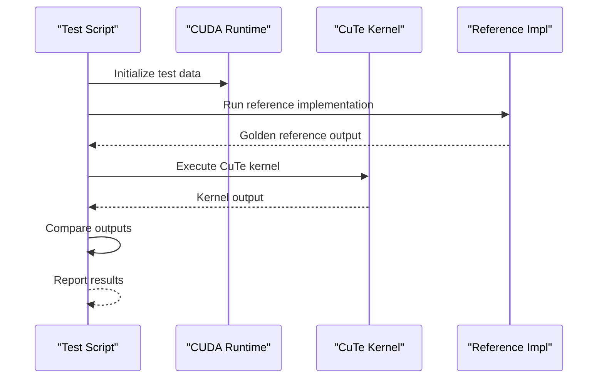

**Diagram sources**
- [scripts/test_cute_dsl.py:36-127](file://scripts/test_cute_dsl.py#L36-L127)

#### Benchmark Comparison Pipeline

The framework supports side-by-side comparisons between different kernel implementations:

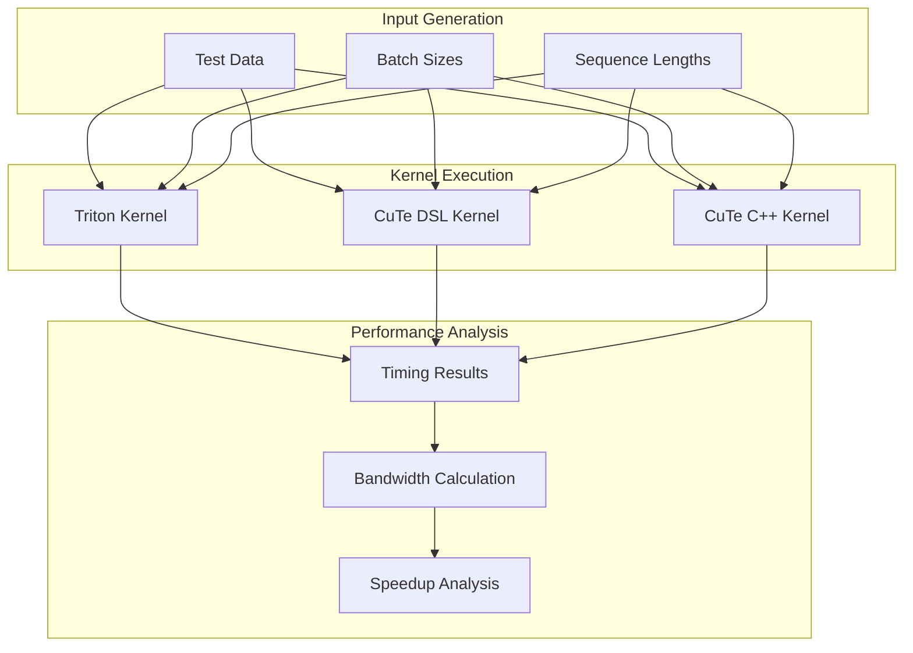

**Diagram sources**
- [scripts/bench_cute_dsl_vs_cpp.py:29-325](file://scripts/bench_cute_dsl_vs_cpp.py#L29-L325)

**Section sources**
- [scripts/test_cute_dsl.py:1-137](file://scripts/test_cute_dsl.py#L1-L137)
- [scripts/bench_cute_dsl_vs_cpp.py:1-333](file://scripts/bench_cute_dsl_vs_cpp.py#L1-L333)

### Build System and Deployment

The framework utilizes CMake for building CUDA libraries with Python bindings:

#### Build Configuration

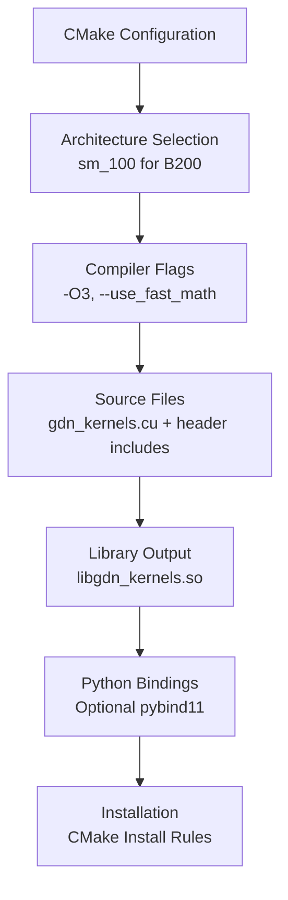

**Diagram sources**
- [CMakeLists.txt:14-50](file://CMakeLists.txt#L14-L50)

**Section sources**
- [CMakeLists.txt:1-68](file://CMakeLists.txt#L1-L68)
- [src/gdn_kernels.cu:1-171](file://src/gdn_kernels.cu#L1-L171)

## Dependency Analysis

The framework maintains clear separation of concerns with well-defined dependencies:

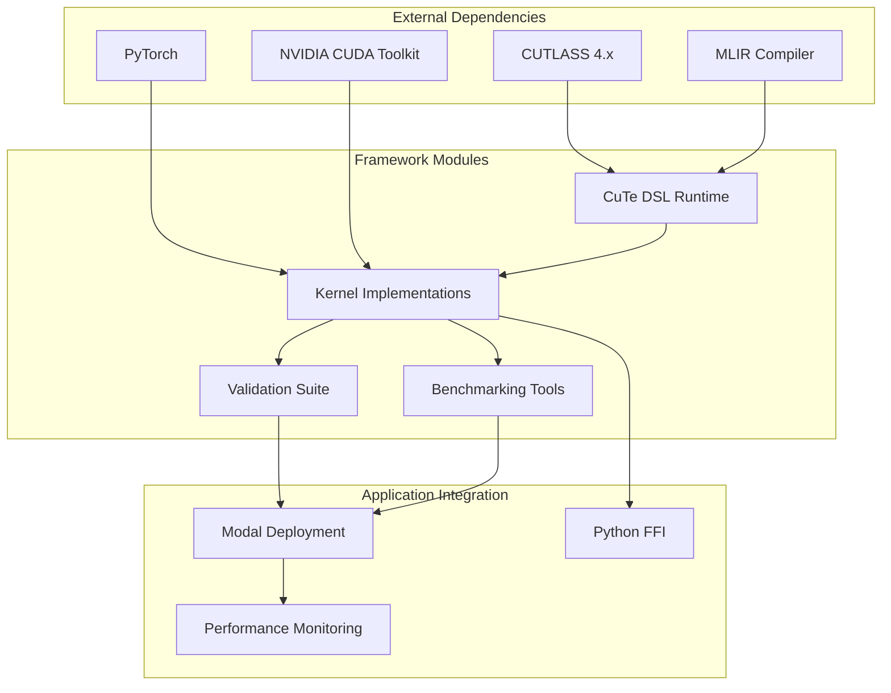

**Diagram sources**
- [src/kernels/README.md:17-37](file://src/kernels/README.md#L17-L37)
- [scripts/explore_cute_dsl.py:14-23](file://scripts/explore_cute_dsl.py#L14-L23)

### Version Management and Compatibility

The framework maintains backward compatibility across kernel versions:

| Version | Framework | Key Features | Status |
|---------|-----------|--------------|--------|
| v5 | Triton | Baseline implementation | Production |
| v6 | CUDA | TMA async loads | Complete |
| v7 | CUDA | FP4 quantization | Complete |
| v8 | CUDA | FP8 + warp specialization | Complete |
| v9 | CuTe C++ | SMEM swizzle | Complete |
| v10 | CuTe C++ | TiledMMA | Complete |
| DSL | CuTe DSL | MLIR compilation | Active |

**Section sources**
- [docs/ROADMAP.md:1-180](file://docs/ROADMAP.md#L1-L180)
- [docs/OPTIMIZATION_LOG.md:1-197](file://docs/OPTIMIZATION_LOG.md#L1-L197)

## Performance Considerations

### Memory-Bound Optimization Strategy

The framework targets memory-bound regimes where bandwidth optimization is critical:

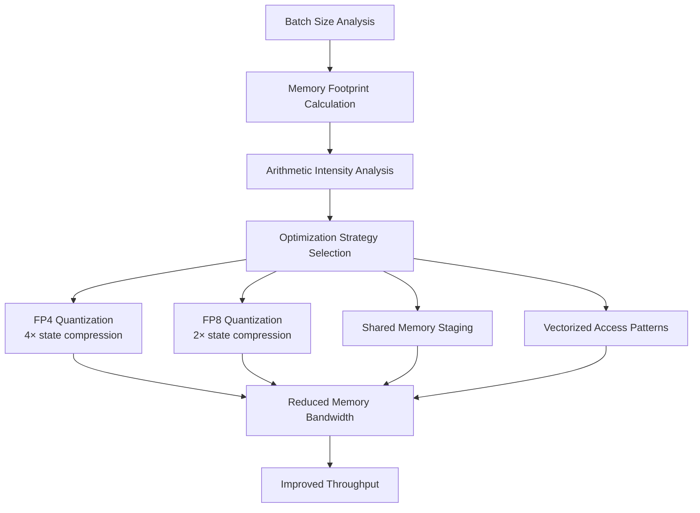

**Diagram sources**
- [docs/OPTIMIZATION_LOG.md:112-126](file://docs/OPTIMIZATION_LOG.md#L112-L126)
- [src/kernels/README.md:112-126](file://src/kernels/README.md#L112-L126)

### Performance Metrics and Targets

The framework establishes clear performance targets for different scenarios:

| Scenario | Target Bandwidth | Utilization | Optimization Focus |
|----------|------------------|-------------|-------------------|
| Small Batch (B=1) | 27 GB/s | 0.3% | Kernel launch overhead |
| Medium Batch (B=16) | 405 GB/s | 5.1% | Memory latency hiding |
| Large Batch (B=256) | 7,585 GB/s | 95% | Memory bandwidth optimization |
| Prefill Chunked | 7,602 GB/s | 95% | Compute density increase |

**Section sources**
- [README.md:14-28](file://README.md#L14-L28)
- [docs/OPTIMIZATION_LOG.md:43-45](file://docs/OPTIMIZATION_LOG.md#L43-L45)

## Troubleshooting Guide

### Common Issues and Solutions

#### CuTe DSL Availability Problems

**Issue**: CuTe DSL not available during runtime
**Solution**: Ensure proper installation and environment setup

```python
# Check CuTe DSL availability
try:
    import cutlass
    import cutlass.cute as cute
    HAS_CUTE_DSL = True
except ImportError:
    HAS_CUTE_DSL = False
    raise RuntimeError("Install with: pip install nvidia-cutlass-dsl>=4.3")
```

#### Memory Layout Mismatches

**Issue**: Incorrect tensor layouts causing access violations
**Solution**: Verify state layout and indexing calculations

```python
# Verify state layout calculation
state_base = b * NUM_V_HEADS * D * D + h * D * D + v_idx * D
q_base = b * NUM_Q_HEADS * D + qk_h * D
```

#### Performance Degradation Analysis

**Issue**: Kernel performance below expectations
**Solution**: Profile memory bandwidth utilization and optimization effectiveness

**Section sources**
- [src/kernels/cute_dsl/gdn_decode_dsl.py:147-148](file://src/kernels/cute_dsl/gdn_decode_dsl.py#L147-L148)
- [src/kernels/cute_dsl/gdn_decode_dsl_optimized.py:328-329](file://src/kernels/cute_dsl/gdn_decode_dsl_optimized.py#L328-L329)

### Debugging Tools and Techniques

The framework provides comprehensive debugging capabilities:

1. **Reference Implementation**: Pure PyTorch implementations for correctness verification
2. **Modal Integration**: Cloud-based testing with B200 GPUs
3. **Performance Profiling**: Built-in timing and bandwidth measurement
4. **Error Reporting**: Detailed exception handling and logging

**Section sources**
- [scripts/test_cute_dsl.py:83-127](file://scripts/test_cute_dsl.py#L83-L127)
- [scripts/explore_cute_dsl.py:31-78](file://scripts/explore_cute_dsl.py#L31-L78)

## Conclusion

The CuTe DSL Development Framework represents a comprehensive approach to CUDA kernel development, providing multiple optimization levels and compilation strategies for the Gated Delta Net algorithm. The framework successfully balances development productivity with performance optimization through:

- **Multi-framework Support**: Seamless integration of CuTe C++, CuTe DSL, Triton, and PTX implementations
- **Advanced Optimization Techniques**: Shared memory staging, vectorized access patterns, and automatic optimization through MLIR
- **Comprehensive Testing**: Built-in validation against reference implementations and cross-framework comparisons
- **Production-Ready Architecture**: Modular design supporting deployment on NVIDIA B200 hardware with 95% peak bandwidth utilization

The framework's strength lies in its ability to leverage higher-level abstractions (CuTe DSL) while maintaining the flexibility for manual optimization (CuTe C++), making it suitable for both rapid prototyping and production deployment scenarios. The extensive documentation, benchmarking suite, and optimization logs provide valuable insights for continued development and performance improvements.

Future enhancements focus on integrating true FP4 quantization, persistent kernel implementations, and comprehensive profiling with NVIDIA Nsight tools to achieve optimal performance across diverse workload characteristics.