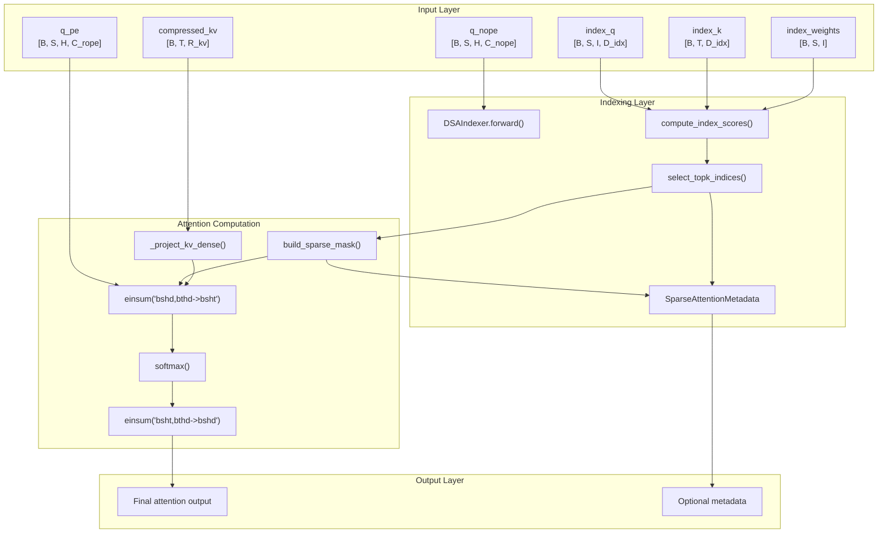
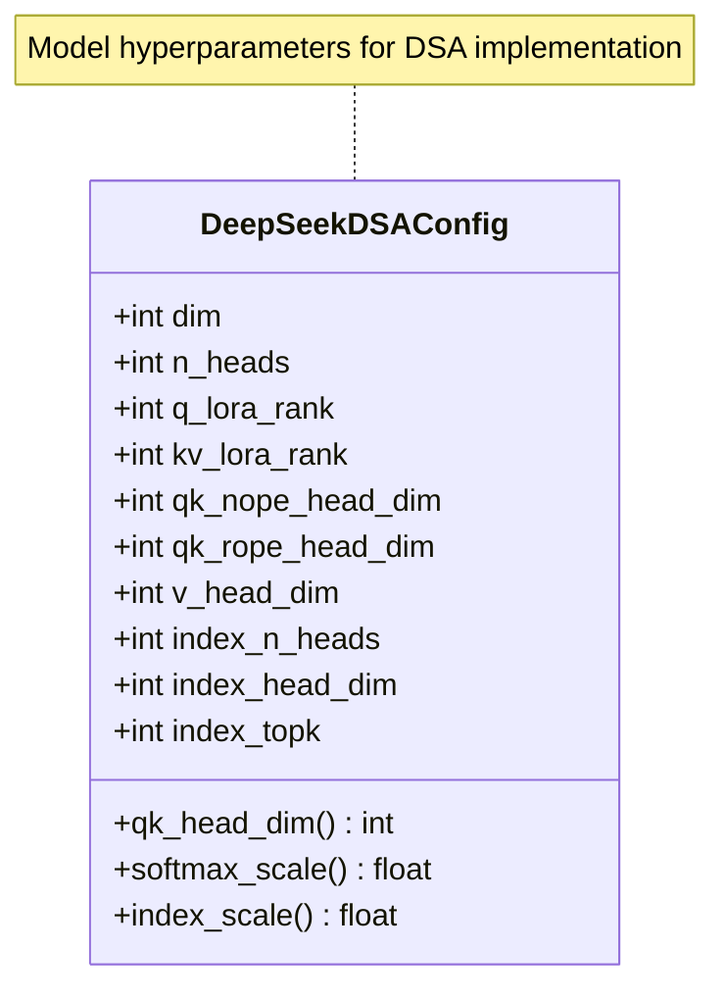
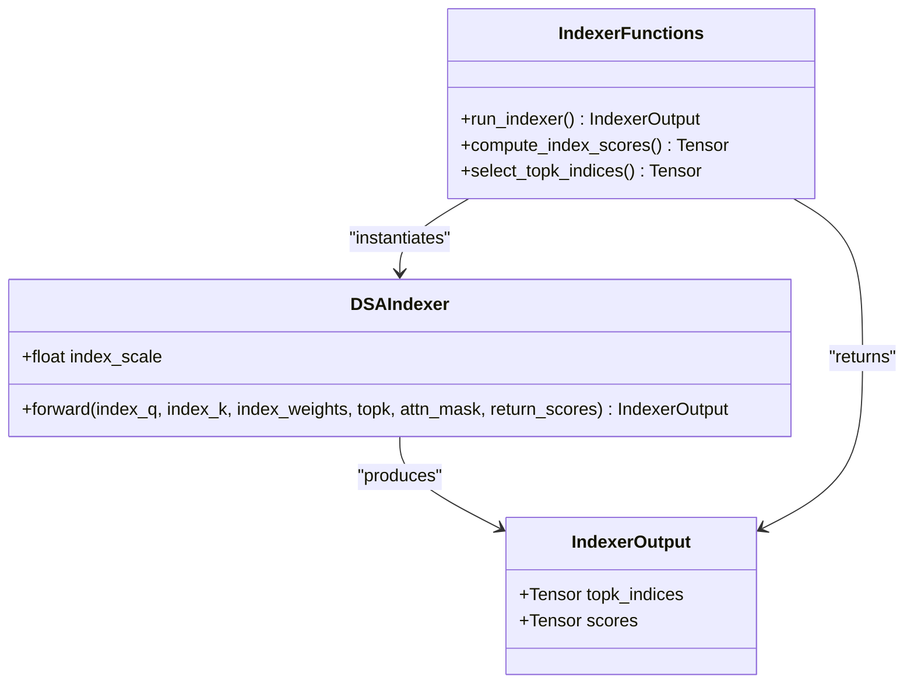
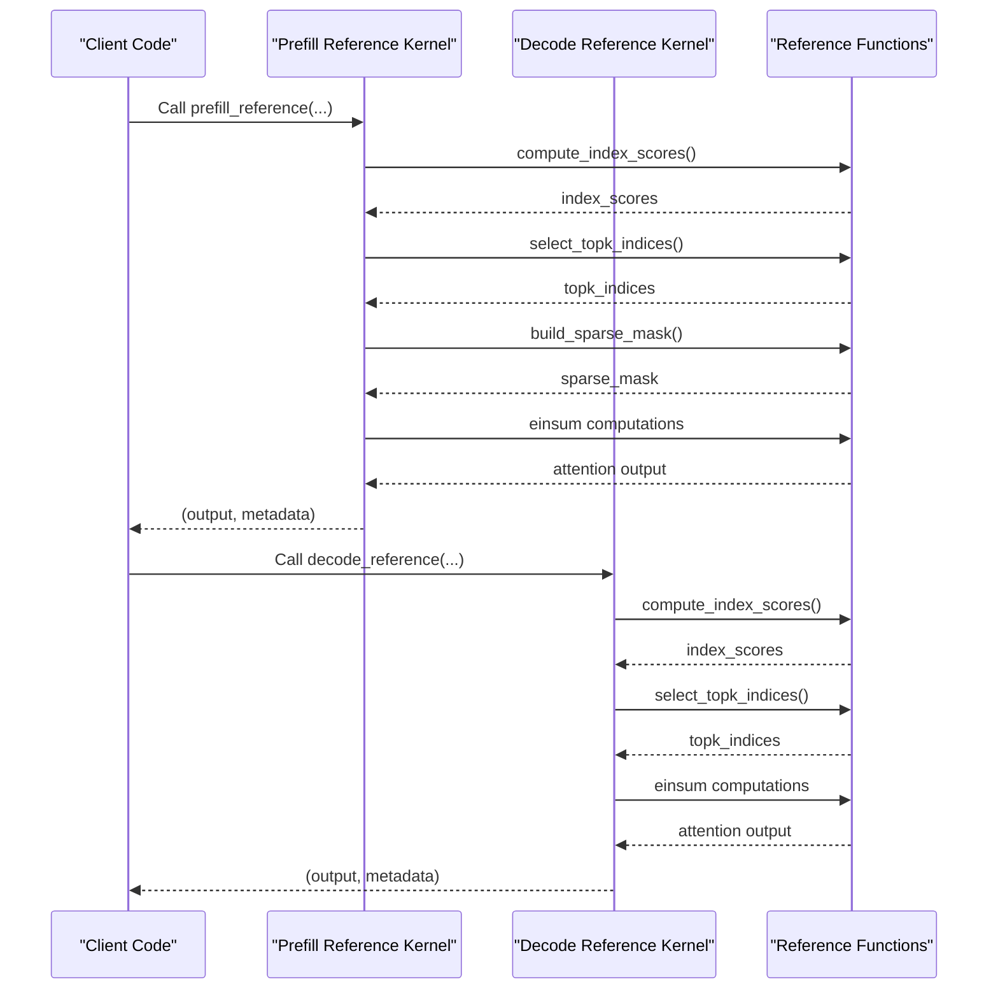
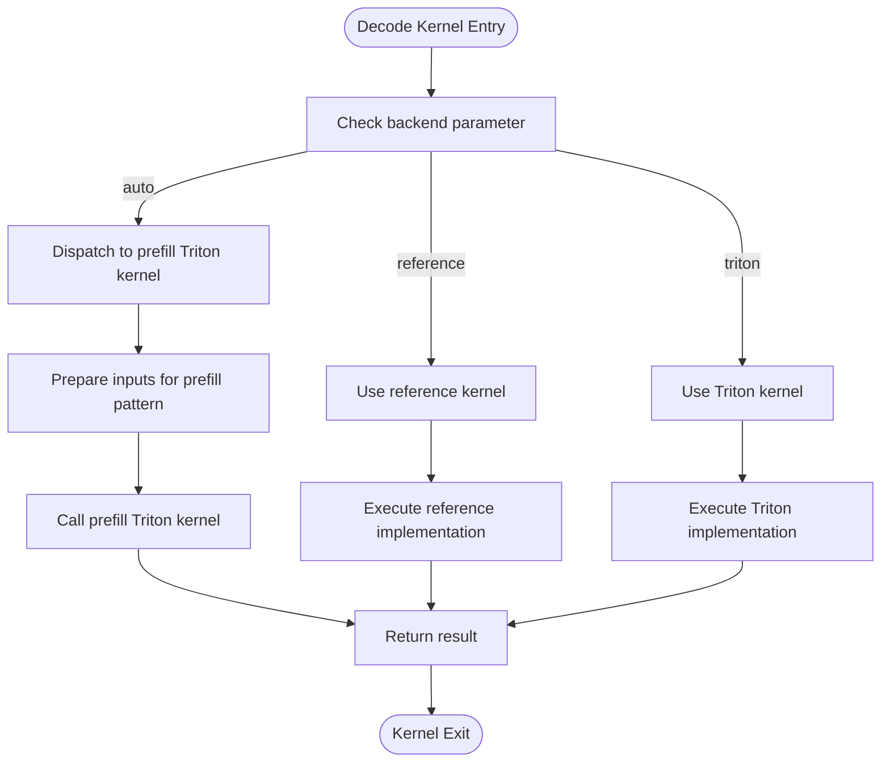
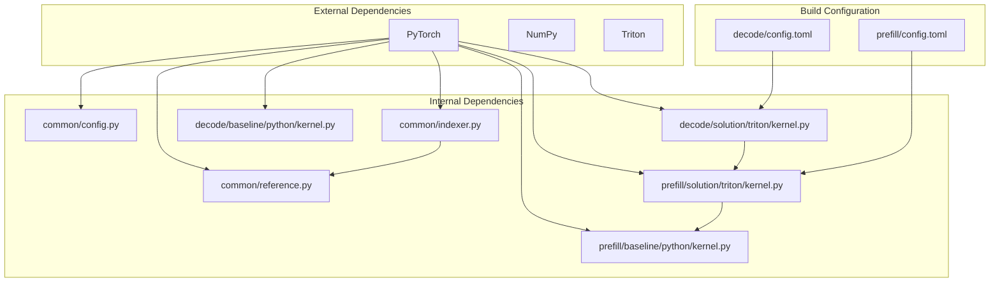

# DSA Framework

<cite>
**Referenced Files in This Document**
- [README.md](file://dsa/README.md)
- [__init__.py](file://dsa/__init__.py)
- [config.py](file://dsa/common/config.py)
- [indexer.py](file://dsa/common/indexer.py)
- [reference.py](file://dsa/common/reference.py)
- [kernel.py (decode baseline)](file://dsa/decode/baseline/python/kernel.py)
- [kernel.py (decode solution)](file://dsa/decode/solution/triton/kernel.py)
- [kernel.py (prefill baseline)](file://dsa/prefill/baseline/python/kernel.py)
- [config.toml (decode)](file://dsa/decode/config.toml)
- [config.toml (prefill)](file://dsa/prefill/config.toml)
- [bench_local.py](file://dsa/benchmarks/bench_local.py)
- [test_correctness.py](file://dsa/tests/test_correctness.py)
- [deepseek_dsa_decode_mla_core_v1.json](file://dsa/trace_definitions/deepseek_dsa_decode_mla_core_v1.json)
- [deepseek_dsa_prefill_mla_core_v1.json](file://dsa/trace_definitions/deepseek_dsa_prefill_mla_core_v1.json)
- [COMPETITION.md](file://dsa/docs/COMPETITION.md)
- [ROADMAP.md](file://dsa/docs/ROADMAP.md)
</cite>

## Table of Contents
1. [Introduction](#introduction)
2. [Project Structure](#project-structure)
3. [Core Components](#core-components)
4. [Architecture Overview](#architecture-overview)
5. [Detailed Component Analysis](#detailed-component-analysis)
6. [Dependency Analysis](#dependency-analysis)
7. [Performance Considerations](#performance-considerations)
8. [Troubleshooting Guide](#troubleshooting-guide)
9. [Conclusion](#conclusion)
10. [Appendices](#appendices)

## Introduction
The DSA (DeepSeek Sparse Attention) Framework implements a correctness-first baseline for DeepSeek V3.2 sparse attention focused on the MLA-core operator boundary. It provides shared token-level indexing, prefill and decode baselines, and stable Triton entry points for iterative kernel replacement. The framework supports both PyTorch reference kernels and Triton-based solutions, with comprehensive correctness tests and local benchmarking utilities.

Key capabilities include:
- Token-level sparse indexing via weighted top-k selection
- MLA-core attention computation over compressed KV tensors
- Adaptive dispatch for prefill (reference vs. Triton)
- Decode stage optimized with Triton kernels
- Comprehensive tracing and validation infrastructure

**Section sources**
- [README.md:1-101](file://dsa/README.md#L1-L101)

## Project Structure
The DSA Framework follows a modular organization with clear separation between common utilities, operator implementations, benchmarks, and tests.

```mermaid
graph TB
subgraph "DSA Root"
DSA_ROOT["dsa/"]
end
subgraph "Common Layer"
COMMON["common/"]
CONFIG["config.py"]
INDEXER["indexer.py"]
REFERENCE["reference.py"]
end
subgraph "Prefill Implementation"
PREFILL["prefill/"]
BASELINE_PRE["baseline/python/kernel.py"]
SOLUTION_PRE["solution/triton/kernel.py"]
TOML_PRE["config.toml"]
end
subgraph "Decode Implementation"
DECODE["decode/"]
BASELINE_DEC["baseline/python/kernel.py"]
SOLUTION_DEC["solution/triton/kernel.py"]
TOML_DEC["config.toml"]
end
subgraph "Testing & Benchmarks"
TESTS["tests/"]
BENCHMARKS["benchmarks/"]
TEST_CORRECT["test_correctness.py"]
BENCH_LOCAL["bench_local.py"]
end
subgraph "Documentation & Tracing"
DOCS["docs/"]
TRACES["trace_definitions/"]
TRACE_DEC["deepseek_dsa_decode_mla_core_v1.json"]
TRACE_PRE["deepseek_dsa_prefill_mla_core_v1.json"]
end
DSA_ROOT --> COMMON
DSA_ROOT --> PREFILL
DSA_ROOT --> DECODE
DSA_ROOT --> TESTS
DSA_ROOT --> BENCHMARKS
DSA_ROOT --> DOCS
DSA_ROOT --> TRACES
COMMON --> CONFIG
COMMON --> INDEXER
COMMON --> REFERENCE
PREFILL --> BASELINE_PRE
PREFILL --> SOLUTION_PRE
PREFILL --> TOML_PRE
DECODE --> BASELINE_DEC
DECODE --> SOLUTION_DEC
DECODE --> TOML_DEC
TESTS --> TEST_CORRECT
BENCHMARKS --> BENCH_LOCAL
TRACES --> TRACE_DEC
TRACES --> TRACE_PRE
```

**Diagram sources**
- [README.md:34-58](file://dsa/README.md#L34-L58)
- [__init__.py:1-28](file://dsa/__init__.py#L1-L28)

**Section sources**
- [README.md:34-58](file://dsa/README.md#L34-L58)
- [__init__.py:1-28](file://dsa/__init__.py#L1-L28)

## Core Components
The framework centers around three primary components that work together to implement sparse attention:

### Configuration Management
The DeepSeekDSAConfig class encapsulates all model hyperparameters and derived scaling factors for attention computation.

### Token-Level Indexer
The DSAIndexer implements weighted token-level top-k selection using Hadamard-transform based scoring over MLA latent space.

### Reference Implementations
Both prefill and decode reference implementations provide PyTorch-based baselines that match the Triton solutions.

**Section sources**
- [config.py:5-31](file://dsa/common/config.py#L5-L31)
- [indexer.py:15-65](file://dsa/common/indexer.py#L15-L65)
- [reference.py:175-342](file://dsa/common/reference.py#L175-L342)

## Architecture Overview
The DSA Framework employs a layered architecture with clear separation between indexing, attention computation, and kernel implementations.

**Diagram sources**
- [reference.py:87-139](file://dsa/common/reference.py#L87-L139)
- [reference.py:154-257](file://dsa/common/reference.py#L154-L257)
- [reference.py:260-341](file://dsa/common/reference.py#L260-L341)

## Detailed Component Analysis

### Configuration System
The configuration system defines all hyperparameters for the DeepSeek V3.2 model, including dimensionalities and scaling factors.

**Diagram sources**
- [config.py:5-31](file://dsa/common/config.py#L5-L31)

**Section sources**
- [config.py:5-31](file://dsa/common/config.py#L5-L31)

### Indexer Implementation
The DSAIndexer provides token-level sparse selection through weighted scoring and top-k selection.

**Diagram sources**
- [indexer.py:9-65](file://dsa/common/indexer.py#L9-L65)

**Section sources**
- [indexer.py:15-65](file://dsa/common/indexer.py#L15-L65)
- [reference.py:87-139](file://dsa/common/reference.py#L87-L139)

### Reference Kernel Implementations
Both prefill and decode reference kernels provide PyTorch-based implementations that serve as correctness baselines.

**Diagram sources**
- [prefill/baseline/python/kernel.py:18-50](file://dsa/prefill/baseline/python/kernel.py#L18-L50)
- [decode/baseline/python/kernel.py:18-50](file://dsa/decode/baseline/python/kernel.py#L18-L50)
- [reference.py:175-341](file://dsa/common/reference.py#L175-L341)

**Section sources**
- [prefill/baseline/python/kernel.py:18-50](file://dsa/prefill/baseline/python/kernel.py#L18-L50)
- [decode/baseline/python/kernel.py:18-50](file://dsa/decode/baseline/python/kernel.py#L18-L50)
- [reference.py:175-341](file://dsa/common/reference.py#L175-L341)

### Triton Solution Architecture
The decode solution reuses the prefill Triton path due to mathematical equivalence between the two stages.

**Diagram sources**
- [decode/solution/triton/kernel.py:24-60](file://dsa/decode/solution/triton/kernel.py#L24-L60)

**Section sources**
- [decode/solution/triton/kernel.py:1-60](file://dsa/decode/solution/triton/kernel.py#L1-L60)

## Dependency Analysis
The framework exhibits clean dependency relationships with clear separation of concerns.

**Diagram sources**
- [__init__.py:1-28](file://dsa/__init__.py#L1-L28)
- [indexer.py:6](file://dsa/common/indexer.py#L6)
- [reference.py:7](file://dsa/common/reference.py#L7)

**Section sources**
- [__init__.py:1-28](file://dsa/__init__.py#L1-L28)
- [indexer.py:6](file://dsa/common/indexer.py#L6)
- [reference.py:7](file://dsa/common/reference.py#L7)

## Performance Considerations
The framework implements several performance optimization strategies:

### Adaptive Dispatch Strategy
- Short and medium prefill sequences use reference implementation for stability
- Long prefill sequences automatically switch to Triton for performance gains
- Decode stage consistently uses Triton implementation

### Memory Access Patterns
- MLA latent compression reduces KV cache memory footprint
- Shared indexing computation across attention heads
- Optimized tensor layouts for batched operations

### Benchmarking Infrastructure
The local benchmarking suite provides comprehensive performance measurement across different sequence lengths and configurations.

**Section sources**
- [README.md:81-101](file://dsa/README.md#L81-L101)
- [COMPETITION.md:9-13](file://dsa/docs/COMPETITION.md#L9-L13)
- [bench_local.py:24-37](file://dsa/benchmarks/bench_local.py#L24-L37)

## Troubleshooting Guide
Common issues and their resolution strategies:

### Shape Mismatch Errors
Ensure input tensors match expected dimensionalities:
- Query tensors: [B, S, H, C] where S is sequence length
- KV tensors: [B, T, R] where T is key length
- Index tensors: [B, S, I, D] for query and [B, T, D] for keys

### Numerical Precision Issues
- Use appropriate dtype (bfloat16 for CUDA, float32 for CPU)
- Verify scaling factors match model configuration
- Check attention mask dimensions and values

### Performance Degradation
- Verify automatic dispatch is working correctly
- Ensure Triton kernels are properly compiled
- Check for memory bottlenecks in indexing operations

**Section sources**
- [reference.py:102-138](file://dsa/common/reference.py#L102-L138)
- [test_correctness.py:133-202](file://dsa/tests/test_correctness.py#L133-L202)

## Conclusion
The DSA Framework provides a robust foundation for DeepSeek V3.2 sparse attention research and development. Its modular architecture enables iterative kernel improvements while maintaining correctness through comprehensive testing and validation. The framework successfully bridges the gap between reference implementations and production-ready Triton kernels, with clear pathways for future enhancements including FP8 support and advanced caching strategies.

Key achievements include:
- Correctness-first approach with comprehensive validation
- Clean separation between indexing and attention computation
- Adaptive dispatch strategy for optimal performance
- Extensive documentation and benchmarking infrastructure
- Clear roadmap for future development phases

## Appendices

### API Reference Summary
The framework exposes a unified API through the main package initialization, providing access to all core components for external integration.

**Section sources**
- [__init__.py:14-27](file://dsa/__init__.py#L14-L27)

### Trace Definition Schema
The trace definitions specify the complete operator interface including input/output shapes, data types, and optional parameters for both prefill and decode operations.

**Section sources**
- [deepseek_dsa_prefill_mla_core_v1.json:1-42](file://dsa/trace_definitions/deepseek_dsa_prefill_mla_core_v1.json#L1-L42)
- [deepseek_dsa_decode_mla_core_v1.json:1-42](file://dsa/trace_definitions/deepseek_dsa_decode_mla_core_v1.json#L1-L42)

### Development Roadmap
The framework follows a structured development progression from basic functionality to advanced optimizations and production readiness.

**Section sources**
- [ROADMAP.md:1-27](file://dsa/docs/ROADMAP.md#L1-L27)