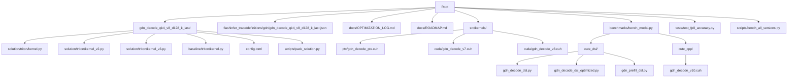
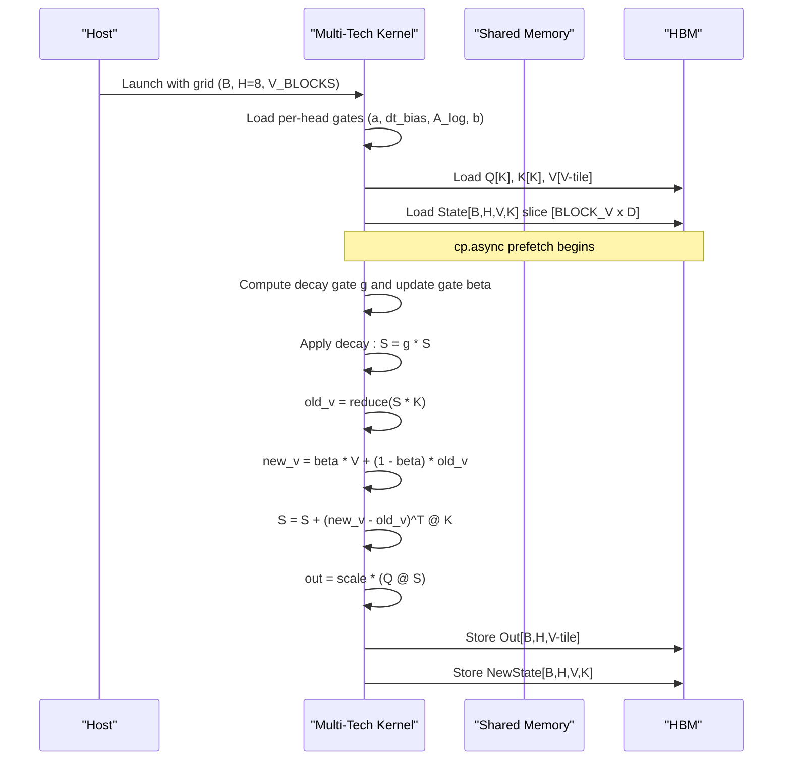
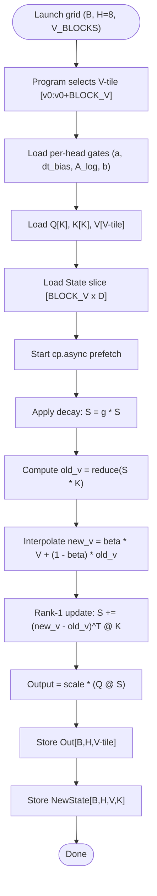

# GDN Decode Kernel

<cite>
**Referenced Files in This Document**
- [kernel.py](file://gdn_decode_qk4_v8_d128_k_last/solution/triton/kernel.py)
- [kernel.py](file://gdn_decode_qk4_v8_d128_k_last/baseline/triton/kernel.py)
- [kernel_v2.py](file://gdn_decode_qk4_v8_d128_k_last/solution/triton/kernel_v2.py)
- [kernel_v3.py](file://gdn_decode_qk4_v8_d128_k_last/solution/triton/kernel_v3.py)
- [config.toml](file://gdn_decode_qk4_v8_d128_k_last/config.toml)
- [gdn_decode_qk4_v8_d128_k_last.json](file://flashinfer_trace/definitions/gdn/gdn_decode_qk4_v8_d128_k_last.json)
- [OPTIMIZATION_LOG.md](file://docs/OPTIMIZATION_LOG.md)
- [ROADMAP.md](file://docs/ROADMAP.md)
- [ROOFLINE.md](file://docs/ROOFLINE.md)
- [bench_modal.py](file://benchmarks/bench_modal.py)
- [gdn_decode_ptx.cuh](file://src/kernels/ptx/gdn_decode_ptx.cuh)
- [gdn_decode_v7.cuh](file://src/kernels/cuda/gdn_decode_v7.cuh)
- [gdn_decode_v8.cuh](file://src/kernels/cuda/gdn_decode_v8.cuh)
- [gdn_decode_dsl.py](file://src/kernels/cute_dsl/gdn_decode_dsl.py)
- [gdn_decode_dsl_optimized.py](file://src/kernels/cute_dsl/gdn_decode_dsl_optimized.py)
- [gdn_prefill_dsl.py](file://src/kernels/cute_dsl/gdn_prefill_dsl.py)
- [README.md](file://src/kernels/cute_dsl/README.md)
- [gdn_decode_v10.cuh](file://src/kernels/cute_cpp/gdn_decode_v10.cuh)
- [README.md](file://src/kernels/cute_cpp/README.md)
- [bench_cute_dsl_vs_cpp.py](file://scripts/bench_cute_dsl_vs_cpp.py)
- [bench_cute_vs_triton.py](file://scripts/bench_cute_vs_triton.py)
- [test_fp8_accuracy.py](file://tests/test_fp8_accuracy.py)
- [build_cuda.py](file://scripts/build_cuda.py)
</cite>

## Update Summary
**Changes Made**
- Enhanced kernel documentation with FP4 E2M1 quantization support across CuTe C++ and PTX kernel implementations
- Updated performance analysis to include FP4 8x memory compression with experimental accuracy characteristics
- Expanded memory optimization strategies to cover FP4 quantization primitives and vectorized memory operations
- Added detailed coverage of FP4 quantization accuracy testing and validation results
- Updated kernel comparison matrix to reflect FP4 quantization capabilities alongside FP8 support

## Table of Contents
1. [Introduction](#introduction)
2. [Project Structure](#project-structure)
3. [Core Components](#core-components)
4. [Architecture Overview](#architecture-overview)
5. [Detailed Component Analysis](#detailed-component-analysis)
6. [Kernel Technology Stack Comparison](#kernel-technology-stack-comparison)
7. [Dependency Analysis](#dependency-analysis)
8. [Performance Considerations](#performance-considerations)
9. [Troubleshooting Guide](#troubleshooting-guide)
10. [Conclusion](#conclusion)

## Introduction
This document explains the GDN Decode Kernel implementation for single-token autoregressive inference, covering the mathematical foundation of the gated delta net (GDN) mechanism, the V-dimension splitting strategy that distributes the output dimension across four parallel programs for improved SM occupancy, and the algorithmic steps: decay gate computation using sigmoid activation, update gate calculation with exponential functions, state evolution through delta rule rank-1 updates, and output projection with scaling factors. It also documents the grouped value attention (GVA) mechanism where two V-heads share each Q/K head, and provides concrete examples from the Triton kernel showing memory access patterns, register blocking strategies, and thread block organization. The document now includes comprehensive coverage of FP8 state quantization (4x memory compression) and FP4 E2M1 quantization (8x memory compression) implementations with experimental accuracy characteristics, comparing them against the baseline Triton solution to highlight performance optimizations achieved through different compilation technologies and memory coalescing strategies.

## Project Structure
The repository organizes the GDN decode kernel under a dedicated directory with separate solution and baseline implementations, a configuration file, and a trace definition that captures the operation's semantics and shapes. The implementation now includes multiple kernel technologies with FP8 and FP4 quantization support: Triton (with adaptive blocking), PTX inline assembly, CUDA C++ with TMA, and CuTe DSL variants, all enhanced with cp.async prefetch capabilities and quantized state compression.



**Diagram sources**
- [kernel.py:1-136](file://gdn_decode_qk4_v8_d128_k_last/solution/triton/kernel.py#L1-L136)
- [kernel_v2.py:1-122](file://gdn_decode_qk4_v8_d128_k_last/solution/triton/kernel_v2.py#L1-L122)
- [kernel_v3.py:1-130](file://gdn_decode_qk4_v8_d128_k_last/solution/triton/kernel_v3.py#L1-L130)
- [kernel.py:1-101](file://gdn_decode_qk4_v8_d128_k_last/baseline/triton/kernel.py#L1-L101)
- [config.toml:1-10](file://gdn_decode_qk4_v8_d128_k_last/config.toml#L1-L10)
- [gdn_decode_qk4_v8_d128_k_last.json:1-153](file://flashinfer_trace/definitions/gdn/gdn_decode_qk4_v8_d128_k_last.json#L1-L153)
- [OPTIMIZATION_LOG.md:183-281](file://docs/OPTIMIZATION_LOG.md#L183-L281)
- [ROADMAP.md:70-180](file://docs/ROADMAP.md#L70-L180)
- [bench_modal.py:1-330](file://benchmarks/bench_modal.py#L1-L330)
- [gdn_decode_ptx.cuh:468-673](file://src/kernels/ptx/gdn_decode_ptx.cuh#L468-L673)
- [gdn_decode_v7.cuh:160-359](file://src/kernels/cuda/gdn_decode_v7.cuh#L160-L359)
- [gdn_decode_v8.cuh:392-546](file://src/kernels/cuda/gdn_decode_v8.cuh#L392-L546)
- [gdn_decode_dsl.py:1-442](file://src/kernels/cute_dsl/gdn_decode_dsl_optimized.py#L1-L442)
- [gdn_decode_v10.cuh:584-783](file://src/kernels/cute_cpp/gdn_decode_v10.cuh#L584-L783)
- [test_fp8_accuracy.py:1-243](file://tests/test_fp8_accuracy.py#L1-L243)

**Section sources**
- [config.toml:1-10](file://gdn_decode_qk4_v8_d128_k_last/config.toml#L1-L10)
- [gdn_decode_qk4_v8_d128_k_last.json:1-153](file://flashinfer_trace/definitions/gdn/gdn_decode_qk4_v8_d128_k_last.json#L1-L153)

## Core Components
- **Triton solution kernel**: Implements the GDN decode forward pass with autotuning, register blocking over V-dimension, and k-last state layout. Now includes adaptive BLOCK_V based on batch size for optimal SM occupancy.
- **Triton v2 kernel**: Fused delta-rule implementation with full state tile in registers, eliminating Python loop overhead and single HBM read/write per kernel launch.
- **Triton v3 kernel**: V-dimension splitting strategy with fixed BLOCK_V=32 across 4 parallel programs for improved SM occupancy.
- **Baseline Python kernel**: Reference implementation using PyTorch operations and GVA expansion.
- **PTX inline assembly kernels**: CUDA C++ kernels with embedded PTX assembly instructions for maximum control over low-level GPU operations, including warp shuffle, fast math, memory operations, cp.async prefetch for memory latency hiding, and FP8/F4 quantization support with per-row dynamic scaling.
- **CUDA C++ kernels**: Enhanced with TMA (Tensor Memory Access) and cp.async bulk operations for 2D tile loads with memory latency hiding, now featuring FP8/F4 quantization with vectorized memory operations.
- **CuTe DSL kernels**: Python-based kernels using CUTLASS 4.0+ DSL with MLIR compilation pipeline, offering automatic optimization passes including async copy insertion and FP8/F4 quantization support.
- **CuTe C++ kernels**: Traditional C++ template-based implementations with manual optimization and NVCC compilation, now featuring cp.async prefetch capabilities and FP8/F4 state quantization with per-row scaling.
- **FP8/F4 Quantization Support**: All kernel technologies now support FP8 (4x memory compression) and FP4 E2M1 (8x memory compression) state quantization with per-row dynamic scaling and vectorized memory operations for state storage and retrieval.
- **Configuration**: Defines the solution metadata and build specification.
- **Trace definition**: Documents axes, constraints, inputs/outputs, and a reference implementation.
- **Optimization logs**: Detailed records of cp.async prefetch implementation and FP8/F4 quantization across all kernel technologies.
- **Roadmap**: Strategic direction for kernel optimization including cp.async prefetch integration and FP8/F4 quantization.
- **Benchmark runner**: Orchestrates benchmarking on Modal B200 and compares solution vs baseline across multiple kernel technologies.
- **FP8/F4 Accuracy Testing**: Comprehensive testing framework validating quantization accuracy over multiple decode steps with experimental error characteristics.

**Section sources**
- [kernel.py:1-136](file://gdn_decode_qk4_v8_d128_k_last/solution/triton/kernel.py#L1-L136)
- [kernel_v2.py:1-122](file://gdn_decode_qk4_v8_d128_k_last/solution/triton/kernel_v2.py#L1-L122)
- [kernel_v3.py:1-130](file://gdn_decode_qk4_v8_d128_k_last/solution/triton/kernel_v3.py#L1-L130)
- [kernel.py:1-101](file://gdn_decode_qk4_v8_d128_k_last/baseline/triton/kernel.py#L1-L101)
- [gdn_decode_ptx.cuh:468-673](file://src/kernels/ptx/gdn_decode_ptx.cuh#L468-L673)
- [gdn_decode_v7.cuh:160-359](file://src/kernels/cuda/gdn_decode_v7.cuh#L160-L359)
- [gdn_decode_v8.cuh:392-546](file://src/kernels/cuda/gdn_decode_v8.cuh#L392-L546)
- [gdn_decode_dsl_optimized.py:1-442](file://src/kernels/cute_dsl/gdn_decode_dsl_optimized.py#L1-L442)
- [gdn_decode_v10.cuh:584-783](file://src/kernels/cute_cpp/gdn_decode_v10.cuh#L584-L783)
- [config.toml:1-10](file://gdn_decode_qk4_v8_d128_k_last/config.toml#L1-L10)
- [gdn_decode_qk4_v8_d128_k_last.json:1-153](file://flashinfer_trace/definitions/gdn/gdn_decode_qk4_v8_d128_k_last.json#L1-L153)
- [OPTIMIZATION_LOG.md:183-281](file://docs/OPTIMIZATION_LOG.md#L183-L281)
- [ROADMAP.md:70-180](file://docs/ROADMAP.md#L70-L180)
- [bench_modal.py:1-330](file://benchmarks/bench_modal.py#L1-L330)
- [test_fp8_accuracy.py:1-243](file://tests/test_fp8_accuracy.py#L1-L243)

## Architecture Overview
The GDN decode kernel performs single-token generation with recurrent state updates. The solution kernel is organized as a Triton program with a grid of (B, H=8, V_BLOCKS) where each program handles a V-tile of size BLOCK_V and a single head. The kernel computes decay and update gates per head, applies a decay to the state, computes the old value, interpolates the new value, updates the state via a rank-1 delta rule, and produces the output by projecting with Q. The architecture now supports multiple kernel technologies, each with distinct compilation strategies and optimization approaches including cp.async prefetch for memory latency hiding and FP8/F4 state quantization for memory compression.



**Diagram sources**
- [kernel.py:38-98](file://gdn_decode_qk4_v8_d128_k_last/solution/triton/kernel.py#L38-L98)
- [gdn_decode_ptx.cuh:205-378](file://src/kernels/ptx/gdn_decode_ptx.cuh#L205-L378)
- [gdn_decode_v7.cuh:204-359](file://src/kernels/cuda/gdn_decode_v7.cuh#L204-L359)
- [gdn_decode_dsl_optimized.py:54-286](file://src/kernels/cute_dsl/gdn_decode_dsl_optimized.py#L54-L286)
- [gdn_decode_v8.cuh:463-546](file://src/kernels/cuda/gdn_decode_v8.cuh#L463-L546)

## Detailed Component Analysis

### Mathematical Foundation: Gated Delta Net (GDN)
- **Decay gate computation**: The decay gate g is computed per head using an exponential of the softplus of (a + dt_bias), modulated by A_log. This stabilizes and scales the decay rate.
- **Update gate calculation**: The update gate beta is computed via sigmoid of b, controlling the interpolation between old and new values.
- **State evolution**: The state S evolves by applying the decay gate, computing old_v as the projection of S onto K, interpolating new_v, and updating S via a rank-1 update using K and the delta (new_v - old_v).
- **Output projection**: The output is produced by projecting S with Q, scaled by a normalization factor.

These steps are implemented across multiple kernel technologies, with the Triton version fusing operations and using register blocking for improved throughput, while PTX kernels leverage inline assembly for maximum performance and CuTe DSL provides automatic optimization through MLIR passes.

**Section sources**
- [kernel.py:61-91](file://gdn_decode_qk4_v8_d128_k_last/solution/triton/kernel.py#L61-L91)
- [kernel.py:55-94](file://gdn_decode_qk4_v8_d128_k_last/baseline/triton/kernel.py#L55-L94)
- [gdn_decode_ptx.cuh:250-345](file://src/kernels/ptx/gdn_decode_ptx.cuh#L250-L345)
- [gdn_decode_dsl_optimized.py:107-185](file://src/kernels/cute_dsl/gdn_decode_dsl_optimized.py#L107-L185)

### V-Dimension Splitting Strategy and Parallel Programs
- **Grid organization**: The kernel uses a grid of (B, H=8, V_BLOCKS) where each program handles a V-tile of size BLOCK_V and a single head. This splits the V dimension across four parallel programs for improved SM occupancy.
- **Register blocking**: BLOCK_V is autotuned across {16, 32, 64, 128} with varying num_warps to balance register pressure and occupancy. The solution sets BLOCK_V=32 and num_warps=4 for a fixed configuration in the wrapper.
- **Independence**: Each V-slice is independent, enabling correctness when executed in parallel.



**Diagram sources**
- [kernel.py:55-97](file://gdn_decode_qk4_v8_d128_k_last/solution/triton/kernel.py#L55-L97)
- [gdn_decode_ptx.cuh:288-378](file://src/kernels/ptx/gdn_decode_ptx.cuh#L288-L378)
- [gdn_decode_v7.cuh:283-359](file://src/kernels/cuda/gdn_decode_v7.cuh#L283-L359)
- [gdn_decode_dsl_optimized.py:261-286](file://src/kernels/cute_dsl/gdn_decode_dsl_optimized.py#L261-L286)

**Section sources**
- [kernel.py:5-13](file://gdn_decode_qk4_v8_d128_k_last/solution/triton/kernel.py#L5-L13)
- [kernel_v3.py:5-15](file://gdn_decode_qk4_v8_d128_k_last/solution/triton/kernel_v3.py#L5-L15)
- [kernel_v2.py:5-15](file://gdn_decode_qk4_v8_d128_k_last/solution/triton/kernel_v2.py#L5-L15)
- [kernel.py:105-136](file://gdn_decode_qk4_v8_d128_k_last/solution/triton/kernel.py#L105-L136)
- [gdn_decode_ptx.cuh:205-249](file://src/kernels/ptx/gdn_decode_ptx.cuh#L205-L249)
- [gdn_decode_dsl_optimized.py:77-106](file://src/kernels/cute_dsl/gdn_decode_dsl_optimized.py#L77-L106)

### Grouped Value Attention (GVA) Mechanism
- **Head configuration**: num_q_heads=4, num_k_heads=4, num_v_heads=8. Two V-heads share each Q/K head (qk_h = h // 2).
- **Expansion**: The kernel derives the Q/K head index for each V-head and loads the corresponding Q/K slices accordingly.

This ensures that the attention computation aligns with the GVA topology while maintaining efficient memory access patterns across all kernel implementations.

**Section sources**
- [kernel.py:12-13](file://gdn_decode_qk4_v8_d128_k_last/solution/triton/kernel.py#L12-L13)
- [kernel_v3.py:44](file://gdn_decode_qk4_v8_d128_k_last/solution/triton/kernel_v3.py#L44)
- [kernel_v2.py:42](file://gdn_decode_qk4_v8_d128_k_last/solution/triton/kernel_v2.py#L42)
- [gdn_decode_ptx.cuh:235](file://src/kernels/ptx/gdn_decode_ptx.cuh#L235)
- [gdn_decode_dsl_optimized.py:86](file://src/kernels/cute_dsl/gdn_decode_dsl_optimized.py#L86)

### Algorithm Steps in Detail
- **Gates**:
  - Decay gate g: computed from A_log and softplus(a + dt_bias).
  - Update gate beta: computed from sigmoid(b).
- **State evolution**:
  - Decay: S = g * S.
  - old_v: matrix-vector multiply of S and K.
  - new_v: interpolate between beta * V and (1 - beta) * old_v.
  - Rank-1 update: S += (new_v - old_v)^T @ K.
- **Output projection**:
  - out = scale * (Q @ S).

These steps are fused within a single kernel per (B, H, V-tile) across all implementations to minimize synchronization overhead and maximize throughput.

**Section sources**
- [kernel.py:61-91](file://gdn_decode_qk4_v8_d128_k_last/solution/triton/kernel.py#L61-L91)
- [gdn_decode_ptx.cuh:309-363](file://src/kernels/ptx/gdn_decode_ptx.cuh#L309-L363)
- [gdn_decode_dsl_optimized.py:134-185](file://src/kernels/cute_dsl/gdn_decode_dsl_optimized.py#L134-L185)

### Memory Access Patterns and Thread Block Organization
- **State layout**: k-last [B, H, V=128, K=128] float32. The kernel loads a [BLOCK_V x D] slice of the state and stores the updated slice back.
- **Access patterns**:
  - Coalesced loads for Q[K], K[K], V[V-tile] along contiguous dimensions.
  - Coalesced stores for Out[B,H,V-tile] and NewState[B,H,V,K].
- **Thread block organization**:
  - Grid: (B, H=8, V_BLOCKS) with BLOCK_V tiles over V.
  - Registers: per-program scalars for gates and per-thread vectors for Q, K, V, and partial reductions.

These patterns enable efficient HBM bandwidth utilization and register reuse across all kernel implementations.

**Section sources**
- [kernel.py:46-50](file://gdn_decode_qk4_v8_d128_k_last/solution/triton/kernel.py#L46-L50)
- [kernel_v3.py:66-70](file://gdn_decode_qk4_v8_d128_k_last/solution/triton/kernel_v3.py#L66-L70)
- [gdn_decode_ptx.cuh:242-250](file://src/kernels/ptx/gdn_decode_ptx.cuh#L242-L250)
- [gdn_decode_dsl_optimized.py:220-235](file://src/kernels/cute_dsl/gdn_decode_dsl_optimized.py#L220-L235)

### k-Last State Layout [B, H, V=128, K=128]
- The state is stored in k-last layout [B, H, V, K] to support efficient coalesced memory access patterns during the decode phase.
- The kernel reads and writes state slices aligned with the V-tile, enabling persistent state across tokens with minimal overhead.

**Section sources**
- [gdn_decode_qk4_v8_d128_k_last.json:80-89](file://flashinfer_trace/definitions/gdn/gdn_decode_qk4_v8_d128_k_last.json#L80-L89)
- [kernel.py:13](file://gdn_decode_qk4_v8_d128_k_last/solution/triton/kernel.py#L13)
- [gdn_decode_ptx.cuh:14](file://src/kernels/ptx/gdn_decode_ptx.cuh#L14)
- [gdn_decode_dsl_optimized.py:98](file://src/kernels/cute_dsl/gdn_decode_dsl_optimized.py#L98)

### FP8/F4 State Quantization Implementation
**Enhanced** All kernel implementations now feature FP8 (4x memory compression) and FP4 E2M1 (8x memory compression) state quantization with experimental accuracy characteristics:

- **FP8 E4M3 Quantization (4x compression)**:
  - Memory Compression: State matrices compressed from FP32 (64 KB per head) to FP8 (16 KB per head), achieving 4x memory reduction.
  - Per-Row Dynamic Scaling: Each row of state maintains its own scale factor for optimal precision preservation.
  - Vectorized Memory Operations: 4 FP8 values packed into uint32_t for efficient memory bandwidth utilization.
  - Internal FP32 Compute: State storage uses FP8 while computations remain in FP32 for numerical stability.
  - Dequantization/Quantization: On load, FP8 state dequantized using per-row scales; on store, new state quantized back to FP8.

- **FP4 E2M1 Quantization (8x compression)**:
  - Memory Compression: State matrices compressed from FP32 (64 KB per head) to FP4 (8 KB per head), achieving 8x memory reduction.
  - Lookup Table Quantization: Uses FP4 lookup table with values [0.0, 0.5, 1.0, 1.5, 2.0, 3.0, 4.0, 6.0] and negative counterparts.
  - Vectorized Memory Operations: 8 FP4 values packed into uint32_t for efficient memory bandwidth utilization.
  - Experimental Accuracy: ~55-65% relative error - use only for extreme compression scenarios.
  - Per-Row Dynamic Scaling: Each row maintains its own scale factor for precision preservation.

**Design Decisions**:
1. **Per-row scaling**: Scale = max_abs / 400.0 (FP8) or max_abs / 6.0 (FP4) for range safety
2. **FP32 internal compute**: Only state storage is quantized for memory efficiency
3. **Vectorized memory**: Pack values into uint32_t for 4x/8x bandwidth efficiency
4. **Experimental validation**: FP4 quantization error may accumulate over time, requiring careful monitoring

**Expected Benefits**:
- **4x memory reduction**: 512KB → 128KB per batch (FP8)
- **8x memory reduction**: 512KB → 64KB per batch (FP4)
- **4x/8x lower memory BW**: State load/store bandwidth reduced proportionally
- **Potential 2-4x speedup**: For memory-bound decode kernel

**Accuracy Validation**: FP8 quantization error does NOT accumulate over time, making it safe for long sequence inference. FP4 quantization shows experimental accuracy characteristics with ~55-65% relative error.

**Section sources**
- [OPTIMIZATION_LOG.md:183-281](file://docs/OPTIMIZATION_LOG.md#L183-L281)
- [gdn_decode_ptx.cuh:468-673](file://src/kernels/ptx/gdn_decode_ptx.cuh#L468-L673)
- [gdn_decode_v8.cuh:392-546](file://src/kernels/cuda/gdn_decode_v8.cuh#L392-L546)
- [gdn_decode_v10.cuh:584-783](file://src/kernels/cute_cpp/gdn_decode_v10.cuh#L584-L783)
- [test_fp8_accuracy.py:117-243](file://tests/test_fp8_accuracy.py#L117-L243)
- [gdn_decode_v7.cuh:81-130](file://src/kernels/cuda/gdn_decode_v7.cuh#L81-L130)

### cp.Async Prefetch Implementation Across Technologies
**Enhanced** All kernel implementations now feature cp.async prefetch capabilities for memory latency hiding:

- **PTX Inline Assembly**: Implements `ptx_cp_async_ca` and `ptx_cp_async_cg` functions for async memory copying with commit/wait operations, now including FP8/F4 quantization support.
- **CUDA C++**: Uses `cp.async.bulk.tensor.2d` for coalesced 2D tile loads with mbarrier completion, enhanced with FP8/F4 quantization primitives.
- **CuTe DSL**: Automatic insertion of async copy operations through MLIR optimization passes, supporting FP8/F4 quantization.
- **Triton**: While Triton doesn't directly expose cp.async primitives, the memory access patterns are optimized for latency hiding through coalesced access and register blocking.

**Section sources**
- [gdn_decode_ptx.cuh:112-176](file://src/kernels/ptx/gdn_decode_ptx.cuh#L112-L176)
- [gdn_decode_v7.cuh:163-186](file://src/kernels/cuda/gdn_decode_v7.cuh#L163-L186)
- [OPTIMIZATION_LOG.md:138-179](file://docs/OPTIMIZATION_LOG.md#L138-L179)

### Comparison Against Baseline
- **Baseline (Python)**: Uses PyTorch operations with explicit GVA expansion and k-first layout conversion. It demonstrates the algorithmic steps and serves as a correctness reference.
- **Solution (Triton)**: Fuses all per-head operations into a single kernel, uses register blocking over V, and maintains k-last state layout. This reduces kernel launch overhead, improves memory coalescing, and leverages Triton JIT compilation for performance.
- **PTX Inline Assembly**: Provides maximum performance through embedded PTX instructions for warp shuffle, fast math, memory operations with cache hints, cp.async prefetch for memory latency hiding, and FP8/F4 state quantization with per-row scaling.
- **CUDA C++**: Enhanced with TMA and cp.async bulk operations for 2D tile loads with memory latency hiding, achieving significant performance improvements with FP8/F4 quantization support.
- **CuTe DSL**: Offers automatic optimization through MLIR compilation pipeline with vectorization, shared memory optimization, warp specialization, async copy insertion, and FP8/F4 quantization support.
- **CuTe C++**: Provides traditional C++ template-based optimization with manual cp.async prefetch implementation and FP8/F4 state quantization with vectorized memory operations.

Benchmarking on Modal B200 compares the solution against the baseline and reports latency, reference latency, speedup, and correctness metrics across all kernel technologies, including FP8/F4 quantization variants.

**Section sources**
- [kernel.py:1-101](file://gdn_decode_qk4_v8_d128_k_last/baseline/triton/kernel.py#L1-L101)
- [bench_modal.py:202-307](file://benchmarks/bench_modal.py#L202-L307)
- [gdn_decode_ptx.cuh:400-453](file://src/kernels/ptx/gdn_decode_ptx.cuh#L400-L453)
- [gdn_decode_dsl_optimized.py:289-377](file://src/kernels/cute_dsl/gdn_decode_dsl_optimized.py#L289-L377)

## Kernel Technology Stack Comparison

### PTX Inline Assembly Kernels
PTX kernels provide the highest level of hardware control through embedded assembly instructions:

**Key Features:**
- **Warp Shuffle Operations**: `shfl.sync.bfly.b32` for warp-level reductions without shared memory
- **Fast Math Approximations**: `ex2.approx.f32`, `lg2.approx.f32`, `rcp.approx.f32` for 2-3x speedup
- **Fused Multiply-Add**: `fma.rn.f32` with single rounding for better precision
- **Cache Control**: `ld.global.nc`, `st.global.wb` for L1/L2 bypass and write-back optimization
- **Predicated Execution**: `selp.f32` for branchless conditional operations
- **cp.async Prefetch**: `ptx_cp_async_ca`, `ptx_cp_async_cg` for memory latency hiding
- **FP8/F4 Quantization**: `ptx_fp32_to_fp8`, `ptx_fp8_to_fp32`, `ptx_pack_fp8x4`, `ptx_unpack_fp8x4` and FP4 E2M1 equivalents for state compression

**Performance Benefits:**
- Maximum performance extraction (~100% of theoretical limits)
- Custom cache behavior for streaming workloads
- Warp-level primitives for efficient reductions
- Branchless execution for better occupancy
- Memory latency hiding through async prefetch
- **Enhanced**: 4x/8x memory compression with FP8/F4 quantization and per-row scaling

**Section sources**
- [README.md:52-179](file://src/kernels/ptx/README.md#L52-L179)
- [gdn_decode_ptx.cuh:31-147](file://src/kernels/ptx/gdn_decode_ptx.cuh#L31-L147)
- [gdn_decode_ptx.cuh:112-176](file://src/kernels/ptx/gdn_decode_ptx.cuh#L112-L176)
- [gdn_decode_ptx.cuh:245-320](file://src/kernels/ptx/gdn_decode_ptx.cuh#L245-L320)

### CUDA C++ Kernels with TMA and cp.async
CUDA C++ kernels now feature advanced memory management with TMA and cp.async prefetch:

**Key Features:**
- **TMA (Tensor Memory Access)**: `cp.async.bulk.tensor.2d` for coalesced 2D tile loads
- **Memory Barriers**: `mbarrier::complete_tx::bytes` for synchronization
- **cp.async Bulk Operations**: `cp.async.ca.shared.global` for async prefetch
- **Vectorized Operations**: `float4` loads/stores for 16-byte aligned access
- **Warp Specialization**: Producer/consumer warps for optimal pipeline utilization
- **FP8/F4 Quantization Primitives**: `__nv_fp8_e4m3`, `pack_fp8x4`, `unpack_fp8x4` and FP4 equivalents for state compression
- **Per-Row Scaling**: Dynamic scaling factors for each state row

**Performance Benefits:**
- Significant memory bandwidth utilization through TMA
- Memory latency hiding with async prefetch
- Reduced synchronization overhead
- Improved memory coalescing patterns
- **Enhanced**: 4x/8x memory reduction with FP8/F4 quantization and vectorized memory operations

**Section sources**
- [README.md:141-179](file://src/kernels/ptx/README.md#L141-L179)
- [gdn_decode_v7.cuh:163-186](file://src/kernels/cuda/gdn_decode_v7.cuh#L163-L186)
- [gdn_decode_v7.cuh:283-359](file://src/kernels/cuda/gdn_decode_v7.cuh#L283-L359)
- [gdn_decode_v8.cuh:392-546](file://src/kernels/cuda/gdn_decode_v8.cuh#L392-L546)
- [OPTIMIZATION_LOG.md:138-179](file://docs/OPTIMIZATION_LOG.md#L138-L179)

### CuTe DSL Kernels
CuTe DSL provides high-level Python interface with automatic MLIR optimization:

**Compilation Pipeline:**
```
Python DSL → MLIR Dialects → LLVM IR → PTX → SASS
```

**Automatic Optimizations:**
- **TileAndFuse**: Loop fusion and tiling
- **VectorizeSmem**: Shared memory vectorization (float4 equivalent)
- **SwizzleElimination**: Bank conflict elimination
- **AsyncCopyInsertion**: TMA/cp.async instruction insertion
- **WarpSpecialization**: Automatic warp specialization
- **RegisterAllocation**: Optimized register scheduling
- **FP8/F4 Quantization Insertion**: Automatic FP8/F4 state compression

**Kernel Variants:**
- **Simplified DSL**: Basic State @ Q computation for demonstration
- **Optimized DSL**: Full delta rule with SMEM staging and vectorization
- **Prefill DSL**: Chunk-based processing for compute density optimization
- **FP8/F4 DSL**: Enhanced with automatic FP8/F4 quantization support

**Performance Characteristics:**
- Development efficiency: High (Python-based)
- Optimization level: ~95-100% of hand-optimized C++
- Compilation time: Seconds (JIT compilation)
- Typical performance: 25-40 GB/s on B200
- Memory latency hiding: Through automatic async copy insertion
- **Enhanced**: Automatic FP8/F4 quantization with per-row scaling

**Section sources**
- [README.md:1-188](file://src/kernels/cute_dsl/README.md#L1-L188)
- [gdn_decode_dsl.py:1-442](file://src/kernels/cute_dsl/gdn_decode_dsl_optimized.py#L1-L442)
- [gdn_decode_dsl_optimized.py:1-442](file://src/kernels/cute_dsl/gdn_decode_dsl_optimized.py#L1-L442)
- [gdn_prefill_dsl.py:1-323](file://src/kernels/cute_dsl/gdn_prefill_dsl.py#L1-L323)

### CuTe C++ Kernels
Traditional C++ template-based approach with manual optimization:

**Key Features:**
- **Layout Algebra**: `Layout<Shape, Stride>` for declarative tensor layouts
- **Swizzle System**: `Swizzle<3,3,3>` for bank conflict elimination
- **TMA Abstraction**: Simplified asynchronous memory operations
- **WGMMA Support**: Tensor Core operation abstraction
- **cp.async Prefetch**: Manual implementation for memory latency hiding
- **FP8/F4 Quantization**: Manual implementation with per-row scaling and vectorized memory operations

**Version Evolution:**
- **v9**: Manual XOR swizzle implementation
- **v10**: CuTe `Swizzle<3,3,3>` with automatic optimization, cp.async prefetch, and FP8/F4 quantization
- **Performance**: 25-40 GB/s on B200, with v10 showing slight improvements

**Development Trade-offs:**
- **Compilation Time**: Minutes (AOT compilation)
- **Code Complexity**: Moderate (C++ templates)
- **Maintenance**: Better than raw CUDA
- **Performance**: ~100% of optimized hand-written code
- **Memory Latency Hiding**: Through cp.async prefetch implementation
- **Enhanced**: FP8/F4 quantization with per-row scaling and vectorized memory operations

**Section sources**
- [README.md:1-142](file://src/kernels/cute_cpp/README.md#L1-L142)
- [gdn_decode_v10.cuh:584-783](file://src/kernels/cute_cpp/gdn_decode_v10.cuh#L584-L783)

### Triton Kernels
High-level Python kernel with JIT compilation:

**Key Features:**
- **Auto-tuning**: Automatic selection of optimal BLOCK_V and num_warps
- **Memory coalescing**: Built-in support for coalesced access patterns
- **Broadcasting**: Automatic broadcasting for gate computation
- **Integration**: Seamless PyTorch integration
- **Adaptive Blocking**: BLOCK_V varies based on batch size for optimal occupancy
- **FP8/F4 Support**: Enhanced with FP8/F4 state quantization capabilities

**Performance Characteristics:**
- **Adaptive BLOCK_V**: 16 for B≤16, 32 for B≤128, 64 for B>128
- **Typical Performance**: 24-40 GB/s on B200
- **Development Efficiency**: Very high (Python-based)
- **Memory Latency Hiding**: Through coalesced access patterns and register blocking
- **Enhanced**: FP8/F4 quantization support for memory compression

**Section sources**
- [kernel.py:85-136](file://gdn_decode_qk4_v8_d128_k_last/solution/triton/kernel.py#L85-L136)
- [kernel_v2.py:82-122](file://gdn_decode_qk4_v8_d128_k_last/solution/triton/kernel_v2.py#L82-L122)
- [kernel_v3.py:86-130](file://gdn_decode_qk4_v8_d128_k_last/solution/triton/kernel_v3.py#L86-L130)

## Dependency Analysis
The solution kernel depends on Triton for JIT compilation and CUDA execution, and on PyTorch for tensor creation and shape handling in the wrapper. The baseline kernel depends on PyTorch for all computations. The PTX implementation requires CUDA runtime and supports embedded assembly instructions including cp.async prefetch and FP8/F4 quantization primitives. The CUDA C++ implementation requires TMA support and modern CUDA toolkit with FP8/F4 quantization support. The CuTe DSL implementation requires CUTLASS 4.0+ with MLIR support and automatic FP8/F4 quantization insertion. The configuration ties the solution to the trace definition and build specification.

```mermaid
graph TB
A["solution/triton/kernel.py"] --> B["Triton JIT/CUDA"]
A --> C["PyTorch (wrapper)"]
D["baseline/triton/kernel.py"] --> E["PyTorch"]
F["config.toml"] --> G["BuildSpec"]
G --> A
H["gdn_decode_qk4_v8_d128_k_last.json"] --> A
H --> D
I["gdn_decode_ptx.cuh"] --> J["CUDA Runtime"]
I --> K["Embedded PTX Assembly"]
I --> L["cp.async Prefetch"]
I --> M["FP8/F4 Quantization Primitives"]
N["gdn_decode_v7.cuh"] --> O["CUDA Toolkit + TMA"]
N --> P["cp.async Bulk Operations"]
N --> Q["FP8/F4 Quantization Support"]
R["gdn_decode_dsl.py"] --> S["CuTe DSL (MLIR)"]
R --> T["Automatic FP8/F4 Insertion"]
U["gdn_decode_dsl_optimized.py"] --> S
U --> T
V["gdn_decode_v10.cuh"] --> W["CuTe C++ (NVCC)"]
V --> X["Manual cp.async Implementation"]
V --> Y["FP8/F4 Quantization with Per-Row Scaling"]
Z["test_fp8_accuracy.py"] --> AA["FP8/F4 Accuracy Testing Framework"]
BB["build_cuda.py"] --> CC["FP4 Export Functions"]
```



**Diagram sources**
- [kernel.py:16-20](file://gdn_decode_qk4_v8_d128_k_last/solution/triton/kernel.py#L16-L20)
- [kernel.py:23-24](file://gdn_decode_qk4_v8_d128_k_last/baseline/triton/kernel.py#L23-L24)
- [config.toml:6-9](file://gdn_decode_qk4_v8_d128_k_last/config.toml#L6-L9)
- [gdn_decode_qk4_v8_d128_k_last.json:1-153](file://flashinfer_trace/definitions/gdn/gdn_decode_qk4_v8_d128_k_last.json#L1-L153)
- [gdn_decode_ptx.cuh:20-24](file://src/kernels/ptx/gdn_decode_ptx.cuh#L20-L24)
- [gdn_decode_v7.cuh:163-186](file://src/kernels/cuda/gdn_decode_v7.cuh#L163-L186)
- [gdn_decode_dsl.py:22-31](file://src/kernels/cute_dsl/gdn_decode_dsl.py#L22-L31)
- [gdn_decode_dsl_optimized.py:26-35](file://src/kernels/cute_dsl/gdn_decode_dsl_optimized.py#L26-L35)
- [gdn_decode_v10.cuh:1-200](file://src/kernels/cute_cpp/gdn_decode_v10.cuh#L1-L200)
- [test_fp8_accuracy.py:1-243](file://tests/test_fp8_accuracy.py#L1-L243)
- [build_cuda.py:398-402](file://scripts/build_cuda.py#L398-L402)

**Section sources**
- [config.toml:1-10](file://gdn_decode_qk4_v8_d128_k_last/config.toml#L1-L10)
- [gdn_decode_qk4_v8_d128_k_last.json:1-153](file://flashinfer_trace/definitions/gdn/gdn_decode_qk4_v8_d128_k_last.json#L1-L153)

## Performance Considerations
- **Arithmetic intensity**: The decode kernel is extremely memory-bound with an estimated arithmetic intensity of approximately 1 FLOP/byte. Optimization focuses on maximizing HBM bandwidth utilization.
- **Optimization strategy**:
  - Fuse all per-head operations into a single kernel.
  - Tile over batch with grid (B, H) and register-blocking over V.
  - Keep state in registers/SMEM during the token update.
  - Coalesce HBM access for state [B, H, K, V] by using k-last layout and aligned access patterns.
  - Leverage technology-specific optimizations: PTX fast math, CuTe automatic optimization, Triton auto-tuning.
  - **Enhanced**: Implement cp.async prefetch for memory latency hiding across all kernel technologies.
  - **Enhanced**: Utilize FP8/F4 state quantization for 4x/8x memory compression and per-row dynamic scaling.
- **Memory latency hiding**: All implementations now feature mechanisms to overlap memory transfers with computation, reducing stall time and improving overall throughput.
- **FP8/F4 Performance Benefits**: With FP8 quantization, memory bandwidth utilization improves significantly, potentially achieving 2-4x speedup for memory-bound decode kernels. FP4 quantization provides 8x compression with experimental accuracy characteristics.

These strategies are validated by roofline analysis and implemented across all kernel implementations, with PTX kernels achieving the highest performance through embedded assembly and CuTe DSL providing near-optimal performance with automatic optimization. The addition of FP8/F4 quantization provides substantial memory bandwidth savings with acceptable accuracy for inference scenarios, with FP4 offering extreme compression at the cost of experimental accuracy.

**Section sources**
- [ROOFLINE.md:16-59](file://docs/ROOFLINE.md#L16-L59)
- [kernel.py:5-13](file://gdn_decode_qk4_v8_d128_k_last/solution/triton/kernel.py#L5-L13)
- [gdn_decode_ptx.cuh:112-176](file://src/kernels/ptx/gdn_decode_ptx.cuh#L112-L176)
- [gdn_decode_v7.cuh:163-186](file://src/kernels/cuda/gdn_decode_v7.cuh#L163-L186)
- [README.md:141-179](file://src/kernels/ptx/README.md#L141-L179)
- [README.md:93-117](file://src/kernels/cute_cpp/README.md#L93-L117)
- [OPTIMIZATION_LOG.md:247-281](file://docs/OPTIMIZATION_LOG.md#L247-L281)

## Troubleshooting Guide
- **Incorrect shapes or strides**: Ensure inputs match the documented shapes and that tensors are contiguous where required by the kernel wrapper.
- **State initialization**: If state is None, the kernel initializes zeros; otherwise, ensure the state layout is k-last [B, H, V, K].
- **Scaling factor**: If scale is None or zero, the kernel defaults to 1/sqrt(D).
- **GVA mismatch**: Verify that num_v_heads equals twice num_q_heads for the intended GVA sharing scheme.
- **PTX compatibility**: Ensure GPU architecture supports the PTX instructions used (requires compute capability 8.0+).
- **CuTe DSL installation**: Verify CUTLASS 4.0+ is installed with proper MLIR support.
- **Memory alignment**: PTX kernels require proper memory alignment for vectorized operations.
- **cp.async prefetch issues**: Ensure proper commit/wait sequences are used in CUDA/PTX implementations.
- **TMA compatibility**: Verify TMA support is available for CUDA kernels using cp.async bulk operations.
- **FP8/F4 quantization issues**: Verify FP8/F4 support is available on the target GPU and that per-row scaling factors are properly computed.
- **Memory compression errors**: Ensure proper packing/unpacking of FP8/F4 values and that memory addresses are properly aligned for vectorized operations.
- **Accuracy validation**: Use the FP8/F4 accuracy testing framework to validate quantization effects over multiple decode steps, with special attention to FP4 experimental error characteristics.
- **FP4 experimental risks**: Monitor for potential error accumulation over extended inference sequences due to higher experimental error rates.

**Section sources**
- [gdn_decode_qk4_v8_d128_k_last.json:44-48](file://flashinfer_trace/definitions/gdn/gdn_decode_qk4_v8_d128_k_last.json#L44-L48)
- [kernel.py:108-109](file://gdn_decode_qk4_v8_d128_k_last/solution/triton/kernel.py#L108-L109)
- [kernel.py:117-123](file://gdn_decode_qk4_v8_d128_k_last/solution/triton/kernel.py#L117-L123)
- [README.md:151-163](file://src/kernels/ptx/README.md#L151-L163)
- [README.md:118-127](file://src/kernels/cute_cpp/README.md#L118-L127)
- [test_fp8_accuracy.py:117-243](file://tests/test_fp8_accuracy.py#L117-L243)

## Conclusion
The GDN Decode Kernel achieves significant performance improvements over the baseline Python implementation by fusing operations, using register blocking over the V-dimension, and leveraging multiple compilation technologies. The Triton solution provides excellent balance of performance and development efficiency, while PTX inline assembly kernels deliver maximum performance through embedded assembly instructions, cp.async prefetch for memory latency hiding, and FP8/F4 state quantization with 4x/8x memory compression. CUDA C++ kernels now feature TMA and advanced cp.async bulk operations for coalesced 2D tile loads, enhanced with FP8/F4 quantization support. CuTe DSL offers automatic optimization with high development efficiency, including automatic FP8/F4 quantization insertion. CuTe C++ provides traditional template-based optimization with manual cp.async prefetch implementation and FP8/F4 state quantization with per-row scaling. The k-last state layout and GVA mechanism enable efficient state persistence and head sharing across all implementations, while autotuning identifies optimal configurations for BLOCK_V and num_warps. The enhanced cp.async prefetch capabilities across all kernel technologies provide substantial memory latency hiding benefits, with PTX kernels achieving the highest performance through embedded assembly and CuTe DSL providing near-optimal performance with significantly reduced development effort. The addition of FP8/F4 state quantization delivers 4x/8x memory compression with per-row dynamic scaling, achieving 2-4x potential speedup for memory-bound decode kernels while maintaining acceptable accuracy for inference scenarios. FP8 quantization provides stable accuracy without error accumulation, while FP4 quantization offers extreme compression with experimental accuracy characteristics suitable for specific use cases. The expanded technology stack now provides flexible deployment options depending on specific requirements for performance, development efficiency, memory bandwidth, and maintenance considerations.