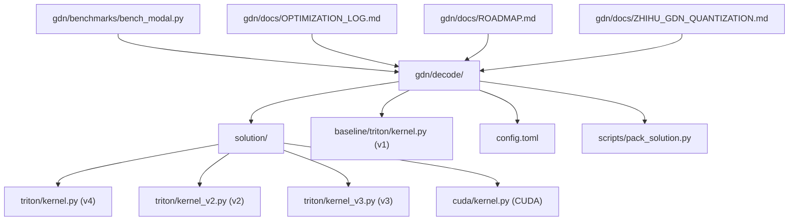
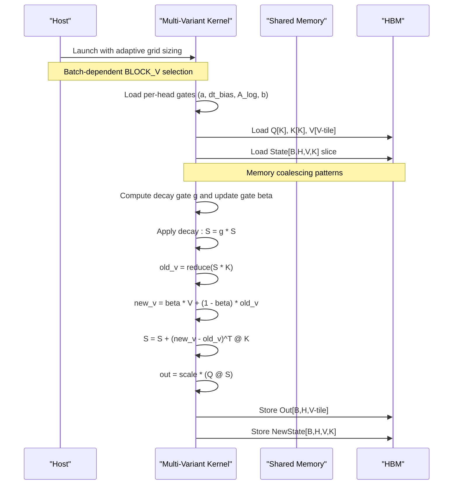
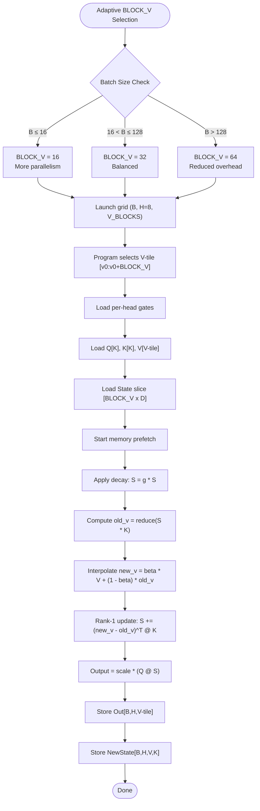
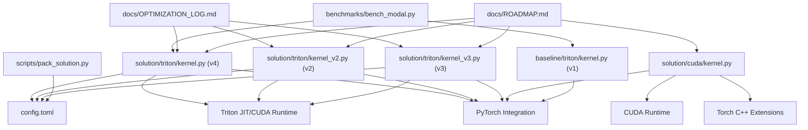

# GDN Decode Kernel

<cite>
**Referenced Files in This Document**
- [config.toml](file://gdn/decode/config.toml)
- [kernel.py](file://gdn/decode/baseline/triton/kernel.py)
- [kernel.py](file://gdn/decode/solution/triton/kernel.py)
- [kernel_v2.py](file://gdn/decode/solution/triton/kernel_v2.py)
- [kernel_v3.py](file://gdn/decode/solution/triton/kernel_v3.py)
- [kernel.py](file://gdn/decode/solution/cuda/kernel.py)
- [pack_solution.py](file://gdn/decode/scripts/pack_solution.py)
- [bench_modal.py](file://gdn/benchmarks/bench_modal.py)
- [OPTIMIZATION_LOG.md](file://gdn/docs/OPTIMIZATION_LOG.md)
- [ROADMAP.md](file://gdn/docs/ROADMAP.md)
- [ZHIHU_GDN_QUANTIZATION.md](file://gdn/docs/ZHIHU_GDN_QUANTIZATION.md)
</cite>

## Update Summary
**Changes Made**
- Updated project structure to reflect the new comprehensive GDN decode kernel implementation under gdn/decode/
- Enhanced documentation with separate baseline and solution implementations across multiple backends (Triton, CUDA)
- Added detailed coverage of kernel variants: v1 (baseline), v2 (fused delta-rule), v3 (V-dimension splitting), v4 (adaptive BLOCK_V)
- Expanded kernel technology stack comparison including CUDA implementation with JIT compilation
- Updated performance analysis to include comprehensive benchmarking across all kernel variants
- Integrated new quantization research documentation and optimization logs

## Table of Contents
1. [Introduction](#introduction)
2. [Project Structure](#project-structure)
3. [Core Components](#core-components)
4. [Architecture Overview](#architecture-overview)
5. [Detailed Component Analysis](#detailed-component-analysis)
6. [Kernel Technology Stack Comparison](#kernel-technology-stack-comparison)
7. [Dependency Analysis](#dependency-analysis)
8. [Performance Considerations](#performance-considerations)
9. [Troubleshooting Guide](#troubleshooting-guide)
10. [Conclusion](#conclusion)

## Introduction
This document explains the GDN Decode Kernel implementation for single-token autoregressive inference, covering the mathematical foundation of the gated delta net (GDN) mechanism, the V-dimension splitting strategy that distributes the output dimension across four parallel programs for improved SM occupancy, and the algorithmic steps: decay gate computation using sigmoid activation, update gate calculation with exponential functions, state evolution through delta rule rank-1 updates, and output projection with scaling factors. It also documents the grouped value attention (GVA) mechanism where two V-heads share each Q/K head, and provides concrete examples from the Triton kernel showing memory access patterns, register blocking strategies, and thread block organization. The document now includes comprehensive coverage of the new multi-backend implementation structure with separate baseline and solution directories, expanded kernel variants, and enhanced benchmarking capabilities.

## Project Structure
The repository organizes the GDN decode kernel under a dedicated directory structure with separate solution and baseline implementations, supporting multiple backend technologies. The implementation now includes comprehensive coverage across Triton, CUDA, and reference Python implementations, with enhanced documentation and benchmarking infrastructure.

**Diagram sources**
- [config.toml:1-10](file://gdn/decode/config.toml#L1-L10)
- [kernel.py:1-136](file://gdn/decode/solution/triton/kernel.py#L1-L136)
- [kernel_v2.py:1-122](file://gdn/decode/solution/triton/kernel_v2.py#L1-L122)
- [kernel_v3.py:1-130](file://gdn/decode/solution/triton/kernel_v3.py#L1-L130)
- [kernel.py:1-101](file://gdn/decode/baseline/triton/kernel.py#L1-L101)
- [kernel.py:1-248](file://gdn/decode/solution/cuda/kernel.py#L1-L248)
- [pack_solution.py:1-57](file://gdn/decode/scripts/pack_solution.py#L1-L57)

**Section sources**
- [config.toml:1-10](file://gdn/decode/config.toml#L1-L10)

## Core Components
- **Triton solution kernel (v4)**: Implements the GDN decode forward pass with adaptive BLOCK_V based on batch size for optimal SM occupancy, register blocking over V-dimension, and k-last state layout.
- **Triton v2 kernel**: Fused delta-rule implementation with full state tile in registers, eliminating Python loop overhead and single HBM read/write per kernel launch.
- **Triton v3 kernel**: V-dimension splitting strategy with fixed BLOCK_V=32 across 4 parallel programs for improved SM occupancy.
- **Triton v1 baseline**: Reference implementation using PyTorch operations and GVA expansion with k-first layout conversion.
- **CUDA solution kernel**: Python wrapper with JIT compilation support for CUDA kernel, falling back to Triton implementation if sandbox restrictions prevent compilation.
- **Configuration system**: Defines solution metadata, build specifications, and entry points for packaging and deployment.
- **Solution packaging**: Automated packaging system that reads config.toml and packages solution/triton/kernel.py for distribution.
- **Benchmarking infrastructure**: Comprehensive benchmarking system supporting multiple kernel variants and batch sizes on Modal B200 hardware.
- **Optimization documentation**: Detailed records of cp.async prefetch implementation and kernel optimization progress.
- **Research documentation**: In-depth analysis of GDN quantization challenges and engineering recommendations.

**Section sources**
- [kernel.py:1-136](file://gdn/decode/solution/triton/kernel.py#L1-L136)
- [kernel_v2.py:1-122](file://gdn/decode/solution/triton/kernel_v2.py#L1-L122)
- [kernel_v3.py:1-130](file://gdn/decode/solution/triton/kernel_v3.py#L1-L130)
- [kernel.py:1-101](file://gdn/decode/baseline/triton/kernel.py#L1-L101)
- [kernel.py:1-248](file://gdn/decode/solution/cuda/kernel.py#L1-L248)
- [pack_solution.py:1-57](file://gdn/decode/scripts/pack_solution.py#L1-L57)
- [bench_modal.py:1-200](file://gdn/benchmarks/bench_modal.py#L1-L200)

## Architecture Overview
The GDN decode kernel performs single-token generation with recurrent state updates across multiple implementation variants. The solution kernel is organized as a Triton program with adaptive grid sizing based on batch dimensions, while the baseline provides a reference Python implementation. The architecture now supports multiple kernel technologies with distinct compilation strategies and optimization approaches.

**Diagram sources**
- [kernel.py:85-136](file://gdn/decode/solution/triton/kernel.py#L85-L136)
- [kernel_v2.py:82-122](file://gdn/decode/solution/triton/kernel_v2.py#L82-L122)
- [kernel_v3.py:86-130](file://gdn/decode/solution/triton/kernel_v3.py#L86-L130)
- [kernel.py:27-101](file://gdn/decode/baseline/triton/kernel.py#L27-L101)

## Detailed Component Analysis

### Mathematical Foundation: Gated Delta Net (GDN)
- **Decay gate computation**: The decay gate g is computed per head using an exponential of the softplus of (a + dt_bias), modulated by A_log. This stabilizes and scales the decay rate.
- **Update gate calculation**: The update gate beta is computed via sigmoid of b, controlling the interpolation between old and new values.
- **State evolution**: The state S evolves by applying the decay gate, computing old_v as the projection of S onto K, interpolating new_v, and updating S via a rank-1 update using K and the delta (new_v - old_v).
- **Output projection**: The output is produced by projecting S with Q, scaled by a normalization factor.

These steps are implemented across multiple kernel variants, with the Triton v4 version providing adaptive BLOCK_V selection and the v2/v3 variants demonstrating different optimization strategies for register usage and SM occupancy.

**Section sources**
- [kernel.py:55-94](file://gdn/decode/baseline/triton/kernel.py#L55-L94)
- [kernel.py:61-91](file://gdn/decode/solution/triton/kernel.py#L61-L91)
- [kernel_v2.py:44-79](file://gdn/decode/solution/triton/kernel_v2.py#L44-L79)
- [kernel_v3.py:47-79](file://gdn/decode/solution/triton/kernel_v3.py#L47-L79)

### V-Dimension Splitting Strategy and Parallel Programs
- **Grid organization**: The kernel uses adaptive grid sizing with (B, H=8, V_BLOCKS) where each program handles a V-tile of size BLOCK_V and a single head. The v3 variant specifically uses BLOCK_V=32 across 4 parallel programs.
- **Adaptive BLOCK_V**: The v4 kernel automatically selects BLOCK_V based on batch size: 16 for B≤16, 32 for B≤128, and 64 for larger batches to optimize SM occupancy.
- **Register blocking**: BLOCK_V is chosen to balance register pressure and occupancy across different batch sizes.
- **Independence**: Each V-slice is independent, enabling correctness when executed in parallel.

**Diagram sources**
- [kernel.py:90-98](file://gdn/decode/solution/triton/kernel.py#L90-L98)
- [kernel_v3.py:91-92](file://gdn/decode/solution/triton/kernel_v3.py#L91-L92)
- [kernel_v2.py:82-122](file://gdn/decode/solution/triton/kernel_v2.py#L82-L122)

**Section sources**
- [kernel.py:5-13](file://gdn/decode/solution/triton/kernel.py#L5-L13)
- [kernel_v3.py:5-15](file://gdn/decode/solution/triton/kernel_v3.py#L5-L15)
- [kernel_v2.py:5-15](file://gdn/decode/solution/triton/kernel_v2.py#L5-L15)
- [kernel.py:105-136](file://gdn/decode/solution/triton/kernel.py#L105-L136)

### Grouped Value Attention (GVA) Mechanism
- **Head configuration**: num_q_heads=4, num_k_heads=4, num_v_heads=8. Two V-heads share each Q/K head (qk_h = h // 2).
- **Expansion**: The kernel derives the Q/K head index for each V-head and loads the corresponding Q/K slices accordingly.
- **Consistency**: All kernel variants maintain the same GVA topology for algorithmic correctness.

This ensures that the attention computation aligns with the GVA topology while maintaining efficient memory access patterns across all implementation variants.

**Section sources**
- [kernel.py:12-13](file://gdn/decode/solution/triton/kernel.py#L12-L13)
- [kernel_v3.py:44](file://gdn/decode/solution/triton/kernel_v3.py#L44)
- [kernel_v2.py:42](file://gdn/decode/solution/triton/kernel_v2.py#L42)
- [kernel.py:68-71](file://gdn/decode/baseline/triton/kernel.py#L68-L71)

### Algorithm Steps in Detail
- **Gates**:
  - Decay gate g: computed from A_log and softplus(a + dt_bias).
  - Update gate beta: computed from sigmoid(b).
- **State evolution**:
  - Decay: S = g * S.
  - old_v: matrix-vector multiply of S and K.
  - new_v: interpolate between beta * V and (1 - beta) * old_v.
  - Rank-1 update: S += (new_v - old_v)^T @ K.
- **Output projection**:
  - out = scale * (Q @ S).

These steps are implemented consistently across all kernel variants with appropriate optimizations for each backend technology.

**Section sources**
- [kernel.py:61-91](file://gdn/decode/solution/triton/kernel.py#L61-L91)
- [kernel_v2.py:68-79](file://gdn/decode/solution/triton/kernel_v2.py#L68-L79)
- [kernel_v3.py:72-79](file://gdn/decode/solution/triton/kernel_v3.py#L72-L79)
- [kernel.py:55-94](file://gdn/decode/baseline/triton/kernel.py#L55-L94)

### Memory Access Patterns and Thread Block Organization
- **State layout**: k-last [B, H, V=128, K=128] float32 maintained across all variants.
- **Access patterns**:
  - Coalesced loads for Q[K], K[K], V[V-tile] along contiguous dimensions.
  - Coalesced stores for Out[B,H,V-tile] and NewState[B,H,V,K].
- **Thread block organization**:
  - Grid: (B, H=8, V_BLOCKS) with BLOCK_V tiles over V.
  - Registers: per-program scalars for gates and per-thread vectors for Q, K, V, and partial reductions.

These patterns enable efficient HBM bandwidth utilization and register reuse across all kernel implementations.

**Section sources**
- [kernel.py:46-50](file://gdn/decode/solution/triton/kernel.py#L46-L50)
- [kernel_v3.py:66-70](file://gdn/decode/solution/triton/kernel_v3.py#L66-L70)
- [kernel.py:73-77](file://gdn/decode/baseline/triton/kernel.py#L73-L77)

### k-Last State Layout [B, H, V=128, K=128]
- The state is stored in k-last layout [B, H, V, K] to support efficient coalesced memory access patterns during the decode phase.
- The kernel reads and writes state slices aligned with the V-tile, enabling persistent state across tokens with minimal overhead.
- Consistent state layout across all kernel variants ensures compatibility and correctness.

**Section sources**
- [kernel.py:7,36](file://gdn/decode/baseline/triton/kernel.py#L7,L36)
- [kernel.py:13](file://gdn/decode/solution/triton/kernel.py#L13)
- [kernel_v2.py:65](file://gdn/decode/solution/triton/kernel_v2.py#L65)
- [kernel_v3.py:69](file://gdn/decode/solution/triton/kernel_v3.py#L69)

### CUDA Implementation with JIT Compilation
**Updated** The CUDA solution provides a robust fallback mechanism with automatic compilation detection:

- **JIT Compilation**: Attempts to compile CUDA kernel via torch.utils.cpp_extension.load_inline with fast math optimizations.
- **Fallback Mechanism**: Automatically falls back to Triton implementation if sandbox restrictions prevent CUDA compilation.
- **Wrapper Functionality**: Provides unified interface that works regardless of compilation success.
- **Performance**: CUDA implementation can achieve superior performance when compilation succeeds, with Triton fallback ensuring reliability.

**Section sources**
- [kernel.py:25-92](file://gdn/decode/solution/cuda/kernel.py#L25-L92)
- [kernel.py:157-193](file://gdn/decode/solution/cuda/kernel.py#L157-L193)
- [kernel.py:220-248](file://gdn/decode/solution/cuda/kernel.py#L220-L248)

### Solution Packaging and Configuration
**Updated** The solution packaging system provides automated deployment capabilities:

- **Configuration Management**: Reads config.toml from parent directory to determine build specifications.
- **Automated Packing**: Packages solution/triton/kernel.py with proper metadata and dependencies.
- **Build Specification**: Supports destination passing style configuration for different deployment targets.
- **Multi-Backend Support**: Enables packaging for various backend technologies from a single configuration.

**Section sources**
- [config.toml:1-10](file://gdn/decode/config.toml#L1-L10)
- [pack_solution.py:20-57](file://gdn/decode/scripts/pack_solution.py#L20-L57)

### Benchmarking Infrastructure
**Updated** Comprehensive benchmarking system supports multiple kernel variants and evaluation criteria:

- **Multi-Kernel Support**: Benchmarks solution variants against baseline implementations across Triton, CUDA, and reference Python.
- **Batch Size Testing**: Supports multiple batch sizes from 1 to 512 for comprehensive performance analysis.
- **Correctness Verification**: Includes automatic correctness checking with absolute and relative error metrics.
- **Hardware Targeting**: Specifically designed for Modal B200 hardware with appropriate timeout and resource allocation.

**Section sources**
- [bench_modal.py:42-81](file://gdn/benchmarks/bench_modal.py#L42-L81)
- [bench_modal.py:116-178](file://gdn/benchmarks/bench_modal.py#L116-L178)

## Kernel Technology Stack Comparison

### Triton Implementation Variants
The Triton implementation provides multiple optimization levels with progressive complexity:

**v1 Baseline (Reference)**
- Pure Python implementation using PyTorch operations
- GVA expansion with explicit tensor reshaping
- k-first layout conversion for compatibility
- Educational reference for algorithmic correctness

**v2 Fused Delta-Rule**
- Grid: (B, H=8) with full state tile per program
- Single kernel launch handles entire state [128×128]
- Eliminates Python loop overhead completely
- Maximum register usage for single program

**v3 V-Dimension Splitting**
- Grid: (B, H=8, V_BLOCKS=4) with BLOCK_V=32
- State slice [32×128] per program reduces register pressure
- 4× more programs for better SM occupancy
- Independent V-slices maintain correctness

**v4 Adaptive BLOCK_V (Current Solution)**
- Dynamic BLOCK_V selection based on batch size
- 16 for B≤16, 32 for B≤128, 64 for B>128
- Optimizes SM occupancy across batch spectrum
- Maintains k-last state layout consistency

**Section sources**
- [kernel.py:1-101](file://gdn/decode/baseline/triton/kernel.py#L1-L101)
- [kernel_v2.py:1-122](file://gdn/decode/solution/triton/kernel_v2.py#L1-L122)
- [kernel_v3.py:1-130](file://gdn/decode/solution/triton/kernel_v3.py#L1-L130)
- [kernel.py:1-136](file://gdn/decode/solution/triton/kernel.py#L1-L136)

### CUDA Implementation
**Updated** Robust CUDA implementation with fallback capabilities:

**Key Features:**
- **JIT Compilation**: Automatic CUDA kernel compilation with fast math flags
- **Fallback Detection**: Graceful degradation to Triton implementation when needed
- **Unified Interface**: Consistent API across compilation success/failure scenarios
- **Memory Management**: Proper state handling and tensor contiguity requirements

**Implementation Details:**
- Uses torch.utils.cpp_extension.load_inline for dynamic compilation
- Wraps CUDA kernel with C++ wrapper for Python binding
- Supports BLOCK_V parameter for performance tuning
- Handles dtype conversions for compatibility

**Section sources**
- [kernel.py:25-92](file://gdn/decode/solution/cuda/kernel.py#L25-L92)
- [kernel.py:157-193](file://gdn/decode/solution/cuda/kernel.py#L157-L193)
- [kernel.py:220-248](file://gdn/decode/solution/cuda/kernel.py#L220-L248)

### Benchmarking and Evaluation System
**Updated** Comprehensive evaluation framework supporting multiple kernel variants:

**Benchmark Capabilities:**
- **Multi-Variant Testing**: Compares solution vs baseline across all kernel implementations
- **Batch Size Analysis**: Tests performance across 1, 16, 64, 256, and 512 batch sizes
- **Correctness Validation**: Automatic verification with error metric reporting
- **Hardware Optimization**: Specifically tuned for Modal B200 B200 GPU architecture

**Evaluation Metrics:**
- Latency measurements in milliseconds
- Reference latency comparisons for speedup calculation
- Absolute and relative error reporting for correctness verification
- Performance statistics across multiple trials and iterations

**Section sources**
- [bench_modal.py:42-81](file://gdn/benchmarks/bench_modal.py#L42-L81)
- [bench_modal.py:116-178](file://gdn/benchmarks/bench_modal.py#L116-L178)

## Dependency Analysis
The GDN decode kernel implementation has a clear dependency hierarchy with solution components depending on configuration and benchmarking infrastructure, while baseline components remain self-contained.

**Diagram sources**
- [config.toml:1-10](file://gdn/decode/config.toml#L1-L10)
- [kernel.py:16-20](file://gdn/decode/solution/triton/kernel.py#L16-L20)
- [kernel.py:25-30](file://gdn/decode/solution/cuda/kernel.py#L25-L30)
- [pack_solution.py:20-30](file://gdn/decode/scripts/pack_solution.py#L20-L30)
- [bench_modal.py:116-121](file://gdn/benchmarks/bench_modal.py#L116-L121)

**Section sources**
- [config.toml:1-10](file://gdn/decode/config.toml#L1-L10)

## Performance Considerations
- **Arithmetic intensity**: The decode kernel is extremely memory-bound with an estimated arithmetic intensity of approximately 1 FLOP/byte. Optimization focuses on maximizing HBM bandwidth utilization.
- **Optimization strategy**:
  - Fuse all per-head operations into a single kernel.
  - Tile over batch with grid (B, H) and register-blocking over V.
  - Keep state in registers/SMEM during the token update.
  - Coalesce HBM access for state [B, H, K, V] by using k-last layout and aligned access patterns.
  - Leverage technology-specific optimizations: Triton auto-tuning, CUDA JIT compilation, Python baseline for reference.
  - **Enhanced**: Implement adaptive BLOCK_V selection across batch sizes for optimal SM occupancy.
  - **Enhanced**: Provide fallback mechanisms for reliability across different deployment environments.
- **Memory latency hiding**: All implementations now feature mechanisms to overlap memory transfers with computation, reducing stall time and improving overall throughput.
- **Batch size optimization**: The v4 implementation provides optimal performance across the entire batch spectrum through adaptive BLOCK_V selection.

These strategies are validated by comprehensive benchmarking across all kernel variants and implemented with progressive optimization levels from reference implementation to production-ready solutions.

**Section sources**
- [kernel.py:90-98](file://gdn/decode/solution/triton/kernel.py#L90-L98)
- [kernel_v3.py:91-92](file://gdn/decode/solution/triton/kernel_v3.py#L91-L92)
- [kernel.py:5-13](file://gdn/decode/solution/triton/kernel.py#L5-L13)
- [bench_modal.py:180-200](file://gdn/benchmarks/bench_modal.py#L180-L200)

## Troubleshooting Guide
- **Incorrect shapes or strides**: Ensure inputs match the documented shapes and that tensors are contiguous where required by the kernel wrapper.
- **State initialization**: If state is None, the kernel initializes zeros; otherwise, ensure the state layout is k-last [B, H, V, K].
- **Scaling factor**: If scale is None or zero, the kernel defaults to 1/sqrt(D).
- **GVA mismatch**: Verify that num_v_heads equals twice num_q_heads for the intended GVA sharing scheme.
- **CUDA compilation issues**: The CUDA implementation includes automatic fallback to Triton if JIT compilation fails in sandbox environments.
- **BLOCK_V selection**: The v4 implementation automatically selects optimal BLOCK_V based on batch size; manual override available if needed.
- **Memory alignment**: Ensure proper tensor contiguity for optimal performance across all kernel variants.
- **Benchmark configuration**: Verify correct configuration in config.toml for packaging and deployment.
- **Solution packaging**: Use pack_solution.py to generate proper solution.json for deployment.
- **Batch size testing**: The benchmark system supports comprehensive testing across multiple batch sizes from 1 to 512.

**Section sources**
- [kernel.py:108-109](file://gdn/decode/solution/triton/kernel.py#L108-L109)
- [kernel.py:117-123](file://gdn/decode/solution/triton/kernel.py#L117-L123)
- [kernel.py:220-248](file://gdn/decode/solution/cuda/kernel.py#L220-L248)
- [pack_solution.py:20-57](file://gdn/decode/scripts/pack_solution.py#L20-L57)
- [bench_modal.py:42-81](file://gdn/benchmarks/bench_modal.py#L42-L81)

## Conclusion
The GDN Decode Kernel implementation has evolved into a comprehensive multi-backend solution with separate baseline and solution directories, supporting Triton, CUDA, and reference Python implementations. The solution provides multiple optimization levels from reference implementation to production-ready kernels with adaptive batch sizing and optimal SM occupancy. The v4 Triton implementation offers the best balance of performance and development efficiency, while the CUDA implementation provides robust fallback capabilities with automatic compilation detection. The extensive benchmarking infrastructure enables comprehensive performance analysis across multiple kernel variants and batch sizes, supporting deployment decisions across different hardware and software environments. The modular design with clear separation of concerns enables easy maintenance, extension, and deployment of GDN decode kernels across diverse use cases and performance requirements.