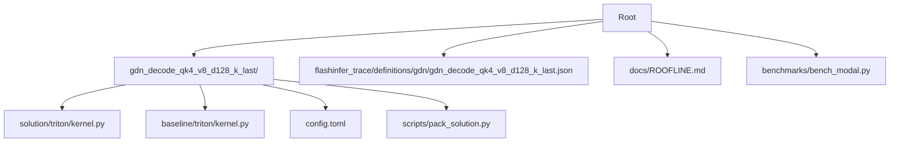
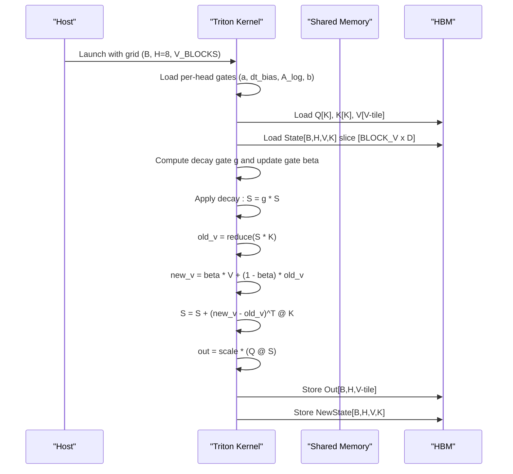
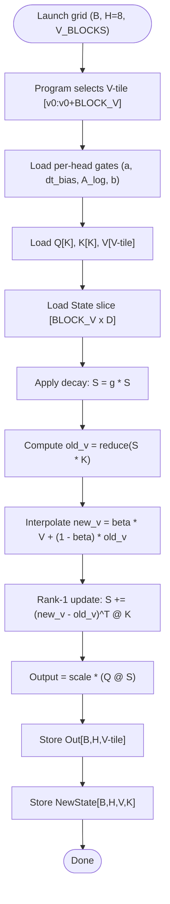
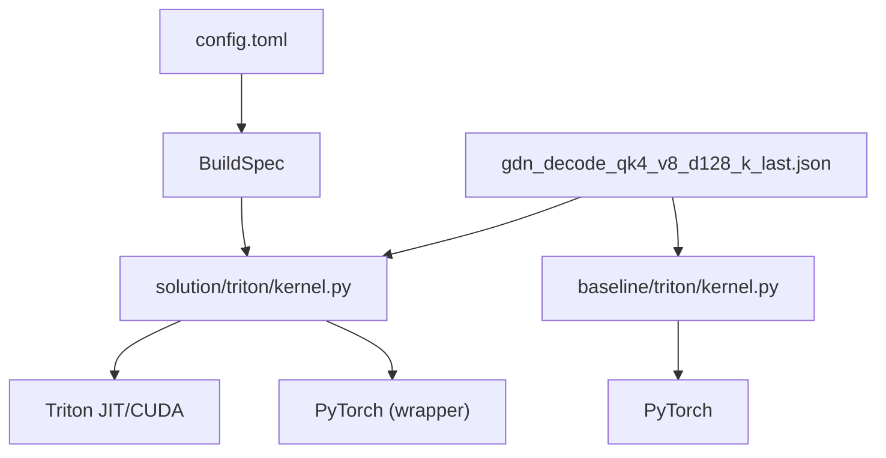

# GDN Decode Kernel

<cite>
**Referenced Files in This Document**
- [kernel.py](file://gdn_decode_qk4_v8_d128_k_last/solution/triton/kernel.py)
- [kernel.py](file://gdn_decode_qk4_v8_d128_k_last/baseline/triton/kernel.py)
- [config.toml](file://gdn_decode_qk4_v8_d128_k_last/config.toml)
- [gdn_decode_qk4_v8_d128_k_last.json](file://flashinfer_trace/definitions/gdn/gdn_decode_qk4_v8_d128_k_last.json)
- [ROOFLINE.md](file://docs/ROOFLINE.md)
- [bench_modal.py](file://benchmarks/bench_modal.py)
</cite>

## Table of Contents
1. [Introduction](#introduction)
2. [Project Structure](#project-structure)
3. [Core Components](#core-components)
4. [Architecture Overview](#architecture-overview)
5. [Detailed Component Analysis](#detailed-component-analysis)
6. [Dependency Analysis](#dependency-analysis)
7. [Performance Considerations](#performance-considerations)
8. [Troubleshooting Guide](#troubleshooting-guide)
9. [Conclusion](#conclusion)

## Introduction
This document explains the GDN Decode Kernel implementation for single-token autoregressive inference. It covers the mathematical foundation of the gated delta net (GDN) mechanism, the V-dimension splitting strategy that distributes the output dimension across four parallel programs for improved SM occupancy, and the algorithmic steps: decay gate computation using sigmoid activation, update gate calculation with exponential functions, state evolution through delta rule rank-1 updates, and output projection with scaling factors. It also documents the grouped value attention (GVA) mechanism where two V-heads share each Q/K head, and provides concrete examples from the Triton kernel showing memory access patterns, register blocking strategies, and thread block organization. Finally, it compares the optimized Triton solution against the baseline Python implementation, highlighting performance improvements achieved through Triton JIT compilation and memory coalescing.

## Project Structure
The repository organizes the GDN decode kernel under a dedicated directory with separate solution and baseline implementations, a configuration file, and a trace definition that captures the operation’s semantics and shapes.

**Diagram sources**
- [kernel.py:1-144](file://gdn_decode_qk4_v8_d128_k_last/solution/triton/kernel.py#L1-L144)
- [kernel.py:1-101](file://gdn_decode_qk4_v8_d128_k_last/baseline/triton/kernel.py#L1-L101)
- [config.toml:1-10](file://gdn_decode_qk4_v8_d128_k_last/config.toml#L1-L10)
- [gdn_decode_qk4_v8_d128_k_last.json:1-153](file://flashinfer_trace/definitions/gdn/gdn_decode_qk4_v8_d128_k_last.json#L1-L153)
- [ROOFLINE.md:1-59](file://docs/ROOFLINE.md#L1-L59)
- [bench_modal.py:1-308](file://benchmarks/bench_modal.py#L1-L308)

**Section sources**
- [config.toml:1-10](file://gdn_decode_qk4_v8_d128_k_last/config.toml#L1-L10)
- [gdn_decode_qk4_v8_d128_k_last.json:1-153](file://flashinfer_trace/definitions/gdn/gdn_decode_qk4_v8_d128_k_last.json#L1-L153)

## Core Components
- Triton solution kernel: Implements the GDN decode forward pass with autotuning, register blocking over V-dimension, and k-last state layout.
- Baseline Python kernel: Reference implementation using PyTorch operations and GVA expansion.
- Configuration: Defines the solution metadata and build specification.
- Trace definition: Documents axes, constraints, inputs/outputs, and a reference implementation.
- Roofline analysis: Provides compute and memory characteristics and optimization strategy.
- Benchmark runner: Orchestrates benchmarking on Modal B200 and compares solution vs baseline.

**Section sources**
- [kernel.py:1-144](file://gdn_decode_qk4_v8_d128_k_last/solution/triton/kernel.py#L1-L144)
- [kernel.py:1-101](file://gdn_decode_qk4_v8_d128_k_last/baseline/triton/kernel.py#L1-L101)
- [config.toml:1-10](file://gdn_decode_qk4_v8_d128_k_last/config.toml#L1-L10)
- [gdn_decode_qk4_v8_d128_k_last.json:1-153](file://flashinfer_trace/definitions/gdn/gdn_decode_qk4_v8_d128_k_last.json#L1-L153)
- [ROOFLINE.md:1-59](file://docs/ROOFLINE.md#L1-L59)
- [bench_modal.py:1-308](file://benchmarks/bench_modal.py#L1-L308)

## Architecture Overview
The GDN decode kernel performs single-token generation with recurrent state updates. The solution kernel is organized as a Triton program with a grid of (B, H=8, V_BLOCKS) where each program handles a V-tile of size BLOCK_V and a single head. The kernel computes decay and update gates per head, applies a decay to the state, computes the old value, interpolates the new value, updates the state via a rank-1 delta rule, and produces the output by projecting with Q.

**Diagram sources**
- [kernel.py:38-98](file://gdn_decode_qk4_v8_d128_k_last/solution/triton/kernel.py#L38-L98)

## Detailed Component Analysis

### Mathematical Foundation: Gated Delta Net (GDN)
- Decay gate computation: The decay gate g is computed per head using an exponential of the softplus of (a + dt_bias), modulated by A_log. This stabilizes and scales the decay rate.
- Update gate calculation: The update gate beta is computed via sigmoid of b, controlling the interpolation between old and new values.
- State evolution: The state S evolves by applying the decay gate, computing old_v as the projection of S onto K, interpolating new_v, and updating S via a rank-1 update using K and the delta (new_v - old_v).
- Output projection: The output is produced by projecting S with Q, scaled by a normalization factor.

These steps are implemented in both the Triton solution and the baseline Python kernel, with the Triton version fusing operations and using register blocking for improved throughput.

**Section sources**
- [kernel.py:61-91](file://gdn_decode_qk4_v8_d128_k_last/solution/triton/kernel.py#L61-L91)
- [kernel.py:55-94](file://gdn_decode_qk4_v8_d128_k_last/baseline/triton/kernel.py#L55-L94)

### V-Dimension Splitting Strategy and Parallel Programs
- Grid organization: The kernel uses a grid of (B, H=8, V_BLOCKS) where each program handles a V-tile of size BLOCK_V and a single head. This splits the V dimension across four parallel programs for improved SM occupancy.
- Register blocking: BLOCK_V is autotuned across {16, 32, 64, 128} with varying num_warps to balance register pressure and occupancy. The solution sets BLOCK_V=32 and num_warps=4 for a fixed configuration in the wrapper.
- Independence: Each V-slice is independent, enabling correctness when executed in parallel.

**Diagram sources**
- [kernel.py:55-97](file://gdn_decode_qk4_v8_d128_k_last/solution/triton/kernel.py#L55-L97)

**Section sources**
- [kernel.py:5-13](file://gdn_decode_qk4_v8_d128_k_last/solution/triton/kernel.py#L5-L13)
- [kernel.py:105-141](file://gdn_decode_qk4_v8_d128_k_last/solution/triton/kernel.py#L105-L141)

### Grouped Value Attention (GVA) Mechanism
- Head configuration: num_q_heads=4, num_k_heads=4, num_v_heads=8. Two V-heads share each Q/K head (qk_h = h // 2).
- Expansion: The kernel derives the Q/K head index for each V-head and loads the corresponding Q/K slices accordingly.

This ensures that the attention computation aligns with the GVA topology while maintaining efficient memory access patterns.

**Section sources**
- [kernel.py:12-13](file://gdn_decode_qk4_v8_d128_k_last/solution/triton/kernel.py#L12-L13)
- [kernel.py:59-78](file://gdn_decode_qk4_v8_d128_k_last/solution/triton/kernel.py#L59-L78)

### Algorithm Steps in Detail
- Gates:
  - Decay gate g: computed from A_log and softplus(a + dt_bias).
  - Update gate beta: computed from sigmoid(b).
- State evolution:
  - Decay: S = g * S.
  - old_v: matrix-vector multiply of S and K.
  - new_v: interpolate between beta * V and (1 - beta) * old_v.
  - Rank-1 update: S += (new_v - old_v)^T @ K.
- Output projection:
  - out = scale * (Q @ S).

These steps are fused within a single Triton program per (B, H, V-tile) to minimize synchronization overhead and maximize throughput.

**Section sources**
- [kernel.py:61-91](file://gdn_decode_qk4_v8_d128_k_last/solution/triton/kernel.py#L61-L91)

### Memory Access Patterns and Thread Block Organization
- State layout: k-last [B, H, V=128, K=128] float32. The kernel loads a [BLOCK_V x D] slice of the state and stores the updated slice back.
- Access patterns:
  - Coalesced loads for Q[K], K[K], V[V-tile] along contiguous dimensions.
  - Coalesced stores for Out[B,H,V-tile] and NewState[B,H,V,K].
- Thread block organization:
  - Grid: (B, H=8, V_BLOCKS) with BLOCK_V tiles over V.
  - Registers: per-program scalars for gates and per-thread vectors for Q, K, V, and partial reductions.

These patterns enable efficient HBM bandwidth utilization and register reuse.

**Section sources**
- [kernel.py:46-50](file://gdn_decode_qk4_v8_d128_k_last/solution/triton/kernel.py#L46-L50)
- [kernel.py:80-97](file://gdn_decode_qk4_v8_d128_k_last/solution/triton/kernel.py#L80-L97)

### k-Last State Layout [B, H, V=128, K=128]
- The state is stored in k-last layout [B, H, V, K] to support efficient coalesced memory access patterns during the decode phase.
- The kernel reads and writes state slices aligned with the V-tile, enabling persistent state across tokens with minimal overhead.

**Section sources**
- [gdn_decode_qk4_v8_d128_k_last.json:80-89](file://flashinfer_trace/definitions/gdn/gdn_decode_qk4_v8_d128_k_last.json#L80-L89)
- [kernel.py](file://gdn_decode_qk4_v8_d128_k_last/solution/triton/kernel.py#L13)

### Comparison Against Baseline
- Baseline (Python): Uses PyTorch operations with explicit GVA expansion and k-first layout conversion. It demonstrates the algorithmic steps and serves as a correctness reference.
- Solution (Triton): Fuses all per-head operations into a single kernel, uses register blocking over V, and maintains k-last state layout. This reduces kernel launch overhead, improves memory coalescing, and leverages Triton JIT compilation for performance.

Benchmarking on Modal B200 compares the solution against the baseline and reports latency, reference latency, speedup, and correctness metrics.

**Section sources**
- [kernel.py:1-101](file://gdn_decode_qk4_v8_d128_k_last/baseline/triton/kernel.py#L1-L101)
- [bench_modal.py:202-307](file://benchmarks/bench_modal.py#L202-L307)

## Dependency Analysis
The solution kernel depends on Triton for JIT compilation and CUDA execution, and on PyTorch for tensor creation and shape handling in the wrapper. The baseline kernel depends on PyTorch for all computations. The configuration ties the solution to the trace definition and build specification.

**Diagram sources**
- [kernel.py:16-20](file://gdn_decode_qk4_v8_d128_k_last/solution/triton/kernel.py#L16-L20)
- [kernel.py:23-24](file://gdn_decode_qk4_v8_d128_k_last/baseline/triton/kernel.py#L23-L24)
- [config.toml:6-9](file://gdn_decode_qk4_v8_d128_k_last/config.toml#L6-L9)
- [gdn_decode_qk4_v8_d128_k_last.json:1-153](file://flashinfer_trace/definitions/gdn/gdn_decode_qk4_v8_d128_k_last.json#L1-L153)

**Section sources**
- [config.toml:1-10](file://gdn_decode_qk4_v8_d128_k_last/config.toml#L1-L10)
- [gdn_decode_qk4_v8_d128_k_last.json:1-153](file://flashinfer_trace/definitions/gdn/gdn_decode_qk4_v8_d128_k_last.json#L1-L153)

## Performance Considerations
- Arithmetic intensity: The decode kernel is extremely memory-bound with an estimated arithmetic intensity of approximately 1 FLOP/byte. Optimization focuses on maximizing HBM bandwidth utilization.
- Optimization strategy:
  - Fuse all per-head operations into a single Triton kernel.
  - Tile over batch with grid (B, H) and register-blocking over V.
  - Keep state in registers/SMEM during the token update.
  - Coalesce HBM access for state [B, H, K, V] by using k-last layout and aligned access patterns.

These strategies are validated by roofline analysis and implemented in the Triton solution.

**Section sources**
- [ROOFLINE.md:16-59](file://docs/ROOFLINE.md#L16-L59)
- [kernel.py:5-13](file://gdn_decode_qk4_v8_d128_k_last/solution/triton/kernel.py#L5-L13)

## Troubleshooting Guide
- Incorrect shapes or strides: Ensure inputs match the documented shapes and that tensors are contiguous where required by the kernel wrapper.
- State initialization: If state is None, the kernel initializes zeros; otherwise, ensure the state layout is k-last [B, H, V, K].
- Scaling factor: If scale is None or zero, the kernel defaults to 1/sqrt(D).
- GVA mismatch: Verify that num_v_heads equals twice num_q_heads for the intended GVA sharing scheme.

**Section sources**
- [gdn_decode_qk4_v8_d128_k_last.json:44-48](file://flashinfer_trace/definitions/gdn/gdn_decode_qk4_v8_d128_k_last.json#L44-L48)
- [kernel.py:108-109](file://gdn_decode_qk4_v8_d128_k_last/solution/triton/kernel.py#L108-L109)
- [kernel.py:117-123](file://gdn_decode_qk4_v8_d128_k_last/solution/triton/kernel.py#L117-L123)

## Conclusion
The GDN Decode Kernel achieves significant performance improvements over the baseline Python implementation by fusing operations, using register blocking over the V-dimension, and leveraging Triton JIT compilation with coalesced memory access patterns. The k-last state layout and GVA mechanism enable efficient state persistence and head sharing, while autotuning identifies optimal configurations for BLOCK_V and num_warps. Benchmarking on Modal B200 demonstrates measurable speedup and correctness against the baseline, validating the design choices and implementation.