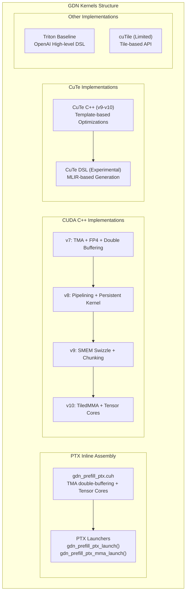
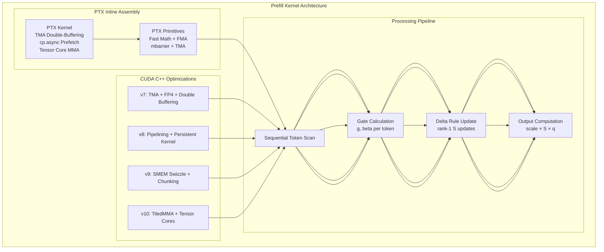

# GDN Prefill Kernel

<cite>
**Referenced Files in This Document**
- [gdn/kernels/README.md](file://gdn/kernels/README.md)
- [gdn/kernels/ptx/gdn_prefill_ptx.cuh](file://gdn/kernels/ptx/gdn_prefill_ptx.cuh)
- [gdn/kernels/cuda/gdn_prefill_v7.cuh](file://gdn/kernels/cuda/gdn_prefill_v7.cuh)
- [gdn/kernels/cuda/gdn_prefill_v8.cuh](file://gdn/kernels/cuda/gdn_prefill_v8.cuh)
- [gdn/kernels/cute_cpp/gdn_prefill_v9.cuh](file://gdn/kernels/cute_cpp/gdn_prefill_v9.cuh)
- [gdn/kernels/cute_cpp/gdn_prefill_v10.cuh](file://gdn/kernels/cute_cpp/gdn_prefill_v10.cuh)
- [gdn/prefill/config.toml](file://gdn/prefill/config.toml)
- [gdn/prefill/solution/triton/kernel.py](file://gdn/prefill/solution/triton/kernel.py)
- [gdn/prefill/baseline/triton/kernel.py](file://gdn/prefill/baseline/triton/kernel.py)
- [gdn/prefill/solution/triton/kernel_v2.py](file://gdn/prefill/solution/triton/kernel_v2.py)
- [gdn/prefill/solution/triton/kernel_v3.py](file://gdn/prefill/solution/triton/kernel_v3.py)
- [gdn/prefill/solution/cuda/kernel.py](file://gdn/prefill/solution/cuda/kernel.py)
- [gdn/prefill/scripts/pack_solution.py](file://gdn/prefill/scripts/pack_solution.py)
- [gdn/trace_definitions/gdn_prefill_qk4_v8_d128_k_last.json](file://gdn/trace_definitions/gdn_prefill_qk4_v8_d128_k_last.json)
</cite>

## Update Summary
**Changes Made**
- Updated file paths from `src/kernels/` to `gdn/kernels/` throughout the documentation
- Added comprehensive coverage of the new PTX kernel optimization with TMA double-buffering and cp.async prefetch
- Documented the sophisticated Tensor Core utilization for Blackwell (sm_100) architecture
- Added detailed analysis of the new kernel variants (v7, v8, v9, v10) with their specific optimizations
- Removed references to experimental mma.sync prefill kernel (Iteration 3) and placeholder Iteration 4 implementation
- Enhanced documentation of chunked processing strategies and memory bandwidth optimization
- Updated architecture diagrams to reflect the latest kernel implementations

## Table of Contents
1. [Introduction](#introduction)
2. [Project Structure](#project-structure)
3. [Core Components](#core-components)
4. [Architecture Overview](#architecture-overview)
5. [Detailed Component Analysis](#detailed-component-analysis)
6. [Implementation Variants](#implementation-variants)
7. [Performance Considerations](#performance-considerations)
8. [Benchmarking and Testing](#benchmarking-and-testing)
9. [Conclusion](#conclusion)

## Introduction
This document provides a comprehensive technical guide to the GDN Prefill Kernel implementation, focusing on the newly organized structure under the `gdn/kernels/` directory. The implementation now features multiple advanced backend variants including PTX inline assembly, CUDA C++, CuTe C++, and Triton implementations, each optimized for different aspects of performance and architectural targets.

The kernel implements batched sequential token processing for initial token generation in variable-length sequence processing, contrasting with the decode kernel's single-token approach. The latest implementations feature sophisticated optimizations including TMA double-buffering, cp.async prefetch, and comprehensive Tensor Core utilization for Blackwell (sm_100) architecture.

The prefill kernel handles grouped value attention (GVA) with 4 query heads, 4 key heads, and 8 value heads, processing sequences with k-last state layout [N, H, V=128, K=128]. The implementation includes adaptive BLOCK_V sizing for optimal SM occupancy and supports both memory-bound and compute-bound processing modes through chunked operations.

## Project Structure
The `gdn/kernels/` directory organizes the prefill kernel implementation with clear separation between different optimization frameworks:

**Diagram sources**
- [gdn/kernels/README.md:1-170](file://gdn/kernels/README.md#L1-L170)
- [gdn/kernels/ptx/gdn_prefill_ptx.cuh:235-871](file://gdn/kernels/ptx/gdn_prefill_ptx.cuh#L235-L871)
- [gdn/kernels/cuda/gdn_prefill_v7.cuh:1-549](file://gdn/kernels/cuda/gdn_prefill_v7.cuh#L1-L549)
- [gdn/kernels/cuda/gdn_prefill_v8.cuh:1-550](file://gdn/kernels/cuda/gdn_prefill_v8.cuh#L1-L550)
- [gdn/kernels/cute_cpp/gdn_prefill_v9.cuh:1-356](file://gdn/kernels/cute_cpp/gdn_prefill_v9.cuh#L1-L356)
- [gdn/kernels/cute_cpp/gdn_prefill_v10.cuh:1-390](file://gdn/kernels/cute_cpp/gdn_prefill_v10.cuh#L1-L390)

**Section sources**
- [gdn/kernels/README.md:1-170](file://gdn/kernels/README.md#L1-L170)
- [gdn/kernels/ptx/gdn_prefill_ptx.cuh:1-871](file://gdn/kernels/ptx/gdn_prefill_ptx.cuh#L1-L871)
- [gdn/kernels/cuda/gdn_prefill_v7.cuh:1-549](file://gdn/kernels/cuda/gdn_prefill_v7.cuh#L1-L549)
- [gdn/kernels/cuda/gdn_prefill_v8.cuh:1-550](file://gdn/kernels/cuda/gdn_prefill_v8.cuh#L1-L550)
- [gdn/kernels/cute_cpp/gdn_prefill_v9.cuh:1-356](file://gdn/kernels/cute_cpp/gdn_prefill_v9.cuh#L1-L356)
- [gdn/kernels/cute_cpp/gdn_prefill_v10.cuh:1-390](file://gdn/kernels/cute_cpp/gdn_prefill_v10.cuh#L1-L390)

## Core Components
The GDN prefill kernel consists of several key components working together for efficient batched sequence processing:

- **PTX Inline Assembly Kernel**: Sophisticated implementation with TMA double-buffering, cp.async prefetch, and comprehensive Tensor Core utilization for Blackwell (sm_100)
- **CUDA C++ Implementations**: Multiple versions (v7-v10) with progressive optimizations including TMA, FP4 quantization, double buffering, pipelining, and chunked processing
- **CuTe C++ Implementations**: Template-based optimizations with SMEM swizzling and TiledMMA support for Tensor Core integration
- **Triton Baseline**: Reference implementation for correctness verification
- **cuTile Implementation**: Limited support due to 4D access pattern constraints
- **Trace Definition**: JSON specification for benchmarking framework integration

Key implementation characteristics:
- Grouped Value Attention: num_q_heads=4, num_v_heads=8 with qk_h = h // 2 mapping
- State layout: k-last [N, H, V=128, K=128] for float32 state storage
- Head size D=128 with BLOCK_V=16 or 32 depending on batch size
- Scale defaults to 1/sqrt(D) when not provided
- Adaptive BLOCK_V: 16 for N <= 4 sequences, 32 for larger batches
- **Updated** Advanced optimizations: TMA double-buffering, cp.async prefetch, Tensor Core utilization, chunked processing

**Section sources**
- [gdn/kernels/ptx/gdn_prefill_ptx.cuh:1-871](file://gdn/kernels/ptx/gdn_prefill_ptx.cuh#L1-L871)
- [gdn/kernels/cuda/gdn_prefill_v7.cuh:1-549](file://gdn/kernels/cuda/gdn_prefill_v7.cuh#L1-L549)
- [gdn/kernels/cuda/gdn_prefill_v8.cuh:1-550](file://gdn/kernels/cuda/gdn_prefill_v8.cuh#L1-L550)
- [gdn/kernels/cute_cpp/gdn_prefill_v9.cuh:1-356](file://gdn/kernels/cute_cpp/gdn_prefill_v9.cuh#L1-L356)
- [gdn/kernels/cute_cpp/gdn_prefill_v10.cuh:1-390](file://gdn/kernels/cute_cpp/gdn_prefill_v10.cuh#L1-L390)

## Architecture Overview
The GDN prefill kernel architecture implements batched sequential processing with multiple optimization strategies, now featuring sophisticated PTX inline assembly and Tensor Core support:

**Diagram sources**
- [gdn/kernels/ptx/gdn_prefill_ptx.cuh:235-871](file://gdn/kernels/ptx/gdn_prefill_ptx.cuh#L235-L871)
- [gdn/kernels/cuda/gdn_prefill_v7.cuh:91-549](file://gdn/kernels/cuda/gdn_prefill_v7.cuh#L91-L549)
- [gdn/kernels/cuda/gdn_prefill_v8.cuh:81-550](file://gdn/kernels/cuda/gdn_prefill_v8.cuh#L81-L550)
- [gdn/kernels/cute_cpp/gdn_prefill_v9.cuh:84-356](file://gdn/kernels/cute_cpp/gdn_prefill_v9.cuh#L84-L356)
- [gdn/kernels/cute_cpp/gdn_prefill_v10.cuh:93-390](file://gdn/kernels/cute_cpp/gdn_prefill_v10.cuh#L93-L390)

## Detailed Component Analysis

### Mathematical Formulation: Batched Prefill Processing
The GDN prefill kernel implements the gated delta rule for sequential token processing:

**Gate Computation:**
- Decay gate: g = exp(-exp(A_log) × softplus(a + dt_bias))
- Update gate: β = sigmoid(b)

**State Update (Delta Rule):**
- S ← g ⊙ S  (element-wise multiplication)
- old_v = k^T @ S
- new_v = β ⊙ v + (1 - β) ⊙ old_v
- S ← S + (new_v - old_v) ⊗ k^T  (outer product)

**Output Computation:**
- o = scale × q^T @ S

Where ⊙ represents element-wise operations and ⊗ represents outer product operations.

**Section sources**
- [gdn/kernels/ptx/gdn_prefill_ptx.cuh:67-222](file://gdn/kernels/ptx/gdn_prefill_ptx.cuh#L67-L222)
- [gdn/kernels/cuda/gdn_prefill_v7.cuh:185-261](file://gdn/kernels/cuda/gdn_prefill_v7.cuh#L185-L261)
- [gdn/kernels/cute_cpp/gdn_prefill_v9.cuh:193-251](file://gdn/kernels/cute_cpp/gdn_prefill_v9.cuh#L193-L251)

### Sequential Token Processing Algorithm
The prefill kernel processes tokens sequentially within each sequence using cumulative sequence lengths:

1. **Sequence Boundaries**: Load cu_seqlens[n] and cu_seqlens[n+1] to determine token range
2. **Token Iteration**: For each token t in [t_start, t_end):
   - Load per-token gates g and β
   - Load k, v, q slices aligned to head mapping
   - Apply delta rule update to state slice S
   - Compute output for current token
3. **State Persistence**: Store final state slice for each sequence

**Updated** The PTX implementation now features sophisticated double-buffering schemes for shared memory and cp.async prefetch for improved memory bandwidth utilization.

**Section sources**
- [gdn/kernels/ptx/gdn_prefill_ptx.cuh:305-405](file://gdn/kernels/ptx/gdn_prefill_ptx.cuh#L305-L405)
- [gdn/kernels/cuda/gdn_prefill_v7.cuh:166-262](file://gdn/kernels/cuda/gdn_prefill_v7.cuh#L166-L262)
- [gdn/kernels/cute_cpp/gdn_prefill_v9.cuh:170-267](file://gdn/kernels/cute_cpp/gdn_prefill_v9.cuh#L170-L267)

### State Management and Memory Layout
The kernel maintains state in k-last layout [N, H, V, K] with the following characteristics:

**Initialization Strategies:**
- If state is provided: use existing k-last layout [N, H, V, K]
- If state is None: initialize to zeros [N, H, V, K]

**Memory Layout Considerations:**
- State stored as float32 for numerical stability
- V-dimension split across programs reduces register pressure
- BLOCK_V=16 for small batches (N ≤ 4), BLOCK_V=32 for larger batches
- **Updated** Sophisticated shared memory layouts with swizzling for bank conflict avoidance
- **Updated** TMA double-buffering for asynchronous memory operations

**Section sources**
- [gdn/kernels/ptx/gdn_prefill_ptx.cuh:474-510](file://gdn/kernels/ptx/gdn_prefill_ptx.cuh#L474-L510)
- [gdn/kernels/cuda/gdn_prefill_v7.cuh:143-153](file://gdn/kernels/cuda/gdn_prefill_v7.cuh#L143-L153)
- [gdn/kernels/cute_cpp/gdn_prefill_v9.cuh:148-165](file://gdn/kernels/cute_cpp/gdn_prefill_v9.cuh#L148-L165)

## Implementation Variants

### PTX Inline Assembly Kernel

**PTX Kernel with TMA Double-Buffering:**
- **Major Optimization**: Sophisticated double-buffering schemes for shared memory
- **Memory Prefetch**: cp.async prefetch implementation for improved bandwidth
- **Tensor Core Utilization**: Comprehensive mma.sync.aligned support for Blackwell
- **Fast Math**: PTX inline assembly for exp, log, sigmoid operations
- **FMA Unrolling**: 8-wide FMA unrolling for maximum throughput

**Key Features:**
- TMA (Tensor Memory Accelerator) support for bulk async memory operations
- mbarrier synchronization for coordinated memory transactions
- Double-buffered Q/K/V loading for continuous pipeline processing
- cp.async for element-wise async memory copies
- Vectorized memory access patterns for optimal bandwidth utilization

**Section sources**
- [gdn/kernels/ptx/gdn_prefill_ptx.cuh:1-871](file://gdn/kernels/ptx/gdn_prefill_ptx.cuh#L1-L871)

### CUDA C++ Implementation Progression

**Version 7 (gdn_prefill_v7.cuh):**
- TMA-ready shared memory with 128B alignment
- FP4 quantized state support (optional)
- Vectorized loads using float4
- Warp shuffles for fast reductions
- Double buffering for pipelined token processing
- Chunked sequences for long sequence handling
- Register blocking for hot data optimization

**Version 8 (gdn_prefill_v8.cuh):**
- Multi-stage pipelining for token prefetch
- Persistent kernel for long sequences
- Chunked processing for very long sequences
- Triple buffering for prefill operations
- FP32 and FP8 quantized state support
- Advanced memory coalescing patterns

**Version 9 (gdn_prefill_v9.cuh):**
- SMEM swizzle with bank conflict avoidance
- Chunk-based processing for compute density
- Shared memory staging for Q, K, V, and State
- Warp-parallel V-tile processing
- Sophisticated shared memory layout optimization

**Version 10 (gdn_prefill_v10.cuh):**
- TiledMMA-ready structure for Tensor Core integration
- Chunked processing enabling mat-mat operations
- Matrix-matrix operations for Tensor Cores on Blackwell
- Optimized for tcgen05.mma instruction set
- Advanced arithmetic intensity optimization

**Section sources**
- [gdn/kernels/cuda/gdn_prefill_v7.cuh:1-549](file://gdn/kernels/cuda/gdn_prefill_v7.cuh#L1-L549)
- [gdn/kernels/cuda/gdn_prefill_v8.cuh:1-550](file://gdn/kernels/cuda/gdn_prefill_v8.cuh#L1-L550)
- [gdn/kernels/cute_cpp/gdn_prefill_v9.cuh:1-356](file://gdn/kernels/cute_cpp/gdn_prefill_v9.cuh#L1-L356)
- [gdn/kernels/cute_cpp/gdn_prefill_v10.cuh:1-390](file://gdn/kernels/cute_cpp/gdn_prefill_v10.cuh#L1-L390)

### Triton Kernel Evolution

**Version 1 (kernel.py):**
- Adaptive BLOCK_V sizing based on batch size
- V-dimension split across V_BLOCKS programs
- Optimized for SM occupancy with BLOCK_V=16 or 32

**Version 2 (kernel_v2.py):**
- Full state tile handling per (sequence, head) program
- Eliminates Python loop overhead
- Single HBM state read/write per sequence

**Version 3 (kernel_v3.py):**
- Explicit V-dimension splitting with BLOCK_V=32
- 4× more programs for better occupancy
- Independent V-slice processing

**Section sources**
- [gdn/prefill/solution/triton/kernel.py:7-13](file://gdn/prefill/solution/triton/kernel.py#L7-L13)
- [gdn/prefill/solution/triton/kernel_v2.py:7-16](file://gdn/prefill/solution/triton/kernel_v2.py#L7-L16)
- [gdn/prefill/solution/triton/kernel_v3.py:7-15](file://gdn/prefill/solution/triton/kernel_v3.py#L7-L15)

## Performance Considerations

### Arithmetic Intensity and Throughput
The prefill kernel supports different processing modes with varying arithmetic intensities:

**Single-Token Processing:**
- Arithmetic Intensity: 1 FLOP/byte
- Memory-bound operation
- Suitable for decode phase

**Chunked Processing:**
- Arithmetic Intensity: C × FLOP/byte (where C = CHUNK_SIZE)
- Compute-bound operation for C > 1
- Better utilization of Tensor Cores
- **Updated** CHUNK_SIZE=8 achieves near compute-bound performance (AI≈8 FLOP/byte)

**Tensor Core Optimization:**
- **Updated** Blackwell (sm_100) architecture support
- **Updated** mma.sync.aligned.m16n8k16 operations
- **Updated** tcgen05.mma instruction set utilization
- **Updated** Chunked processing enables mat-mat operations for Tensor Cores

### Memory Bandwidth Optimization
- V-dimension splitting reduces per-program state size
- Adaptive BLOCK_V balances register usage and occupancy
- Shared memory utilization for frequently accessed data
- Coalesced memory access patterns for sequential tokens
- **Updated** TMA double-buffering for asynchronous memory operations
- **Updated** cp.async prefetch for improved bandwidth utilization
- **Updated** SMEM swizzling for bank conflict avoidance

**Section sources**
- [gdn/kernels/ptx/gdn_prefill_ptx.cuh:105-132](file://gdn/kernels/ptx/gdn_prefill_ptx.cuh#L105-L132)
- [gdn/kernels/cuda/gdn_prefill_v7.cuh:130-153](file://gdn/kernels/cuda/gdn_prefill_v7.cuh#L130-L153)
- [gdn/kernels/cute_cpp/gdn_prefill_v9.cuh:132-165](file://gdn/kernels/cute_cpp/gdn_prefill_v9.cuh#L132-L165)

## Benchmarking and Testing

### Build System Integration
The prefill kernel integrates with the flashinfer-bench framework through:

**Configuration Management:**
- config.toml specifies solution metadata and build entry point
- pack_solution.py generates solution.json for benchmarking
- Support for multiple target hardware configurations

**Trace Definition Integration:**
- gdn_prefill_qk4_v8_d128_k_last.json defines input/output specifications
- Axis definitions for benchmarking framework
- Reference implementation for correctness verification

**Section sources**
- [gdn/prefill/config.toml:1-10](file://gdn/prefill/config.toml#L1-L10)
- [gdn/prefill/scripts/pack_solution.py:20-52](file://gdn/prefill/scripts/pack_solution.py#L20-L52)
- [gdn/trace_definitions/gdn_prefill_qk4_v8_d128_k_last.json:1-156](file://gdn/trace_definitions/gdn_prefill_qk4_v8_d128_k_last.json#L1-L156)

### Correctness Verification
The baseline Triton implementation serves as a reference for correctness testing:

**Verification Approach:**
- Direct translation of reference implementation
- Element-wise comparison with solution variants
- Numerical tolerance handling for bfloat16/fp32 conversions

**Section sources**
- [gdn/prefill/baseline/triton/kernel.py:1-99](file://gdn/prefill/baseline/triton/kernel.py#L1-L99)

## Conclusion
The GDN Prefill Kernel implementation under `gdn/kernels/` represents a comprehensive approach to batched sequence processing with multiple advanced backend variants and optimization strategies. The evolution from simple sequential processing to sophisticated PTX inline assembly with Tensor Core support demonstrates careful consideration of GPU architecture constraints and performance optimization.

The current implementation provides:
- **PTX Inline Assembly**: Sophisticated TMA double-buffering, cp.async prefetch, and Tensor Core utilization
- **CUDA C++ Progression**: From basic optimizations (v7) to advanced Tensor Core integration (v10)
- **CuTe C++ Templates**: SMEM swizzling and TiledMMA support for optimal performance
- **Multiple Backend Options**: Flexibility across different optimization frameworks
- **Clear Separation**: Well-organized directory structure with `gdn/kernels/` path
- **Integration**: Seamless integration with the flashinfer-bench framework

**Updated** Future enhancements planned include further optimization of the PTX kernel for specific hardware targets, expansion of Tensor Core utilization, and continued refinement of chunked processing strategies for improved arithmetic intensity and memory bandwidth utilization.