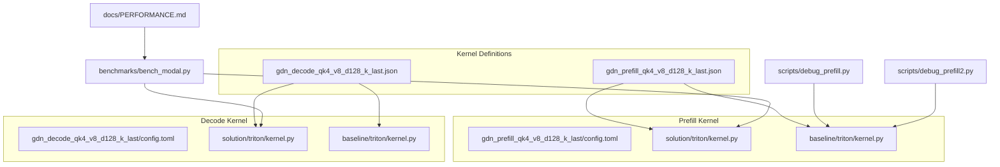
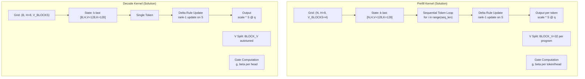
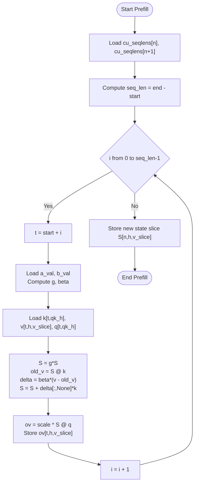
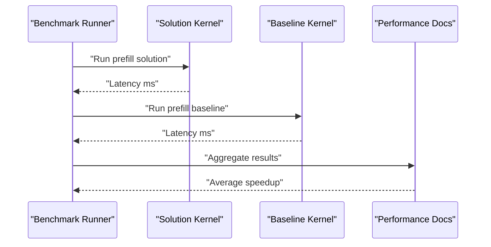
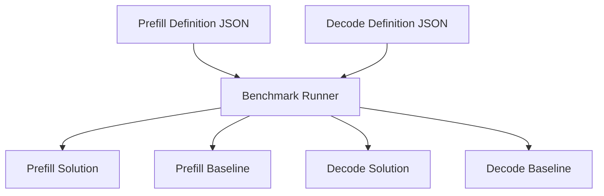

# GDN Prefill Kernel

<cite>
**Referenced Files in This Document**
- [gdn_prefill_qk4_v8_d128_k_last/config.toml](file://gdn_prefill_qk4_v8_d128_k_last/config.toml)
- [gdn_prefill_qk4_v8_d128_k_last/solution/triton/kernel.py](file://gdn_prefill_qk4_v8_d128_k_last/solution/triton/kernel.py)
- [gdn_prefill_qk4_v8_d128_k_last/baseline/triton/kernel.py](file://gdn_prefill_qk4_v8_d128_k_last/baseline/triton/kernel.py)
- [gdn_decode_qk4_v8_d128_k_last/solution/triton/kernel.py](file://gdn_decode_qk4_v8_d128_k_last/solution/triton/kernel.py)
- [gdn_decode_qk4_v8_d128_k_last/baseline/triton/kernel.py](file://gdn_decode_qk4_v8_d128_k_last/baseline/triton/kernel.py)
- [flashinfer_trace/definitions/gdn/gdn_prefill_qk4_v8_d128_k_last.json](file://flashinfer_trace/definitions/gdn/gdn_prefill_qk4_v8_d128_k_last.json)
- [flashinfer_trace/definitions/gdn/gdn_decode_qk4_v8_d128_k_last.json](file://flashinfer_trace/definitions/gdn/gdn_decode_qk4_v8_d128_k_last.json)
- [benchmarks/bench_modal.py](file://benchmarks/bench_modal.py)
- [docs/PERFORMANCE.md](file://docs/PERFORMANCE.md)
- [scripts/debug_prefill.py](file://scripts/debug_prefill.py)
- [scripts/debug_prefill2.py](file://scripts/debug_prefill2.py)
</cite>

## Table of Contents
1. [Introduction](#introduction)
2. [Project Structure](#project-structure)
3. [Core Components](#core-components)
4. [Architecture Overview](#architecture-overview)
5. [Detailed Component Analysis](#detailed-component-analysis)
6. [Dependency Analysis](#dependency-analysis)
7. [Performance Considerations](#performance-considerations)
8. [Troubleshooting Guide](#troubleshooting-guide)
9. [Conclusion](#conclusion)
10. [Appendices](#appendices)

## Introduction
This document provides a comprehensive technical and practical guide to the GDN Prefill Kernel implementation. It explains the mathematical formulation for batched sequence processing during initial token generation, contrasts it with the decode kernel’s single-token approach, documents the sequential token processing algorithm for variable-length sequences, and details the chunked processing strategy and memory bandwidth optimization for prefill phases. It also covers state management differences between prefill and decode operations, initialization strategies, and memory layout considerations. Finally, it presents concrete examples from the Triton kernel implementation, including loop unrolling techniques, memory access optimization for sequential tokens, and batch processing coordination, and compares the solution against the baseline to demonstrate throughput improvements.

## Project Structure
The repository organizes GDN kernels by stage (prefill/decode), with separate solution and baseline implementations per kernel. Each kernel directory contains:
- A configuration file specifying the solution metadata and build entry point.
- A solution Triton kernel implementation.
- A baseline Python reference implementation.
- A definition JSON describing inputs, outputs, and axes for the benchmarking framework.
- Scripts for packaging and benchmarking.

**Diagram sources**
- [gdn_prefill_qk4_v8_d128_k_last/config.toml:1-10](file://gdn_prefill_qk4_v8_d128_k_last/config.toml#L1-L10)
- [gdn_prefill_qk4_v8_d128_k_last/solution/triton/kernel.py:1-145](file://gdn_prefill_qk4_v8_d128_k_last/solution/triton/kernel.py#L1-L145)
- [gdn_prefill_qk4_v8_d128_k_last/baseline/triton/kernel.py:1-99](file://gdn_prefill_qk4_v8_d128_k_last/baseline/triton/kernel.py#L1-L99)
- [gdn_decode_qk4_v8_d128_k_last/config.toml:1-10](file://gdn_decode_qk4_v8_d128_k_last/config.toml#L1-L10)
- [gdn_decode_qk4_v8_d128_k_last/solution/triton/kernel.py:1-144](file://gdn_decode_qk4_v8_d128_k_last/solution/triton/kernel.py#L1-L144)
- [gdn_decode_qk4_v8_d128_k_last/baseline/triton/kernel.py:1-101](file://gdn_decode_qk4_v8_d128_k_last/baseline/triton/kernel.py#L1-L101)
- [flashinfer_trace/definitions/gdn/gdn_prefill_qk4_v8_d128_k_last.json:1-156](file://flashinfer_trace/definitions/gdn/gdn_prefill_qk4_v8_d128_k_last.json#L1-L156)
- [flashinfer_trace/definitions/gdn/gdn_decode_qk4_v8_d128_k_last.json:1-153](file://flashinfer_trace/definitions/gdn/gdn_decode_qk4_v8_d128_k_last.json#L1-L153)
- [benchmarks/bench_modal.py:1-308](file://benchmarks/bench_modal.py#L1-L308)
- [docs/PERFORMANCE.md:1-158](file://docs/PERFORMANCE.md#L1-L158)
- [scripts/debug_prefill.py:1-306](file://scripts/debug_prefill.py#L1-L306)
- [scripts/debug_prefill2.py:1-184](file://scripts/debug_prefill2.py#L1-L184)

**Section sources**
- [gdn_prefill_qk4_v8_d128_k_last/config.toml:1-10](file://gdn_prefill_qk4_v8_d128_k_last/config.toml#L1-L10)
- [gdn_decode_qk4_v8_d128_k_last/config.toml:1-10](file://gdn_decode_qk4_v8_d128_k_last/config.toml#L1-L10)
- [flashinfer_trace/definitions/gdn/gdn_prefill_qk4_v8_d128_k_last.json:1-156](file://flashinfer_trace/definitions/gdn/gdn_prefill_qk4_v8_d128_k_last.json#L1-L156)
- [flashinfer_trace/definitions/gdn/gdn_decode_qk4_v8_d128_k_last.json:1-153](file://flashinfer_trace/definitions/gdn/gdn_decode_qk4_v8_d128_k_last.json#L1-L153)

## Core Components
- Prefill kernel (solution): Triton JIT kernel implementing batched sequential token processing with V-dimension splitting across programs for improved occupancy and register pressure management.
- Prefill kernel (baseline): Python reference implementation performing the same GDN delta-rule update and output computation in a straightforward loop over sequences and tokens.
- Decode kernel (solution): Triton JIT kernel implementing single-token generation with autotuned tile sizes and V-dimension splitting for optimal performance.
- Decode kernel (baseline): Python reference implementation for correctness verification of single-token decode.
- Definition JSONs: Specify input/output shapes, dtypes, and axes for the benchmarking framework.
- Benchmarking harness: Runs solution and baseline kernels across workloads and reports performance metrics and correctness.

Key implementation highlights:
- Grouped Value Attention (GVA): num_q_heads=4, num_v_heads=8; qk_head = v_head // 2.
- State layout: k-last [N, H, V=128, K=128] for prefill; [B, H, V=128, K=128] for decode.
- Head size D=128; BLOCK_V=32; V_BLOCKS=D//BLOCK_V=4.
- Scale defaults to 1/sqrt(D) when not provided.

**Section sources**
- [gdn_prefill_qk4_v8_d128_k_last/solution/triton/kernel.py:1-145](file://gdn_prefill_qk4_v8_d128_k_last/solution/triton/kernel.py#L1-L145)
- [gdn_prefill_qk4_v8_d128_k_last/baseline/triton/kernel.py:1-99](file://gdn_prefill_qk4_v8_d128_k_last/baseline/triton/kernel.py#L1-L99)
- [gdn_decode_qk4_v8_d128_k_last/solution/triton/kernel.py:1-144](file://gdn_decode_qk4_v8_d128_k_last/solution/triton/kernel.py#L1-L144)
- [gdn_decode_qk4_v8_d128_k_last/baseline/triton/kernel.py:1-101](file://gdn_decode_qk4_v8_d128_k_last/baseline/triton/kernel.py#L1-L101)
- [flashinfer_trace/definitions/gdn/gdn_prefill_qk4_v8_d128_k_last.json:1-156](file://flashinfer_trace/definitions/gdn/gdn_prefill_qk4_v8_d128_k_last.json#L1-L156)
- [flashinfer_trace/definitions/gdn/gdn_decode_qk4_v8_d128_k_last.json:1-153](file://flashinfer_trace/definitions/gdn/gdn_decode_qk4_v8_d128_k_last.json#L1-L153)

## Architecture Overview
The GDN prefill kernel orchestrates batched sequential processing over variable-length sequences. The grid is partitioned by sequence, head, and V-tile, enabling independent processing of V-slices and efficient register usage. The decode kernel operates similarly but for single-token generation with autotuning for tile sizes.

**Diagram sources**
- [gdn_prefill_qk4_v8_d128_k_last/solution/triton/kernel.py:24-96](file://gdn_prefill_qk4_v8_d128_k_last/solution/triton/kernel.py#L24-L96)
- [gdn_decode_qk4_v8_d128_k_last/solution/triton/kernel.py:37-97](file://gdn_decode_qk4_v8_d128_k_last/solution/triton/kernel.py#L37-L97)

## Detailed Component Analysis

### Mathematical Formulation: Batched Prefill vs Decode
- Gates:
  - Decay gate: g = exp(-exp(A_log) * softplus(a + dt_bias))
  - Update gate: beta = sigmoid(b)
- State update (delta rule):
  - S ← g ⊙ S
  - old_v = k^T @ S
  - new_v = beta * v + (1 - beta) * old_v
  - S ← S + k^T ⊗ (new_v - old_v)
- Output:
  - o = scale * q^T @ S

Batched prefill processes multiple tokens sequentially per sequence, while decode processes a single token per head per batch. The prefill kernel splits the V dimension across programs to reduce register pressure and increase occupancy.

**Section sources**
- [gdn_prefill_qk4_v8_d128_k_last/solution/triton/kernel.py:65-96](file://gdn_prefill_qk4_v8_d128_k_last/solution/triton/kernel.py#L65-L96)
- [gdn_decode_qk4_v8_d128_k_last/solution/triton/kernel.py:61-97](file://gdn_decode_qk4_v8_d128_k_last/solution/triton/kernel.py#L61-L97)
- [gdn_prefill_qk4_v8_d128_k_last/baseline/triton/kernel.py:78-94](file://gdn_prefill_qk4_v8_d128_k_last/baseline/triton/kernel.py#L78-L94)
- [gdn_decode_qk4_v8_d128_k_last/baseline/triton/kernel.py:79-98](file://gdn_decode_qk4_v8_d128_k_last/baseline/triton/kernel.py#L79-L98)

### Sequential Token Processing Algorithm (Variable-Length Sequences)
The prefill kernel iterates over tokens within each sequence using cumulative sequence lengths. For each token:
- Loads per-token gates g and beta.
- Loads k, v, q slices aligned to the current head mapping.
- Applies the delta rule to update the state slice S.
- Computes output for the current token.

**Diagram sources**
- [gdn_prefill_qk4_v8_d128_k_last/solution/triton/kernel.py:47-96](file://gdn_prefill_qk4_v8_d128_k_last/solution/triton/kernel.py#L47-L96)

**Section sources**
- [gdn_prefill_qk4_v8_d128_k_last/solution/triton/kernel.py:47-96](file://gdn_prefill_qk4_v8_d128_k_last/solution/triton/kernel.py#L47-L96)

### Chunked Processing Strategy and Memory Bandwidth Optimization
- V-dimension tiling: BLOCK_V=32 splits the V dimension across 4 programs per sequence/head, reducing per-program register usage and increasing occupancy.
- State layout: k-last [N, H, V, K] enables coalesced access patterns for V-slices and efficient loading/storing of S slices.
- Sequential token loop minimizes redundant loads and recomputes gates per token, reducing instruction overhead.
- Memory access optimization:
  - Vectorized loads for 1D slices (di, vd) to maximize bandwidth utilization.
  - Coalesced stores for outputs and final state slices.
- Compared to decode, prefill benefits from higher arithmetic intensity due to multiple tokens processed per sequence, amortizing fixed costs.

**Section sources**
- [gdn_prefill_qk4_v8_d128_k_last/solution/triton/kernel.py:105-142](file://gdn_prefill_qk4_v8_d128_k_last/solution/triton/kernel.py#L105-L142)
- [docs/PERFORMANCE.md:145-158](file://docs/PERFORMANCE.md#L145-L158)

### State Management Differences: Prefill vs Decode
- Initialization:
  - Prefill: state can be provided as k-last [N, H, V, K]; if absent, initialized to zeros.
  - Decode: state can be provided as k-last [B, H, V, K]; if absent, initialized to zeros.
- Layout:
  - Both use k-last layout [*, H, V, K] internally for state.
- Final state:
  - Prefill: returns new_state [N, H, V, K] for each sequence.
  - Decode: returns new_state [B, H, V, K] for each batch item.
- Head mapping:
  - GVA: qk_h = h // 2; ensures 2 v-heads per qk-head.

**Section sources**
- [gdn_prefill_qk4_v8_d128_k_last/solution/triton/kernel.py:118-124](file://gdn_prefill_qk4_v8_d128_k_last/solution/triton/kernel.py#L118-L124)
- [gdn_decode_qk4_v8_d128_k_last/solution/triton/kernel.py:117-123](file://gdn_decode_qk4_v8_d128_k_last/solution/triton/kernel.py#L117-L123)
- [flashinfer_trace/definitions/gdn/gdn_prefill_qk4_v8_d128_k_last.json:79-89](file://flashinfer_trace/definitions/gdn/gdn_prefill_qk4_v8_d128_k_last.json#L79-L89)
- [flashinfer_trace/definitions/gdn/gdn_decode_qk4_v8_d128_k_last.json:80-90](file://flashinfer_trace/definitions/gdn/gdn_decode_qk4_v8_d128_k_last.json#L80-L90)

### Triton Implementation Details: Loop Unrolling and Memory Access
- Loop unrolling:
  - The sequential token loop is explicit and unrolled per-token; the kernel schedules multiple programs to handle V-slices independently, effectively unrolling across V-tiles.
- Memory access optimization:
  - Uses tl.arange for vectorized indices (di, vd) to enable coalesced reads/writes.
  - Loads k, v, q with stride-aware indexing aligned to head groups.
  - Stores outputs and final state slices with stride offsets.
- Grid configuration:
  - Prefill: (N, H=8, V_BLOCKS=4); BLOCK_V=32; num_warps=4.
  - Decode: autotunes BLOCK_V across {16,32,64,128} with num_warps={2,4,8}; num_stages=2.

**Section sources**
- [gdn_prefill_qk4_v8_d128_k_last/solution/triton/kernel.py:62-96](file://gdn_prefill_qk4_v8_d128_k_last/solution/triton/kernel.py#L62-L96)
- [gdn_decode_qk4_v8_d128_k_last/solution/triton/kernel.py:23-36](file://gdn_decode_qk4_v8_d128_k_last/solution/triton/kernel.py#L23-L36)
- [gdn_decode_qk4_v8_d128_k_last/solution/triton/kernel.py:105-141](file://gdn_decode_qk4_v8_d128_k_last/solution/triton/kernel.py#L105-L141)

### Relationship Between Q/K/V Dimensions and Sequence Length Handling
- Q/K/V shapes:
  - Q: [T, 4, 128], K: [T, 4, 128], V: [T, 8, 128] for prefill.
  - Q/K: [B, 1, 4, 128], V: [B, 1, 8, 128] for decode.
- Head mapping:
  - num_q_heads=4, num_v_heads=8; qk_h = h // 2.
- Sequence lengths:
  - cu_seqlens defines variable-length batches; the kernel computes t_start/t_end per sequence and iterates over tokens within bounds.

**Section sources**
- [flashinfer_trace/definitions/gdn/gdn_prefill_qk4_v8_d128_k_last.json:51-132](file://flashinfer_trace/definitions/gdn/gdn_prefill_qk4_v8_d128_k_last.json#L51-L132)
- [flashinfer_trace/definitions/gdn/gdn_decode_qk4_v8_d128_k_last.json:49-127](file://flashinfer_trace/definitions/gdn/gdn_decode_qk4_v8_d128_k_last.json#L49-L127)
- [gdn_prefill_qk4_v8_d128_k_last/solution/triton/kernel.py:47-50](file://gdn_prefill_qk4_v8_d128_k_last/solution/triton/kernel.py#L47-L50)

### Comparison Against Baseline: Throughput Improvements
- Benchmark harness runs both solution and baseline kernels across workloads and reports latency, reference latency, and speedup factors.
- Performance documentation shows significant speedups for prefill (average ~507x) and decode (average ~1215x) compared to the Python baseline.

**Diagram sources**
- [benchmarks/bench_modal.py:112-167](file://benchmarks/bench_modal.py#L112-L167)
- [docs/PERFORMANCE.md:31-48](file://docs/PERFORMANCE.md#L31-L48)

**Section sources**
- [benchmarks/bench_modal.py:202-239](file://benchmarks/bench_modal.py#L202-L239)
- [docs/PERFORMANCE.md:31-48](file://docs/PERFORMANCE.md#L31-L48)

## Dependency Analysis
The kernels depend on the benchmarking framework and definition JSONs for input/output specification and workload generation. The solution and baseline implementations are decoupled from each other and can be evaluated independently.

**Diagram sources**
- [flashinfer_trace/definitions/gdn/gdn_prefill_qk4_v8_d128_k_last.json:1-156](file://flashinfer_trace/definitions/gdn/gdn_prefill_qk4_v8_d128_k_last.json#L1-L156)
- [flashinfer_trace/definitions/gdn/gdn_decode_qk4_v8_d128_k_last.json:1-153](file://flashinfer_trace/definitions/gdn/gdn_decode_qk4_v8_d128_k_last.json#L1-L153)
- [benchmarks/bench_modal.py:1-308](file://benchmarks/bench_modal.py#L1-L308)

**Section sources**
- [benchmarks/bench_modal.py:1-308](file://benchmarks/bench_modal.py#L1-L308)
- [flashinfer_trace/definitions/gdn/gdn_prefill_qk4_v8_d128_k_last.json:1-156](file://flashinfer_trace/definitions/gdn/gdn_prefill_qk4_v8_d128_k_last.json#L1-L156)
- [flashinfer_trace/definitions/gdn/gdn_decode_qk4_v8_d128_k_last.json:1-153](file://flashinfer_trace/definitions/gdn/gdn_decode_qk4_v8_d128_k_last.json#L1-L153)

## Performance Considerations
- Register pressure: V-split with BLOCK_V=32 reduces per-program state from [128,128] to [32,128], improving occupancy.
- Arithmetic intensity: Prefill processes multiple tokens per sequence, increasing FLOPs relative to I/O.
- Memory bandwidth: k-last layout and vectorized loads/stores minimize memory stalls; autotuning in decode further optimizes tile sizes.
- Roofline analysis indicates effective bandwidth utilization (~2.06 TB/s) and room for further optimization via persistent kernels and tensor cores.

**Section sources**
- [docs/PERFORMANCE.md:145-158](file://docs/PERFORMANCE.md#L145-L158)

## Troubleshooting Guide
- Correctness verification:
  - Use debug scripts to compare solution outputs against the baseline reference implementation.
  - Scripts validate outputs and new_state tensors for numerical agreement.
- Benchmarking:
  - The benchmark runner aggregates latency and speedup metrics across workloads and prints average speedup.
  - Side-by-side comparison is available when both solution and baseline are executed.

**Section sources**
- [scripts/debug_prefill.py:159-166](file://scripts/debug_prefill.py#L159-L166)
- [scripts/debug_prefill2.py:159-178](file://scripts/debug_prefill2.py#L159-L178)
- [benchmarks/bench_modal.py:202-239](file://benchmarks/bench_modal.py#L202-L239)

## Conclusion
The GDN Prefill Kernel achieves substantial throughput improvements over the Python baseline by leveraging Triton’s parallelism, V-dimension splitting, and memory access optimizations. The kernel’s sequential token processing model efficiently handles variable-length sequences, while the state management remains consistent with the decode kernel. The benchmark results confirm significant speedups across diverse workloads, demonstrating the effectiveness of the design choices and implementation strategies.

## Appendices

### Appendix A: Triton Kernel Entry Points and Grid Configuration
- Prefill solution entry point: kernel function with grid (N, H=8, V_BLOCKS=4), BLOCK_V=32, num_warps=4.
- Decode solution entry point: kernel function with autotuned grid and BLOCK_V across {16,32,64,128}, num_warps={2,4,8}, num_stages=2.

**Section sources**
- [gdn_prefill_qk4_v8_d128_k_last/solution/triton/kernel.py:126-142](file://gdn_prefill_qk4_v8_d128_k_last/solution/triton/kernel.py#L126-L142)
- [gdn_decode_qk4_v8_d128_k_last/solution/triton/kernel.py:125-141](file://gdn_decode_qk4_v8_d128_k_last/solution/triton/kernel.py#L125-L141)

### Appendix B: Definition JSON Inputs/Outputs Summary
- Prefill inputs: q[T,4,128], k[T,4,128], v[T,8,128], state[N,8,128,128], A_log[8], a[T,8], dt_bias[8], b[T,8], cu_seqlens[num_seqs+1], scale.
- Prefill outputs: output[T,8,128], new_state[N,8,128,128].
- Decode inputs: q[B,1,4,128], k[B,1,4,128], v[B,1,8,128], state[B,8,128,128], A_log[8], a[B,1,8], dt_bias[8], b[B,1,8], scale.
- Decode outputs: output[B,1,8,128], new_state[B,8,128,128].

**Section sources**
- [flashinfer_trace/definitions/gdn/gdn_prefill_qk4_v8_d128_k_last.json:51-153](file://flashinfer_trace/definitions/gdn/gdn_prefill_qk4_v8_d128_k_last.json#L51-L153)
- [flashinfer_trace/definitions/gdn/gdn_decode_qk4_v8_d128_k_last.json:49-151](file://flashinfer_trace/definitions/gdn/gdn_decode_qk4_v8_d128_k_last.json#L49-L151)