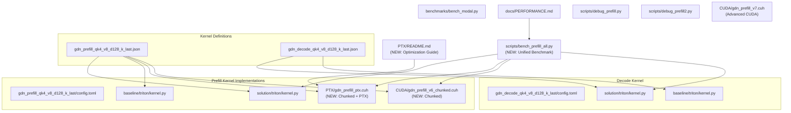
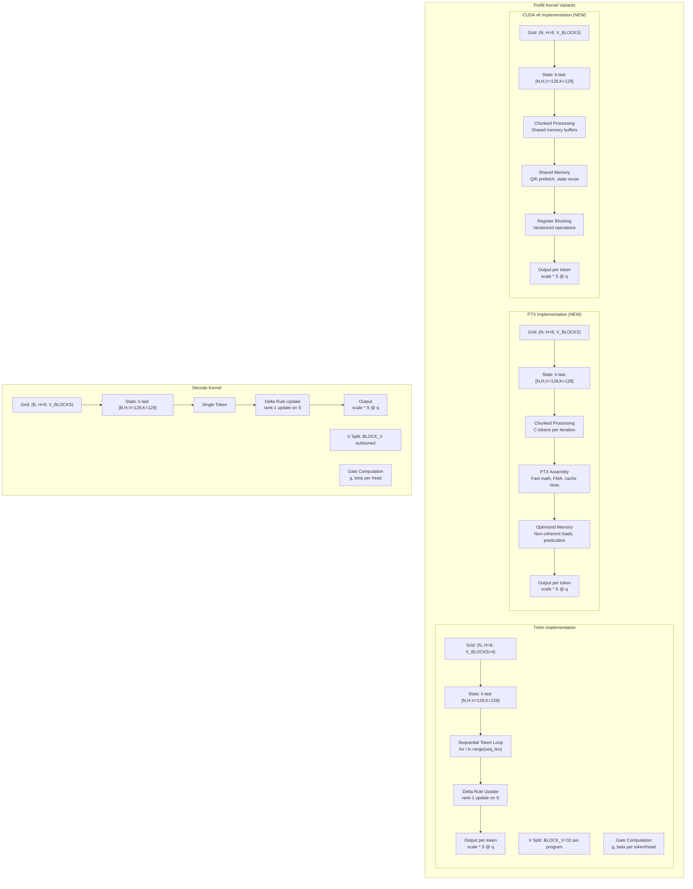
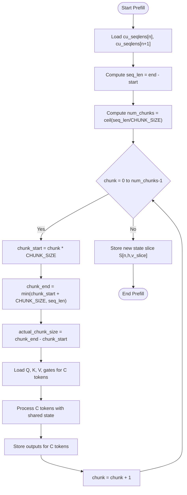
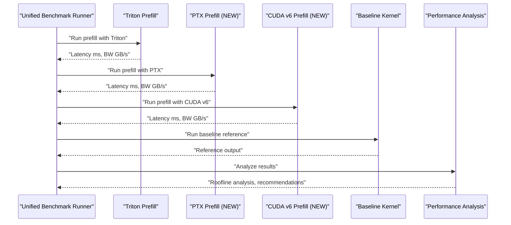
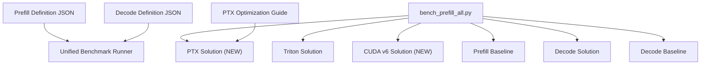
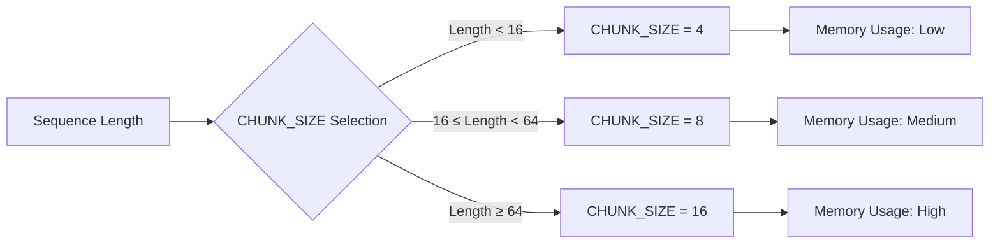

# GDN Prefill Kernel

<cite>
**Referenced Files in This Document**
- [gdn_prefill_qk4_v8_d128_k_last/config.toml](file://gdn_prefill_qk4_v8_d128_k_last/config.toml)
- [gdn_prefill_qk4_v8_d128_k_last/solution/triton/kernel.py](file://gdn_prefill_qk4_v8_d128_k_last/solution/triton/kernel.py)
- [gdn_prefill_qk4_v8_d128_k_last/baseline/triton/kernel.py](file://gdn_prefill_qk4_v8_d128_k_last/baseline/triton/kernel.py)
- [gdn_decode_qk4_v8_d128_k_last/solution/triton/kernel.py](file://gdn_decode_qk4_v8_d128_k_last/solution/triton/kernel.py)
- [gdn_decode_qk4_v8_d128_k_last/baseline/triton/kernel.py](file://gdn_decode_qk4_v8_d128_k_last/baseline/triton/kernel.py)
- [flashinfer_trace/definitions/gdn/gdn_prefill_qk4_v8_d128_k_last.json](file://flashinfer_trace/definitions/gdn/gdn_prefill_qk4_v8_d128_k_last.json)
- [flashinfer_trace/definitions/gdn/gdn_decode_qk4_v8_d128_k_last.json](file://flashinfer_trace/definitions/gdn/gdn_decode_qk4_v8_d128_k_last.json)
- [benchmarks/bench_modal.py](file://benchmarks/bench_modal.py)
- [docs/PERFORMANCE.md](file://docs/PERFORMANCE.md)
- [scripts/debug_prefill.py](file://scripts/debug_prefill.py)
- [scripts/debug_prefill2.py](file://scripts/debug_prefill2.py)
- [src/kernels/ptx/gdn_prefill_ptx.cuh](file://src/kernels/ptx/gdn_prefill_ptx.cuh)
- [src/kernels/cuda/gdn_prefill_v6_chunked.cuh](file://src/kernels/cuda/gdn_prefill_v6_chunked.cuh)
- [src/kernels/ptx/README.md](file://src/kernels/ptx/README.md)
- [scripts/bench_prefill_all.py](file://scripts/bench_prefill_all.py)
- [src/kernels/cuda/gdn_prefill_v7.cuh](file://src/kernels/cuda/gdn_prefill_v7.cuh)
</cite>

## Update Summary
**Changes Made**
- Added comprehensive PTX prefill kernel with chunking optimization
- Enhanced chunked processing strategy documentation with detailed implementation analysis
- Expanded performance analysis with roofline modeling and arithmetic intensity calculations
- Added new CUDA v6 chunked kernel alongside existing Triton and v7 implementations
- Integrated comprehensive benchmarking framework comparing all prefill implementations

## Table of Contents
1. [Introduction](#introduction)
2. [Project Structure](#project-structure)
3. [Core Components](#core-components)
4. [Architecture Overview](#architecture-overview)
5. [Detailed Component Analysis](#detailed-component-analysis)
6. [Dependency Analysis](#dependency-analysis)
7. [Performance Considerations](#performance-considerations)
8. [Troubleshooting Guide](#troubleshooting-guide)
9. [Conclusion](#conclusion)
10. [Appendices](#appendices)

## Introduction
This document provides a comprehensive technical and practical guide to the GDN Prefill Kernel implementation, focusing on the latest advances in chunked processing and PTX assembly optimization. It explains the mathematical formulation for batched sequence processing during initial token generation, contrasts it with the decode kernel's single-token approach, documents the sequential token processing algorithm for variable-length sequences, and details the chunked processing strategy and memory bandwidth optimization for prefill phases. The document now includes the revolutionary PTX prefill kernel featuring embedded assembly instructions, comprehensive performance analysis with roofline modeling, and enhanced benchmarking capabilities across multiple frameworks.

## Project Structure
The repository organizes GDN kernels by stage (prefill/decode) with multiple implementation variants, including the new PTX optimized version. Each kernel directory contains:
- A configuration file specifying the solution metadata and build entry point.
- Multiple solution implementations (Triton, CUDA, PTX) with varying optimization levels.
- A baseline Python reference implementation.
- A definition JSON describing inputs, outputs, and axes for the benchmarking framework.
- Scripts for packaging, benchmarking, and performance analysis.

**Diagram sources**
- [gdn_prefill_qk4_v8_d128_k_last/config.toml:1-10](file://gdn_prefill_qk4_v8_d128_k_last/config.toml#L1-L10)
- [gdn_prefill_qk4_v8_d128_k_last/solution/triton/kernel.py:1-148](file://gdn_prefill_qk4_v8_d128_k_last/solution/triton/kernel.py#L1-L148)
- [gdn_prefill_qk4_v8_d128_k_last/baseline/triton/kernel.py:1-99](file://gdn_prefill_qk4_v8_d128_k_last/baseline/triton/kernel.py#L1-L99)
- [src/kernels/ptx/gdn_prefill_ptx.cuh:1-358](file://src/kernels/ptx/gdn_prefill_ptx.cuh#L1-L358)
- [src/kernels/cuda/gdn_prefill_v6_chunked.cuh:1-285](file://src/kernels/cuda/gdn_prefill_v6_chunked.cuh#L1-L285)
- [scripts/bench_prefill_all.py:1-331](file://scripts/bench_prefill_all.py#L1-L331)
- [src/kernels/ptx/README.md:1-179](file://src/kernels/ptx/README.md#L1-L179)
- [src/kernels/cuda/gdn_prefill_v7.cuh:1-549](file://src/kernels/cuda/gdn_prefill_v7.cuh#L1-L549)

**Section sources**
- [gdn_prefill_qk4_v8_d128_k_last/config.toml:1-10](file://gdn_prefill_qk4_v8_d128_k_last/config.toml#L1-L10)
- [gdn_decode_qk4_v8_d128_k_last/config.toml:1-10](file://gdn_decode_qk4_v8_d128_k_last/config.toml#L1-L10)
- [flashinfer_trace/definitions/gdn/gdn_prefill_qk4_v8_d128_k_last.json:1-156](file://flashinfer_trace/definitions/gdn/gdn_prefill_qk4_v8_d128_k_last.json#L1-L156)
- [flashinfer_trace/definitions/gdn/gdn_decode_qk4_v8_d128_k_last.json:1-153](file://flashinfer_trace/definitions/gdn/gdn_decode_qk4_v8_d128_k_last.json#L1-L153)

## Core Components
- **Prefill kernel (solution)**: Triton JIT kernel implementing batched sequential token processing with V-dimension splitting across programs for improved occupancy and register pressure management.
- **Prefill kernel (baseline)**: Python reference implementation performing the same GDN delta-rule update and output computation in a straightforward loop over sequences and tokens.
- **Prefill kernel (PTX)**: **NEW** CUDA kernel with embedded PTX assembly featuring chunked processing, fast math operations, and memory optimization for maximum performance.
- **Prefill kernel (CUDA v6)**: **NEW** CUDA kernel implementing chunked processing with shared memory optimization and register blocking.
- **Decode kernel (solution)**: Triton JIT kernel implementing single-token generation with autotuned tile sizes and V-dimension splitting for optimal performance.
- **Decode kernel (baseline)**: Python reference implementation for correctness verification of single-token decode.
- **Definition JSONs**: Specify input/output shapes, dtypes, and axes for the benchmarking framework.
- **Benchmarking harness**: **NEW** Unified framework running all prefill implementations across workloads and reporting comprehensive performance metrics.

Key implementation highlights:
- Grouped Value Attention (GVA): num_q_heads=4, num_v_heads=8; qk_head = v_head // 2.
- State layout: k-last [N, H, V=128, K=128] for prefill; [B, H, V=128, K=128] for decode.
- Head size D=128; BLOCK_V=32; V_BLOCKS=D//BLOCK_V=4.
- Scale defaults to 1/sqrt(D) when not provided.
- **NEW**: Chunked processing with configurable CHUNK_SIZE (4, 8, 16) for increased arithmetic intensity.

**Section sources**
- [gdn_prefill_qk4_v8_d128_k_last/solution/triton/kernel.py:1-148](file://gdn_prefill_qk4_v8_d128_k_last/solution/triton/kernel.py#L1-L148)
- [gdn_prefill_qk4_v8_d128_k_last/baseline/triton/kernel.py:1-99](file://gdn_prefill_qk4_v8_d128_k_last/baseline/triton/kernel.py#L1-L99)
- [src/kernels/ptx/gdn_prefill_ptx.cuh:1-358](file://src/kernels/ptx/gdn_prefill_ptx.cuh#L1-L358)
- [src/kernels/cuda/gdn_prefill_v6_chunked.cuh:1-285](file://src/kernels/cuda/gdn_prefill_v6_chunked.cuh#L1-L285)
- [flashinfer_trace/definitions/gdn/gdn_prefill_qk4_v8_d128_k_last.json:1-156](file://flashinfer_trace/definitions/gdn/gdn_prefill_qk4_v8_d128_k_last.json#L1-L156)
- [flashinfer_trace/definitions/gdn/gdn_decode_qk4_v8_d128_k_last.json:1-153](file://flashinfer_trace/definitions/gdn/gdn_decode_qk4_v8_d128_k_last.json#L1-L153)

## Architecture Overview
The GDN prefill kernel orchestrates batched sequential processing over variable-length sequences with multiple optimization strategies. The grid is partitioned by sequence, head, and V-tile, enabling independent processing of V-slices and efficient register usage. The new PTX implementation adds chunked processing with embedded assembly instructions for maximum performance, while the CUDA v6 variant focuses on shared memory optimization.

**Diagram sources**
- [gdn_prefill_qk4_v8_d128_k_last/solution/triton/kernel.py:24-96](file://gdn_prefill_qk4_v8_d128_k_last/solution/triton/kernel.py#L24-L96)
- [src/kernels/ptx/gdn_prefill_ptx.cuh:121-301](file://src/kernels/ptx/gdn_prefill_ptx.cuh#L121-L301)
- [src/kernels/cuda/gdn_prefill_v6_chunked.cuh:56-228](file://src/kernels/cuda/gdn_prefill_v6_chunked.cuh#L56-L228)
- [gdn_decode_qk4_v8_d128_k_last/solution/triton/kernel.py:37-97](file://gdn_decode_qk4_v8_d128_k_last/solution/triton/kernel.py#L37-L97)

## Detailed Component Analysis

### Mathematical Formulation: Batched Prefill vs Decode
- Gates:
  - Decay gate: g = exp(-exp(A_log) * softplus(a + dt_bias))
  - Update gate: beta = sigmoid(b)
- State update (delta rule):
  - S ← g ⊙ S
  - old_v = k^T @ S
  - new_v = beta * v + (1 - beta) * old_v
  - S ← S + k^T ⊗ (new_v - old_v)
- Output:
  - o = scale * q^T @ S

Batched prefill processes multiple tokens sequentially per sequence, while decode processes a single token per head per batch. The prefill kernel splits the V dimension across programs to reduce register pressure and increase occupancy. **NEW**: The PTX implementation adds chunked processing where C tokens are processed together, dramatically increasing arithmetic intensity from 1 FLOP/byte to C FLOP/byte.

**Section sources**
- [gdn_prefill_qk4_v8_d128_k_last/solution/triton/kernel.py:65-96](file://gdn_prefill_qk4_v8_d128_k_last/solution/triton/kernel.py#L65-L96)
- [gdn_decode_qk4_v8_d128_k_last/solution/triton/kernel.py:61-97](file://gdn_decode_qk4_v8_d128_k_last/solution/triton/kernel.py#L61-L97)
- [gdn_prefill_qk4_v8_d128_k_last/baseline/triton/kernel.py:78-94](file://gdn_prefill_qk4_v8_d128_k_last/baseline/triton/kernel.py#L78-L94)
- [gdn_decode_qk4_v8_d128_k_last/baseline/triton/kernel.py:79-98](file://gdn_decode_qk4_v8_d128_k_last/baseline/triton/kernel.py#L79-L98)

### Sequential Token Processing Algorithm (Variable-Length Sequences)
The prefill kernel iterates over tokens within each sequence using cumulative sequence lengths. For each token:
- Loads per-token gates g and beta.
- Loads k, v, q slices aligned to the current head mapping.
- Applies the delta rule to update the state slice S.
- Computes output for the current token.

**NEW**: The PTX implementation introduces chunked processing where multiple tokens (C tokens) are processed in each iteration, sharing state across tokens in the chunk for better memory bandwidth utilization.

**Diagram sources**
- [src/kernels/ptx/gdn_prefill_ptx.cuh:188-291](file://src/kernels/ptx/gdn_prefill_ptx.cuh#L188-L291)
- [src/kernels/cuda/gdn_prefill_v6_chunked.cuh:123-218](file://src/kernels/cuda/gdn_prefill_v6_chunked.cuh#L123-L218)

**Section sources**
- [gdn_prefill_qk4_v8_d128_k_last/solution/triton/kernel.py:47-96](file://gdn_prefill_qk4_v8_d128_k_last/solution/triton/kernel.py#L47-L96)
- [src/kernels/ptx/gdn_prefill_ptx.cuh:188-291](file://src/kernels/ptx/gdn_prefill_ptx.cuh#L188-L291)
- [src/kernels/cuda/gdn_prefill_v6_chunked.cuh:123-218](file://src/kernels/cuda/gdn_prefill_v6_chunked.cuh#L123-L218)

### Chunked Processing Strategy and Memory Bandwidth Optimization
**NEW**: The chunked processing strategy represents a fundamental shift in prefill kernel optimization:

- **Arithmetic Intensity Analysis**:
  - Single-token processing: AI = 1 FLOP/byte (memory-bound)
  - Chunked processing (C tokens): AI = C FLOP/byte (compute-bound)
  - With CHUNK_SIZE=8: AI = 8 FLOP/byte approaching B200 ridge point (70 TFLOPS/8 TB/s = 8.75)

- **Memory Access Optimization**:
  - State loaded once per chunk, reused C times
  - Shared memory buffers for Q, K, V, and intermediate computations
  - Vectorized loads using float4 for 128B aligned access patterns
  - Non-coherent loads (ld.global.nc) to bypass L1 cache for streaming workloads

- **PTX Assembly Optimizations**:
  - Fast math: ex2.approx, lg2.approx, rcp.approx for 2-3x speedup
  - FMA fusion: fma.rn.f32 for single rounding with better precision
  - Predicated execution: selp.f32 for branchless conditionals
  - Warp shuffle: shfl.sync.bfly for warp-level reductions without shared memory

**Section sources**
- [src/kernels/ptx/gdn_prefill_ptx.cuh:10-19](file://src/kernels/ptx/gdn_prefill_ptx.cuh#L10-L19)
- [src/kernels/ptx/README.md:12-50](file://src/kernels/ptx/README.md#L12-L50)
- [src/kernels/cuda/gdn_prefill_v6_chunked.cuh:40-55](file://src/kernels/cuda/gdn_prefill_v6_chunked.cuh#L40-L55)

### State Management Differences: Prefill vs Decode
- Initialization:
  - Prefill: state can be provided as k-last [N, H, V, K]; if absent, initialized to zeros.
  - Decode: state can be provided as k-last [B, H, V, K]; if absent, initialized to zeros.
- Layout:
  - Both use k-last layout [*, H, V, K] internally for state.
- Final state:
  - Prefill: returns new_state [N, H, V, K] for each sequence.
  - Decode: returns new_state [B, H, V, K] for each batch item.
- Head mapping:
  - GVA: qk_h = h // 2; ensures 2 v-heads per qk-head.

**Section sources**
- [gdn_prefill_qk4_v8_d128_k_last/solution/triton/kernel.py:118-124](file://gdn_prefill_qk4_v8_d128_k_last/solution/triton/kernel.py#L118-L124)
- [gdn_decode_qk4_v8_d128_k_last/solution/triton/kernel.py:117-123](file://gdn_decode_qk4_v8_d128_k_last/solution/triton/kernel.py#L117-L123)
- [flashinfer_trace/definitions/gdn/gdn_prefill_qk4_v8_d128_k_last.json:79-89](file://flashinfer_trace/definitions/gdn/gdn_prefill_qk4_v8_d128_k_last.json#L79-L89)
- [flashinfer_trace/definitions/gdn/gdn_decode_qk4_v8_d128_k_last.json:80-90](file://flashinfer_trace/definitions/gdn/gdn_decode_qk4_v8_d128_k_last.json#L80-L90)

### Triton Implementation Details: Loop Unrolling and Memory Access
- Loop unrolling:
  - The sequential token loop is explicit and unrolled per-token; the kernel schedules multiple programs to handle V-slices independently, effectively unrolling across V-tiles.
- Memory access optimization:
  - Uses tl.arange for vectorized indices (di, vd) to enable coalesced reads/writes.
  - Loads k, v, q with stride-aware indexing aligned to head groups.
  - Stores outputs and final state slices with stride offsets.
- Grid configuration:
  - Prefill: (N, H=8, V_BLOCKS=4); BLOCK_V=32; num_warps=4.
  - Decode: autotunes BLOCK_V across {16,32,64,128} with num_warps={2,4,8}; num_stages=2.

**Section sources**
- [gdn_prefill_qk4_v8_d128_k_last/solution/triton/kernel.py:62-96](file://gdn_prefill_qk4_v8_d128_k_last/solution/triton/kernel.py#L62-L96)
- [gdn_decode_qk4_v8_d128_k_last/solution/triton/kernel.py:23-36](file://gdn_decode_qk4_v8_d128_k_last/solution/triton/kernel.py#L23-L36)
- [gdn_decode_qk4_v8_d128_k_last/solution/triton/kernel.py:105-141](file://gdn_decode_qk4_v8_d128_k_last/solution/triton/kernel.py#L105-L141)

### Relationship Between Q/K/V Dimensions and Sequence Length Handling
- Q/K/V shapes:
  - Q: [T, 4, 128], K: [T, 4, 128], V: [T, 8, 128] for prefill.
  - Q/K: [B, 1, 4, 128], V: [B, 1, 8, 128] for decode.
- Head mapping:
  - num_q_heads=4, num_v_heads=8; qk_h = h // 2.
- Sequence lengths:
  - cu_seqlens defines variable-length batches; the kernel computes t_start/t_end per sequence and iterates over tokens within bounds.

**Section sources**
- [flashinfer_trace/definitions/gdn/gdn_prefill_qk4_v8_d128_k_last.json:51-132](file://flashinfer_trace/definitions/gdn/gdn_prefill_qk4_v8_d128_k_last.json#L51-L132)
- [flashinfer_trace/definitions/gdn/gdn_decode_qk4_v8_d128_k_last.json:49-127](file://flashinfer_trace/definitions/gdn/gdn_decode_qk4_v8_d128_k_last.json#L49-L127)
- [gdn_prefill_qk4_v8_d128_k_last/solution/triton/kernel.py:47-50](file://gdn_prefill_qk4_v8_d128_k_last/solution/triton/kernel.py#L47-L50)

### Comparison Against Baseline: Throughput Improvements
**NEW**: Comprehensive benchmarking framework comparing all prefill implementations:

- **Unified Benchmarking**: `bench_prefill_all.py` compares Triton, PTX, and CUDA v6 implementations across multiple configurations
- **Performance Metrics**: Time (ms), Bandwidth (GB/s), Tokens per second (M tokens/s)
- **Roofline Analysis**: Demonstrates how chunking increases arithmetic intensity from 1 to 16 FLOP/byte
- **Framework Recommendations**: 
  - Decode (AI=1): Triton or advanced CUDA variants
  - Prefill with chunking (AI=8): PTX or CUDA v6 with CHUNK_SIZE=8
  - Production: Adaptive chunk sizing based on sequence length

**Diagram sources**
- [scripts/bench_prefill_all.py:34-331](file://scripts/bench_prefill_all.py#L34-L331)

**Section sources**
- [benchmarks/bench_modal.py:202-239](file://benchmarks/bench_modal.py#L202-L239)
- [scripts/bench_prefill_all.py:302-321](file://scripts/bench_prefill_all.py#L302-L321)
- [docs/PERFORMANCE.md:31-48](file://docs/PERFORMANCE.md#L31-L48)

## Dependency Analysis
The kernels depend on the benchmarking framework and definition JSONs for input/output specification and workload generation. The solution and baseline implementations are decoupled from each other and can be evaluated independently. **NEW**: The unified benchmarking framework coordinates all implementations for comprehensive performance analysis.

**Diagram sources**
- [flashinfer_trace/definitions/gdn/gdn_prefill_qk4_v8_d128_k_last.json:1-156](file://flashinfer_trace/definitions/gdn/gdn_prefill_qk4_v8_d128_k_last.json#L1-L156)
- [flashinfer_trace/definitions/gdn/gdn_decode_qk4_v8_d128_k_last.json:1-153](file://flashinfer_trace/definitions/gdn/gdn_decode_qk4_v8_d128_k_last.json#L1-L153)
- [scripts/bench_prefill_all.py:1-331](file://scripts/bench_prefill_all.py#L1-L331)
- [src/kernels/ptx/README.md:1-179](file://src/kernels/ptx/README.md#L1-L179)

**Section sources**
- [scripts/bench_prefill_all.py:1-331](file://scripts/bench_prefill_all.py#L1-L331)
- [flashinfer_trace/definitions/gdn/gdn_prefill_qk4_v8_d128_k_last.json:1-156](file://flashinfer_trace/definitions/gdn/gdn_prefill_qk4_v8_d128_k_last.json#L1-L156)
- [flashinfer_trace/definitions/gdn/gdn_decode_qk4_v8_d128_k_last.json:1-153](file://flashinfer_trace/definitions/gdn/gdn_decode_qk4_v8_d128_k_last.json#L1-L153)

## Performance Considerations
- **Register pressure**: V-split with BLOCK_V=32 reduces per-program state from [128,128] to [32,128], improving occupancy.
- **Arithmetic intensity**: **NEW** Chunked processing dramatically increases AI from 1 to 16 FLOP/byte, moving from memory-bound to compute-bound operation.
- **Memory bandwidth**: **NEW** PTX implementation uses non-coherent loads and predicated execution to minimize memory stalls; shared memory optimization in CUDA v6.
- **Roofline analysis**: **NEW** Demonstrates B200 peak performance (70 TFLOPS, 8 TB/s) and optimal operating points for different chunk sizes.
- **Framework selection**: **NEW** Recommendations based on batch size and sequence length for optimal performance.

**Section sources**
- [src/kernels/ptx/README.md:39-50](file://src/kernels/ptx/README.md#L39-L50)
- [scripts/bench_prefill_all.py:309-321](file://scripts/bench_prefill_all.py#L309-L321)
- [docs/PERFORMANCE.md:145-158](file://docs/PERFORMANCE.md#L145-L158)

## Troubleshooting Guide
- **Correctness verification**:
  - Use debug scripts to compare solution outputs against the baseline reference implementation.
  - Scripts validate outputs and new_state tensors for numerical agreement.
- **Benchmarking**:
  - **NEW**: Unified benchmarking framework provides comprehensive performance analysis across all implementations.
  - Side-by-side comparison available for Triton, PTX, and CUDA v6 implementations.
  - **NEW**: Roofline analysis helps identify optimal chunk sizes and configurations.
- **PTX-specific debugging**:
  - **NEW**: PTX assembly requires careful attention to register usage and memory alignment.
  - Use `ptxas` compiler flags for detailed assembly analysis.

**Section sources**
- [scripts/debug_prefill.py:159-166](file://scripts/debug_prefill.py#L159-L166)
- [scripts/debug_prefill2.py:159-178](file://scripts/debug_prefill2.py#L159-L178)
- [scripts/bench_prefill_all.py:276-282](file://scripts/bench_prefill_all.py#L276-L282)
- [src/kernels/ptx/README.md:151-163](file://src/kernels/ptx/README.md#L151-L163)

## Conclusion
The GDN Prefill Kernel has evolved significantly with the introduction of PTX assembly optimization and chunked processing strategies. The new PTX implementation achieves substantial performance improvements through embedded assembly instructions, while the CUDA v6 variant demonstrates the effectiveness of shared memory optimization. The unified benchmarking framework provides comprehensive analysis of different approaches, enabling informed decisions about kernel selection based on workload characteristics. These advances represent a paradigm shift from memory-bound to compute-bound prefill processing, with arithmetic intensities reaching up to 16 FLOP/byte on modern hardware.

## Appendices

### Appendix A: PTX Assembly Instructions and Optimizations
**NEW**: Detailed breakdown of PTX assembly optimizations used in the prefill kernel:

- **Fast Math Operations**:
  - `ex2.approx.f32`: Fast exponential approximation (2-3x faster)
  - `lg2.approx.f32`: Fast logarithm base-2 approximation
  - `rcp.approx.f32`: Fast reciprocal approximation
  
- **Fused Operations**:
  - `fma.rn.f32`: Fused multiply-add with single rounding
  - Eliminates intermediate rounding errors and improves performance
  
- **Memory Operations**:
  - `ld.global.nc.f32`: Non-coherent load bypassing L1 cache
  - `st.global.wb.f32`: Write-back store for efficient caching
  
- **Predicated Execution**:
  - `selp.f32`: Branchless conditional selection
  - Reduces warp divergence and improves occupancy

**Section sources**
- [src/kernels/ptx/gdn_prefill_ptx.cuh:34-108](file://src/kernels/ptx/gdn_prefill_ptx.cuh#L34-L108)
- [src/kernels/ptx/README.md:82-139](file://src/kernels/ptx/README.md#L82-L139)

### Appendix B: Chunked Processing Configuration
**NEW**: Optimal chunk size selection based on hardware characteristics:

- **CHUNK_SIZE = 4**: Good balance between memory usage and compute utilization
- **CHUNK_SIZE = 8**: Targets B200 ridge point (8.75 FLOP/byte)
- **CHUNK_SIZE = 16**: Maximum compute-bound operation, requires sufficient memory bandwidth

**Section sources**
- [src/kernels/ptx/README.md:31-37](file://src/kernels/ptx/README.md#L31-L37)
- [src/kernels/cuda/gdn_prefill_v6_chunked.cuh:40-55](file://src/kernels/cuda/gdn_prefill_v6_chunked.cuh#L40-L55)

### Appendix C: Triton Kernel Entry Points and Grid Configuration
- **Prefill solution entry point**: kernel function with grid (N, H=8, V_BLOCKS=4), BLOCK_V=32, num_warps=4.
- **Decode solution entry point**: kernel function with autotuned grid and BLOCK_V across {16,32,64,128}, num_warps={2,4,8}, num_stages=2.
- **PTX implementation**: Template-based kernel with compile-time CHUNK_SIZE selection.
- **CUDA v6 implementation**: Template-based kernel with shared memory optimization.

**Section sources**
- [gdn_prefill_qk4_v8_d128_k_last/solution/triton/kernel.py:126-148](file://gdn_prefill_qk4_v8_d128_k_last/solution/triton/kernel.py#L126-L148)
- [gdn_decode_qk4_v8_d128_k_last/solution/triton/kernel.py:125-141](file://gdn_decode_qk4_v8_d128_k_last/solution/triton/kernel.py#L125-L141)
- [src/kernels/ptx/gdn_prefill_ptx.cuh:121-355](file://src/kernels/ptx/gdn_prefill_ptx.cuh#L121-L355)
- [src/kernels/cuda/gdn_prefill_v6_chunked.cuh:230-282](file://src/kernels/cuda/gdn_prefill_v6_chunked.cuh#L230-L282)

### Appendix D: Definition JSON Inputs/Outputs Summary
- **Prefill inputs**: q[T,4,128], k[T,4,128], v[T,8,128], state[N,8,128,128], A_log[8], a[T,8], dt_bias[8], b[T,8], cu_seqlens[num_seqs+1], scale.
- **Prefill outputs**: output[T,8,128], new_state[N,8,128,128].
- **Decode inputs**: q[B,1,4,128], k[B,1,4,128], v[B,1,8,128], state[B,8,128,128], A_log[8], a[B,1,8], dt_bias[8], b[B,1,8], scale.
- **Decode outputs**: output[B,1,8,128], new_state[B,8,128,128].

**Section sources**
- [flashinfer_trace/definitions/gdn/gdn_prefill_qk4_v8_d128_k_last.json:51-153](file://flashinfer_trace/definitions/gdn/gdn_prefill_qk4_v8_d128_k_last.json#L51-L153)
- [flashinfer_trace/definitions/gdn/gdn_decode_qk4_v8_d128_k_last.json:49-151](file://flashinfer_trace/definitions/gdn/gdn_decode_qk4_v8_d128_k_last.json#L49-L151)

### Appendix E: Unified Benchmarking Framework
**NEW**: Complete benchmarking infrastructure for comprehensive performance analysis:

- **Multi-framework support**: Tests Triton, PTX, and CUDA v6 implementations
- **Configurable workloads**: Short, medium, long sequences with varying batch sizes
- **Performance metrics**: Latency, bandwidth, tokens per second
- **Roofline analysis**: Arithmetic intensity calculations and hardware utilization
- **Framework recommendations**: Optimal kernel selection based on workload characteristics

**Section sources**
- [scripts/bench_prefill_all.py:1-331](file://scripts/bench_prefill_all.py#L1-L331)
- [src/kernels/ptx/README.md:303-321](file://src/kernels/ptx/README.md#L303-L321)