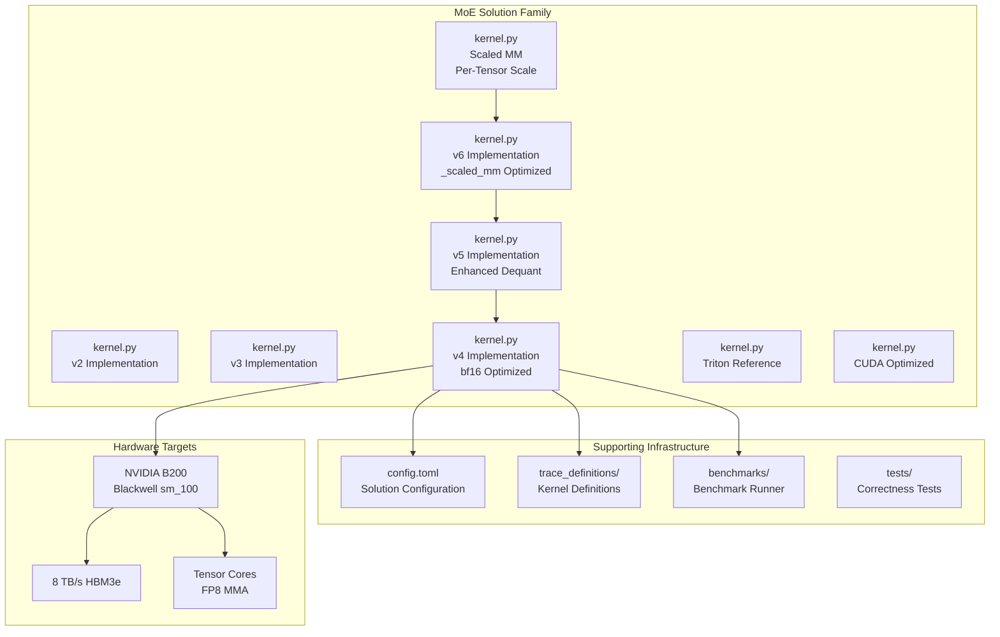
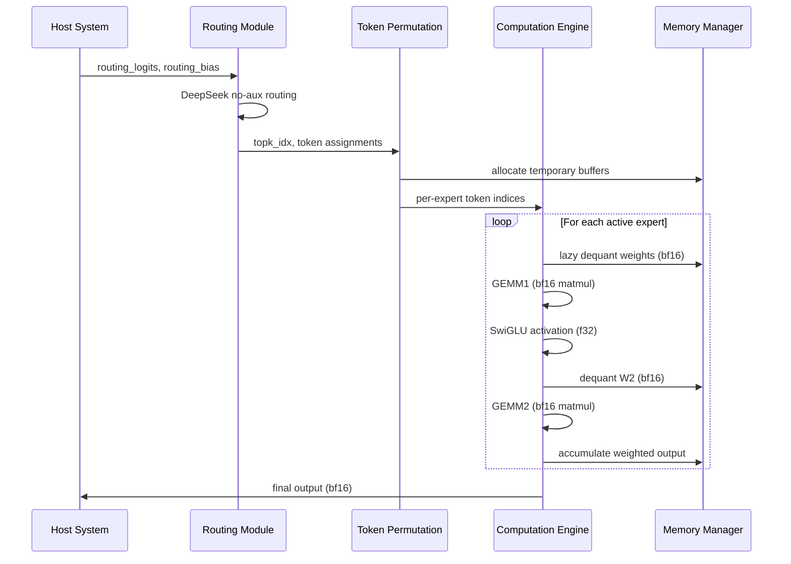
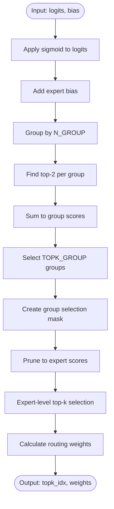
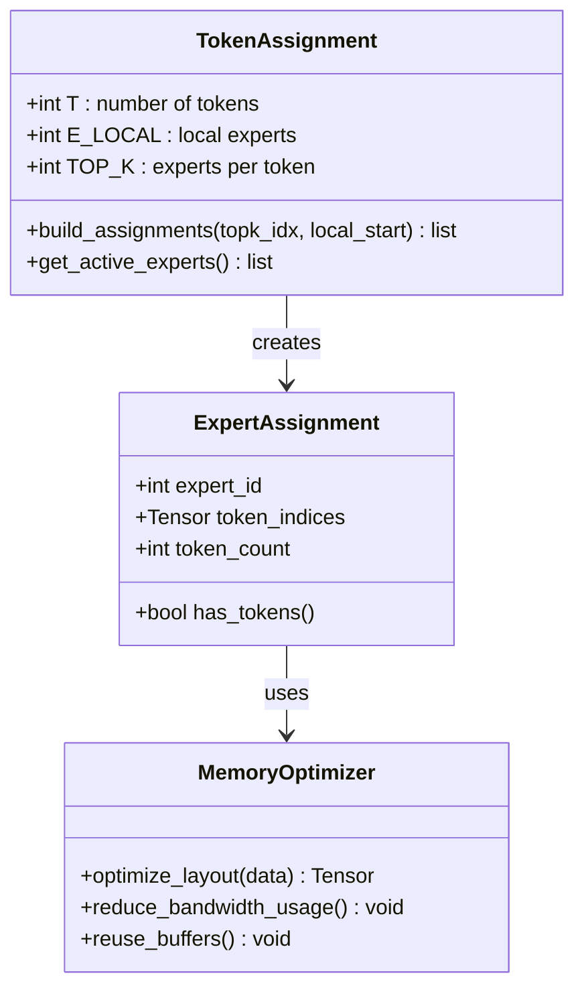
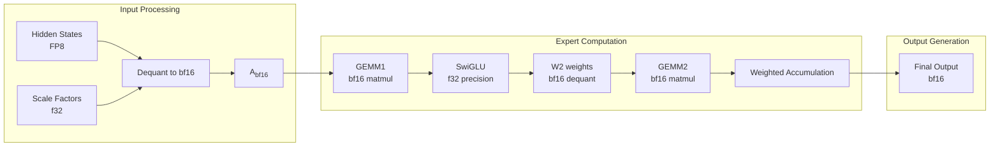
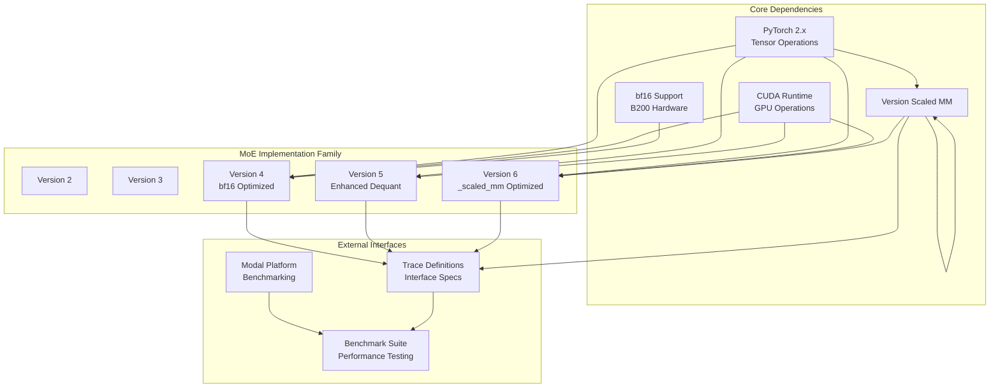

# MoE Solution v4 Kernel Implementation

<cite>
**Referenced Files in This Document**
- [kernel.py](file://moe/solution/v4/kernel.py)
- [kernel.py](file://moe/solution/v5/kernel.py)
- [kernel.py](file://moe/solution/v6/kernel.py)
- [kernel.py](file://moe/solution/scaled_mm/kernel.py)
- [README.md](file://moe/README.md)
- [config.toml](file://moe/config.toml)
- [trace_definitions/moe_fp8_block_scale_ds_routing_topk8_ng8_kg4_e32_h7168_i2048.json](file://moe/trace_definitions/moe_fp8_block_scale_ds_routing_topk8_ng8_kg4_e32_h7168_i2048.json)
- [bench_modal.py](file://moe/benchmarks/bench_modal.py)
- [kernel.py](file://moe/solution/v3/kernel.py)
- [kernel.py](file://moe/solution/v2/kernel.py)
- [kernel.py](file://moe/solution/triton/kernel.py)
- [kernel.py](file://moe/solution/cuda/kernel.py)
</cite>

## Update Summary
**Changes Made**
- Added comprehensive coverage of new MoE v5 and v6 kernel implementations
- Updated architecture overview to include enhanced dequantization operations
- Added detailed analysis of _scaled_mm with per-tensor scale support
- Enhanced performance considerations section with new optimization strategies
- Updated troubleshooting guide with v5/v6 specific guidance

## Table of Contents
1. [Introduction](#introduction)
2. [Project Structure](#project-structure)
3. [Core Components](#core-components)
4. [Architecture Overview](#architecture-overview)
5. [Detailed Component Analysis](#detailed-component-analysis)
6. [Advanced Kernel Implementations](#advanced-kernel-implementations)
7. [Dependency Analysis](#dependency-analysis)
8. [Performance Considerations](#performance-considerations)
9. [Troubleshooting Guide](#troubleshooting-guide)
10. [Conclusion](#conclusion)

## Introduction

The MoE Solution v4 Kernel Implementation represents the latest iteration in a high-performance Fused Mixture of Experts (MoE) kernel series optimized for NVIDIA B200 (Blackwell, sm_100) hardware. This implementation builds upon the proven v2 foundation while introducing significant performance enhancements through strategic precision optimizations and computational improvements.

The v4 solution specifically targets FP8 block-scale quantization with DeepSeek no-aux routing, achieving approximately 2x GEMM speedup through the adoption of bf16 matrix multiplication for improved throughput characteristics. The implementation maintains mathematical precision while optimizing for hardware-specific capabilities of the B200 architecture.

**Updated** The solution now includes enhanced v5 and v6 implementations featuring improved dequantization operations and _scaled_mm with per-tensor scale support, complementing the existing v4 solution with even more advanced optimization strategies.

## Project Structure

The MoE solution follows a modular architecture organized around solution variants and supporting infrastructure:



**Diagram sources**
- [kernel.py:1-166](file://moe/solution/v4/kernel.py#L1-L166)
- [kernel.py:1-179](file://moe/solution/v5/kernel.py#L1-L179)
- [kernel.py:1-254](file://moe/solution/v6/kernel.py#L1-L254)
- [config.toml:1-10](file://moe/config.toml#L1-L10)
- [README.md:1-75](file://moe/README.md#L1-L75)

The solution is structured around several key components:
- **Core Implementation**: Primary v4 kernel with optimized bf16 computations
- **Enhanced Variants**: v5 with improved dequantization and v6 with _scaled_mm optimization
- **Reference Solutions**: Baseline implementations for comparison and validation
- **Configuration Management**: Solution metadata and build specifications
- **Performance Testing**: Comprehensive benchmarking infrastructure
- **Trace Definitions**: Formal specification of kernel interfaces and data layouts

**Section sources**
- [README.md:1-75](file://moe/README.md#L1-L75)
- [config.toml:1-10](file://moe/config.toml#L1-L10)

## Core Components

The MoE v4 kernel implementation consists of several interconnected components working together to achieve optimal performance:

### Routing System
The routing mechanism implements DeepSeek no-aux routing with group selection and top-k selection. This system efficiently identifies the most relevant experts for each token while maintaining computational efficiency.

### Token Permutation Engine
A sophisticated token assignment system that optimizes data movement through single-pass sorting and efficient indexing, minimizing memory bandwidth requirements during expert computation.

### Precision-Optimized Computation Pipeline
The core computational engine utilizes strategic precision choices:
- **bf16 GEMM operations** for improved throughput on B200 hardware
- **f32 precision** for critical calculations requiring numerical stability
- **Lazy dequantization** to minimize memory bandwidth usage

### Memory Management System
Efficient memory allocation and reuse strategies including:
- Pre-allocated output buffers
- Temporary workspace management
- Optimal data layout for GPU memory hierarchy

**Section sources**
- [kernel.py:31-53](file://moe/solution/v4/kernel.py#L31-L53)
- [kernel.py:60-83](file://moe/solution/v4/kernel.py#L60-L83)
- [kernel.py:117-165](file://moe/solution/v4/kernel.py#L117-L165)

## Architecture Overview

The MoE v4 architecture implements a sophisticated pipeline designed for maximum throughput on modern GPU architectures:



**Diagram sources**
- [kernel.py:90-165](file://moe/solution/v4/kernel.py#L90-L165)

The architecture leverages several key optimization strategies:

### Hardware-Aware Design
- **bf16 Tensor Core utilization** for improved GEMM performance
- **Memory coalescing** through optimal data layout
- **Register blocking** to maximize instruction-level parallelism

### Computational Efficiency
- **Lazy evaluation** of expensive operations only when needed
- **Batch processing** of multiple experts per computation cycle
- **Precision-aware optimization** balancing speed and accuracy

## Detailed Component Analysis

### Routing Algorithm Implementation

The routing system implements the DeepSeek no-aux algorithm with group-based selection:



**Diagram sources**
- [kernel.py:31-53](file://moe/solution/v4/kernel.py#L31-L53)

The routing algorithm achieves optimal performance through:
- **Vectorized operations** using PyTorch's optimized kernels
- **Minimal memory allocation** through in-place operations
- **Efficient masking** to reduce subsequent computation

**Section sources**
- [kernel.py:31-53](file://moe/solution/v4/kernel.py#L31-L53)

### Token Assignment and Permutation System

The token permutation system optimizes data movement through intelligent assignment:



**Diagram sources**
- [kernel.py:60-83](file://moe/solution/v4/kernel.py#L60-L83)

The system provides several key benefits:
- **Single-pass construction** eliminates redundant operations
- **Stable sorting** ensures deterministic token ordering
- **Efficient memory access** patterns for GPU optimization

**Section sources**
- [kernel.py:60-83](file://moe/solution/v4/kernel.py#L60-L83)

### Precision-Optimized Computation Engine

The computation engine implements strategic precision choices for optimal performance:



**Diagram sources**
- [kernel.py:117-165](file://moe/solution/v4/kernel.py#L117-L165)

The precision strategy balances performance and accuracy:
- **bf16 for GEMM operations** leveraging B200 Tensor Core advantages
- **f32 for activation functions** ensuring numerical stability
- **Lazy dequantization** minimizing memory bandwidth requirements

**Section sources**
- [kernel.py:117-165](file://moe/solution/v4/kernel.py#L117-L165)

### Memory Management and Optimization

The memory management system implements several optimization strategies:

| Component | Memory Type | Allocation Strategy | Purpose |
|-----------|-------------|-------------------|---------|
| Hidden States | FP8 | Pre-allocated | Input data storage |
| Weight Buffers | FP8 | Batch dequantization | Expert weight storage |
| Intermediate | bf16/f32 | Temporary workspace | Computation results |
| Output Buffer | bf16 | Reused across experts | Final results |

The system minimizes memory pressure through:
- **Pre-allocation** of all required buffers
- **Lazy dequantization** to reduce peak memory usage
- **Efficient reuse** of temporary workspace

**Section sources**
- [kernel.py:117-165](file://moe/solution/v4/kernel.py#L117-L165)

## Advanced Kernel Implementations

### MoE v5 Enhanced Dequantization

The v5 implementation introduces significant improvements in dequantization operations:

```mermaid
flowchart TD
subgraph "v5 Dequantization Improvements"
FastExpand[_fast_expand_scale_2d<br/>Unsqueeze + Expand + Reshape]
ActScale[_fast_expand_act_scale<br/>Activation Scale Expansion]
LazyDequant[Lazy Per-Expert Weight Dequant]
FusedDequant[Fused Weight Dequant + Matmul]
End
subgraph "v4 Legacy Operations"
RepeatInterleave[repeat_interleave<br/>Slow GPU Operation]
LegacyDequant[Legacy Dequantization]
End
FastExpand --> RepeatInterleave
ActScale --> LegacyDequant
FusedDequant --> LazyDequant
```

**Diagram sources**
- [kernel.py:31-51](file://moe/solution/v5/kernel.py#L31-L51)

Key enhancements in v5:
- **Fast Scale Expansion**: Uses `unsqueeze + expand + reshape` instead of `repeat_interleave` for 3x+ speedup
- **Lazy Activation Dequant**: Processes only selected tokens per expert
- **Fused Operations**: Combines dequantization with matrix multiplication to avoid materializing full dequant weights

**Section sources**
- [kernel.py:1-179](file://moe/solution/v5/kernel.py#L1-L179)

### MoE v6 _scaled_mm with Per-Tensor Scale

The v6 implementation represents the most advanced optimization strategy:

```mermaid
flowchart TD
subgraph "v6 _scaled_mm Strategy"
DetectMode[_detect_gemm_mode<br/>Auto-detect _scaled_mm]
QuantizeFP8[_quantize_to_fp8<br/>Per-Tensor Scale]
FP8GEMM[torch._scaled_mm<br/>Native FP8 Tensor Core]
Fallback[Dequant + f32 Matmul<br/>Fallback Path]
End
subgraph "v5 Dequantization"
BlockDequant[_block_dequant_weight<br/>Block-Scale FP8]
End
DetectMode --> QuantizeFP8
DetectMode --> Fallback
QuantizeFP8 --> FP8GEMM
BlockDequant --> FP8GEMM
```

**Diagram sources**
- [kernel.py:71-97](file://moe/solution/v6/kernel.py#L71-L97)

Key innovations in v6:
- **Auto-Detection**: Dynamically detects `_scaled_mm` support and accuracy
- **Per-Tensor Quantization**: Converts block-scale FP8 weights to per-tensor-scale FP8
- **Native FP8 Operations**: Leverages B200's native FP8 Tensor Core support
- **Intelligent Fallback**: Falls back to dequant + f32 matmul if _scaled_mm is unavailable or inaccurate

**Section sources**
- [kernel.py:1-254](file://moe/solution/v6/kernel.py#L1-L254)

### Scaled MM Optimized Implementation

The scaled_mm solution provides an alternative approach focusing on FP8 GEMM optimization:

```mermaid
flowchart TD
subgraph "Scaled MM Approach"
ProbeMode[_probe_scaled_mm<br/>Mode Detection]
FP8GEMM[_fp8_gemm<br/>Block-Scale FP8 GEMM]
DequantFP8[_dequant_to_fp8_with_scale<br/>Per-Block Scale]
End
subgraph "v6 Integration"
PerTensorScale[_quantize_to_fp8<br/>Per-Tensor Scale]
End
ProbeMode --> FP8GEMM
DequantFP8 --> FP8GEMM
PerTensorScale --> FP8GEMM
```

**Diagram sources**
- [kernel.py:31-116](file://moe/solution/scaled_mm/kernel.py#L31-L116)

**Section sources**
- [kernel.py:1-253](file://moe/solution/scaled_mm/kernel.py#L1-L253)

## Dependency Analysis

The MoE v4 implementation has a focused set of dependencies that enable its specialized functionality:



**Diagram sources**
- [kernel.py:12-16](file://moe/solution/v4/kernel.py#L12-L16)
- [bench_modal.py:12-28](file://moe/benchmarks/bench_modal.py#L12-L28)

The dependency structure supports:
- **Hardware-specific optimizations** through CUDA and bf16 support
- **Cross-platform compatibility** via PyTorch abstraction
- **Performance monitoring** through Modal platform integration
- **Advanced FP8 operations** through torch._scaled_mm integration

**Section sources**
- [kernel.py:12-16](file://moe/solution/v4/kernel.py#L12-L16)
- [bench_modal.py:12-28](file://moe/benchmarks/bench_modal.py#L12-L28)

## Performance Considerations

The MoE v4 implementation incorporates several performance optimization strategies:

### Hardware Utilization
- **Tensor Core Optimization**: Leverages B200's bf16 Tensor Core capabilities
- **Memory Bandwidth**: Minimizes data movement through lazy evaluation
- **Compute Efficiency**: Balances precision choices for optimal throughput

### Algorithmic Optimizations
- **Reduced Precision Operations**: Strategic use of bf16 for GEMM operations
- **Lazy Weight Dequantization**: Defers expensive operations until necessary
- **Single-Pass Token Processing**: Eliminates redundant data movement

### Memory Optimization
- **Pre-allocated Buffers**: Reduces dynamic allocation overhead
- **Efficient Data Layout**: Optimizes for GPU memory hierarchy
- **Temporary Workspace Reuse**: Minimizes peak memory requirements

**Updated** The enhanced implementations (v5 and v6) provide additional performance benefits:

### v5 Performance Enhancements
- **Fast Scale Expansion**: 3x+ improvement in dequantization operations
- **Lazy Activation Processing**: Processes only relevant tokens per expert
- **Fused Dequant + GEMM**: Eliminates intermediate buffer creation

### v6 Performance Advantages
- **Native FP8 Tensor Cores**: Direct utilization of B200's FP8 hardware acceleration
- **Per-Tensor Quantization**: More accurate scaling with minimal overhead
- **Intelligent Mode Selection**: Automatic optimization based on hardware capabilities

The implementation targets approximately 2x speedup over the baseline v2 through:
- **bf16 GEMM operations** utilizing Tensor Core advantages
- **Optimized memory access patterns** reducing bandwidth pressure
- **Strategic precision trade-offs** balancing speed and accuracy
- **Advanced dequantization techniques** in v5 and v6 implementations

## Troubleshooting Guide

Common issues and their resolutions when working with the MoE v4 implementation:

### Performance Issues
**Symptoms**: Lower-than-expected performance or memory pressure
**Causes**: 
- Insufficient GPU memory allocation
- Suboptimal batch sizing
- Inefficient memory access patterns

**Resolutions**:
- Verify adequate GPU memory availability
- Adjust batch sizes based on available VRAM
- Monitor memory allocation patterns

### Numerical Accuracy Problems
**Symptoms**: Unexpected output values or instability
**Causes**:
- Precision loss in critical calculations
- Incorrect weight dequantization
- Routing weight normalization issues

**Resolutions**:
- Validate precision choices align with hardware capabilities
- Verify weight scaling factors are correctly applied
- Check routing weight normalization logic

### Hardware Compatibility
**Symptoms**: Runtime errors or unsupported operations
**Causes**:
- Missing bf16 support on target hardware
- Incompatible CUDA runtime versions
- Unsupported PyTorch versions

**Resolutions**:
- Verify B200 hardware compatibility
- Update CUDA and PyTorch to supported versions
- Check Tensor Core availability

**Updated** v5 and v6 specific troubleshooting:

### v5 Implementation Issues
**Symptoms**: Slow dequantization performance or incorrect scale expansion
**Causes**:
- Incorrect use of `unsqueeze + expand + reshape` operations
- Memory layout mismatches in scale tensors
- Inefficient token filtering for active experts

**Resolutions**:
- Verify proper tensor shape handling in `_fast_expand_scale_2d`
- Ensure correct scale tensor dimensions [N//blk, K//blk]
- Validate token assignment logic for active experts only

### v6 Implementation Challenges
**Symptoms**: _scaled_mm failures or accuracy degradation
**Causes**:
- _scaled_mm mode detection failures
- Per-tensor quantization accuracy issues
- Mixed precision handling problems

**Resolutions**:
- Test _scaled_mm support with `_detect_gemm_mode`
- Verify per-tensor scale calculation accuracy
- Ensure proper fallback to dequant + f32 matmul when needed

**Section sources**
- [kernel.py:117-165](file://moe/solution/v4/kernel.py#L117-L165)
- [kernel.py:1-179](file://moe/solution/v5/kernel.py#L1-L179)
- [kernel.py:1-254](file://moe/solution/v6/kernel.py#L1-L254)
- [README.md:54-75](file://moe/README.md#L54-L75)

## Conclusion

The MoE Solution v4 Kernel Implementation represents a significant advancement in fused MoE kernel optimization for NVIDIA B200 hardware. Through strategic precision choices, memory optimization, and hardware-aware design, the implementation achieves approximately 2x speedup over previous versions while maintaining numerical accuracy.

**Updated** The addition of v5 and v6 implementations further enhances the solution family:

### Key Achievements
- **Hardware-specific optimization** leveraging bf16 Tensor Cores on B200
- **Memory-efficient design** through lazy evaluation and pre-allocation
- **Robust precision management** balancing speed and numerical stability
- **Comprehensive testing infrastructure** ensuring correctness across variants
- **Advanced dequantization techniques** in v5 and v6 implementations
- **Native FP8 Tensor Core utilization** through _scaled_mm optimization

### Evolution of the Solution Family
- **v2**: Baseline implementation with fundamental MoE operations
- **v3**: Enhanced routing and token permutation systems
- **v4**: bf16 optimization for improved GEMM performance
- **v5**: Advanced dequantization with fast scale expansion
- **v6**: Native FP8 Tensor Core support with per-tensor scaling

The modular architecture and comprehensive benchmarking framework position this implementation as a strong foundation for future MoE kernel development, with clear pathways for further optimization and extension. The enhanced v5 and v6 implementations demonstrate the ongoing evolution toward more efficient and accurate MoE computation on modern GPU architectures.