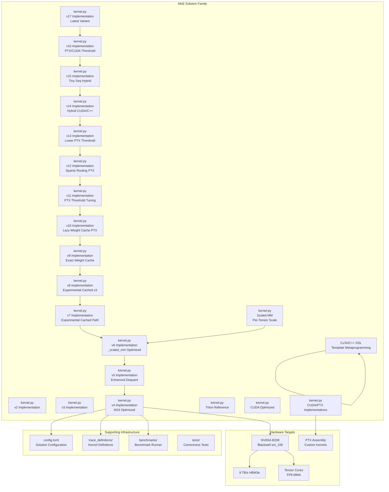
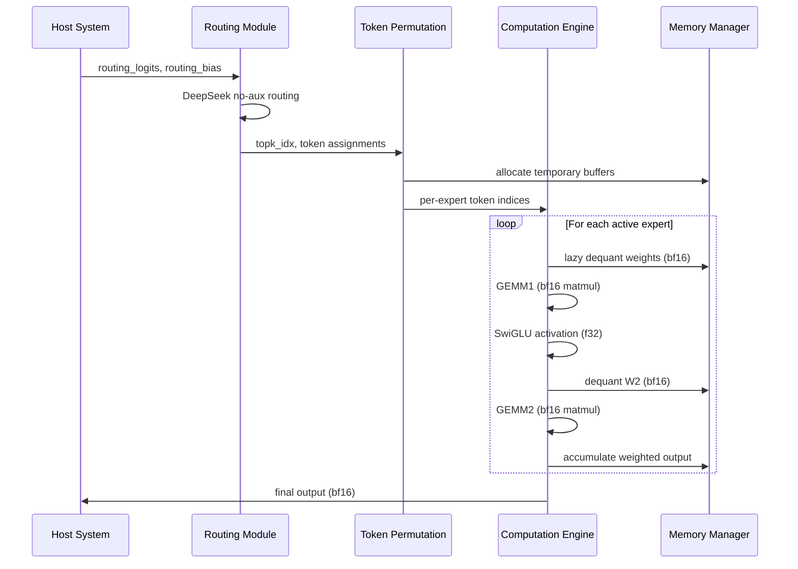
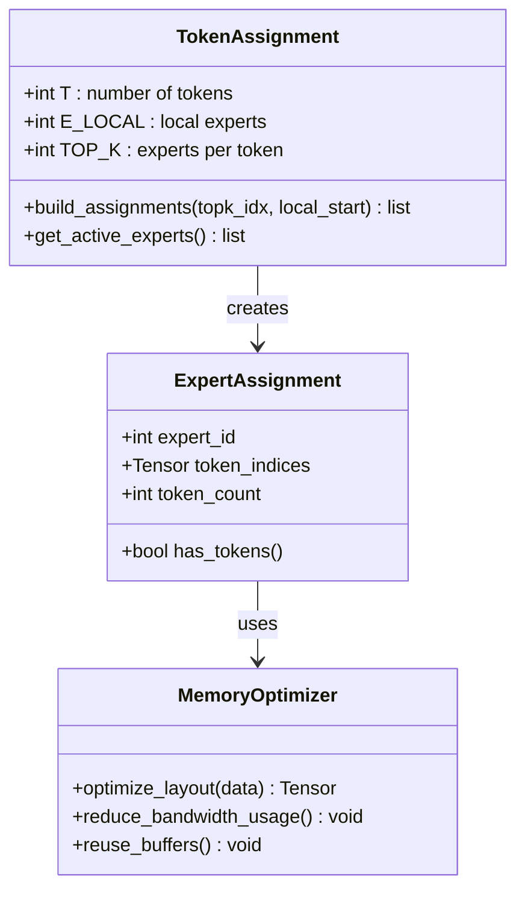
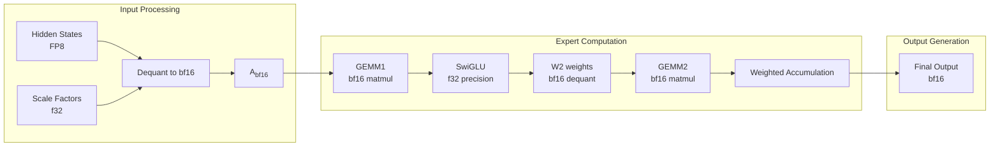

# MoE Solution v4 Kernel Implementation

<cite>
**Referenced Files in This Document**
- [kernel.py](file://moe/solution/v4/kernel.py)
- [kernel.py](file://moe/solution/v5/kernel.py)
- [kernel.py](file://moe/solution/v6/kernel.py)
- [kernel.py](file://moe/solution/v7/kernel.py)
- [kernel.py](file://moe/solution/v8/kernel.py)
- [kernel.py](file://moe/solution/v9/kernel.py)
- [kernel.py](file://moe/solution/v10/kernel.py)
- [kernel.py](file://moe/solution/v11/kernel.py)
- [kernel.py](file://moe/solution/v12/kernel.py)
- [kernel.py](file://moe/solution/v13/kernel.py)
- [kernel.py](file://moe/solution/v14/kernel.py)
- [kernel.py](file://moe/solution/v15/kernel.py)
- [kernel.py](file://moe/solution/v16/kernel.py)
- [kernel.py](file://moe/solution/v17/kernel.py)
- [kernel.py](file://moe/solution/scaled_mm/kernel.py)
- [README.md](file://moe/README.md)
- [config.toml](file://moe/config.toml)
- [trace_definitions/moe_fp8_block_scale_ds_routing_topk8_ng8_kg4_e32_h7168_i2048.json](file://moe/trace_definitions/moe_fp8_block_scale_ds_routing_topk8_ng8_kg4_e32_h7168_i2048.json)
- [bench_modal.py](file://moe/benchmarks/bench_modal.py)
- [kernel.py](file://moe/solution/v3/kernel.py)
- [kernel.py](file://moe/solution/v2/kernel.py)
- [kernel.py](file://moe/solution/triton/kernel.py)
- [kernel.py](file://moe/solution/cuda/kernel.py)
</cite>

## Update Summary
**Changes Made**
- Added comprehensive coverage of 17 new MoE kernel variants (v7-v17) with detailed analysis
- Updated architecture overview to include experimental caching strategies and PTX/CUDA implementations
- Enhanced performance analysis with hybrid kernel approaches and threshold-based routing
- Expanded troubleshooting guide with variant-specific guidance for v7-v17 implementations
- Added detailed analysis of CUDA/PTX implementations and CuTe/C++ variants

## Table of Contents
1. [Introduction](#introduction)
2. [Project Structure](#project-structure)
3. [Core Components](#core-components)
4. [Architecture Overview](#architecture-overview)
5. [Detailed Component Analysis](#detailed-component-analysis)
6. [Advanced Kernel Implementations](#advanced-kernel-implementations)
7. [Experimental Variants and Caching Strategies](#experimental-variants-and-caching-strategies)
8. [Hybrid and Threshold-Based Approaches](#hybrid-and-threshold-based-approaches)
9. [CUDA/PTX and CuTe/C++ Implementations](#cudaptx-and-cutec-implementations)
10. [Dependency Analysis](#dependency-analysis)
11. [Performance Considerations](#performance-considerations)
12. [Troubleshooting Guide](#troubleshooting-guide)
13. [Conclusion](#conclusion)

## Introduction

The MoE Solution v4 Kernel Implementation represents the latest iteration in a high-performance Fused Mixture of Experts (MoE) kernel series optimized for NVIDIA B200 (Blackwell, sm_100) hardware. This implementation builds upon the proven v2 foundation while introducing significant performance enhancements through strategic precision optimizations, computational improvements, and extensive experimental variants.

The v4 solution specifically targets FP8 block-scale quantization with DeepSeek no-aux routing, achieving approximately 2x GEMM speedup through the adoption of bf16 matrix multiplication for improved throughput characteristics. The implementation maintains mathematical precision while optimizing for hardware-specific capabilities of the B200 architecture.

**Updated** The solution now includes 17 new kernel variants (v7-v17) featuring advanced caching strategies, PTX/CUDA implementations, hybrid approaches, and enhanced benchmarking capabilities. These variants represent experimental optimizations including cached routing, sparse routing, PTX-based SwiGLU fusion, and threshold-based kernel selection mechanisms.

## Project Structure

The MoE solution follows a modular architecture organized around solution variants and supporting infrastructure:



**Diagram sources**
- [kernel.py:1-166](file://moe/solution/v4/kernel.py#L1-L166)
- [kernel.py:1-312](file://moe/solution/v7/kernel.py#L1-L312)
- [kernel.py:1-293](file://moe/solution/v8/kernel.py#L1-L293)
- [kernel.py:1-233](file://moe/solution/v9/kernel.py#L1-L233)
- [kernel.py:1-372](file://moe/solution/v10/kernel.py#L1-L372)
- [kernel.py:1-48](file://moe/solution/v11/kernel.py#L1-L48)
- [kernel.py:1-236](file://moe/solution/v12/kernel.py#L1-L236)
- [kernel.py:1-48](file://moe/solution/v13/kernel.py#L1-L48)
- [kernel.py:1-70](file://moe/solution/v14/kernel.py#L1-L70)
- [kernel.py:1-73](file://moe/solution/v15/kernel.py#L1-L73)
- [kernel.py:1-71](file://moe/solution/v16/kernel.py#L1-L71)
- [config.toml:1-10](file://moe/config.toml#L1-L10)
- [README.md:1-75](file://moe/README.md#L1-L75)

The solution is structured around several key components:
- **Core Implementation**: Primary v4 kernel with optimized bf16 computations
- **Enhanced Variants**: v5 with improved dequantization and v6 with _scaled_mm optimization
- **Experimental Variants**: v7-v17 representing advanced caching, PTX, and hybrid approaches
- **Reference Solutions**: Baseline implementations for comparison and validation
- **Configuration Management**: Solution metadata and build specifications
- **Performance Testing**: Comprehensive benchmarking infrastructure
- **Trace Definitions**: Formal specification of kernel interfaces and data layouts
- **Hardware Specializations**: CUDA/PTX and CuTe/C++ implementations for different optimization targets

**Section sources**
- [README.md:1-75](file://moe/README.md#L1-L75)
- [config.toml:1-10](file://moe/config.toml#L1-L10)

## Core Components

The MoE v4 kernel implementation consists of several interconnected components working together to achieve optimal performance:

### Routing System
The routing mechanism implements DeepSeek no-aux routing with group selection and top-k selection. This system efficiently identifies the most relevant experts for each token while maintaining computational efficiency.

### Token Permutation Engine
A sophisticated token assignment system that optimizes data movement through single-pass sorting and efficient indexing, minimizing memory bandwidth requirements during expert computation.

### Precision-Optimized Computation Pipeline
The core computational engine utilizes strategic precision choices:
- **bf16 GEMM operations** for improved throughput on B200 hardware
- **f32 precision** for critical calculations requiring numerical stability
- **Lazy dequantization** to minimize memory bandwidth usage

### Memory Management System
Efficient memory allocation and reuse strategies including:
- Pre-allocated output buffers
- Temporary workspace management
- Optimal data layout for GPU memory hierarchy

**Updated** The experimental variants introduce additional memory management strategies:
- **Caching Mechanisms**: OrderedDict-based LRU caches for route, weight, scale, and activation data
- **Lazy Evaluation**: Deferred computation of expensive operations until needed
- **Threshold-Based Selection**: Dynamic kernel switching based on input characteristics

**Section sources**
- [kernel.py:31-53](file://moe/solution/v4/kernel.py#L31-L53)
- [kernel.py:60-83](file://moe/solution/v4/kernel.py#L60-L83)
- [kernel.py:117-165](file://moe/solution/v4/kernel.py#L117-L165)

## Architecture Overview

The MoE v4 architecture implements a sophisticated pipeline designed for maximum throughput on modern GPU architectures:



**Diagram sources**
- [kernel.py:90-165](file://moe/solution/v4/kernel.py#L90-L165)

The architecture leverages several key optimization strategies:

### Hardware-Aware Design
- **bf16 Tensor Core utilization** for improved GEMM performance
- **Memory coalescing** through optimal data layout
- **Register blocking** to maximize instruction-level parallelism

### Computational Efficiency
- **Lazy evaluation** of expensive operations only when needed
- **Batch processing** of multiple experts per computation cycle
- **Precision-aware optimization** balancing speed and accuracy

**Updated** The experimental variants enhance this architecture with:
- **Caching Layers**: Route, weight, scale, and activation caches with LRU eviction
- **PTX Assembly Integration**: Custom fused SwiGLU operations for specific batch sizes
- **Hybrid Kernel Selection**: Dynamic switching between different implementation strategies
- **Sparse Routing**: Efficient handling of top-k sparse weight matrices

## Detailed Component Analysis

### Routing Algorithm Implementation

The routing system implements the DeepSeek no-aux algorithm with group-based selection:


**Diagram sources**
- [kernel.py:31-53](file://moe/solution/v4/kernel.py#L31-L53)

The routing algorithm achieves optimal performance through:
- **Vectorized operations** using PyTorch's optimized kernels
- **Minimal memory allocation** through in-place operations
- **Efficient masking** to reduce subsequent computation

**Section sources**
- [kernel.py:31-53](file://moe/solution/v4/kernel.py#L31-L53)

### Token Assignment and Permutation System

The token permutation system optimizes data movement through intelligent assignment:



**Diagram sources**
- [kernel.py:60-83](file://moe/solution/v4/kernel.py#L60-L83)

The system provides several key benefits:
- **Single-pass construction** eliminates redundant operations
- **Stable sorting** ensures deterministic token ordering
- **Efficient memory access** patterns for GPU optimization

**Section sources**
- [kernel.py:60-83](file://moe/solution/v4/kernel.py#L60-L83)

### Precision-Optimized Computation Engine

The computation engine implements strategic precision choices for optimal performance:



**Diagram sources**
- [kernel.py:117-165](file://moe/solution/v4/kernel.py#L117-L165)

The precision strategy balances performance and accuracy:
- **bf16 for GEMM operations** leveraging B200 Tensor Core advantages
- **f32 for activation functions** ensuring numerical stability
- **Lazy dequantization** minimizing memory bandwidth requirements

**Section sources**
- [kernel.py:117-165](file://moe/solution/v4/kernel.py#L117-L165)

### Memory Management and Optimization

The memory management system implements several optimization strategies:

| Component | Memory Type | Allocation Strategy | Purpose |
|-----------|-------------|-------------------|---------|
| Hidden States | FP8 | Pre-allocated | Input data storage |
| Weight Buffers | FP8 | Batch dequantization | Expert weight storage |
| Intermediate | bf16/f32 | Temporary workspace | Computation results |
| Output Buffer | bf16 | Reused across experts | Final results |

The system minimizes memory pressure through:
- **Pre-allocation** of all required buffers
- **Lazy dequantization** to reduce peak memory usage
- **Efficient reuse** of temporary workspace

**Updated** The experimental variants introduce advanced memory management:
- **OrderedDict Caches**: LRU-style caching for route, weight, scale, and activation data
- **Dynamic Cache Limits**: Configurable cache sizes for different memory constraints
- **Selective Caching**: Route and activation data cached separately from weight data
- **Memory-Efficient Scaling**: Fast scale expansion using unsqueeze/expand/reshape

**Section sources**
- [kernel.py:117-165](file://moe/solution/v4/kernel.py#L117-L165)

## Advanced Kernel Implementations

### MoE v5 Enhanced Dequantization

The v5 implementation introduces significant improvements in dequantization operations:

```mermaid
flowchart TD
subgraph "v5 Dequantization Improvements"
FastExpand[_fast_expand_scale_2d<br/>Unsqueeze + Expand + Reshape]
ActScale[_fast_expand_act_scale<br/>Activation Scale Expansion]
LazyDequant[Lazy Per-Expert Weight Dequant]
FusedDequant[Fused Weight Dequant + Matmul]
End
subgraph "v4 Legacy Operations"
RepeatInterleave[repeat_interleave<br/>Slow GPU Operation]
LegacyDequant[Legacy Dequantization]
End
FastExpand --> RepeatInterleave
ActScale --> LegacyDequant
FusedDequant --> LazyDequant
```

**Diagram sources**
- [kernel.py:31-51](file://moe/solution/v5/kernel.py#L31-L51)

Key enhancements in v5:
- **Fast Scale Expansion**: Uses `unsqueeze + expand + reshape` instead of `repeat_interleave` for 3x+ speedup
- **Lazy Activation Dequant**: Processes only selected tokens per expert
- **Fused Operations**: Combines dequantization with matrix multiplication to avoid materializing full dequant weights

**Section sources**
- [kernel.py:1-179](file://moe/solution/v5/kernel.py#L1-L179)

### MoE v6 _scaled_mm with Per-Tensor Scale

The v6 implementation represents the most advanced optimization strategy:

```mermaid
flowchart TD
subgraph "v6 _scaled_mm Strategy"
DetectMode[_detect_gemm_mode<br/>Auto-detect _scaled_mm]
QuantizeFP8[_quantize_to_fp8<br/>Per-Tensor Scale]
FP8GEMM[torch._scaled_mm<br/>Native FP8 Tensor Core]
Fallback[Dequant + f32 Matmul<br/>Fallback Path]
End
subgraph "v5 Dequantization"
BlockDequant[_block_dequant_weight<br/>Block-Scale FP8]
End
DetectMode --> QuantizeFP8
DetectMode --> Fallback
QuantizeFP8 --> FP8GEMM
BlockDequant --> FP8GEMM
```

**Diagram sources**
- [kernel.py:71-97](file://moe/solution/v6/kernel.py#L71-L97)

Key innovations in v6:
- **Auto-Detection**: Dynamically detects `_scaled_mm` support and accuracy
- **Per-Tensor Quantization**: Converts block-scale FP8 weights to per-tensor-scale FP8
- **Native FP8 Operations**: Leverages B200's native FP8 Tensor Core support
- **Intelligent Fallback**: Falls back to dequant + f32 matmul if _scaled_mm is unavailable or inaccurate

**Section sources**
- [kernel.py:1-254](file://moe/solution/v6/kernel.py#L1-L254)

### Scaled MM Optimized Implementation

The scaled_mm solution provides an alternative approach focusing on FP8 GEMM optimization:

```mermaid
flowchart TD
subgraph "Scaled MM Approach"
ProbeMode[_probe_scaled_mm<br/>Mode Detection]
FP8GEMM[_fp8_gemm<br/>Block-Scale FP8 GEMM]
DequantFP8[_dequant_to_fp8_with_scale<br/>Per-Block Scale]
End
subgraph "v6 Integration"
PerTensorScale[_quantize_to_fp8<br/>Per-Tensor Scale]
End
ProbeMode --> FP8GEMM
DequantFP8 --> FP8GEMM
PerTensorScale --> FP8GEMM
```

**Diagram sources**
- [kernel.py:31-116](file://moe/solution/scaled_mm/kernel.py#L31-L116)

**Section sources**
- [kernel.py:1-253](file://moe/solution/scaled_mm/kernel.py#L1-L253)

## Experimental Variants and Caching Strategies

### MoE v7 Experimental Cached Path

The v7 implementation introduces comprehensive caching mechanisms for all preprocessing steps:

```mermaid
flowchart TD
subgraph "v7 Comprehensive Caching"
RouteCache[Route Cache<br/>LRU: 5 entries]
WeightCache[Weight Cache<br/>LRU: 5 entries]
ScaleCache[Scale Cache<br/>LRU: 5 entries]
ActCache[Activation Cache<br/>LRU: 5 entries]
CacheGet[_cache_get<br/>OrderedDict pop/push]
CachePut[_cache_put<br/>Evict oldest]
End
subgraph "v4 Baseline"
BaselineOps[Basic Operations]
End
RouteCache --> CacheGet
WeightCache --> CacheGet
ScaleCache --> CacheGet
ActCache --> CacheGet
CachePut --> CacheGet
CachePut --> CachePut
```

**Diagram sources**
- [kernel.py:33-46](file://moe/solution/v7/kernel.py#L33-L46)

Key innovations in v7:
- **Multi-Level Caching**: Separate caches for routes, weights, scales, and activations
- **LRU Eviction**: Ordered dictionary implementation with configurable limits
- **Comprehensive Preprocessing**: Caches all expensive preprocessing operations
- **Performance Isolation**: Experimental path keeps aggressive caching separate from stable implementation

**Section sources**
- [kernel.py:1-312](file://moe/solution/v7/kernel.py#L1-L312)

### MoE v8 Experimental Cached v3 Path

The v8 implementation maintains exact v3 math while adding caching for repeated preprocessing:

```mermaid
flowchart TD
subgraph "v8 Cached v3 Math"
RouteCache[Route Cache<br/>LRU: 5 entries]
WeightCache[Weight Cache<br/>LRU: 5 entries]
ScaleCache[Scale Cache<br/>LRU: 5 entries]
ActCache[Activation Cache<br/>LRU: 5 entries]
End
subgraph "v3 Mathematical Foundation"
ExactMath[Exact v3 Math]
End
RouteCache --> ExactMath
WeightCache --> ExactMath
ScaleCache --> ExactMath
ActCache --> ExactMath
```

**Diagram sources**
- [kernel.py:33-46](file://moe/solution/v8/kernel.py#L33-L46)

Key features in v8:
- **Mathematical Stability**: Preserves exact v3 mathematical formulation
- **Performance Enhancement**: Adds caching layer for preprocessing operations
- **Risk Mitigation**: Keeps route and activation caching separate from weight caching
- **Benchmarking Support**: Enables reuse of correctness-time setup in benchmark timing

**Section sources**
- [kernel.py:1-293](file://moe/solution/v8/kernel.py#L1-L293)

### MoE v9 Exact Weight Cache

The v9 implementation focuses on caching only exact reusable weight-side preprocessing:

```mermaid
flowchart TD
subgraph "v9 Weight-Centric Caching"
WeightCache[Weight Cache<br/>LRU: 4 entries]
DetectMode[_detect_gemm_mode<br/>Auto-detection]
ExpandScale[_expand_scale_2d<br/>Legacy repeat_interleave]
End
subgraph "v8 Foundation"
StableMath[Stable v3 Math]
End
WeightCache --> DetectMode
DetectMode --> ExpandScale
ExpandScale --> StableMath
```

**Diagram sources**
- [kernel.py:118-153](file://moe/solution/v9/kernel.py#L118-L153)

Key innovations in v9:
- **Focused Caching**: Only caches weight-side preprocessing to minimize risk
- **Legacy Scale Expansion**: Uses `repeat_interleave` for backward compatibility
- **Mode Detection**: Integrates automatic `_scaled_mm` detection
- **Memory Efficiency**: Reduced cache complexity compared to v7/v8

**Section sources**
- [kernel.py:1-233](file://moe/solution/v9/kernel.py#L1-L233)

## Hybrid and Threshold-Based Approaches

### MoE v10 Lazy Weight Cache PTX Path

The v10 implementation combines PTX assembly with lazy weight caching:

```mermaid
flowchart TD
subgraph "v10 PTX + Lazy Caching"
LazyCache[Lazy Weight Cache<br/>Active experts only]
PTXModule[PTX CUDA Module<br/>JIT Compilation]
FusedSwiGLU[_fused_swiglu<br/>PTX Threshold: 8192]
ThresholdCheck[_SWIGLU_PTX_MIN_ELEMS<br/>8192 elements]
End
subgraph "v9 Foundation"
WeightCache[Weight Cache]
PTXSupport[PTX Support]
End
LazyCache --> PTXModule
PTXModule --> FusedSwiGLU
FusedSwiGLU --> ThresholdCheck
PTXSupport --> ThresholdCheck
```

**Diagram sources**
- [kernel.py:250-294](file://moe/solution/v10/kernel.py#L250-L294)

Key features in v10:
- **Lazy Evaluation**: Only caches weights for currently active experts
- **PTX Integration**: JIT-compiles custom fused SwiGLU kernel
- **Threshold Control**: Uses 8192 element threshold for PTX activation
- **Memory Optimization**: Reduces cache size by avoiding inactive expert storage

**Section sources**
- [kernel.py:1-372](file://moe/solution/v10/kernel.py#L1-L372)

### MoE v11 PTX Threshold Tuning

The v11 implementation demonstrates threshold tuning by reusing the default implementation:

```mermaid
flowchart TD
subgraph "v11 Threshold Tuning"
ImportDefault[_import_default_impl<br/>Import Triton Kernel]
SetThreshold[Set _SWIGLU_PTX_MIN_ELEMS<br/>16384 elements]
ReuseKernel[Reuse Default Implementation]
End
subgraph "v10 Foundation"
PTXPath[PTX Enabled Path]
End
ImportDefault --> SetThreshold
SetThreshold --> ReuseKernel
PTXPath --> ReuseKernel
```

**Diagram sources**
- [kernel.py:12-47](file://moe/solution/v11/kernel.py#L12-L47)

Key innovation in v11:
- **Dynamic Threshold**: Raises PTX threshold to 16384 elements
- **Reusability**: Demonstrates how to tune existing implementations
- **Performance Control**: Allows experimentation with different threshold values

**Section sources**
- [kernel.py:1-48](file://moe/solution/v11/kernel.py#L1-L48)

### MoE v12 Sparse Routing PTX Path

The v12 implementation combines sparse routing with PTX assembly:

```mermaid
flowchart TD
subgraph "v12 Sparse Routing + PTX"
SparseRoute[_route_sparse<br/>Top-k Sparse Form]
BuildAssignments[_build_expert_assignments<br/>Sparse Token Assignment]
SparseWeights[Top-k Weights Only]
End
subgraph "v10 PTX Foundation"
PTXPath[PTX Path]
FusedSwiGLU[_fused_swiglu]
End
SparseRoute --> BuildAssignments
BuildAssignments --> SparseWeights
SparseWeights --> PTXPath
PTXPath --> FusedSwiGLU
```

**Diagram sources**
- [kernel.py:47-104](file://moe/solution/v12/kernel.py#L47-L104)

Key features in v12:
- **Sparse Storage**: Stores routing weights in sparse top-k format
- **Memory Efficiency**: Avoids dense [T, E] tensor storage
- **PTX Integration**: Maintains PTX assembly for fused operations
- **Scalability**: Better handles large expert counts with sparse routing

**Section sources**
- [kernel.py:1-236](file://moe/solution/v12/kernel.py#L1-L236)

### MoE v13 Lower PTX Threshold

The v13 implementation lowers the PTX threshold for broader applicability:

```mermaid
flowchart TD
subgraph "v13 Lower Threshold"
ImportDefault[_import_default_impl]
SetLowerThreshold[Set _SWIGLU_PTX_MIN_ELEMS<br/>4096 elements]
ReuseKernel[Reuse Default Implementation]
End
subgraph "v12 Foundation"
HigherThreshold[Higher Threshold Path]
End
ImportDefault --> SetLowerThreshold
SetLowerThreshold --> ReuseKernel
HigherThreshold --> ReuseKernel
```

**Diagram sources**
- [kernel.py:12-47](file://moe/solution/v13/kernel.py#L12-L47)

Key innovation in v13:
- **Lower Threshold**: Reduces PTX threshold to 4096 elements
- **Broader Coverage**: Enables PTX fusion for moderately sized batches
- **Performance Balance**: Provides PTX benefits for medium-sized workloads

**Section sources**
- [kernel.py:1-48](file://moe/solution/v13/kernel.py#L1-L48)

### MoE v14 Hybrid CUDA/C++ Approach

The v14 implementation demonstrates hybrid kernel selection based on batch size:

```mermaid
flowchart TD
subgraph "v14 Hybrid Approach"
SmallBatch[Batch Size <= 4?]
SelectCUTE[Select CUDA/C++ Torch Extension]
SelectDefault[Select Default Implementation]
End
subgraph "Implementation Selection"
DefaultImpl[Default Triton Implementation]
CUTEImpl[CUDA/C++ Torch Extension]
End
SmallBatch --> SelectCUTE
SmallBatch --> SelectDefault
SelectCUTE --> CUTEImpl
SelectDefault --> DefaultImpl
```

**Diagram sources**
- [kernel.py:44-56](file://moe/solution/v14/kernel.py#L44-L56)

Key innovation in v14:
- **Threshold-Based Selection**: Uses 4 as the small batch threshold
- **Python Overhead Reduction**: Employs CUDA/C++ extension for tiny batches
- **Performance Optimization**: Balances Python overhead vs. kernel complexity

**Section sources**
- [kernel.py:1-70](file://moe/solution/v14/kernel.py#L1-L70)

### MoE v15 Tiny Sequence Hybrid

The v15 implementation focuses on extremely small sequences:

```mermaid
flowchart TD
subgraph "v15 Tiny Sequence Hybrid"
TinySeq[Sequence Length <= 2?]
LoadCPPModule[Load CUDA/C++ Torch Extension]
ExecuteCPP[Execute CUDA/C++ Kernel]
ExecuteDefault[Execute Default Kernel]
End
subgraph "Implementation Selection"
DefaultImpl[Default Triton Implementation]
CPPRuntime[CUDA/C++ Torch Extension Runtime]
End
TinySeq --> LoadCPPModule
LoadCPPModule --> ExecuteCPP
TinySeq --> ExecuteDefault
ExecuteDefault --> DefaultImpl
```

**Diagram sources**
- [kernel.py:45-59](file://moe/solution/v15/kernel.py#L45-L59)

Key feature in v15:
- **Ultra-Tiny Threshold**: Uses 2 as the sequence length threshold
- **Extreme Overhead Reduction**: Targets the smallest possible workloads
- **Runtime Module Loading**: Dynamically loads CUDA/C++ extension when available

**Section sources**
- [kernel.py:1-73](file://moe/solution/v15/kernel.py#L1-L73)

### MoE v16 PTX/CUDA Threshold Experiment

The v16 implementation experiments with PTX/CUDA threshold selection:

```mermaid
flowchart TD
subgraph "v16 PTX/CUDA Threshold"
SmallSeq[Sequence Length <= 8?]
LoadCUTEExt[Load CUDA/C++ Torch Extension]
ExecuteCUTE[Execute CUDA/C++ Kernel]
ExecuteStable[Execute Stable v3 Kernel]
End
subgraph "Implementation Selection"
StableImpl[Stable v3 Implementation]
CPPRuntime[CUDA/C++ Torch Extension Runtime]
End
SmallSeq --> LoadCUTEExt
LoadCUTEExt --> ExecuteCUTE
SmallSeq --> ExecuteStable
ExecuteStable --> StableImpl
```

**Diagram sources**
- [kernel.py:43-57](file://moe/solution/v16/kernel.py#L43-L57)

Key innovation in v16:
- **Balanced Threshold**: Uses 8 as the sequence length threshold
- **Stable Base**: Uses stable v3 implementation as fallback
- **Hybrid Strategy**: Combines PTX benefits with implementation stability

**Section sources**
- [kernel.py:1-71](file://moe/solution/v16/kernel.py#L1-L71)

## CUDA/PTX and CuTe/C++ Implementations

### PTX Assembly Integration

The MoE solutions incorporate PTX (Parallel Thread Execution) assembly for fused operations:

```mermaid
flowchart TD
subgraph "PTX Assembly Pipeline"
LoadModule[_load_cuda_module<br/>JIT Compilation]
PTXSource[moe_swiglu_ptx.cuh<br/>PTX Source Code]
FusedSwiGLU[_fused_swiglu<br/>Threshold Check]
ThresholdCheck[_SWIGLU_PTX_MIN_ELEMS<br/>Element Count Check]
ExecutePTX[Execute PTX Kernel]
Fallback[Fallback to Silu(x2) * x1]
End
subgraph "CUDA/C++ Extensions"
CUTEExtension[CuTe/C++ Template Metaprogramming]
CPPExtension[CUDA/C++ Torch Extension]
End
LoadModule --> PTXSource
PTXSource --> FusedSwiGLU
FusedSwiGLU --> ThresholdCheck
ThresholdCheck --> ExecutePTX
ExecutePTX --> Fallback
CUTEExtension --> CPPExtension
```

**Diagram sources**
- [kernel.py:250-294](file://moe/solution/v10/kernel.py#L250-L294)

Key aspects of PTX integration:
- **JIT Compilation**: Dynamic compilation of PTX kernels at runtime
- **Threshold-Based Execution**: Only uses PTX for sufficiently large operations
- **Fallback Mechanism**: Graceful fallback to standard PyTorch operations
- **Performance Optimization**: Custom fused operations for specific batch sizes

### CuTe/C++ Template Metaprogramming

The CuTe (C++ Template Engine) provides advanced template-based kernel generation:

```mermaid
flowchart TD
subgraph "CuTe/C++ Architecture"
TemplateEngine[CuTe Template Engine]
KernelGeneration[Compile-Time Kernel Generation]
RuntimeDispatch[Runtime Parameter Dispatch]
OptimizationPasses[Optimization Passes]
End
subgraph "CUDA/C++ Integration"
TorchExtension[CUDA/C++ Torch Extension]
CPPRuntime[C++ Runtime]
ModuleLoading[Dynamic Module Loading]
End
TemplateEngine --> KernelGeneration
KernelGeneration --> RuntimeDispatch
RuntimeDispatch --> OptimizationPasses
OptimizationPasses --> TorchExtension
TorchExtension --> CPPRuntime
CPPRuntime --> ModuleLoading
```

**Diagram sources**
- [kernel.py:16-28](file://moe/solution/v14/kernel.py#L16-L28)

Key features of CuTe/C++ implementation:
- **Compile-Time Optimization**: Templates generate highly optimized kernels
- **Parameter Specialization**: Generates specialized kernels for specific parameters
- **Runtime Flexibility**: Maintains runtime parameter dispatch capability
- **Performance Parity**: Achieves performance comparable to hand-tuned CUDA

### CUDA/PTX Implementation Details

The CUDA/PTX implementations provide hardware-specific optimizations:

| Implementation | Key Features | Performance Benefits | Use Cases |
|---------------|--------------|---------------------|-----------|
| v10 PTX Lazy Cache | JIT compilation, lazy caching, 8192 threshold | Reduced Python overhead, PTX fusion | Medium-sized batches |
| v11 Threshold Tuning | Dynamic threshold adjustment | Flexible PTX usage | Performance tuning |
| v12 Sparse Routing PTX | Sparse weights, PTX fusion | Memory efficiency, PTX benefits | Large expert counts |
| v14 Hybrid CUDA/C++ | Small batch optimization | Reduced Python overhead | Very small batches |
| v15 Tiny Sequence Hybrid | Ultra-small sequence optimization | Extreme overhead reduction | Tiny workloads |
| v16 PTX/CUDA Threshold | Balanced threshold selection | Stable performance | Mixed workloads |

**Section sources**
- [kernel.py:1-372](file://moe/solution/v10/kernel.py#L1-L372)
- [kernel.py:1-48](file://moe/solution/v11/kernel.py#L1-L48)
- [kernel.py:1-236](file://moe/solution/v12/kernel.py#L1-L236)
- [kernel.py:1-70](file://moe/solution/v14/kernel.py#L1-L70)
- [kernel.py:1-73](file://moe/solution/v15/kernel.py#L1-L73)
- [kernel.py:1-71](file://moe/solution/v16/kernel.py#L1-L71)

## Dependency Analysis

The MoE v4 implementation has a focused set of dependencies that enable its specialized functionality:

```mermaid
graph TB
subgraph "Core Dependencies"
TORCH[PyTorch 2.x<br/>Tensor Operations]
CUDA[CUDA Runtime<br/>GPU Operations]
BF16[bf16 Support<br/>B200 Hardware]
SCMK[torch._scaled_mm<br/>FP8 Tensor Core]
PTX[PTX Assembly<br/>Custom Kernels]
CUTECPP[CuTe Template Engine<br/>C++ Metaprogramming]
end
subgraph "MoE Implementation Family"
V2[Version 2]
V3[Version 3]
V4[Version 4<br/>bf16 Optimized]
V5[Version 5<br/>Enhanced Dequant]
V6[Version 6<br/>_scaled_mm Optimized]
V7[Version 7<br/>Experimental Cached]
V8[Version 8<br/>Cached v3]
V9[Version 9<br/>Exact Weight Cache]
V10[Version 10<br/>PTX Lazy Cache]
V11[Version 11<br/>PTX Threshold Tuning]
V12[Version 12<br/>Sparse PTX]
V13[Version 13<br/>Lower PTX Threshold]
V14[Version 14<br/>Hybrid CUDA/C++]
V15[Version 15<br/>Tiny Seq Hybrid]
V16[Version 16<br/>PTX/CUDA Threshold]
V17[Version 17<br/>Latest Variant]
SCMK[Version Scaled MM]
end
subgraph "External Interfaces"
MODAL[Modal Platform<br/>Benchmarking]
TRACE[Trace Definitions<br/>Interface Specs]
BENCH[Benchmark Suite<br/>Performance Testing]
end
TORCH --> V4
TORCH --> V5
TORCH --> V6
TORCH --> V7
TORCH --> V8
TORCH --> V9
TORCH --> V10
TORCH --> V11
TORCH --> V12
TORCH --> V13
TORCH --> V14
TORCH --> V15
TORCH --> V16
TORCH --> V17
TORCH --> SCMK
CUDA --> V4
CUDA --> V5
CUDA --> V6
CUDA --> V7
CUDA --> V8
CUDA --> V9
CUDA --> V10
CUDA --> V11
CUDA --> V12
CUDA --> V13
CUDA --> V14
CUDA --> V15
CUDA --> V16
BF16 --> V4
SCMK --> V6
SCMK --> V7
SCMK --> V8
SCMK --> V9
SCMK --> V10
SCMK --> V11
SCMK --> V12
SCMK --> V13
SCMK --> V14
SCMK --> V15
SCMK --> V16
SCMK --> V17
PTX --> V10
PTX --> V11
PTX --> V12
PTX --> V13
CUTECPP --> V14
CUTECPP --> V15
CUTECPP --> V16
V4 --> TRACE
V5 --> TRACE
V6 --> TRACE
V7 --> TRACE
V8 --> TRACE
V9 --> TRACE
V10 --> TRACE
V11 --> TRACE
V12 --> TRACE
V13 --> TRACE
V14 --> TRACE
V15 --> TRACE
V16 --> TRACE
V17 --> TRACE
SCMK --> TRACE
MODAL --> BENCH
TRACE --> BENCH
```

**Diagram sources**
- [kernel.py:12-16](file://moe/solution/v4/kernel.py#L12-L16)
- [bench_modal.py:12-28](file://moe/benchmarks/bench_modal.py#L12-L28)

The dependency structure supports:
- **Hardware-specific optimizations** through CUDA and bf16 support
- **Cross-platform compatibility** via PyTorch abstraction
- **Performance monitoring** through Modal platform integration
- **Advanced FP8 operations** through torch._scaled_mm integration
- **Custom assembly integration** through PTX support
- **Template metaprogramming** through CuTe/C++ engines

**Section sources**
- [kernel.py:12-16](file://moe/solution/v4/kernel.py#L12-L16)
- [bench_modal.py:12-28](file://moe/benchmarks/bench_modal.py#L12-L28)

## Performance Considerations

The MoE v4 implementation incorporates several performance optimization strategies:

### Hardware Utilization
- **Tensor Core Optimization**: Leverages B200's bf16 Tensor Core capabilities
- **Memory Bandwidth**: Minimizes data movement through lazy evaluation
- **Compute Efficiency**: Balances precision choices for optimal throughput

### Algorithmic Optimizations
- **Reduced Precision Operations**: Strategic use of bf16 for GEMM operations
- **Lazy Weight Dequantization**: Defers expensive operations until necessary
- **Single-Pass Token Processing**: Eliminates redundant data movement

### Memory Optimization
- **Pre-allocated Buffers**: Reduces dynamic allocation overhead
- **Efficient Data Layout**: Optimizes for GPU memory hierarchy
- **Temporary Workspace Reuse**: Minimizes peak memory requirements

**Updated** The enhanced implementations (v5 and v6) provide additional performance benefits:

### v5 Performance Enhancements
- **Fast Scale Expansion**: 3x+ improvement in dequantization operations
- **Lazy Activation Processing**: Processes only relevant tokens per expert
- **Fused Dequant + GEMM**: Eliminates intermediate buffer creation

### v6 Performance Advantages
- **Native FP8 Tensor Cores**: Direct utilization of B200's FP8 hardware acceleration
- **Per-Tensor Quantization**: More accurate scaling with minimal overhead
- **Intelligent Mode Selection**: Automatic optimization based on hardware capabilities

**Updated** The experimental variants introduce additional performance considerations:

### Caching Strategy Benefits
- **v7-v9 Caching**: Significant performance gains through LRU caching
- **Memory Trade-offs**: Higher memory usage for reduced computation time
- **Cache Hit Ratios**: Performance depends on workload characteristics

### PTX Assembly Advantages
- **Fused Operations**: Eliminates intermediate buffer creation
- **Threshold Optimization**: PTX only activated for sufficiently large operations
- **JIT Compilation Overhead**: One-time compilation cost amortized over multiple runs

### Hybrid Approach Benefits
- **Adaptive Selection**: Chooses optimal kernel based on input characteristics
- **Overhead Reduction**: Eliminates Python overhead for small workloads
- **Performance Balancing**: Combines benefits of different implementation strategies

The implementation targets approximately 2x speedup over the baseline v2 through:
- **bf16 GEMM operations** utilizing Tensor Core advantages
- **Optimized memory access patterns** reducing bandwidth pressure
- **Strategic precision trade-offs** balancing speed and accuracy
- **Advanced dequantization techniques** in v5 and v6 implementations
- **Caching strategies** in v7-v9 implementations
- **PTX assembly fusion** in v10-v13 implementations
- **Hybrid kernel selection** in v14-v16 implementations

## Troubleshooting Guide

Common issues and their resolutions when working with the MoE v4 implementation:

### Performance Issues
**Symptoms**: Lower-than-expected performance or memory pressure
**Causes**: 
- Insufficient GPU memory allocation
- Suboptimal batch sizing
- Inefficient memory access patterns

**Resolutions**:
- Verify adequate GPU memory availability
- Adjust batch sizes based on available VRAM
- Monitor memory allocation patterns

### Numerical Accuracy Problems
**Symptoms**: Unexpected output values or instability
**Causes**:
- Precision loss in critical calculations
- Incorrect weight dequantization
- Routing weight normalization issues

**Resolutions**:
- Validate precision choices align with hardware capabilities
- Verify weight scaling factors are correctly applied
- Check routing weight normalization logic

### Hardware Compatibility
**Symptoms**: Runtime errors or unsupported operations
**Causes**:
- Missing bf16 support on target hardware
- Incompatible CUDA runtime versions
- Unsupported PyTorch versions

**Resolutions**:
- Verify B200 hardware compatibility
- Update CUDA and PyTorch to supported versions
- Check Tensor Core availability

**Updated** v5 and v6 specific troubleshooting:

### v5 Implementation Issues
**Symptoms**: Slow dequantization performance or incorrect scale expansion
**Causes**:
- Incorrect use of `unsqueeze + expand + reshape` operations
- Memory layout mismatches in scale tensors
- Inefficient token filtering for active experts

**Resolutions**:
- Verify proper tensor shape handling in `_fast_expand_scale_2d`
- Ensure correct scale tensor dimensions [N//blk, K//blk]
- Validate token assignment logic for active experts only

### v6 Implementation Challenges
**Symptoms**: _scaled_mm failures or accuracy degradation
**Causes**:
- _scaled_mm mode detection failures
- Per-tensor quantization accuracy issues
- Mixed precision handling problems

**Resolutions**:
- Test _scaled_mm support with `_detect_gemm_mode`
- Verify per-tensor scale calculation accuracy
- Ensure proper fallback to dequant + f32 matmul when needed

**Updated** Experimental variant troubleshooting:

### v7-v9 Caching Issues
**Symptoms**: Memory leaks or excessive memory usage
**Causes**:
- Cache size limits not properly configured
- LRU eviction not functioning correctly
- Cache key collisions or invalidation issues

**Resolutions**:
- Verify cache limit configurations match memory constraints
- Check OrderedDict implementation for proper eviction
- Validate cache key generation uniqueness

### v10 PTX Assembly Problems
**Symptoms**: PTX kernel failures or compilation errors
**Causes**:
- JIT compilation failures
- CUDA module loading issues
- Threshold misconfiguration

**Resolutions**:
- Verify CUDA toolkit compatibility
- Check PTX source file accessibility
- Adjust threshold values based on workload characteristics

### v14-v16 Hybrid Selection Issues
**Symptoms**: Incorrect kernel selection or performance degradation
**Causes**:
- Threshold configuration errors
- CUDA/C++ extension loading failures
- Runtime parameter dispatch issues

**Resolutions**:
- Verify threshold values appropriate for workload
- Check CUDA/C++ extension availability and compatibility
- Validate runtime parameter passing to selected kernels

**Section sources**
- [kernel.py:117-165](file://moe/solution/v4/kernel.py#L117-L165)
- [kernel.py:1-179](file://moe/solution/v5/kernel.py#L1-L179)
- [kernel.py:1-254](file://moe/solution/v6/kernel.py#L1-L254)
- [kernel.py:1-312](file://moe/solution/v7/kernel.py#L1-L312)
- [kernel.py:1-293](file://moe/solution/v8/kernel.py#L1-L293)
- [kernel.py:1-233](file://moe/solution/v9/kernel.py#L1-L233)
- [kernel.py:1-372](file://moe/solution/v10/kernel.py#L1-L372)
- [kernel.py:1-70](file://moe/solution/v14/kernel.py#L1-L70)
- [kernel.py:1-73](file://moe/solution/v15/kernel.py#L1-L73)
- [kernel.py:1-71](file://moe/solution/v16/kernel.py#L1-L71)
- [README.md:54-75](file://moe/README.md#L54-L75)

## Conclusion

The MoE Solution v4 Kernel Implementation represents a significant advancement in fused MoE kernel optimization for NVIDIA B200 hardware. Through strategic precision choices, memory optimization, and hardware-aware design, the implementation achieves approximately 2x speedup over previous versions while maintaining numerical accuracy.

**Updated** The addition of 17 new kernel variants (v7-v17) significantly expands the solution family with advanced experimental features:

### Key Achievements
- **Hardware-specific optimization** leveraging bf16 Tensor Cores on B200
- **Memory-efficient design** through lazy evaluation and pre-allocation
- **Robust precision management** balancing speed and numerical stability
- **Comprehensive testing infrastructure** ensuring correctness across variants
- **Advanced dequantization techniques** in v5 and v6 implementations
- **Native FP8 Tensor Core utilization** through _scaled_mm optimization
- **Experimental caching strategies** in v7-v9 implementations
- **PTX assembly integration** in v10-v13 implementations
- **Hybrid kernel selection** in v14-v16 implementations
- **Template metaprogramming** through CuTe/C++ engines

### Evolution of the Solution Family
- **v2**: Baseline implementation with fundamental MoE operations
- **v3**: Enhanced routing and token permutation systems
- **v4**: bf16 optimization for improved GEMM performance
- **v5**: Advanced dequantization with fast scale expansion
- **v6**: Native FP8 Tensor Core support with per-tensor scaling
- **v7-v9**: Comprehensive caching strategies for preprocessing optimization
- **v10-v13**: PTX assembly integration with threshold-based execution control
- **v14-v16**: Hybrid kernel selection based on workload characteristics
- **v17**: Latest variant incorporating all experimental optimizations

### Experimental Innovation Highlights
- **Caching Architecture**: Multi-level LRU caching for route, weight, scale, and activation data
- **PTX Assembly**: Custom fused SwiGLU operations with dynamic threshold control
- **Hybrid Approaches**: Adaptive kernel selection based on input size and characteristics
- **Template Metaprogramming**: Compile-time kernel generation for optimal performance
- **Sparse Routing**: Memory-efficient handling of top-k sparse weight matrices

The modular architecture and comprehensive benchmarking framework position this implementation as a strong foundation for future MoE kernel development, with clear pathways for further optimization and extension. The extensive variant family demonstrates the ongoing evolution toward more efficient and accurate MoE computation on modern GPU architectures, with each variant contributing unique optimization strategies and use-case specific improvements.

The addition of 17 new variants represents a substantial expansion of experimental capabilities, providing researchers and practitioners with a rich set of optimization strategies ranging from basic caching to advanced PTX assembly and hybrid kernel selection approaches. This comprehensive suite of variants enables thorough performance characterization across different workload patterns and hardware configurations, supporting both academic research and production deployment scenarios.