# PTX Inline Assembly Kernel Framework

<cite>
**Referenced Files in This Document**
- [README.md](file://README.md)
- [gdn_decode_ptx.cuh](file://src/kernels/ptx/gdn_decode_ptx.cuh)
- [gdn_prefill_ptx.cuh](file://src/kernels/ptx/gdn_prefill_ptx.cuh)
- [README.md](file://src/kernels/ptx/README.md)
- [gdn_kernels.cu](file://src/gdn_kernels.cu)
- [CMakeLists.txt](file://CMakeLists.txt)
- [bench_all_versions.py](file://scripts/bench_all_versions.py)
- [build_cuda.py](file://scripts/build_cuda.py)
- [bench_modal.py](file://benchmarks/bench_modal.py)
- [ROADMAP.md](file://docs/ROADMAP.md)
- [OPTIMIZATION_LOG.md](file://docs/OPTIMIZATION_LOG.md)
- [config.toml](file://gdn_decode_qk4_v8_d128_k_last/config.toml)
- [test_fp8_accuracy.py](file://tests/test_fp8_accuracy.py)
- [gdn_decode_v8.cuh](file://src/kernels/cuda/gdn_decode_v8.cuh)
- [gdn_decode_v10.cuh](file://src/kernels/cute_cpp/gdn_decode_v10.cuh)
</cite>

## Update Summary
**Changes Made**
- Added comprehensive FP8 state quantization support documentation
- Updated Inline Assembly Primitives section with FP8 conversion primitives
- Enhanced Memory Operations section with vectorized FP8 memory operations
- Added per-row dynamic scaling implementation details
- Updated Performance Optimization Strategies with FP8 compression benefits
- Enhanced Implementation Details with FP8 kernel variants

## Table of Contents
1. [Introduction](#introduction)
2. [Framework Architecture](#framework-architecture)
3. [PTX Kernel Implementations](#ptx-kernel-implementations)
4. [Inline Assembly Primitives](#inline-assembly-primitives)
5. [Performance Optimization Strategies](#performance-optimization-strategies)
6. [Build System and Integration](#build-system-and-integration)
7. [Benchmarking and Evaluation](#benchmarking-and-evaluation)
8. [Optimization Roadmap](#optimization-roadmap)
9. [Implementation Details](#implementation-details)
10. [Conclusion](#conclusion)

## Introduction

The PTX Inline Assembly Kernel Framework represents the lowest-level optimization layer in the Gated Delta Net (GDN) kernel ecosystem. This framework leverages NVIDIA's Parallel Thread Execution (PTX) instruction set to achieve maximum control over GPU operations, enabling fine-grained optimizations that are not possible with high-level CUDA abstractions.

The framework serves as a critical fallback mechanism and performance optimization layer, particularly for scenarios where maximum performance is paramount and every micro-optimization counts. It provides direct access to warp-level primitives, fast mathematical functions, memory operations with cache hints, and predicated execution capabilities.

**Updated** Added FP8 state quantization support for 4x memory compression while maintaining computational accuracy through per-row dynamic scaling.

## Framework Architecture

The PTX framework operates within a multi-layered kernel optimization hierarchy, positioned as the most granular level of control:

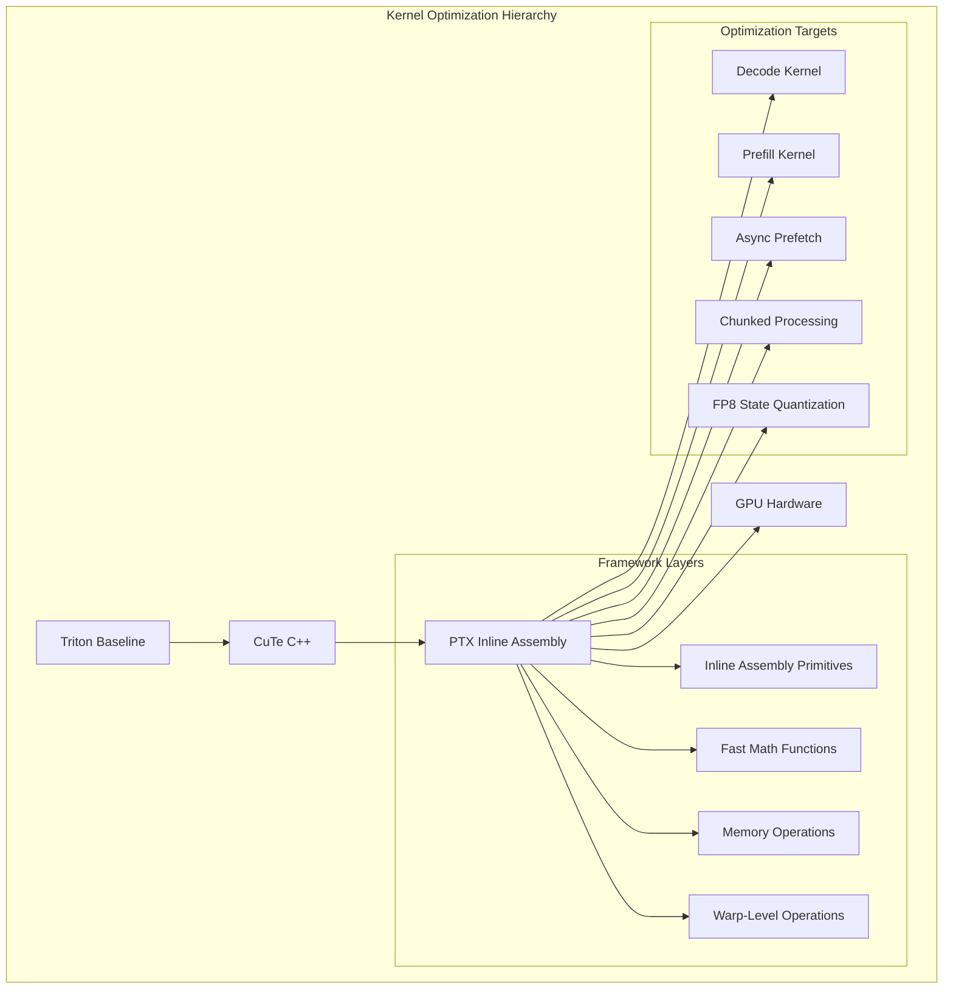

**Diagram sources**
- [gdn_decode_ptx.cuh:1-491](file://src/kernels/ptx/gdn_decode_ptx.cuh#L1-L491)
- [gdn_prefill_ptx.cuh:1-358](file://src/kernels/ptx/gdn_prefill_ptx.cuh#L1-L358)

The architecture emphasizes three core principles:
- **Maximum Performance**: Direct hardware control through PTX assembly
- **Fallback Capability**: Provides optimized implementation when higher layers cannot achieve desired performance
- **Complementary Optimization**: Works alongside CuTe C++ implementations for comprehensive coverage
- **Memory Efficiency**: FP8 quantization reduces memory bandwidth by 4x while maintaining accuracy

**Section sources**
- [README.md:1-168](file://README.md#L1-L168)
- [ROADMAP.md:1-180](file://docs/ROADMAP.md#L1-L180)

## PTX Kernel Implementations

### Decode Kernel Implementation

The PTX decode kernel implements the core GDN operation with embedded assembly optimizations:

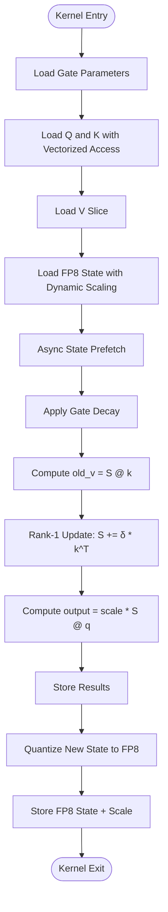

**Diagram sources**
- [gdn_decode_ptx.cuh:248-413](file://src/kernels/ptx/gdn_decode_ptx.cuh#L248-L413)

### Prefill Kernel Implementation

The PTX prefill kernel extends the decode concept to handle variable-length sequences with chunked processing:

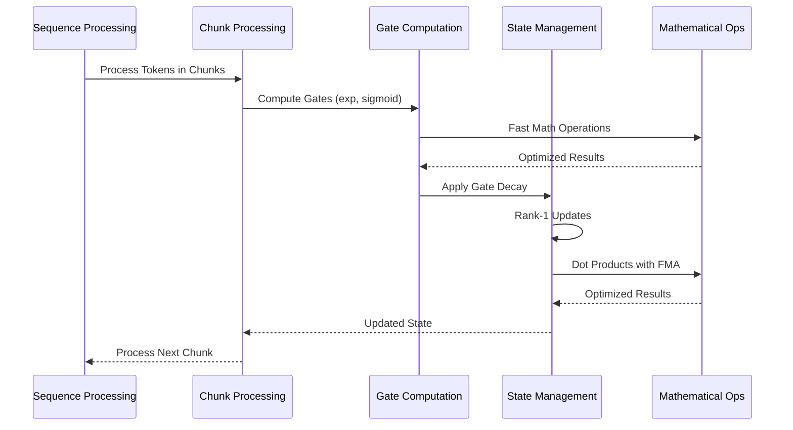

**Diagram sources**
- [gdn_prefill_ptx.cuh:121-301](file://src/kernels/ptx/gdn_prefill_ptx.cuh#L121-L301)

**Section sources**
- [gdn_decode_ptx.cuh:248-491](file://src/kernels/ptx/gdn_decode_ptx.cuh#L248-L491)
- [gdn_prefill_ptx.cuh:121-358](file://src/kernels/ptx/gdn_prefill_ptx.cuh#L121-L358)

## Inline Assembly Primitives

### Mathematical Operations

The framework provides optimized mathematical functions through PTX assembly:

| Operation | PTX Instruction | Performance Benefit |
|-----------|----------------|---------------------|
| Fast Exponential | `ex2.approx.f32` | ~2-3x faster than libm |
| Fast Logarithm | `lg2.approx.f32` | ~2-3x faster than libm |
| Fast Reciprocal | `rcp.approx.f32` | ~2-3x faster than libm |
| Fused Multiply-Add | `fma.rn.f32` | Single rounding, better precision |

### FP8 State Quantization Primitives

**Updated** New FP8 conversion and memory operations for state quantization:

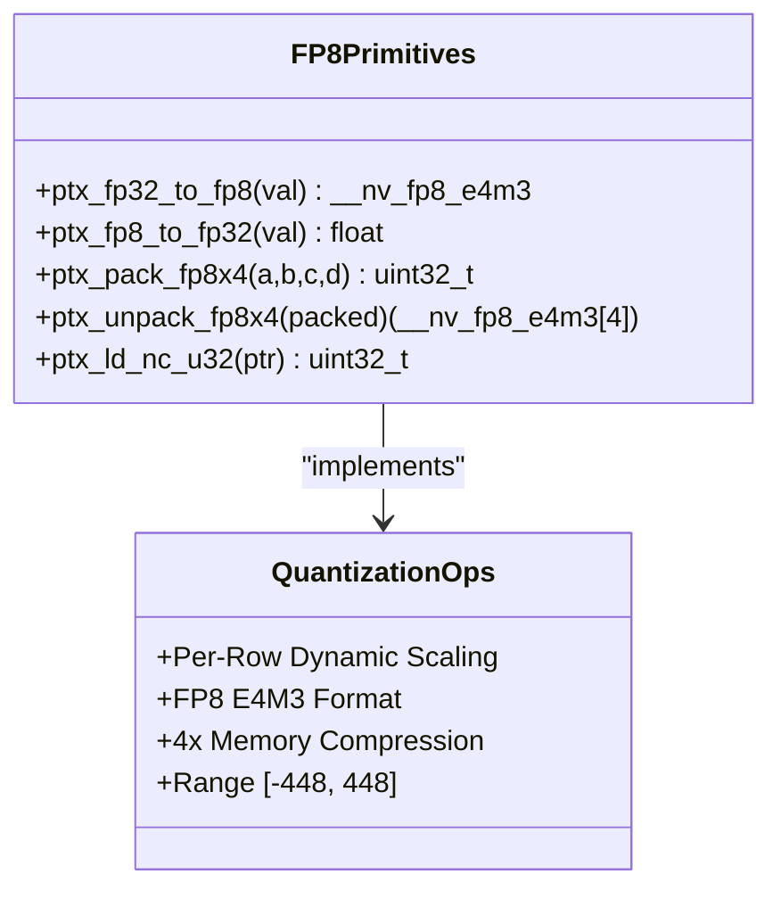

**Diagram sources**
- [gdn_decode_ptx.cuh:198-242](file://src/kernels/ptx/gdn_decode_ptx.cuh#L198-L242)

### Memory Operations

Advanced memory access patterns with cache control and FP8 vectorized operations:

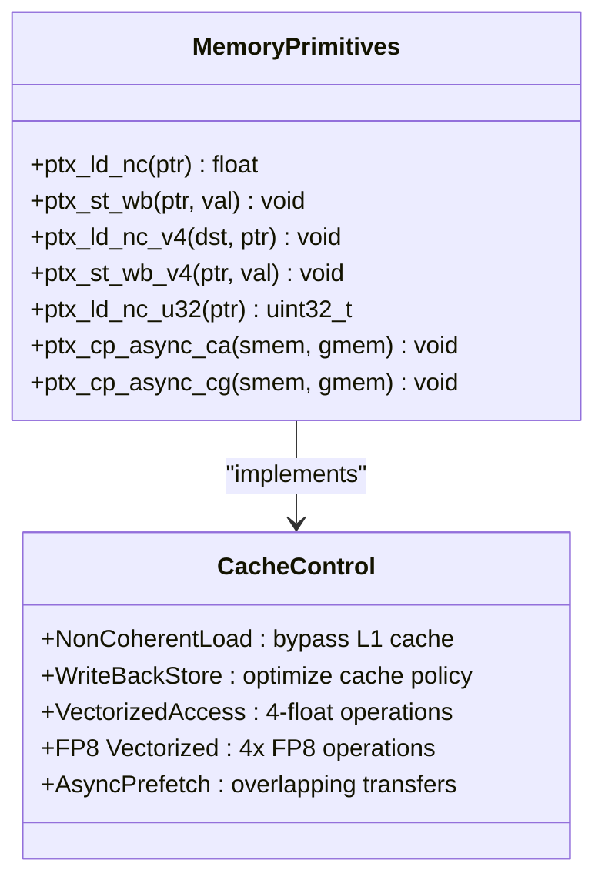

**Diagram sources**
- [gdn_decode_ptx.cuh:98-174](file://src/kernels/ptx/gdn_decode_ptx.cuh#L98-L174)

### Warp-Level Operations

Warp shuffle operations for efficient parallel reductions:

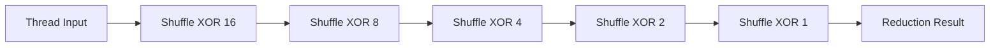

**Diagram sources**
- [gdn_decode_ptx.cuh:227-235](file://src/kernels/ptx/gdn_decode_ptx.cuh#L227-L235)

**Section sources**
- [gdn_decode_ptx.cuh:32-190](file://src/kernels/ptx/gdn_decode_ptx.cuh#L32-L190)
- [gdn_prefill_ptx.cuh:34-80](file://src/kernels/ptx/gdn_prefill_ptx.cuh#L34-L80)

## Performance Optimization Strategies

### Compute Density Enhancement

The framework employs several strategies to increase arithmetic intensity:

| Strategy | Implementation | Impact |
|----------|----------------|--------|
| Chunked Processing | Process multiple tokens per iteration | AI increases from 1 to 8 FLOP/byte |
| Vectorized Loads | 4-float memory operations | 4x memory throughput |
| FMA Chains | Single instruction for multiply-add | Reduced instruction count |
| Async Prefetch | Overlap computation with memory | Hidden latency |
| **FP8 Quantization** | **4x memory compression** | **Reduced bandwidth usage** |

### Memory Bandwidth Optimization

Advanced cache management techniques with FP8 memory efficiency:

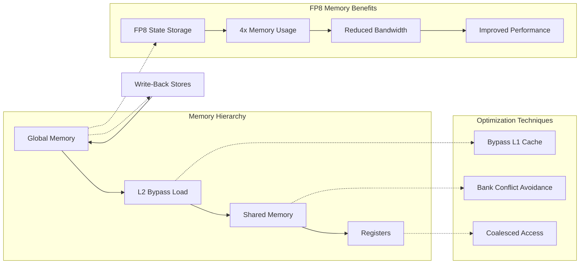

**Diagram sources**
- [gdn_decode_ptx.cuh:113-174](file://src/kernels/ptx/gdn_decode_ptx.cuh#L113-L174)

**Section sources**
- [README.md:14-51](file://README.md#L14-L51)
- [OPTIMIZATION_LOG.md:116-131](file://docs/OPTIMIZATION_LOG.md#L116-L131)

## Build System and Integration

### Compilation Architecture

The build system supports multiple optimization targets and deployment scenarios:

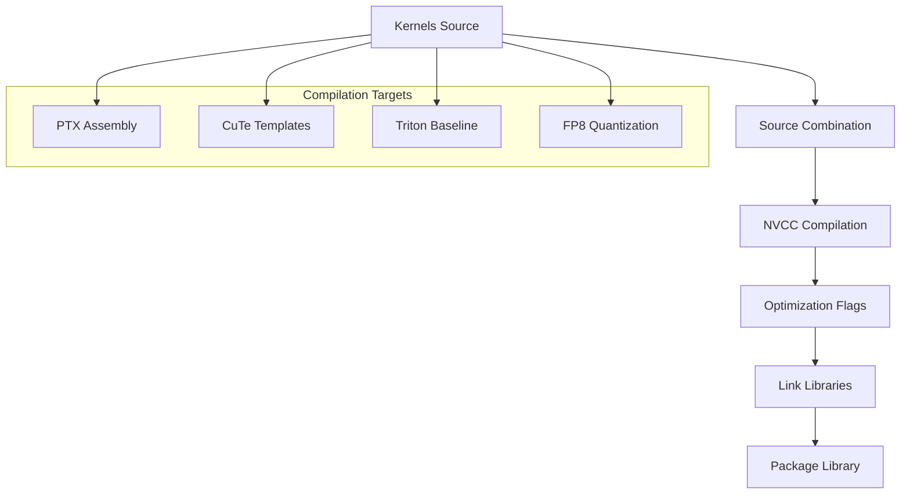

**Diagram sources**
- [build_cuda.py:332-373](file://scripts/build_cuda.py#L332-L373)

### Integration Patterns

The framework integrates seamlessly with the broader kernel ecosystem:

| Integration Point | Purpose | Implementation |
|------------------|---------|----------------|
| C++ Wrapper | Python FFI Access | Extern C functions |
| CUDA Runtime | GPU Execution | Standard CUDA launch |
| Memory Management | Buffer Allocation | Unified memory model |
| Stream Support | Asynchronous Execution | CUDA streams |
| **FP8 Support** | **Quantized State Storage** | **Dynamic scaling + packing** |

**Section sources**
- [CMakeLists.txt:1-68](file://CMakeLists.txt#L1-L68)
- [gdn_kernels.cu:25-170](file://src/gdn_kernels.cu#L25-L170)

## Benchmarking and Evaluation

### Performance Metrics

The framework provides comprehensive performance evaluation capabilities:

| Metric | Measurement | Significance |
|--------|-------------|--------------|
| Throughput | GB/s achieved | Memory bandwidth utilization |
| Latency | ms per operation | Kernel launch overhead |
| Utilization | % of peak | Hardware resource usage |
| Speedup | vs baseline | Optimization effectiveness |
| **Memory Usage** | **GB allocated** | **FP8 compression benefits** |

### Benchmarking Infrastructure

Automated benchmarking supports multiple scenarios:

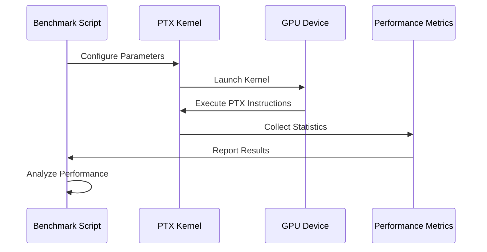

**Diagram sources**
- [bench_all_versions.py:38-444](file://scripts/bench_all_versions.py#L38-L444)

**Section sources**
- [bench_all_versions.py:38-444](file://scripts/bench_all_versions.py#L38-L444)
- [bench_modal.py:115-330](file://benchmarks/bench_modal.py#L115-L330)

## Optimization Roadmap

### Current Status and Future Directions

The PTX framework represents a crucial component in the optimization journey:

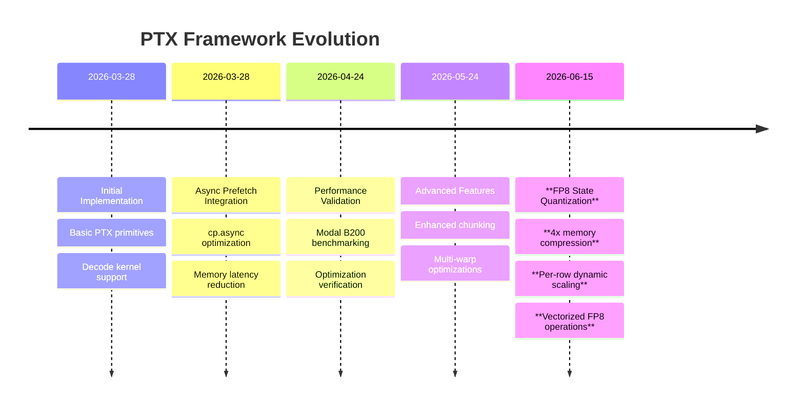

### Strategic Priorities

The framework development follows a structured approach:

1. **Foundation Stability**: Ensure reliable PTX assembly implementation
2. **Performance Validation**: Comprehensive benchmarking across scenarios
3. **Integration Enhancement**: Seamless cooperation with higher-level frameworks
4. **Advanced Optimizations**: Explore additional PTX instruction opportunities
5. **Memory Efficiency**: FP8 quantization for reduced bandwidth usage

**Section sources**
- [ROADMAP.md:1-180](file://docs/ROADMAP.md#L1-L180)
- [OPTIMIZATION_LOG.md:1-197](file://docs/OPTIMIZATION_LOG.md#L1-L197)

## Implementation Details

### Template-Based Design

The framework utilizes C++ templates for compile-time optimization:

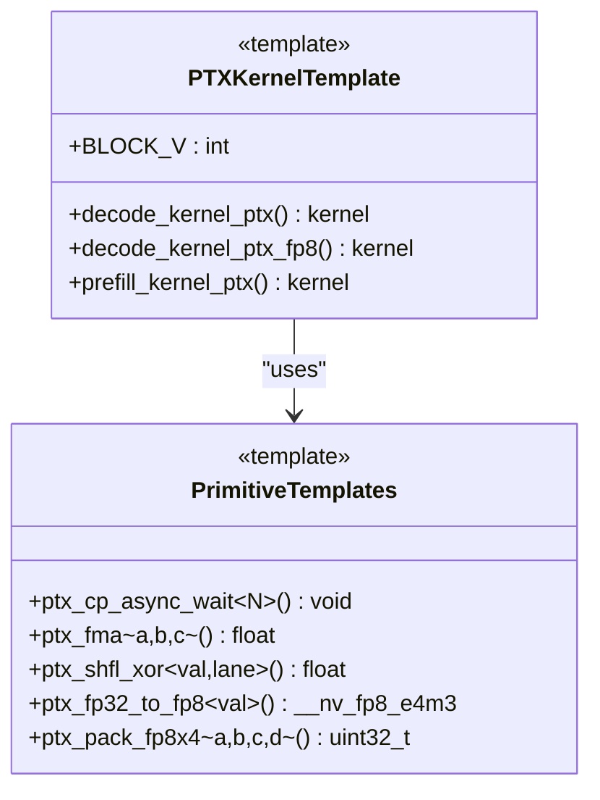

**Diagram sources**
- [gdn_decode_ptx.cuh:248-488](file://src/kernels/ptx/gdn_decode_ptx.cuh#L248-L488)

### Memory Layout Optimization

Sophisticated memory management for optimal performance with FP8 support:

| Memory Region | Purpose | Allocation Strategy |
|---------------|---------|-------------------|
| Q/K Buffers | Query and Key data | Vectorized loads |
| V Slices | Value projections | Coalesced access |
| State Tiles | FP32 recurrent state | Async prefetch |
| **FP8 State** | **Quantized state tiles** | **Vectorized FP8 loads** |
| **Scale Arrays** | **Per-row scaling factors** | **Vectorized loads** |
| Scratch Space | Temporary computations | Shared memory |

**Updated** Added FP8 state and per-row scale memory layouts for quantized state storage.

### FP8 State Quantization Implementation

**New** Detailed FP8 quantization process for memory-efficient state storage:

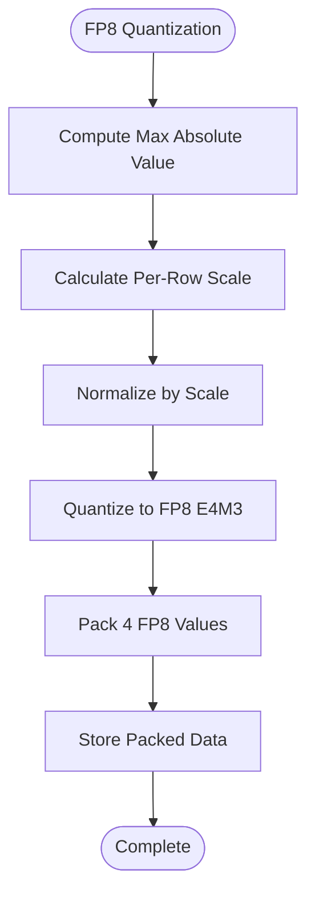

**Diagram sources**
- [gdn_decode_ptx.cuh:636-669](file://src/kernels/ptx/gdn_decode_ptx.cuh#L636-L669)

**Section sources**
- [gdn_decode_ptx.cuh:285-292](file://src/kernels/ptx/gdn_decode_ptx.cuh#L285-L292)
- [gdn_prefill_ptx.cuh:167-177](file://src/kernels/ptx/gdn_prefill_ptx.cuh#L167-L177)

## Conclusion

The PTX Inline Assembly Kernel Framework stands as the pinnacle of optimization within the GDN kernel ecosystem. By providing direct control over GPU operations through PTX assembly, it enables unprecedented performance gains while serving as a critical fallback mechanism for extreme optimization scenarios.

**Updated** The framework now includes comprehensive FP8 state quantization support, providing 4x memory compression through per-row dynamic scaling and vectorized FP8 operations. This enhancement maintains computational accuracy while significantly reducing memory bandwidth requirements, making it particularly valuable for memory-bound scenarios where every optimization counts toward maximizing hardware utilization.

The framework's strength lies in its comprehensive approach to GPU optimization, combining advanced mathematical operations, sophisticated memory management, warp-level parallelism, and efficient state quantization. Its integration with the broader kernel ecosystem ensures that performance optimizations are systematically applied across all layers, from high-level Triton implementations to the most granular PTX assembly optimizations.

As the framework continues to evolve, it maintains its position as the essential foundation for achieving peak performance in GDN kernel implementations, particularly in memory-bound scenarios where FP8 quantization provides substantial bandwidth savings while preserving numerical accuracy through careful dynamic scaling strategies.