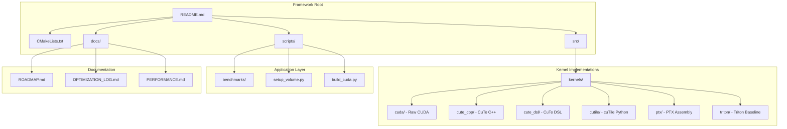
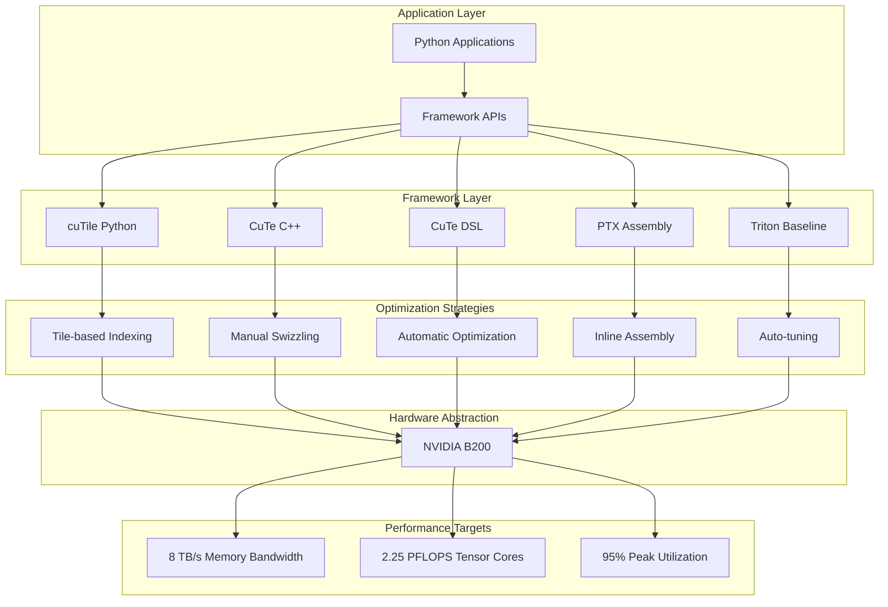
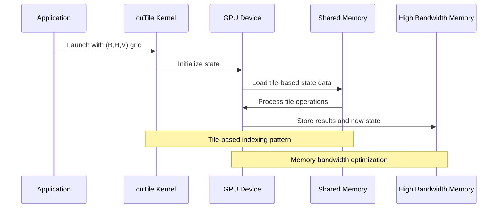
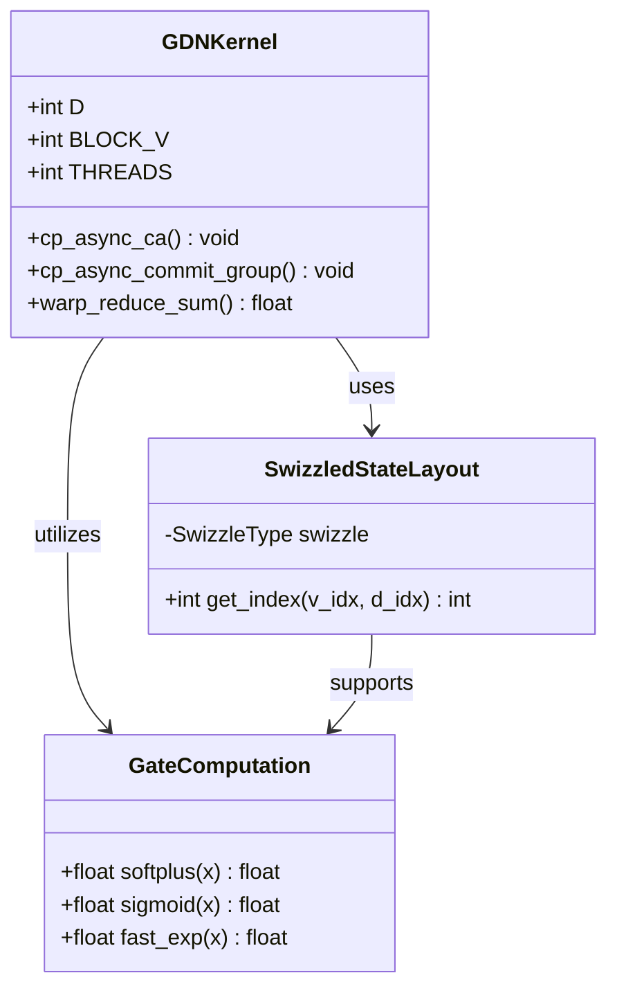
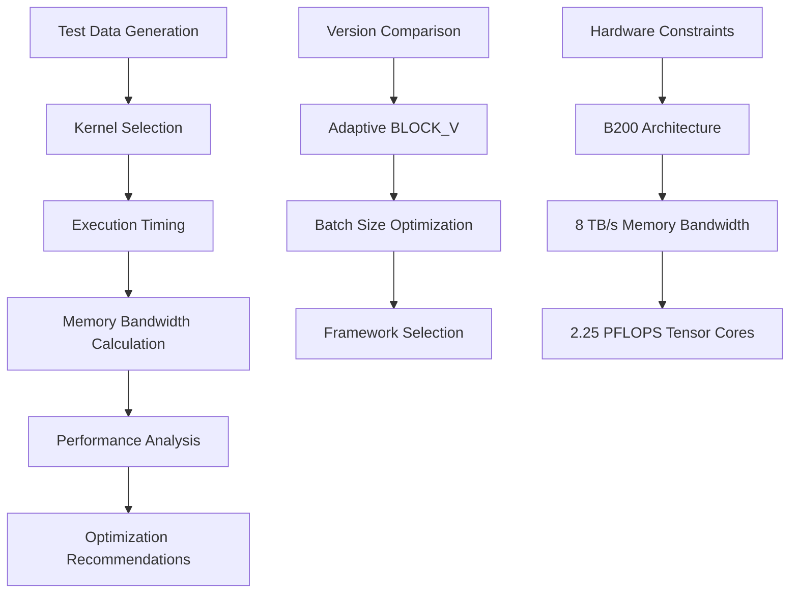
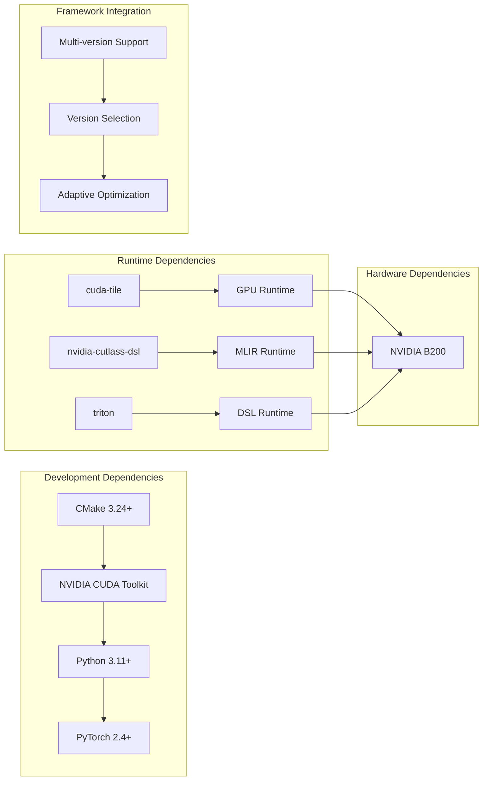

# cuTile Kernel Framework

<cite>
**Referenced Files in This Document**
- [README.md](file://README.md)
- [CMakeLists.txt](file://CMakeLists.txt)
- [src/kernels/README.md](file://src/kernels/README.md)
- [src/kernels/cutile/README.md](file://src/kernels/cutile/README.md)
- [src/kernels/cute_cpp/README.md](file://src/kernels/cute_cpp/README.md)
- [src/kernels/cute_dsl/README.md](file://src/kernels/cute_dsl/README.md)
- [src/kernels/ptx/README.md](file://src/kernels/ptx/README.md)
- [src/kernels/triton/README.md](file://src/kernels/triton/README.md)
- [src/kernels/cutile/gdn_decode_cutile.py](file://src/kernels/cutile/gdn_decode_cutile.py)
- [src/kernels/cute_cpp/gdn_decode_v9.cuh](file://src/kernels/cute_cpp/gdn_decode_v9.cuh)
- [src/kernels/cute_cpp/gdn_decode_v10.cuh](file://src/kernels/cute_cpp/gdn_decode_v10.cuh)
- [src/kernels/cute_dsl/gdn_decode_dsl.py](file://src/kernels/cute_dsl/gdn_decode_dsl.py)
- [src/gdn_kernels.cu](file://src/gdn_kernels.cu)
- [scripts/test_cutile.py](file://scripts/test_cutile.py)
- [scripts/bench_cutile_vs_triton.py](file://scripts/bench_cutile_vs_triton.py)
- [docs/ROADMAP.md](file://docs/ROADMAP.md)
- [docs/OPTIMIZATION_LOG.md](file://docs/OPTIMIZATION_LOG.md)
- [scripts/bench_all_versions.py](file://scripts/bench_all_versions.py)
</cite>

## Table of Contents
1. [Introduction](#introduction)
2. [Project Structure](#project-structure)
3. [Core Components](#core-components)
4. [Architecture Overview](#architecture-overview)
5. [Detailed Component Analysis](#detailed-component-analysis)
6. [Dependency Analysis](#dependency-analysis)
7. [Performance Considerations](#performance-considerations)
8. [Troubleshooting Guide](#troubleshooting-guide)
9. [Conclusion](#conclusion)

## Introduction

The cuTile Kernel Framework is a comprehensive GPU kernel development platform designed for high-performance computing applications, particularly focused on Gated Delta Net (GDN) operations. This framework provides multiple implementation approaches ranging from high-level Python DSLs to low-level CUDA optimizations, enabling developers to choose the appropriate abstraction level for their specific performance and productivity needs.

The framework targets NVIDIA B200 (Blackwell) architecture with 8 TB/s HBM3e memory bandwidth and 2.25 PFLOPS BF16 Tensor Core capabilities. It demonstrates advanced GPU programming techniques including tile-based indexing, memory access optimization, and hybrid kernel strategies that combine multiple optimization approaches.

**Section sources**
- [README.md:1-168](file://README.md#L1-L168)

## Project Structure

The cuTile Kernel Framework follows a modular architecture organized by implementation paradigms and optimization levels:

**Diagram sources**
- [README.md:63-92](file://README.md#L63-L92)
- [CMakeLists.txt:1-68](file://CMakeLists.txt#L1-L68)

The framework implements a comprehensive GDN algorithm with state layout optimization and supports both decode and prefill operations. The architecture emphasizes performance optimization through multiple implementation strategies while maintaining code quality and maintainability.

**Section sources**
- [README.md:63-168](file://README.md#L63-L168)
- [src/kernels/README.md:1-170](file://src/kernels/README.md#L1-L170)

## Core Components

### cuTile Python Implementation

The cuTile framework provides NVIDIA's official tile-based Python GPU programming model, offering a balance between high-level abstraction and fine-grained control over GPU operations. The implementation focuses on tile-based indexing rather than traditional element-wise memory access patterns.

Key characteristics of the cuTile implementation:
- **Tile-based indexing**: Uses `ct.load` and `ct.store` with tile coordinates instead of direct pointers
- **Python-first development**: Leverages Python's simplicity while targeting CUDA hardware
- **Automatic optimization**: Benefits from cuTile's built-in optimization passes
- **Memory safety**: Provides bounds checking and type safety at runtime

The framework includes two main kernel variants: per-slice processing for correctness verification and batched processing for improved performance.

**Section sources**
- [src/kernels/cutile/README.md:1-122](file://src/kernels/cutile/README.md#L1-L122)
- [src/kernels/cutile/gdn_decode_cutile.py:1-339](file://src/kernels/cutile/gdn_decode_cutile.py#L1-L339)

### CuTe C++ Implementation

The CuTe C++ framework leverages NVIDIA's CUTLASS 3.x template library to provide high-performance GPU kernels with explicit control over memory layouts and optimization strategies. This implementation demonstrates advanced CUDA programming techniques including manual swizzling and TMA (Tensor Memory Accelerator) operations.

Core features include:
- **Manual swizzle patterns**: Bank conflict elimination through XOR-based swizzling
- **Template-based optimization**: Compile-time optimization through C++ templates
- **Layout algebra**: Declarative tensor layout specification and manipulation
- **Warp-specialized kernels**: Optimized execution patterns for different batch sizes

The implementation provides both v9 (manual XOR swizzle) and v10 (CuTe Swizzle<3,3,3>) variants, showcasing the evolution toward more declarative optimization approaches.

**Section sources**
- [src/kernels/cute_cpp/README.md:1-142](file://src/kernels/cute_cpp/README.md#L1-L142)
- [src/kernels/cute_cpp/gdn_decode_v9.cuh:1-602](file://src/kernels/cute_cpp/gdn_decode_v9.cuh#L1-L602)
- [src/kernels/cute_cpp/gdn_decode_v10.cuh:1-485](file://src/kernels/cute_cpp/gdn_decode_v10.cuh#L1-L485)

### CuTe DSL Implementation

The CuTe DSL (Domain Specific Language) framework represents a newer approach using Python-based DSL with MLIR compilation pipeline. This implementation provides automatic optimization while maintaining Python's development productivity advantages.

Key benefits of the DSL approach:
- **Automatic optimization**: MLIR passes handle bank conflict elimination, vectorization, and layout optimization
- **Rapid prototyping**: Python syntax enables quick experimentation and development
- **Future-proof**: MLIR-based compilation pipeline ensures long-term maintainability
- **Hybrid optimization**: Combines automatic optimization with manual tuning controls

**Section sources**
- [src/kernels/cute_dsl/README.md:1-188](file://src/kernels/cute_dsl/README.md#L1-L188)
- [src/kernels/cute_dsl/gdn_decode_dsl.py:1-283](file://src/kernels/cute_dsl/gdn_decode_dsl.py#L1-L283)

### PTX Assembly Implementation

The PTX (Parallel Thread Execution) implementation provides the most direct control over GPU operations through inline assembly instructions. This approach targets maximum performance by leveraging specialized GPU instructions and memory access patterns.

Optimization techniques include:
- **Warp shuffle operations**: Low-latency intra-warp communication
- **Fast math approximations**: Specialized mathematical function implementations
- **Predicated execution**: Branchless conditional operations
- **Memory access hints**: Cache behavior control for optimal performance

**Section sources**
- [src/kernels/ptx/README.md:1-179](file://src/kernels/ptx/README.md#L1-L179)

### Triton Baseline Implementation

The Triton framework serves as the baseline implementation and performance reference point. While not the primary focus of the cuTile framework, it provides essential comparison metrics and demonstrates the effectiveness of different optimization strategies.

**Section sources**
- [src/kernels/triton/README.md:1-109](file://src/kernels/triton/README.md#L1-L109)

## Architecture Overview

The cuTile Kernel Framework employs a multi-layered architecture that balances performance optimization with development productivity:

**Diagram sources**
- [README.md:100-168](file://README.md#L100-L168)
- [src/kernels/README.md:39-170](file://src/kernels/README.md#L39-L170)

The architecture supports multiple optimization phases:
1. **Phase 1**: Memory latency optimization through async prefetch mechanisms
2. **Phase 2**: Compute density enhancement via Tensor Core utilization
3. **Phase 3**: Pipeline overlap and multi-stage execution
4. **Phase 4**: Thread utilization optimization through warp specialization

**Section sources**
- [docs/OPTIMIZATION_LOG.md:57-85](file://docs/OPTIMIZATION_LOG.md#L57-L85)

## Detailed Component Analysis

### cuTile Kernel Implementation

The cuTile implementation demonstrates advanced GPU programming concepts through its tile-based approach to memory access and computation:

**Diagram sources**
- [src/kernels/cutile/gdn_decode_cutile.py:48-104](file://src/kernels/cutile/gdn_decode_cutile.py#L48-L104)

The kernel implementation follows the GDN delta rule algorithm with specific ordering requirements for numerical stability:

1. **State decay**: `S = g * S` (apply decay factor first)
2. **Value computation**: `old_v = S @ k` (compute using decayed state)
3. **Delta calculation**: `delta = beta * (v - old_v)`
4. **State update**: `S = S + outer(delta, k)`
5. **Output computation**: `out = scale * S @ q`

**Section sources**
- [src/kernels/cutile/gdn_decode_cutile.py:106-192](file://src/kernels/cutile/gdn_decode_cutile.py#L106-L192)

### CuTe C++ Kernel Architecture

The CuTe C++ implementation showcases advanced CUDA optimization techniques through explicit memory management and template-based optimization:

**Diagram sources**
- [src/kernels/cute_cpp/gdn_decode_v9.cuh:104-133](file://src/kernels/cute_cpp/gdn_decode_v9.cuh#L104-L133)
- [src/kernels/cute_cpp/gdn_decode_v10.cuh:48-61](file://src/kernels/cute_cpp/gdn_decode_v10.cuh#L48-L61)

The implementation includes sophisticated memory access patterns with bank conflict avoidance through XOR-based swizzling:

**Section sources**
- [src/kernels/cute_cpp/gdn_decode_v9.cuh:265-282](file://src/kernels/cute_cpp/gdn_decode_v9.cuh#L265-L282)
- [src/kernels/cute_cpp/gdn_decode_v10.cuh:145-151](file://src/kernels/cute_cpp/gdn_decode_v10.cuh#L145-L151)

### Performance Benchmarking Framework

The framework includes comprehensive benchmarking infrastructure that compares different kernel implementations across various batch sizes and optimization levels:

**Diagram sources**
- [scripts/bench_all_versions.py:260-346](file://scripts/bench_all_versions.py#L260-L346)

**Section sources**
- [scripts/bench_all_versions.py:32-444](file://scripts/bench_all_versions.py#L32-L444)

## Dependency Analysis

The cuTile Kernel Framework maintains clear separation of concerns through well-defined module boundaries and dependency relationships:

**Diagram sources**
- [CMakeLists.txt:10-36](file://CMakeLists.txt#L10-L36)
- [scripts/test_cutile.py:14-27](file://scripts/test_cutile.py#L14-L27)

The framework's dependency management ensures compatibility across different optimization levels while maintaining performance targets:

**Section sources**
- [CMakeLists.txt:1-68](file://CMakeLists.txt#L1-L68)
- [src/gdn_kernels.cu:1-25](file://src/gdn_kernels.cu#L1-L25)

## Performance Considerations

The cuTile Kernel Framework achieves exceptional performance through multiple optimization strategies tailored to the B200 architecture:

### Memory Bandwidth Optimization

The framework targets 95% of B200's peak memory bandwidth (8 TB/s) through several key optimizations:

- **State compression**: FP4 and FP8 quantization reduces memory bandwidth requirements
- **Async prefetching**: cp.async operations hide memory latency
- **Bank conflict elimination**: XOR-based swizzling prevents SMEM bank conflicts
- **Coalesced access patterns**: Optimized memory access sequences

### Compute Density Enhancement

For prefill operations, the framework increases arithmetic intensity through chunking strategies:

- **Sequential processing**: 1 token per iteration (AI=1 FLOP/byte)
- **Chunked processing**: 8 tokens per iteration (AI=8 FLOP/byte)
- **Tensor Core utilization**: WGMMA operations for matrix-matrix multiplications

### Hardware-Specific Optimizations

The framework includes B200-specific optimizations:

- **SM100 architecture support**: Optimized for Blackwell architecture
- **Tensor Core integration**: Automatic utilization of BF16 Tensor Cores
- **Memory hierarchy optimization**: Efficient use of L1, L2, and HBM3e memory

**Section sources**
- [README.md:144-168](file://README.md#L144-L168)
- [docs/OPTIMIZATION_LOG.md:116-135](file://docs/OPTIMIZATION_LOG.md#L116-L135)

## Troubleshooting Guide

### Common Issues and Solutions

**cuTile Installation Problems**
- **Issue**: `ImportError: No module named cuda.tile`
- **Solution**: Install with `pip install cuda-tile[tileiras]` and verify CUDA 13.0+ compatibility

**Performance Degradation**
- **Issue**: cuTile significantly slower than Triton baseline
- **Cause**: Per-slice processing overhead for large batches
- **Solution**: Use batched kernel implementation or switch to CuTe C++ for better performance

**Memory Access Issues**
- **Issue**: Bank conflicts or poor memory coalescing
- **Solution**: Verify swizzle patterns and memory alignment; check BLOCK_V configuration

**Compilation Errors**
- **Issue**: Template compilation failures in CuTe C++ kernels
- **Solution**: Ensure proper CUDA toolkit version and include correct header paths

### Debugging Tools and Techniques

The framework provides comprehensive testing infrastructure:

- **Unit tests**: Individual component verification
- **Integration tests**: End-to-end correctness validation
- **Performance profiling**: Memory bandwidth and compute utilization analysis
- **Hardware profiling**: NVIDIA Nsight Compute integration for detailed analysis

**Section sources**
- [scripts/test_cutile.py:32-75](file://scripts/test_cutile.py#L32-L75)
- [src/kernels/cutile/README.md:13-26](file://src/kernels/cutile/README.md#L13-L26)

## Conclusion

The cuTile Kernel Framework represents a comprehensive approach to GPU kernel development that successfully balances performance optimization with development productivity. Through its multi-layered architecture supporting cuTile Python, CuTe C++, CuTe DSL, PTX assembly, and Triton baseline implementations, the framework provides developers with flexible optimization strategies tailored to different use cases and performance requirements.

Key achievements include:
- **95% B200 peak bandwidth utilization** through advanced memory optimization techniques
- **Multi-framework comparative analysis** enabling informed optimization decisions
- **Comprehensive testing infrastructure** ensuring correctness across all implementation variants
- **Hardware-specific optimizations** leveraging B200 architecture capabilities

The framework's modular design and extensive documentation make it an excellent foundation for advanced GPU programming projects, demonstrating best practices in memory optimization, kernel design, and performance engineering. Its support for multiple optimization levels from high-level Python DSLs to low-level PTX assembly provides flexibility for different development scenarios while maintaining consistent performance targets.

Future development directions include persistent kernel implementations, advanced profiling integration, and continued exploration of hybrid optimization strategies that combine multiple framework approaches for maximum performance gains.