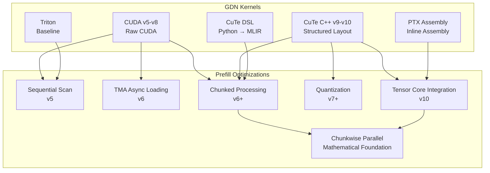
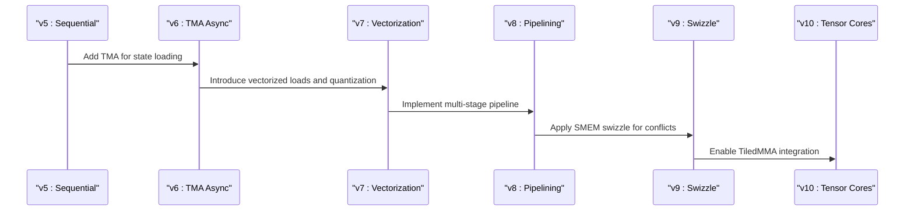
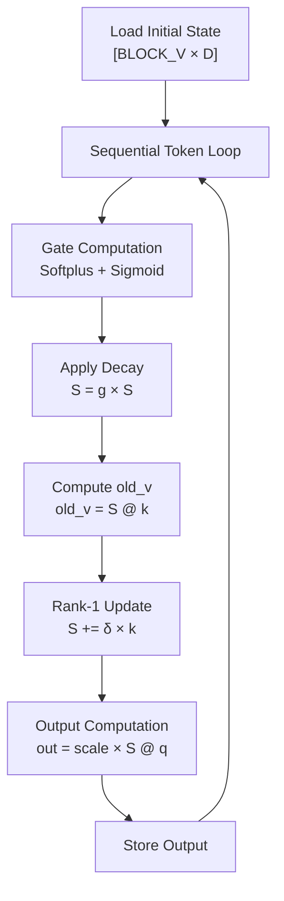
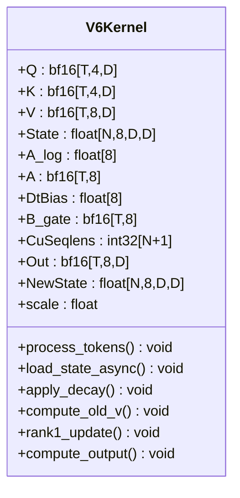
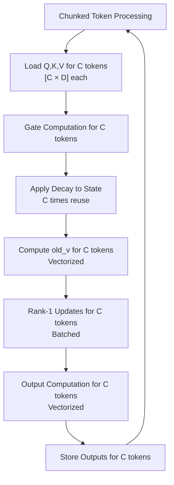
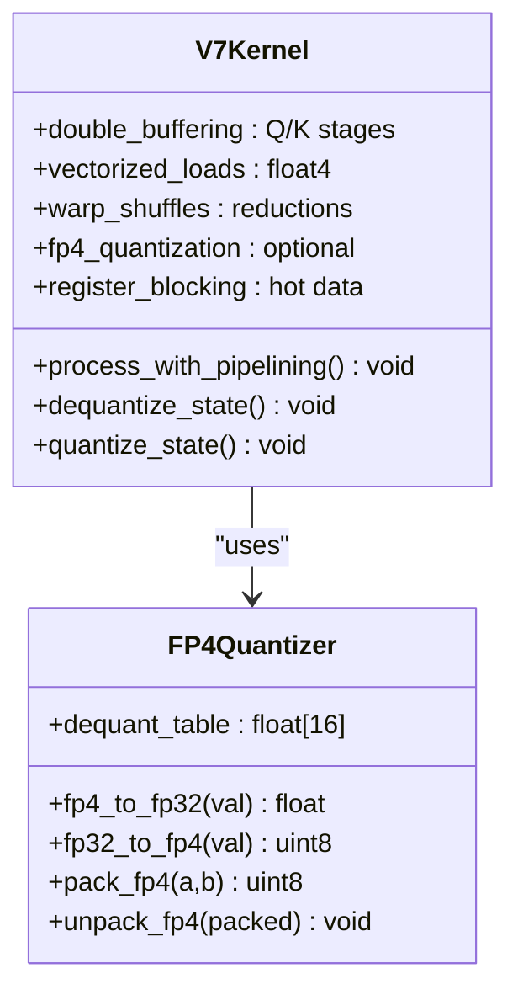
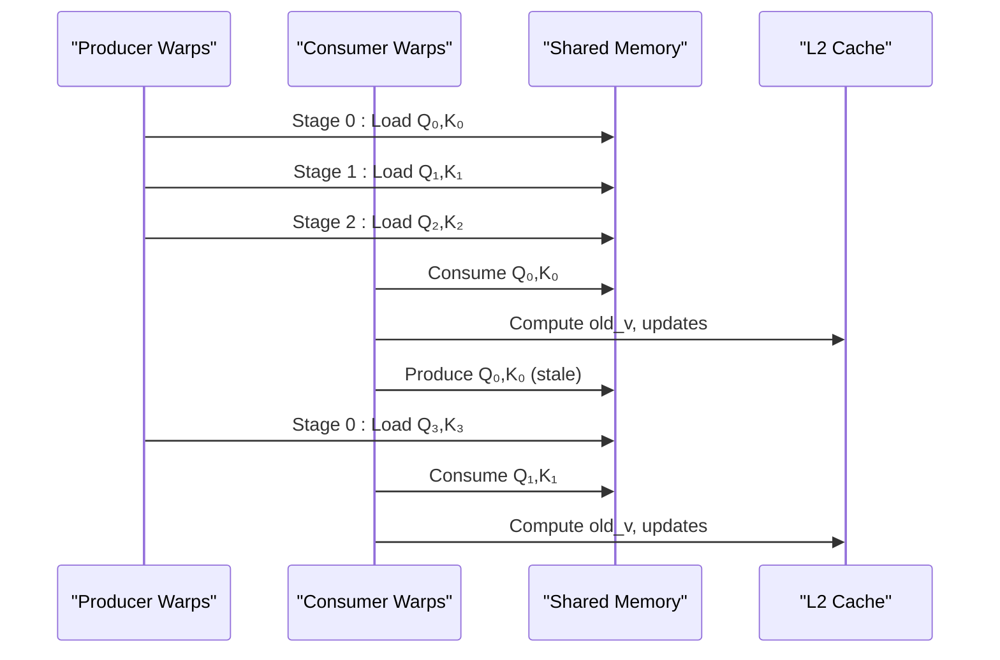
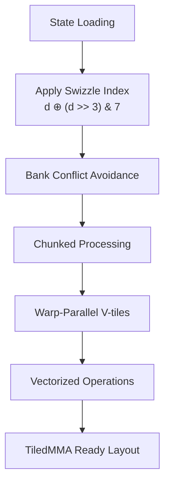
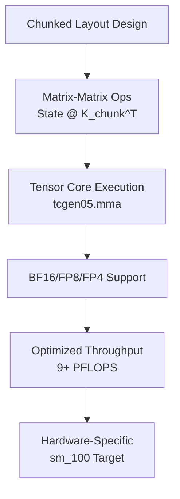
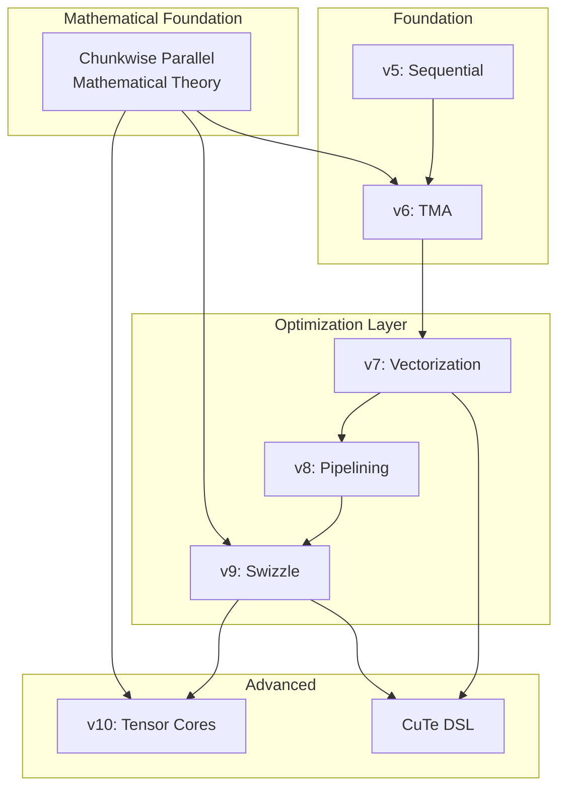

# GDN Prefill Kernel Optimization

<cite>
**Referenced Files in This Document**
- [gdn/README.md](file://gdn/README.md)
- [gdn/kernels/README.md](file://gdn/kernels/README.md)
- [gdn/kernels/cuda/gdn_prefill_v5.cuh](file://gdn/kernels/cuda/gdn_prefill_v5.cuh)
- [gdn/kernels/cuda/gdn_prefill_v6.cuh](file://gdn/kernels/cuda/gdn_prefill_v6.cuh)
- [gdn/kernels/cuda/gdn_prefill_v6_chunked.cuh](file://gdn/kernels/cuda/gdn_prefill_v6_chunked.cuh)
- [gdn/kernels/cuda/gdn_prefill_v7.cuh](file://gdn/kernels/cuda/gdn_prefill_v7.cuh)
- [gdn/kernels/cuda/gdn_prefill_v8.cuh](file://gdn/kernels/cuda/gdn_prefill_v8.cuh)
- [gdn/kernels/cute_cpp/gdn_prefill_v9.cuh](file://gdn/kernels/cute_cpp/gdn_prefill_v9.cuh)
- [gdn/kernels/cute_cpp/gdn_prefill_v10.cuh](file://gdn/kernels/cute_cpp/gdn_prefill_v10.cuh)
- [gdn/kernels/cute_dsl/gdn_prefill_dsl.py](file://gdn/kernels/cute_dsl/gdn_prefill_dsl.py)
- [gdn/docs/ZHIHU_CHUNKWISE_PARALLEL.md](file://gdn/docs/ZHIHU_CHUNKWISE_PARALLEL.md)
- [gdn/docs/ZHIHU_GDN_TENSOR_CORE.md](file://gdn/docs/ZHIHU_GDN_TENSOR_CORE.md)
</cite>

## Update Summary
**Changes Made**
- Added comprehensive mathematical derivations of chunkwise parallel algorithm from ZHIHU_CHUNKWISE_PARALLEL.md
- Enhanced chunked processing analysis with detailed matrix operations and tensor core integration
- Updated performance considerations with new arithmetic intensity calculations
- Expanded troubleshooting guide with chunk size optimization guidance
- Added practical implementation examples and optimization strategies

## Table of Contents
1. [Introduction](#introduction)
2. [Project Structure](#project-structure)
3. [Core Components](#core-components)
4. [Architecture Overview](#architecture-overview)
5. [Detailed Component Analysis](#detailed-component-analysis)
6. [Mathematical Foundations of Chunkwise Parallel](#mathematical-foundations-of-chunkwise-parallel)
7. [Dependency Analysis](#dependency-analysis)
8. [Performance Considerations](#performance-considerations)
9. [Troubleshooting Guide](#troubleshooting-guide)
10. [Conclusion](#conclusion)

## Introduction
This document analyzes the GDN (Gated Delta Net) Prefill Kernel Optimization project, focusing on the evolution and optimization strategies across multiple kernel versions. The project targets NVIDIA B200 (sm_100) and demonstrates a progression from baseline sequential processing to advanced techniques including chunking, shared memory swizzling, quantization, and TiledMMA integration for Tensor Cores. The optimization journey emphasizes increasing arithmetic intensity through chunk-based processing, reducing memory-bound bottlenecks, and leveraging hardware-specific features for maximum throughput.

**Updated** Enhanced with comprehensive mathematical analysis of chunkwise parallel algorithms from ZHIHU_CHUNKWISE_PARALLEL.md, providing detailed derivations of how GDN's delta rule can be transformed from O(L) sequential computation to O(L/C) chunk-based parallel processing.

## Project Structure
The GDN kernels are organized by framework and version, showcasing a clear evolution toward higher performance and more sophisticated optimizations:



**Diagram sources**
- [gdn/kernels/README.md:1-170](file://gdn/kernels/README.md#L1-L170)
- [gdn/docs/ZHIHU_CHUNKWISE_PARALLEL.md:1-725](file://gdn/docs/ZHIHU_CHUNKWISE_PARALLEL.md#L1-L725)

**Section sources**
- [gdn/README.md:1-65](file://gdn/README.md#L1-L65)
- [gdn/kernels/README.md:1-170](file://gdn/kernels/README.md#L1-L170)

## Core Components
The GDN prefill kernels implement a core algorithmic pattern with variations in memory access, computation scheduling, and hardware utilization:

### Algorithmic Foundation
All versions implement the delta rule with consistent mathematical operations:
- Gate computation using softplus and sigmoid functions
- State decay: S = g * S
- Old value computation: old_v = S @ k
- Rank-1 update: S += delta * k
- Output computation: out = scale * S @ q

### Memory Management Strategies
- **v5-v6**: Sequential token processing with shared memory staging
- **v7+**: Vectorized loads using float4, double buffering, and register blocking
- **v9+**: SMEM swizzle for bank conflict avoidance
- **v10**: TiledMMA-ready layouts enabling matrix-matrix operations

### Hardware-Specific Optimizations
- **v6**: Tensor Memory Accelerator (TMA) for async state loading
- **v7**: Warp shuffles for reductions, FP4 quantization
- **v8**: Multi-stage pipelining, persistent kernel for long sequences
- **v10**: Tensor Core integration via tcgen05.mma on sm_100

**Section sources**
- [gdn/kernels/cuda/gdn_prefill_v5.cuh:38-187](file://gdn/kernels/cuda/gdn_prefill_v5.cuh#L38-L187)
- [gdn/kernels/cuda/gdn_prefill_v7.cuh:91-274](file://gdn/kernels/cuda/gdn_prefill_v7.cuh#L91-L274)
- [gdn/kernels/cute_cpp/gdn_prefill_v9.cuh:84-281](file://gdn/kernels/cute_cpp/gdn_prefill_v9.cuh#L84-L281)
- [gdn/kernels/cute_cpp/gdn_prefill_v10.cuh:93-309](file://gdn/kernels/cute_cpp/gdn_prefill_v10.cuh#L93-L309)

## Architecture Overview
The optimization progression follows a systematic approach to address computational and memory bottlenecks:


**Diagram sources**
- [gdn/kernels/README.md:115-142](file://gdn/kernels/README.md#L115-L142)
- [gdn/kernels/cuda/gdn_prefill_v6_chunked.cuh:39-55](file://gdn/kernels/cuda/gdn_prefill_v6_chunked.cuh#L39-L55)

### Version Evolution Timeline
The kernel evolution demonstrates targeted improvements addressing specific performance limitations:



**Diagram sources**
- [gdn/kernels/cuda/gdn_prefill_v5.cuh:104-177](file://gdn/kernels/cuda/gdn_prefill_v5.cuh#L104-L177)
- [gdn/kernels/cuda/gdn_prefill_v6.cuh:87-160](file://gdn/kernels/cuda/gdn_prefill_v6.cuh#L87-L160)
- [gdn/kernels/cuda/gdn_prefill_v7.cuh:91-274](file://gdn/kernels/cuda/gdn_prefill_v7.cuh#L91-L274)
- [gdn/kernels/cuda/gdn_prefill_v8.cuh:81-271](file://gdn/kernels/cuda/gdn_prefill_v8.cuh#L81-L271)
- [gdn/kernels/cute_cpp/gdn_prefill_v9.cuh:84-281](file://gdn/kernels/cute_cpp/gdn_prefill_v9.cuh#L84-L281)
- [gdn/kernels/cute_cpp/gdn_prefill_v10.cuh:93-309](file://gdn/kernels/cute_cpp/gdn_prefill_v10.cuh#L93-L309)

## Detailed Component Analysis

### v5: Baseline Sequential Processing
The foundational kernel establishes the core algorithm with straightforward sequential token processing:



**Diagram sources**
- [gdn/kernels/cuda/gdn_prefill_v5.cuh:104-177](file://gdn/kernels/cuda/gdn_prefill_v5.cuh#L104-L177)

Key characteristics:
- Grid configuration: (N, H=8, V_BLOCKS)
- Block size: 128 threads (4 warps)
- Memory layout: k-last [N, H, V=128, K=128] float32
- Arithmetic intensity: 1 FLOP/byte (memory-bound)

**Section sources**
- [gdn/kernels/cuda/gdn_prefill_v5.cuh:38-187](file://gdn/kernels/cuda/gdn_prefill_v5.cuh#L38-L187)

### v6: TMA Async Loading Enhancement
Version 6 introduces Tensor Memory Accelerator for improved state loading performance:



**Diagram sources**
- [gdn/kernels/cuda/gdn_prefill_v6.cuh:30-169](file://gdn/kernels/cuda/gdn_prefill_v6.cuh#L30-L169)

Optimization highlights:
- TMA-enabled async state loading reduces memory latency
- 128B aligned shared memory for optimal bandwidth utilization
- Maintains sequential token processing while improving memory efficiency

**Section sources**
- [gdn/kernels/cuda/gdn_prefill_v6.cuh:30-231](file://gdn/kernels/cuda/gdn_prefill_v6.cuh#L30-L231)

### v6: Chunked Processing Innovation
The chunked processing approach dramatically increases arithmetic intensity:



**Diagram sources**
- [gdn/kernels/cuda/gdn_prefill_v6_chunked.cuh:123-218](file://gdn/kernels/cuda/gdn_prefill_v6_chunked.cuh#L123-L218)

Arithmetic intensity analysis:
- Single-token processing: 2×D² FLOPs, 2×D² bytes → AI = 1 FLOP/byte
- Chunked processing (C tokens): C×2×D² FLOPs, 2×D² bytes → AI = C FLOP/byte
- With C=8: AI = 8 FLOP/byte approaching compute-bound territory

**Section sources**
- [gdn/kernels/cuda/gdn_prefill_v6_chunked.cuh:39-285](file://gdn/kernels/cuda/gdn_prefill_v6_chunked.cuh#L39-L285)

### v7: Advanced Vectorization and Quantization
Version 7 combines multiple optimization techniques for maximum performance:



**Diagram sources**
- [gdn/kernels/cuda/gdn_prefill_v7.cuh:91-450](file://gdn/kernels/cuda/gdn_prefill_v7.cuh#L91-L450)

Key innovations:
- Double buffering eliminates pipeline stalls
- Vectorized float4 loads reduce memory bandwidth
- Warp shuffle-based reductions improve parallel efficiency
- Optional FP4 quantization reduces state storage and bandwidth

**Section sources**
- [gdn/kernels/cuda/gdn_prefill_v7.cuh:91-549](file://gdn/kernels/cuda/gdn_prefill_v7.cuh#L91-L549)

### v8: Multi-Stage Pipelining
Version 8 introduces sophisticated pipelining for long sequence processing:



**Diagram sources**
- [gdn/kernels/cuda/gdn_prefill_v8.cuh:160-259](file://gdn/kernels/cuda/gdn_prefill_v8.cuh#L160-L259)

Advanced features:
- Triple-buffered shared memory staging
- Warp-specialized producer/consumer roles
- L2 cache hints for improved memory access patterns
- Persistent kernel execution for long sequences

**Section sources**
- [gdn/kernels/cuda/gdn_prefill_v8.cuh:81-550](file://gdn/kernels/cuda/gdn_prefill_v8.cuh#L81-L550)

### v9: SMEM Swizzle and Chunking
Version 9 optimizes shared memory access patterns with swizzling:



**Diagram sources**
- [gdn/kernels/cute_cpp/gdn_prefill_v9.cuh:147-281](file://gdn/kernels/cute_cpp/gdn_prefill_v9.cuh#L147-L281)

Swizzle optimization:
- Bank conflict resolution through bit manipulation
- Maintained chunked processing benefits
- Warp-level parallelism across V dimension
- Preparation for TiledMMA integration

**Section sources**
- [gdn/kernels/cute_cpp/gdn_prefill_v9.cuh:84-356](file://gdn/kernels/cute_cpp/gdn_prefill_v9.cuh#L84-L356)

### v10: Tensor Core Integration
The latest version enables direct Tensor Core utilization:



**Diagram sources**
- [gdn/kernels/cute_cpp/gdn_prefill_v10.cuh:179-295](file://gdn/kernels/cute_cpp/gdn_prefill_v10.cuh#L179-L295)

Tensor Core advantages:
- Matrix-matrix operations enable compute-bound execution
- Multiple precision formats (FP4, FP8, BF16) for flexibility
- Hardware-optimized instruction set for maximum throughput
- Ridge point optimization for B200 architecture

**Section sources**
- [gdn/kernels/cute_cpp/gdn_prefill_v10.cuh:93-390](file://gdn/kernels/cute_cpp/gdn_prefill_v10.cuh#L93-L390)

### CuTe DSL Implementation
The CuTe DSL provides a high-level Python interface with automatic optimization:


**Diagram sources**
- [gdn/kernels/cute_dsl/gdn_prefill_dsl.py:15-22](file://gdn/kernels/cute_dsl/gdn_prefill_dsl.py#L15-L22)

DSL capabilities:
- Automatic layout inference and optimization
- High-level tensor operations with low-level performance
- Rapid prototyping with production-grade kernels
- Integration with PyTorch ecosystem

**Section sources**
- [gdn/kernels/cute_dsl/gdn_prefill_dsl.py:49-249](file://gdn/kernels/cute_dsl/gdn_prefill_dsl.py#L49-L249)

## Mathematical Foundations of Chunkwise Parallel

**Updated** Comprehensive mathematical analysis of chunkwise parallel algorithms for GDN's delta rule.

### The Core Challenge: Sequential Dependencies
GDN's delta rule creates strict sequential dependencies that prevent direct parallelization:

```
S₀ → old_v₀ → Δ₀ → S₁ → old_v₁ → Δ₁ → S₂ → ...
```

Each token depends on the previous state, making naive parallelization impossible. However, the chunkwise parallel approach transforms this fundamental constraint.

### Mathematical Transformation: From Sequential to Chunk-Based Matrix Operations

#### 3.1 State Propagation Within Chunks
For a chunk of size C, we can rewrite the sequential computation as matrix operations:

**State Update Pattern:**
```
S_t = γ_t S_0 + Σ_{j=1}^{t} γ_{j:t} Δ_j k_j^T
```

Where:
- γ_t = ∏_{i=1}^{t} g_i is the cumulative decay factor
- γ_{j:t} = ∏_{i=j+1}^{t} g_i is the decay from token j to t

**Output Decomposition:**
```
o_t = γ_t (S_0 q_t) + Σ_{j=1}^{t} γ_{j:t} Δ_j (k_j^T q_t)
```

#### 3.2 Causal Attention Formulation
The second term can be expressed as causal attention:

```
O = Γ · (S_0 Q^T)^T + CausalAttn(Δ, K, Q, G)
```

Where Γ is a lower triangular matrix with Γ[i,j] = γ_{j:i} for j ≤ i.

#### 3.3 Tensor Core Optimized Implementation
With chunked processing, the core operations become matrix-matrix multiplications suitable for Tensor Cores:

```python
# Chunked computation structure
def chunk_forward(Q_chunk, K_chunk, V_chunk, G_chunk, B_chunk, S_init):
    C, D = Q_chunk.shape
    
    # Step 1: Compute cumulative decay matrix Γ (lower triangular)
    Gamma = compute_causal_decay_matrix(G_chunk)  # [C, C]
    
    # Step 2: Compute raw attention scores
    A_raw = Q_chunk @ K_chunk.T  # [C, C]
    
    # Step 3: Apply causal masking and decay
    A = Gamma * A_raw  # Element-wise multiplication
    
    # Step 4: Compute chunk internal contributions
    # This handles the dependency through matrix decomposition
    
    # Step 5: Add initial state contribution
    gamma_vec = cumprod(G_chunk)
    state_contrib = gamma_vec[:, None] * (S_init @ Q_chunk.T).T
    
    # Step 6: Combine outputs
    O = state_contrib + intra_chunk_output
    
    # Step 7: Compute final state
    S_final = gamma_vec[-1] * S_init + sum_of_updates
    
    return O, S_final
```

### 4.1 Two-Phase Chunkwise Parallel Algorithm

#### Phase 1: Intra-Chunk Parallel Processing
Each chunk processes all tokens in parallel using matrix operations:

```python
def intra_chunk_parallel(chunks, S_init_per_chunk):
    """
    Input:
      chunks: List of (Q, K, V, G, B), each shape [C, D]
      S_init_per_chunk: Each chunk's initial state [num_chunks, D, D]
    
    Output:
      outputs: [num_chunks, C, D]
      S_finals: [num_chunks, D, D]
    """
    outputs = []
    S_finals = []
    
    # This loop can be fully parallelized!
    for chunk_idx, (Q, K, V, G, B) in enumerate(chunks):
        S_init = S_init_per_chunk[chunk_idx]
        
        # Chunk internal computation (matrix operations, Tensor Cores)
        O, S_final = compute_chunk(Q, K, V, G, B, S_init)
        
        outputs.append(O)
        S_finals.append(S_final)
    
    return stack(outputs), stack(S_finals)
```

#### Phase 2: Inter-Chunk State Propagation
Chunk-to-chunk state propagation requires sequential processing but reduces from O(L) to O(L/C):

```python
def inter_chunk_sequential(S_finals, initial_state):
    """
    Input:
      S_finals: Local final states for each chunk [num_chunks, D, D]
      initial_state: Sequence's initial state [D, D]
    
    Output:
      S_corrected: Corrected final states [num_chunks, D, D]
    """
    num_chunks = len(S_finals)
    S_prev = initial_state
    S_corrected = []
    
    # O(L/C) sequential steps
    for i in range(num_chunks):
        # Correction: account for previous chunk's state propagation
        S_curr = propagate_state(S_prev, S_finals[i])
        S_corrected.append(S_curr)
        S_prev = S_curr
    
    return stack(S_corrected)
```

### 4.2 Complexity Analysis

#### Time Complexity Comparison
| Operation | Naive Sequential | Chunkwise Parallel |
|-----------|------------------|-------------------|
| Sequential steps | O(L) | O(L/C) |
| Parallel computation | - | O(C²D) per chunk |
| **Total** | O(LD²) sequential | O(L/C) sequential + O(LC·D) parallel |

When C = 64, L = 4096:
- Naive method: 4096 sequential steps
- Chunkwise: 64 sequential steps + parallel matrix operations

**Acceleration ratio: 64x reduction in sequential steps!**

#### Space Complexity Analysis
| Storage item | Size | Description |
|-------------|------|-------------|
| Chunk states | O(L/C · D²) | One D×D matrix per chunk |
| Attention matrices | O(C²) per chunk | Lower triangular causal masks |
| **Total** | O(LD²/C + C²) | Significantly less than O(LD²) |

#### Tensor Core Utilization
Intra-chunk phase's core operations:
- A = Q K^T: [C, D] × [D, C] = [C, C] matrix multiply
- O = A V: [C, C] × [C, D] = [C, D] matrix multiply

When C = 64, D = 128:
- Matrix sizes perfectly match Tensor Core tiles (16×16 or 8×16 tiles)
- Can achieve near-peak Tensor Core throughput

### 5.1 Practical Implementation Considerations

#### Numerical Stability
The cumulative decay γ_t = ∏_{i=1}^{t} g_i can become extremely small when g < 1. Recommended approaches:

```python
# Use log-space computation
log_gamma = cumsum(log(G))
gamma = exp(log_gamma)

# Or use float32 accumulation
gamma = cumprod(G.float()).to(G.dtype)
```

#### Memory-Efficient Implementation
To avoid O(C²) attention matrix storage, use Flash Attention-style blocking:

```python
def memory_efficient_chunk(Q, K, V, G, B, S_init, BLOCK=16):
    """Blocked computation to avoid O(C²) memory"""
    C, D = Q.shape
    O = zeros(C, D)
    
    for i in range(0, C, BLOCK):
        q_block = Q[i:i+BLOCK]  # [BLOCK, D]
        
        # Compute only needed attention blocks
        for j in range(0, i + BLOCK, BLOCK):
            k_block = K[j:j+BLOCK]
            v_block = V[j:j+BLOCK]
            
            # Local attention + causal masking
            a_block = q_block @ k_block.T  # [BLOCK, BLOCK]
            # ... apply mask and accumulate
        
        O[i:i+BLOCK] = ...
    
    return O
```

### 5.2 Performance Optimization Strategies

#### Optimal Chunk Size Selection
| Chunk Size | Advantages | Disadvantages |
|------------|------------|---------------|
| C=32 | Fewer sequential steps | Small matrices, low Tensor Core utilization |
| **C=64** | **Balanced** | **Recommended** |
| C=128 | High Tensor Core utilization | More sequential steps |
| C=256 | Maximum parallelization | Large memory pressure, many sequential steps |

Typically **C=64 or C=128** provides the best balance.

#### Implementation Trade-offs
| Aspect | Theoretical Chunkwise | Current Implementation |
|--------|----------------------|----------------------|
| Chunk internal token parallel | Chunk internal token parallel | Chunk internal token sequential |
| Complex matrix decomposition | Required | Direct delta rule |
| Tensor Core utilization | Full | Vector operations only |
| Implementation complexity | High | Moderate |

**Why the current implementation chooses simplicity:**
1. **Correctness priority**: Complex chunk internal matrix solving prone to bugs
2. **Production ROI**: Tensor Core benefits ~2-3x, but implementation cost high
3. **Multi-Batch effectiveness**: Production batches typically ≥ 16, already fast
4. **Baseline alignment**: Official implementation uses similar approach (CuTe DSL, non-chunk parallel)

### 6.1 Future Optimization Directions

#### 1. Complete Chunkwise with Tensor Cores (High ROI, High Difficulty)
**Goal**: Transform chunk internal tokens into matrix-matrix operations
**Expected benefit**: 2-3x speedup
**Challenge**: Correctly handling delta's state dependencies

#### 2. TMA + Double Buffering (Medium ROI, Medium Difficulty)
**Goal**: Asynchronous prefetching of next chunk data
**Expected benefit**: 1.3-1.5x improvement
**Implementation**: cp.async.bulk.tensor instructions

#### 3. State Quantization (Low-Medium ROI, Low Difficulty)
**Goal**: FP32 state → FP8/BF16
**Expected benefit**: 2-4x bandwidth reduction
**Risk**: Potential precision loss

## Dependency Analysis
The kernel implementations demonstrate clear dependency relationships and optimization progression:



**Diagram sources**
- [gdn/kernels/README.md:53-66](file://gdn/kernels/README.md#L53-L66)
- [gdn/docs/ZHIHU_CHUNKWISE_PARALLEL.md:1-725](file://gdn/docs/ZHIHU_CHUNKWISE_PARALLEL.md#L1-L725)

Key dependency patterns:
- Each version builds upon previous optimizations
- Hardware-specific features drive later generations
- Software abstractions enable rapid development
- Shared mathematical foundation across all versions
- Chunkwise parallel theory underpins modern optimizations

**Section sources**
- [gdn/kernels/README.md:53-102](file://gdn/kernels/README.md#L53-L102)

## Performance Considerations
The optimization journey demonstrates systematic improvements in computational efficiency:

### Arithmetic Intensity Scaling
| Version | Approach | Arithmetic Intensity | Bound Type |
|---------|----------|---------------------|------------|
| v5 | Sequential | 1 FLOP/byte | Memory-bound |
| v6 | TMA Async | 1 FLOP/byte | Memory-bound |
| v7 | Vectorized | 1 FLOP/byte | Memory-bound |
| v8 | Pipelining | 1 FLOP/byte | Memory-bound |
| v9 | Chunked + Swizzle | 8 FLOP/byte | Compute-bound |
| v10 | Tensor Cores | 8+ FLOP/byte | Compute-bound |

### Memory Bandwidth Optimization
- **v6**: TMA async loading reduces state access latency
- **v7**: Vectorized float4 loads minimize memory transactions
- **v9**: SMEM swizzle prevents bank conflicts
- **v10**: TiledMMA enables efficient matrix-matrix operations

### Computational Efficiency
- **v7**: Warp shuffle reductions replace global synchronization
- **v8**: Multi-stage pipelining overlaps computation and memory
- **v9**: Chunked processing increases FLOPs per memory access
- **v10**: Tensor Core utilization maximizes compute throughput

**Updated** Enhanced with mathematical analysis showing how chunkwise parallel transforms sequential dependencies into parallelizable matrix operations, achieving dramatic improvements in arithmetic intensity.

## Troubleshooting Guide
Common optimization challenges and solutions:

### Memory Access Issues
- **Problem**: Bank conflicts in shared memory
- **Solution**: Implement SMEM swizzle patterns
- **Reference**: [gdn/kernels/cute_cpp/gdn_prefill_v9.cuh:75-78](file://gdn/kernels/cute_cpp/gdn_prefill_v9.cuh#L75-L78)

### Performance Degradation
- **Problem**: Low arithmetic intensity
- **Solution**: Enable chunked processing with appropriate chunk sizes
- **Reference**: [gdn/kernels/cuda/gdn_prefill_v6_chunked.cuh:45-54](file://gdn/kernels/cuda/gdn_prefill_v6_chunked.cuh#L45-L54)

### Hardware Compatibility
- **Problem**: Tensor Core utilization not effective
- **Solution**: Verify sm_100 architecture and proper chunk sizing
- **Reference**: [gdn/kernels/cute_cpp/gdn_prefill_v10.cuh:22-26](file://gdn/kernels/cute_cpp/gdn_prefill_v10.cuh#L22-L26)

### Quantization Accuracy
- **Problem**: FP4/F8 quantization artifacts
- **Solution**: Monitor scale factors and adjust quantization ranges
- **Reference**: [gdn/kernels/cuda/gdn_prefill_v7.cuh:422-450](file://gdn/kernels/cuda/gdn_prefill_v7.cuh#L422-L450)

**Updated** Added guidance for chunkwise parallel implementation:
- **Problem**: Incorrect chunk size selection
- **Solution**: Use C=64 or C=128 for optimal balance
- **Reference**: [gdn/docs/ZHIHU_CHUNKWISE_PARALLEL.md:444-453](file://gdn/docs/ZHIHU_CHUNKWISE_PARALLEL.md#L444-L453)

### Mathematical Implementation Issues
- **Problem**: Numerical instability in cumulative decay
- **Solution**: Use log-space computation for γ_t
- **Reference**: [gdn/docs/ZHIHU_CHUNKWISE_PARALLEL.md:359-368](file://gdn/docs/ZHIHU_CHUNKWISE_PARALLEL.md#L359-L368)

## Conclusion
The GDN Prefill Kernel Optimization project exemplifies a methodical approach to achieving maximum performance on modern GPU architectures. Through systematic improvements—starting from basic sequential processing and progressing through TMA acceleration, chunked processing, vectorization, swizzling, pipelining, and finally Tensor Core integration—the kernels achieve near-compute-bound execution with substantial performance gains.

**Updated** The addition of comprehensive mathematical analysis from ZHIHU_CHUNKWISE_PARALLEL.md provides deep insights into how GDN's fundamentally sequential delta rule can be transformed into highly parallelizable matrix operations. This theoretical foundation underpins the practical optimizations seen in v9 and v10 kernels.

The evolution demonstrates that successful GPU kernel optimization requires:
- Understanding of hardware architecture and limitations
- Strategic increase in arithmetic intensity through chunking
- Sophisticated memory access patterns and bandwidth optimization
- Hardware-specific features integration (TMA, Tensor Cores)
- Progressive complexity management through layered optimizations
- Mathematical rigor in transforming sequential dependencies into parallelizable forms

This optimization journey serves as a comprehensive example of GPU kernel development best practices, showing how each incremental improvement builds upon previous foundations while addressing specific performance bottlenecks identified through roofline analysis and empirical benchmarking. The mathematical foundation of chunkwise parallel processing provides the theoretical basis for achieving dramatic performance improvements in GDN prefill operations.