# GDN Prefill Kernel Optimization

<cite>
**Referenced Files in This Document**
- [gdn/README.md](file://gdn/README.md)
- [gdn/kernels/README.md](file://gdn/kernels/README.md)
- [gdn/kernels/cuda/gdn_prefill_v5.cuh](file://gdn/kernels/cuda/gdn_prefill_v5.cuh)
- [gdn/kernels/cuda/gdn_prefill_v6.cuh](file://gdn/kernels/cuda/gdn_prefill_v6.cuh)
- [gdn/kernels/cuda/gdn_prefill_v6_chunked.cuh](file://gdn/kernels/cuda/gdn_prefill_v6_chunked.cuh)
- [gdn/kernels/cuda/gdn_prefill_v7.cuh](file://gdn/kernels/cuda/gdn_prefill_v7.cuh)
- [gdn/kernels/cuda/gdn_prefill_v8.cuh](file://gdn/kernels/cuda/gdn_prefill_v8.cuh)
- [gdn/kernels/cute_cpp/gdn_prefill_v9.cuh](file://gdn/kernels/cute_cpp/gdn_prefill_v9.cuh)
- [gdn/kernels/cute_cpp/gdn_prefill_v10.cuh](file://gdn/kernels/cute_cpp/gdn_prefill_v10.cuh)
- [gdn/kernels/cute_dsl/gdn_prefill_dsl.py](file://gdn/kernels/cute_dsl/gdn_prefill_dsl.py)
</cite>

## Table of Contents
1. [Introduction](#introduction)
2. [Project Structure](#project-structure)
3. [Core Components](#core-components)
4. [Architecture Overview](#architecture-overview)
5. [Detailed Component Analysis](#detailed-component-analysis)
6. [Dependency Analysis](#dependency-analysis)
7. [Performance Considerations](#performance-considerations)
8. [Troubleshooting Guide](#troubleshooting-guide)
9. [Conclusion](#conclusion)

## Introduction
This document analyzes the GDN (Gated Delta Net) Prefill Kernel Optimization project, focusing on the evolution and optimization strategies across multiple kernel versions. The project targets NVIDIA B200 (sm_100) and demonstrates a progression from baseline sequential processing to advanced techniques including chunking, shared memory swizzling, quantization, and TiledMMA integration for Tensor Cores. The optimization journey emphasizes increasing arithmetic intensity through chunk-based processing, reducing memory-bound bottlenecks, and leveraging hardware-specific features for maximum throughput.

## Project Structure
The GDN kernels are organized by framework and version, showcasing a clear evolution toward higher performance and more sophisticated optimizations:

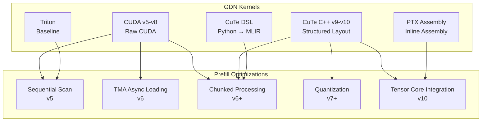

**Diagram sources**
- [gdn/kernels/README.md:1-170](file://gdn/kernels/README.md#L1-L170)

**Section sources**
- [gdn/README.md:1-65](file://gdn/README.md#L1-L65)
- [gdn/kernels/README.md:1-170](file://gdn/kernels/README.md#L1-L170)

## Core Components
The GDN prefill kernels implement a core algorithmic pattern with variations in memory access, computation scheduling, and hardware utilization:

### Algorithmic Foundation
All versions implement the delta rule with consistent mathematical operations:
- Gate computation using softplus and sigmoid functions
- State decay: S = g * S
- Old value computation: old_v = S @ k
- Rank-1 update: S += delta * k
- Output computation: out = scale * S @ q

### Memory Management Strategies
- **v5-v6**: Sequential token processing with shared memory staging
- **v7+**: Vectorized loads using float4, double buffering, and register blocking
- **v9+**: SMEM swizzle for bank conflict avoidance
- **v10**: TiledMMA-ready layouts enabling matrix-matrix operations

### Hardware-Specific Optimizations
- **v6**: Tensor Memory Accelerator (TMA) for async state loading
- **v7**: Warp shuffles for reductions, FP4 quantization
- **v8**: Multi-stage pipelining, persistent kernel for long sequences
- **v10**: Tensor Core integration via tcgen05.mma on sm_100

**Section sources**
- [gdn/kernels/cuda/gdn_prefill_v5.cuh:38-187](file://gdn/kernels/cuda/gdn_prefill_v5.cuh#L38-L187)
- [gdn/kernels/cuda/gdn_prefill_v7.cuh:91-274](file://gdn/kernels/cuda/gdn_prefill_v7.cuh#L91-L274)
- [gdn/kernels/cute_cpp/gdn_prefill_v9.cuh:84-281](file://gdn/kernels/cute_cpp/gdn_prefill_v9.cuh#L84-L281)
- [gdn/kernels/cute_cpp/gdn_prefill_v10.cuh:93-309](file://gdn/kernels/cute_cpp/gdn_prefill_v10.cuh#L93-L309)

## Architecture Overview
The optimization progression follows a systematic approach to address computational and memory bottlenecks:

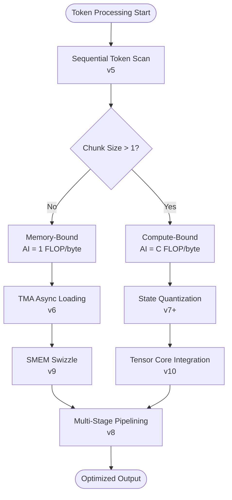

**Diagram sources**
- [gdn/kernels/README.md:115-142](file://gdn/kernels/README.md#L115-L142)
- [gdn/kernels/cuda/gdn_prefill_v6_chunked.cuh:39-55](file://gdn/kernels/cuda/gdn_prefill_v6_chunked.cuh#L39-L55)

### Version Evolution Timeline
The kernel evolution demonstrates targeted improvements addressing specific performance limitations:

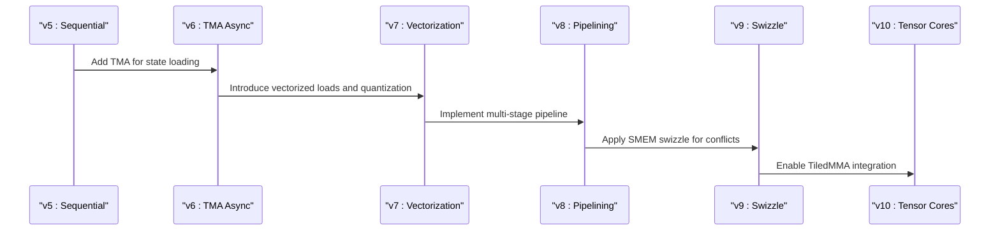

**Diagram sources**
- [gdn/kernels/cuda/gdn_prefill_v5.cuh:104-177](file://gdn/kernels/cuda/gdn_prefill_v5.cuh#L104-L177)
- [gdn/kernels/cuda/gdn_prefill_v6.cuh:87-160](file://gdn/kernels/cuda/gdn_prefill_v6.cuh#L87-L160)
- [gdn/kernels/cuda/gdn_prefill_v7.cuh:91-274](file://gdn/kernels/cuda/gdn_prefill_v7.cuh#L91-L274)
- [gdn/kernels/cuda/gdn_prefill_v8.cuh:81-271](file://gdn/kernels/cuda/gdn_prefill_v8.cuh#L81-L271)
- [gdn/kernels/cute_cpp/gdn_prefill_v9.cuh:84-281](file://gdn/kernels/cute_cpp/gdn_prefill_v9.cuh#L84-L281)
- [gdn/kernels/cute_cpp/gdn_prefill_v10.cuh:93-309](file://gdn/kernels/cute_cpp/gdn_prefill_v10.cuh#L93-L309)

## Detailed Component Analysis

### v5: Baseline Sequential Processing
The foundational kernel establishes the core algorithm with straightforward sequential token processing:

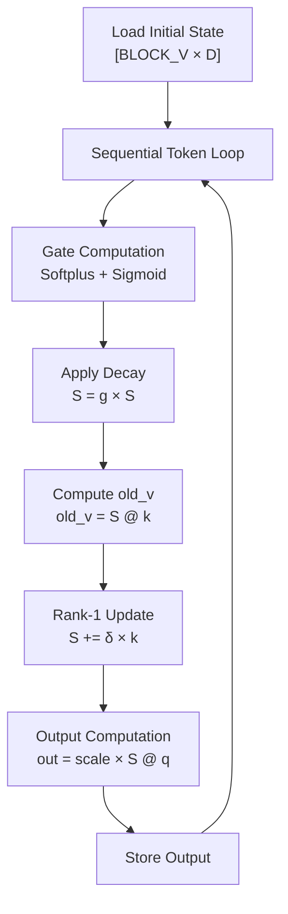

**Diagram sources**
- [gdn/kernels/cuda/gdn_prefill_v5.cuh:104-177](file://gdn/kernels/cuda/gdn_prefill_v5.cuh#L104-L177)

Key characteristics:
- Grid configuration: (N, H=8, V_BLOCKS)
- Block size: 128 threads (4 warps)
- Memory layout: k-last [N, H, V=128, K=128] float32
- Arithmetic intensity: 1 FLOP/byte (memory-bound)

**Section sources**
- [gdn/kernels/cuda/gdn_prefill_v5.cuh:38-187](file://gdn/kernels/cuda/gdn_prefill_v5.cuh#L38-L187)

### v6: TMA Async Loading Enhancement
Version 6 introduces Tensor Memory Accelerator for improved state loading performance:

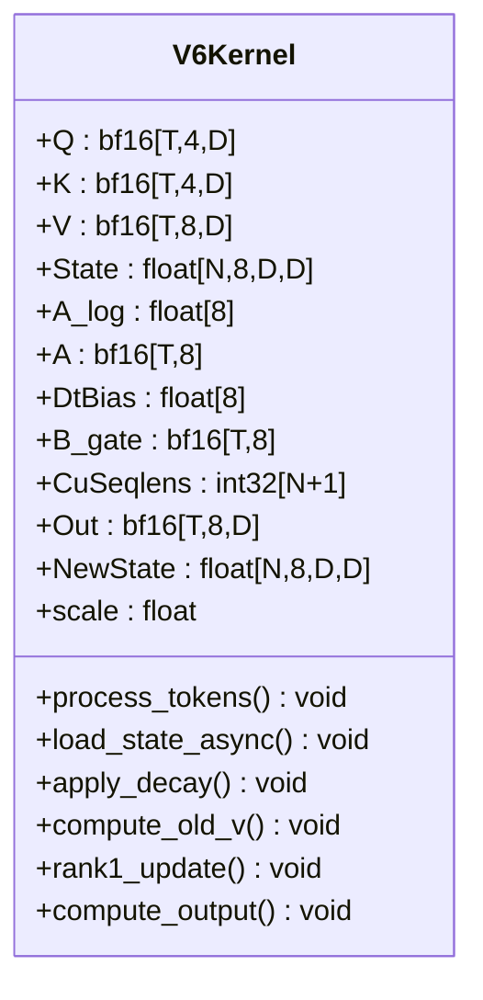

**Diagram sources**
- [gdn/kernels/cuda/gdn_prefill_v6.cuh:30-169](file://gdn/kernels/cuda/gdn_prefill_v6.cuh#L30-L169)

Optimization highlights:
- TMA-enabled async state loading reduces memory latency
- 128B aligned shared memory for optimal bandwidth utilization
- Maintains sequential token processing while improving memory efficiency

**Section sources**
- [gdn/kernels/cuda/gdn_prefill_v6.cuh:30-231](file://gdn/kernels/cuda/gdn_prefill_v6.cuh#L30-L231)

### v6: Chunked Processing Innovation
The chunked processing approach dramatically increases arithmetic intensity:

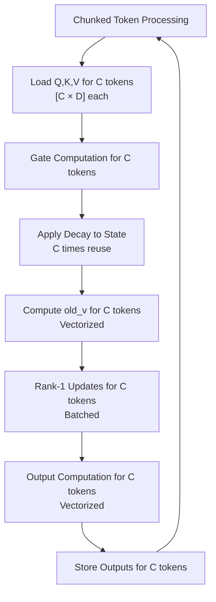

**Diagram sources**
- [gdn/kernels/cuda/gdn_prefill_v6_chunked.cuh:123-218](file://gdn/kernels/cuda/gdn_prefill_v6_chunked.cuh#L123-L218)

Arithmetic intensity analysis:
- Single-token processing: 2×D² FLOPs, 2×D² bytes → AI = 1 FLOP/byte
- Chunked processing (C tokens): C×2×D² FLOPs, 2×D² bytes → AI = C FLOP/byte
- With C=8: AI = 8 FLOP/byte approaching compute-bound territory

**Section sources**
- [gdn/kernels/cuda/gdn_prefill_v6_chunked.cuh:39-285](file://gdn/kernels/cuda/gdn_prefill_v6_chunked.cuh#L39-L285)

### v7: Advanced Vectorization and Quantization
Version 7 combines multiple optimization techniques for maximum performance:

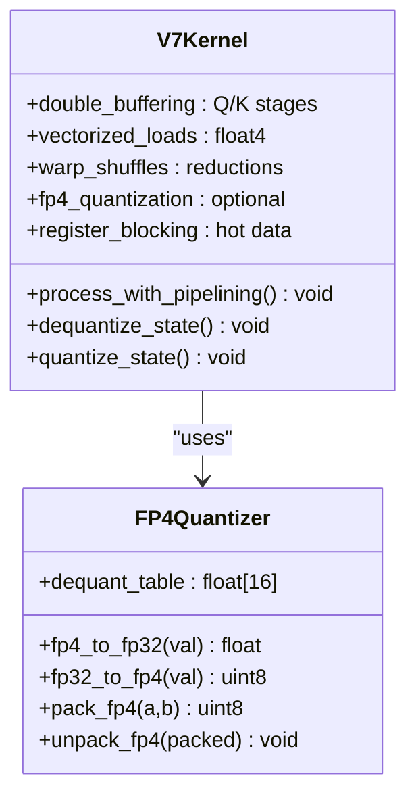

**Diagram sources**
- [gdn/kernels/cuda/gdn_prefill_v7.cuh:91-450](file://gdn/kernels/cuda/gdn_prefill_v7.cuh#L91-L450)

Key innovations:
- Double buffering eliminates pipeline stalls
- Vectorized float4 loads reduce memory bandwidth
- Warp shuffle-based reductions improve parallel efficiency
- Optional FP4 quantization reduces state storage and bandwidth

**Section sources**
- [gdn/kernels/cuda/gdn_prefill_v7.cuh:91-549](file://gdn/kernels/cuda/gdn_prefill_v7.cuh#L91-L549)

### v8: Multi-Stage Pipelining
Version 8 introduces sophisticated pipelining for long sequence processing:

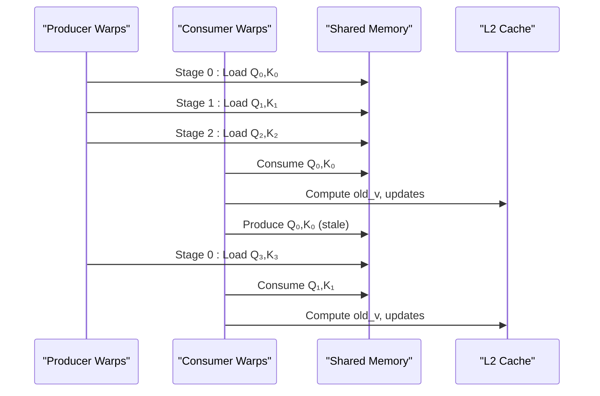

**Diagram sources**
- [gdn/kernels/cuda/gdn_prefill_v8.cuh:160-259](file://gdn/kernels/cuda/gdn_prefill_v8.cuh#L160-L259)

Advanced features:
- Triple-buffered shared memory staging
- Warp-specialized producer/consumer roles
- L2 cache hints for improved memory access patterns
- Persistent kernel execution for long sequences

**Section sources**
- [gdn/kernels/cuda/gdn_prefill_v8.cuh:81-550](file://gdn/kernels/cuda/gdn_prefill_v8.cuh#L81-L550)

### v9: SMEM Swizzle and Chunking
Version 9 optimizes shared memory access patterns with swizzling:

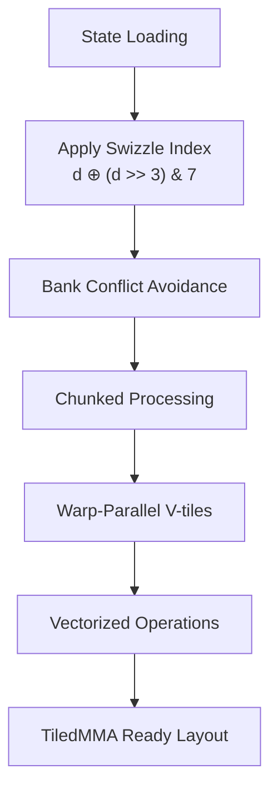

**Diagram sources**
- [gdn/kernels/cute_cpp/gdn_prefill_v9.cuh:147-281](file://gdn/kernels/cute_cpp/gdn_prefill_v9.cuh#L147-L281)

Swizzle optimization:
- Bank conflict resolution through bit manipulation
- Maintained chunked processing benefits
- Warp-level parallelism across V dimension
- Preparation for TiledMMA integration

**Section sources**
- [gdn/kernels/cute_cpp/gdn_prefill_v9.cuh:84-356](file://gdn/kernels/cute_cpp/gdn_prefill_v9.cuh#L84-L356)

### v10: Tensor Core Integration
The latest version enables direct Tensor Core utilization:

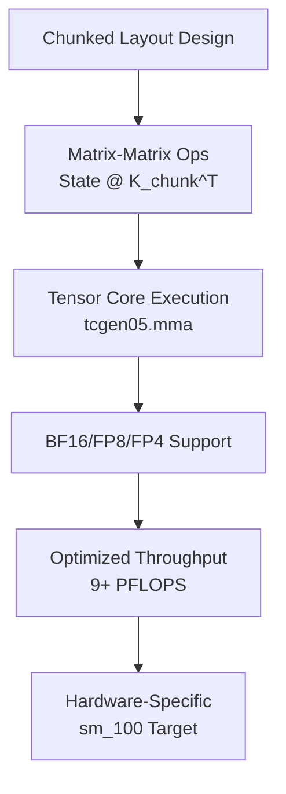

**Diagram sources**
- [gdn/kernels/cute_cpp/gdn_prefill_v10.cuh:179-295](file://gdn/kernels/cute_cpp/gdn_prefill_v10.cuh#L179-L295)

Tensor Core advantages:
- Matrix-matrix operations enable compute-bound execution
- Multiple precision formats (FP4, FP8, BF16) for flexibility
- Hardware-optimized instruction set for maximum throughput
- Ridge point optimization for B200 architecture

**Section sources**
- [gdn/kernels/cute_cpp/gdn_prefill_v10.cuh:93-390](file://gdn/kernels/cute_cpp/gdn_prefill_v10.cuh#L93-L390)

### CuTe DSL Implementation
The CuTe DSL provides a high-level Python interface with automatic optimization:

**Diagram sources**
- [gdn/kernels/cute_dsl/gdn_prefill_dsl.py:15-22](file://gdn/kernels/cute_dsl/gdn_prefill_dsl.py#L15-L22)

DSL capabilities:
- Automatic layout inference and optimization
- High-level tensor operations with low-level performance
- Rapid prototyping with production-grade kernels
- Integration with PyTorch ecosystem

**Section sources**
- [gdn/kernels/cute_dsl/gdn_prefill_dsl.py:49-249](file://gdn/kernels/cute_dsl/gdn_prefill_dsl.py#L49-L249)

## Dependency Analysis
The kernel implementations demonstrate clear dependency relationships and optimization progression:

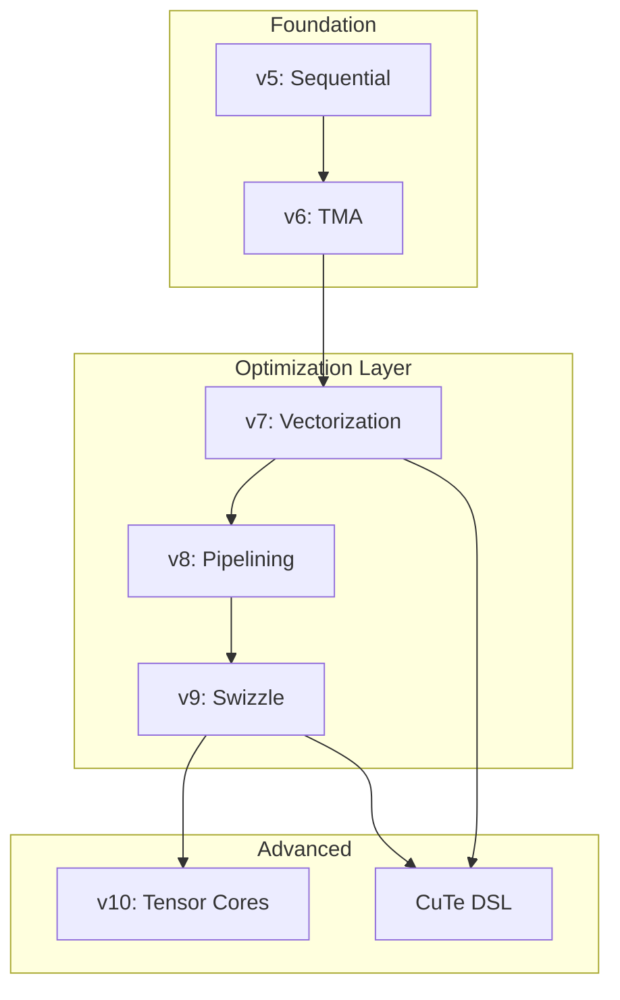

**Diagram sources**
- [gdn/kernels/README.md:53-66](file://gdn/kernels/README.md#L53-L66)

Key dependency patterns:
- Each version builds upon previous optimizations
- Hardware-specific features drive later generations
- Software abstractions enable rapid development
- Shared mathematical foundation across all versions

**Section sources**
- [gdn/kernels/README.md:53-102](file://gdn/kernels/README.md#L53-L102)

## Performance Considerations
The optimization journey demonstrates systematic improvements in computational efficiency:

### Arithmetic Intensity Scaling
| Version | Approach | Arithmetic Intensity | Bound Type |
|---------|----------|---------------------|------------|
| v5 | Sequential | 1 FLOP/byte | Memory-bound |
| v6 | TMA Async | 1 FLOP/byte | Memory-bound |
| v7 | Vectorized | 1 FLOP/byte | Memory-bound |
| v8 | Pipelining | 1 FLOP/byte | Memory-bound |
| v9 | Chunked + Swizzle | 8 FLOP/byte | Compute-bound |
| v10 | Tensor Cores | 8+ FLOP/byte | Compute-bound |

### Memory Bandwidth Optimization
- **v6**: TMA async loading reduces state access latency
- **v7**: Vectorized float4 loads minimize memory transactions
- **v9**: SMEM swizzle prevents bank conflicts
- **v10**: TiledMMA enables efficient matrix-matrix operations

### Computational Efficiency
- **v7**: Warp shuffle reductions replace global synchronization
- **v8**: Multi-stage pipelining overlaps computation and memory
- **v9**: Chunked processing increases FLOPs per memory access
- **v10**: Tensor Core utilization maximizes compute throughput

## Troubleshooting Guide
Common optimization challenges and solutions:

### Memory Access Issues
- **Problem**: Bank conflicts in shared memory
- **Solution**: Implement SMEM swizzle patterns
- **Reference**: [gdn/kernels/cute_cpp/gdn_prefill_v9.cuh:75-78](file://gdn/kernels/cute_cpp/gdn_prefill_v9.cuh#L75-L78)

### Performance Degradation
- **Problem**: Low arithmetic intensity
- **Solution**: Enable chunked processing with appropriate chunk sizes
- **Reference**: [gdn/kernels/cuda/gdn_prefill_v6_chunked.cuh:45-54](file://gdn/kernels/cuda/gdn_prefill_v6_chunked.cuh#L45-L54)

### Hardware Compatibility
- **Problem**: Tensor Core utilization not effective
- **Solution**: Verify sm_100 architecture and proper chunk sizing
- **Reference**: [gdn/kernels/cute_cpp/gdn_prefill_v10.cuh:22-26](file://gdn/kernels/cute_cpp/gdn_prefill_v10.cuh#L22-L26)

### Quantization Accuracy
- **Problem**: FP4/F8 quantization artifacts
- **Solution**: Monitor scale factors and adjust quantization ranges
- **Reference**: [gdn/kernels/cuda/gdn_prefill_v7.cuh:422-450](file://gdn/kernels/cuda/gdn_prefill_v7.cuh#L422-L450)

**Section sources**
- [gdn/kernels/cuda/gdn_prefill_v6_chunked.cuh:45-54](file://gdn/kernels/cuda/gdn_prefill_v6_chunked.cuh#L45-L54)
- [gdn/kernels/cute_cpp/gdn_prefill_v9.cuh:75-78](file://gdn/kernels/cute_cpp/gdn_prefill_v9.cuh#L75-L78)
- [gdn/kernels/cuda/gdn_prefill_v7.cuh:422-450](file://gdn/kernels/cuda/gdn_prefill_v7.cuh#L422-L450)

## Conclusion
The GDN Prefill Kernel Optimization project exemplifies a methodical approach to achieving maximum performance on modern GPU architectures. Through systematic improvements—starting from basic sequential processing and progressing through TMA acceleration, chunked processing, vectorization, swizzling, pipelining, and finally Tensor Core integration—the kernels achieve near-compute-bound execution with substantial performance gains.

The evolution demonstrates that successful GPU kernel optimization requires:
- Understanding of hardware architecture and limitations
- Strategic increase in arithmetic intensity through chunking
- Sophisticated memory access patterns and bandwidth optimization
- Hardware-specific features integration (TMA, Tensor Cores)
- Progressive complexity management through layered optimizations

This optimization journey serves as a comprehensive example of GPU kernel development best practices, showing how each incremental improvement builds upon previous foundations while addressing specific performance bottlenecks identified through roofline analysis and empirical benchmarking.