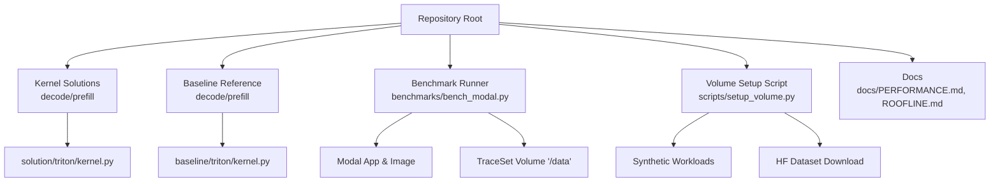
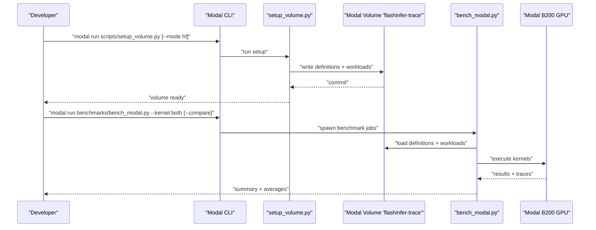

# Getting Started

<cite>
**Referenced Files in This Document**
- [README.md](file://README.md)
- [benchmarks/bench_modal.py](file://benchmarks/bench_modal.py)
- [scripts/setup_volume.py](file://scripts/setup_volume.py)
- [gdn_decode_qk4_v8_d128_k_last/solution/triton/kernel.py](file://gdn_decode_qk4_v8_d128_k_last/solution/triton/kernel.py)
- [gdn_prefill_qk4_v8_d128_k_last/solution/triton/kernel.py](file://gdn_prefill_qk4_v8_d128_k_last/solution/triton/kernel.py)
- [gdn_decode_qk4_v8_d128_k_last/baseline/triton/kernel.py](file://gdn_decode_qk4_v8_d128_k_last/baseline/triton/kernel.py)
- [gdn_prefill_qk4_v8_d128_k_last/baseline/triton/kernel.py](file://gdn_prefill_qk4_v8_d128_k_last/baseline/triton/kernel.py)
- [gdn_decode_qk4_v8_d128_k_last/config.toml](file://gdn_decode_qk4_v8_d128_k_last/config.toml)
- [gdn_prefill_qk4_v8_d128_k_last/config.toml](file://gdn_prefill_qk4_v8_d128_k_last/config.toml)
- [docs/PERFORMANCE.md](file://docs/PERFORMANCE.md)
- [.claude/settings.local.json](file://.claude/settings.local.json)
- [scripts/debug_prefill.py](file://scripts/debug_prefill.py)
</cite>

## Table of Contents
1. [Introduction](#introduction)
2. [Prerequisites](#prerequisites)
3. [Project Structure](#project-structure)
4. [Step-by-Step Setup](#step-by-step-setup)
5. [First Benchmark Run](#first-benchmark-run)
6. [Workflow Overview](#workflow-overview)
7. [Troubleshooting Guide](#troubleshooting-guide)
8. [Conclusion](#conclusion)

## Introduction
This guide helps you get started with the FlashInfer-GatedDelta project. It covers prerequisites, environment setup on Modal, running correctness checks and full benchmarks, and interpreting results. The project implements Triton kernels for two Gated Delta Net kernels (decode and prefill) and compares them against a Python baseline using the flashinfer-bench framework on Modal B200 GPUs.

## Prerequisites
To effectively use this project, you should be familiar with:
- CUDA and Triton programming basics
- GPU memory hierarchy and performance characteristics
- Modal cloud platform usage (CLI, volumes, GPU instances)
- Python packaging and dependency management

These topics are essential because:
- The kernels are written in Triton and compiled to CUDA; understanding CUDA memory access patterns and occupancy is crucial for optimization.
- Modal manages compute resources and persistent storage; you will use Modal volumes to host benchmark datasets and run GPU-accelerated jobs.
- The benchmark harness relies on the flashinfer-bench framework to validate correctness and measure performance.

**Section sources**
- [README.md:21-42](file://README.md#L21-L42)
- [benchmarks/bench_modal.py:106-111](file://benchmarks/bench_modal.py#L106-L111)

## Project Structure
At a high level, the repository contains:
- Kernel implementations for decode and prefill (Triton)
- A Python baseline reference for correctness
- Benchmark runner and Modal app orchestration
- Scripts to initialize Modal volumes with dataset definitions and workloads
- Documentation for performance and roofline analysis



**Diagram sources**
- [README.md:44-60](file://README.md#L44-L60)
- [benchmarks/bench_modal.py:23-31](file://benchmarks/bench_modal.py#L23-L31)
- [scripts/setup_volume.py:16-29](file://scripts/setup_volume.py#L16-L29)

**Section sources**
- [README.md:44-60](file://README.md#L44-L60)

## Step-by-Step Setup
Follow these steps to prepare your environment and run the first benchmark.

### 1) Install Modal CLI and log in
- Install the Modal CLI and authenticate with your account.
- Ensure you have permission to create and use Modal volumes and run GPU apps.

### 2) Initialize Modal Volume with Definitions and Workloads
Run the setup script to populate the Modal volume with kernel definitions and workloads. You can either:
- Generate synthetic workloads locally and upload them, or
- Download the official contest dataset from HuggingFace.

```bash
# Option A: Synthetic workloads (default)
modal run scripts/setup_volume.py

# Option B: Download from HuggingFace
modal run scripts/setup_volume.py --mode hf
```

What happens:
- The script creates a Modal volume named "flashinfer-trace" and writes definition files and workloads under "/data".
- For prefill, it generates and saves tensors (e.g., cu_seqlens, normalized k, zero state) as safetensors for reproducible inputs.

**Section sources**
- [README.md:23-29](file://README.md#L23-L29)
- [scripts/setup_volume.py:204-220](file://scripts/setup_volume.py#L204-L220)
- [scripts/setup_volume.py:141-173](file://scripts/setup_volume.py#L141-L173)
- [scripts/setup_volume.py:175-202](file://scripts/setup_volume.py#L175-L202)

### 3) Verify Volume Content
After setup, confirm that:
- Definition files exist for both kernels under "/data/definitions/gdn/"
- Workload files exist under "/data/workloads/gdn/"
- For prefill, safetensors are present under "/data/tensors/gdn_prefill/"

### 4) Configure Local Environment (Optional)
If you want to run commands locally or inspect configuration files, review:
- Kernel build metadata in TOML files for each kernel
- Local permissions for Claude integration (if applicable)

**Section sources**
- [gdn_decode_qk4_v8_d128_k_last/config.toml:1-10](file://gdn_decode_qk4_v8_d128_k_last/config.toml#L1-L10)
- [gdn_prefill_qk4_v8_d128_k_last/config.toml:1-10](file://gdn_prefill_qk4_v8_d128_k_last/config.toml#L1-L10)
- [.claude/settings.local.json:1-10](file://.claude/settings.local.json#L1-L10)

## First Benchmark Run
There are two recommended paths to validate your setup quickly.

### A) Correctness Check (Fast)
Run a minimal benchmark to verify correctness and basic performance:
```bash
modal run benchmarks/bench_modal.py --kernel both --warmup 0 --iters 1 --trials 1
```
What this does:
- Runs both kernels with very few iterations and trials.
- Uses the Modal volume containing definitions and workloads.
- Compares your optimized solution against the Python baseline when requested.

Expected outcome:
- You see per-workload results and average speedup for each kernel.
- The baseline provides a correctness reference.

**Section sources**
- [README.md:33-42](file://README.md#L33-L42)
- [benchmarks/bench_modal.py:241-307](file://benchmarks/bench_modal.py#L241-L307)

### B) Full Benchmark
For comprehensive results:
```bash
modal run benchmarks/bench_modal.py --kernel both
```
Or compare solution vs baseline:
```bash
modal run benchmarks/bench_modal.py --kernel both --compare
```

What this does:
- Uses the default benchmark configuration (warmup, iterations, trials) suitable for full evaluation.
- Spawns parallel jobs for solution and baseline (when comparing).
- Aggregates results and prints averages.

**Section sources**
- [README.md:33-42](file://README.md#L33-L42)
- [benchmarks/bench_modal.py:118-121](file://benchmarks/bench_modal.py#L118-L121)
- [benchmarks/bench_modal.py:274-282](file://benchmarks/bench_modal.py#L274-L282)

## Workflow Overview
The typical workflow from setup to first successful run:



**Diagram sources**
- [scripts/setup_volume.py:204-220](file://scripts/setup_volume.py#L204-L220)
- [benchmarks/bench_modal.py:241-307](file://benchmarks/bench_modal.py#L241-L307)

## Troubleshooting Guide
Common issues and resolutions:

- Problem: Definition not found in volume
  - Symptom: Error indicating the kernel definition is missing.
  - Cause: Volume was not initialized or definitions were not uploaded.
  - Fix: Re-run the setup script and ensure definitions exist under "/data/definitions/gdn/".

- Problem: No workloads for the selected kernel
  - Symptom: Error stating there are no workloads for the definition.
  - Cause: Workload file missing or empty.
  - Fix: Re-run setup to regenerate workloads; verify "/data/workloads/gdn/" entries.

- Problem: HuggingFace download fails
  - Symptom: Network or credential errors during HF dataset download.
  - Fix: Ensure you have access to the dataset repository; retry with a stable network connection.

- Problem: Triton compilation or runtime errors
  - Symptom: Kernel launch failures or invalid configurations.
  - Fix: Confirm Triton and CUDA versions match the kernel expectations; check kernel grid/block sizes and memory alignment.

- Problem: Baseline vs solution mismatch
  - Symptom: Large numerical differences.
  - Fix: Use the debug script to compare outputs directly on the same inputs and device.

Additional diagnostic tips:
- Use the debug script to compare reference and solution outputs on a small, fixed input.
- Review kernel comments and grid layouts to ensure inputs match expected shapes.

**Section sources**
- [benchmarks/bench_modal.py:125-133](file://benchmarks/bench_modal.py#L125-L133)
- [scripts/setup_volume.py:180-201](file://scripts/setup_volume.py#L180-L201)
- [scripts/debug_prefill.py:14-305](file://scripts/debug_prefill.py#L14-L305)

## Conclusion
You are now ready to run correctness checks and full benchmarks for the Gated Delta Net kernels on Modal B200. Start with the quick correctness run, then proceed to the full benchmark with optional baseline comparison. Use the troubleshooting section to resolve common setup and runtime issues. As you become more familiar, explore the kernel implementations and performance documentation to deepen your understanding.