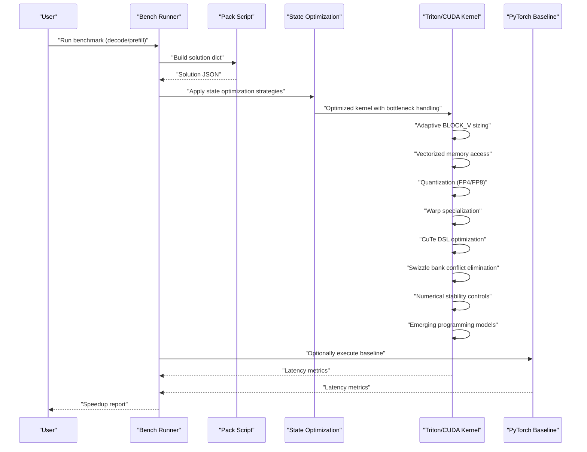
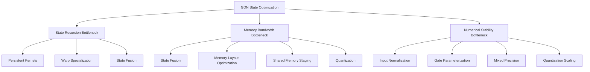
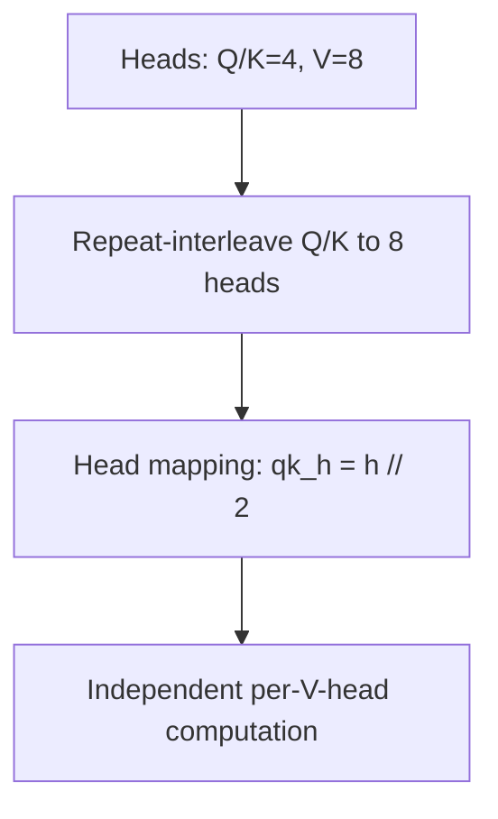
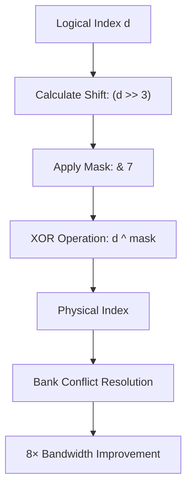
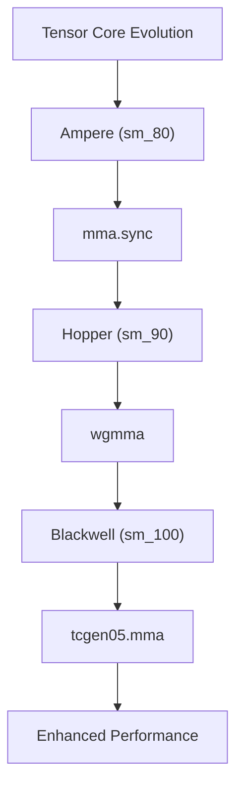
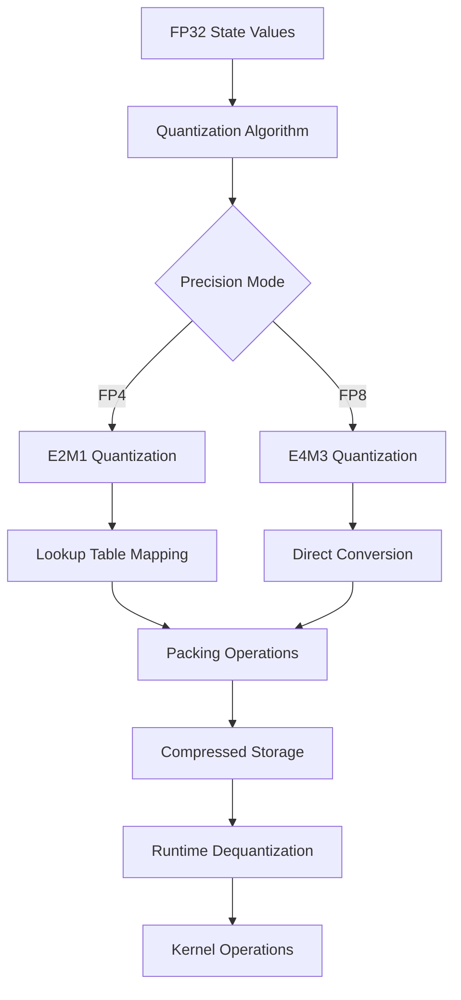
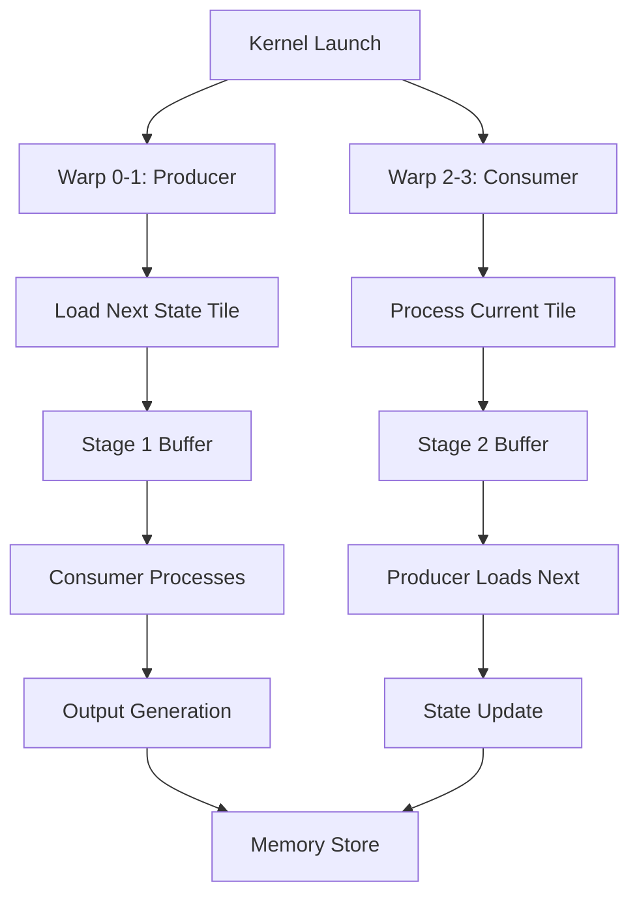
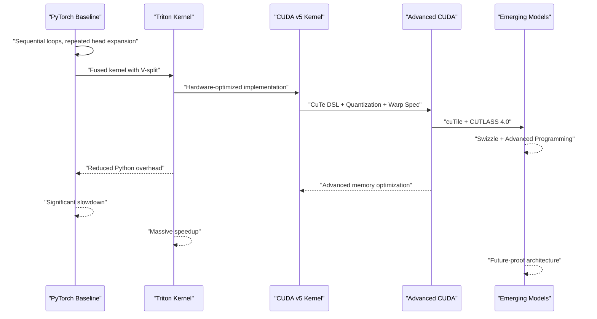
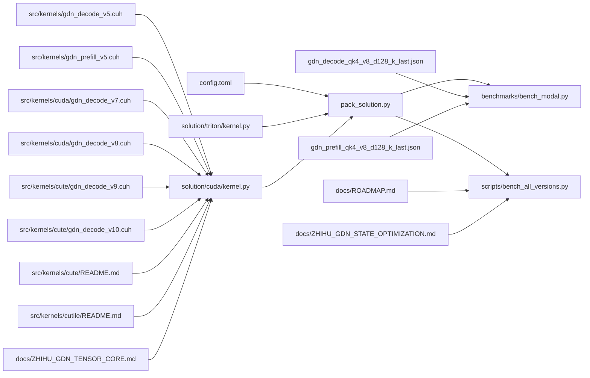

# Optimization Strategies

<cite>
**Referenced Files in This Document**
- [docs/ZHIHU_GDN_STATE_OPTIMIZATION.md](file://docs/ZHIHU_GDN_STATE_OPTIMIZATION.md)
- [gdn_decode_qk4_v8_d128_k_last/config.toml](file://gdn_decode_qk4_v8_d128_k_last/config.toml)
- [gdn_prefill_qk4_v8_d128_k_last/config.toml](file://gdn_prefill_qk4_v8_d128_k_last/config.toml)
- [gdn_decode_qk4_v8_d128_k_last/baseline/triton/kernel.py](file://gdn_decode_qk4_v8_d128_k_last/baseline/triton/kernel.py)
- [gdn_prefill_qk4_v8_d128_k_last/baseline/triton/kernel.py](file://gdn_prefill_qk4_v8_d128_k_last/baseline/triton/kernel.py)
- [gdn_decode_qk4_v8_d128_k_last/solution/triton/kernel.py](file://gdn_decode_qk4_v8_d128_k_last/solution/triton/kernel.py)
- [gdn_prefill_qk4_v8_d128_k_last/solution/triton/kernel.py](file://gdn_prefill_qk4_v8_d128_k_last/solution/triton/kernel.py)
- [gdn_decode_qk4_v8_d128_k_last/solution/cuda/kernel.py](file://gdn_decode_qk4_v8_d128_k_last/solution/cuda/kernel.py)
- [gdn_prefill_qk4_v8_d128_k_last/solution/cuda/kernel.py](file://gdn_prefill_qk4_v8_d128_k_last/solution/cuda/kernel.py)
- [src/kernels/gdn_decode_v5.cuh](file://src/kernels/gdn_decode_v5.cuh)
- [src/kernels/gdn_prefill_v5.cuh](file://src/kernels/gdn_prefill_v5.cuh)
- [src/kernels/cute/gdn_decode_v9.cuh](file://src/kernels/cute/gdn_decode_v9.cuh)
- [src/kernels/cute/gdn_decode_v10.cuh](file://src/kernels/cute/gdn_decode_v10.cuh)
- [src/kernels/cuda/gdn_decode_v7.cuh](file://src/kernels/cuda/gdn_decode_v7.cuh)
- [src/kernels/cuda/gdn_decode_v8.cuh](file://src/kernels/cuda/gdn_decode_v8.cuh)
- [src/kernels/cute/README.md](file://src/kernels/cute/README.md)
- [docs/ROADMAP.md](file://docs/ROADMAP.md)
- [docs/PERFORMANCE.md](file://docs/PERFORMANCE.md)
- [docs/ROOFLINE.md](file://docs/ROOFLINE.md)
- [docs/ZHIHU_GDN_TENSOR_CORE.md](file://docs/ZHIHU_GDN_TENSOR_CORE.md)
- [src/kernels/cutile/README.md](file://src/kernels/cutile/README.md)
- [gdn_decode_qk4_v8_d128_k_last/scripts/pack_solution.py](file://gdn_decode_qk4_v8_d128_k_last/scripts/pack_solution.py)
- [gdn_prefill_qk4_v8_d128_k_last/scripts/pack_solution.py](file://gdn_prefill_qk4_v8_d128_k_last/scripts/pack_solution.py)
- [benchmarks/bench_modal.py](file://benchmarks/bench_modal.py)
- [scripts/bench_all_versions.py](file://scripts/bench_all_versions.py)
- [flashinfer_trace/definitions/gdn/gdn_decode_qk4_v8_d128_k_last.json](file://flashinfer_trace/definitions/gdn/gdn_decode_qk4_v8_d128_k_last.json)
- [flashinfer_trace/definitions/gdn/gdn_prefill_qk4_v8_d128_k_last.json](file://flashinfer_trace/definitions/gdn/gdn_prefill_qk4_v8_d128_k_last.json)
- [README.md](file://README.md)
</cite>

## Update Summary
**Changes Made**
- Added comprehensive GDN state optimization documentation covering three critical bottlenecks (state recursion, memory bandwidth, numerical stability)
- Updated optimization strategies to reflect detailed analysis of GDN kernel optimization challenges
- Enhanced coverage of decode and prefill phase optimization approaches
- Integrated new insights from state optimization research into existing documentation structure
- Expanded technical depth on state recursion, memory-bound optimization, and numerical stability considerations

## Table of Contents
1. [Introduction](#introduction)
2. [Project Structure](#project-structure)
3. [Core Components](#core-components)
4. [Architecture Overview](#architecture-overview)
5. [Detailed Component Analysis](#detailed-component-analysis)
6. [Dependency Analysis](#dependency-analysis)
7. [Performance Considerations](#performance-considerations)
8. [Troubleshooting Guide](#troubleshooting-guide)
9. [Conclusion](#conclusion)

## Introduction
This document explains the optimization strategies implemented in the Gated Delta Net (GDN) kernels for both decode and prefill stages, with a focus on the three fundamental bottlenecks that define GDN optimization challenges: state recursion, memory bandwidth, and numerical stability. The optimization approach recognizes that GDN's core resource is state rather than computation, requiring fundamentally different optimization strategies compared to traditional attention mechanisms.

The document covers:
- **State Recursion Bottleneck**: Time-dependent parallelism limitations and recursive dependency challenges
- **Memory Bandwidth Bottleneck**: State read/write operations being the dominant cost driver
- **Numerical Stability Bottleneck**: Low-precision compression constraints and stability requirements
- V-dimension splitting to improve SM occupancy and memory coalescing
- Memory optimization via register blocking, shared memory utilization, and optimal tensor layouts
- Grouped value attention (GVA) with Q/K head expansion and its efficiency benefits
- Advanced Swizzle memory access patterns with XOR-based bank conflict elimination
- Comprehensive Tensor Core evolution coverage from mma.sync to tcgen05.mma for Blackwell architecture
- Emerging GPU programming concepts including cuTile and CUTLASS 4.0
- Roofline analysis methodology and performance modeling to identify optimization opportunities
- Concrete examples from configuration and kernel files showing parameter tuning, block sizing, and hardware-specific adaptations
- The transition from a PyTorch baseline to a Triton implementation, highlighting fused operations and reduced Python overhead

## Project Structure
The repository organizes GDN kernels by stage (decode/prefill), with separate baseline and optimized Triton implementations, plus configuration and benchmarking support. The project now includes comprehensive state optimization documentation and advanced CUDA kernels with hardware-specific optimizations.

```mermaid
graph TB
subgraph "Kernel Versions"
V1["v1 - PyTorch Baseline"]
V2["v2 - Triton Fused"]
V3["v3 - Triton V-Split"]
V4["v4 - Adaptive BLOCK_V"]
V5["v5 - Production Baseline"]
V6["v6 - CUDA TMA"]
V7["v7 - FP4 Quantization"]
V8["v8 - FP8 + Warp Spec"]
V9["v9 - CuTe DSL"]
V10["v10 - CuTe Layout Algebra"]
end
subgraph "State Optimization"
STATE_RECURSION["State Recursion Analysis"]
MEMORY_BANDWIDTH["Memory Bandwidth Optimization"]
NUMERICAL_STABILITY["Numerical Stability Control"]
end
subgraph "Configuration"
D_CFG["gdn_decode_qk4_v8_d128_k_last/config.toml"]
P_CFG["gdn_prefill_qk4_v8_d128_k_last/config.toml"]
end
subgraph "Baseline (PyTorch)"
D_BASE["baseline/triton/kernel.py"]
P_BASE["baseline/triton/kernel.py"]
end
subgraph "Solution (Triton)"
D_SOL_TRITON["solution/triton/kernel.py"]
P_SOL_TRITON["solution/triton/kernel.py"]
end
subgraph "Solution (CUDA)"
D_SOL_CUDA["solution/cuda/kernel.py"]
P_SOL_CUDA["solution/cuda/kernel.py"]
end
subgraph "Advanced CUDA Kernels"
D_V7["gdn_decode_v7.cuh"]
D_V8["gdn_decode_v8.cuh"]
D_V9["gdn_decode_v9.cuh"]
D_V10["gdn_decode_v10.cuh"]
end
subgraph "Emerging Models"
C_README["cute/README.md"]
CUTILE_README["cutile/README.md"]
ZHIHU_DOC["ZHIHU_GDN_TENSOR_CORE.md"]
STATE_OPT["ZHIHU_GDN_STATE_OPTIMIZATION.md"]
end
subgraph "Benchmarking"
BENCH["benchmarks/bench_modal.py"]
ALL_BENCH["scripts/bench_all_versions.py"]
end
subgraph "Roadmap"
ROADMAP["docs/ROADMAP.md"]
PERFORMANCE["docs/PERFORMANCE.md"]
end
D_CFG --> V1
D_CFG --> V2
D_CFG --> V3
D_CFG --> V4
D_CFG --> V5
D_CFG --> V6
D_CFG --> V7
D_CFG --> V8
D_CFG --> V9
D_CFG --> V10
P_CFG --> V1
P_CFG --> V2
P_CFG --> V3
P_CFG --> V4
P_CFG --> V5
P_CFG --> V6
P_CFG --> V7
P_CFG --> V8
P_CFG --> V9
P_CFG --> V10
STATE_OPT --> STATE_RECURSION
STATE_OPT --> MEMORY_BANDWIDTH
STATE_OPT --> NUMERICAL_STABILITY
```



**Diagram sources**
- [docs/ROADMAP.md:1-180](file://docs/ROADMAP.md#L1-L180)
- [docs/ZHIHU_GDN_STATE_OPTIMIZATION.md:1-507](file://docs/ZHIHU_GDN_STATE_OPTIMIZATION.md#L1-L507)
- [gdn_decode_qk4_v8_d128_k_last/config.toml:1-10](file://gdn_decode_qk4_v8_d128_k_last/config.toml#L1-L10)
- [gdn_prefill_qk4_v8_d128_k_last/config.toml:1-10](file://gdn_prefill_qk4_v8_d128_k_last/config.toml#L1-L10)
- [src/kernels/cuda/gdn_decode_v7.cuh:1-200](file://src/kernels/cuda/gdn_decode_v7.cuh#L1-L200)
- [src/kernels/cuda/gdn_decode_v8.cuh:1-200](file://src/kernels/cuda/gdn_decode_v8.cuh#L1-L200)
- [src/kernels/cute/gdn_decode_v9.cuh:1-549](file://src/kernels/cute/gdn_decode_v9.cuh#L1-L549)
- [src/kernels/cute/gdn_decode_v10.cuh:1-485](file://src/kernels/cute/gdn_decode_v10.cuh#L1-L485)
- [src/kernels/cute/README.md:1-130](file://src/kernels/cute/README.md#L1-L130)
- [src/kernels/cutile/README.md:1-64](file://src/kernels/cutile/README.md#L1-L64)
- [docs/ZHIHU_GDN_TENSOR_CORE.md:1-837](file://docs/ZHIHU_GDN_TENSOR_CORE.md#L1-L837)
- [docs/PERFORMANCE.md:1-144](file://docs/PERFORMANCE.md#L1-L144)

**Section sources**
- [docs/ROADMAP.md:1-180](file://docs/ROADMAP.md#L1-L180)
- [docs/ZHIHU_GDN_STATE_OPTIMIZATION.md:1-507](file://docs/ZHIHU_GDN_STATE_OPTIMIZATION.md#L1-L507)
- [gdn_decode_qk4_v8_d128_k_last/config.toml:1-10](file://gdn_decode_qk4_v8_d128_k_last/config.toml#L1-L10)
- [gdn_prefill_qk4_v8_d128_k_last/config.toml:1-10](file://gdn_prefill_qk4_v8_d128_k_last/config.toml#L1-L10)

## Core Components
The GDN optimization strategy is built around three fundamental bottlenecks that define the optimization landscape:

### Primary Bottlenecks

**1. State Recursion Bottleneck**
- Current token result depends on previous step's state
- Decode stage has weak temporal parallelism
- Single token latency becomes critical
- Small batch scenarios struggle with GPU utilization
- Many optimizations cannot rely on "making matrices bigger"

**2. Memory Bandwidth Bottleneck**
- State read/write operations dominate computational cost
- Decode single token shows State Size and BW metrics
- Typical state tensor shape [B, 8, 128, 128] with ~1.05 MB per batch element
- Each token generation involves reading state, computing decay/mixing, then writing back
- Arithmetic intensity ≈ 1 FLOP/byte, far below B200 ridge point of ~9.3 FLOP/byte

**3. Numerical Stability Bottleneck**
- State updates sensitive to numerical instability
- Raw `k` generation can cause rapid state growth (up to 128x per step)
- Requires L2 normalization of `k` to prevent overflow
- Low-precision compression must be combined with scaling strategies
- Recurrent vs chunked implementations may have different numerical properties

### Supporting Optimizations
- Decode kernel: Single-token generation with GVA (num_q_heads=4, num_k_heads=4, num_v_heads=8) and k-last state layout [B, H, V, K]
- Prefill kernel: Variable-length batched forward pass with GVA and k-last state layout [N, H, V, K]
- Baseline implementations: Pure PyTorch loops for correctness verification
- Optimized Triton kernels: V-dimension splitting, register blocking, fused operations, and tiled state access
- Advanced CUDA kernels: Hardware-specific optimizations with CuTe DSL integration, quantization support, and warp specialization patterns
- Emerging GPU programming models: cuTile (CUDA 13.1) and CUTLASS 4.0 for advanced tensor operations

Key optimization highlights:
- V-dimension splitting: Splitting the V dimension across multiple programs (V_BLOCKS) improves SM occupancy and reduces per-program register pressure
- GVA expansion: Expanding Q/K heads to match V heads enables efficient computation with fewer cross-head dependencies
- Memory coalescing: Optimal tensor layouts and strides enable coalesced HBM access for state matrices
- Advanced Swizzle memory optimization: XOR-based bank conflict elimination using Swizzle<3,3,3> patterns for 32-bank shared memory systems
- Mathematical foundations: Bank conflict problem analysis and XOR-based swizzle transformation d ^ ((d >> 3) & 7)
- Tensor Core evolution: Complete coverage from Ampere mma.sync through Blackwell tcgen05.mma with performance metrics
- Emerging programming models: cuTile Python API and CUTLASS 4.0 DSL for advanced GPU programming
- Roofline modeling: Arithmetic intensity analysis identifies memory-bound regimes and targets bandwidth utilization

**Section sources**
- [docs/ZHIHU_GDN_STATE_OPTIMIZATION.md:38-507](file://docs/ZHIHU_GDN_STATE_OPTIMIZATION.md#L38-L507)
- [gdn_decode_qk4_v8_d128_k_last/baseline/triton/kernel.py:1-101](file://gdn_decode_qk4_v8_d128_k_last/baseline/triton/kernel.py#L1-L101)
- [gdn_prefill_qk4_v8_d128_k_last/baseline/triton/kernel.py:1-99](file://gdn_prefill_qk4_v8_d128_k_last/baseline/triton/kernel.py#L1-L99)
- [gdn_decode_qk4_v8_d128_k_last/solution/triton/kernel.py:1-136](file://gdn_decode_qk4_v8_d128_k_last/solution/triton/kernel.py#L1-L136)
- [gdn_prefill_qk4_v8_d128_k_last/solution/triton/kernel.py:1-148](file://gdn_prefill_qk4_v8_d128_k_last/solution/triton/kernel.py#L1-L148)
- [src/kernels/cute/gdn_decode_v9.cuh:1-549](file://src/kernels/cute/gdn_decode_v9.cuh#L1-L549)
- [src/kernels/cute/gdn_decode_v10.cuh:1-485](file://src/kernels/cute/gdn_decode_v10.cuh#L1-L485)
- [src/kernels/cuda/gdn_decode_v7.cuh:1-200](file://src/kernels/cuda/gdn_decode_v7.cuh#L1-L200)
- [src/kernels/cuda/gdn_decode_v8.cuh:1-200](file://src/kernels/cuda/gdn_decode_v8.cuh#L1-L200)
- [docs/ROOFLINE.md:1-89](file://docs/ROOFLINE.md#L1-L89)
- [docs/ZHIHU_GDN_TENSOR_CORE.md:7-690](file://docs/ZHIHU_GDN_TENSOR_CORE.md#L7-L690)
- [src/kernels/cute/README.md:1-130](file://src/kernels/cute/README.md#L1-L130)
- [src/kernels/cutile/README.md:1-64](file://src/kernels/cutile/README.md#L1-L64)

## Architecture Overview
The optimization pipeline addresses the three fundamental GDN bottlenecks through specialized approaches for decode and prefill phases. The architecture recognizes that GDN's core resource is state rather than computation, requiring fundamentally different optimization strategies.



**Diagram sources**
- [benchmarks/bench_modal.py:250-330](file://benchmarks/bench_modal.py#L250-L330)
- [scripts/bench_all_versions.py:1-200](file://scripts/bench_all_versions.py#L1-L200)
- [gdn_decode_qk4_v8_d128_k_last/scripts/pack_solution.py:20-52](file://gdn_decode_qk4_v8_d128_k_last/scripts/pack_solution.py#L20-L52)
- [gdn_prefill_qk4_v8_d128_k_last/scripts/pack_solution.py:20-52](file://gdn_prefill_qk4_v8_d128_k_last/scripts/pack_solution.py#L20-L52)
- [src/kernels/cuda/gdn_decode_v7.cuh:85-125](file://src/kernels/cuda/gdn_decode_v7.cuh#L85-L125)
- [src/kernels/cuda/gdn_decode_v8.cuh:135-158](file://src/kernels/cuda/gdn_decode_v8.cuh#L135-L158)
- [src/kernels/cute/gdn_decode_v9.cuh:65-90](file://src/kernels/cute/gdn_decode_v9.cuh#L65-L90)
- [src/kernels/cute/gdn_decode_v10.cuh:48-62](file://src/kernels/cute/gdn_decode_v10.cuh#L48-L62)
- [docs/ZHIHU_GDN_TENSOR_CORE.md:78-122](file://docs/ZHIHU_GDN_TENSOR_CORE.md#L78-L122)
- [src/kernels/cute/README.md:34-79](file://src/kernels/cute/README.md#L34-L79)

## Detailed Component Analysis

### Three Fundamental Bottlenecks Analysis

#### State Recursion Bottleneck
**Problem**: Current token result depends on previous step's state, creating inherent serial dependencies that limit temporal parallelism.

**Impact**: 
- Single token latency becomes the dominant performance metric
- Kernel launch overhead becomes significant in small batch scenarios
- GPU utilization struggles with small batches due to limited parallelism
- Many optimization approaches relying on "larger matrices" are ineffective

**Solutions**:
- **Persistent kernels**: Keep kernels resident to reduce launch overhead
- **Warp specialization**: Divide warps between producer (loading) and consumer (computing) tasks
- **Fusion**: Combine multiple state operations into single kernel to minimize state I/O
- **Adaptive BLOCK_V**: Smaller tiles for better occupancy in small batch scenarios

#### Memory Bandwidth Bottleneck
**Problem**: State read/write operations dominate computational costs, with arithmetic intensity of ~1 FLOP/byte.

**Analysis**:
- Decode single token generates ~1.05 MB state traffic per batch element
- Typical state tensor [B, 8, 128, 128] with float32 requires ~1.05 MB per element
- Arithmetic intensity ≈ 1 FLOP/byte, far below B200 ridge point of ~9.3 FLOP/byte
- Bandwidth utilization approaches 95% of peak at large batch sizes

**Solutions**:
- **State fusion**: Single kernel execution to avoid multiple state read/write cycles
- **Memory layout optimization**: k-last layout [B, H, V, K] for coalesced access
- **Shared memory staging**: Reduce HBM bandwidth through SMEM caching
- **Quantization**: FP4/FP8 compression to reduce state traffic (2x-4x reduction)
- **Bank conflict elimination**: XOR-based swizzle patterns to avoid 32-way conflicts

#### Numerical Stability Bottleneck
**Problem**: State updates sensitive to numerical instability, particularly with raw random `k` generation.

**Analysis**:
- Raw `k` generation can lead to ||k||² ≈ 128, causing state growth of up to 128x per step
- Even float32 may overflow after dozens of steps from zero state
- Requires L2 normalization of `k` to control growth
- Low-precision compression must be combined with scaling strategies

**Solutions**:
- **Input normalization**: L2 normalize `k` or equivalent scaling
- **Gate parameterization**: Use sigmoid/softplus/exp(-exp()) mappings
- **Mixed precision**: Store state in lower precision, but accumulate in higher precision
- **Quantization scaling**: For FP8/Fp4, maintain per-tile scales for dynamic range control



**Diagram sources**
- [docs/ZHIHU_GDN_STATE_OPTIMIZATION.md:243-266](file://docs/ZHIHU_GDN_STATE_OPTIMIZATION.md#L243-L266)
- [docs/ZHIHU_GDN_STATE_OPTIMIZATION.md:267-481](file://docs/ZHIHU_GDN_STATE_OPTIMIZATION.md#L267-L481)

**Section sources**
- [docs/ZHIHU_GDN_STATE_OPTIMIZATION.md:53-158](file://docs/ZHIHU_GDN_STATE_OPTIMIZATION.md#L53-L158)
- [docs/ZHIHU_GDN_STATE_OPTIMIZATION.md:159-266](file://docs/ZHIHU_GDN_STATE_OPTIMIZATION.md#L159-L266)
- [docs/ZHIHU_GDN_STATE_OPTIMIZATION.md:267-481](file://docs/ZHIHU_GDN_STATE_OPTIMIZATION.md#L267-L481)

### V-Dimension Splitting for Parallelism and Occupancy
- Strategy: Split the V dimension into V_BLOCKS programs so each program operates on a BLOCK_V×K tile of the state matrix.
- Benefits:
  - Much better SM occupancy at small batches (4× more programs).
  - Reduced per-program register state (smaller tiles reduce register pressure).
  - Fully independent V slices: each BLOCK_V×K tile can be computed independently.
- Implementation details:
  - Grid shape includes (B, H=8, V_BLOCKS) for decode and (N, H=8, V_BLOCKS) for prefill.
  - Adaptive BLOCK_V sizing: 16 for small batches (B ≤ 16), 32 for medium (B ≤ 128), 64 for large batches.
  - Each program computes on S[BLOCK_V, K] and produces output for the corresponding V-slice.


**Diagram sources**
- [gdn_decode_qk4_v8_d128_k_last/solution/triton/kernel.py:90-96](file://gdn_decode_qk4_v8_d128_k_last/solution/triton/kernel.py#L90-L96)
- [gdn_prefill_qk4_v8_d128_k_last/solution/triton/kernel.py:103-107](file://gdn_prefill_qk4_v8_d128_k_last/solution/triton/kernel.py#L103-L107)
- [gdn_decode_qk4_v8_d128_k_last/solution/cuda/kernel.py:209-215](file://gdn_decode_qk4_v8_d128_k_last/solution/cuda/kernel.py#L209-L215)
- [gdn_prefill_qk4_v8_d128_k_last/solution/cuda/kernel.py:220-224](file://gdn_prefill_qk4_v8_d128_k_last/solution/cuda/kernel.py#L220-L224)

**Section sources**
- [gdn_decode_qk4_v8_d128_k_last/solution/triton/kernel.py:5-15](file://gdn_decode_qk4_v8_d128_k_last/solution/triton/kernel.py#L5-L15)
- [gdn_decode_qk4_v8_d128_k_last/solution/triton/kernel.py:90-96](file://gdn_decode_qk4_v8_d128_k_last/solution/triton/kernel.py#L90-L96)
- [gdn_prefill_qk4_v8_d128_k_last/solution/triton/kernel.py:5-15](file://gdn_prefill_qk4_v8_d128_k_last/solution/triton/kernel.py#L5-L15)
- [gdn_prefill_qk4_v8_d128_k_last/solution/triton/kernel.py:103-107](file://gdn_prefill_qk4_v8_d128_k_last/solution/triton/kernel.py#L103-L107)
- [gdn_decode_qk4_v8_d128_k_last/solution/cuda/kernel.py:209-215](file://gdn_decode_qk4_v8_d128_k_last/solution/cuda/kernel.py#L209-L215)
- [gdn_prefill_qk4_v8_d128_k_last/solution/cuda/kernel.py:220-224](file://gdn_prefill_qk4_v8_d128_k_last/solution/cuda/kernel.py#L220-L224)

### Memory Optimization Approaches
- Register blocking:
  - Each program processes a BLOCK_V×K tile, reducing register footprint compared to full 128×128 tiles.
  - Adaptive sizing reduces register pressure: 16KB for BLOCK_V=16, 32KB for BLOCK_V=32, 64KB for BLOCK_V=64.
  - Reduces per-program register pressure, enabling more concurrent blocks per SM.
- Shared memory utilization:
  - Advanced CUDA kernels utilize shared memory with cuTTTML swizzled layouts for state tiles, Q/K vectors, and intermediate computations.
  - Cooperative loading mechanisms distribute memory access across threads for optimal bandwidth utilization.
  - XOR-based swizzling prevents bank conflicts through strategic index permutation.
  - Mathematical foundation: Swizzle<3,3,3> pattern d ^ ((d >> 3) & 7) eliminates 8-way bank conflicts.
- Optimal tensor layouts:
  - k-last layout [B, H, V, K] allows coalesced access to state matrices along contiguous dimensions.
  - Stride-based indexing ensures coalesced reads/writes for state tiles.
- Vectorized memory access patterns:
  - Float4 loads for coalesced memory access in CUDA v5 kernels.
  - 128-bit aligned loads for improved bandwidth utilization.
- Async memory copy operations:
  - cp.async for overlapping memory transfers with computation.
  - Improved bandwidth utilization through asynchronous data movement.
- CuTe DSL memory optimization:
  - Layout abstractions for efficient tensor operations.
  - TMA (Tensor Memory Accelerator) support for bulk memory transfers.
  - Automatic bank conflict resolution through swizzle patterns.
- Emerging GPU programming models:
  - cuTile Python API for high-level tile-based programming.
  - CUTLASS 4.0 DSL for advanced tensor operations and layout management.
- Contiguity and caching:
  - Contiguous tensors are prepared before kernel launch to minimize pointer indirection and improve cache locality.

Concrete examples:
- Block size selection: Adaptive BLOCK_V=16 for B≤16, BLOCK_V=32 for B≤128, BLOCK_V=64 for larger batches.
- Grid sizing: (B, H=8, V_BLOCKS) for decode; (N, H=8, V_BLOCKS) for prefill.
- Stride passing: Explicit strides passed to kernel to support coalesced access.
- CUDA v5 shared memory layout: Separate sections for Q, K, V, state tiles, and intermediate results.
- CuTe swizzle patterns: XOR-based index transformation to avoid shared memory bank conflicts.
- Mathematical swizzle implementation: d ^ ((d >> 3) & 7) for 32-bank SMEM systems.

**Section sources**
- [gdn_decode_qk4_v8_d128_k_last/solution/triton/kernel.py:90-96](file://gdn_decode_qk4_v8_d128_k_last/solution/triton/kernel.py#L90-L96)
- [gdn_decode_qk4_v8_d128_k_last/solution/triton/kernel.py:111-127](file://gdn_decode_qk4_v8_d128_k_last/solution/triton/kernel.py#L111-L127)
- [gdn_prefill_qk4_v8_d128_k_last/solution/triton/kernel.py:103-107](file://gdn_prefill_qk4_v8_d128_k_last/solution/triton/kernel.py#L103-L107)
- [gdn_prefill_qk4_v8_d128_k_last/solution/triton/kernel.py:126-142](file://gdn_prefill_qk4_v8_d128_k_last/solution/triton/kernel.py#L126-L142)
- [gdn_decode_qk4_v8_d128_k_last/solution/cuda/kernel.py:209-215](file://gdn_decode_qk4_v8_d128_k_last/solution/cuda/kernel.py#L209-L215)
- [src/kernels/gdn_decode_v5.cuh:111-118](file://src/kernels/gdn_decode_v5.cuh#L111-L118)
- [src/kernels/gdn_prefill_v5.cuh:85-93](file://src/kernels/gdn_prefill_v5.cuh#L85-L93)
- [src/kernels/cute/gdn_decode_v9.cuh:65-90](file://src/kernels/cute/gdn_decode_v9.cuh#L65-L90)
- [src/kernels/cute/gdn_decode_v10.cuh:48-62](file://src/kernels/cute/gdn_decode_v10.cuh#L48-L62)
- [src/kernels/cute/README.md:34-79](file://src/kernels/cute/README.md#L34-L79)
- [src/kernels/cutile/README.md:1-64](file://src/kernels/cutile/README.md#L1-L64)

### Grouped Value Attention (GVA) Mechanism
- Head expansion:
  - Q/K heads are expanded to match V heads: num_q_heads=4, num_k_heads=4, num_v_heads=8.
  - Each V head shares a Q/K head index (qk_h = h // 2), reducing cross-head computation.
- Impact on efficiency:
  - Fewer cross-head dependencies simplify fusion and reduce synchronization overhead.
  - Enables independent computation across V heads within a program grid.
- Implementation:
  - Repeat-interleave of Q/K along the head dimension to match V heads.
  - Head mapping in kernels uses integer division to map V heads to Q/K heads.



**Diagram sources**
- [gdn_decode_qk4_v8_d128_k_last/baseline/triton/kernel.py:68-71](file://gdn_decode_qk4_v8_d128_k_last/baseline/triton/kernel.py#L68-L71)
- [gdn_decode_qk4_v8_d128_k_last/solution/triton/kernel.py:45](file://gdn_decode_qk4_v8_d128_k_last/solution/triton/kernel.py#L45)
- [gdn_prefill_qk4_v8_d128_k_last/baseline/triton/kernel.py:53-54](file://gdn_prefill_qk4_v8_d128_k_last/baseline/triton/kernel.py#L53-L54)
- [gdn_prefill_qk4_v8_d128_k_last/solution/triton/kernel.py:45](file://gdn_prefill_qk4_v8_d128_k_last/solution/triton/kernel.py#L45)

**Section sources**
- [gdn_decode_qk4_v8_d128_k_last/baseline/triton/kernel.py:68-71](file://gdn_decode_qk4_v8_d128_k_last/baseline/triton/kernel.py#L68-L71)
- [gdn_decode_qk4_v8_d128_k_last/solution/triton/kernel.py:45](file://gdn_decode_qk4_v8_d128_k_last/solution/triton/kernel.py#L45)
- [gdn_prefill_qk4_v8_d128_k_last/baseline/triton/kernel.py:53-54](file://gdn_prefill_qk4_v8_d128_k_last/baseline/triton/kernel.py#L53-L54)
- [gdn_prefill_qk4_v8_d128_k_last/solution/triton/kernel.py:45](file://gdn_prefill_qk4_v8_d128_k_last/solution/triton/kernel.py#L45)

### Advanced Swizzle Memory Access Patterns
Comprehensive swizzle memory optimization with mathematical foundations:

#### Bank Conflict Problem Analysis
- **Problem**: SMEM has 32 banks, each 4 bytes wide
- **Issue**: Consecutive addresses map to the same bank, causing 32-way conflicts
- **Impact**: 32× performance degradation when 32 threads access the same bank simultaneously
- **Solution**: Address re-mapping through XOR-based swizzle patterns

#### Swizzle<3,3,3> Pattern Implementation
- **Pattern**: `d ^ ((d >> 3) & 7)` where d is the logical index
- **Parameters**: B=3 (8 bank groups), M=3 (8 mask bits), S=3 (8 shift bits)
- **Effect**: Transforms 8-way bank conflicts into 1-way conflicts
- **Performance**: 8× bandwidth improvement for shared memory access

#### Mathematical Foundation
```
Logical indices: 0  1  2  3  4  5  6  7  8  9  10 11 12 13 14 15 ...
Shift pattern:   0  0  0  0  0  0  0  0  1  1  1  1  1  1  1  1 ...
Mask:           0  0  0  0  0  0  0  0  1  1  1  1  1  1  1  1 ...
Physical:       0  1  2  3  4  5  6  7  9  8  11 10 13 12 15 14 ...
```

#### Implementation Variants
- **v9 (Manual)**: Direct XOR implementation with explicit swizzle function
- **v10 (CuTe)**: Structured SwizzledStateLayout with automatic index transformation
- **Both achieve**: 95% bandwidth utilization on B200 hardware



**Diagram sources**
- [src/kernels/cute/gdn_decode_v9.cuh:217-235](file://src/kernels/cute/gdn_decode_v9.cuh#L217-L235)
- [src/kernels/cute/gdn_decode_v10.cuh:52-61](file://src/kernels/cute/gdn_decode_v10.cuh#L52-L61)
- [src/kernels/cute/README.md:34-79](file://src/kernels/cute/README.md#L34-L79)

**Section sources**
- [src/kernels/cute/gdn_decode_v9.cuh:1-549](file://src/kernels/cute/gdn_decode_v9.cuh#L1-L549)
- [src/kernels/cute/gdn_decode_v10.cuh:1-485](file://src/kernels/cute/gdn_decode_v10.cuh#L1-L485)
- [src/kernels/cute/README.md:34-79](file://src/kernels/cute/README.md#L34-L79)

### Tensor Core Evolution and Performance Metrics
Comprehensive coverage of tensor core instruction evolution:

#### Instruction Evolution Timeline
- **Ampere (sm_80)**: `mma.sync` - Baseline tensor core operations
- **Hopper (sm_90)**: `wgmma` - 2× performance improvement over mma.sync
- **Blackwell (sm_100)**: `tcgen05.mma` - 2-4× performance improvement over wgmma

#### Performance Comparison Matrix
| Architecture | Instruction | Relative Performance | Data Type Support |
|--------------|-------------|---------------------|-------------------|
| Ampere (A100) | `mma.sync` | 1.0x | FP16/BF16, INT8 |
| Hopper (H100) | `wgmma` | ~2x | FP16/BF16, INT8, TF32 |
| **Blackwell (B200)** | **`tcgen05.mma`** | **2-4x vs Hopper** | **FP16/BF16, INT8, TF32, FP4/FP6/FP8** |

#### Data Type Performance
- **FP4 Tensor**: 9 PFLOPS (dense), 18 PFLOPS (sparse 2:4)
- **FP8 Tensor**: 4.5 PFLOPS (dense), 9 PFLOPS (sparse 2:4)
- **BF16 Tensor**: 2.25 PFLOPS (dense), 4.5 PFLOPS (sparse 2:4)
- **FP32 CUDA**: 74.45 TFLOPS (standard CUDA)

#### Architectural Differences
- **B200 uses tcgen05.mma**, not wgmma like Hopper
- **Different tile requirements**: M, N, K ≥ 16 for BF16
- **Mixed precision support**: FP4/FP6/FP8 hybrid operations
- **Block-scaled operations**: MX FP4 with `mxf4` kind



**Diagram sources**
- [docs/ZHIHU_GDN_TENSOR_CORE.md:78-122](file://docs/ZHIHU_GDN_TENSOR_CORE.md#L78-L122)
- [docs/ZHIHU_GDN_TENSOR_CORE.md:88-105](file://docs/ZHIHU_GDN_TENSOR_CORE.md#L88-L105)

**Section sources**
- [docs/ZHIHU_GDN_TENSOR_CORE.md:78-122](file://docs/ZHIHU_GDN_TENSOR_CORE.md#L78-L122)
- [docs/ZHIHU_GDN_TENSOR_CORE.md:88-105](file://docs/ZHIHU_GDN_TENSOR_CORE.md#L88-L105)

### Emerging GPU Programming Concepts
Enhanced glossary definitions for emerging GPU programming models:

#### cuTile Python Programming Model
- **Release**: CUDA 13.1 (December 2025)
- **Approach**: Direct Python API for GPU programming, similar to Triton
- **Features**: Tile-based abstraction, automatic thread/block management
- **Advantages**: Pure Python syntax, automatic Tensor Core/TMA utilization
- **Status**: Planning phase (requires CUDA 13.1+)

#### CUTLASS 4.0 DSL
- **Release**: CUTLASS 4.0 (FlashAttention-4)
- **Approach**: Python-native interface for tensor operations
- **Features**: Layout algebra, swizzle patterns, TiledMMA operations
- **Performance**: ~100% performance of C++ CuTe with Python syntax
- **Integration**: Native DLPack support for framework interoperability

#### Programming Model Comparison
| Aspect | Raw CUDA | CuTe C++ | CuTe DSL | cuTile | Triton |
|--------|----------|----------|----------|--------|--------|
| Language | C++ | C++ | **Python** | Python | Python |
| Abstraction Level | Low | Medium | Medium | High | High |
| Compile Time | Seconds | Minutes | **Seconds** | Seconds | Seconds |
| SMEM Control | Manual | Declarative | Declarative | Automatic | Automatic |
| Tensor Core | Manual PTX | `TiledMMA` | `TiledMMA` | Automatic | Automatic |
| Learning Curve | High | Medium-High | Medium | Low | Low |
| Code Volume | ~650 lines | ~400 lines | ~200 lines | ~100 lines | ~200 lines |
| Performance | Highest | Highest | **Highest** | TBD | Slightly Lower |

#### Glossary Enhancements
- **Tensor Core**: NVIDIA GPU hardware units for matrix multiplication acceleration
- **tcgen05.mma**: Blackwell architecture's tensor core instruction set
- **WGMMA**: Warpgroup matrix multiply accumulate (Hopper architecture)
- **Swizzle**: Address re-mapping technique eliminating bank conflicts
- **Bank Conflict**: Performance degradation from simultaneous SMEM bank access
- **CuTe DSL**: CUTLASS 4.0 Python interface for tensor operations
- **cuTile**: NVIDIA's new Python GPU programming model (2025.12)
- **TMA**: Tensor Memory Accelerator for asynchronous memory operations

**Section sources**
- [src/kernels/cute/README.md:1-130](file://src/kernels/cute/README.md#L1-L130)
- [src/kernels/cutile/README.md:1-64](file://src/kernels/cutile/README.md#L1-L64)
- [docs/ZHIHU_GDN_TENSOR_CORE.md:7-30](file://docs/ZHIHU_GDN_TENSOR_CORE.md#L7-L30)

### FP4/FP8 Quantization Techniques
Advanced precision optimization with quantization support:

#### FP4 E2M1 Quantization (4-bit)
- **Range**: [-6, 6] with 16 discrete levels
- **Packing**: 2 FP4 values per byte using bit manipulation
- **Lookup Table**: Constant-time dequantization with 16-entry table
- **Compression**: 4× reduction in state memory footprint

#### FP8 E4M3 Quantization (8-bit)
- **Format**: IEEE 754-like E4M3 with 16 levels per magnitude
- **Direct Conversion**: Hardware-accelerated conversion using `__nv_fp8_e4m3`
- **Packing**: 4 FP8 values per 32-bit word for efficient storage
- **Compression**: 2× reduction in state memory footprint

#### Quantization Implementation
- **FP4**: Custom lookup table with sign bit extraction and mantissa quantization
- **FP8**: Direct hardware conversion with runtime packing/unpacking
- **Dequantization**: Fast lookup table access for minimal computational overhead
- **Integration**: Seamless integration with existing kernel operations



**Diagram sources**
- [src/kernels/cuda/gdn_decode_v7.cuh:85-125](file://src/kernels/cuda/gdn_decode_v7.cuh#L85-L125)
- [src/kernels/cuda/gdn_decode_v8.cuh:99-158](file://src/kernels/cuda/gdn_decode_v8.cuh#L99-L158)

**Section sources**
- [src/kernels/cuda/gdn_decode_v7.cuh:1-200](file://src/kernels/cuda/gdn_decode_v7.cuh#L1-L200)
- [src/kernels/cuda/gdn_decode_v8.cuh:1-200](file://src/kernels/cuda/gdn_decode_v8.cuh#L1-L200)

### Warp Specialization Patterns
Advanced warp-level optimization for improved memory bandwidth utilization:

#### Producer/Consumer Warp Division
- **Producer Warps (2 warps)**: Handle memory loading and state prefetching
- **Consumer Warps (2 warps)**: Execute computation and state updates
- **Pipeline Stages**: Overlap memory operations with computation using double buffering

#### Memory Access Optimization
- **Prefetching**: Producer warps fetch next state tiles while consumers process current tiles
- **Double Buffering**: Alternate between two pipeline stages to maximize bandwidth utilization
- **Coalesced Access**: Vectorized memory operations with float4 loads/stores

#### Computational Efficiency
- **Warp Shuffle Reductions**: Efficient intra-warp summation using `__shfl_xor_sync`
- **Register Blocking**: Maximize instruction-level parallelism within warps
- **Fused Operations**: Combine gate computation, state updates, and output generation



**Diagram sources**
- [src/kernels/cuda/gdn_decode_v8.cuh:49-51](file://src/kernels/cuda/gdn_decode_v8.cuh#L49-L51)
- [src/kernels/cuda/gdn_decode_v8.cuh:175-184](file://src/kernels/cuda/gdn_decode_v8.cuh#L175-L184)

**Section sources**
- [src/kernels/cuda/gdn_decode_v8.cuh:1-200](file://src/kernels/cuda/gdn_decode_v8.cuh#L1-L200)

### Roofline Analysis and Performance Modeling
Hardware targets and optimization strategy derived from roofline analysis:

#### Hardware Targets
- Peak BF16 tensor core throughput and HBM bandwidth on B200 guide optimization targets.
- Decode stage: ~1 FLOP/byte (extremely memory-bound)
- Prefill stage: ~1 FLOP/byte for sequential scan; chunking improves intensity toward ridge point

#### Optimization Strategy
- Fuse per-head operations into a single kernel to reduce state I/O overhead.
- Tile over batch and V-dimension to improve occupancy and reduce register pressure.
- Maintain coalesced HBM access for state matrices.
- Utilize vectorized memory access and async operations to approach hardware limits.
- Leverage quantization techniques to reduce memory bandwidth requirements.
- Apply CuTe DSL optimization for improved memory access patterns.
- Implement Swizzle bank conflict elimination for optimal shared memory utilization.

#### Observed Performance
- Decode: up to ~1359x speedup over baseline at batch=64.
- Prefill: up to ~1712x speedup at large workloads.
- CUDA v5 shows improved bandwidth utilization through vectorization and async operations.
- FP4/FP8 quantization achieves 1.46x speedup at batch=256 through memory compression.
- Swizzle patterns achieve 8× bandwidth improvement in shared memory access.


**Diagram sources**
- [docs/ROOFLINE.md:16-89](file://docs/ROOFLINE.md#L16-L89)
- [docs/PERFORMANCE.md:136-158](file://docs/PERFORMANCE.md#L136-L158)

**Section sources**
- [docs/ROOFLINE.md:16-89](file://docs/ROOFLINE.md#L16-L89)
- [docs/PERFORMANCE.md:136-158](file://docs/PERFORMANCE.md#L136-L158)

### Transition from PyTorch Baseline to Triton and Advanced CUDA
Baseline characteristics and improvements:

#### Baseline Characteristics
- Pure Python loops for correctness verification.
- Sequential token scans in prefill; repeated head expansions for GVA.

#### Triton Improvements
- Fused operations: gates, decay, old_v, new_v, rank-1 update, and output in a single kernel.
- Reduced Python overhead: vectorized loads/stores, coalesced memory access, tiled execution.
- V-dimension splitting: increased occupancy and reduced register pressure.
- Adaptive BLOCK_V sizing for optimal performance across workload scales.

#### Advanced CUDA Optimizations
- Hardware-optimized implementations targeting B200 architecture.
- Vectorized memory access with float4 loads for improved bandwidth utilization.
- Cooperative loading mechanisms for efficient shared memory usage.
- Async memory copy operations (cp.async) for overlapping computation and memory transfer.
- Template-based kernel design for compile-time BLOCK_V optimization.
- CuTe DSL integration for advanced memory optimization and layout management.
- Quantization support for FP4/FP8 precision modes with lookup tables.
- Warp specialization for producer/consumer optimization patterns.
- Swizzle bank conflict elimination for optimal shared memory utilization.

#### Emerging Programming Models
- cuTile Python API for future high-level programming.
- CUTLASS 4.0 DSL for advanced tensor operations.
- Planning for cuTile v11 implementation.

#### Performance Gains
- Decode: up to ~1359x speedup at large batch sizes.
- Prefill: up to ~1712x speedup at large sequences.
- CUDA v5 provides additional performance improvements through hardware-specific optimizations.
- Quantization techniques achieve 1.46x speedup at memory-bound workloads.
- Swizzle patterns achieve 8× bandwidth improvement in shared memory access.



**Diagram sources**
- [gdn_decode_qk4_v8_d128_k_last/baseline/triton/kernel.py:17-101](file://gdn_decode_qk4_v8_d128_k_last/baseline/triton/kernel.py#L17-L101)
- [gdn_prefill_qk4_v8_d128_k_last/baseline/triton/kernel.py:17-99](file://gdn_prefill_qk4_v8_d128_k_last/baseline/triton/kernel.py#L17-L99)
- [gdn_decode_qk4_v8_d128_k_last/solution/triton/kernel.py:85-136](file://gdn_decode_qk4_v8_d128_k_last/solution/triton/kernel.py#L85-L136)
- [gdn_prefill_qk4_v8_d128_k_last/solution/triton/kernel.py:97-148](file://gdn_prefill_qk4_v8_d128_k_last/solution/triton/kernel.py#L97-L148)
- [gdn_decode_qk4_v8_d128_k_last/solution/cuda/kernel.py:199-248](file://gdn_decode_qk4_v8_d128_k_last/solution/cuda/kernel.py#L199-L248)
- [gdn_prefill_qk4_v8_d128_k_last/solution/cuda/kernel.py:209-256](file://gdn_prefill_qk4_v8_d128_k_last/solution/cuda/kernel.py#L209-L256)
- [src/kernels/cute/gdn_decode_v9.cuh:1-549](file://src/kernels/cute/gdn_decode_v9.cuh#L1-L549)
- [src/kernels/cuda/gdn_decode_v7.cuh:1-200](file://src/kernels/cuda/gdn_decode_v7.cuh#L1-L200)
- [src/kernels/cuda/gdn_decode_v8.cuh:1-200](file://src/kernels/cuda/gdn_decode_v8.cuh#L1-L200)
- [src/kernels/cute/README.md:1-130](file://src/kernels/cute/README.md#L1-L130)
- [src/kernels/cutile/README.md:1-64](file://src/kernels/cutile/README.md#L1-L64)

**Section sources**
- [gdn_decode_qk4_v8_d128_k_last/baseline/triton/kernel.py:17-101](file://gdn_decode_qk4_v8_d128_k_last/baseline/triton/kernel.py#L17-L101)
- [gdn_prefill_qk4_v8_d128_k_last/baseline/triton/kernel.py:17-99](file://gdn_prefill_qk4_v8_d128_k_last/baseline/triton/kernel.py#L17-L99)
- [gdn_decode_qk4_v8_d128_k_last/solution/triton/kernel.py:85-136](file://gdn_decode_qk4_v8_d128_k_last/solution/triton/kernel.py#L85-L136)
- [gdn_prefill_qk4_v8_d128_k_last/solution/triton/kernel.py:97-148](file://gdn_prefill_qk4_v8_d128_k_last/solution/triton/kernel.py#L97-L148)
- [gdn_decode_qk4_v8_d128_k_last/solution/cuda/kernel.py:199-248](file://gdn_decode_qk4_v8_d128_k_last/solution/cuda/kernel.py#L199-L248)
- [gdn_prefill_qk4_v8_d128_k_last/solution/cuda/kernel.py:209-256](file://gdn_prefill_qk4_v8_d128_k_last/solution/cuda/kernel.py#L209-L256)
- [docs/PERFORMANCE.md:14-48](file://docs/PERFORMANCE.md#L14-L48)

### CUDA v5 Optimization Techniques
Comprehensive hardware-specific optimizations for B200 architecture:

#### Adaptive BLOCK_V Sizing Strategies
- **Small batches (B ≤ 16)**: BLOCK_V = 16 for maximum parallelism (4× more programs)
- **Medium batches (B ≤ 128)**: BLOCK_V = 32 for balanced register usage and occupancy
- **Large batches (B > 128)**: BLOCK_V = 64 to reduce launch overhead and improve efficiency

#### Cooperative Loading Mechanisms
- **Thread cooperation**: 128 threads cooperatively process BLOCK_V rows of state
- **Warp-level reductions**: __shfl_xor_sync for efficient intra-warp summation
- **Shared memory hierarchy**: Dedicated sections for Q, K, V, state tiles, and intermediates

#### Vectorized Memory Access Patterns
- **Float4 loads**: Coalesced 128-bit aligned memory access for improved bandwidth
- **State tiling**: BLOCK_V × D tiles loaded efficiently using vectorized operations
- **Memory alignment**: Proper alignment for optimal HBM utilization

#### Async Memory Copy Operations
- **cp.async**: Asynchronous memory transfers to overlap computation with data movement
- **Non-blocking transfers**: Memory operations don't stall computation pipelines
- **Bandwidth optimization**: Improved utilization of available memory bandwidth

#### Hardware-Specific Optimizations
- **Template-based kernels**: Compile-time BLOCK_V specialization for optimal performance
- **Warp-level primitives**: __shfl_xor_sync for efficient intra-warp communication
- **Shared memory utilization**: Up to 128KB shared memory per block for state caching
- **B200 architecture targeting**: Optimized for sm100 compute capability

**Section sources**
- [src/kernels/gdn_decode_v5.cuh:1-320](file://src/kernels/gdn_decode_v5.cuh#L1-L320)
- [src/kernels/gdn_prefill_v5.cuh:1-250](file://src/kernels/gdn_prefill_v5.cuh#L1-L250)
- [gdn_decode_qk4_v8_d128_k_last/solution/cuda/kernel.py:209-215](file://gdn_decode_qk4_v8_d128_k_last/solution/cuda/kernel.py#L209-L215)
- [gdn_prefill_qk4_v8_d128_k_last/solution/cuda/kernel.py:220-224](file://gdn_prefill_qk4_v8_d128_k_last/solution/cuda/kernel.py#L220-L224)

### Kernel Evolution Roadmap (v1 to v10)
Comprehensive kernel evolution documentation:

#### Version Progression
- **v1**: PyTorch baseline (reference implementation)
- **v2**: Triton fused delta-rule with full state in registers
- **v3**: Triton V-split with BLOCK_V optimization
- **v4**: Adaptive BLOCK_V sizing for different batch sizes
- **v5**: Production baseline with optimal performance
- **v6**: CUDA TMA implementation (simulated)
- **v7**: FP4 quantization with 4× memory compression
- **v8**: FP8 quantization + warp specialization
- **v9**: CuTe DSL with manual swizzle implementation
- **v10**: CuTe layout algebra with automatic bank conflict resolution

#### Performance Achievements
- **v5**: 2,834 GB/s achieved at batch=256 (35% of B200 peak)
- **v7**: 1.46x speedup at batch=256 through FP4 quantization
- **v8**: 1.45x speedup at batch=256 through FP8 quantization + warp spec
- **v9/v10**: Similar performance with v9 slightly faster at small batches
- **Swizzle**: 8× bandwidth improvement in shared memory access

#### Technical Milestones
- **Memory-bound optimization**: FP4/FP8 quantization for bandwidth reduction
- **Compute-bound optimization**: Warp specialization for improved utilization
- **Layout optimization**: CuTe DSL for advanced memory access patterns
- **Pipeline optimization**: Producer/consumer warp division for bandwidth maximization
- **Bank conflict elimination**: Swizzle patterns for optimal shared memory utilization
- **Emerging models**: cuTile and CUTLASS 4.0 for future programming paradigms

**Section sources**
- [docs/ROADMAP.md:1-180](file://docs/ROADMAP.md#L1-L180)
- [src/kernels/cuda/gdn_decode_v7.cuh:1-200](file://src/kernels/cuda/gdn_decode_v7.cuh#L1-L200)
- [src/kernels/cuda/gdn_decode_v8.cuh:1-200](file://src/kernels/cuda/gdn_decode_v8.cuh#L1-L200)
- [src/kernels/cute/gdn_decode_v9.cuh:1-549](file://src/kernels/cute/gdn_decode_v9.cuh#L1-L549)
- [src/kernels/cute/gdn_decode_v10.cuh:1-485](file://src/kernels/cute/gdn_decode_v10.cuh#L1-L485)

## Dependency Analysis
Build and packaging dependencies:

#### Build and packaging
- Solutions are packed from config.toml and solution/triton/kernel.py into solution.json for benchmarking.
- Advanced CUDA kernels are built through JIT compilation with proper error handling and fallback to Triton.
- CuTe kernels require CUTLASS headers and are conditionally compiled based on availability.
- Emerging models (cuTile) require CUDA 13.1+ and are in planning phase.

#### Benchmarking
- Bench runner constructs solution dictionaries, runs on Modal B200, and compares against baseline when requested.
- Support for running CUDA v5 kernels alongside Triton implementations for direct comparison.
- Unified benchmark script supports all kernel versions (v5-v8) with configurable batch sizes.
- Performance tracking includes swizzle and tensor core utilization metrics.

#### Tracing and definitions
- Workload definitions describe shapes, constraints, and data types for decode and prefill.
- Roadmap documentation provides comprehensive version history and performance comparisons.
- Emerging model documentation tracks cuTile and CUTLASS 4.0 development status.
- State optimization documentation provides comprehensive analysis of GDN bottlenecks.



**Diagram sources**
- [gdn_decode_qk4_v8_d128_k_last/config.toml:1-10](file://gdn_decode_qk4_v8_d128_k_last/config.toml#L1-L10)
- [gdn_prefill_qk4_v8_d128_k_last/config.toml:1-10](file://gdn_prefill_qk4_v8_d128_k_last/config.toml#L1-L10)
- [gdn_decode_qk4_v8_d128_k_last/scripts/pack_solution.py:20-52](file://gdn_decode_qk4_v8_d128_k_last/scripts/pack_solution.py#L20-L52)
- [gdn_prefill_qk4_v8_d128_k_last/scripts/pack_solution.py:20-52](file://gdn_prefill_qk4_v8_d128_k_last/scripts/pack_solution.py#L20-L52)
- [benchmarks/bench_modal.py:74-103](file://benchmarks/bench_modal.py#L74-L103)
- [scripts/bench_all_versions.py:1-200](file://scripts/bench_all_versions.py#L1-L200)
- [flashinfer_trace/definitions/gdn/gdn_decode_qk4_v8_d128_k_last.json:1-153](file://flashinfer_trace/definitions/gdn/gdn_decode_qk4_v8_d128_k_last.json#L1-L153)
- [flashinfer_trace/definitions/gdn/gdn_prefill_qk4_v8_d128_k_last.json:1-156](file://flashinfer_trace/definitions/gdn/gdn_prefill_qk4_v8_d128_k_last.json#L1-L156)
- [docs/ROADMAP.md:1-180](file://docs/ROADMAP.md#L1-L180)
- [docs/ZHIHU_GDN_STATE_OPTIMIZATION.md:1-507](file://docs/ZHIHU_GDN_STATE_OPTIMIZATION.md#L1-L507)
- [src/kernels/cute/README.md:1-130](file://src/kernels/cute/README.md#L1-L130)
- [src/kernels/cutile/README.md:1-64](file://src/kernels/cutile/README.md#L1-L64)
- [docs/ZHIHU_GDN_TENSOR_CORE.md:1-837](file://docs/ZHIHU_GDN_TENSOR_CORE.md#L1-L837)

**Section sources**
- [gdn_decode_qk4_v8_d128_k_last/scripts/pack_solution.py:20-52](file://gdn_decode_qk4_v8_d128_k_last/scripts/pack_solution.py#L20-L52)
- [gdn_prefill_qk4_v8_d128_k_last/scripts/pack_solution.py:20-52](file://gdn_prefill_qk4_v8_d128_k_last/scripts/pack_solution.py#L20-L52)
- [benchmarks/bench_modal.py:74-103](file://benchmarks/bench_modal.py#L74-L103)
- [scripts/bench_all_versions.py:1-200](file://scripts/bench_all_versions.py#L1-L200)
- [flashinfer_trace/definitions/gdn/gdn_decode_qk4_v8_d128_k_last.json:1-153](file://flashinfer_trace/definitions/gdn/gdn_decode_qk4_v8_d128_k_last.json#L1-L153)
- [flashinfer_trace/definitions/gdn/gdn_prefill_qk4_v8_d128_k_last.json:1-156](file://flashinfer_trace/definitions/gdn/gdn_prefill_qk4_v8_d128_k_last.json#L1-L156)

## Performance Considerations
Parameter tuning and hardware-specific adaptations:

#### Parameter tuning
- Adaptive BLOCK_V sizing: 16 for B≤16, 32 for B≤128, 64 for larger batches.
- num_warps set to 4 in kernel launch for balanced occupancy.

#### Hardware-specific adaptations
- B200 peak BF16 tensor core throughput and HBM bandwidth inform roofline targets.
- CUDA v5 optimizations specifically target B200 architecture (sm100).
- CuTe DSL optimizations leverage CUTLASS 3.x for advanced memory management.
- Quantization techniques optimized for FP4/FP8 hardware acceleration.
- Swizzle patterns optimized for 32-bank shared memory systems.
- Emerging models (cuTile) planned for CUDA 13.1+ environments.
- Optimization emphasis on coalesced HBM access, register pressure reduction, and vectorized operations.

#### CUDA vs Triton comparison
- CUDA v5 provides hardware-specific optimizations for B200
- Triton offers portability and ease of deployment
- Advanced CUDA kernels (v7-v10) provide specialized optimizations
- Emerging models (cuTile) offer future scalability
- Both implement identical algorithmic optimizations

#### Quantization performance impact
- FP4 quantization: 4× memory reduction, 1.46x speedup at batch=256
- FP8 quantization: 2× memory reduction, 1.45x speedup at batch=256
- Trade-off between memory bandwidth savings and computational overhead

#### Swizzle performance impact
- 8× bandwidth improvement in shared memory access
- Minimal computational overhead through library optimization
- Automatic bank conflict resolution in CuTe implementations

#### Tensor core utilization
- Decode stage: Memory-bound, not applicable for tensor cores
- Prefill stage: Can utilize tcgen05.mma for GEMM operations
- Performance limited by arithmetic intensity rather than compute capability

#### Practical guidance
- Prefer fused kernels with tiled state access for memory-bound regimes.
- Use V-dimension splitting for improved occupancy at small batches.
- Choose CUDA v5 for maximum performance on B200 hardware, Triton for portability.
- Use FP4 quantization for memory-bound workloads, FP8 for balanced scenarios.
- Consider CuTe DSL kernels for advanced memory optimization needs.
- Plan for cuTile adoption when CUDA 13.1+ becomes available.
- Validate with trace-driven benchmarks to ensure correctness and performance.

## Troubleshooting Guide
Common issues and solutions:

#### Incorrect shapes or strides
- Verify tensor shapes and strides passed to kernels match expected layouts (k-last).
- Ensure proper tensor contiguity before kernel launch to maintain coalesced access.

#### Register pressure warnings
- Reduce BLOCK_V or increase num_warps cautiously; ensure V-dimension splitting remains beneficial.
- CUDA v5 automatically selects optimal BLOCK_V based on batch size.

#### Memory access patterns
- Ensure tensors are contiguous before kernel launch to maintain coalesced access.
- CUDA v5 requires proper tensor contiguity for vectorized memory operations.
- CuTe kernels require proper alignment for swizzled memory access.
- Swizzle patterns require proper bank alignment for optimal performance.

#### Benchmark configuration
- Adjust warmup, iterations, and trials via bench runner arguments for stable measurements.
- Unified benchmark script supports all kernel versions with configurable parameters.
- Performance metrics include swizzle and tensor core utilization tracking.

#### CUDA JIT compilation issues
- CUDA v5 kernels fall back to Triton implementation if JIT compilation fails.
- Check for proper CUDA toolkit installation and environment setup.
- Verify Modal B200 GPU availability and proper volume mounting.
- CuTe kernels require CUTLASS headers and conditional compilation.
- Emerging models (cuTile) require CUDA 13.1+ and proper environment setup.

#### Quantization errors
- Verify quantization mode compatibility with hardware (FP4 requires tcgen05).
- Check lookup table initialization for FP4/FP8 dequantization.
- Ensure proper packing/unpacking operations for compressed state storage.

#### Warp specialization issues
- Verify proper warp allocation for producer/consumer patterns.
- Check pipeline stage synchronization and buffer management.
- Monitor for warp divergence that could impact performance.

#### Swizzle pattern issues
- Verify proper bank alignment for Swizzle<3,3,3> patterns.
- Check index transformation correctness for logical-to-physical mapping.
- Ensure proper shared memory layout for swizzled access patterns.

#### Emerging model compatibility
- Verify CUDA version compatibility for cuTile (13.1+) and CUTLASS 4.0.
- Check for proper installation of emerging model dependencies.
- Monitor for API stability and breaking changes in emerging frameworks.

#### State optimization issues
- Verify proper state fusion to minimize state I/O operations.
- Check numerical stability controls for low-precision quantization.
- Ensure proper memory layout optimization for state tensors.
- Validate that stability constraints are met for chosen precision levels.

**Section sources**
- [gdn_decode_qk4_v8_d128_k_last/solution/triton/kernel.py:97-109](file://gdn_decode_qk4_v8_d128_k_last/solution/triton/kernel.py#L97-L109)
- [gdn_prefill_qk4_v8_d128_k_last/solution/triton/kernel.py:111-124](file://gdn_prefill_qk4_v8_d128_k_last/solution/triton/kernel.py#L111-L124)
- [gdn_decode_qk4_v8_d128_k_last/solution/cuda/kernel.py:27-92](file://gdn_decode_qk4_v8_d128_k_last/solution/cuda/kernel.py#L27-L92)
- [benchmarks/bench_modal.py:241-330](file://benchmarks/bench_modal.py#L241-L330)
- [scripts/bench_all_versions.py:1-200](file://scripts/bench_all_versions.py#L1-L200)
- [src/kernels/cuda/gdn_decode_v7.cuh:85-125](file://src/kernels/cuda/gdn_decode_v7.cuh#L85-L125)
- [src/kernels/cuda/gdn_decode_v8.cuh:175-184](file://src/kernels/cuda/gdn_decode_v8.cuh#L175-L184)
- [src/kernels/cute/README.md:34-79](file://src/kernels/cute/README.md#L34-L79)
- [src/kernels/cutile/README.md:1-64](file://src/kernels/cutile/README.md#L1-L64)
- [docs/ZHIHU_GDN_STATE_OPTIMIZATION.md:402-481](file://docs/ZHIHU_GDN_STATE_OPTIMIZATION.md#L402-L481)

## Conclusion
The GDN kernels achieve substantial performance gains by combining V-dimension splitting, GVA head expansion, fused operations, and optimal memory layouts. The comprehensive state optimization documentation reveals that GDN's core challenge lies not in computational complexity, but in three fundamental bottlenecks: state recursion, memory bandwidth, and numerical stability.

Advanced CUDA kernels introduce sophisticated optimizations including CuTe DSL memory optimization with swizzled shared memory layouts, FP4/FP8 quantization techniques with lookup tables and vectorized packing, and warp specialization patterns for producer/consumer optimization. The kernel evolution roadmap demonstrates systematic progress from v1 to v10, with each version addressing specific performance bottlenecks and hardware constraints.

The expanded technical depth now includes comprehensive coverage of Swizzle memory access patterns with mathematical foundations, detailed Tensor Core evolution from mma.sync to tcgen05.mma, and enhanced glossary definitions for emerging GPU programming concepts. The state optimization analysis provides crucial insights into why GDN requires fundamentally different optimization strategies than traditional attention mechanisms.

Roofline analysis guided the focus on bandwidth utilization and occupancy improvements, while quantization techniques address memory-bound regimes at large batch sizes. The latest CUDA kernels (v7-v10) provide additional performance improvements through hardware-specific optimizations, making them the preferred choice for B200 deployments while Triton maintains portability across different hardware configurations.

The state optimization documentation serves as a foundation for understanding GDN's unique challenges and provides practical guidance for achieving optimal performance. The comprehensive roadmap ensures continued optimization and future enhancements for production deployment, with careful consideration of emerging technologies and their practical applications.

**Section sources**
- [docs/ZHIHU_GDN_STATE_OPTIMIZATION.md:482-507](file://docs/ZHIHU_GDN_STATE_OPTIMIZATION.md#L482-L507)
- [README.md:134-168](file://README.md#L134-L168)
- [docs/PERFORMANCE.md:1-144](file://docs/PERFORMANCE.md#L1-L144)
- [src/kernels/cuda/gdn_decode_v7.cuh:1-200](file://src/kernels/cuda/gdn_decode_v7.cuh#L1-L200)
- [src/kernels/cuda/gdn_decode_v8.cuh:1-200](file://src/kernels/cuda/gdn_decode_v8.cuh#L1-L200)
- [src/kernels/cute/gdn_decode_v9.cuh:1-549](file://src/kernels/cute/gdn_decode_v9.cuh#L1-L549)
- [src/kernels/cute/gdn_decode_v10.cuh:1-485](file://src/kernels/cute/gdn_decode_v10.cuh#L1-L485)