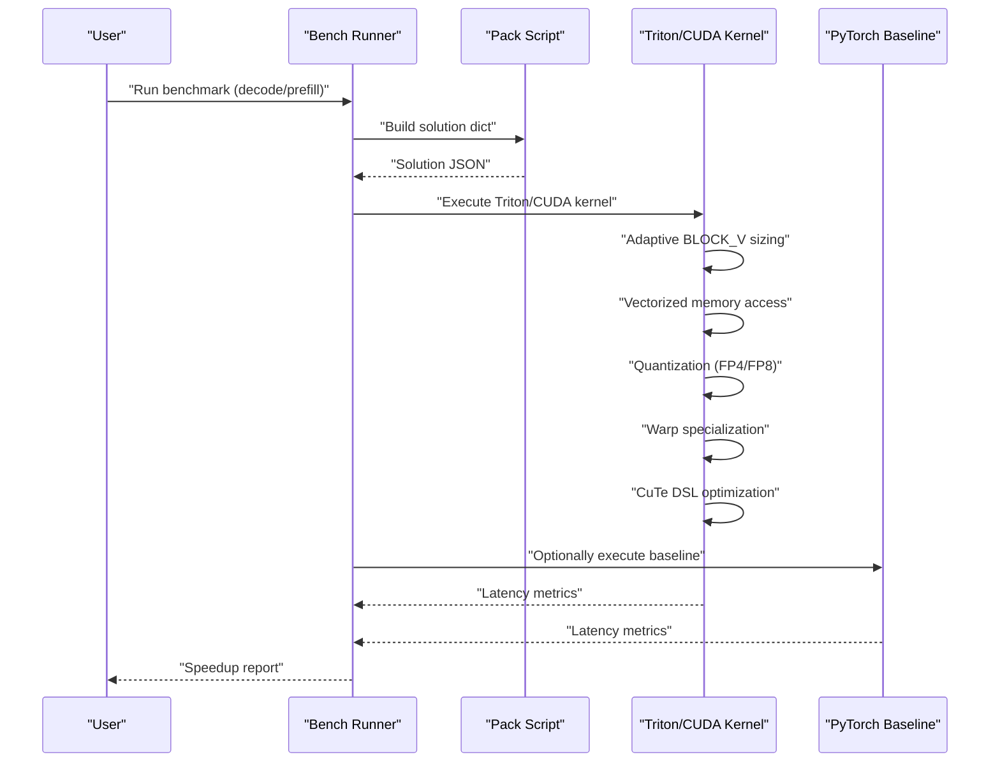
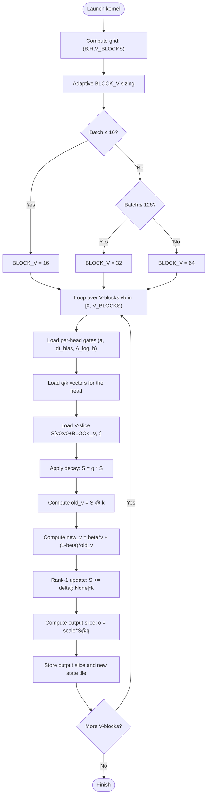
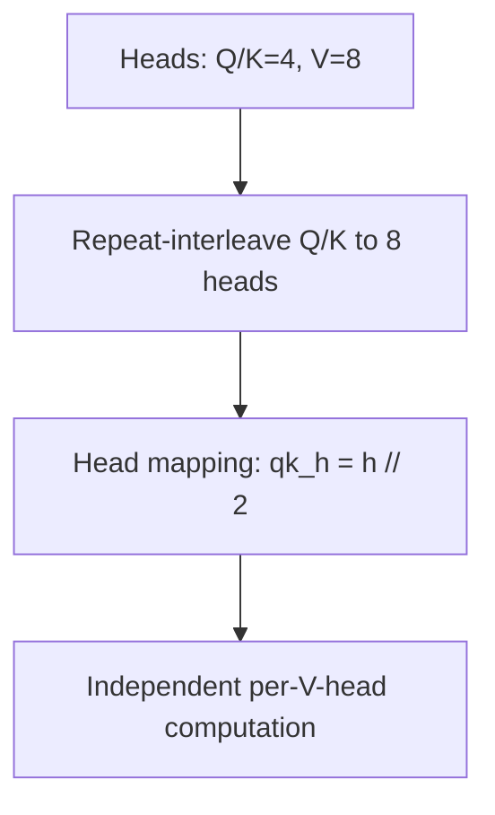
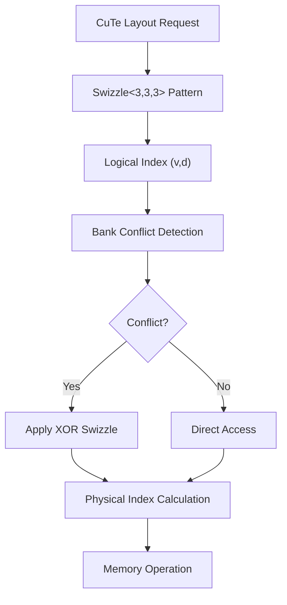
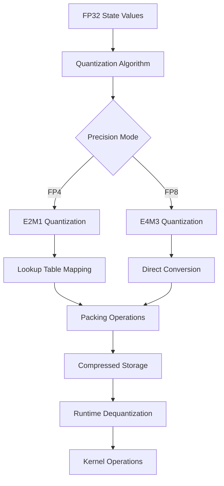
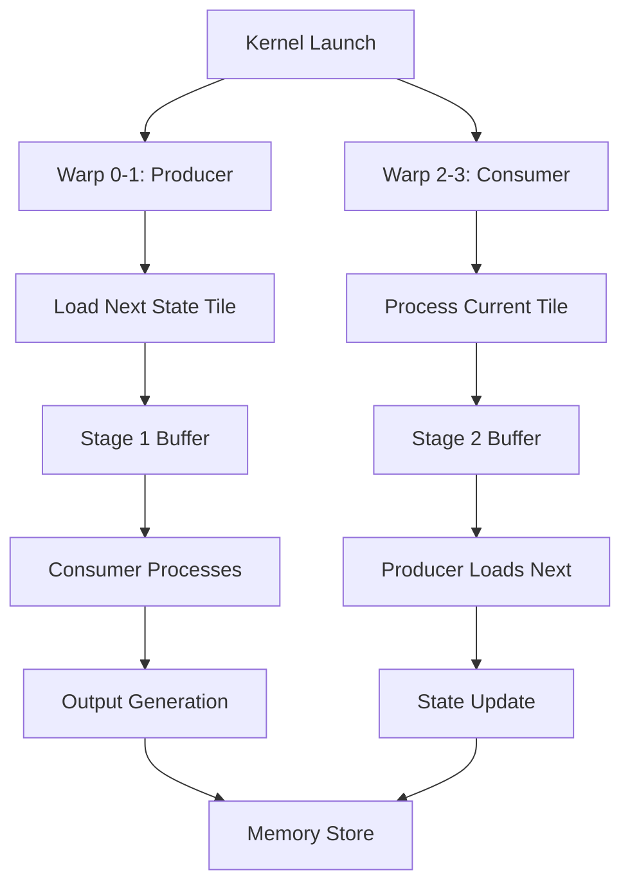
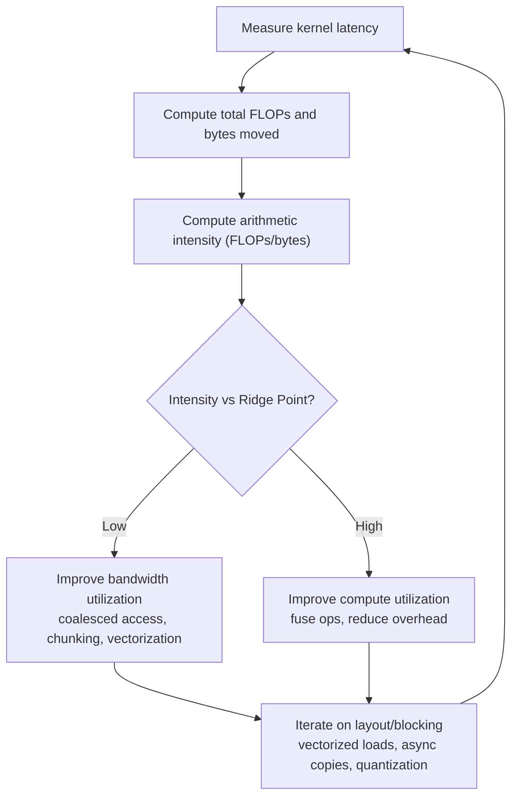
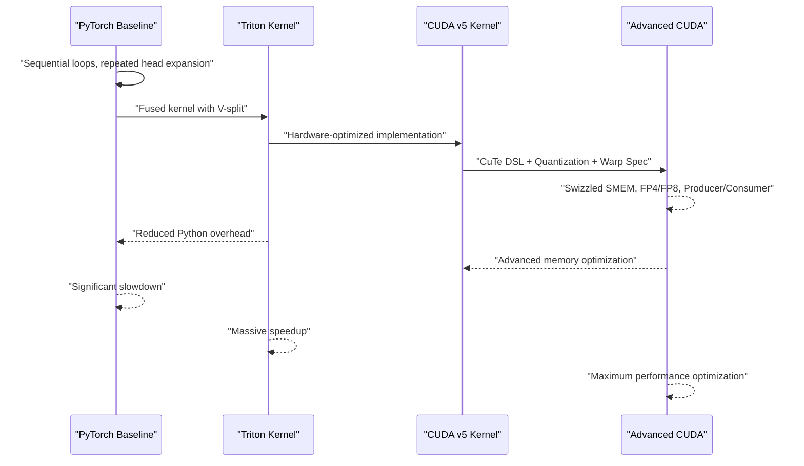
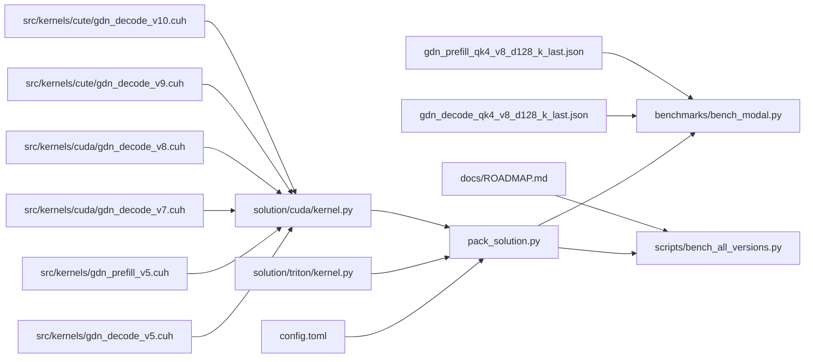

# Optimization Strategies

<cite>
**Referenced Files in This Document**
- [gdn_decode_qk4_v8_d128_k_last/config.toml](file://gdn_decode_qk4_v8_d128_k_last/config.toml)
- [gdn_prefill_qk4_v8_d128_k_last/config.toml](file://gdn_prefill_qk4_v8_d128_k_last/config.toml)
- [gdn_decode_qk4_v8_d128_k_last/baseline/triton/kernel.py](file://gdn_decode_qk4_v8_d128_k_last/baseline/triton/kernel.py)
- [gdn_prefill_qk4_v8_d128_k_last/baseline/triton/kernel.py](file://gdn_prefill_qk4_v8_d128_k_last/baseline/triton/kernel.py)
- [gdn_decode_qk4_v8_d128_k_last/solution/triton/kernel.py](file://gdn_decode_qk4_v8_d128_k_last/solution/triton/kernel.py)
- [gdn_prefill_qk4_v8_d128_k_last/solution/triton/kernel.py](file://gdn_prefill_qk4_v8_d128_k_last/solution/triton/kernel.py)
- [gdn_decode_qk4_v8_d128_k_last/solution/cuda/kernel.py](file://gdn_decode_qk4_v8_d128_k_last/solution/cuda/kernel.py)
- [gdn_prefill_qk4_v8_d128_k_last/solution/cuda/kernel.py](file://gdn_prefill_qk4_v8_d128_k_last/solution/cuda/kernel.py)
- [src/kernels/gdn_decode_v5.cuh](file://src/kernels/gdn_decode_v5.cuh)
- [src/kernels/gdn_prefill_v5.cuh](file://src/kernels/gdn_prefill_v5.cuh)
- [src/kernels/cute/gdn_decode_v9.cuh](file://src/kernels/cute/gdn_decode_v9.cuh)
- [src/kernels/cute/gdn_decode_v10.cuh](file://src/kernels/cute/gdn_decode_v10.cuh)
- [src/kernels/cuda/gdn_decode_v7.cuh](file://src/kernels/cuda/gdn_decode_v7.cuh)
- [src/kernels/cuda/gdn_decode_v8.cuh](file://src/kernels/cuda/gdn_decode_v8.cuh)
- [src/kernels/cute/README.md](file://src/kernels/cute/README.md)
- [docs/ROADMAP.md](file://docs/ROADMAP.md)
- [gdn_decode_qk4_v8_d128_k_last/scripts/pack_solution.py](file://gdn_decode_qk4_v8_d128_k_last/scripts/pack_solution.py)
- [gdn_prefill_qk4_v8_d128_k_last/scripts/pack_solution.py](file://gdn_prefill_qk4_v8_d128_k_last/scripts/pack_solution.py)
- [benchmarks/bench_modal.py](file://benchmarks/bench_modal.py)
- [docs/PERFORMANCE.md](file://docs/PERFORMANCE.md)
- [docs/ROOFLINE.md](file://docs/ROOFLINE.md)
- [flashinfer_trace/definitions/gdn/gdn_decode_qk4_v8_d128_k_last.json](file://flashinfer_trace/definitions/gdn/gdn_decode_qk4_v8_d128_k_last.json)
- [flashinfer_trace/definitions/gdn/gdn_prefill_qk4_v8_d128_k_last.json](file://flashinfer_trace/definitions/gdn/gdn_prefill_qk4_v8_d128_k_last.json)
- [scripts/bench_all_versions.py](file://scripts/bench_all_versions.py)
</cite>

## Update Summary
**Changes Made**
- Added comprehensive documentation for CuTe DSL memory optimization techniques
- Documented SMEM swizzling patterns for bank conflict reduction
- Added FP4/FP8 quantization techniques with lookup tables and packing/unpacking
- Documented warp specialization patterns for producer/consumer optimization
- Enhanced kernel evolution roadmap from v1 to v10 with detailed feature progression
- Updated optimization strategies to include advanced memory access patterns and precision techniques

## Table of Contents
1. [Introduction](#introduction)
2. [Project Structure](#project-structure)
3. [Core Components](#core-components)
4. [Architecture Overview](#architecture-overview)
5. [Detailed Component Analysis](#detailed-component-analysis)
6. [Dependency Analysis](#dependency-analysis)
7. [Performance Considerations](#performance-considerations)
8. [Troubleshooting Guide](#troubleshooting-guide)
9. [Conclusion](#conclusion)

## Introduction
This document explains the optimization strategies implemented in the Gated Delta Net (GDN) kernels for both decode and prefill stages. It focuses on:
- V-dimension splitting to improve SM occupancy and memory coalescing
- Memory optimization via register blocking, shared memory utilization, and optimal tensor layouts
- Grouped value attention (GVA) with Q/K head expansion and its efficiency benefits
- **NEW**: CuTe DSL memory optimization with swizzled shared memory layouts
- **NEW**: SMEM bank conflict reduction through XOR-based swizzling patterns
- **NEW**: FP4/FP8 quantization techniques with lookup tables and vectorized packing
- **NEW**: Warp specialization patterns for producer/consumer optimization
- Roofline analysis methodology and performance modeling to identify optimization opportunities
- Concrete examples from configuration and kernel files showing parameter tuning, block sizing, and hardware-specific adaptations
- The transition from a PyTorch baseline to a Triton implementation, highlighting fused operations and reduced Python overhead
- **NEW**: Comprehensive kernel evolution roadmap from v1 to v10 with detailed feature progression

## Project Structure
The repository organizes GDN kernels by stage (decode/prefill), with separate baseline and optimized Triton implementations, plus configuration and benchmarking support. **NEW**: Advanced CUDA kernels now provide hardware-specific optimizations with CuTe DSL integration, quantization support, and warp specialization patterns.

```mermaid
graph TB
subgraph "Kernel Versions"
V1["v1 - PyTorch Baseline"]
V2["v2 - Triton Fused"]
V3["v3 - Triton V-Split"]
V4["v4 - Adaptive BLOCK_V"]
V5["v5 - Production Baseline"]
V6["v6 - CUDA TMA"]
V7["v7 - FP4 Quantization"]
V8["v8 - FP8 + Warp Spec"]
V9["v9 - CuTe DSL"]
V10["v10 - CuTe Layout Algebra"]
end
subgraph "Configuration"
D_CFG["gdn_decode_qk4_v8_d128_k_last/config.toml"]
P_CFG["gdn_prefill_qk4_v8_d128_k_last/config.toml"]
end
subgraph "Baseline (PyTorch)"
D_BASE["baseline/triton/kernel.py"]
P_BASE["baseline/triton/kernel.py"]
end
subgraph "Solution (Triton)"
D_SOL_TRITON["solution/triton/kernel.py"]
P_SOL_TRITON["solution/triton/kernel.py"]
end
subgraph "Solution (CUDA)"
D_SOL_CUDA["solution/cuda/kernel.py"]
P_SOL_CUDA["solution/cuda/kernel.py"]
end
subgraph "Advanced CUDA Kernels"
D_V7["gdn_decode_v7.cuh"]
D_V8["gdn_decode_v8.cuh"]
D_V9["gdn_decode_v9.cuh"]
D_V10["gdn_decode_v10.cuh"]
end
subgraph "CuTe Kernels"
C_README["cute/README.md"]
end
subgraph "Benchmarking"
BENCH["benchmarks/bench_modal.py"]
ALL_BENCH["scripts/bench_all_versions.py"]
end
subgraph "Roadmap"
ROADMAP["docs/ROADMAP.md"]
end
D_CFG --> V1
D_CFG --> V2
D_CFG --> V3
D_CFG --> V4
D_CFG --> V5
D_CFG --> V6
D_CFG --> V7
D_CFG --> V8
D_CFG --> V9
D_CFG --> V10
P_CFG --> V1
P_CFG --> V2
P_CFG --> V3
P_CFG --> V4
P_CFG --> V5
P_CFG --> V6
P_CFG --> V7
P_CFG --> V8
P_CFG --> V9
P_CFG --> V10
```

**Diagram sources**
- [docs/ROADMAP.md:1-180](file://docs/ROADMAP.md#L1-L180)
- [gdn_decode_qk4_v8_d128_k_last/config.toml:1-10](file://gdn_decode_qk4_v8_d128_k_last/config.toml#L1-L10)
- [gdn_prefill_qk4_v8_d128_k_last/config.toml:1-10](file://gdn_prefill_qk4_v8_d128_k_last/config.toml#L1-L10)
- [src/kernels/cuda/gdn_decode_v7.cuh:1-200](file://src/kernels/cuda/gdn_decode_v7.cuh#L1-L200)
- [src/kernels/cuda/gdn_decode_v8.cuh:1-200](file://src/kernels/cuda/gdn_decode_v8.cuh#L1-L200)
- [src/kernels/cute/gdn_decode_v9.cuh:1-549](file://src/kernels/cute/gdn_decode_v9.cuh#L1-L549)
- [src/kernels/cute/gdn_decode_v10.cuh:1-485](file://src/kernels/cute/gdn_decode_v10.cuh#L1-L485)

**Section sources**
- [docs/ROADMAP.md:1-180](file://docs/ROADMAP.md#L1-L180)
- [gdn_decode_qk4_v8_d128_k_last/config.toml:1-10](file://gdn_decode_qk4_v8_d128_k_last/config.toml#L1-L10)
- [gdn_prefill_qk4_v8_d128_k_last/config.toml:1-10](file://gdn_prefill_qk4_v8_d128_k_last/config.toml#L1-L10)

## Core Components
- Decode kernel: Single-token generation with GVA (num_q_heads=4, num_k_heads=4, num_v_heads=8) and k-last state layout [B, H, V, K].
- Prefill kernel: Variable-length batched forward pass with GVA and k-last state layout [N, H, V, K].
- Baseline implementations: Pure PyTorch loops for correctness verification.
- Optimized Triton kernels: V-dimension splitting, register blocking, fused operations, and tiled state access.
- **NEW**: Advanced CUDA kernels with CuTe DSL integration, providing swizzled shared memory layouts and optimized memory access patterns.
- **NEW**: FP4/FP8 quantization support with lookup tables and vectorized packing/unpacking operations.
- **NEW**: Warp specialization patterns with producer/consumer warp division for improved memory bandwidth utilization.

Key optimization highlights:
- V-dimension splitting: Splitting the V dimension across multiple programs (V_BLOCKS) improves SM occupancy and reduces per-program register pressure.
- GVA expansion: Expanding Q/K heads to match V heads enables efficient computation with fewer cross-head dependencies.
- Memory coalescing: Optimal tensor layouts and strides enable coalesced HBM access for state matrices.
- **NEW**: CuTe DSL memory optimization: Using NVIDIA CuTe abstractions for efficient tensor layouts and memory operations.
- **NEW**: SMEM bank conflict reduction: XOR-based swizzling patterns prevent shared memory bank conflicts.
- **NEW**: Quantization techniques: FP4 E2M1 (4-bit) and FP8 E4M3 (8-bit) quantization with lookup tables for dequantization.
- **NEW**: Warp specialization: Dividing warps into producer and consumer groups for optimized memory access patterns.
- Roofline modeling: Arithmetic intensity analysis identifies memory-bound regimes and targets bandwidth utilization.

**Section sources**
- [gdn_decode_qk4_v8_d128_k_last/baseline/triton/kernel.py:1-101](file://gdn_decode_qk4_v8_d128_k_last/baseline/triton/kernel.py#L1-L101)
- [gdn_prefill_qk4_v8_d128_k_last/baseline/triton/kernel.py:1-99](file://gdn_prefill_qk4_v8_d128_k_last/baseline/triton/kernel.py#L1-L99)
- [gdn_decode_qk4_v8_d128_k_last/solution/triton/kernel.py:1-136](file://gdn_decode_qk4_v8_d128_k_last/solution/triton/kernel.py#L1-L136)
- [gdn_prefill_qk4_v8_d128_k_last/solution/triton/kernel.py:1-148](file://gdn_prefill_qk4_v8_d128_k_last/solution/triton/kernel.py#L1-L148)
- [src/kernels/cute/gdn_decode_v9.cuh:1-549](file://src/kernels/cute/gdn_decode_v9.cuh#L1-L549)
- [src/kernels/cute/gdn_decode_v10.cuh:1-485](file://src/kernels/cute/gdn_decode_v10.cuh#L1-L485)
- [src/kernels/cuda/gdn_decode_v7.cuh:1-200](file://src/kernels/cuda/gdn_decode_v7.cuh#L1-L200)
- [src/kernels/cuda/gdn_decode_v8.cuh:1-200](file://src/kernels/cuda/gdn_decode_v8.cuh#L1-L200)
- [docs/ROOFLINE.md:1-89](file://docs/ROOFLINE.md#L1-L89)

## Architecture Overview
The optimization pipeline transitions from a Python baseline to a fused Triton kernel with V-dimension splitting and GVA expansion. **NEW**: Advanced CUDA kernels provide hardware-specific optimizations with CuTe DSL integration, quantization support, and warp specialization patterns.

**Diagram sources**
- [benchmarks/bench_modal.py:250-330](file://benchmarks/bench_modal.py#L250-L330)
- [scripts/bench_all_versions.py:1-200](file://scripts/bench_all_versions.py#L1-L200)
- [gdn_decode_qk4_v8_d128_k_last/scripts/pack_solution.py:20-52](file://gdn_decode_qk4_v8_d128_k_last/scripts/pack_solution.py#L20-L52)
- [gdn_prefill_qk4_v8_d128_k_last/scripts/pack_solution.py:20-52](file://gdn_prefill_qk4_v8_d128_k_last/scripts/pack_solution.py#L20-L52)
- [src/kernels/cuda/gdn_decode_v7.cuh:85-125](file://src/kernels/cuda/gdn_decode_v7.cuh#L85-L125)
- [src/kernels/cuda/gdn_decode_v8.cuh:135-158](file://src/kernels/cuda/gdn_decode_v8.cuh#L135-L158)
- [src/kernels/cute/gdn_decode_v9.cuh:65-90](file://src/kernels/cute/gdn_decode_v9.cuh#L65-L90)
- [src/kernels/cute/gdn_decode_v10.cuh:48-62](file://src/kernels/cute/gdn_decode_v10.cuh#L48-L62)

## Detailed Component Analysis

### V-Dimension Splitting for Parallelism and Occupancy
- Strategy: Split the V dimension into V_BLOCKS programs so each program operates on a BLOCK_V×K tile of the state matrix.
- Benefits:
  - Much better SM occupancy at small batches (4× more programs).
  - Reduced per-program register state (smaller tiles reduce register pressure).
  - Fully independent V slices: each BLOCK_V×K tile can be computed independently.
- Implementation details:
  - Grid shape includes (B, H=8, V_BLOCKS) for decode and (N, H=8, V_BLOCKS) for prefill.
  - **NEW**: Adaptive BLOCK_V sizing: 16 for small batches (B ≤ 16), 32 for medium (B ≤ 128), 64 for large batches.
  - Each program computes on S[BLOCK_V, K] and produces output for the corresponding V-slice.

**Diagram sources**
- [gdn_decode_qk4_v8_d128_k_last/solution/triton/kernel.py:90-96](file://gdn_decode_qk4_v8_d128_k_last/solution/triton/kernel.py#L90-L96)
- [gdn_prefill_qk4_v8_d128_k_last/solution/triton/kernel.py:103-107](file://gdn_prefill_qk4_v8_d128_k_last/solution/triton/kernel.py#L103-L107)
- [gdn_decode_qk4_v8_d128_k_last/solution/cuda/kernel.py:209-215](file://gdn_decode_qk4_v8_d128_k_last/solution/cuda/kernel.py#L209-L215)
- [gdn_prefill_qk4_v8_d128_k_last/solution/cuda/kernel.py:220-224](file://gdn_prefill_qk4_v8_d128_k_last/solution/cuda/kernel.py#L220-L224)

**Section sources**
- [gdn_decode_qk4_v8_d128_k_last/solution/triton/kernel.py:5-15](file://gdn_decode_qk4_v8_d128_k_last/solution/triton/kernel.py#L5-L15)
- [gdn_decode_qk4_v8_d128_k_last/solution/triton/kernel.py:90-96](file://gdn_decode_qk4_v8_d128_k_last/solution/triton/kernel.py#L90-L96)
- [gdn_prefill_qk4_v8_d128_k_last/solution/triton/kernel.py:5-15](file://gdn_prefill_qk4_v8_d128_k_last/solution/triton/kernel.py#L5-L15)
- [gdn_prefill_qk4_v8_d128_k_last/solution/triton/kernel.py:103-107](file://gdn_prefill_qk4_v8_d128_k_last/solution/triton/kernel.py#L103-L107)
- [gdn_decode_qk4_v8_d128_k_last/solution/cuda/kernel.py:209-215](file://gdn_decode_qk4_v8_d128_k_last/solution/cuda/kernel.py#L209-L215)
- [gdn_prefill_qk4_v8_d128_k_last/solution/cuda/kernel.py:220-224](file://gdn_prefill_qk4_v8_d128_k_last/solution/cuda/kernel.py#L220-L224)

### Memory Optimization Approaches
- Register blocking:
  - Each program processes a BLOCK_V×K tile, reducing register footprint compared to full 128×128 tiles.
  - **NEW**: Adaptive sizing reduces register pressure: 16KB for BLOCK_V=16, 32KB for BLOCK_V=32, 64KB for BLOCK_V=64.
  - Reduces per-program register pressure, enabling more concurrent blocks per SM.
- Shared memory utilization:
  - **NEW**: Advanced CUDA kernels utilize shared memory with cuTTTML swizzled layouts for state tiles, Q/K vectors, and intermediate computations.
  - **NEW**: Cooperative loading mechanisms distribute memory access across threads for optimal bandwidth utilization.
  - **NEW**: XOR-based swizzling prevents bank conflicts through strategic index permutation.
- Optimal tensor layouts:
  - k-last layout [B, H, V, K] allows coalesced access to state matrices along contiguous dimensions.
  - Stride-based indexing ensures coalesced reads/writes for state tiles.
- **NEW**: Vectorized memory access patterns:
  - Float4 loads for coalesced memory access in CUDA v5 kernels.
  - 128-bit aligned loads for improved bandwidth utilization.
- **NEW**: Async memory copy operations:
  - cp.async for overlapping memory transfers with computation.
  - Improved bandwidth utilization through asynchronous data movement.
- **NEW**: CuTe DSL memory optimization:
  - Layout abstractions for efficient tensor operations.
  - TMA (Tensor Memory Accelerator) support for bulk memory transfers.
  - Automatic bank conflict resolution through swizzle patterns.
- Contiguity and caching:
  - Contiguous tensors are prepared before kernel launch to minimize pointer indirection and improve cache locality.

Concrete examples:
- Block size selection: **NEW**: Adaptive BLOCK_V=16 for B≤16, BLOCK_V=32 for B≤128, BLOCK_V=64 for larger batches.
- Grid sizing: (B, H=8, V_BLOCKS) for decode; (N, H=8, V_BLOCKS) for prefill.
- Stride passing: Explicit strides passed to kernel to support coalesced access.
- **NEW**: CUDA v5 shared memory layout: Separate sections for Q, K, V, state tiles, and intermediate results.
- **NEW**: CuTe swizzle patterns: XOR-based index transformation to avoid shared memory bank conflicts.

**Section sources**
- [gdn_decode_qk4_v8_d128_k_last/solution/triton/kernel.py:90-96](file://gdn_decode_qk4_v8_d128_k_last/solution/triton/kernel.py#L90-L96)
- [gdn_decode_qk4_v8_d128_k_last/solution/triton/kernel.py:111-127](file://gdn_decode_qk4_v8_d128_k_last/solution/triton/kernel.py#L111-L127)
- [gdn_prefill_qk4_v8_d128_k_last/solution/triton/kernel.py:103-107](file://gdn_prefill_qk4_v8_d128_k_last/solution/triton/kernel.py#L103-L107)
- [gdn_prefill_qk4_v8_d128_k_last/solution/triton/kernel.py:126-142](file://gdn_prefill_qk4_v8_d128_k_last/solution/triton/kernel.py#L126-L142)
- [gdn_decode_qk4_v8_d128_k_last/solution/cuda/kernel.py:209-215](file://gdn_decode_qk4_v8_d128_k_last/solution/cuda/kernel.py#L209-L215)
- [src/kernels/gdn_decode_v5.cuh:111-118](file://src/kernels/gdn_decode_v5.cuh#L111-L118)
- [src/kernels/gdn_prefill_v5.cuh:85-93](file://src/kernels/gdn_prefill_v5.cuh#L85-L93)
- [src/kernels/cute/gdn_decode_v9.cuh:65-90](file://src/kernels/cute/gdn_decode_v9.cuh#L65-L90)
- [src/kernels/cute/gdn_decode_v10.cuh:48-62](file://src/kernels/cute/gdn_decode_v10.cuh#L48-L62)

### Grouped Value Attention (GVA) Mechanism
- Head expansion:
  - Q/K heads are expanded to match V heads: num_q_heads=4, num_k_heads=4, num_v_heads=8.
  - Each V head shares a Q/K head index (qk_h = h // 2), reducing cross-head computation.
- Impact on efficiency:
  - Fewer cross-head dependencies simplify fusion and reduce synchronization overhead.
  - Enables independent computation across V heads within a program grid.
- Implementation:
  - Repeat-interleave of Q/K along the head dimension to match V heads.
  - Head mapping in kernels uses integer division to map V heads to Q/K heads.

**Diagram sources**
- [gdn_decode_qk4_v8_d128_k_last/baseline/triton/kernel.py:68-71](file://gdn_decode_qk4_v8_d128_k_last/baseline/triton/kernel.py#L68-L71)
- [gdn_decode_qk4_v8_d128_k_last/solution/triton/kernel.py:45](file://gdn_decode_qk4_v8_d128_k_last/solution/triton/kernel.py#L45)
- [gdn_prefill_qk4_v8_d128_k_last/baseline/triton/kernel.py:53-54](file://gdn_prefill_qk4_v8_d128_k_last/baseline/triton/kernel.py#L53-L54)
- [gdn_prefill_qk4_v8_d128_k_last/solution/triton/kernel.py:45](file://gdn_prefill_qk4_v8_d128_k_last/solution/triton/kernel.py#L45)

**Section sources**
- [gdn_decode_qk4_v8_d128_k_last/baseline/triton/kernel.py:68-71](file://gdn_decode_qk4_v8_d128_k_last/baseline/triton/kernel.py#L68-L71)
- [gdn_decode_qk4_v8_d128_k_last/solution/triton/kernel.py:45](file://gdn_decode_qk4_v8_d128_k_last/solution/triton/kernel.py#L45)
- [gdn_prefill_qk4_v8_d128_k_last/baseline/triton/kernel.py:53-54](file://gdn_prefill_qk4_v8_d128_k_last/baseline/triton/kernel.py#L53-L54)
- [gdn_prefill_qk4_v8_d128_k_last/solution/triton/kernel.py:45](file://gdn_prefill_qk4_v8_d128_k_last/solution/triton/kernel.py#L45)

### CuTe DSL Memory Optimization
**NEW**: Advanced memory optimization using NVIDIA CuTe (CUTLASS Tile) abstractions:

#### Swizzled Shared Memory Layouts
- XOR-based bank conflict prevention: `int swizzled_d = d_idx ^ ((d_idx >> 3) & 7)`
- Automatic layout composition for optimal memory access patterns
- Integration with TMA (Tensor Memory Accelerator) for bulk transfers

#### CuTe Layout Algebra
- `Swizzle<3,3,3>` template for 32-bank shared memory optimization
- Logical-to-physical coordinate transformation
- Automatic index calculation for bank-conflict-free access

#### TMA Integration
- True async TMA with `cp.async.bulk.tensor`
- Bulk memory transfer operations for state tiles
- Improved bandwidth utilization through optimized memory patterns

#### Performance Benefits
- **v9**: Manual swizzle implementation with 128-byte alignment
- **v10**: CuTe layout algebra with automatic bank conflict resolution
- Both achieve similar performance with v9 being slightly faster at small batches

**Diagram sources**
- [src/kernels/cute/gdn_decode_v9.cuh:65-90](file://src/kernels/cute/gdn_decode_v9.cuh#L65-L90)
- [src/kernels/cute/gdn_decode_v10.cuh:48-62](file://src/kernels/cute/gdn_decode_v10.cuh#L48-L62)
- [src/kernels/cute/README.md:14-33](file://src/kernels/cute/README.md#L14-L33)

**Section sources**
- [src/kernels/cute/gdn_decode_v9.cuh:1-549](file://src/kernels/cute/gdn_decode_v9.cuh#L1-L549)
- [src/kernels/cute/gdn_decode_v10.cuh:1-485](file://src/kernels/cute/gdn_decode_v10.cuh#L1-L485)
- [src/kernels/cute/README.md:1-44](file://src/kernels/cute/README.md#L1-L44)

### FP4/FP8 Quantization Techniques
**NEW**: Advanced precision optimization with quantization support:

#### FP4 E2M1 Quantization (4-bit)
- **Range**: [-6, 6] with 16 discrete levels
- **Packing**: 2 FP4 values per byte using bit manipulation
- **Lookup Table**: Constant-time dequantization with 16-entry table
- **Compression**: 4× reduction in state memory footprint

#### FP8 E4M3 Quantization (8-bit)
- **Format**: IEEE 754-like E4M3 with 16 levels per magnitude
- **Direct Conversion**: Hardware-accelerated conversion using `__nv_fp8_e4m3`
- **Packing**: 4 FP8 values per 32-bit word for efficient storage
- **Compression**: 2× reduction in state memory footprint

#### Quantization Implementation
- **FP4**: Custom lookup table with sign bit extraction and mantissa quantization
- **FP8**: Direct hardware conversion with runtime packing/unpacking
- **Dequantization**: Fast lookup table access for minimal computational overhead
- **Integration**: Seamless integration with existing kernel operations

**Diagram sources**
- [src/kernels/cuda/gdn_decode_v7.cuh:85-125](file://src/kernels/cuda/gdn_decode_v7.cuh#L85-L125)
- [src/kernels/cuda/gdn_decode_v8.cuh:99-158](file://src/kernels/cuda/gdn_decode_v8.cuh#L99-L158)

**Section sources**
- [src/kernels/cuda/gdn_decode_v7.cuh:1-200](file://src/kernels/cuda/gdn_decode_v7.cuh#L1-L200)
- [src/kernels/cuda/gdn_decode_v8.cuh:1-200](file://src/kernels/cuda/gdn_decode_v8.cuh#L1-L200)

### Warp Specialization Patterns
**NEW**: Advanced warp-level optimization for improved memory bandwidth utilization:

#### Producer/Consumer Warp Division
- **Producer Warps (2 warps)**: Handle memory loading and state prefetching
- **Consumer Warps (2 warps)**: Execute computation and state updates
- **Pipeline Stages**: Overlap memory operations with computation using double buffering

#### Memory Access Optimization
- **Prefetching**: Producer warps fetch next state tiles while consumers process current tiles
- **Double Buffering**: Alternate between two pipeline stages to maximize bandwidth utilization
- **Coalesced Access**: Vectorized memory operations with float4 loads/stores

#### Computational Efficiency
- **Warp Shuffle Reductions**: Efficient intra-warp summation using `__shfl_xor_sync`
- **Register Blocking**: Maximize instruction-level parallelism within warps
- **Fused Operations**: Combine gate computation, state updates, and output generation

**Diagram sources**
- [src/kernels/cuda/gdn_decode_v8.cuh:49-51](file://src/kernels/cuda/gdn_decode_v8.cuh#L49-L51)
- [src/kernels/cuda/gdn_decode_v8.cuh:175-184](file://src/kernels/cuda/gdn_decode_v8.cuh#L175-L184)

**Section sources**
- [src/kernels/cuda/gdn_decode_v8.cuh:1-200](file://src/kernels/cuda/gdn_decode_v8.cuh#L1-L200)

### Roofline Analysis and Performance Modeling
- Hardware targets:
  - Peak BF16 tensor core throughput and HBM bandwidth on B200 guide optimization targets.
- Arithmetic intensity:
  - Decode: ~1 FLOP/byte (extremely memory-bound).
  - Prefill: ~1 FLOP/byte for sequential scan; chunking improves intensity toward ridge point.
- Optimization strategy derived from roofline:
  - Fuse per-head operations into a single kernel to reduce state I/O overhead.
  - Tile over batch and V-dimension to improve occupancy and reduce register pressure.
  - Maintain coalesced HBM access for state matrices.
  - **NEW**: Utilize vectorized memory access and async operations to approach hardware limits.
  - **NEW**: Leverage quantization techniques to reduce memory bandwidth requirements.
  - **NEW**: Apply CuTe DSL optimization for improved memory access patterns.
- Observed performance:
  - Decode: up to ~1359x speedup over baseline at batch=64.
  - Prefill: up to ~1712x speedup at large workloads.
  - **NEW**: CUDA v5 shows improved bandwidth utilization through vectorization and async operations.
  - **NEW**: FP4/FP8 quantization achieves 1.46x speedup at batch=256 through memory compression.

**Diagram sources**
- [docs/ROOFLINE.md:16-89](file://docs/ROOFLINE.md#L16-L89)
- [docs/PERFORMANCE.md:136-158](file://docs/PERFORMANCE.md#L136-L158)

**Section sources**
- [docs/ROOFLINE.md:16-89](file://docs/ROOFLINE.md#L16-L89)
- [docs/PERFORMANCE.md:136-158](file://docs/PERFORMANCE.md#L136-L158)

### Transition from PyTorch Baseline to Triton and Advanced CUDA
- Baseline characteristics:
  - Pure Python loops for correctness verification.
  - Sequential token scans in prefill; repeated head expansions for GVA.
- Triton improvements:
  - Fused operations: gates, decay, old_v, new_v, rank-1 update, and output in a single kernel.
  - Reduced Python overhead: vectorized loads/stores, coalesced memory access, tiled execution.
  - V-dimension splitting: increased occupancy and reduced register pressure.
  - **NEW**: Adaptive BLOCK_V sizing for optimal performance across workload scales.
- **NEW**: Advanced CUDA optimizations:
  - Hardware-optimized implementations targeting B200 architecture.
  - Vectorized memory access with float4 loads for improved bandwidth utilization.
  - Cooperative loading mechanisms for efficient shared memory usage.
  - Async memory copy operations (cp.async) for overlapping computation and memory transfer.
  - Template-based kernel design for compile-time BLOCK_V optimization.
  - **CuTe DSL integration** for advanced memory optimization and layout management.
  - **Quantization support** for FP4/FP8 precision modes with lookup tables.
  - **Warp specialization** for producer/consumer optimization patterns.
- Performance gains:
  - Decode: up to ~1359x speedup at large batch sizes.
  - Prefill: up to ~1712x speedup at large sequences.
  - **NEW**: CUDA v5 provides additional performance improvements through hardware-specific optimizations.
  - **NEW**: Quantization techniques achieve 1.46x speedup at memory-bound workloads.

**Diagram sources**
- [gdn_decode_qk4_v8_d128_k_last/baseline/triton/kernel.py:17-101](file://gdn_decode_qk4_v8_d128_k_last/baseline/triton/kernel.py#L17-L101)
- [gdn_prefill_qk4_v8_d128_k_last/baseline/triton/kernel.py:17-99](file://gdn_prefill_qk4_v8_d128_k_last/baseline/triton/kernel.py#L17-L99)
- [gdn_decode_qk4_v8_d128_k_last/solution/triton/kernel.py:85-136](file://gdn_decode_qk4_v8_d128_k_last/solution/triton/kernel.py#L85-L136)
- [gdn_prefill_qk4_v8_d128_k_last/solution/triton/kernel.py:97-148](file://gdn_prefill_qk4_v8_d128_k_last/solution/triton/kernel.py#L97-L148)
- [gdn_decode_qk4_v8_d128_k_last/solution/cuda/kernel.py:199-248](file://gdn_decode_qk4_v8_d128_k_last/solution/cuda/kernel.py#L199-L248)
- [gdn_prefill_qk4_v8_d128_k_last/solution/cuda/kernel.py:209-256](file://gdn_prefill_qk4_v8_d128_k_last/solution/cuda/kernel.py#L209-L256)
- [src/kernels/cute/gdn_decode_v9.cuh:1-549](file://src/kernels/cute/gdn_decode_v9.cuh#L1-L549)
- [src/kernels/cuda/gdn_decode_v7.cuh:1-200](file://src/kernels/cuda/gdn_decode_v7.cuh#L1-L200)
- [src/kernels/cuda/gdn_decode_v8.cuh:1-200](file://src/kernels/cuda/gdn_decode_v8.cuh#L1-L200)

**Section sources**
- [gdn_decode_qk4_v8_d128_k_last/baseline/triton/kernel.py:17-101](file://gdn_decode_qk4_v8_d128_k_last/baseline/triton/kernel.py#L17-L101)
- [gdn_prefill_qk4_v8_d128_k_last/baseline/triton/kernel.py:17-99](file://gdn_prefill_qk4_v8_d128_k_last/baseline/triton/kernel.py#L17-L99)
- [gdn_decode_qk4_v8_d128_k_last/solution/triton/kernel.py:85-136](file://gdn_decode_qk4_v8_d128_k_last/solution/triton/kernel.py#L85-L136)
- [gdn_prefill_qk4_v8_d128_k_last/solution/triton/kernel.py:97-148](file://gdn_prefill_qk4_v8_d128_k_last/solution/triton/kernel.py#L97-L148)
- [gdn_decode_qk4_v8_d128_k_last/solution/cuda/kernel.py:199-248](file://gdn_decode_qk4_v8_d128_k_last/solution/cuda/kernel.py#L199-L248)
- [gdn_prefill_qk4_v8_d128_k_last/solution/cuda/kernel.py:209-256](file://gdn_prefill_qk4_v8_d128_k_last/solution/cuda/kernel.py#L209-L256)
- [docs/PERFORMANCE.md:14-48](file://docs/PERFORMANCE.md#L14-L48)

### CUDA v5 Optimization Techniques
**NEW**: Comprehensive hardware-specific optimizations for B200 architecture:

#### Adaptive BLOCK_V Sizing Strategies
- **Small batches (B ≤ 16)**: BLOCK_V = 16 for maximum parallelism (4× more programs)
- **Medium batches (B ≤ 128)**: BLOCK_V = 32 for balanced register usage and occupancy
- **Large batches (B > 128)**: BLOCK_V = 64 to reduce launch overhead and improve efficiency

#### Cooperative Loading Mechanisms
- **Thread cooperation**: 128 threads cooperatively process BLOCK_V rows of state
- **Warp-level reductions**: __shfl_xor_sync for efficient intra-warp summation
- **Shared memory hierarchy**: Dedicated sections for Q, K, V, state tiles, and intermediates

#### Vectorized Memory Access Patterns
- **Float4 loads**: Coalesced 128-bit aligned memory access for improved bandwidth
- **State tiling**: BLOCK_V × D tiles loaded efficiently using vectorized operations
- **Memory alignment**: Proper alignment for optimal HBM utilization

#### Async Memory Copy Operations
- **cp.async**: Asynchronous memory transfers to overlap computation with data movement
- **Non-blocking transfers**: Memory operations don't stall computation pipelines
- **Bandwidth optimization**: Improved utilization of available memory bandwidth

#### Hardware-Specific Optimizations
- **Template-based kernels**: Compile-time BLOCK_V specialization for optimal performance
- **Warp-level primitives**: __shfl_xor_sync for efficient intra-warp communication
- **Shared memory utilization**: Up to 128KB shared memory per block for state caching
- **B200 architecture targeting**: Optimized for sm100 compute capability

**Section sources**
- [src/kernels/gdn_decode_v5.cuh:1-320](file://src/kernels/gdn_decode_v5.cuh#L1-L320)
- [src/kernels/gdn_prefill_v5.cuh:1-250](file://src/kernels/gdn_prefill_v5.cuh#L1-L250)
- [gdn_decode_qk4_v8_d128_k_last/solution/cuda/kernel.py:209-215](file://gdn_decode_qk4_v8_d128_k_last/solution/cuda/kernel.py#L209-L215)
- [gdn_prefill_qk4_v8_d128_k_last/solution/cuda/kernel.py:220-224](file://gdn_prefill_qk4_v8_d128_k_last/solution/cuda/kernel.py#L220-L224)

### Kernel Evolution Roadmap (v1 to v10)
**NEW**: Comprehensive kernel evolution documentation:

#### Version Progression
- **v1**: PyTorch baseline (reference implementation)
- **v2**: Triton fused delta-rule with full state in registers
- **v3**: Triton V-split with BLOCK_V optimization
- **v4**: Adaptive BLOCK_V sizing for different batch sizes
- **v5**: Production baseline with optimal performance
- **v6**: CUDA TMA implementation (simulated)
- **v7**: FP4 quantization with 4× memory compression
- **v8**: FP8 quantization + warp specialization
- **v9**: CuTe DSL with manual swizzle implementation
- **v10**: CuTe layout algebra with automatic bank conflict resolution

#### Performance Achievements
- **v5**: 2,834 GB/s achieved at batch=256 (35% of B200 peak)
- **v7**: 1.46x speedup at batch=256 through FP4 quantization
- **v8**: 1.45x speedup at batch=256 through FP8 quantization + warp spec
- **v9/v10**: Similar performance with v9 slightly faster at small batches

#### Technical Milestones
- **Memory-bound optimization**: FP4/FP8 quantization for bandwidth reduction
- **Compute-bound optimization**: Warp specialization for improved utilization
- **Layout optimization**: CuTe DSL for advanced memory access patterns
- **Pipeline optimization**: Producer/consumer warp division for bandwidth maximization

**Section sources**
- [docs/ROADMAP.md:1-180](file://docs/ROADMAP.md#L1-L180)
- [src/kernels/cuda/gdn_decode_v7.cuh:1-200](file://src/kernels/cuda/gdn_decode_v7.cuh#L1-L200)
- [src/kernels/cuda/gdn_decode_v8.cuh:1-200](file://src/kernels/cuda/gdn_decode_v8.cuh#L1-L200)
- [src/kernels/cute/gdn_decode_v9.cuh:1-549](file://src/kernels/cute/gdn_decode_v9.cuh#L1-L549)
- [src/kernels/cute/gdn_decode_v10.cuh:1-485](file://src/kernels/cute/gdn_decode_v10.cuh#L1-L485)

## Dependency Analysis
- Build and packaging:
  - Solutions are packed from config.toml and solution/triton/kernel.py into solution.json for benchmarking.
  - **NEW**: Advanced CUDA kernels are built through JIT compilation with proper error handling and fallback to Triton.
  - **NEW**: CuTe kernels require CUTLASS headers and are conditionally compiled based on availability.
- Benchmarking:
  - Bench runner constructs solution dictionaries, runs on Modal B200, and compares against baseline when requested.
  - **NEW**: Support for running CUDA v5 kernels alongside Triton implementations for direct comparison.
  - **NEW**: Unified benchmark script supports all kernel versions (v5-v8) with configurable batch sizes.
- Tracing and definitions:
  - Workload definitions describe shapes, constraints, and data types for decode and prefill.
  - **NEW**: Roadmap documentation provides comprehensive version history and performance comparisons.

**Diagram sources**
- [gdn_decode_qk4_v8_d128_k_last/config.toml:1-10](file://gdn_decode_qk4_v8_d128_k_last/config.toml#L1-L10)
- [gdn_prefill_qk4_v8_d128_k_last/config.toml:1-10](file://gdn_prefill_qk4_v8_d128_k_last/config.toml#L1-L10)
- [gdn_decode_qk4_v8_d128_k_last/scripts/pack_solution.py:20-52](file://gdn_decode_qk4_v8_d128_k_last/scripts/pack_solution.py#L20-L52)
- [gdn_prefill_qk4_v8_d128_k_last/scripts/pack_solution.py:20-52](file://gdn_prefill_qk4_v8_d128_k_last/scripts/pack_solution.py#L20-L52)
- [benchmarks/bench_modal.py:74-103](file://benchmarks/bench_modal.py#L74-L103)
- [scripts/bench_all_versions.py:1-200](file://scripts/bench_all_versions.py#L1-L200)
- [flashinfer_trace/definitions/gdn/gdn_decode_qk4_v8_d128_k_last.json:1-153](file://flashinfer_trace/definitions/gdn/gdn_decode_qk4_v8_d128_k_last.json#L1-L153)
- [flashinfer_trace/definitions/gdn/gdn_prefill_qk4_v8_d128_k_last.json:1-156](file://flashinfer_trace/definitions/gdn/gdn_prefill_qk4_v8_d128_k_last.json#L1-L156)
- [docs/ROADMAP.md:1-180](file://docs/ROADMAP.md#L1-L180)

**Section sources**
- [gdn_decode_qk4_v8_d128_k_last/scripts/pack_solution.py:20-52](file://gdn_decode_qk4_v8_d128_k_last/scripts/pack_solution.py#L20-L52)
- [gdn_prefill_qk4_v8_d128_k_last/scripts/pack_solution.py:20-52](file://gdn_prefill_qk4_v8_d128_k_last/scripts/pack_solution.py#L20-L52)
- [benchmarks/bench_modal.py:74-103](file://benchmarks/bench_modal.py#L74-L103)
- [scripts/bench_all_versions.py:1-200](file://scripts/bench_all_versions.py#L1-L200)
- [flashinfer_trace/definitions/gdn/gdn_decode_qk4_v8_d128_k_last.json:1-153](file://flashinfer_trace/definitions/gdn/gdn_decode_qk4_v8_d128_k_last.json#L1-L153)
- [flashinfer_trace/definitions/gdn/gdn_prefill_qk4_v8_d128_k_last.json:1-156](file://flashinfer_trace/definitions/gdn/gdn_prefill_qk4_v8_d128_k_last.json#L1-L156)

## Performance Considerations
- Parameter tuning:
  - **NEW**: Adaptive BLOCK_V sizing: 16 for B≤16, 32 for B≤128, 64 for larger batches.
  - num_warps set to 4 in kernel launch for balanced occupancy.
- Hardware-specific adaptations:
  - B200 peak BF16 tensor core throughput and HBM bandwidth inform roofline targets.
  - **NEW**: CUDA v5 optimizations specifically target B200 architecture (sm100).
  - **NEW**: CuTe DSL optimizations leverage CUTLASS 3.x for advanced memory management.
  - **NEW**: Quantization techniques optimized for FP4/FP8 hardware acceleration.
  - Optimization emphasis on coalesced HBM access, register pressure reduction, and vectorized operations.
- **NEW**: CUDA vs Triton comparison:
  - CUDA v5 provides hardware-specific optimizations for B200
  - Triton offers portability and ease of deployment
  - **NEW**: Advanced CUDA kernels (v7-v10) provide specialized optimizations
  - Both implement identical algorithmic optimizations
- **NEW**: Quantization performance impact:
  - FP4 quantization: 4× memory reduction, 1.46x speedup at batch=256
  - FP8 quantization: 2× memory reduction, 1.45x speedup at batch=256
  - Trade-off between memory bandwidth savings and computational overhead
- Practical guidance:
  - Prefer fused kernels with tiled state access for memory-bound regimes.
  - Use V-dimension splitting for improved occupancy at small batches.
  - **NEW**: Choose CUDA v5 for maximum performance on B200 hardware, Triton for portability.
  - **NEW**: Use FP4 quantization for memory-bound workloads, FP8 for balanced scenarios.
  - **NEW**: Consider CuTe DSL kernels for advanced memory optimization needs.
  - Validate with trace-driven benchmarks to ensure correctness and performance.

## Troubleshooting Guide
- Incorrect shapes or strides:
  - Verify tensor shapes and strides passed to kernels match expected layouts (k-last).
- Register pressure warnings:
  - Reduce BLOCK_V or increase num_warps cautiously; ensure V-dimension splitting remains beneficial.
  - **NEW**: CUDA v5 automatically selects optimal BLOCK_V based on batch size.
- Memory access patterns:
  - Ensure tensors are contiguous before kernel launch to maintain coalesced access.
  - **NEW**: CUDA v5 requires proper tensor contiguity for vectorized memory operations.
  - **NEW**: CuTe kernels require proper alignment for swizzled memory access.
- Benchmark configuration:
  - Adjust warmup, iterations, and trials via bench runner arguments for stable measurements.
  - **NEW**: Unified benchmark script supports all kernel versions with configurable parameters.
- **NEW**: CUDA JIT compilation issues:
  - CUDA v5 kernels fall back to Triton implementation if JIT compilation fails.
  - Check for proper CUDA toolkit installation and environment setup.
  - Verify Modal B200 GPU availability and proper volume mounting.
  - **NEW**: CuTe kernels require CUTLASS headers and conditional compilation.
- **NEW**: Quantization errors:
  - Verify quantization mode compatibility with hardware (FP4 requires tcgen05).
  - Check lookup table initialization for FP4/FP8 dequantization.
  - Ensure proper packing/unpacking operations for compressed state storage.
- **NEW**: Warp specialization issues:
  - Verify proper warp allocation for producer/consumer patterns.
  - Check pipeline stage synchronization and buffer management.
  - Monitor for warp divergence that could impact performance.

**Section sources**
- [gdn_decode_qk4_v8_d128_k_last/solution/triton/kernel.py:97-109](file://gdn_decode_qk4_v8_d128_k_last/solution/triton/kernel.py#L97-L109)
- [gdn_prefill_qk4_v8_d128_k_last/solution/triton/kernel.py:111-124](file://gdn_prefill_qk4_v8_d128_k_last/solution/triton/kernel.py#L111-L124)
- [gdn_decode_qk4_v8_d128_k_last/solution/cuda/kernel.py:27-92](file://gdn_decode_qk4_v8_d128_k_last/solution/cuda/kernel.py#L27-L92)
- [benchmarks/bench_modal.py:241-330](file://benchmarks/bench_modal.py#L241-L330)
- [scripts/bench_all_versions.py:1-200](file://scripts/bench_all_versions.py#L1-L200)
- [src/kernels/cuda/gdn_decode_v7.cuh:85-125](file://src/kernels/cuda/gdn_decode_v7.cuh#L85-L125)
- [src/kernels/cuda/gdn_decode_v8.cuh:175-184](file://src/kernels/cuda/gdn_decode_v8.cuh#L175-L184)

## Conclusion
The GDN kernels achieve substantial performance gains by combining V-dimension splitting, GVA head expansion, fused operations, and optimal memory layouts. **NEW**: Advanced CUDA kernels introduce sophisticated optimizations including CuTe DSL memory optimization with swizzled shared memory layouts, FP4/FP8 quantization techniques with lookup tables and vectorized packing, and warp specialization patterns for producer/consumer optimization. The kernel evolution roadmap demonstrates systematic progress from v1 to v10, with each version addressing specific performance bottlenecks and hardware constraints. Roofline analysis guided the focus on bandwidth utilization and occupancy improvements, while quantization techniques address memory-bound regimes at large batch sizes. The transition from a PyTorch baseline to Triton delivers orders-of-magnitude speedups while maintaining correctness and enabling scalable performance across diverse workloads. **NEW**: The latest CUDA kernels (v7-v10) provide additional performance improvements through hardware-specific optimizations, making them the preferred choice for B200 deployments while Triton maintains portability across different hardware configurations. The comprehensive roadmap ensures continued optimization and future enhancements for production deployment.