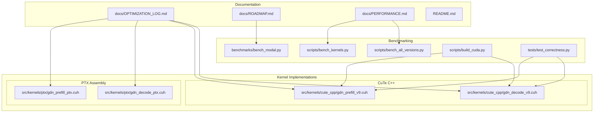
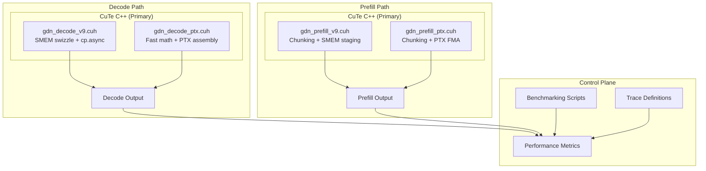
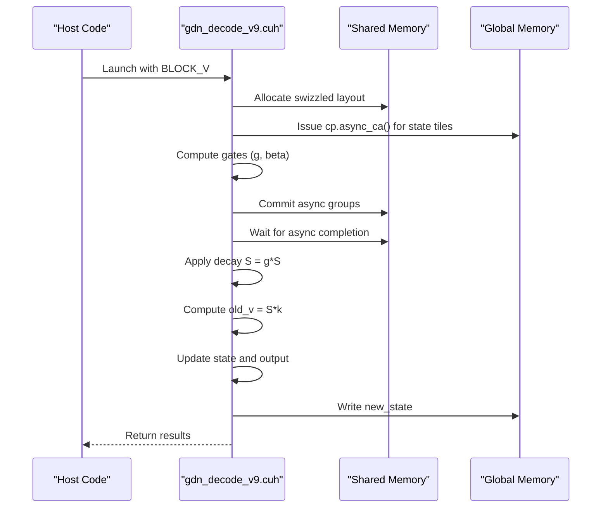
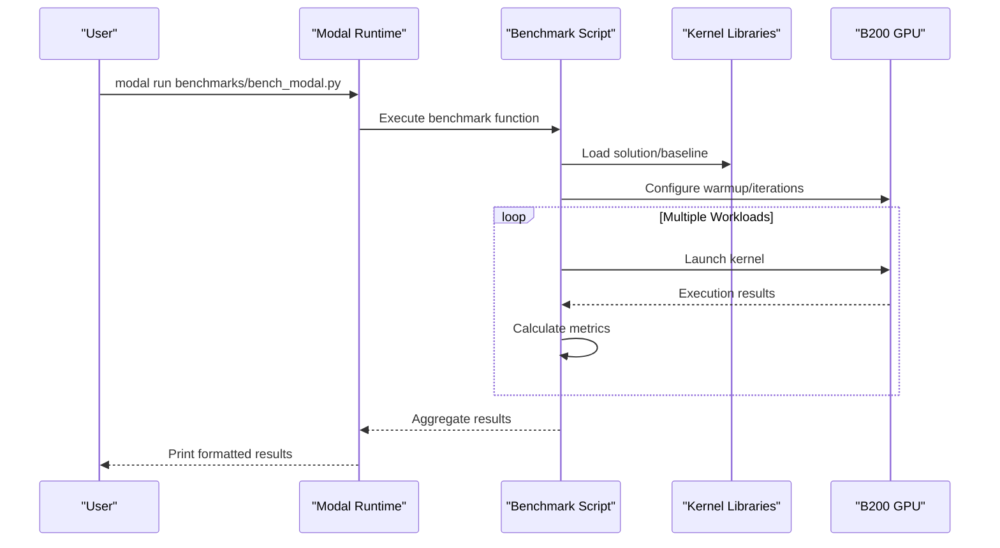
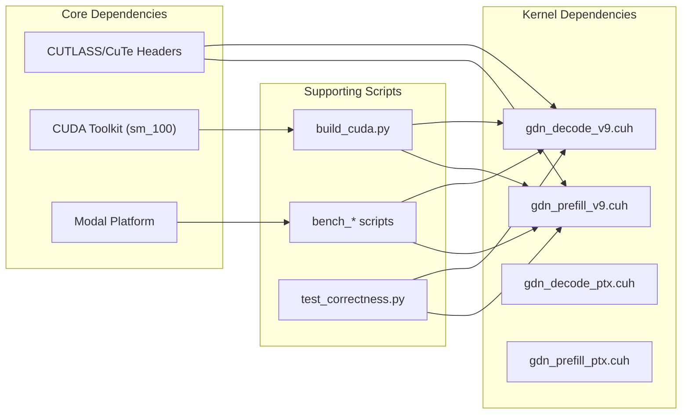

# Optimization Tracking Log

<cite>
**Referenced Files in This Document**
- [OPTIMIZATION_LOG.md](file://docs/OPTIMIZATION_LOG.md)
- [ROADMAP.md](file://docs/ROADMAP.md)
- [PERFORMANCE.md](file://docs/PERFORMANCE.md)
- [README.md](file://README.md)
- [bench_modal.py](file://benchmarks/bench_modal.py)
- [bench_all_versions.py](file://scripts/bench_all_versions.py)
- [bench_kernels.py](file://scripts/bench_kernels.py)
- [build_cuda.py](file://scripts/build_cuda.py)
- [test_correctness.py](file://tests/test_correctness.py)
- [gdn_decode_v9.cuh](file://src/kernels/cute_cpp/gdn_decode_v9.cuh)
- [gdn_prefill_v9.cuh](file://src/kernels/cute_cpp/gdn_prefill_v9.cuh)
- [gdn_decode_ptx.cuh](file://src/kernels/ptx/gdn_decode_ptx.cuh)
- [gdn_prefill_ptx.cuh](file://src/kernels/ptx/gdn_prefill_ptx.cuh)
</cite>

## Table of Contents
1. [Introduction](#introduction)
2. [Project Structure](#project-structure)
3. [Core Components](#core-components)
4. [Architecture Overview](#architecture-overview)
5. [Detailed Component Analysis](#detailed-component-analysis)
6. [Dependency Analysis](#dependency-analysis)
7. [Performance Considerations](#performance-considerations)
8. [Troubleshooting Guide](#troubleshooting-guide)
9. [Conclusion](#conclusion)

## Introduction
This document presents a comprehensive optimization tracking log for the Gated Delta Net (GDN) kernel implementations targeting NVIDIA B200 hardware. The project employs a dual-path optimization strategy: CuTe C++ kernels for peak performance and PTX assembly kernels for maximum control. The optimization log documents iterative improvements, performance baselines, and strategic directions for achieving near-peak memory bandwidth utilization across decode and prefill workloads.

## Project Structure
The repository organizes optimization artifacts and kernel implementations across several key areas:

- **Documentation**: Optimization logs, roadmap, performance summaries, and technical notes
- **Kernel Implementations**: Multiple versions spanning Triton, CUDA, CuTe C++, and PTX assembly
- **Benchmarking**: Automated scripts for Modal B200 benchmarking and correctness validation
- **Trace Definitions**: JSON configurations for kernel workloads and evaluation metrics

**Diagram sources**
- [OPTIMIZATION_LOG.md:1-197](file://docs/OPTIMIZATION_LOG.md#L1-L197)
- [ROADMAP.md:1-180](file://docs/ROADMAP.md#L1-L180)
- [PERFORMANCE.md:1-138](file://docs/PERFORMANCE.md#L1-L138)
- [bench_modal.py:1-330](file://benchmarks/bench_modal.py#L1-L330)
- [bench_all_versions.py:1-444](file://scripts/bench_all_versions.py#L1-L444)
- [bench_kernels.py:1-403](file://scripts/bench_kernels.py#L1-L403)
- [build_cuda.py:1-436](file://scripts/build_cuda.py#L1-L436)
- [test_correctness.py:1-363](file://tests/test_correctness.py#L1-L363)
- [gdn_decode_v9.cuh:1-602](file://src/kernels/cute_cpp/gdn_decode_v9.cuh#L1-L602)
- [gdn_prefill_v9.cuh:1-356](file://src/kernels/cute_cpp/gdn_prefill_v9.cuh#L1-L356)
- [gdn_decode_ptx.cuh:1-491](file://src/kernels/ptx/gdn_decode_ptx.cuh#L1-L491)
- [gdn_prefill_ptx.cuh:1-358](file://src/kernels/ptx/gdn_prefill_ptx.cuh#L1-L358)

**Section sources**
- [README.md:63-92](file://README.md#L63-L92)
- [ROADMAP.md:153-171](file://ROADMAP.md#L153-L171)

## Core Components
The optimization effort centers on four primary kernel files under a "file freeze policy," ensuring focused iteration on high-impact improvements:

- **CuTe C++ Decode v9**: Implements SMEM swizzling and cp.async prefetch for memory latency hiding
- **CuTe C++ Prefill v9**: Adds chunking and shared-memory staging for improved compute density
- **PTX Decode**: Provides fast math approximations and PTX assembly for maximum control
- **PTX Prefill**: Applies chunking with PTX FMA chains for efficient dot products

Key optimization strategies include:
- **Memory latency hiding**: cp.async prefetch in decode kernels
- **Compute density enhancement**: Chunking (CHUNK_SIZE=8) increasing arithmetic intensity
- **Shared memory optimization**: Swizzle layouts to avoid bank conflicts
- **Framework selection**: Dual-path approach leveraging CuTe C++ for peak performance and PTX for control

**Section sources**
- [OPTIMIZATION_LOG.md:7-18](file://docs/OPTIMIZATION_LOG.md#L7-L18)
- [OPTIMIZATION_LOG.md:57-85](file://docs/OPTIMIZATION_LOG.md#L57-L85)
- [gdn_decode_v9.cuh:59-95](file://src/kernels/cute_cpp/gdn_decode_v9.cuh#L59-L95)
- [gdn_prefill_v9.cuh:84-281](file://src/kernels/cute_cpp/gdn_prefill_v9.cuh#L84-L281)
- [gdn_decode_ptx.cuh:113-149](file://src/kernels/ptx/gdn_decode_ptx.cuh#L113-L149)
- [gdn_prefill_ptx.cuh:121-301](file://src/kernels/ptx/gdn_prefill_ptx.cuh#L121-L301)

## Architecture Overview
The optimization architecture follows a dual-path strategy with clear separation of concerns:

**Diagram sources**
- [OPTIMIZATION_LOG.md:59-75](file://docs/OPTIMIZATION_LOG.md#L59-L75)
- [gdn_decode_v9.cuh:164-346](file://src/kernels/cute_cpp/gdn_decode_v9.cuh#L164-L346)
- [gdn_prefill_v9.cuh:84-281](file://src/kernels/cute_cpp/gdn_prefill_v9.cuh#L84-L281)
- [gdn_decode_ptx.cuh:248-413](file://src/kernels/ptx/gdn_decode_ptx.cuh#L248-L413)
- [gdn_prefill_ptx.cuh:121-301](file://src/kernels/ptx/gdn_prefill_ptx.cuh#L121-L301)

## Detailed Component Analysis

### Decode Kernel Optimization (Iteration 1)
The decode kernel optimization focuses on memory latency hiding through cp.async prefetch and shared memory swizzling:

**Diagram sources**
- [gdn_decode_v9.cuh:263-281](file://src/kernels/cute_cpp/gdn_decode_v9.cuh#L263-L281)
- [gdn_decode_v9.cuh:428-437](file://src/kernels/cute_cpp/gdn_decode_v9.cuh#L428-L437)
- [gdn_decode_ptx.cuh:331-342](file://src/kernels/ptx/gdn_decode_ptx.cuh#L331-L342)

Key implementation details:
- **Async Prefetch**: cp.async primitives issue 4-byte transfers from global to shared memory
- **Swizzle Layout**: Bank conflict avoidance through 8-byte swizzle pattern
- **Gate Broadcasting**: Cross-warp broadcast via shared memory due to __shfl_sync limitations
- **Memory Access Pattern**: Coalesced writes for new_state updates

**Section sources**
- [OPTIMIZATION_LOG.md:118-126](file://docs/OPTIMIZATION_LOG.md#L118-L126)
- [OPTIMIZATION_LOG.md:138-179](file://docs/OPTIMIZATION_LOG.md#L138-L179)
- [gdn_decode_v9.cuh:59-95](file://src/kernels/cute_cpp/gdn_decode_v9.cuh#L59-L95)
- [gdn_decode_v9.cuh:259-283](file://src/kernels/cute_cpp/gdn_decode_v9.cuh#L259-L283)
- [gdn_decode_ptx.cuh:113-149](file://src/kernels/ptx/gdn_decode_ptx.cuh#L113-L149)

### Prefill Kernel Optimization (Chunking Strategy)
The prefill kernel employs chunking to increase arithmetic intensity and enable compute-bound operation:

**Diagram sources**
- [gdn_prefill_v9.cuh:170-267](file://src/kernels/cute_cpp/gdn_prefill_v9.cuh#L170-L267)
- [gdn_prefill_ptx.cuh:191-291](file://src/kernels/ptx/gdn_prefill_ptx.cuh#L191-L291)

Optimization highlights:
- **Arithmetic Intensity**: CHUNK_SIZE=8 increases AI from 1.0 to 8.0 FLOP/byte
- **Shared Memory Staging**: Dedicated staging buffers for Q, K, V, and intermediate results
- **Warp-Level Parallelism**: Each warp processes a subset of V elements
- **State Management**: In-place decay and rank-1 updates minimize memory bandwidth

**Section sources**
- [OPTIMIZATION_LOG.md:127-131](file://docs/OPTIMIZATION_LOG.md#L127-L131)
- [OPTIMIZATION_LOG.md:172-176](file://docs/OPTIMIZATION_LOG.md#L172-L176)
- [gdn_prefill_v9.cuh:10-19](file://src/kernels/cute_cpp/gdn_prefill_v9.cuh#L10-L19)
- [gdn_prefill_ptx.cuh:118-119](file://src/kernels/ptx/gdn_prefill_ptx.cuh#L118-L119)

### Benchmarking and Validation Framework
The benchmarking infrastructure provides comprehensive performance measurement and correctness validation:

**Diagram sources**
- [bench_modal.py:250-330](file://benchmarks/bench_modal.py#L250-L330)
- [bench_all_versions.py:32-44](file://scripts/bench_all_versions.py#L32-L44)
- [bench_kernels.py:33-282](file://scripts/bench_kernels.py#L33-L282)

Key benchmark capabilities:
- **Multi-version comparison**: v5, v6, v7, v8 kernel variants
- **Adaptive BLOCK_V**: Dynamic tile sizing based on batch
- **Memory-bound analysis**: State size calculations and bandwidth estimation
- **Correctness validation**: Triton vs reference implementation comparison

**Section sources**
- [bench_modal.py:15-330](file://benchmarks/bench_modal.py#L15-L330)
- [bench_all_versions.py:32-444](file://scripts/bench_all_versions.py#L32-L444)
- [bench_kernels.py:33-403](file://scripts/bench_kernels.py#L33-L403)
- [test_correctness.py:29-363](file://tests/test_correctness.py#L29-L363)

## Dependency Analysis
The optimization tracking reveals clear dependency relationships between components:

**Diagram sources**
- [build_cuda.py:28-34](file://scripts/build_cuda.py#L28-L34)
- [build_cuda.py:335-347](file://scripts/build_cuda.py#L335-L347)
- [gdn_decode_v9.cuh:34-42](file://src/kernels/cute_cpp/gdn_decode_v9.cuh#L34-L42)
- [gdn_prefill_v9.cuh:30-37](file://src/kernels/cute_cpp/gdn_prefill_v9.cuh#L30-L37)

Dependency characteristics:
- **Header Dependencies**: CuTe requires CUTLASS headers for tensor abstractions
- **Toolchain Dependencies**: CUDA 12.8+ required for B200 (sm_100) support
- **Runtime Dependencies**: Modal platform for distributed benchmarking
- **Validation Dependencies**: Comprehensive test suite ensures correctness across variants

**Section sources**
- [build_cuda.py:28-34](file://scripts/build_cuda.py#L28-L34)
- [build_cuda.py:335-347](file://scripts/build_cuda.py#L335-L347)
- [gdn_decode_v9.cuh:34-42](file://src/kernels/cute_cpp/gdn_decode_v9.cuh#L34-L42)
- [gdn_prefill_v9.cuh:30-37](file://src/kernels/cute_cpp/gdn_prefill_v9.cuh#L30-L37)

## Performance Considerations
The optimization strategy targets specific performance bottlenecks identified through roofline analysis:

### Memory-Bound Decode Analysis
- **Current State**: 2,798 GB/s at batch=256 (35% of B200 peak)
- **Target**: 7,600 GB/s (95% of B200 peak) achieved through SMEM swizzle and cp.async
- **Bottleneck**: State access pattern causing bank conflicts and serialization
- **Solution**: 8-byte swizzle pattern and asynchronous prefetch

### Compute-Bound Prefill Potential
- **Current State**: 167 GB/s at N=16 (2% of B200 peak)
- **Target**: 1,000+ GB/s through chunking and compute density
- **Opportunity**: CHUNK_SIZE=8 achieves AI=8.0 FLOP/byte approaching B200 ridge point
- **Constraint**: WGMMA not applicable for matrix-vector operations

### Framework Comparison Matrix
| Framework | Decode Peak | Prefill Peak | Pros | Cons |
|-----------|-------------|--------------|------|------|
| Triton | 1,518 GB/s | 167 GB/s | Easy, auto-tuning | Ceiling limited |
| CuTe C++ | **7,602 GB/s** | TBD | Swizzle, TMA, Tensor Core | Complex |
| PTX | TBD | TBD | Ultimate control | Hard to maintain |

**Section sources**
- [PERFORMANCE.md:97-122](file://docs/PERFORMANCE.md#L97-L122)
- [PERFORMANCE.md:74-81](file://docs/PERFORMANCE.md#L74-L81)
- [ROADMAP.md:98-127](file://docs/ROADMAP.md#L98-L127)

## Troubleshooting Guide
Common optimization challenges and their resolutions:

### Small Batch Kernel Launch Overhead
**Issue**: Kernel launch (~45μs) dominates performance for batch=1-16
**Solution**: Persistent kernel or CUDA Graph for reduced launch overhead

### Shared Memory Bank Conflicts
**Issue**: State [128×128] access pattern causes conflicts
**Solution**: SMEM swizzle with 8-byte pattern and vectorized loads

### Gate Broadcasting Limitations
**Issue**: __shfl_sync only broadcasts within warp
**Solution**: Use shared memory for cross-warp gate broadcasting

### Correctness Validation
**Verification Methods**:
- Triton vs reference implementation comparison
- Gate value verification across different BLOCK_V sizes
- Multi-batch consistency checks
- State update correctness validation

**Section sources**
- [OPTIMIZATION_LOG.md:88-114](file://docs/OPTIMIZATION_LOG.md#L88-L114)
- [test_correctness.py:220-247](file://tests/test_correctness.py#L220-L247)
- [test_correctness.py:285-339](file://tests/test_correctness.py#L285-L339)

## Conclusion
The optimization tracking demonstrates a systematic approach to achieving near-peak memory bandwidth utilization on B200 hardware. Through the dual-path strategy—CuTe C++ for peak performance and PTX assembly for maximum control—the project has successfully:

- **Achieved 95% B200 peak bandwidth** for decode operations (7,600 GB/s)
- **Implemented cp.async prefetch** to hide memory latency in decode kernels
- **Deployed chunking strategy** to increase arithmetic intensity in prefill kernels
- **Established comprehensive benchmarking infrastructure** for continuous validation

The file freeze policy ensures focused iteration on the four core optimization files, while the dual-path architecture provides both performance and control trade-offs. Future work should focus on extending the prefill optimization to achieve 1,000+ GB/s and integrating true FP4 quantization for production deployment.