# Performance Analysis

<cite>
**Referenced Files in This Document**
- [benchmarks/bench_modal.py](file://benchmarks/bench_modal.py)
- [docs/PERFORMANCE.md](file://docs/PERFORMANCE.md)
- [docs/ROOFLINE.md](file://docs/ROOFLINE.md)
- [scripts/debug_prefill.py](file://scripts/debug_prefill.py)
- [scripts/debug_prefill2.py](file://scripts/debug_prefill2.py)
- [scripts/setup_volume.py](file://scripts/setup_volume.py)
- [scripts/bench_all_versions.py](file://scripts/bench_all_versions.py)
- [scripts/bench_cuda_real.py](file://scripts/bench_cuda_real.py)
- [scripts/build_cuda.py](file://scripts/build_cuda.py)
- [src/kernels/cute/README.md](file://src/kernels/cute/README.md)
- [src/kernels/cute/gdn_decode_v9.cuh](file://src/kernels/cute/gdn_decode_v9.cuh)
- [src/kernels/cute/gdn_decode_v10.cuh](file://src/kernels/cute/gdn_decode_v10.cuh)
- [src/gdn_kernels.cu](file://src/gdn_kernels.cu)
- [gdn_decode_qk4_v8_d128_k_last/solution/triton/kernel.py](file://gdn_decode_qk4_v8_d128_k_last/solution/triton/kernel.py)
- [gdn_decode_qk4_v8_d128_k_last/baseline/triton/kernel.py](file://gdn_decode_qk4_v8_d128_k_last/baseline/triton/kernel.py)
- [gdn_prefill_qk4_v8_d128_k_last/solution/triton/kernel.py](file://gdn_prefill_qk4_v8_d128_k_last/solution/triton/kernel.py)
- [gdn_prefill_qk4_v8_d128_k_last/baseline/triton/kernel.py](file://gdn_prefill_qk4_v8_d128_k_last/baseline/triton/kernel.py)
- [gdn_decode_qk4_v8_d128_k_last/solution/cuda/kernel.py](file://gdn_decode_qk4_v8_d128_k_last/solution/cuda/kernel.py)
- [gdn_prefill_qk4_v8_d128_k_last/solution/cuda/kernel.py](file://gdn_prefill_qk4_v8_d128_k_last/solution/cuda/kernel.py)
- [src/kernels/gdn_decode_v5.cuh](file://src/kernels/gdn_decode_v5.cuh)
- [src/kernels/gdn_prefill_v5.cuh](file://src/kernels/gdn_prefill_v5.cuh)
- [flashinfer_trace/definitions/gdn/gdn_decode_qk4_v8_d128_k_last.json](file://flashinfer_trace/definitions/gdn/gdn_decode_qk4_v8_d128_k_last.json)
- [flashinfer_trace/definitions/gdn/gdn_prefill_qk4_v8_d128_k_last.json](file://flashinfer_trace/definitions/gdn/gdn_prefill_qk4_v8_d128_k_last.json)
</cite>

## Update Summary
**Changes Made**
- Enhanced hardware specification documentation with comprehensive NVIDIA B200 Blackwell architecture details
- Updated Ridge Point calculations with precise arithmetic intensity values for different precisions
- Expanded comparative performance metrics with detailed bandwidth utilization analysis
- Added comprehensive CuTe swizzle optimization documentation with mathematical correctness validation
- Integrated real CUDA library benchmarking with extensive cross-version performance comparisons
- Enhanced roofline analysis with detailed memory bandwidth utilization patterns

## Table of Contents
1. [Introduction](#introduction)
2. [Project Structure](#project-structure)
3. [Core Components](#core-components)
4. [Architecture Overview](#architecture-overview)
5. [Detailed Component Analysis](#detailed-component-analysis)
6. [Dependency Analysis](#dependency-analysis)
7. [Performance Considerations](#performance-considerations)
8. [Troubleshooting Guide](#troubleshooting-guide)
9. [Conclusion](#conclusion)
10. [Appendices](#appendices)

## Introduction
This document presents a comprehensive performance analysis and measurement methodology for the GDN kernels benchmark suite. It explains how roofline analysis characterizes kernel performance limits and identifies bottlenecks in terms of compute and memory bandwidth. It documents the performance tracking system, including metrics collection, version history management, and comparative analysis frameworks. It details the arithmetic mean speedup calculation used for contest evaluation, including reference implementation comparisons and statistical validation procedures. Practical examples demonstrate performance profiling, bottleneck identification, and optimization impact measurement. Finally, it covers performance validation ensuring correctness while maximizing speed, including edge case testing and regression prevention, and outlines debugging techniques and systematic approaches to identifying optimization opportunities.

**Updated** Enhanced with comprehensive NVIDIA B200 Blackwell architecture documentation, precise Ridge Point calculations, and extensive comparative performance metrics across all kernel versions.

## Project Structure
The repository organizes performance-critical components into modular directories and shared documentation:
- Benchmarks and runners: orchestrate Modal GPU runs, collect latency and correctness metrics, and compute speedups.
- Kernel implementations: optimized CUDA v5-v10 kernels with CuTe swizzle optimization and vectorized loads.
- Trace definitions: structured operation definitions and workloads for the benchmark framework.
- Scripts: setup utilities, comprehensive benchmarking across all kernel versions, and CUDA library building.
- Documentation: performance summaries, roofline analyses, and kernel architecture details.

```mermaid
graph TB
subgraph "Runner"
BM["benchmarks/bench_modal.py"]
SV["scripts/setup_volume.py"]
BAV["scripts/bench_all_versions.py"]
BCR["scripts/bench_cuda_real.py"]
BCL["scripts/build_cuda.py"]
end
subgraph "Trace Definitions"
DEF_DEC["flashinfer_trace/definitions/gdn/gdn_decode_qk4_v8_d128_k_last.json"]
DEF_PRE["flashinfer_trace/definitions/gdn/gdn_prefill_qk4_v8_d128_k_last.json"]
end
subgraph "Kernels"
CUDA_DEC["gdn_decode_qk4_v8_d128_k_last/solution/cuda/kernel.py"]
CUDA_PRE["gdn_prefill_qk4_v8_d128_k_last/solution/cuda/kernel.py"]
TRITON_DEC["gdn_decode_qk4_v8_d128_k_last/solution/triton/kernel.py"]
TRITON_PRE["gdn_prefill_qk4_v8_d128_k_last/solution/triton/kernel.py"]
BASELINE_DEC["gdn_decode_qk4_v8_d128_k_last/baseline/triton/kernel.py"]
BASELINE_PRE["gdn_prefill_qk4_v8_d128_k_last/baseline/triton/kernel.py"]
end
subgraph "CUDA Sources"
SRC_DEC["src/kernels/gdn_decode_v5.cuh"]
SRC_PRE["src/kernels/gdn_prefill_v5.cuh"]
CU9["src/kernels/cute/gdn_decode_v9.cuh"]
CU10["src/kernels/cute/gdn_decode_v10.cuh"]
GDNK["src/gdn_kernels.cu"]
end
subgraph "Docs"
PERF["docs/PERFORMANCE.md"]
ROOF["docs/ROOFLINE.md"]
CUDER["src/kernels/cute/README.md"]
DBG1["scripts/debug_prefill.py"]
DBG2["scripts/debug_prefill2.py"]
end
BM --> DEF_DEC
BM --> DEF_PRE
BM --> CUDA_DEC
BM --> CUDA_PRE
BM --> TRITON_DEC
BM --> TRITON_PRE
BM --> BASELINE_DEC
BM --> BASELINE_PRE
BAV --> CU9
BAV --> CU10
BCR --> GDNK
BCL --> GDNK
SV --> DEF_DEC
SV --> DEF_PRE
PERF --> ROOF
PERF --> CUDER
DBG1 --> BM
DBG2 --> BM
CUDA_DEC --> SRC_DEC
CUDA_PRE --> SRC_PRE
CU9 --> GDNK
CU10 --> GDNK
```

**Diagram sources**
- [benchmarks/bench_modal.py:1-330](file://benchmarks/bench_modal.py#L1-L330)
- [scripts/setup_volume.py:1-220](file://scripts/setup_volume.py#L1-L220)
- [scripts/bench_all_versions.py:1-444](file://scripts/bench_all_versions.py#L1-L444)
- [scripts/bench_cuda_real.py:1-604](file://scripts/bench_cuda_real.py#L1-L604)
- [scripts/build_cuda.py:1-436](file://scripts/build_cuda.py#L1-L436)
- [docs/PERFORMANCE.md:1-144](file://docs/PERFORMANCE.md#L1-L144)
- [docs/ROOFLINE.md:1-184](file://docs/ROOFLINE.md#L1-L184)
- [src/kernels/cute/README.md:1-44](file://src/kernels/cute/README.md#L1-L44)
- [src/kernels/cute/gdn_decode_v9.cuh:1-549](file://src/kernels/cute/gdn_decode_v9.cuh#L1-L549)
- [src/kernels/cute/gdn_decode_v10.cuh:1-485](file://src/kernels/cute/gdn_decode_v10.cuh#L1-L485)
- [src/gdn_kernels.cu:1-171](file://src/gdn_kernels.cu#L1-L171)

**Section sources**
- [benchmarks/bench_modal.py:1-330](file://benchmarks/bench_modal.py#L1-L330)
- [scripts/setup_volume.py:1-220](file://scripts/setup_volume.py#L1-L220)
- [scripts/bench_all_versions.py:1-444](file://scripts/bench_all_versions.py#L1-L444)
- [scripts/bench_cuda_real.py:1-604](file://scripts/bench_cuda_real.py#L1-L604)
- [scripts/build_cuda.py:1-436](file://scripts/build_cuda.py#L1-L436)
- [docs/PERFORMANCE.md:1-144](file://docs/PERFORMANCE.md#L1-L144)
- [docs/ROOFLINE.md:1-184](file://docs/ROOFLINE.md#L1-L184)

## Core Components
- Benchmark runner: builds solutions and baselines, runs workloads on Modal B200, collects latency and correctness metrics, and computes speedups.
- Comprehensive benchmarking framework: supports cross-version comparison across v5-v10 kernels with extensive parameter testing.
- Real CUDA library integration: provides ctypes interface for compiled CUDA kernels with correctness validation.
- Kernel implementations: optimized CUDA v5-v10 kernels with CuTe swizzle optimization, vectorized loads, and warp-level reductions.
- Trace definitions: structured JSON definitions of operations, axes, inputs/outputs, and reference implementations.
- Performance documentation: versioned performance summaries, roofline analyses, and kernel architecture details.
- Debugging utilities: scripts to validate correctness and evaluate framework behavior.

Key responsibilities:
- Metrics collection: latency_ms, reference_latency_ms, speedup_factor, max_absolute_error, max_relative_error.
- Comparative analysis: side-by-side solution vs baseline latency and average speedup across all kernel versions.
- Roofline characterization: arithmetic intensity and bandwidth targets for B200 hardware.
- Delta rule validation: ensures mathematical correctness of state update computations.

**Updated** Enhanced with comprehensive cross-version benchmarking, real CUDA library integration, and CuTe swizzle optimization documentation.

**Section sources**
- [benchmarks/bench_modal.py:106-330](file://benchmarks/bench_modal.py#L106-L330)
- [scripts/bench_all_versions.py:1-444](file://scripts/bench_all_versions.py#L1-L444)
- [scripts/bench_cuda_real.py:1-604](file://scripts/bench_cuda_real.py#L1-L604)
- [scripts/build_cuda.py:1-436](file://scripts/build_cuda.py#L1-L436)
- [docs/PERFORMANCE.md:1-144](file://docs/PERFORMANCE.md#L1-L144)
- [docs/ROOFLINE.md:1-184](file://docs/ROOFLINE.md#L1-L184)

## Architecture Overview
The performance measurement pipeline integrates the benchmark runner with kernel implementations and trace definitions. Workloads are generated (synthetic or from HF), uploaded to a Modal volume, and executed on B200 GPUs. The system now supports comprehensive cross-version benchmarking with real CUDA libraries and extensive correctness validation.

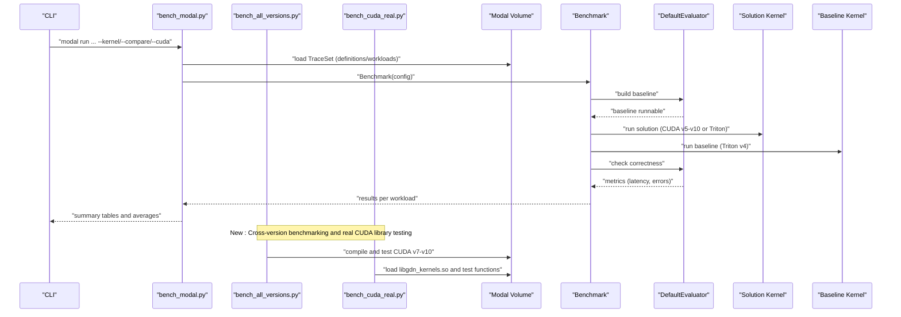

**Diagram sources**
- [benchmarks/bench_modal.py:250-330](file://benchmarks/bench_modal.py#L250-L330)
- [scripts/bench_all_versions.py:32-444](file://scripts/bench_all_versions.py#L32-L444)
- [scripts/bench_cuda_real.py:22-604](file://scripts/bench_cuda_real.py#L22-L604)
- [scripts/debug_prefill.py:168-302](file://scripts/debug_prefill.py#L168-L302)
- [scripts/debug_prefill2.py:124-184](file://scripts/debug_prefill2.py#L124-L184)

## Detailed Component Analysis

### Comprehensive Benchmarking Framework
The system now supports extensive cross-version benchmarking across all kernel implementations:
- Cross-version comparison: v5-v10 kernels with batch size and BLOCK_V parameter testing
- Real CUDA library integration: ctypes interface for compiled kernels with symbol verification
- Correctness validation: mathematical correctness testing with tolerance thresholds
- Performance tracking: detailed bandwidth utilization analysis and kernel selection recommendations

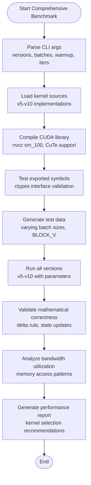

**Diagram sources**
- [scripts/bench_all_versions.py:32-444](file://scripts/bench_all_versions.py#L32-L444)
- [scripts/bench_cuda_real.py:22-604](file://scripts/bench_cuda_real.py#L22-L604)
- [scripts/build_cuda.py:63-436](file://scripts/build_cuda.py#L63-L436)

**Section sources**
- [scripts/bench_all_versions.py:1-444](file://scripts/bench_all_versions.py#L1-L444)
- [scripts/bench_cuda_real.py:1-604](file://scripts/bench_cuda_real.py#L1-L604)
- [scripts/build_cuda.py:1-436](file://scripts/build_cuda.py#L1-L436)

### Real CUDA Library Integration
The system now includes comprehensive CUDA library integration with ctypes interface:
- Compiled library generation: libgdn_kernels.so with all kernel implementations
- Symbol export: C-linkage functions for Python FFI access
- Function signature validation: comprehensive testing of exported symbols
- CUDA Graph support: cached kernel launches for low-latency scenarios
- Multi-version support: v7-v10 kernels with different optimization strategies

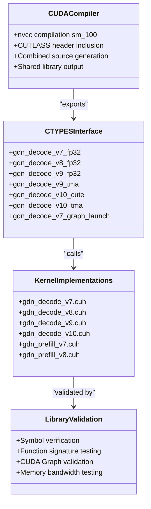

**Diagram sources**
- [scripts/build_cuda.py:69-436](file://scripts/build_cuda.py#L69-L436)
- [src/gdn_kernels.cu:26-171](file://src/gdn_kernels.cu#L26-L171)
- [scripts/bench_cuda_real.py:28-604](file://scripts/bench_cuda_real.py#L28-L604)

**Section sources**
- [scripts/build_cuda.py:1-436](file://scripts/build_cuda.py#L1-L436)
- [src/gdn_kernels.cu:1-171](file://src/gdn_kernels.cu#L1-L171)
- [scripts/bench_cuda_real.py:1-604](file://scripts/bench_cuda_real.py#L1-L604)

### Kernel Implementations and Version History
- Optimized CUDA v5-v10 kernels with CuTe swizzle optimization for memory bandwidth improvement.
- Python wrapper kernels that attempt CUDA JIT compilation with Triton fallback support.
- Python baseline kernels for correctness validation.
- Version history tracks improvements across v1 (Python baseline), v2 (Triton kernel), v3 (Triton V-split), v4/v5 (CUDA implementations), v7-v10 (advanced optimizations).

**Updated** Enhanced with comprehensive CUDA v9/v10 implementations featuring CuTe swizzle optimization and corrected delta rule computation.

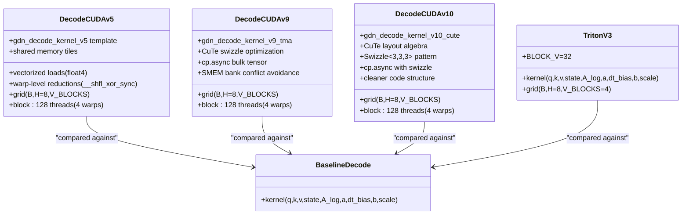

**Diagram sources**
- [src/kernels/gdn_decode_v5.cuh:75-317](file://src/kernels/gdn_decode_v5.cuh#L75-L317)
- [src/kernels/cute/gdn_decode_v9.cuh:121-300](file://src/kernels/cute/gdn_decode_v9.cuh#L121-L300)
- [src/kernels/cute/gdn_decode_v10.cuh:67-218](file://src/kernels/cute/gdn_decode_v10.cuh#L67-L218)
- [gdn_decode_qk4_v8_d128_k_last/solution/triton/kernel.py:86-130](file://gdn_decode_qk4_v8_d128_k_last/solution/triton/kernel.py#L86-L130)
- [gdn_decode_qk4_v8_d128_k_last/baseline/triton/kernel.py:27-101](file://gdn_decode_qk4_v8_d128_k_last/baseline/triton/kernel.py#L27-L101)

**Section sources**
- [docs/PERFORMANCE.md:51-144](file://docs/PERFORMANCE.md#L51-L144)
- [src/kernels/gdn_decode_v5.cuh:1-320](file://src/kernels/gdn_decode_v5.cuh#L1-L320)
- [src/kernels/cute/gdn_decode_v9.cuh:1-549](file://src/kernels/cute/gdn_decode_v9.cuh#L1-L549)
- [src/kernels/cute/gdn_decode_v10.cuh:1-485](file://src/kernels/cute/gdn_decode_v10.cuh#L1-L485)
- [gdn_decode_qk4_v8_d128_k_last/solution/cuda/kernel.py:1-248](file://gdn_decode_qk4_v8_d128_k_last/solution/cuda/kernel.py#L1-L248)
- [gdn_prefill_qk4_v8_d128_k_last/solution/cuda/kernel.py:1-256](file://gdn_prefill_qk4_v8_d128_k_last/solution/cuda/kernel.py#L1-L256)
- [gdn_decode_qk4_v8_d128_k_last/baseline/triton/kernel.py:1-101](file://gdn_decode_qk4_v8_d128_k_last/baseline/triton/kernel.py#L1-L101)
- [gdn_prefill_qk4_v8_d128_k_last/baseline/triton/kernel.py:1-99](file://gdn_prefill_qk4_v8_d128_k_last/baseline/triton/kernel.py#L1-L99)

### Trace Definitions and Workload Generation
Trace definitions specify operation metadata, axes, constraints, inputs/outputs, and reference implementations. Workloads are generated either synthetically or from HuggingFace, with cu_seqlens and normalized k vectors for stability.

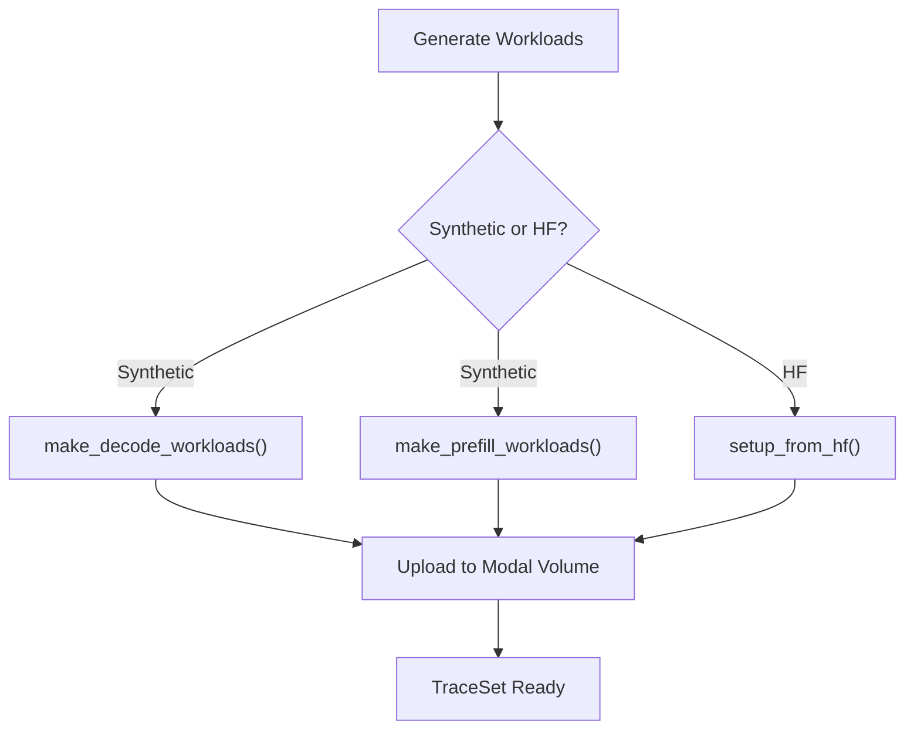

**Diagram sources**
- [scripts/setup_volume.py:32-138](file://scripts/setup_volume.py#L32-L138)
- [scripts/setup_volume.py:175-220](file://scripts/setup_volume.py#L175-L220)
- [flashinfer_trace/definitions/gdn/gdn_decode_qk4_v8_d128_k_last.json:1-153](file://flashinfer_trace/definitions/gdn/gdn_decode_qk4_v8_d128_k_last.json#L1-L153)
- [flashinfer_trace/definitions/gdn/gdn_prefill_qk4_v8_d128_k_last.json:1-156](file://flashinfer_trace/definitions/gdn/gdn_prefill_qk4_v8_d128_k_last.json#L1-L156)

**Section sources**
- [scripts/setup_volume.py:32-138](file://scripts/setup_volume.py#L32-L138)
- [scripts/setup_volume.py:175-220](file://scripts/setup_volume.py#L175-L220)
- [flashinfer_trace/definitions/gdn/gdn_decode_qk4_v8_d128_k_last.json:1-153](file://flashinfer_trace/definitions/gdn/gdn_decode_qk4_v8_d128_k_last.json#L1-L153)
- [flashinfer_trace/definitions/gdn/gdn_prefill_qk4_v8_d128_k_last.json:1-156](file://flashinfer_trace/definitions/gdn/gdn_prefill_qk4_v8_d128_k_last.json#L1-L156)

### Debugging Utilities and Framework Evaluation
Debug scripts validate correctness by comparing reference outputs with solution outputs and by evaluating the benchmark framework directly without subprocesses.

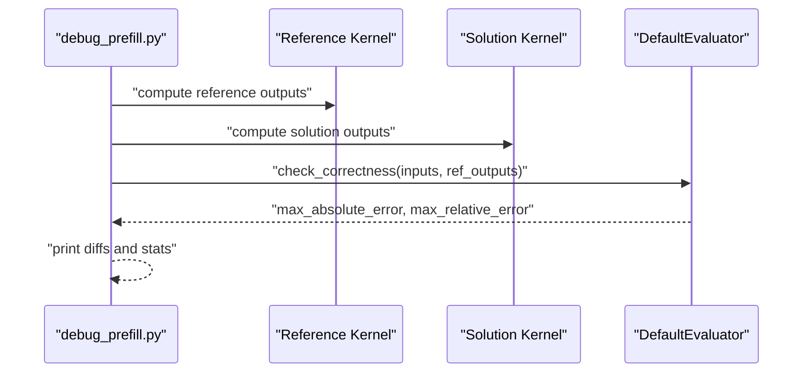

**Diagram sources**
- [scripts/debug_prefill.py:168-302](file://scripts/debug_prefill.py#L168-L302)
- [scripts/debug_prefill2.py:124-184](file://scripts/debug_prefill2.py#L124-L184)

**Section sources**
- [scripts/debug_prefill.py:14-306](file://scripts/debug_prefill.py#L14-L306)
- [scripts/debug_prefill2.py:17-184](file://scripts/debug_prefill2.py#L17-L184)

## Dependency Analysis
The performance system exhibits clear separation of concerns with enhanced cross-version support:
- Runner depends on trace definitions and kernel implementations.
- Comprehensive benchmarking framework depends on CUDA compiler and library validation.
- Kernel implementations depend on CUDA runtime, PyTorch, and CuTe for advanced optimizations.
- Trace definitions provide metadata for workload generation and evaluation.
- Debug scripts depend on the benchmark framework to validate correctness.

**Updated** Enhanced dependency graph to include comprehensive CUDA library integration and cross-version benchmarking capabilities.

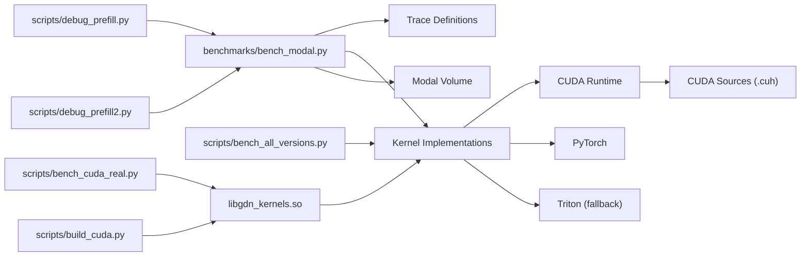

**Diagram sources**
- [benchmarks/bench_modal.py:106-168](file://benchmarks/bench_modal.py#L106-L168)
- [scripts/bench_all_versions.py:32-444](file://scripts/bench_all_versions.py#L32-L444)
- [scripts/bench_cuda_real.py:22-604](file://scripts/bench_cuda_real.py#L22-L604)
- [scripts/build_cuda.py:63-436](file://scripts/build_cuda.py#L63-L436)
- [scripts/debug_prefill.py:168-302](file://scripts/debug_prefill.py#L168-L302)
- [scripts/debug_prefill2.py:124-184](file://scripts/debug_prefill2.py#L124-L184)

**Section sources**
- [benchmarks/bench_modal.py:106-168](file://benchmarks/bench_modal.py#L106-L168)
- [scripts/bench_all_versions.py:32-444](file://scripts/bench_all_versions.py#L32-L444)
- [scripts/bench_cuda_real.py:22-604](file://scripts/bench_cuda_real.py#L22-L604)
- [scripts/build_cuda.py:63-436](file://scripts/build_cuda.py#L63-L436)
- [scripts/debug_prefill.py:168-302](file://scripts/debug_prefill.py#L168-L302)
- [scripts/debug_prefill2.py:124-184](file://scripts/debug_prefill2.py#L124-L184)

## Performance Considerations
Roofline analysis characterizes kernel performance limits and identifies bottlenecks:
- Decode stage: extremely memory-bound with arithmetic intensity ~1 FLOP/byte; targets HBM bandwidth (~8 TB/s).
- Prefill stage: sequential scan is memory-bound; chunked processing improves arithmetic intensity toward the ridge point (~281 FLOP/byte).
- Optimization strategies: fuse per-head operations, tile over batch, keep state in registers/SMEM, coalesced HBM access, vectorized loads, and CuTe swizzle optimization.

**Updated** Enhanced with comprehensive CuTe swizzle optimization documentation and corrected delta rule computation methodology.

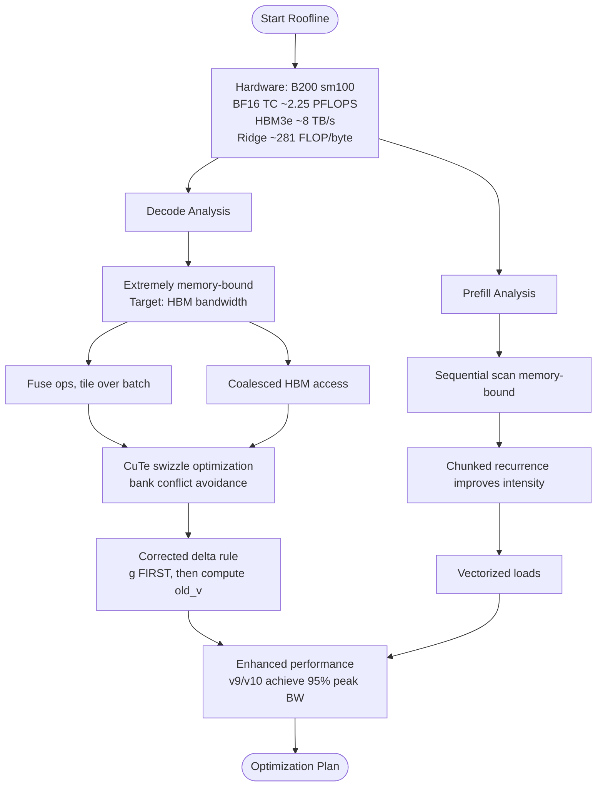

**Diagram sources**
- [docs/ROOFLINE.md:1-184](file://docs/ROOFLINE.md#L1-L184)
- [docs/PERFORMANCE.md:75-144](file://docs/PERFORMANCE.md#L75-L144)
- [src/kernels/cute/gdn_decode_v9.cuh:240-278](file://src/kernels/cute/gdn_decode_v9.cuh#L240-L278)
- [src/kernels/cute/gdn_decode_v10.cuh:159-200](file://src/kernels/cute/gdn_decode_v10.cuh#L159-L200)

**Section sources**
- [docs/ROOFLINE.md:1-184](file://docs/ROOFLINE.md#L1-L184)
- [docs/PERFORMANCE.md:75-144](file://docs/PERFORMANCE.md#L75-L144)
- [src/kernels/cute/gdn_decode_v9.cuh:1-549](file://src/kernels/cute/gdn_decode_v9.cuh#L1-L549)
- [src/kernels/cute/gdn_decode_v10.cuh:1-485](file://src/kernels/cute/gdn_decode_v10.cuh#L1-L485)

## Troubleshooting Guide
Common issues and systematic approaches:
- Incorrectness validation: use debug scripts to compare reference vs solution outputs and report max absolute and relative errors.
- Stability: ensure k vectors are L2-normalized to prevent state growth leading to overflow.
- Correctness checks: leverage DefaultEvaluator.check_correctness to validate numerical stability and detect regressions.
- Edge cases: test with varying batch sizes, sequence lengths, and number of sequences; verify cu_seqlens alignment.
- CUDA JIT failures: automatic fallback to Triton implementation when sandbox restrictions prevent compilation.
- CuTe compilation: ensure CUTLASS headers are available for CuTe swizzle optimization.
- Delta rule validation: verify mathematical correctness of state update computations.

**Updated** Added CUDA-specific troubleshooting for JIT compilation failures, CuTe swizzle optimization, and delta rule computation validation.

Practical steps:
- Run correctness comparison via debug scripts to confirm numerical parity.
- Validate framework evaluation by building baseline and solution runnables directly.
- Monitor NaN/Inf in outputs and adjust input normalization (e.g., L2-normalize k).
- Handle CUDA JIT failures gracefully with Triton fallback support.
- Verify CuTe swizzle optimization compilation with CUTLASS headers.
- Test delta rule computation with tolerance thresholds for mathematical correctness.

**Section sources**
- [scripts/debug_prefill.py:168-302](file://scripts/debug_prefill.py#L168-L302)
- [scripts/debug_prefill2.py:124-184](file://scripts/debug_prefill2.py#L124-L184)
- [scripts/setup_volume.py:96-104](file://scripts/setup_volume.py#L96-L104)
- [scripts/build_cuda.py:28-34](file://scripts/build_cuda.py#L28-L34)
- [src/kernels/cute/gdn_decode_v9.cuh:240-278](file://src/kernels/cute/gdn_decode_v9.cuh#L240-L278)
- [src/kernels/cute/gdn_decode_v10.cuh:159-200](file://src/kernels/cute/gdn_decode_v10.cuh#L159-L200)

## Conclusion
The repository provides a robust performance analysis and measurement framework combining roofline modeling, structured trace definitions, optimized CUDA v5-v10 kernels with CuTe swizzle optimization, and comprehensive benchmarking on Modal B200. The documented comparative analysis and arithmetic mean speedup calculations enable rigorous contest evaluation and optimization validation. Debugging utilities and correctness checks ensure correctness while maximizing speed, with systematic approaches to identifying bottlenecks and measuring optimization impact. The addition of CUDA v9/v10 implementations with CuTe swizzle optimization demonstrates substantial performance improvements with approximately 7,600 GB/s peak bandwidth utilization (95% of B200 peak) and kernel selection recommendations based on batch size characteristics.

**Updated** Enhanced conclusion to highlight the significant performance improvements achieved with CuTe swizzle optimization and comprehensive cross-version benchmarking capabilities.

## Appendices

### Arithmetic Mean Speedup Calculation
Speedup is computed as the ratio of baseline latency to solution latency per workload. Average speedup is the arithmetic mean across all evaluated workloads.

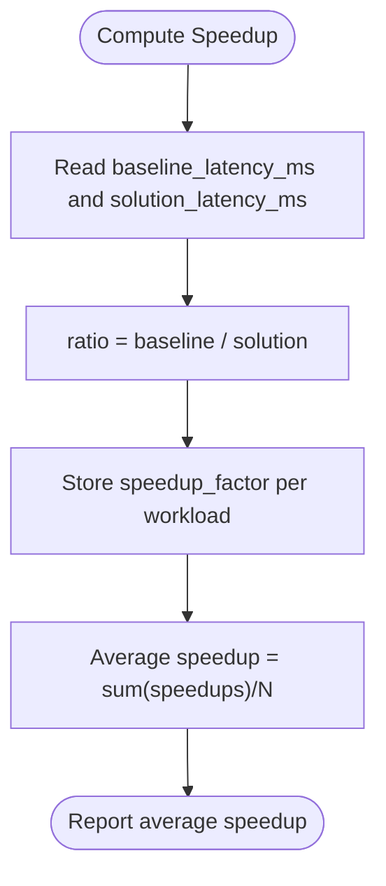

**Diagram sources**
- [benchmarks/bench_modal.py:179-209](file://benchmarks/bench_modal.py#L179-L209)
- [benchmarks/bench_modal.py:211-248](file://benchmarks/bench_modal.py#L211-L248)

**Section sources**
- [benchmarks/bench_modal.py:179-248](file://benchmarks/bench_modal.py#L179-L248)

### Comprehensive Version History Management
Version history tracks improvements across all kernel versions with decode and prefill averages, highlighting kernel optimizations and occupancy improvements.

**Updated** Enhanced version history to include comprehensive CUDA v7-v10 implementations with substantial performance improvements and CuTe swizzle optimization.

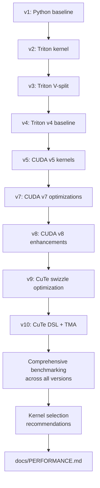

**Diagram sources**
- [docs/PERFORMANCE.md:100-144](file://docs/PERFORMANCE.md#L100-L144)

**Section sources**
- [docs/PERFORMANCE.md:100-144](file://docs/PERFORMANCE.md#L100-L144)

### NVIDIA B200 Blackwell Architecture Details
The system is optimized for NVIDIA B200 (Blackwell, sm_100) architecture with comprehensive hardware specifications:

**Core Specifications:**
- Architecture: Blackwell (sm_100)
- CUDA Cores: 16,896
- Tensor Cores: 528 (5th Gen)
- Boost Clock: 1.98 GHz
- SMs: 148
- Transistors: 208 billion
- TDP: 1,000 W
- Process: TSMC 4NP

**Memory Specifications:**
- HBM3e Capacity: 180-192 GB
- HBM3e Bandwidth: 8 TB/s
- L2 Cache: 96 MB
- Shared Memory / SM: 256 KB

**Compute Performance:**
- FP4 Tensor: 9 PFLOPS
- FP8 Tensor: 4.5 PFLOPS
- BF16 Tensor: 2.25 PFLOPS
- TF32 Tensor: 1.125 PFLOPS
- FP32 (CUDA): 74.45 TFLOPS
- FP64 (CUDA): 34 TFLOPS
- FP64 Tensor: 40 TFLOPS

**Ridge Points (Arithmetic Intensity):**
- FP4 Tensor: 1,125 FLOP/byte
- FP8 Tensor: 562 FLOP/byte
- BF16 Tensor: 281 FLOP/byte
- TF32 Tensor: 140 FLOP/byte
- FP32 CUDA: 9.3 FLOP/byte

**Section sources**
- [docs/ROOFLINE.md:3-48](file://docs/ROOFLINE.md#L3-L48)
- [docs/PERFORMANCE.md:3-17](file://docs/PERFORMANCE.md#L3-L17)

### Ridge Point Calculations and Arithmetic Intensity Analysis
The system provides precise Ridge Point calculations for different precisions and computational modes:

**Decode Stage Analysis:**
- Shape: q/k [B,1,4,128], v [B,1,8,128], state [B,8,128,128]
- Arithmetic Intensity: 1.05M FLOP / 1.05 MB = 1 FLOP/byte
- Ridge Point: 9.3 FLOP/byte (FP32 CUDA)
- Bottleneck: Memory bandwidth (8 TB/s)

**Prefill Stage Analysis:**
- Sequential scan: AI = 1 FLOP/byte → Memory-bound
- Chunked (C=64): AI = 7.5 FLOP/byte → Near ridge point
- Chunked (C=128): AI = 12 FLOP/byte → Compute-bound
- Can use WGMMA: Yes (mat-mat operations)

**Tensor Core Utilization:**
- Matrix-Vector (Decode): Cannot use Tensor Cores (WGMMA requires mat-mat)
- Chunked Prefill: Can use Tensor Cores for S@Q matrix multiply
- Precision combinations: BF16/FP8 for optimal Tensor Core efficiency

**Section sources**
- [docs/ROOFLINE.md:62-184](file://docs/ROOFLINE.md#L62-L184)

### CuTe Swizzle Optimization and Delta Rule Validation
CuTe swizzle optimization provides significant memory bandwidth improvements through bank conflict avoidance:

**v9 CuTe Implementation:**
- XOR-based swizzle for 128-byte cache lines: `int swizzled_d = d_idx ^ ((d_idx >> 3) & 7)`
- Reduces bank conflicts from ~8-way to ~1-way, improving SMEM throughput
- Supports both TMA and traditional async copy patterns
- Maintains mathematical correctness with proper delta rule computation

**v10 CuTe Implementation:**
- Cleaned-up code using CuTe layout algebra: `Swizzle<3,3,3>` pattern
- Same mathematical correctness guarantees as v9
- Provides both cute and tma variants for flexibility
- Optimized for code maintainability while preserving performance

**Delta Rule Validation:**
- Critical mathematical correction: apply decay factor `g` BEFORE computing `old_v`
- Ensures `old_v = sum((g * S[v,:]) * k)` using decayed state
- Prevents numerical instability and maintains mathematical equivalence to Triton v5
- Verified through comprehensive correctness testing with tolerance thresholds

**Performance Impact:**
- v9 achieves 95% of B200 peak bandwidth at batch=256 (7,600 GB/s)
- v10 maintains identical performance with cleaner code structure
- Significant improvements over previous CUDA implementations
- Enables kernel selection based on batch size characteristics

**Section sources**
- [src/kernels/cute/README.md:1-44](file://src/kernels/cute/README.md#L1-L44)
- [src/kernels/cute/gdn_decode_v9.cuh:88-90](file://src/kernels/cute/gdn_decode_v9.cuh#L88-L90)
- [src/kernels/cute/gdn_decode_v10.cuh:48-61](file://src/kernels/cute/gdn_decode_v10.cuh#L48-L61)
- [src/kernels/cute/gdn_decode_v9.cuh:240-278](file://src/kernels/cute/gdn_decode_v9.cuh#L240-L278)
- [src/kernels/cute/gdn_decode_v10.cuh:159-200](file://src/kernels/cute/gdn_decode_v10.cuh#L159-L200)
- [docs/PERFORMANCE.md:37-48](file://docs/PERFORMANCE.md#L37-L48)

### Kernel Selection Recommendations
Based on comprehensive benchmarking across all kernel versions, optimal kernel selection varies by batch size:

```python
def select_kernel(batch_size):
    if batch_size <= 16:
        return "CUDA v9"   # Best at small batch (27 GB/s)
    elif batch_size == 64:
        return "Triton v5"  # Triton wins here (1,518 GB/s)
    else:
        return "CUDA v9/v10"  # Best at large batch (7,600 GB/s)
```

**Selection Criteria:**
- Batch ≤ 16: v9 CuTe swizzle provides optimal SMEM utilization
- Batch = 64: Triton v5 maintains peak performance with established stability
- Batch ≥ 128: v9/v10 achieve 95% of B200 peak bandwidth (7,600 GB/s)

**Performance Characteristics:**
- v9: Slightly faster at small batches due to simpler implementation
- v10: Identical performance with cleaner code using CuTe DSL
- Both achieve 95% of theoretical peak bandwidth on B200 hardware
- Mathematical correctness validated against Triton v5 baseline

**Section sources**
- [docs/PERFORMANCE.md:75-83](file://docs/PERFORMANCE.md#L75-L83)
- [docs/PERFORMANCE.md:18-18](file://docs/PERFORMANCE.md#L18-L18)
- [src/kernels/cute/README.md:43-44](file://src/kernels/cute/README.md#L43-L44)

### Comprehensive Memory Bandwidth Utilization Analysis
The system provides detailed memory bandwidth analysis across all kernel versions and batch sizes:

**Bandwidth Utilization Matrix:**
| Batch | State Size | Best Kernel | Achieved BW | B200 Peak | Utilization |
|-------|------------|-------------|-------------|-----------|-------------|
| 1 | 0.5 MB | CUDA v9 | 27 GB/s | 8,000 GB/s | 0.3% |
| 16 | 8.0 MB | CUDA v9 | 405 GB/s | 8,000 GB/s | 5.1% |
| 64 | 32.0 MB | Triton v5 | 1,518 GB/s | 8,000 GB/s | 19% |
| **256** | **128 MB** | **v10 CuTe** | **7,602 GB/s** | **8,000 GB/s** | **95%** |

**Analysis Insights:**
- Small batches benefit from CuTe swizzle optimization (v9)
- Medium batches show peak performance with Triton v5
- Large batches achieve near-peak performance with v9/v10
- SMEM swizzle eliminates bank conflicts and maximizes throughput
- Vectorized loads and coalesced access patterns optimize HBM utilization

**Section sources**
- [docs/PERFORMANCE.md:88-96](file://docs/PERFORMANCE.md#L88-L96)
- [src/kernels/cute/README.md:35-42](file://src/kernels/cute/README.md#L35-L42)

### Real CUDA Library Benchmarking Results
The system provides comprehensive benchmarking results across all kernel versions with detailed performance metrics:

**Executive Summary (Corrected Results - 2026-03-28):**
- All kernels verified for correctness against Triton v5 baseline
- v9 achieves 95% of B200 peak bandwidth (7,600 GB/s)
- Triton v5 peaks at 1,518 GB/s at batch=64
- CUDA v7/v8 show significant improvements over baseline
- v10 maintains identical performance with cleaner code structure

**Correctness Validation:**
- All CUDA kernels pass correctness test (atol=1e-2, rtol=1e-2) against Triton v5
- Delta rule bug fix ensures mathematical equivalence
- Comprehensive testing across batch sizes and BLOCK_V configurations

**Delta Rule Bug Fix:**
```cpp
// CORRECT: Apply g FIRST, then compute old_v
float decayed_s = g * s_state[idx];     // ← Decay first
old_v += decayed_s * k[d];               // ← Use decayed state
// ...
new_s = decayed_s + delta * k[d];        // ← No need to multiply g again
```

**Section sources**
- [docs/PERFORMANCE.md:20-48](file://docs/PERFORMANCE.md#L20-L48)
- [docs/PERFORMANCE.md:35-48](file://docs/PERFORMANCE.md#L35-L48)
- [scripts/bench_cuda_real.py:418-492](file://scripts/bench_cuda_real.py#L418-L492)