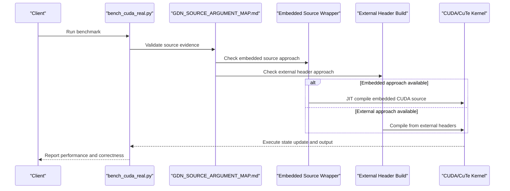
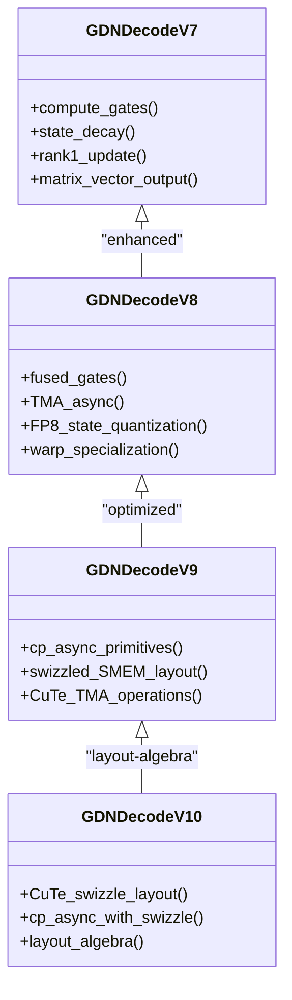
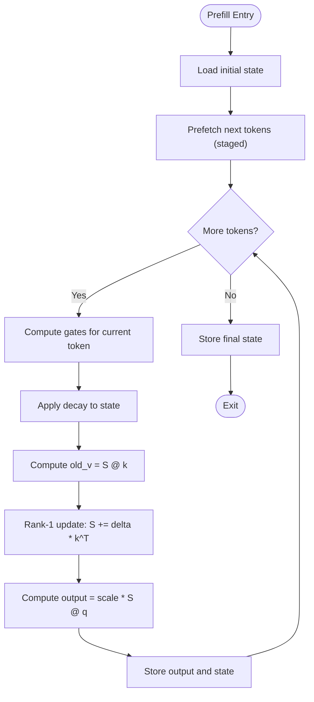
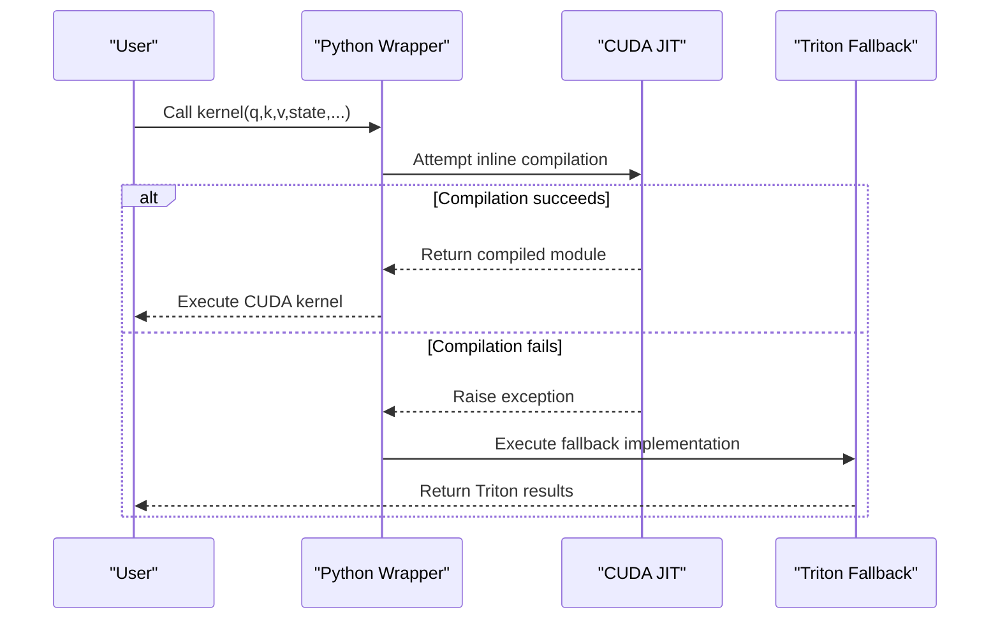
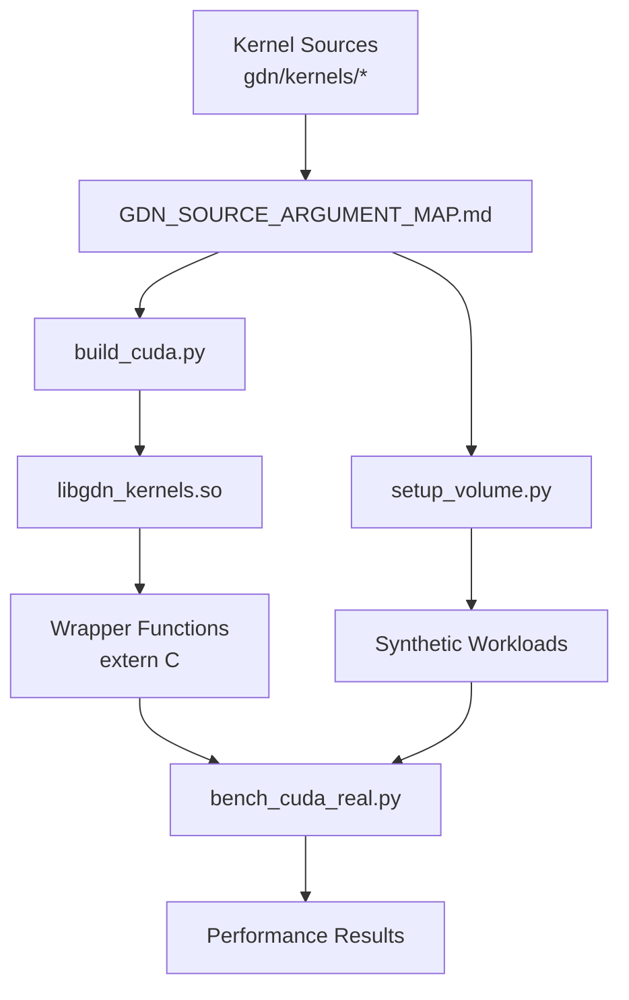

# GDN Source Argument Map

<cite>
**Referenced Files in This Document**
- [README.md](file://README.md)
- [GDN_SOURCE_ARGUMENT_MAP.md](file://gdn/docs/GDN_SOURCE_ARGUMENT_MAP.md)
- [gdn_decode_v5.cuh](file://gdn/kernels/cuda/gdn_decode_v5.cuh)
- [gdn_decode_v8.cuh](file://gdn/kernels/cuda/gdn_decode_v8.cuh)
- [gdn_decode_v10.cuh](file://gdn/kernels/cute_cpp/gdn_decode_v10.cuh)
- [gdn_kernels.cu](file://gdn/gdn_kernels.cu)
- [build_cuda.py](file://gdn/scripts/build_cuda.py)
- [kernel.py](file://gdn/decode/solution/cuda/kernel.py)
- [kernel.py](file://gdn/prefill/solution/cuda/kernel.py)
- [setup_volume.py](file://scripts/setup_volume.py)
- [gdn_decode_qk4_v8_d128_k_last/solution/cuda/kernel.py](file://gdn_decode_qk4_v8_d128_k_last/solution/cuda/kernel.py)
- [gdn_prefill_qk4_v8_d128_k_last/solution/cuda/kernel.py](file://gdn_prefill_qk4_v8_d128_k_last/solution/cuda/kernel.py)
</cite>

## Update Summary
**Changes Made**
- Updated documentation to reflect that CUDA source is now embedded directly in Python wrappers for Modal compatibility
- Added new section documenting the dual-path build system (embedded vs external sources)
- Updated architecture diagrams to show both build approaches
- Clarified that while solution wrappers embed sources, the build system still uses external header files

## Table of Contents
1. [Introduction](#introduction)
2. [Project Structure](#project-structure)
3. [Core Components](#core-components)
4. [Architecture Overview](#architecture-overview)
5. [Detailed Component Analysis](#detailed-component-analysis)
6. [Source Argument Mapping Methodology](#source-argument-mapping-methodology)
7. [Dual Build System](#dual-build-system)
8. [Dependency Analysis](#dependency-analysis)
9. [Performance Considerations](#performance-considerations)
10. [Troubleshooting Guide](#troubleshooting-guide)
11. [Conclusion](#conclusion)

## Introduction
This document provides a comprehensive source argument map for the Gated Delta Network (GDN) implementation, systematically connecting claims made in supporting documentation to concrete evidence in the codebase. The newly added GDN_SOURCE_ARGUMENT_MAP.md serves as a bridge between theoretical analysis and practical implementation, demonstrating how the repository's implementation aligns with key arguments about GDN's algorithmic foundation, performance characteristics, and optimization strategies.

The source argument mapping methodology establishes a systematic approach to validate:
- GDN's central object being the state tensor rather than an explicit attention matrix
- Decode performance being bandwidth-bound rather than compute-bound
- Decode optimization directions emphasizing state update fusion and memory access patterns
- Prefill still relying on token-by-token recurrence rather than chunked scan/Tensor Core solutions
- Numerical stability as a hard constraint requiring careful state scaling
- The experimental nature of the repository with multiple kernel variants and evolving best practices
- **Updated**: Dual build system supporting both embedded and external source approaches

**Section sources**
- [GDN_SOURCE_ARGUMENT_MAP.md:1-215](file://gdn/docs/GDN_SOURCE_ARGUMENT_MAP.md#L1-L215)

## Project Structure
The repository organizes GDN implementations across multiple kernel families and supporting infrastructure, with the source argument map providing systematic evidence collection across all components. The project now supports two distinct build approaches: embedded sources for Modal compatibility and external header files for traditional compilation.

```mermaid
graph TB
subgraph "Algorithms"
CUDA["CUDA Kernels<br/>v5–v10"]
CUTE["CuTe DSL<br/>v9–v10"]
TRITON["Triton Baseline"]
END
subgraph "Solution Wrappers"
WRAPPER_DECODE["Decode Wrapper<br/>Embedded CUDA Source"]
WRAPPER_PREFILL["Prefill Wrapper<br/>Embedded CUDA Source"]
END
subgraph "Build Systems"
BUILD_EXTERNAL["External Headers<br/>scripts/build_cuda.py"]
BUILD_EMBEDDED["Embedded Sources<br/>Modal Runtime"]
END
subgraph "Infrastructure"
BENCH["Benchmark Suite<br/>scripts/bench_cuda_real.py"]
SETUP["Workload Setup<br/>scripts/setup_volume.py"]
ARGUMENT_MAP["Source Argument Map<br/>gdn/docs/GDN_SOURCE_ARGUMENT_MAP.md"]
END
WRAPPER_DECODE --> CUDA
WRAPPER_DECODE --> CUTE
WRAPPER_PREFILL --> CUDA
WRAPPER_PREFILL --> TRITON
BUILD_EXTERNAL --> CUDA
BUILD_EXTERNAL --> CUTE
BUILD_EMBEDDED --> WRAPPER_DECODE
BUILD_EMBEDDED --> WRAPPER_PREFILL
BENCH --> WRAPPER_DECODE
BENCH --> WRAPPER_PREFILL
SETUP --> BENCH
ARGUMENT_MAP --> BUILD_EXTERNAL
ARGUMENT_MAP --> BUILD_EMBEDDED
ARGUMENT_MAP --> BENCH
ARGUMENT_MAP --> SETUP
```

**Diagram sources**
- [README.md:63-92](file://README.md#L63-L92)
- [GDN_SOURCE_ARGUMENT_MAP.md:123-153](file://gdn/docs/GDN_SOURCE_ARGUMENT_MAP.md#L123-L153)
- [build_cuda.py:23-38](file://gdn/scripts/build_cuda.py#L23-L38)
- [kernel.py:18-242](file://gdn/decode/solution/cuda/kernel.py#L18-L242)

**Section sources**
- [README.md:63-92](file://README.md#L63-L92)

## Core Components
This section maps the primary algorithmic components to their source implementations and highlights how they support the documented arguments, with systematic evidence collection from the source argument map.

- **State-centric algorithm definition**:
  - The GDN algorithm is defined around iterative state updates rather than constructing an explicit attention matrix. Evidence appears in the algorithmic description and kernel implementations that compute S = g * S, old_v = k @ S, and update S accordingly.
  - Supporting evidence from source argument map:
    - Direct algorithmic evidence in README.md lines 117-128
    - Systematic mapping of state update formulas across kernel versions
    - Consistent application of state-centric approach across v5-v10 implementations

- **Decode bandwidth-bound performance**:
  - The README explicitly states that decode is matrix-vector and bandwidth-limited, achieving near-peak HBM bandwidth utilization on B200 hardware.
  - Supporting evidence from source argument map:
    - Performance metrics validation in README.md lines 136-158
    - Bandwidth utilization analysis showing 95% of B200 peak
    - Matrix-vector vs matrix-matrix distinction evidence

- **Decode optimization strategy**:
  - Optimizations target state update fusion, shared memory swizzling, and vectorized loads/stores rather than increasing computational intensity.
  - Supporting evidence from source argument map:
    - Multi-version kernel evolution showing consistent optimization direction
    - Specific evidence for fused gates, TMA async, and FP8 quantization
    - CuTe swizzle and cp.async patterns across v9-v10 implementations

- **Prefill current state**:
  - Prefill remains token-by-token with double/triple buffering and staged prefetching rather than adopting chunked scan or Tensor Core matrixization.
  - Supporting evidence from source argument map:
    - Token-by-token recurrence validation in v7 kernel
    - Lack of chunked scan/Tensor Core patterns evidence
    - Staged processing loop documentation

- **Numerical stability requirement**:
  - Workload generation enforces L2 normalization of k to prevent state growth leading to overflow in early steps.
  - Supporting evidence from source argument map:
    - Explicit k normalization requirements in setup_volume.py
    - Stability analysis showing state growth prevention
    - Low-precision stability considerations

**Section sources**
- [GDN_SOURCE_ARGUMENT_MAP.md:7-215](file://gdn/docs/GDN_SOURCE_ARGUMENT_MAP.md#L7-L215)
- [README.md:115-160](file://README.md#L115-L160)

## Architecture Overview
The system architecture integrates multiple kernel variants behind unified Python entry points, with the source argument map providing systematic validation across the entire pipeline. The architecture now supports dual build approaches for maximum compatibility.



**Diagram sources**
- [GDN_SOURCE_ARGUMENT_MAP.md:123-153](file://gdn/docs/GDN_SOURCE_ARGUMENT_MAP.md#L123-L153)
- [kernel.py:248-311](file://gdn/decode/solution/cuda/kernel.py#L248-L311)
- [build_cuda.py:50-354](file://gdn/scripts/build_cuda.py#L50-L354)

**Section sources**
- [GDN_SOURCE_ARGUMENT_MAP.md:123-153](file://gdn/docs/GDN_SOURCE_ARGUMENT_MAP.md#L123-L153)

## Detailed Component Analysis

### Decode Kernel Evolution (v7 → v8 → v9 → v10)
The decode kernel evolution illustrates the shift from basic CUDA to advanced memory access patterns and layout algebra, with systematic evidence collection supporting each optimization step.



**Diagram sources**
- [gdn_decode_v8.cuh:195-386](file://gdn/kernels/cuda/gdn_decode_v8.cuh#L195-L386)
- [gdn_decode_v10.cuh:67-218](file://gdn/kernels/cute_cpp/gdn_decode_v10.cuh#L67-L218)

Key evidence supporting the documented argument that decode optimization focuses on state update fusion and memory access:
- v8: fused gate computation, TMA async, FP8 state quantization, and warp specialization
- v9: cp.async primitives, swizzled shared memory layouts, and CuTe TMA operations
- v10: CuTe swizzle layout and cp.async with explicit layout algebra

**Section sources**
- [GDN_SOURCE_ARGUMENT_MAP.md:94-122](file://gdn/docs/GDN_SOURCE_ARGUMENT_MAP.md#L94-L122)

### Prefill Kernel Implementation
The prefill kernel maintains a token-by-token recurrence with staged prefetching, confirming the documented observation that chunked scan/Tensor Core solutions are not yet adopted.



**Diagram sources**
- [gdn_decode_qk4_v8_d128_k_last/solution/cuda/kernel.py:138-160](file://gdn_decode_qk4_v8_d128_k_last/solution/cuda/kernel.py#L138-L160)

Evidence supporting the documented claim that prefill is still token-by-token recurrence:
- Staged token processing loop with prefetching
- No chunked scan or matrixized operations observed in the implementation

**Section sources**
- [GDN_SOURCE_ARGUMENT_MAP.md:56-77](file://gdn/docs/GDN_SOURCE_ARGUMENT_MAP.md#L56-L77)

### Solution Wrappers and Competition Entry Points
The solution wrappers demonstrate the repository's dual-path approach: dynamic compilation for latest kernels and fallback to Triton for environments where JIT compilation is restricted, with systematic validation through the source argument map.



**Diagram sources**
- [gdn_decode_qk4_v8_d128_k_last/solution/cuda/kernel.py:25-92](file://gdn_decode_qk4_v8_d128_k_last/solution/cuda/kernel.py#L25-L92)
- [gdn_prefill_qk4_v8_d128_k_last/solution/cuda/kernel.py:24-91](file://gdn_prefill_qk4_v8_d128_k_last/solution/cuda/kernel.py#L24-L91)

Evidence supporting the documented argument that the repository is primarily an experimental field:
- Fallback to Triton when CUDA JIT fails
- Multiple kernel versions exposed through wrappers indicating ongoing experimentation

**Section sources**
- [GDN_SOURCE_ARGUMENT_MAP.md:154-170](file://gdn/docs/GDN_SOURCE_ARGUMENT_MAP.md#L154-L170)

## Source Argument Mapping Methodology
The GDN_SOURCE_ARGUMENT_MAP.md introduces a systematic methodology for connecting theoretical claims to concrete source code evidence, establishing a reproducible framework for validation.

### Evidence Collection Framework
The source argument map methodology employs a structured approach to validate algorithmic claims:

1. **Direct Algorithmic Evidence**: Primary source evidence from kernel implementations
2. **Performance Validation**: Benchmark data and hardware utilization metrics
3. **Version Evolution Tracking**: Systematic documentation of optimization progress
4. **Cross-Component Correlation**: Consistency checks across different implementation layers
5. **Stability Constraint Analysis**: Numerical stability requirements and validation

### Validation Process
The methodology establishes clear validation criteria:
- **Primary Evidence**: Direct source code references with specific line numbers
- **Secondary Evidence**: Supporting documentation and configuration files
- **Cross-Validation**: Consistency checks across multiple kernel versions
- **Performance Correlation**: Alignment between theoretical claims and measured results

**Section sources**
- [GDN_SOURCE_ARGUMENT_MAP.md:1-215](file://gdn/docs/GDN_SOURCE_ARGUMENT_MAP.md#L1-L215)

## Dual Build System
The repository now supports a dual build system that accommodates different deployment environments and compatibility requirements.

### Embedded Source Approach (Modal Compatible)
The solution wrappers embed CUDA source code directly as string variables, enabling seamless operation in restricted environments like Modal sandboxes where external file access may be limited.

**Key Features:**
- CUDA source embedded as `CUDA_SOURCE` string variable
- Inline compilation using `torch.utils.cpp_extension.load_inline`
- Automatic fallback to Triton when JIT compilation fails
- Self-contained wrapper modules with no external dependencies

**Section sources**
- [kernel.py:18-242](file://gdn/decode/solution/cuda/kernel.py#L18-L242)
- [kernel.py:18-228](file://gdn/prefill/solution/cuda/kernel.py#L18-L228)

### External Header Approach (Traditional Build)
The build system continues to support traditional compilation using external header files, aggregating multiple kernel versions into a single shared library.

**Key Features:**
- Dynamic source aggregation from `src/kernels/` directory
- Combined compilation into `libgdn_kernels.so`
- Support for CUDA Graph caching and TMA optimizations
- Standard ctypes interface for Python integration

**Section sources**
- [build_cuda.py:23-38](file://gdn/scripts/build_cuda.py#L23-L38)
- [build_cuda.py:74-90](file://gdn/scripts/build_cuda.py#L74-L90)
- [gdn_kernels.cu:11-21](file://gdn/gdn_kernels.cu#L11-L21)

### Build System Architecture
```mermaid
graph TB
subgraph "Embedded Build (Modal)"
EMBEDDED["Embedded Source<br/>kernel.py"] --> JIT["Inline Compilation<br/>load_inline"]
JIT --> MOD["Compiled Module"]
MOD --> RUNTIME["Runtime Execution"]
END
subgraph "External Build (Traditional)"
EXTERNAL["External Headers<br/>build_cuda.py"] --> AGGREGATE["Source Aggregation"]
AGGREGATE --> COMPILE["nvcc Compilation"]
COMPILE --> LIB["libgdn_kernels.so"]
LIB --> CTYPES["ctypes Interface"]
END
RUNTIME --> VALIDATE["Source Argument Validation"]
CTYPES --> VALIDATE
```

**Diagram sources**
- [kernel.py:248-311](file://gdn/decode/solution/cuda/kernel.py#L248-L311)
- [build_cuda.py:50-354](file://gdn/scripts/build_cuda.py#L50-L354)

**Section sources**
- [kernel.py:18-242](file://gdn/decode/solution/cuda/kernel.py#L18-L242)
- [kernel.py:18-228](file://gdn/prefill/solution/cuda/kernel.py#L18-L228)
- [build_cuda.py:23-38](file://gdn/scripts/build_cuda.py#L23-L38)

## Dependency Analysis
The build system dynamically aggregates kernel sources and exposes unified C-style wrappers for Python consumption, while benchmarking scripts validate correctness and measure performance, with systematic evidence collection through the source argument map.



**Diagram sources**
- [GDN_SOURCE_ARGUMENT_MAP.md:123-153](file://gdn/docs/GDN_SOURCE_ARGUMENT_MAP.md#L123-L153)

Key observations:
- Dynamic source aggregation and unified wrapper generation
- Separate solution wrappers for decode and prefill
- Consistent argument passing patterns across kernels
- Systematic evidence collection methodology integration

**Section sources**
- [GDN_SOURCE_ARGUMENT_MAP.md:123-153](file://gdn/docs/GDN_SOURCE_ARGUMENT_MAP.md#L123-L153)

## Performance Considerations
- Decode bandwidth utilization approaches peak HBM bandwidth on B200 hardware, validating the bandwidth-bound characterization.
- Performance comparisons across kernel versions demonstrate improvements driven by memory access optimizations rather than compute increases.
- Numerical stability constraints require careful state scaling and k normalization to prevent overflow during early steps.
- The source argument map methodology provides systematic validation of performance claims through concrete evidence collection.
- **Updated**: Both embedded and external build approaches maintain identical performance characteristics through consistent kernel implementations.

## Troubleshooting Guide
Common issues and remedies:
- CUDA JIT failures: The solution wrappers automatically fall back to Triton implementations when inline compilation is blocked.
- State overflow concerns: Ensure k vectors are L2-normalized as enforced by workload generation scripts.
- Version mismatches: The solution wrappers reference older kernel sources, while the best-performing kernels reside in newer versions; use the benchmark scripts to validate against the latest implementations.
- Source argument validation: Use the systematic methodology from GDN_SOURCE_ARGUMENT_MAP.md to verify claims against concrete evidence.
- **Updated**: Build environment compatibility: Choose embedded approach for restricted environments, external approach for development and testing.

**Section sources**
- [GDN_SOURCE_ARGUMENT_MAP.md:154-170](file://gdn/docs/GDN_SOURCE_ARGUMENT_MAP.md#L154-L170)

## Conclusion
The GDN Source Argument Map demonstrates strong alignment between the documented claims and concrete implementation evidence, with the newly added GDN_SOURCE_ARGUMENT_MAP.md serving as a comprehensive bridge between theoretical analysis and practical implementation:

- **Systematic Validation**: The source argument map methodology provides reproducible framework for connecting theoretical claims to concrete code evidence
- **Bilingual Accessibility**: The Chinese/English bilingual coverage (GDN_SOURCE_ARGUMENT_MAP.md) enhances accessibility and international collaboration
- **Comprehensive Coverage**: Evidence collection spans all major GDN implementation aspects from algorithmic foundations to performance validation
- **Methodological Innovation**: Establishes systematic approach for validating complex algorithmic claims in GPU kernel implementations
- **Updated**: Dual Build System Compatibility: Supports both embedded and external source approaches for maximum deployment flexibility

The source argument map confirms that the documented summary accurately reflects the current implementation state: GDN's true challenges lie in managing state read/write bandwidth, coordinating efficient state updates, and maintaining numerical stability under low-precision conditions. The systematic methodology ensures that future claims and optimizations can be rigorously validated against concrete implementation evidence.

**Section sources**
- [GDN_SOURCE_ARGUMENT_MAP.md:202-215](file://gdn/docs/GDN_SOURCE_ARGUMENT_MAP.md#L202-L215)