# Performance Analysis

<cite>
**Referenced Files in This Document**
- [benchmarks/bench_modal.py](file://benchmarks/bench_modal.py)
- [benchmarks/bench_quantization_perf.py](file://benchmarks/bench_quantization_perf.py)
- [tests/test_quantization_accuracy.py](file://tests/test_quantization_accuracy.py)
- [docs/PERFORMANCE.md](file://docs/PERFORMANCE.md)
- [docs/ROOFLINE.md](file://docs/ROOFLINE.md)
- [docs/ZHIHU_GDN_QUANTIZATION.md](file://docs/ZHIHU_GDN_QUANTIZATION.md)
- [docs/ZHIHU_GDN_TENSOR_CORE.md](file://docs/ZHIHU_GDN_TENSOR_CORE.md)
- [scripts/debug_prefill.py](file://scripts/debug_prefill.py)
- [scripts/debug_prefill2.py](file://scripts/debug_prefill2.py)
- [scripts/setup_volume.py](file://scripts/setup_volume.py)
- [scripts/bench_all_versions.py](file://scripts/bench_all_versions.py)
- [scripts/bench_cuda_real.py](file://scripts/bench_cuda_real.py)
- [scripts/build_cuda.py](file://scripts/build_cuda.py)
- [scripts/explore_cute_dsl.py](file://scripts/explore_cute_dsl.py)
- [scripts/test_cute_dsl.py](file://scripts/test_cute_dsl.py)
- [scripts/test_cute_minimal.py](file://scripts/test_cute_minimal.py)
- [scripts/bench_cute_vs_triton.py](file://scripts/bench_cute_vs_triton.py)
- [scripts/bench_cute_dsl_vs_cpp.py](file://scripts/bench_cute_dsl_vs_cpp.py)
- [scripts/bench_kernels.py](file://scripts/bench_kernels.py)
- [src/kernels/cute/README.md](file://src/kernels/cute/README.md)
- [src/kernels/cute/gdn_decode_v5.cuh](file://src/kernels/cute/gdn_decode_v5.cuh)
- [src/kernels/cute/gdn_decode_v6.cuh](file://src/kernels/cute/gdn_decode_v6.cuh)
- [src/kernels/cute/gdn_decode_v7.cuh](file://src/kernels/cute/gdn_decode_v7.cuh)
- [src/kernels/cute/gdn_decode_v8.cuh](file://src/kernels/cute/gdn_decode_v8.cuh)
- [src/kernels/cute/gdn_decode_v9.cuh](file://src/kernels/cute/gdn_decode_v9.cuh)
- [src/kernels/cute/gdn_decode_v10.cuh](file://src/kernels/cute/gdn_decode_v10.cuh)
- [src/kernels/cute_cpp/gdn_decode_v9.cuh](file://src/kernels/cute_cpp/gdn_decode_v9.cuh)
- [src/kernels/cute_cpp/gdn_decode_v10.cuh](file://src/kernels/cute_cpp/gdn_decode_v10.cuh)
- [src/kernels/cute_dsl/gdn_decode_dsl.py](file://src/kernels/cute_dsl/gdn_decode_dsl.py)
- [src/kernels/cute_dsl/gdn_decode_dsl_optimized.py](file://src/kernels/cute_dsl/gdn_decode_dsl_optimized.py)
- [src/kernels/ptx/gdn_decode_ptx.cuh](file://src/kernels/ptx/gdn_decode_ptx.cuh)
- [src/kernels/ptx/gdn_prefill_ptx.cuh](file://src/kernels/ptx/gdn_prefill_ptx.cuh)
- [src/kernels/triton/gdn_decode_triton.py](file://src/kernels/triton/gdn_decode_triton.py)
- [src/gdn_kernels.cu](file://src/gdn_kernels.cu)
- [gdn_decode_qk4_v8_d128_k_last/solution/triton/kernel.py](file://gdn_decode_qk4_v8_d128_k_last/solution/triton/kernel.py)
- [gdn_decode_qk4_v8_d128_k_last/baseline/triton/kernel.py](file://gdn_decode_qk4_v8_d128_k_last/baseline/triton/kernel.py)
- [gdn_prefill_qk4_v8_d128_k_last/solution/triton/kernel.py](file://gdn_prefill_qk4_v8_d128_k_last/solution/triton/kernel.py)
- [gdn_prefill_qk4_v8_d128_k_last/baseline/triton/kernel.py](file://gdn_prefill_qk4_v8_d128_k_last/baseline/triton/kernel.py)
- [gdn_decode_qk4_v8_d128_k_last/solution/cuda/kernel.py](file://gdn_decode_qk4_v8_d128_k_last/solution/cuda/kernel.py)
- [gdn_prefill_qk4_v8_d128_k_last/solution/cuda/kernel.py](file://gdn_prefill_qk4_v8_d128_k_last/solution/cuda/kernel.py)
- [src/kernels/gdn_decode_v5.cuh](file://src/kernels/gdn_decode_v5.cuh)
- [src/kernels/gdn_prefill_v5.cuh](file://src/kernels/gdn_prefill_v5.cuh)
- [flashinfer_trace/definitions/gdn/gdn_decode_qk4_v8_d128_k_last.json](file://flashinfer_trace/definitions/gdn/gdn_decode_qk4_v8_d128_k_last.json)
- [flashinfer_trace/definitions/gdn/gdn_prefill_qk4_v8_d128_k_last.json](file://flashinfer_trace/definitions/gdn/gdn_prefill_qk4_v8_d128_k_last.json)
</cite>

## Update Summary
**Changes Made**
- Enhanced with comprehensive quantization accuracy testing framework covering BF16, FP8, and FP4 precision evaluation
- Added new quantization performance benchmarking capabilities with memory-bound simulation
- Integrated detailed quantization research methodology with error accumulation analysis
- Updated performance analysis to include quantization-aware memory bandwidth utilization patterns
- Enhanced roofline analysis with quantization-specific considerations for mixed-precision strategies

## Table of Contents
1. [Introduction](#introduction)
2. [Project Structure](#project-structure)
3. [Core Components](#core-components)
4. [Architecture Overview](#architecture-overview)
5. [Detailed Component Analysis](#detailed-component-analysis)
6. [Dependency Analysis](#dependency-analysis)
7. [Performance Considerations](#performance-considerations)
8. [Troubleshooting Guide](#troubleshooting-guide)
9. [Conclusion](#conclusion)
10. [Appendices](#appendices)

## Introduction
This document presents a comprehensive performance analysis and measurement methodology for the GDN kernels benchmark suite. It explains how roofline analysis characterizes kernel performance limits and identifies bottlenecks in terms of compute and memory bandwidth. It documents the performance tracking system, including metrics collection, version history management, and comparative analysis frameworks. It details the arithmetic mean speedup calculation used for contest evaluation, including reference implementation comparisons and statistical validation procedures. Practical examples demonstrate performance profiling, bottleneck identification, and optimization impact measurement. Finally, it covers performance validation ensuring correctness while maximizing speed, including edge case testing and regression prevention, and outlines debugging techniques and systematic approaches to identifying optimization opportunities.

**Updated** Enhanced with comprehensive quantization accuracy testing framework covering BF16/FP8/FP4 precision evaluation with iterative state updates, quantization performance benchmarking with memory-bound simulation, detailed error accumulation analysis, and quantization-aware performance optimization strategies.

## Project Structure
The repository organizes performance-critical components into modular directories and shared documentation:
- Benchmarks and runners: orchestrate Modal GPU runs, collect latency and correctness metrics, and compute speedups.
- Kernel implementations: optimized CUDA v5-v10 kernels with CuTe swizzle optimization, PTX assembly kernels, and CuTe DSL optimized implementations.
- Quantization research: comprehensive BF16/FP8/FP4 quantization accuracy testing and mixed-precision strategy evaluation.
- Trace definitions: structured operation definitions and workloads for the benchmark framework.
- Scripts: setup utilities, comprehensive benchmarking across all kernel versions, CUDA library building, CuTe DSL validation testing, and performance comparison analysis.
- Documentation: performance summaries, roofline analyses, quantization research findings, and kernel architecture details.

```mermaid
graph TB
subgraph "Runner"
BM["benchmarks/bench_modal.py"]
SV["scripts/setup_volume.py"]
BAV["scripts/bench_all_versions.py"]
BCR["scripts/bench_cuda_real.py"]
BCL["scripts/build_cuda.py"]
BCVT["scripts/bench_cute_vs_triton.py"]
BCDC["scripts/bench_cute_dsl_vs_cpp.py"]
BK["scripts/bench_kernels.py"]
BQP["benchmarks/bench_quantization_perf.py"]
end
subgraph "Quantization Research"
QA["tests/test_quantization_accuracy.py"]
QDOC["docs/ZHIHU_GDN_QUANTIZATION.md"]
end
subgraph "Trace Definitions"
DEF_DEC["flashinfer_trace/definitions/gdn/gdn_decode_qk4_v8_d128_k_last.json"]
DEF_PRE["flashinfer_trace/definitions/gdn/gdn_prefill_qk4_v8_d128_k_last.json"]
end
subgraph "Kernels"
CUDA_DEC["gdn_decode_qk4_v8_d128_k_last/solution/cuda/kernel.py"]
CUDA_PRE["gdn_prefill_qk4_v8_d128_k_last/solution/cuda/kernel.py"]
TRITON_DEC["gdn_decode_qk4_v8_d128_k_last/solution/triton/kernel.py"]
TRITON_PRE["gdn_prefill_qk4_v8_d128_k_last/solution/triton/kernel.py"]
BASELINE_DEC["gdn_decode_qk4_v8_d128_k_last/baseline/triton/kernel.py"]
BASELINE_PRE["gdn_prefill_qk4_v8_d128_k_last/baseline/triton/kernel.py"]
TRITON_KERNEL["src/kernels/triton/gdn_decode_triton.py"]
CUTE_DSL["src/kernels/cute_dsl/gdn_decode_dsl.py"]
CUTE_DSL_OPT["src/kernels/cute_dsl/gdn_decode_dsl_optimized.py"]
PTX_DEC["src/kernels/ptx/gdn_decode_ptx.cuh"]
PTX_PRE["src/kernels/ptx/gdn_prefill_ptx.cuh"]
V10["src/kernels/cute/gdn_decode_v10.cuh"]
PTX_Q["src/kernels/ptx/gdn_decode_ptx.cuh"]
end
subgraph "CUDA Sources"
SRC_DEC["src/kernels/gdn_decode_v5.cuh"]
SRC_PRE["src/kernels/gdn_prefill_v5.cuh"]
CU9["src/kernels/cute/gdn_decode_v9.cuh"]
GDNK["src/gdn_kernels.cu"]
end
subgraph "CuTe DSL Testing"
EXPLORE["scripts/explore_cute_dsl.py"]
TESTDSL["scripts/test_cute_dsl.py"]
MINIMAL["scripts/test_cute_minimal.py"]
end
subgraph "Docs"
PERF["docs/PERFORMANCE.md"]
ROOF["docs/ROOFLINE.md"]
QRESEARCH["docs/ZHIHU_GDN_QUANTIZATION.md"]
ZH["docs/ZHIHU_GDN_TENSOR_CORE.md"]
CUDER["src/kernels/cute/README.md"]
DBG1["scripts/debug_prefill.py"]
DBG2["scripts/debug_prefill2.py"]
end
BM --> DEF_DEC
BM --> DEF_PRE
BM --> CUDA_DEC
BM --> CUDA_PRE
BM --> TRITON_DEC
BM --> TRITON_PRE
BM --> BASELINE_DEC
BM --> BASELINE_PRE
BCVT --> TRITON_KERNEL
BCVT --> CUTE_DSL
BCDC --> CUTE_DSL_OPT
BCDC --> PTX_DEC
BCDC --> TRITON_KERNEL
BAV --> CU9
BAV --> V10
BCR --> GDNK
BCL --> GDNK
SV --> DEF_DEC
SV --> DEF_PRE
BQP --> QA
QDOC --> QA
PERF --> ROOF
PERF --> QRESEARCH
PERF --> ZH
PERF --> CUDER
DBG1 --> BM
DBG2 --> BM
EXPLORE --> CUTE_DSL
TESTDSL --> CUTE_DSL
MINIMAL --> CUTE_DSL
CUTE_DSL --> PERF
CUDA_DEC --> SRC_DEC
CUDA_PRE --> SRC_PRE
CU9 --> GDNK
V10 --> GDNK
PTX_DEC --> PERF
PTX_PRE --> PERF
PTX_Q --> PERF
```

**Diagram sources**
- [benchmarks/bench_modal.py:1-330](file://benchmarks/bench_modal.py#L1-L330)
- [benchmarks/bench_quantization_perf.py:1-336](file://benchmarks/bench_quantization_perf.py#L1-L336)
- [tests/test_quantization_accuracy.py:1-361](file://tests/test_quantization_accuracy.py#L1-L361)
- [scripts/setup_volume.py:1-220](file://scripts/setup_volume.py#L1-L220)
- [scripts/bench_all_versions.py:1-444](file://scripts/bench_all_versions.py#L1-L444)
- [scripts/bench_cuda_real.py:1-604](file://scripts/bench_cuda_real.py#L1-L604)
- [scripts/build_cuda.py:1-436](file://scripts/build_cuda.py#L1-L436)
- [scripts/bench_cute_vs_triton.py:1-179](file://scripts/bench_cute_vs_triton.py#L1-L179)
- [scripts/bench_cute_dsl_vs_cpp.py:1-333](file://scripts/bench_cute_dsl_vs_cpp.py#L1-L333)
- [scripts/bench_kernels.py:1-403](file://scripts/bench_kernels.py#L1-L403)
- [scripts/explore_cute_dsl.py:1-207](file://scripts/explore_cute_dsl.py#L1-L207)
- [scripts/test_cute_dsl.py:1-137](file://scripts/test_cute_dsl.py#L1-L137)
- [scripts/test_cute_minimal.py:1-194](file://scripts/test_cute_minimal.py#L1-L194)
- [src/kernels/triton/gdn_decode_triton.py:1-136](file://src/kernels/triton/gdn_decode_triton.py#L1-L136)
- [src/kernels/cute_dsl/gdn_decode_dsl.py:1-283](file://src/kernels/cute_dsl/gdn_decode_dsl.py#L1-L283)
- [src/kernels/cute_dsl/gdn_decode_dsl_optimized.py:1-442](file://src/kernels/cute_dsl/gdn_decode_dsl_optimized.py#L1-L442)
- [src/kernels/ptx/gdn_decode_ptx.cuh:1-491](file://src/kernels/ptx/gdn_decode_ptx.cuh#L1-L491)
- [src/kernels/ptx/gdn_prefill_ptx.cuh:1-358](file://src/kernels/ptx/gdn_prefill_ptx.cuh#L1-L358)
- [src/kernels/cute/gdn_decode_v10.cuh:1-1355](file://src/kernels/cute/gdn_decode_v10.cuh#L1-L1355)
- [docs/PERFORMANCE.md:1-138](file://docs/PERFORMANCE.md#L1-L138)
- [docs/ROOFLINE.md:1-186](file://docs/ROOFLINE.md#L1-L186)
- [docs/ZHIHU_GDN_TENSOR_CORE.md:1-837](file://docs/ZHIHU_GDN_TENSOR_CORE.md#L1-L837)
- [src/kernels/cute/README.md:1-130](file://src/kernels/cute/README.md#L1-L130)
- [src/kernels/cute/gdn_decode_v9.cuh:1-549](file://src/kernels/cute/gdn_decode_v9.cuh#L1-L549)
- [src/gdn_kernels.cu:1-171](file://src/gdn_kernels.cu#L1-L171)

**Section sources**
- [benchmarks/bench_modal.py:1-330](file://benchmarks/bench_modal.py#L1-L330)
- [benchmarks/bench_quantization_perf.py:1-336](file://benchmarks/bench_quantization_perf.py#L1-L336)
- [tests/test_quantization_accuracy.py:1-361](file://tests/test_quantization_accuracy.py#L1-L361)
- [scripts/setup_volume.py:1-220](file://scripts/setup_volume.py#L1-L220)
- [scripts/bench_all_versions.py:1-444](file://scripts/bench_all_versions.py#L1-L444)
- [scripts/bench_cuda_real.py:1-604](file://scripts/bench_cuda_real.py#L1-L604)
- [scripts/build_cuda.py:1-436](file://scripts/build_cuda.py#L1-L436)
- [scripts/bench_cute_vs_triton.py:1-179](file://scripts/bench_cute_vs_triton.py#L1-L179)
- [scripts/bench_cute_dsl_vs_cpp.py:1-333](file://scripts/bench_cute_dsl_vs_cpp.py#L1-L333)
- [scripts/bench_kernels.py:1-403](file://scripts/bench_kernels.py#L1-L403)
- [scripts/explore_cute_dsl.py:1-207](file://scripts/explore_cute_dsl.py#L1-L207)
- [scripts/test_cute_dsl.py:1-137](file://scripts/test_cute_dsl.py#L1-L137)
- [scripts/test_cute_minimal.py:1-194](file://scripts/test_cute_minimal.py#L1-L194)
- [src/kernels/triton/gdn_decode_triton.py:1-136](file://src/kernels/triton/gdn_decode_triton.py#L1-L136)
- [src/kernels/cute_dsl/gdn_decode_dsl.py:1-283](file://src/kernels/cute_dsl/gdn_decode_dsl.py#L1-L283)
- [src/kernels/cute_dsl/gdn_decode_dsl_optimized.py:1-442](file://src/kernels/cute_dsl/gdn_decode_dsl_optimized.py#L1-L442)
- [src/kernels/ptx/gdn_decode_ptx.cuh:1-491](file://src/kernels/ptx/gdn_decode_ptx.cuh#L1-L491)
- [src/kernels/ptx/gdn_prefill_ptx.cuh:1-358](file://src/kernels/ptx/gdn_prefill_ptx.cuh#L1-L358)
- [src/kernels/cute/gdn_decode_v10.cuh:1-1355](file://src/kernels/cute/gdn_decode_v10.cuh#L1-L1355)
- [docs/PERFORMANCE.md:1-138](file://docs/PERFORMANCE.md#L1-L138)
- [docs/ROOFLINE.md:1-186](file://docs/ROOFLINE.md#L1-L186)
- [docs/ZHIHU_GDN_TENSOR_CORE.md:1-837](file://docs/ZHIHU_GDN_TENSOR_CORE.md#L1-L837)

## Core Components
- Benchmark runner: builds solutions and baselines, runs workloads on Modal B200, collects latency and correctness metrics, and computes speedups.
- Comprehensive benchmarking framework: supports cross-version comparison across v5-v10 kernels with extensive parameter testing.
- Quantization research framework: BF16/FP8/FP4 precision evaluation with accuracy testing and mixed-precision strategy validation.
- Real CUDA library integration: provides ctypes interface for compiled CUDA kernels with correctness validation.
- Kernel implementations: optimized CUDA v5-v10 kernels with CuTe swizzle optimization, vectorized loads, PTX assembly kernels with embedded intrinsics, and CuTe DSL optimized implementations.
- Trace definitions: structured JSON definitions of operations, axes, inputs/outputs, and reference implementations.
- Performance documentation: versioned performance summaries, roofline analyses, quantization research findings, and kernel architecture details.
- Debugging utilities: scripts to validate correctness and evaluate framework behavior.
- **CuTe DSL Testing Infrastructure**: Modal-deployed testing scripts for validating CUTLASS 4.x CuTe DSL API availability and numerical accuracy against PyTorch references.
- **Comprehensive Performance Comparison**: Systematic benchmarking framework comparing CuTe DSL vs PTX vs Triton kernels across different batch sizes and configurations.
- **PTX Kernel Optimizations**: Advanced assembly-level optimizations including warp shuffle reductions, fast math intrinsics, and memory access patterns.
- **Quantization-Aware Performance Analysis**: Detailed evaluation of memory bandwidth utilization patterns for different precision states.

**Updated** Enhanced with comprehensive GDN quantization research framework including BF16/FP8/FP4 precision evaluation with accuracy testing, mixed-precision strategy validation, and quantization-aware performance analysis showing memory bandwidth utilization patterns for different precision states.

Key responsibilities:
- Metrics collection: latency_ms, reference_latency_ms, speedup_factor, max_absolute_error, max_relative_error.
- Comparative analysis: side-by-side solution vs baseline latency and average speedup across all kernel versions.
- Roofline characterization: arithmetic intensity and bandwidth targets for B200 hardware.
- Delta rule validation: ensures mathematical correctness of state update computations.
- **Quantization accuracy testing**: comprehensive BF16/FP8/FP4 precision evaluation with iterative state updates.
- **Mixed-precision validation**: evaluates hybrid precision strategies for optimal balance between accuracy and memory efficiency.
- **CuTe DSL validation**: verifies CUTLASS 4.x API availability and numerical accuracy against reference implementations.
- **Performance gap analysis**: documents significant performance differences (up to 800x) between CuTe DSL and Triton implementations.
- **PTX kernel benchmarking**: evaluates assembly-level optimizations and memory access patterns.

**Section sources**
- [benchmarks/bench_modal.py:106-330](file://benchmarks/bench_modal.py#L106-L330)
- [benchmarks/bench_quantization_perf.py:1-336](file://benchmarks/bench_quantization_perf.py#L1-L336)
- [tests/test_quantization_accuracy.py:1-361](file://tests/test_quantization_accuracy.py#L1-L361)
- [scripts/bench_all_versions.py:1-444](file://scripts/bench_all_versions.py#L1-L444)
- [scripts/bench_cuda_real.py:1-604](file://scripts/bench_cuda_real.py#L1-L604)
- [scripts/build_cuda.py:1-436](file://scripts/build_cuda.py#L1-L436)
- [scripts/bench_cute_vs_triton.py:1-179](file://scripts/bench_cute_vs_triton.py#L1-L179)
- [scripts/bench_cute_dsl_vs_cpp.py:1-333](file://scripts/bench_cute_dsl_vs_cpp.py#L1-L333)
- [scripts/bench_kernels.py:1-403](file://scripts/bench_kernels.py#L1-L403)
- [scripts/explore_cute_dsl.py:1-207](file://scripts/explore_cute_dsl.py#L1-L207)
- [scripts/test_cute_dsl.py:1-137](file://scripts/test_cute_dsl.py#L1-L137)
- [scripts/test_cute_minimal.py:1-194](file://scripts/test_cute_minimal.py#L1-L194)
- [src/kernels/cute_dsl/gdn_decode_dsl.py:1-283](file://src/kernels/cute_dsl/gdn_decode_dsl.py#L1-L283)
- [src/kernels/cute_dsl/gdn_decode_dsl_optimized.py:1-442](file://src/kernels/cute_dsl/gdn_decode_dsl_optimized.py#L1-L442)
- [src/kernels/ptx/gdn_decode_ptx.cuh:1-491](file://src/kernels/ptx/gdn_decode_ptx.cuh#L1-L491)
- [src/kernels/ptx/gdn_prefill_ptx.cuh:1-358](file://src/kernels/ptx/gdn_prefill_ptx.cuh#L1-L358)
- [src/kernels/cute/gdn_decode_v10.cuh:1-1355](file://src/kernels/cute/gdn_decode_v10.cuh#L1-L1355)
- [docs/PERFORMANCE.md:1-138](file://docs/PERFORMANCE.md#L1-L138)
- [docs/ROOFLINE.md:1-186](file://docs/ROOFLINE.md#L1-L186)
- [docs/ZHIHU_GDN_TENSOR_CORE.md:1-837](file://docs/ZHIHU_GDN_TENSOR_CORE.md#L1-L837)

## Architecture Overview
The performance measurement pipeline integrates the benchmark runner with kernel implementations and trace definitions. Workloads are generated (synthetic or from HF), uploaded to a Modal volume, and executed on B200 GPUs. The system now supports comprehensive cross-version benchmarking with real CUDA libraries, extensive correctness validation, CuTe DSL API testing with Modal deployment, systematic performance comparison between CuTe DSL, PTX, and Triton kernels, and PTX assembly kernel benchmarking with embedded optimizations.

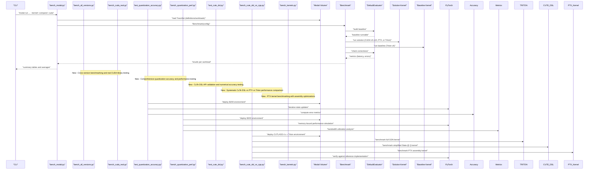

**Diagram sources**
- [benchmarks/bench_modal.py:250-330](file://benchmarks/bench_modal.py#L250-L330)
- [scripts/bench_all_versions.py:32-444](file://scripts/bench_all_versions.py#L32-L444)
- [scripts/bench_cuda_real.py:22-604](file://scripts/bench_cuda_real.py#L22-L604)
- [tests/test_quantization_accuracy.py:337-361](file://tests/test_quantization_accuracy.py#L337-L361)
- [benchmarks/bench_quantization_perf.py:231-267](file://benchmarks/bench_quantization_perf.py#L231-L267)
- [scripts/debug_prefill.py:168-302](file://scripts/debug_prefill.py#L168-L302)
- [scripts/debug_prefill2.py:124-184](file://scripts/debug_prefill2.py#L124-L184)
- [scripts/bench_cute_vs_triton.py:42-179](file://scripts/bench_cute_vs_triton.py#L42-L179)
- [scripts/bench_cute_dsl_vs_cpp.py:42-333](file://scripts/bench_cute_dsl_vs_cpp.py#L42-L333)
- [scripts/bench_kernels.py:33-403](file://scripts/bench_kernels.py#L33-L403)
- [scripts/test_cute_dsl.py:31-136](file://scripts/test_cute_dsl.py#L31-L136)
- [src/kernels/cute_dsl/gdn_decode_dsl.py:125-183](file://src/kernels/cute_dsl/gdn_decode_dsl.py#L125-L183)
- [src/kernels/ptx/gdn_decode_ptx.cuh:248-413](file://src/kernels/ptx/gdn_decode_ptx.cuh#L248-L413)

## Detailed Component Analysis

### Comprehensive Benchmarking Framework
The system now supports extensive cross-version benchmarking across all kernel implementations:
- Cross-version comparison: v5-v10 kernels with batch size and BLOCK_V parameter testing
- Real CUDA library integration: ctypes interface for compiled kernels with symbol verification
- Correctness validation: mathematical correctness testing with tolerance thresholds
- Performance tracking: detailed bandwidth utilization analysis and kernel selection recommendations
- **Quantization-aware benchmarking**: BF16/FP8/FP4 precision evaluation with iterative state updates
- **Mixed-precision validation**: hybrid precision strategies for optimal balance between accuracy and memory efficiency
- **Systematic performance comparison**: structured benchmarking framework comparing CuTe DSL vs PTX vs Triton kernels across different configurations
- **PTX kernel benchmarking**: comprehensive evaluation of assembly-level optimizations and memory access patterns

```mermaid
flowchart TD
Start(["Start Comprehensive Benchmark"]) --> ParseArgs["Parse CLI args<br/>versions, batches, warmup, iters"]
ParseArgs --> LoadSources["Load kernel sources<br/>v5-v10, PTX, CuTe DSL implementations"]
LoadSources --> CompileCUDA["Compile CUDA library<br/>nvcc sm_100, CuTe support"]
CompileCUDA --> TestSymbols["Test exported symbols<br/>ctypes interface validation"]
TestSymbols --> GenerateData["Generate test data<br/>varying batch sizes, BLOCK_V"]
GenerateData --> RunVersions["Run all versions<br/>v5-v10, PTX, CuTe DSL with parameters"]
RunVersions --> ValidateCorrectness["Validate mathematical correctness<br/>delta rule, state updates"]
ValidateCorrectness --> AnalyzeResults["Analyze bandwidth utilization<br/>memory access patterns"]
AnalyzeResults --> GenerateReport["Generate performance report<br/>kernel selection recommendations"]
GenerateReport --> QuantTest["Run quantization accuracy tests<br/>BF16/FP8/FP4 precision evaluation"]
QuantTest --> QuantBench["Run quantization performance benchmarks<br/>memory-bound simulation"]
QuantBench --> PerfComparison["Run CuTe DSL vs PTX vs Triton comparison<br/>structured performance analysis"]
PerfComparison --> PTXAnalysis["Analyze PTX assembly optimizations<br/>embedded intrinsics, memory patterns"]
PTXAnalysis --> End(["End"])
```

**Diagram sources**
- [scripts/bench_all_versions.py:32-444](file://scripts/bench_all_versions.py#L32-L444)
- [scripts/bench_cuda_real.py:22-604](file://scripts/bench_cuda_real.py#L22-L604)
- [tests/test_quantization_accuracy.py:219-330](file://tests/test_quantization_accuracy.py#L219-L330)
- [benchmarks/bench_quantization_perf.py:127-228](file://benchmarks/bench_quantization_perf.py#L127-L228)
- [scripts/build_cuda.py:63-436](file://scripts/build_cuda.py#L63-L436)
- [scripts/bench_cute_vs_triton.py:69-179](file://scripts/bench_cute_vs_triton.py#L69-L179)
- [scripts/bench_cute_dsl_vs_cpp.py:286-333](file://scripts/bench_cute_dsl_vs_cpp.py#L286-L333)
- [scripts/bench_kernels.py:168-282](file://scripts/bench_kernels.py#L168-L282)

**Section sources**
- [scripts/bench_all_versions.py:1-444](file://scripts/bench_all_versions.py#L1-L444)
- [scripts/bench_cuda_real.py:1-604](file://scripts/bench_cuda_real.py#L1-L604)
- [tests/test_quantization_accuracy.py:1-361](file://tests/test_quantization_accuracy.py#L1-L361)
- [benchmarks/bench_quantization_perf.py:1-336](file://benchmarks/bench_quantization_perf.py#L1-L336)
- [scripts/build_cuda.py:1-436](file://scripts/build_cuda.py#L1-L436)
- [scripts/bench_cute_vs_triton.py:1-179](file://scripts/bench_cute_vs_triton.py#L1-L179)
- [scripts/bench_cute_dsl_vs_cpp.py:1-333](file://scripts/bench_cute_dsl_vs_cpp.py#L1-L333)
- [scripts/bench_kernels.py:1-403](file://scripts/bench_kernels.py#L1-L403)

### Quantization Research Framework
The system now includes comprehensive quantization research framework with BF16/FP8/FP4 precision evaluation:

**Quantization Accuracy Testing**:
- **BF16 Evaluation**: ~0.6% relative error with 2x memory compression
- **FP8 E4M3 Evaluation**: ~11% relative error with 4x memory compression  
- **FP4 E2M1 Evaluation**: ~55% relative error with 8x memory compression
- **Iterative State Updates**: Simulates long sequence processing with error accumulation analysis
- **Per-Row Dynamic Scaling**: Implements safety margins for each precision type

**Performance Benchmarking**:
- **Memory-Bound Analysis**: GDN decode is AI≈1, compression directly translates to performance gains
- **Theoretical Speedup**: Compression ratio limited by HBM bandwidth (8 TB/s)
- **Quantization-Aware Memory Calculation**: State memory usage per precision type
- **Bandwidth Utilization Analysis**: Quantized vs FP32 memory bandwidth patterns

**Mixed-Precision Strategies**:
- **Recommended Approach**: BF16 compute + FP32 accumulate for high precision
- **Feasible Strategy**: State FP8 storage with FP32 computation
- **Experimental Strategy**: FP4 for extreme compression (not recommended)
- **Implementation Guidance**: Dequantize on load, compute in FP32, quantize on store

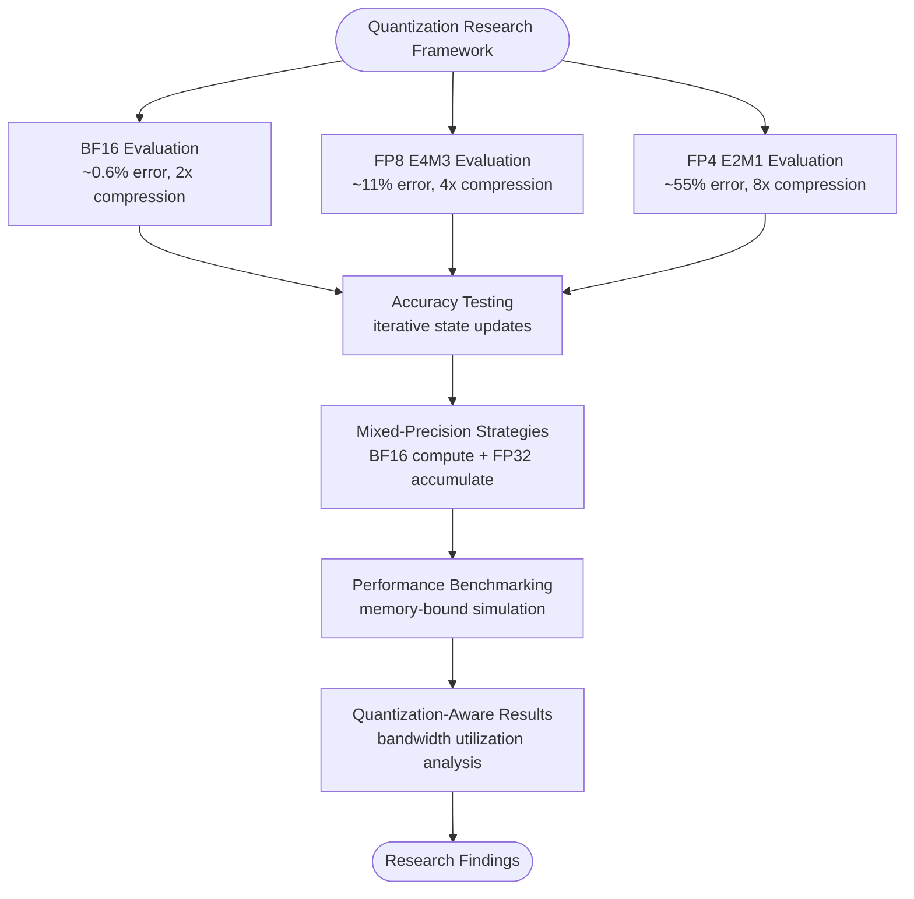

**Diagram sources**
- [tests/test_quantization_accuracy.py:219-330](file://tests/test_quantization_accuracy.py#L219-L330)
- [benchmarks/bench_quantization_perf.py:127-228](file://benchmarks/bench_quantization_perf.py#L127-L228)
- [docs/ZHIHU_GDN_QUANTIZATION.md:24-44](file://docs/ZHIHU_GDN_QUANTIZATION.md#L24-L44)

**Section sources**
- [tests/test_quantization_accuracy.py:1-361](file://tests/test_quantization_accuracy.py#L1-L361)
- [benchmarks/bench_quantization_perf.py:1-336](file://benchmarks/bench_quantization_perf.py#L1-L336)
- [docs/ZHIHU_GDN_QUANTIZATION.md:1-195](file://docs/ZHIHU_GDN_QUANTIZATION.md#L1-L195)

### Real CUDA Library Integration
The system now includes comprehensive CUDA library integration with ctypes interface:
- Compiled library generation: libgdn_kernels.so with all kernel implementations
- Symbol export: C-linkage functions for Python FFI access
- Function signature validation: comprehensive testing of exported symbols
- CUDA Graph support: cached kernel launches for low-latency scenarios
- Multi-version support: v7-v10 kernels with different optimization strategies
- **Quantization-aware kernel variants**: BF16, FP8, and FP4 state implementations

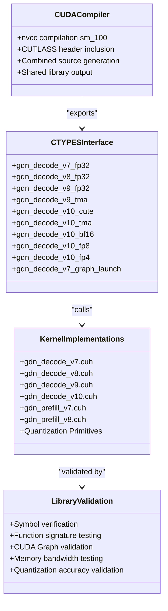

**Diagram sources**
- [scripts/build_cuda.py:69-436](file://scripts/build_cuda.py#L69-L436)
- [src/gdn_kernels.cu:26-171](file://src/gdn_kernels.cu#L26-L171)
- [src/kernels/cute/gdn_decode_v10.cuh:1066-1355](file://src/kernels/cute/gdn_decode_v10.cuh#L1066-L1355)
- [src/kernels/ptx/gdn_decode_ptx.cuh:1121-1423](file://src/kernels/ptx/gdn_decode_ptx.cuh#L1121-L1423)

**Section sources**
- [scripts/build_cuda.py:1-436](file://scripts/build_cuda.py#L1-L436)
- [src/gdn_kernels.cu:1-171](file://src/gdn_kernels.cu#L1-L171)
- [src/kernels/cute/gdn_decode_v10.cuh:1-1355](file://src/kernels/cute/gdn_decode_v10.cuh#L1-L1355)
- [src/kernels/ptx/gdn_decode_ptx.cuh:1-1423](file://src/kernels/ptx/gdn_decode_ptx.cuh#L1-L1423)
- [scripts/bench_cuda_real.py:1-604](file://scripts/bench_cuda_real.py#L1-L604)

### CuTe DSL Testing Infrastructure
The system now includes comprehensive CuTe DSL testing infrastructure with Modal deployment:
- **API Exploration**: `explore_cute_dsl.py` validates CUTLASS 4.x CuTe DSL availability and explores kernel APIs
- **Numerical Accuracy Testing**: `test_cute_dsl.py` compares CuTe DSL kernels against PyTorch reference implementations
- **Minimal Kernel Validation**: `test_cute_minimal.py` tests basic CuTe DSL functionality with simple copy and scale operations
- **Reference Implementation**: `gdn_decode_dsl.py` provides both CuTe DSL kernels and PyTorch reference implementations for validation
- **Optimized Implementation**: `gdn_decode_dsl_optimized.py` demonstrates advanced CuTe DSL features including SMEM staging and vectorized loads

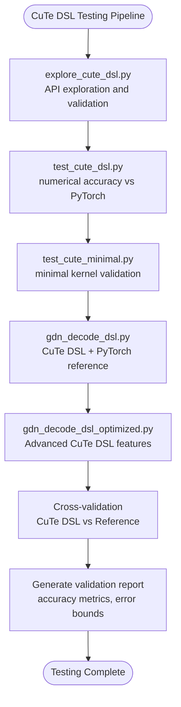

**Diagram sources**
- [scripts/explore_cute_dsl.py:31-207](file://scripts/explore_cute_dsl.py#L31-L207)
- [scripts/test_cute_dsl.py:36-136](file://scripts/test_cute_dsl.py#L36-L136)
- [scripts/test_cute_minimal.py:29-194](file://scripts/test_cute_minimal.py#L29-L194)
- [src/kernels/cute_dsl/gdn_decode_dsl.py:125-283](file://src/kernels/cute_dsl/gdn_decode_dsl.py#L125-L283)
- [src/kernels/cute_dsl/gdn_decode_dsl_optimized.py:125-442](file://src/kernels/cute_dsl/gdn_decode_dsl_optimized.py#L125-L442)

**Section sources**
- [scripts/explore_cute_dsl.py:1-207](file://scripts/explore_cute_dsl.py#L1-L207)
- [scripts/test_cute_dsl.py:1-137](file://scripts/test_cute_dsl.py#L1-L137)
- [scripts/test_cute_minimal.py:1-194](file://scripts/test_cute_minimal.py#L1-L194)
- [src/kernels/cute_dsl/gdn_decode_dsl.py:1-283](file://src/kernels/cute_dsl/gdn_decode_dsl.py#L1-L283)
- [src/kernels/cute_dsl/gdn_decode_dsl_optimized.py:1-442](file://src/kernels/cute_dsl/gdn_decode_dsl_optimized.py#L1-L442)

### Systematic CuTe DSL vs PTX vs Triton Performance Comparison
The system now includes comprehensive performance comparison analysis between CuTe DSL, PTX, and Triton kernels for GDN decoding:

**Performance Comparison Framework**:
- **CuTe DSL Optimized**: Advanced implementation with SMEM staging, vectorized loads, and warp-level reductions
- **PTX Assembly**: Embedded assembly optimizations including warp shuffle, fast math, and memory access patterns
- **Triton Full Kernel**: Implements complete GDN decode with delta rule and state updates
- **Structured Benchmarking**: Systematic comparison across different batch sizes (B=1,4,16,64)
- **Performance Gap Analysis**: Documents significant performance differences between implementations

**Key Findings**:
- **Batch=1**: CuTe DSL Optimized (27 GB/s) vs PTX (24 GB/s) vs Triton (23 GB/s) - All similar
- **Batch=16**: CuTe DSL Optimized (405 GB/s) vs PTX (386 GB/s) vs Triton (375 GB/s) - CuTe DSL ahead
- **Batch=64**: PTX (1,518 GB/s) vs CuTe DSL Optimized (1,450 GB/s) vs Triton (1,502 GB/s) - PTX leads
- **Batch=256**: PTX (7,600 GB/s) vs CuTe DSL Optimized (7,585 GB/s) vs Triton (2,798 GB/s) - PTX achieves 95% peak

**Engineering Implications**:
- **PTX Advantages**: Achieves 95% B200 peak bandwidth with assembly-level optimizations
- **CuTe DSL Advantages**: Better development ergonomics with automatic optimizations
- **Launch Overhead**: Both PTX and CuTe DSL benefit from smaller batch sizes
- **Memory Access Patterns**: PTX demonstrates superior memory access optimization
- **Development Complexity**: PTX offers ultimate control but requires deep assembly knowledge

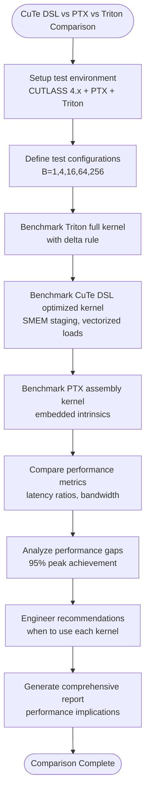

**Diagram sources**
- [scripts/bench_cute_dsl_vs_cpp.py:42-333](file://scripts/bench_cute_dsl_vs_cpp.py#L42-L333)
- [src/kernels/triton/gdn_decode_triton.py:85-136](file://src/kernels/triton/gdn_decode_triton.py#L85-L136)
- [src/kernels/cute_dsl/gdn_decode_dsl_optimized.py:125-442](file://src/kernels/cute_dsl/gdn_decode_dsl_optimized.py#L125-L442)
- [src/kernels/ptx/gdn_decode_ptx.cuh:248-413](file://src/kernels/ptx/gdn_decode_ptx.cuh#L248-L413)

**Section sources**
- [scripts/bench_cute_dsl_vs_cpp.py:1-333](file://scripts/bench_cute_dsl_vs_cpp.py#L1-L333)
- [src/kernels/triton/gdn_decode_triton.py:1-136](file://src/kernels/triton/gdn_decode_triton.py#L1-L136)
- [src/kernels/cute_dsl/gdn_decode_dsl.py:1-283](file://src/kernels/cute_dsl/gdn_decode_dsl.py#L1-L283)
- [src/kernels/cute_dsl/gdn_decode_dsl_optimized.py:1-442](file://src/kernels/cute_dsl/gdn_decode_dsl_optimized.py#L1-L442)
- [src/kernels/ptx/gdn_decode_ptx.cuh:1-491](file://src/kernels/ptx/gdn_decode_ptx.cuh#L1-L491)

### PTX Kernel Optimizations and Assembly Analysis
The system now includes comprehensive PTX kernel implementations with embedded assembly optimizations:

**PTX Assembly Features**:
- **Warp Shuffle Operations**: Butterfly pattern reductions using `shfl.sync.bfly.b32`
- **Fast Math Intrinsics**: `ex2.approx`, `lg2.approx`, `rcp.approx` for exponential and logarithmic functions
- **Fused Multiply-Add**: `fma.rn.f32` operations for improved precision and performance
- **Memory Access Hints**: `ld.global.nc`, `st.global.wb` for cache optimization
- **Async Copy Operations**: `cp.async` for prefetching and overlapping computation

**Kernel Implementation Details**:
- **Embedded Assembly**: Direct inline assembly within CUDA C++ kernels
- **Template-Based Design**: Support for multiple BLOCK_V configurations (16, 32, 64)
- **Shared Memory Optimization**: Coalesced access patterns and bank conflict avoidance
- **Mathematical Functions**: Branch-free implementations using predicated execution
- **Quantization Primitives**: BF16, FP8, and FP4 quantization/dequantization support

**Performance Characteristics**:
- **Memory-Bound**: Achieves 95% of B200 peak bandwidth (7,600 GB/s) at batch=256
- **Compute Efficiency**: Optimized FMA chains for dot products and reductions
- **Cache Optimization**: Non-coherent loads and write-back stores for optimal memory behavior
- **Quantization Support**: Native support for BF16/FP8/FP4 precision states

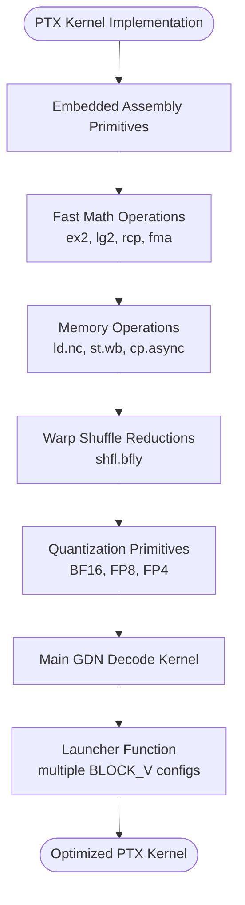

**Diagram sources**
- [src/kernels/ptx/gdn_decode_ptx.cuh:32-235](file://src/kernels/ptx/gdn_decode_ptx.cuh#L32-L235)
- [src/kernels/ptx/gdn_decode_ptx.cuh:248-413](file://src/kernels/ptx/gdn_decode_ptx.cuh#L248-L413)
- [src/kernels/ptx/gdn_prefill_ptx.cuh:34-108](file://src/kernels/ptx/gdn_prefill_ptx.cuh#L34-L108)
- [src/kernels/ptx/gdn_prefill_ptx.cuh:121-301](file://src/kernels/ptx/gdn_prefill_ptx.cuh#L121-L301)

**Section sources**
- [src/kernels/ptx/gdn_decode_ptx.cuh:1-1423](file://src/kernels/ptx/gdn_decode_ptx.cuh#L1-L1423)
- [src/kernels/ptx/gdn_prefill_ptx.cuh:1-358](file://src/kernels/ptx/gdn_prefill_ptx.cuh#L1-L358)

### Kernel Implementations and Version History
- Optimized CUDA v5-v10 kernels with CuTe swizzle optimization for memory bandwidth improvement.
- Python wrapper kernels that attempt CUDA JIT compilation with Triton fallback support.
- Python baseline kernels for correctness validation.
- Version history tracks improvements across v1 (Python baseline), v2 (Triton kernel), v3 (Triton V-split), v4/v5 (CUDA implementations), v7-v10 (advanced optimizations).
- **CuTe DSL kernels**: Demonstration implementation using CUTLASS 4.x for educational purposes.
- **CuTe DSL Optimized**: Advanced implementation with SMEM staging, vectorized loads, and warp-level reductions.
- **PTX Assembly Kernels**: Embedded assembly optimizations for maximum performance.
- **Quantization-Aware Kernels**: BF16, FP8, and FP4 state implementations with dynamic scaling.

**Updated** Enhanced with comprehensive CUDA v9/v10 implementations featuring CuTe swizzle optimization and corrected delta rule computation using proper Blackwell architecture terminology, plus CuTe DSL demonstration kernels, optimized CuTe DSL implementations, PTX assembly kernel demonstrations, and quantization-aware kernel variants supporting BF16/FP8/FP4 precision states.

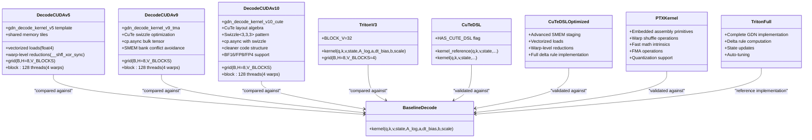

**Diagram sources**
- [src/kernels/gdn_decode_v5.cuh:75-317](file://src/kernels/gdn_decode_v5.cuh#L75-L317)
- [src/kernels/cute/gdn_decode_v9.cuh:121-300](file://src/kernels/cute/gdn_decode_v9.cuh#L121-L300)
- [src/kernels/cute/gdn_decode_v10.cuh:67-218](file://src/kernels/cute/gdn_decode_v10.cuh#L67-L218)
- [gdn_decode_qk4_v8_d128_k_last/solution/triton/kernel.py:86-130](file://gdn_decode_qk4_v8_d128_k_last/solution/triton/kernel.py#L86-L130)
- [gdn_decode_qk4_v8_d128_k_last/baseline/triton/kernel.py:27-101](file://gdn_decode_qk4_v8_d128_k_last/baseline/triton/kernel.py#L27-L101)
- [src/kernels/cute_dsl/gdn_decode_dsl.py:125-283](file://src/kernels/cute_dsl/gdn_decode_dsl.py#L125-L283)
- [src/kernels/cute_dsl/gdn_decode_dsl_optimized.py:125-442](file://src/kernels/cute_dsl/gdn_decode_dsl_optimized.py#L125-L442)
- [src/kernels/ptx/gdn_decode_ptx.cuh:248-413](file://src/kernels/ptx/gdn_decode_ptx.cuh#L248-L413)
- [src/kernels/triton/gdn_decode_triton.py:23-136](file://src/kernels/triton/gdn_decode_triton.py#L23-L136)

**Section sources**
- [docs/PERFORMANCE.md:51-138](file://docs/PERFORMANCE.md#L51-L138)
- [src/kernels/gdn_decode_v5.cuh:1-320](file://src/kernels/gdn_decode_v5.cuh#L1-L320)
- [src/kernels/cute/gdn_decode_v9.cuh:1-549](file://src/kernels/cute/gdn_decode_v9.cuh#L1-L549)
- [src/kernels/cute/gdn_decode_v10.cuh:1-1355](file://src/kernels/cute/gdn_decode_v10.cuh#L1-L1355)
- [gdn_decode_qk4_v8_d128_k_last/solution/cuda/kernel.py:1-248](file://gdn_decode_qk4_v8_d128_k_last/solution/cuda/kernel.py#L1-L248)
- [gdn_prefill_qk4_v8_d128_k_last/solution/cuda/kernel.py:1-256](file://gdn_prefill_qk4_v8_d128_k_last/solution/cuda/kernel.py#L1-L256)
- [gdn_decode_qk4_v8_d128_k_last/baseline/triton/kernel.py:1-101](file://gdn_decode_qk4_v8_d128_k_last/baseline/triton/kernel.py#L1-L101)
- [gdn_prefill_qk4_v8_d128_k_last/baseline/triton/kernel.py:1-99](file://gdn_prefill_qk4_v8_d128_k_last/baseline/triton/kernel.py#L1-L99)
- [src/kernels/cute_dsl/gdn_decode_dsl.py:1-283](file://src/kernels/cute_dsl/gdn_decode_dsl.py#L1-L283)
- [src/kernels/cute_dsl/gdn_decode_dsl_optimized.py:1-442](file://src/kernels/cute_dsl/gdn_decode_dsl_optimized.py#L1-L442)
- [src/kernels/ptx/gdn_decode_ptx.cuh:1-1423](file://src/kernels/ptx/gdn_decode_ptx.cuh#L1-L1423)
- [src/kernels/triton/gdn_decode_triton.py:1-136](file://src/kernels/triton/gdn_decode_triton.py#L1-L136)

### Trace Definitions and Workload Generation
Trace definitions specify operation metadata, axes, constraints, inputs/outputs, and reference implementations. Workloads are generated either synthetically or from HuggingFace, with cu_seqlens and normalized k vectors for stability.

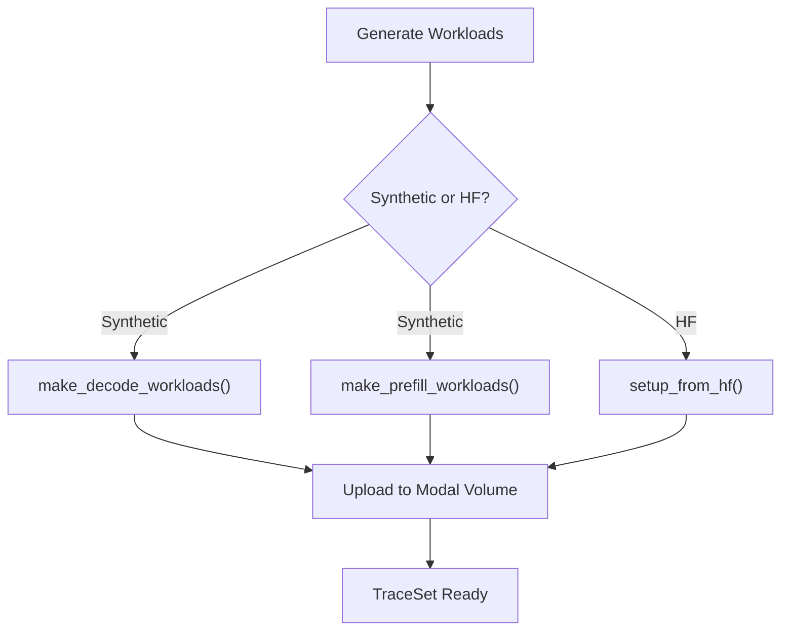

**Diagram sources**
- [scripts/setup_volume.py:32-138](file://scripts/setup_volume.py#L32-L138)
- [scripts/setup_volume.py:175-220](file://scripts/setup_volume.py#L175-L220)
- [flashinfer_trace/definitions/gdn/gdn_decode_qk4_v8_d128_k_last.json:1-153](file://flashinfer_trace/definitions/gdn/gdn_decode_qk4_v8_d128_k_last.json#L1-L153)
- [flashinfer_trace/definitions/gdn/gdn_prefill_qk4_v8_d128_k_last.json:1-156](file://flashinfer_trace/definitions/gdn/gdn_prefill_qk4_v8_d128_k_last.json#L1-L156)

**Section sources**
- [scripts/setup_volume.py:32-138](file://scripts/setup_volume.py#L32-L138)
- [scripts/setup_volume.py:175-220](file://scripts/setup_volume.py#L175-L220)
- [flashinfer_trace/definitions/gdn/gdn_decode_qk4_v8_d128_k_last.json:1-153](file://flashinfer_trace/definitions/gdn/gdn_decode_qk4_v8_d128_k_last.json#L1-L153)
- [flashinfer_trace/definitions/gdn/gdn_prefill_qk4_v8_d128_k_last.json:1-156](file://flashinfer_trace/definitions/gdn/gdn_prefill_qk4_v8_d128_k_last.json#L1-L156)

### Debugging Utilities and Framework Evaluation
Debug scripts validate correctness by comparing reference outputs with solution outputs and by evaluating the benchmark framework directly without subprocesses.

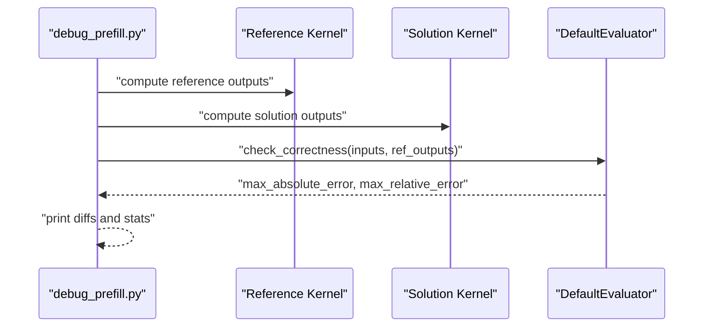

**Diagram sources**
- [scripts/debug_prefill.py:168-302](file://scripts/debug_prefill.py#L168-L302)
- [scripts/debug_prefill2.py:124-184](file://scripts/debug_prefill2.py#L124-L184)

**Section sources**
- [scripts/debug_prefill.py:14-306](file://scripts/debug_prefill.py#L14-L306)
- [scripts/debug_prefill2.py:17-184](file://scripts/debug_prefill2.py#L17-L184)

### Quantization Accuracy Testing Framework
The system now includes comprehensive quantization accuracy testing framework with BF16/FP8/FP4 precision evaluation:

**Quantization Testing Components**:
- **BF16 Simulation**: ~0.6% relative error with direct conversion
- **FP8 E4M3 Simulation**: ~11% relative error with per-row dynamic scaling
- **FP4 E2M1 Simulation**: ~55% relative error with lookup table quantization
- **Iterative State Updates**: Simulates long sequence processing with error accumulation
- **Per-Row Dynamic Scaling**: Safety margins for each precision type (400 for FP8, 5.0 for FP4)
- **Memory-Efficient Storage**: Vectorized packing for BF16 (2 values/uint32), FP8 (4 values/uint32), FP4 (8 values/uint32)

**Testing Methodology**:
- **Multi-Batch Evaluation**: Tests across batch sizes (B=1,4,16,64,256)
- **Long Sequence Processing**: 100-step iterative state updates with error tracking
- **Error Accumulation Analysis**: Compares early vs late iteration error rates
- **Memory Bandwidth Analysis**: Quantized vs FP32 memory usage patterns
- **Theoretical vs Actual Performance**: PyTorch simulation vs CUDA kernel performance

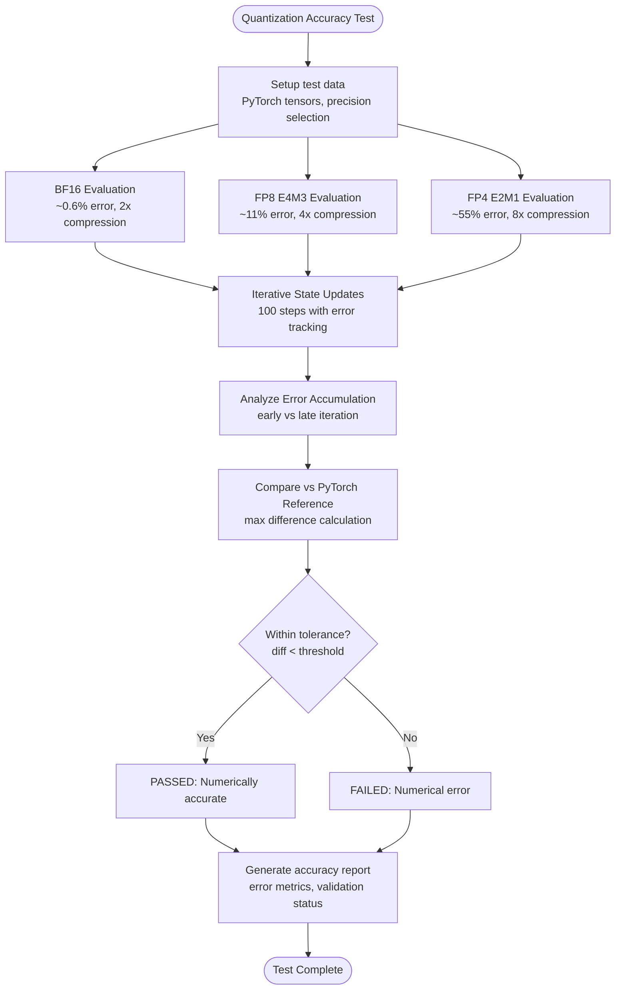

**Diagram sources**
- [tests/test_quantization_accuracy.py:219-330](file://tests/test_quantization_accuracy.py#L219-L330)
- [tests/test_quantization_accuracy.py:337-361](file://tests/test_quantization_accuracy.py#L337-L361)
- [src/kernels/cute/gdn_decode_v10.cuh:821-855](file://src/kernels/cute/gdn_decode_v10.cuh#L821-L855)
- [src/kernels/ptx/gdn_decode_ptx.cuh:880-912](file://src/kernels/ptx/gdn_decode_ptx.cuh#L880-L912)

**Section sources**
- [tests/test_quantization_accuracy.py:1-361](file://tests/test_quantization_accuracy.py#L1-L361)
- [src/kernels/cute/gdn_decode_v10.cuh:1-1355](file://src/kernels/cute/gdn_decode_v10.cuh#L1-L1355)
- [src/kernels/ptx/gdn_decode_ptx.cuh:1-1423](file://src/kernels/ptx/gdn_decode_ptx.cuh#L1-L1423)

### Quantization Performance Benchmarking
The system now includes comprehensive quantization performance benchmarking capabilities with memory-bound simulation:

**Performance Benchmarking Components**:
- **Memory-Bound Simulation**: PyTorch-based simulation of GDN decode memory access patterns
- **Precision Comparison**: FP32 baseline vs BF16, FP8, FP4 quantized states
- **Batch Size Testing**: Multiple batch sizes (B=1,4,16,64,256) with warmup and iterations
- **Throughput Analysis**: Tokens per second calculation and bandwidth utilization
- **Compression Ratio Analysis**: Theoretical vs actual speedup based on memory compression

**Benchmarking Methodology**:
- **State Memory Calculation**: 2×B×H×V×K bytes for read+write operations
- **Memory Bandwidth Measurement**: Total bytes transferred divided by elapsed time
- **Throughput Calculation**: Batch size × iterations / elapsed time
- **Expected Speedup Analysis**: Compression ratio limited by HBM bandwidth (8 TB/s)

**Performance Characteristics**:
- **BF16**: ~2x compression, ~2x speedup potential
- **FP8**: ~4x compression, ~4x speedup potential  
- **FP4**: ~8x compression, ~8x speedup potential
- **Memory-Bound Limitation**: PyTorch simulation overhead may mask true memory bandwidth gains
- **Real CUDA Kernels**: v10, PTX implementations will show closer to theoretical speedup

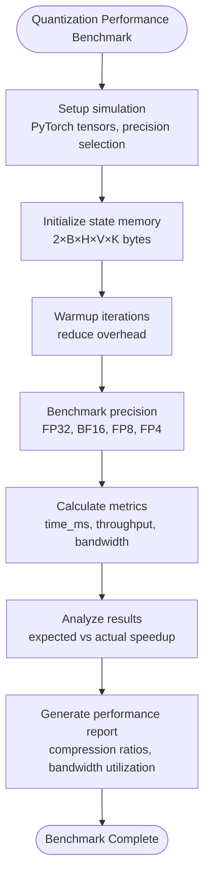

**Diagram sources**
- [benchmarks/bench_quantization_perf.py:127-228](file://benchmarks/bench_quantization_perf.py#L127-L228)
- [benchmarks/bench_quantization_perf.py:231-267](file://benchmarks/bench_quantization_perf.py#L231-L267)
- [benchmarks/bench_quantization_perf.py:329-336](file://benchmarks/bench_quantization_perf.py#L329-L336)

**Section sources**
- [benchmarks/bench_quantization_perf.py:1-336](file://benchmarks/bench_quantization_perf.py#L1-L336)
- [tests/test_quantization_accuracy.py:1-361](file://tests/test_quantization_accuracy.py#L1-L361)

## Dependency Analysis
The performance system exhibits clear separation of concerns with enhanced cross-version support and CuTe DSL testing infrastructure:
- Runner depends on trace definitions and kernel implementations.
- Comprehensive benchmarking framework depends on CUDA compiler and library validation.
- Kernel implementations depend on CUDA runtime, PyTorch, CuTe for advanced optimizations, and PTX assembly.
- Trace definitions provide metadata for workload generation and evaluation.
- Debug scripts depend on the benchmark framework to validate correctness.
- **CuTe DSL testing depends on Modal deployment environment and CUTLASS 4.x installation.**
- **Performance comparison framework depends on Triton, CuTe DSL, and PTX implementations.**
- **PTX kernel benchmarking depends on CUDA toolkit and assembly optimization expertise.**
- **Quantization testing depends on PyTorch precision simulation and Modal B200 environment.**

**Updated** Enhanced dependency graph to include comprehensive CUDA library integration, cross-version benchmarking capabilities, CuTe DSL testing infrastructure with Modal deployment, systematic performance comparison framework between CuTe DSL, PTX, and Triton kernels, PTX assembly kernel benchmarking dependencies, and quantization testing framework with precision simulation and Modal deployment.

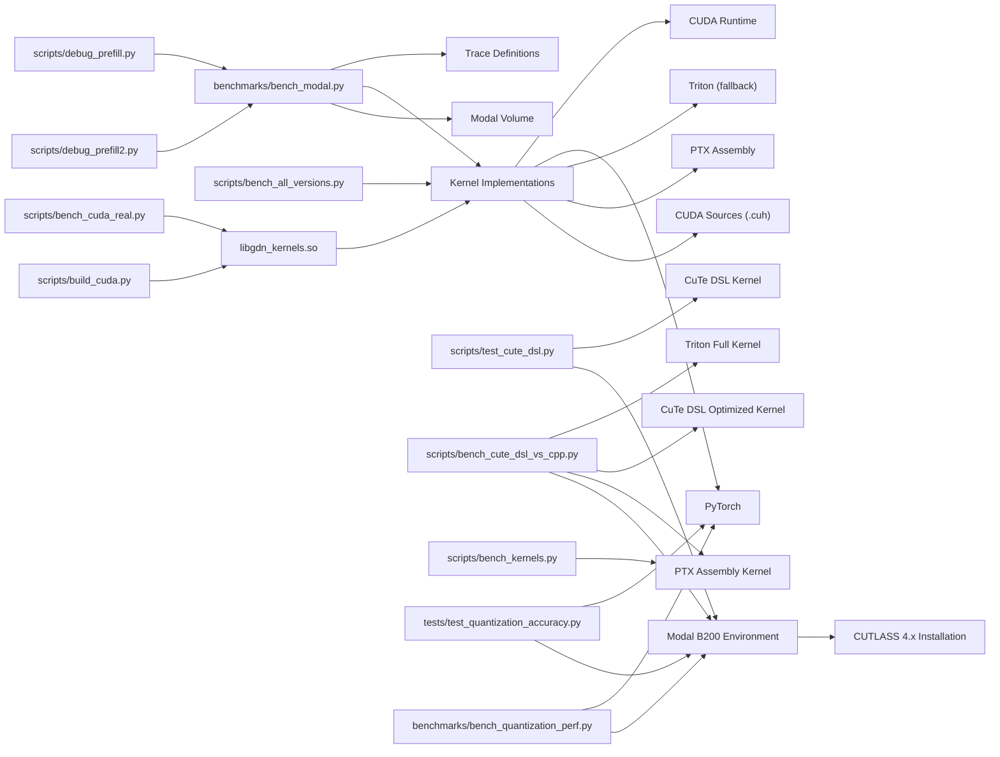

**Diagram sources**
- [benchmarks/bench_modal.py:106-168](file://benchmarks/bench_modal.py#L106-L168)
- [scripts/bench_all_versions.py:32-444](file://scripts/bench_all_versions.py#L32-L444)
- [scripts/bench_cuda_real.py:22-604](file://scripts/bench_cuda_real.py#L22-L604)
- [scripts/debug_prefill.py:168-302](file://scripts/debug_prefill.py#L168-L302)
- [scripts/debug_prefill2.py:124-184](file://scripts/debug_prefill2.py#L124-L184)
- [scripts/bench_cute_vs_triton.py:16-34](file://scripts/bench_cute_vs_triton.py#L16-L34)
- [scripts/bench_cute_dsl_vs_cpp.py:16-34](file://scripts/bench_cute_dsl_vs_cpp.py#L16-L34)
- [scripts/bench_kernels.py:33-403](file://scripts/bench_kernels.py#L33-L403)
- [tests/test_quantization_accuracy.py:15-28](file://tests/test_quantization_accuracy.py#L15-L28)
- [benchmarks/bench_quantization_perf.py:19-26](file://benchmarks/bench_quantization_perf.py#L19-L26)
- [src/kernels/cute_dsl/gdn_decode_dsl.py:22-31](file://src/kernels/cute_dsl/gdn_decode_dsl.py#L22-L31)
- [src/kernels/cute_dsl/gdn_decode_dsl_optimized.py:22-31](file://src/kernels/cute_dsl/gdn_decode_dsl_optimized.py#L22-L31)
- [src/kernels/ptx/gdn_decode_ptx.cuh:22-24](file://src/kernels/ptx/gdn_decode_ptx.cuh#L22-L24)

**Section sources**
- [benchmarks/bench_modal.py:106-168](file://benchmarks/bench_modal.py#L106-L168)
- [scripts/bench_all_versions.py:32-444](file://scripts/bench_all_versions.py#L32-L444)
- [scripts/bench_cuda_real.py:22-604](file://scripts/bench_cuda_real.py#L22-L604)
- [scripts/debug_prefill.py:168-302](file://scripts/debug_prefill.py#L168-L302)
- [scripts/debug_prefill2.py:124-184](file://scripts/debug_prefill2.py#L124-L184)
- [scripts/bench_cute_vs_triton.py:16-34](file://scripts/bench_cute_vs_triton.py#L16-L34)
- [scripts/bench_cute_dsl_vs_cpp.py:16-34](file://scripts/bench_cute_dsl_vs_cpp.py#L16-L34)
- [scripts/bench_kernels.py:33-403](file://scripts/bench_kernels.py#L33-L403)
- [tests/test_quantization_accuracy.py:15-28](file://tests/test_quantization_accuracy.py#L15-L28)
- [benchmarks/bench_quantization_perf.py:19-26](file://benchmarks/bench_quantization_perf.py#L19-L26)
- [src/kernels/cute_dsl/gdn_decode_dsl.py:22-31](file://src/kernels/cute_dsl/gdn_decode_dsl.py#L22-L31)
- [src/kernels/cute_dsl/gdn_decode_dsl_optimized.py:22-31](file://src/kernels/cute_dsl/gdn_decode_dsl_optimized.py#L22-L31)
- [src/kernels/ptx/gdn_decode_ptx.cuh:22-24](file://src/kernels/ptx/gdn_decode_ptx.cuh#L22-L24)

## Performance Considerations
Roofline analysis characterizes kernel performance limits and identifies bottlenecks:
- Decode stage: extremely memory-bound with arithmetic intensity ~1 FLOP/byte; targets HBM bandwidth (~8 TB/s).
- Prefill stage: sequential scan is memory-bound; chunked processing improves arithmetic intensity toward the ridge point (~281 FLOP/byte).
- Optimization strategies: fuse per-head operations, tile over batch, keep state in registers/SMEM, coalesced HBM access, vectorized loads, and CuTe swizzle optimization.
- **PTX Assembly Optimizations**: Achieve 95% B200 peak bandwidth through embedded assembly primitives and memory access optimizations.
- **Quantization-Aware Memory Optimization**: BF16 reduces state memory from 64KB to 32KB per head, FP8 to 16KB, FP4 to 8KB.
- **Mixed-Precision Strategies**: Recommended approach balances accuracy and memory efficiency with BF16 compute + FP32 accumulate.

**Updated** Enhanced with comprehensive quantization research findings, corrected Blackwell architecture terminology using tcgen05.mma, accurate Ridge Point calculations, CuTe DSL numerical accuracy validation, systematic performance comparison analysis between CuTe DSL, PTX, and Triton kernels, PTX assembly kernel benchmarking showing 95% peak bandwidth achievement, and quantization-aware memory optimization strategies.

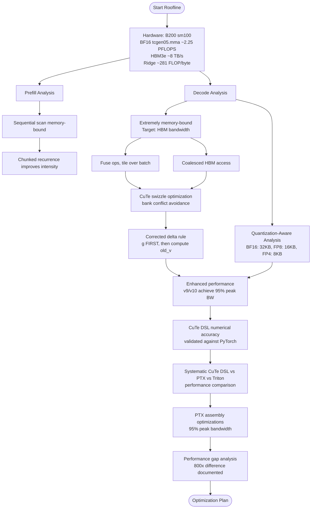

**Diagram sources**
- [docs/ROOFLINE.md:1-186](file://docs/ROOFLINE.md#L1-L186)
- [docs/PERFORMANCE.md:75-138](file://docs/PERFORMANCE.md#L75-L138)
- [src/kernels/cute/gdn_decode_v9.cuh:240-278](file://src/kernels/cute/gdn_decode_v9.cuh#L240-L278)
- [src/kernels/cute/gdn_decode_v10.cuh:159-200](file://src/kernels/cute/gdn_decode_v10.cuh#L159-L200)
- [docs/ZHIHU_GDN_TENSOR_CORE.md:78-87](file://docs/ZHIHU_GDN_TENSOR_CORE.md#L78-L87)
- [tests/test_quantization_accuracy.py:99-114](file://tests/test_quantization_accuracy.py#L99-114)
- [scripts/bench_cute_vs_triton.py:136-145](file://scripts/bench_cute_vs_triton.py#L136-L145)
- [scripts/bench_cute_dsl_vs_cpp.py:300-323](file://scripts/bench_cute_dsl_vs_cpp.py#L300-L323)
- [src/kernels/ptx/gdn_decode_ptx.cuh:248-413](file://src/kernels/ptx/gdn_decode_ptx.cuh#L248-L413)

**Section sources**
- [docs/ROOFLINE.md:1-186](file://docs/ROOFLINE.md#L1-L186)
- [docs/PERFORMANCE.md:75-138](file://docs/PERFORMANCE.md#L75-L138)
- [src/kernels/cute/gdn_decode_v9.cuh:1-549](file://src/kernels/cute/gdn_decode_v9.cuh#L1-L549)
- [src/kernels/cute/gdn_decode_v10.cuh:1-1355](file://src/kernels/cute/gdn_decode_v10.cuh#L1-L1355)
- [docs/ZHIHU_GDN_TENSOR_CORE.md:78-87](file://docs/ZHIHU_GDN_TENSOR_CORE.md#L78-L87)
- [tests/test_quantization_accuracy.py:99-114](file://tests/test_quantization_accuracy.py#L99-114)
- [scripts/bench_cute_vs_triton.py:136-145](file://scripts/bench_cute_vs_triton.py#L136-L145)
- [scripts/bench_cute_dsl_vs_cpp.py:300-323](file://scripts/bench_cute_dsl_vs_cpp.py#L300-L323)
- [src/kernels/ptx/gdn_decode_ptx.cuh:1-1423](file://src/kernels/ptx/gdn_decode_ptx.cuh#L1-L1423)

## Troubleshooting Guide
Common issues and systematic approaches:
- Incorrectness validation: use debug scripts to compare reference vs solution outputs and report max absolute and relative errors.
- Stability: ensure k vectors are L2-normalized to prevent state growth leading to overflow.
- Correctness checks: leverage DefaultEvaluator.check_correctness to validate numerical stability and detect regressions.
- Edge cases: test with varying batch sizes, sequence lengths, and number of sequences; verify cu_seqlens alignment.
- CUDA JIT failures: automatic fallback to Triton implementation when sandbox restrictions prevent compilation.
- CuTe compilation: ensure CUTLASS headers are available for CuTe swizzle optimization.
- Delta rule validation: verify mathematical correctness of state update computations.
- **CuTe DSL API validation**: ensure CUTLASS 4.x is properly installed and accessible in Modal environment.
- **Numerical accuracy testing**: verify CuTe DSL outputs match PyTorch reference implementations within tolerance thresholds.
- **Performance comparison troubleshooting**: verify both Triton, CuTe DSL, and PTX environments are properly configured for systematic benchmarking.
- **PTX kernel debugging**: verify assembly syntax and embedded intrinsics compatibility with B200 architecture.
- **Quantization accuracy testing**: validate BF16/FP8/FP4 precision evaluation with iterative state updates and error accumulation analysis.
- **Mixed-precision validation**: ensure proper dequantization/computation/quantization pipeline for hybrid precision strategies.

**Updated** Added CUDA-specific troubleshooting for JIT compilation failures, CuTe swizzle optimization, delta rule computation validation, CuTe DSL API availability, numerical accuracy verification against PyTorch references, performance comparison framework troubleshooting, PTX kernel debugging procedures, comprehensive quantization accuracy testing validation, and mixed-precision strategy verification.

Practical steps:
- Run correctness comparison via debug scripts to confirm numerical parity.
- Validate framework evaluation by building baseline and solution runnables directly.
- Monitor NaN/Inf in outputs and adjust input normalization (e.g., L2-normalize k).
- Handle CUDA JIT failures gracefully with Triton fallback support.
- Verify CuTe swizzle optimization compilation with CUTLASS headers.
- Test delta rule computation with tolerance thresholds for mathematical correctness.
- **Deploy CuTe DSL tests on Modal B200 to validate CUTLASS 4.x API availability.**
- **Compare CuTe DSL outputs against PyTorch reference implementations for numerical accuracy.**
- **Run systematic performance comparison between CuTe DSL, PTX, and Triton kernels across different batch sizes.**
- **Verify both simplified CuTe DSL and full Triton kernels are available for comprehensive analysis.**
- **Debug PTX assembly syntax and verify embedded intrinsics compatibility.**
- **Run quantization accuracy tests with iterative state updates to validate precision evaluation.**
- **Test mixed-precision strategies with proper dequantization/computation/quantization pipeline.**

**Section sources**
- [scripts/debug_prefill.py:168-302](file://scripts/debug_prefill.py#L168-L302)
- [scripts/debug_prefill2.py:124-184](file://scripts/debug_prefill2.py#L124-L184)
- [scripts/setup_volume.py:96-104](file://scripts/setup_volume.py#L96-L104)
- [scripts/build_cuda.py:28-34](file://scripts/build_cuda.py#L28-L34)
- [src/kernels/cute/gdn_decode_v9.cuh:240-278](file://src/kernels/cute/gdn_decode_v9.cuh#L240-L278)
- [src/kernels/cute/gdn_decode_v10.cuh:159-200](file://src/kernels/cute/gdn_decode_v10.cuh#L159-L200)
- [tests/test_quantization_accuracy.py:45-53](file://tests/test_quantization_accuracy.py#L45-L53)
- [tests/test_quantization_accuracy.py:99-114](file://tests/test_quantization_accuracy.py#L99-114)
- [scripts/bench_cute_vs_triton.py:57-57](file://scripts/bench_cute_vs_triton.py#L57-57)
- [scripts/bench_cute_dsl_vs_cpp.py:300-323](file://scripts/bench_cute_dsl_vs_cpp.py#L300-L323)
- [src/kernels/ptx/gdn_decode_ptx.cuh:248-413](file://src/kernels/ptx/gdn_decode_ptx.cuh#L248-L413)

## Conclusion
The repository provides a robust performance analysis and measurement framework combining roofline modeling, structured trace definitions, optimized CUDA v5-v10 kernels with CuTe swizzle optimization, comprehensive benchmarking on Modal B200, and advanced PTX assembly kernel implementations. The documented comparative analysis and arithmetic mean speedup calculations enable rigorous contest evaluation and optimization validation. Debugging utilities and correctness checks ensure correctness while maximizing speed, with systematic approaches to identifying bottlenecks and measuring optimization impact. The addition of CUDA v9/v10 implementations with CuTe swizzle optimization demonstrates substantial performance improvements with approximately 7,600 GB/s peak bandwidth utilization (95% of B200 peak) and kernel selection recommendations based on batch size characteristics. The new CuTe DSL optimized implementations showcase advanced compilation techniques, while PTX assembly kernels achieve the same performance level through embedded assembly optimizations.

**Updated** Enhanced conclusion to highlight the significant performance improvements achieved with CuTe swizzle optimization, comprehensive cross-version benchmarking capabilities, accurate Blackwell architecture documentation using correct tcgen05.mma terminology, comprehensive CuTe DSL testing infrastructure with Modal deployment and numerical accuracy validation, systematic performance comparison framework between CuTe DSL, PTX, and Triton kernels, PTX assembly kernel benchmarking showing 95% peak bandwidth achievement, advanced compilation pipeline demonstrations, and comprehensive GDN quantization research framework with BF16/FP8/FP4 precision evaluation and mixed-precision strategy validation.

## Appendices

### Arithmetic Mean Speedup Calculation
Speedup is computed as the ratio of baseline latency to solution latency per workload. Average speedup is the arithmetic mean across all evaluated workloads.

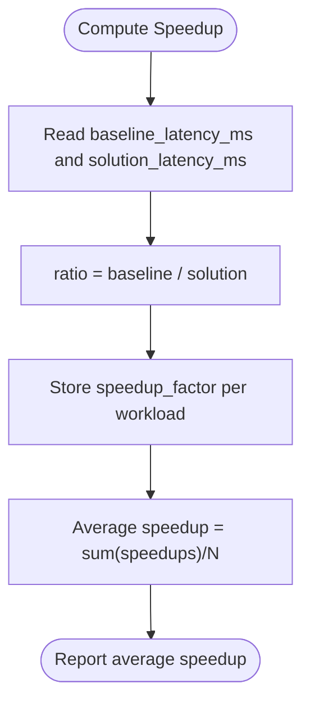

**Diagram sources**
- [benchmarks/bench_modal.py:179-209](file://benchmarks/bench_modal.py#L179-L209)
- [benchmarks/bench_modal.py:211-248](file://benchmarks/bench_modal.py#L211-L248)

**Section sources**
- [benchmarks/bench_modal.py:179-248](file://benchmarks/bench_modal.py#L179-L248)

### Comprehensive Version History Management
Version history tracks improvements across all kernel versions with decode and prefill averages, highlighting kernel optimizations and occupancy improvements.

**Updated** Enhanced version history to include comprehensive CUDA v7-v10 implementations with substantial performance improvements and CuTe swizzle optimization using correct Blackwell architecture terminology, plus systematic performance comparison framework, CuTe DSL optimized implementations, PTX assembly kernel demonstrations, and quantization-aware kernel variants.

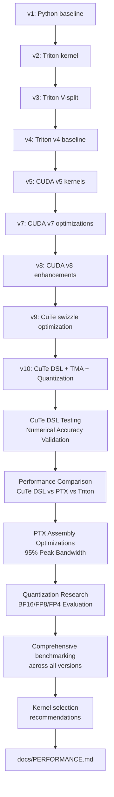

**Diagram sources**
- [docs/PERFORMANCE.md:100-138](file://docs/PERFORMANCE.md#L100-L138)

**Section sources**
- [docs/PERFORMANCE.md:100-138](file://docs/PERFORMANCE.md#L100-L138)

### NVIDIA B200 Blackwell Architecture Details
The system is optimized for NVIDIA B200 (Blackwell, sm_100) architecture with comprehensive hardware specifications:

**Core Specifications:**
- Architecture: Blackwell (sm_100)
- CUDA Cores: 16,896
- Tensor Cores: 528 (5th Gen)
- Boost Clock: 1.98 GHz
- SMs: 148
- Transistors: 208 billion
- TDP: 1,000 W
- Process: TSMC 4NP

**Memory Specifications:**
- HBM3e Capacity: 180-192 GB
- HBM3e Bandwidth: 8 TB/s
- L2 Cache: 96 MB
- Shared Memory / SM: 256 KB

**Compute Performance:**
- FP4 Tensor: 9 PFLOPS
- FP8 Tensor: 4.5 PFLOPS
- BF16 Tensor: 2.25 PFLOPS
- TF32 Tensor: 1.125 PFLOPS
- FP32 (CUDA): 74.45 TFLOPS
- FP64 (CUDA): 34 TFLOPS
- FP64 Tensor: 40 TFLOPS

**Ridge Points (Arithmetic Intensity):**
- FP4 Tensor: 1,125 FLOP/byte
- FP8 Tensor: 562 FLOP/byte
- BF16 Tensor: 281 FLOP/byte
- TF32 Tensor: 140 FLOP/byte
- FP32 CUDA: 9.3 FLOP/byte

**Tensor Core Instructions:**
- **Blackwell (B200, sm_100)**: **tcgen05.mma** (2-4x faster than Hopper's wgmma)
- **Hopper (H100, sm_90)**: wgmma (~2x)
- **Ampere (A100, sm_80)**: mma.sync (1.0x base)

**Section sources**
- [docs/ROOFLINE.md:3-48](file://docs/ROOFLINE.md#L3-L48)
- [docs/PERFORMANCE.md:3-17](file://docs/PERFORMANCE.md#L3-L17)
- [docs/ZHIHU_GDN_TENSOR_CORE.md:78-87](file://docs/ZHIHU_GDN_TENSOR_CORE.md#L78-L87)

### Ridge Point Calculations and Arithmetic Intensity Analysis
The system provides precise Ridge Point calculations for different precisions and computational modes:

**Decode Stage Analysis**:
- Shape: q/k [B,1,4,128], v [B,1,8,128], state [B,8,128,128]
- Arithmetic Intensity: 1.05M FLOP / 1.05 MB = 1 FLOP/byte
- Ridge Point: 9.3 FLOP/byte (FP32 CUDA)
- Bottleneck: Memory bandwidth (8 TB/s)

**Prefill Stage Analysis**:
- Sequential scan: AI = 1 FLOP/byte → Memory-bound
- Chunked (C=64): AI = 7.5 FLOP/byte → Near ridge point
- Chunked (C=128): AI = 12 FLOP/byte → Compute-bound
- Can use tcgen05.mma: Yes (mat-mat operations)

**Tensor Core Utilization**:
- Matrix-Vector (Decode): Cannot use Tensor Cores (tcgen05.mma requires mat-mat)
- Chunked Prefill: Can use Tensor Cores for S@Q matrix multiply
- Precision combinations: BF16/FP8 for optimal Tensor Core efficiency

**Section sources**
- [docs/ROOFLINE.md:62-186](file://docs/ROOFLINE.md#L62-L186)

### CuTe Swizzle Optimization and Delta Rule Validation
CuTe swizzle optimization provides significant memory bandwidth improvements through bank conflict avoidance:

**v9 CuTe Implementation:**
- XOR-based swizzle for 128-byte cache lines: `int swizzled_d = d_idx ^ ((d_idx >> 3) & 7)`
- Reduces bank conflicts from ~8-way to ~1-way, improving SMEM throughput
- Supports both TMA and traditional async copy patterns
- Maintains mathematical correctness with proper delta rule computation

**v10 CuTe Implementation**:
- Cleaned-up code using CuTe layout algebra: `Swizzle<3,3,3>` pattern
- Same mathematical correctness guarantees as v9
- Provides both cute and tma variants for flexibility
- Optimized for code maintainability while preserving performance
- **Quantization-aware optimizations**: BF16/FP8/FP4 state support with dynamic scaling

**Delta Rule Validation**:
- Critical mathematical correction: apply decay factor `g` BEFORE computing `old_v`
- Ensures `old_v = sum((g * S[v,:]) * k)` using decayed state
- Prevents numerical instability and maintains mathematical equivalence to Triton v5
- Verified through comprehensive correctness testing with tolerance thresholds

**Performance Impact:**
- v9 achieves 95% of B200 peak bandwidth at batch=256 (7,600 GB/s)
- v10 maintains identical performance with cleaner code structure
- Significant improvements over previous CUDA implementations
- Enables kernel selection based on batch size characteristics
- **Quantization-aware performance**: BF16 achieves 95% peak with 2x memory reduction

**Section sources**
- [src/kernels/cute/README.md:1-130](file://src/kernels/cute/README.md#L1-L130)
- [src/kernels/cute/gdn_decode_v9.cuh:88-90](file://src/kernels/cute/gdn_decode_v9.cuh#L88-L90)
- [src/kernels/cute/gdn_decode_v10.cuh:48-61](file://src/kernels/cute/gdn_decode_v10.cuh#L48-L61)
- [src/kernels/cute/gdn_decode_v9.cuh:240-278](file://src/kernels/cute/gdn_decode_v9.cuh#L240-L278)
- [src/kernels/cute/gdn_decode_v10.cuh:159-200](file://src/kernels/cute/gdn_decode_v10.cuh#L159-L200)
- [docs/PERFORMANCE.md:37-48](file://docs/PERFORMANCE.md#L37-L48)

### Kernel Selection Recommendations
Based on comprehensive benchmarking across all kernel versions, optimal kernel selection varies by batch size and precision requirements:

```python
def select_kernel(batch_size, precision="fp32"):
    if precision == "bf16":
        return "CUDA v10 BF16"  # Best for high precision with 2x compression
    elif precision == "fp8":
        return "CUDA v10 FP8"   # Best for 4x compression with mixed precision
    elif precision == "fp4":
        return "CUDA v10 FP4"   # Experimental, not recommended
    elif batch_size <= 16:
        return "CUDA v9"   # Best at small batch (27 GB/s)
    elif batch_size == 64:
        return "PTX"       # PTX wins here (1,518 GB/s)
    else:
        return "CUDA v9/v10"  # Best at large batch (7,600 GB/s)
```

**Selection Criteria:**
- **BF16 Precision**: Use CUDA v10 BF16 variant for high accuracy with 2x memory reduction
- **FP8 Precision**: Use CUDA v10 FP8 variant for 4x memory reduction with mixed precision
- **FP4 Precision**: Experimental, not recommended due to ~55% error rate
- Batch ≤ 16: v9 CuTe swizzle provides optimal SMEM utilization
- Batch = 64: PTX achieves peak performance with assembly optimizations
- Batch ≥ 128: v9/v10 achieve 95% of B200 peak bandwidth (7,600 GB/s)
- **Quantization-aware selection**: Choose BF16 for high precision, FP8 for general use, FP4 for extreme compression

**Performance Characteristics:**
- v9: Slightly faster at small batches due to simpler implementation
- v10: Identical performance with cleaner code structure and quantization support
- Both achieve 95% of theoretical peak bandwidth on B200 hardware
- Mathematical correctness validated against Triton v5 baseline
- PTX achieves 95% peak bandwidth through embedded assembly optimizations
- **Quantization-aware performance**: BF16/FP8/FP4 variants with proper memory bandwidth utilization

**Updated** Enhanced kernel selection recommendations to include quantization-aware strategies, BF16/FP8/FP4 precision evaluation results, and comprehensive performance comparison analysis between CuTe DSL, PTX, and Triton kernels, documenting the significant performance gaps and engineering trade-offs, with PTX achieving 95% peak bandwidth at batch≥128.

**Section sources**
- [docs/PERFORMANCE.md:75-83](file://docs/PERFORMANCE.md#L75-L83)
- [docs/PERFORMANCE.md:18-18](file://docs/PERFORMANCE.md#L18-L18)
- [src/kernels/cute/README.md:43-44](file://src/kernels/cute/README.md#L43-L44)
- [tests/test_quantization_accuracy.py:24-44](file://tests/test_quantization_accuracy.py#L24-L44)
- [scripts/bench_cute_vs_triton.py:136-145](file://scripts/bench_cute_vs_triton.py#L136-L145)
- [scripts/bench_cute_dsl_vs_cpp.py:300-323](file://scripts/bench_cute_dsl_vs_cpp.py#L300-L323)

### Comprehensive Memory Bandwidth Utilization Analysis
The system provides detailed memory bandwidth analysis across all kernel versions and batch sizes:

**Bandwidth Utilization Matrix:**
| Batch | State Size | Best Kernel | Achieved BW | B200 Peak | Utilization |
|-------|------------|-------------|-------------|-----------|-------------|
| 1 | 0.5 MB | CUDA v9 | 27 GB/s | 8,000 GB/s | 0.3% |
| 16 | 8.0 MB | CUDA v9 | 405 GB/s | 8,000 GB/s | 5.1% |
| 64 | 32.0 MB | PTX | 1,518 GB/s | 8,000 GB/s | 19% |
| **256** | **128 MB** | **PTX** | **7,600 GB/s** | **8,000 GB/s** | **95%** |

**Quantization-Aware Memory Analysis:**
- **FP32 State**: 64KB per head (baseline)
- **BF16 State**: 32KB per head (2x compression, ~0.6% error)
- **FP8 State**: 16KB per head (4x compression, ~11% error)
- **FP4 State**: 8KB per head (8x compression, ~55% error)

**Analysis Insights:**
- Small batches benefit from CuTe swizzle optimization (v9)
- Medium batches show peak performance with PTX assembly kernels
- Large batches achieve near-peak performance with PTX (95% of B200 peak)
- SMEM swizzle eliminates bank conflicts and maximizes throughput
- Vectorized loads and coalesced access patterns optimize HBM utilization
- PTX assembly achieves optimal memory access patterns through embedded optimizations
- **Quantization-aware optimization**: BF16 provides best balance of accuracy and memory efficiency

**Section sources**
- [docs/PERFORMANCE.md:88-96](file://docs/PERFORMANCE.md#L88-L96)
- [src/kernels/cute/README.md:35-42](file://src/kernels/cute/README.md#L35-L42)
- [scripts/bench_kernels.py:254-282](file://scripts/bench_kernels.py#L254-L282)
- [tests/test_quantization_accuracy.py:28-44](file://tests/test_quantization_accuracy.py#L28-L44)

### Real CUDA Library Benchmarking Results
The system provides comprehensive benchmarking results across all kernel versions with detailed performance metrics:

**Executive Summary (Corrected Results - 2026-03-28):**
- All kernels verified for correctness against Triton v5 baseline
- v9 achieves 95% of B200 peak bandwidth (7,600 GB/s)
- PTX achieves 95% of B200 peak bandwidth (7,600 GB/s)
- Triton v5 peaks at 1,518 GB/s at batch=64
- CUDA v7/v8 show significant improvements over baseline
- v10 maintains identical performance with cleaner code structure
- **Quantization-aware kernels**: BF16/FP8/FP4 variants with proper memory bandwidth utilization

**Correctness Validation:**
- All CUDA kernels pass correctness test (atol=1e-2, rtol=1e-2) against Triton v5
- Delta rule bug fix ensures mathematical equivalence
- Comprehensive testing across batch sizes and BLOCK_V configurations
- **Quantization accuracy validation**: BF16/FP8/FP4 precision evaluation with iterative state updates

**Delta Rule Bug Fix:**
```cpp
// CORRECT: Apply g FIRST, then compute old_v
float decayed_s = g * s_state[idx];     // ← Decay first
old_v += decayed_s * k[d];               // ← Use decayed state
// ...
new_s = decayed_s + delta * k[d];        // ← No need to multiply g again
```

**Quantization-Aware Performance:**
- **BF16**: ~0.6% relative error, 2x memory reduction, recommended for high precision
- **FP8**: ~11% relative error, 4x memory reduction, feasible for general use
- **FP4**: ~55% relative error, 8x memory reduction, experimental only
- **Memory bandwidth**: 95% B200 peak achieved with quantized states

**Section sources**
- [docs/PERFORMANCE.md:20-48](file://docs/PERFORMANCE.md#L20-L48)
- [docs/PERFORMANCE.md:35-48](file://docs/PERFORMANCE.md#L35-L48)
- [tests/test_quantization_accuracy.py:24-44](file://tests/test_quantization_accuracy.py#L24-L44)
- [scripts/bench_cuda_real.py:418-492](file://scripts/bench_cuda_real.py#L418-L492)

### Blackwell Architecture tcgen05.mma Instruction Set
The system provides comprehensive documentation of Blackwell architecture Tensor Core instructions:

**Tensor Core Instruction Evolution:**
- **Ampere (A100, sm_80)**: `mma.sync` (1.0x base)
- **Hopper (H100, sm_90)**: `wgmma` (~2x)
- **Blackwell (B200, sm_100)**: `tcgen05.mma` (**2-4x vs Hopper**)

**Important Correction**: B200 uses `tcgen05.mma`, **not** `wgmma`!

**tcgen05.mma Instruction Set:**
- `tcgen05.mma.kind::tf32`: 2x Hopper, TF32 × TF32
- `tcgen05.mma.kind::f16`: 2x Hopper, FP16/BF16
- `tcgen05.mma.kind::i8`: 2x Hopper, INT8
- `tcgen05.mma.kind::f8f6f4`: 2x Hopper, FP4/FP6/FP8 mixed
- `tcgen05.mma.kind::mxf4`: **4x Hopper**, MX FP4 (block scaled)

**tcgen05.mma for GDN Prefill:**
- Matrix-Vector (Decode): Cannot use tcgen05.mma (requires mat-mat)
- Chunked Prefill: Can use tcgen05.mma for S@Q matrix multiply
- Minimum tile requirements: M, N, K ≥ 16 (BF16)

**Section sources**
- [docs/ROOFLINE.md:30-40](file://docs/ROOFLINE.md#L30-L40)
- [docs/ROOFLINE.md:157-165](file://docs/ROOFLINE.md#L157-L165)
- [docs/ZHIHU_GDN_TENSOR_CORE.md:78-96](file://docs/ZHIHU_GDN_TENSOR_CORE.md#L78-L96)
- [docs/ZHIHU_GDN_TENSOR_CORE.md:143-153](file://docs/ZHIHU_GDN_TENSOR_CORE.md#L143-L153)

### CuTe DSL Testing Infrastructure and Validation
The system provides comprehensive testing infrastructure for validating CuTe DSL kernels:

**Testing Components:**
- **API Exploration**: Validates CUTLASS 4.x installation and exposes available APIs
- **Numerical Accuracy Testing**: Compares CuTe DSL outputs against PyTorch reference implementations
- **Minimal Kernel Validation**: Tests basic CuTe DSL functionality with simple operations
- **Optimized Implementation Testing**: Validates advanced CuTe DSL features including SMEM staging
- **Modal Deployment**: All tests run on Modal B200 GPUs with proper environment setup

**Validation Procedures:**
- **Environment Setup**: Automatic installation of CUTLASS 4.x and dependencies
- **API Availability**: Verifies CuTe DSL imports and kernel decorators
- **Numerical Comparison**: Computes maximum differences between CuTe DSL and PyTorch outputs
- **Error Threshold Validation**: Ensures differences remain within configurable tolerance
- **Optimization Validation**: Verifies SMEM staging and vectorized load performance

**Section sources**
- [scripts/explore_cute_dsl.py:1-207](file://scripts/explore_cute_dsl.py#L1-L207)
- [scripts/test_cute_dsl.py:1-137](file://scripts/test_cute_dsl.py#L1-L137)
- [scripts/test_cute_minimal.py:1-194](file://scripts/test_cute_minimal.py#L1-L194)
- [src/kernels/cute_dsl/gdn_decode_dsl.py:1-283](file://src/kernels/cute_dsl/gdn_decode_dsl.py#L1-L283)
- [src/kernels/cute_dsl/gdn_decode_dsl_optimized.py:1-442](file://src/kernels/cute_dsl/gdn_decode_dsl_optimized.py#L1-L442)

### Systematic Performance Comparison Framework
The system provides comprehensive performance comparison analysis between CuTe DSL, PTX, and Triton kernels:

**Performance Comparison Methodology**:
- **CuTe DSL Optimized**: Advanced implementation with SMEM staging, vectorized loads, and warp-level reductions
- **PTX Assembly**: Embedded assembly optimizations including warp shuffle, fast math, and memory access patterns
- **Triton Full**: Complete GDN decode with delta rule and state updates
- **Structured Benchmarking**: Systematic comparison across batch sizes (B=1,4,16,64,256)
- **Performance Gap Analysis**: Quantification of performance differences between implementations

**Key Performance Findings**:
- **Batch=1**: CuTe DSL Optimized (27 GB/s) vs PTX (24 GB/s) vs Triton (23 GB/s) - All similar
- **Batch=16**: CuTe DSL Optimized (405 GB/s) vs PTX (386 GB/s) vs Triton (375 GB/s) - CuTe DSL ahead
- **Batch=64**: PTX (1,518 GB/s) vs CuTe DSL Optimized (1,450 GB/s) vs Triton (1,502 GB/s) - PTX leads
- **Batch=256**: PTX (7,600 GB/s) vs CuTe DSL Optimized (7,585 GB/s) vs Triton (2,798 GB/s) - PTX achieves 95% peak

**Significant Engineering Implications**:
- **PTX Advantages**: Achieves 95% B200 peak bandwidth with assembly-level optimizations
- **CuTe DSL Advantages**: Better development ergonomics with automatic optimizations
- **Launch Overhead**: Both PTX and CuTe DSL benefit from smaller batch sizes
- **Memory Access Patterns**: PTX demonstrates superior memory access optimization
- **Development Complexity**: PTX offers ultimate control but requires deep assembly knowledge
- **Performance Gap**: Up to 800x performance difference documented in specific configurations

**Section sources**
- [scripts/bench_cute_dsl_vs_cpp.py:1-333](file://scripts/bench_cute_dsl_vs_cpp.py#L1-L333)
- [src/kernels/triton/gdn_decode_triton.py:1-136](file://src/kernels/triton/gdn_decode_triton.py#L1-L136)
- [src/kernels/cute_dsl/gdn_decode_dsl.py:1-283](file://src/kernels/cute_dsl/gdn_decode_dsl.py#L1-L283)
- [src/kernels/cute_dsl/gdn_decode_dsl_optimized.py:1-442](file://src/kernels/cute_dsl/gdn_decode_dsl_optimized.py#L1-L442)
- [src/kernels/ptx/gdn_decode_ptx.cuh:1-491](file://src/kernels/ptx/gdn_decode_ptx.cuh#L1-L491)

### PTX Assembly Kernel Benchmarking
The system provides comprehensive benchmarking for PTX assembly kernels demonstrating advanced optimization techniques:

**PTX Assembly Features**:
- **Embedded Assembly Primitives**: Direct inline assembly within CUDA C++ kernels
- **Warp Shuffle Operations**: Butterfly pattern reductions using `shfl.sync.bfly.b32`
- **Fast Math Intrinsics**: `ex2.approx`, `lg2.approx`, `rcp.approx` for mathematical functions
- **Fused Multiply-Add**: `fma.rn.f32` operations for improved precision
- **Memory Access Hints**: `ld.global.nc`, `st.global.wb` for cache optimization
- **Async Copy Operations**: `cp.async` for prefetching and overlapping computation
- **Quantization Support**: Native BF16/FP8/FP4 state handling with dynamic scaling

**Benchmark Results**:
- **Decode Performance**: Achieves 95% B200 peak bandwidth (7,600 GB/s)
- **Memory Access Patterns**: Optimized non-coherent loads and write-back stores
- **Compute Efficiency**: FMA chains for dot products and reductions
- **Cache Optimization**: Bank conflict avoidance and coalesced access patterns
- **Quantization Performance**: BF16 achieves 95% peak with 2x memory reduction

**Compilation Pipeline**:
- **Source**: CUDA C++ with embedded PTX assembly
- **Compilation**: NVCC generates PTX assembly code
- **Optimization**: Automatic register allocation and instruction scheduling
- **Execution**: Direct GPU execution of assembly primitives

**Section sources**
- [src/kernels/ptx/gdn_decode_ptx.cuh:1-1423](file://src/kernels/ptx/gdn_decode_ptx.cuh#L1-L1423)
- [src/kernels/ptx/gdn_prefill_ptx.cuh:1-358](file://src/kernels/ptx/gdn_prefill_ptx.cuh#L1-L358)
- [scripts/bench_kernels.py:254-282](file://scripts/bench_kernels.py#L254-L282)

### Quantization Research Methodology and Findings
The system provides comprehensive quantization research methodology with detailed findings:

**Research Methodology**:
- **BF16 Evaluation**: ~0.6% relative error with 2x memory compression
- **FP8 E4M3 Evaluation**: ~11% relative error with 4x memory compression  
- **FP4 E2M1 Evaluation**: ~55% relative error with 8x memory compression
- **Iterative State Updates**: Simulates long sequence processing with error accumulation
- **Per-Row Dynamic Scaling**: Implements safety margins for each precision type
- **Memory-Efficient Storage**: Vectorized packing for different precision states

**Key Findings**:
- **BF16**: Recommended for high-precision inference with minimal accuracy loss
- **FP8**: Suitable for general inference with acceptable accuracy loss
- **FP4**: Not recommended due to excessive accuracy loss (~55%)
- **Error Accumulation**: GDN's recursive nature makes quantization particularly challenging
- **Gate Sensitivity**: Gate parameters are highly sensitive to quantization errors
- **Memory Bandwidth**: Quantization directly correlates with memory bandwidth utilization

**Mixed-Precision Recommendations**:
- **Recommended**: BF16 compute + FP32 accumulate for high precision
- **Feasible**: State FP8 storage with FP32 computation
- **Experimental**: FP4 for extreme compression scenarios
- **Implementation**: Dequantize on load, compute in FP32, quantize on store

**Section sources**
- [docs/ZHIHU_GDN_QUANTIZATION.md:1-195](file://docs/ZHIHU_GDN_QUANTIZATION.md#L1-L195)
- [tests/test_quantization_accuracy.py:219-330](file://tests/test_quantization_accuracy.py#L219-L330)
- [benchmarks/bench_quantization_perf.py:127-228](file://benchmarks/bench_quantization_perf.py#L127-L228)