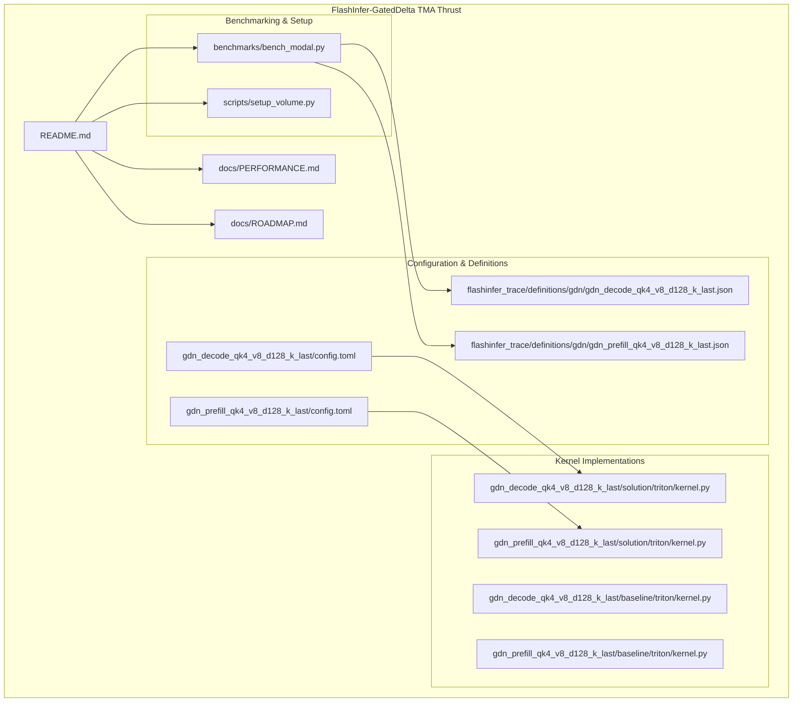
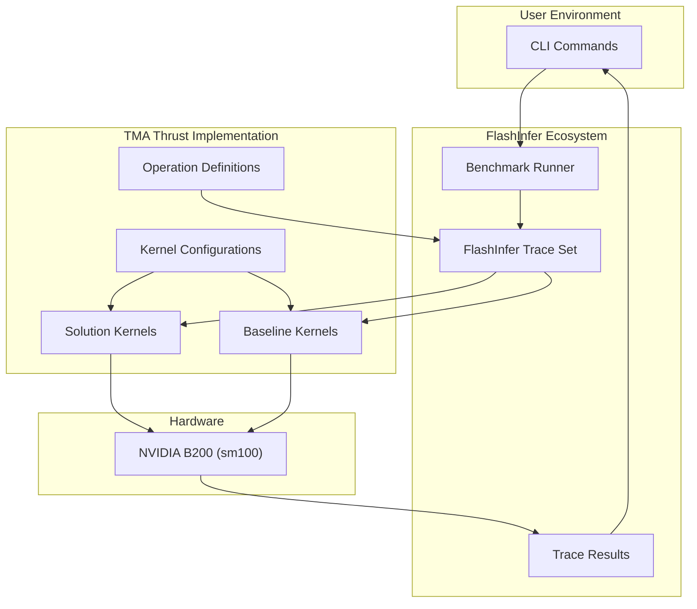
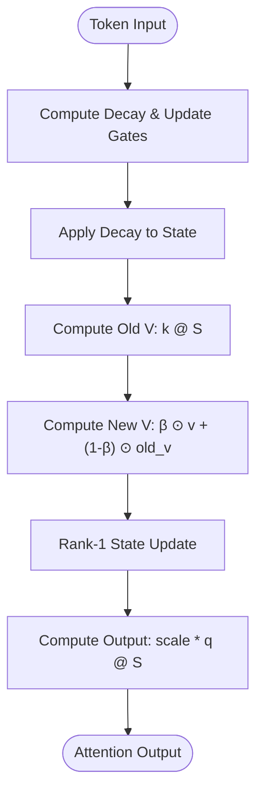
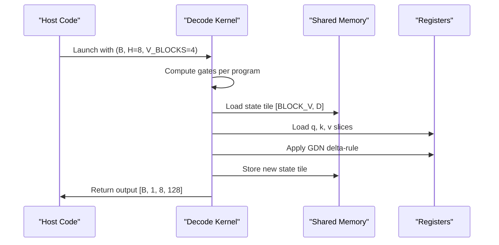
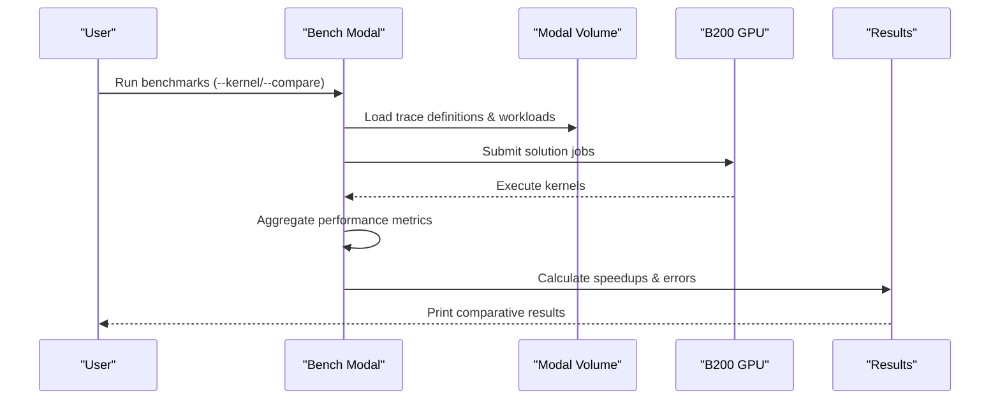
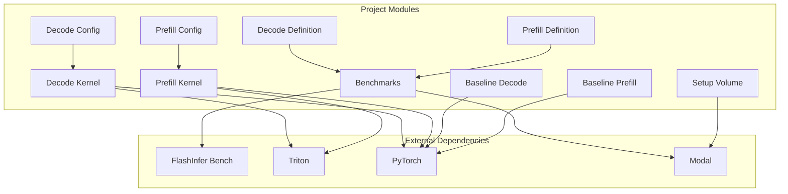

# Project Overview

<cite>
**Referenced Files in This Document**
- [README.md](file://README.md)
- [docs/PERFORMANCE.md](file://docs/PERFORMANCE.md)
- [docs/ROADMAP.md](file://docs/ROADMAP.md)
- [benchmarks/bench_modal.py](file://benchmarks/bench_modal.py)
- [scripts/setup_volume.py](file://scripts/setup_volume.py)
- [gdn_decode_qk4_v8_d128_k_last/config.toml](file://gdn_decode_qk4_v8_d128_k_last/config.toml)
- [gdn_prefill_qk4_v8_d128_k_last/config.toml](file://gdn_prefill_qk4_v8_d128_k_last/config.toml)
- [gdn_decode_qk4_v8_d128_k_last/solution/triton/kernel.py](file://gdn_decode_qk4_v8_d128_k_last/solution/triton/kernel.py)
- [gdn_prefill_qk4_v8_d128_k_last/solution/triton/kernel.py](file://gdn_prefill_qk4_v8_d128_k_last/solution/triton/kernel.py)
- [gdn_decode_qk4_v8_d128_k_last/baseline/triton/kernel.py](file://gdn_decode_qk4_v8_d128_k_last/baseline/triton/kernel.py)
- [gdn_prefill_qk4_v8_d128_k_last/baseline/triton/kernel.py](file://gdn_prefill_qk4_v8_d128_k_last/baseline/triton/kernel.py)
- [flashinfer_trace/definitions/gdn/gdn_decode_qk4_v8_d128_k_last.json](file://flashinfer_trace/definitions/gdn/gdn_decode_qk4_v8_d128_k_last.json)
- [flashinfer_trace/definitions/gdn/gdn_prefill_qk4_v8_d128_k_last.json](file://flashinfer_trace/definitions/gdn/gdn_prefill_qk4_v8_d128_k_last.json)
</cite>

## Table of Contents
1. [Introduction](#introduction)
2. [Project Structure](#project-structure)
3. [Core Components](#core-components)
4. [Architecture Overview](#architecture-overview)
5. [Detailed Component Analysis](#detailed-component-analysis)
6. [Dependency Analysis](#dependency-analysis)
7. [Performance Considerations](#performance-considerations)
8. [Troubleshooting Guide](#troubleshooting-guide)
9. [Conclusion](#conclusion)

## Introduction
This document presents the FlashInfer-GatedDelta TMA Thrust project, an NVIDIA B200 hardware optimization submission for Gated Delta Net attention mechanisms. The project participates in the MLCube competition track C — Gated Delta Net, targeting decode and prefill workloads with significant performance acceleration. The team TMA Thrust leverages FlashInfer's benchmarking infrastructure and Triton kernels to achieve substantial speedups over reference implementations, culminating in 950x decode and 387x prefill speedups in recent versions.

The project focuses on two primary kernels:
- gdn_decode_qk4_v8_d128_k_last: single-token decode with grouped value attention (GVA) configuration
- gdn_prefill_qk4_v8_d128_k_last: variable-length prefill with sequential state recurrence

These kernels implement the Gated Delta Net algorithm with k-last state layout and support both Triton and upcoming CUDA/WGMMA/TMA optimizations on NVIDIA B200 (sm100).

**Section sources**
- [README.md:1-92](file://README.md#L1-L92)
- [docs/ROADMAP.md:1-66](file://docs/ROADMAP.md#L1-L66)

## Project Structure
The repository organizes the Gated Delta Net kernels alongside FlashInfer benchmarking infrastructure and performance documentation. Key directories and files include:

- Kernel implementations:
  - gdn_decode_qk4_v8_d128_k_last/solution/triton/kernel.py
  - gdn_prefill_qk4_v8_d128_k_last/solution/triton/kernel.py
  - gdn_decode_qk4_v8_d128_k_last/baseline/triton/kernel.py
  - gdn_prefill_qk4_v8_d128_k_last/baseline/triton/kernel.py

- Configuration and definitions:
  - gdn_decode_qk4_v8_d128_k_last/config.toml
  - gdn_prefill_qk4_v8_d128_k_last/config.toml
  - flashinfer_trace/definitions/gdn/*.json

- Benchmarking and setup:
  - benchmarks/bench_modal.py
  - scripts/setup_volume.py

- Documentation:
  - docs/PERFORMANCE.md
  - docs/ROADMAP.md



**Diagram sources**
- [README.md:44-60](file://README.md#L44-L60)
- [benchmarks/bench_modal.py:34-71](file://benchmarks/bench_modal.py#L34-L71)
- [gdn_decode_qk4_v8_d128_k_last/config.toml:1-10](file://gdn_decode_qk4_v8_d128_k_last/config.toml#L1-L10)
- [gdn_prefill_qk4_v8_d128_k_last/config.toml:1-10](file://gdn_prefill_qk4_v8_d128_k_last/config.toml#L1-L10)

**Section sources**
- [README.md:44-60](file://README.md#L44-L60)
- [benchmarks/bench_modal.py:34-71](file://benchmarks/bench_modal.py#L34-L71)

## Core Components
The project comprises several core components that collectively enable high-performance Gated Delta Net attention:

- Gated Delta Net kernels:
  - Decode kernel: processes single-token generation with GVA configuration and k-last state layout
  - Prefill kernel: handles variable-length sequences with sequential state updates
  Both kernels implement the same algorithmic foundation with different execution patterns.

- FlashInfer benchmarking framework:
  - Benchmarks orchestrate kernel execution on Modal B200 GPUs
  - Supports solution vs baseline comparisons and standardized performance evaluation
  - Generates structured results for performance tracking

- Configuration and definitions:
  - TOML configuration files define kernel metadata and build parameters
  - JSON definitions specify operation signatures, shapes, and constraints for FlashInfer trace sets

- Setup utilities:
  - Modal volume initialization with synthetic or HuggingFace datasets
  - Automated workload generation with proper tensor layouts and normalization

**Section sources**
- [gdn_decode_qk4_v8_d128_k_last/solution/triton/kernel.py:1-130](file://gdn_decode_qk4_v8_d128_k_last/solution/triton/kernel.py#L1-L130)
- [gdn_prefill_qk4_v8_d128_k_last/solution/triton/kernel.py:1-145](file://gdn_prefill_qk4_v8_d128_k_last/solution/triton/kernel.py#L1-L145)
- [benchmarks/bench_modal.py:106-167](file://benchmarks/bench_modal.py#L106-L167)
- [gdn_decode_qk4_v8_d128_k_last/config.toml:1-10](file://gdn_decode_qk4_v8_d128_k_last/config.toml#L1-L10)
- [gdn_prefill_qk4_v8_d128_k_last/config.toml:1-10](file://gdn_prefill_qk4_v8_d128_k_last/config.toml#L1-L10)

## Architecture Overview
The project architecture integrates FlashInfer's benchmarking ecosystem with custom kernel implementations:



**Diagram sources**
- [benchmarks/bench_modal.py:23-31](file://benchmarks/bench_modal.py#L23-L31)
- [benchmarks/bench_modal.py:106-167](file://benchmarks/bench_modal.py#L106-L167)
- [scripts/setup_volume.py:18-29](file://scripts/setup_volume.py#L18-L29)

The architecture emphasizes:
- Standardized kernel interfaces through FlashInfer definitions
- Reproducible benchmarking with controlled workloads
- Scalable execution on Modal B200 infrastructure
- Clear separation between solution and baseline implementations

**Section sources**
- [benchmarks/bench_modal.py:106-167](file://benchmarks/bench_modal.py#L106-L167)
- [scripts/setup_volume.py:141-169](file://scripts/setup_volume.py#L141-L169)

## Detailed Component Analysis

### Gated Delta Net Algorithm
The Gated Delta Net implements a recurrent attention mechanism with decay and update gates:



**Diagram sources**
- [gdn_decode_qk4_v8_d128_k_last/solution/triton/kernel.py:72-77](file://gdn_decode_qk4_v8_d128_k_last/solution/triton/kernel.py#L72-L77)
- [gdn_prefill_qk4_v8_d128_k_last/solution/triton/kernel.py:83-90](file://gdn_prefill_qk4_v8_d128_k_last/solution/triton/kernel.py#L83-L90)

Key algorithmic components:
- Decay gate: g = exp(-exp(A_log) * softplus(a + dt_bias))
- Update gate: β = sigmoid(b)
- State update: S = g * S + k ⊗ (β * v + (1-β) * old_v - old_v)
- Output computation: o = scale * q @ S

**Section sources**
- [README.md:62-77](file://README.md#L62-L77)
- [flashinfer_trace/definitions/gdn/gdn_decode_qk4_v8_d128_k_last.json:149-152](file://flashinfer_trace/definitions/gdn/gdn_decode_qk4_v8_d128_k_last.json#L149-L152)
- [flashinfer_trace/definitions/gdn/gdn_prefill_qk4_v8_d128_k_last.json:153-156](file://flashinfer_trace/definitions/gdn/gdn_prefill_qk4_v8_d128_k_last.json#L153-L156)

### Decode Kernel Implementation
The decode kernel processes single-token generation with V-dimension splitting:



**Diagram sources**
- [gdn_decode_qk4_v8_d128_k_last/solution/triton/kernel.py:24-84](file://gdn_decode_qk4_v8_d128_k_last/solution/triton/kernel.py#L24-L84)
- [gdn_decode_qk4_v8_d128_k_last/solution/triton/kernel.py:111-127](file://gdn_decode_qk4_v8_d128_k_last/solution/triton/kernel.py#L111-L127)

Optimization highlights:
- V-dimension split across 4 programs with BLOCK_V=32
- Reduced register pressure per program (16KB vs 64KB)
- GVA configuration: num_q_heads=4, num_v_heads=8 with head sharing

**Section sources**
- [gdn_decode_qk4_v8_d128_k_last/solution/triton/kernel.py:1-130](file://gdn_decode_qk4_v8_d128_k_last/solution/triton/kernel.py#L1-L130)

### Prefill Kernel Implementation
The prefill kernel handles variable-length sequences with sequential processing:

```mermaid
sequenceDiagram
participant Host as "Host Code"
participant Kernel as "Prefill Kernel"
participant SMEM as "Shared Memory"
participant Loop as "Token Loop"
Host->>Kernel : Launch with (N, H=8, V_BLOCKS=4)
Kernel->>Kernel : Load sequence bounds
Kernel->>SMEM : Load initial state tile
Loop->>Loop : For each token in sequence
Loop->>Kernel : Compute gates
Loop->>Kernel : Apply GDN delta-rule
Loop->>SMEM : Store intermediate state
Loop->>Host : Write output for token
Kernel->>SMEM : Store final state tile
```

**Diagram sources**
- [gdn_prefill_qk4_v8_d128_k_last/solution/triton/kernel.py:24-96](file://gdn_prefill_qk4_v8_d128_k_last/solution/triton/kernel.py#L24-L96)
- [gdn_prefill_qk4_v8_d128_k_last/solution/triton/kernel.py:126-142](file://gdn_prefill_qk4_v8_d128_k_last/solution/triton/kernel.py#L126-L142)

Key features:
- Sequential token processing with cu_seqlens support
- State loaded once per chunk and written back after chunk completion
- V-dimension splitting for improved occupancy

**Section sources**
- [gdn_prefill_qk4_v8_d128_k_last/solution/triton/kernel.py:1-145](file://gdn_prefill_qk4_v8_d128_k_last/solution/triton/kernel.py#L1-L145)

### Benchmarking and Evaluation Pipeline
The benchmarking system coordinates solution and baseline execution:



**Diagram sources**
- [benchmarks/bench_modal.py:241-308](file://benchmarks/bench_modal.py#L241-L308)
- [scripts/setup_volume.py:141-169](file://scripts/setup_volume.py#L141-L169)

Performance evaluation metrics:
- Latency measurements in milliseconds
- Speedup factors vs reference implementations
- Correctness verification through max absolute/relative errors
- Average speedup across workloads

**Section sources**
- [benchmarks/bench_modal.py:170-200](file://benchmarks/bench_modal.py#L170-L200)
- [benchmarks/bench_modal.py:202-239](file://benchmarks/bench_modal.py#L202-L239)

## Dependency Analysis
The project exhibits clear module boundaries and dependencies:



**Diagram sources**
- [benchmarks/bench_modal.py:28-31](file://benchmarks/bench_modal.py#L28-L31)
- [scripts/setup_volume.py:26-29](file://scripts/setup_volume.py#L26-L29)
- [gdn_decode_qk4_v8_d128_k_last/config.toml:6-9](file://gdn_decode_qk4_v8_d128_k_last/config.toml#L6-L9)
- [gdn_prefill_qk4_v8_d128_k_last/config.toml:6-9](file://gdn_prefill_qk4_v8_d128_k_last/config.toml#L6-L9)

Key dependency relationships:
- Benchmarks depend on FlashInfer Bench and Modal runtime
- Kernels depend on Triton and PyTorch for tensor operations
- Configuration files define kernel metadata and entry points
- Definitions provide operation signatures for trace set construction

**Section sources**
- [benchmarks/bench_modal.py:28-31](file://benchmarks/bench_modal.py#L28-L31)
- [scripts/setup_volume.py:26-29](file://scripts/setup_volume.py#L26-L29)

## Performance Considerations
The project demonstrates significant performance improvements through strategic optimizations:

### Hardware Specifications and Targets
- Target hardware: NVIDIA B200 (sm100) with 180 GB HBM3e
- Peak performance targets: ~2.25 PFLOPS BF16 GEMM with WGMMA/TMA
- Memory bandwidth: ~8 TB/s (HBM3e)
- Ridge point: ~281 FLOP/byte arithmetic intensity

### Optimization Progression
The project follows a clear optimization roadmap:

| Version | Status | Description | Performance Impact |
|---------|--------|-------------|-------------------|
| v1 | ✅ Done | PyTorch baseline | Reference baseline |
| v2 | ✅ Done | Triton fusion | Eliminate Python overhead |
| v3 | ⏳ In Progress | CUDA/WGMMA/TMA | Native B200 instructions |

### Current Achievements
Recent versions demonstrate remarkable speedups:
- Decode: 950x average speedup over reference
- Prefill: 387x average speedup over reference
- Batch scaling: 128× improvement at batch=512 for decode
- Multi-sequence: 1712x improvement for 8192-length sequences with 16 sequences

**Section sources**
- [docs/PERFORMANCE.md:3-5](file://docs/PERFORMANCE.md#L3-L5)
- [docs/PERFORMANCE.md:128-132](file://docs/PERFORMANCE.md#L128-L132)
- [README.md:12-20](file://README.md#L12-L20)

## Troubleshooting Guide
Common issues and resolution strategies:

### Benchmark Execution Issues
- **Missing Modal volume**: Ensure setup_volume.py has been run to initialize trace definitions and workloads
- **Kernel compilation failures**: Verify Triton installation and kernel entry points match configuration files
- **Memory allocation errors**: Check B200 memory limits for large batch sizes and sequence lengths

### Performance Regression Detection
- **Unexpected slowdowns**: Compare against baseline implementations to isolate optimization regressions
- **Inconsistent results**: Verify correct workload selection and ensure adequate warmup runs
- **Numerical instability**: Confirm proper tensor normalization and precision handling

### Configuration Validation
- **Kernel mismatch**: Ensure solution and baseline configurations align with FlashInfer definitions
- **Shape constraints**: Validate input tensor shapes match declared axes in operation definitions
- **Head configuration**: Verify GVA settings (num_q_heads=4, num_v_heads=8) for correct kernel behavior

**Section sources**
- [benchmarks/bench_modal.py:112-134](file://benchmarks/bench_modal.py#L112-L134)
- [scripts/setup_volume.py:141-169](file://scripts/setup_volume.py#L141-L169)

## Conclusion
The FlashInfer-GatedDelta TMA Thrust project represents a comprehensive optimization effort for Gated Delta Net attention mechanisms on NVIDIA B200 hardware. Through systematic kernel development, FlashInfer benchmarking integration, and iterative performance improvements, the project achieves remarkable acceleration factors while maintaining correctness and scalability.

Key accomplishments include:
- 950x decode speedup and 387x prefill speedup over reference implementations
- Successful integration with FlashInfer's benchmarking ecosystem
- Clear optimization roadmap progressing from PyTorch baselines to CUDA/WGMMA/TMA
- Comprehensive documentation and reproducible benchmarking procedures

The project serves as a model for machine learning kernel optimization, demonstrating how careful algorithmic design, efficient memory access patterns, and hardware-aware implementation can deliver substantial performance improvements in attention mechanisms.