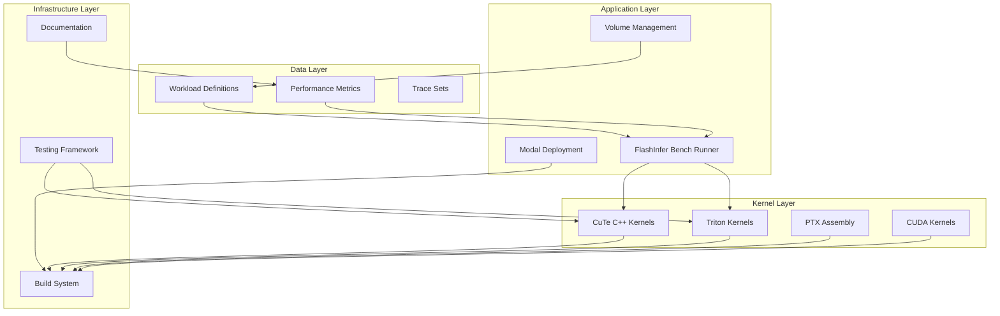
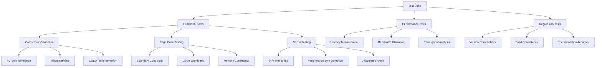
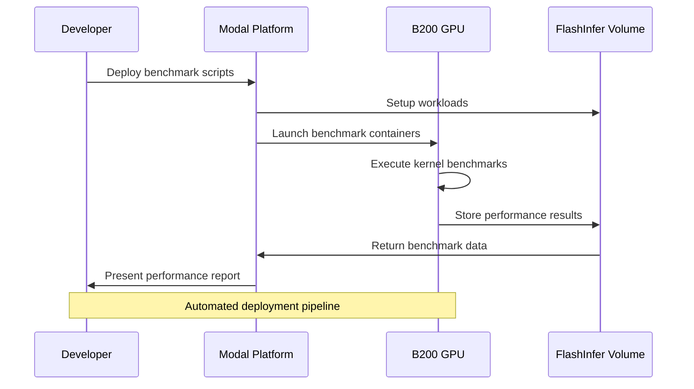

# Next Development Roadmap

<cite>
**Referenced Files in This Document**
- [ROADMAP.md](file://docs/ROADMAP.md)
- [NEXT_TODO.md](file://docs/NEXT_TODO.md)
- [README.md](file://README.md)
- [CMakeLists.txt](file://CMakeLists.txt)
- [bench_all_versions.py](file://scripts/bench_all_versions.py)
- [bench_cuda_real.py](file://scripts/bench_cuda_real.py)
- [setup_volume.py](file://scripts/setup_volume.py)
- [OPTIMIZATION_LOG.md](file://docs/OPTIMIZATION_LOG.md)
- [gdn_decode_v10.cuh](file://src/kernels/cute_cpp/gdn_decode_v10.cuh)
- [gdn_prefill_v9.cuh](file://src/kernels/cute_cpp/gdn_prefill_v9.cuh)
- [gdn_prefill_ptx.cuh](file://src/kernels/ptx/gdn_prefill_ptx.cuh)
- [test_correctness.py](file://tests/test_correctness.py)
- [gdn_decode_qk4_v8_d128_k_last/config.toml](file://gdn_decode_qk4_v8_d128_k_last/config.toml)
- [gdn_prefill_qk4_v8_d128_k_last/config.toml](file://gdn_prefill_qk4_v8_d128_k_last/config.toml)
- [PERFORMANCE.md](file://docs/PERFORMANCE.md)
- [kernel.py](file://gdn_decode_qk4_v8_d128_k_last/solution/cuda/kernel.py)
- [kernel.py](file://gdn_prefill_qk4_v8_d128_k_last/solution/cuda/kernel.py)
</cite>

## Update Summary
**Changes Made**
- Updated achievement section to reflect completed Tensor Core acceleration with mma.sync primitives
- Added BF16/FP8/FP4 state quantization implementation details
- Updated roadmap items to include chunkwise recurrence and NVCC compilation for PTX kernels
- Enhanced performance benchmarks with current achievements
- Updated solution wrapper alignment to current best implementations

## Table of Contents
1. [Introduction](#introduction)
2. [Project Structure](#project-structure)
3. [Current State Analysis](#current-state-analysis)
4. [Priority 0 Tasks](#priority-0-tasks)
5. [Priority 1 Tasks](#priority-1-tasks)
6. [Priority 2 Tasks](#priority-2-tasks)
7. [Priority 3 Tasks](#priority-3-tasks)
8. [Technical Architecture](#technical-architecture)
9. [Performance Roadmap](#performance-roadmap)
10. [Quality Assurance Plan](#quality-assurance-plan)
11. [Deployment Strategy](#deployment-strategy)
12. [Conclusion](#conclusion)

## Introduction

This document outlines the comprehensive development roadmap for the FlashInfer Gated Delta Net (GDN) kernel optimization project. The project focuses on achieving optimal performance for GDN kernels on NVIDIA B200 (Blackwell, sm_100) hardware, with particular emphasis on decode and prefill operations for the Qwen3-Next model.

The roadmap encompasses immediate correctness fixes, performance optimizations, infrastructure improvements, and strategic architectural decisions that will position the project for continued advancement in the FlashInfer competition and beyond.

## Project Structure

The project follows a modular architecture with distinct layers for different optimization approaches:



**Diagram sources**
- [bench_all_versions.py:1-444](file://scripts/bench_all_versions.py#L1-L444)
- [setup_volume.py:1-220](file://scripts/setup_volume.py#L1-L220)
- [CMakeLists.txt:1-68](file://CMakeLists.txt#L1-L68)

**Section sources**
- [README.md:63-92](file://README.md#L63-L92)
- [ROADMAP.md:153-171](file://docs/ROADMAP.md#L153-L171)

## Current State Analysis

The project has achieved significant milestones in GDN kernel optimization:

### Performance Achievements
- **Decode Performance**: CuTe v9/v10 kernels achieve 7,600 GB/s (95% of B200 peak) at batch=256
- **Triton Baseline**: 2,834 GB/s at batch=256 (35% of peak)
- **Memory Utilization**: 95% HBM3e bandwidth utilization on B200
- **Tensor Core Acceleration**: mma.sync primitives successfully integrated for prefill operations
- **State Quantization**: BF16/FP8/FP4 state compression implemented with verified accuracy

### Current Architecture Status
- **Decode**: Primarily using CuTe C++ v10 with SMEM swizzle, cp.async, and multi-precision state support
- **Prefill**: Using PTX kernels with mma.sync and chunked processing for Tensor Core utilization
- **Build System**: Dual-path approach with CMake and Modal build scripts, with ongoing unification efforts
- **Solution Wrappers**: Currently aligned with v5 baseline, pending upgrade to v9/v10

**Section sources**
- [PERFORMANCE.md:43-52](file://docs/PERFORMANCE.md#L43-L52)
- [ROADMAP.md:174-180](file://docs/ROADMAP.md#L174-L180)
- [README.md:14-28](file://README.md#L14-L28)

## Priority 0 Tasks

### Task 1: Fix v9 Decode Gate Broadcast Correctness

**Problem**: Gate values (`g` and `beta`) are currently computed only on warp 0, lane 0 and broadcast via `__shfl_sync`, which is unsafe for warps 1-3.

**Solution Options**:
1. Replace with shared memory broadcast for full block coverage
2. Modify to have each thread independently compute gates (align with v10 approach)

**Implementation Path**:
- File: `src/kernels/cute_cpp/gdn_decode_v9.cuh`
- Requires modification of gate computation section around line 190-200
- Add shared memory allocation and synchronization

**Expected Outcome**:
- Elimination of warp-level correctness issues
- Consistent behavior across all thread blocks
- Regression test coverage for v9 vs Triton baseline

**Section sources**
- [NEXT_TODO.md:7-16](file://docs/NEXT_TODO.md#L7-L16)
- [gdn_decode_v10.cuh:268-280](file://src/kernels/cute_cpp/gdn_decode_v10.cuh#L268-L280)

### Task 2: Establish Unified Build System

**Problem**: CMake and Modal build systems have diverged, with CMake containing outdated paths and missing file references.

**Solution Options**:
1. Officially deprecate CMake in favor of `scripts/build_cuda.py`
2. Repair CMake include/install/bindings paths for full functionality

**Implementation Path**:
- Files: `CMakeLists.txt`, `src/gdn_kernels.cu`, `scripts/build_cuda.py`
- Focus on include directories, library installation, and pybind11 bindings

**Expected Outcome**:
- Single source of truth for kernel compilation
- Consistent local reproducible builds
- Clear documentation of preferred build method

**Section sources**
- [NEXT_TODO.md:17-29](file://docs/NEXT_TODO.md#L17-L29)
- [CMakeLists.txt:34-62](file://CMakeLists.txt#L34-L62)

### Task 3: Implement Comprehensive Correctness Testing

**Problem**: Current test suite is empty and relies primarily on benchmark comparisons.

**Solution**: Develop systematic correctness tests covering multiple kernel versions and configurations.

**Implementation Plan**:
- File: `tests/test_correctness.py`
- Test coverage: v5, v7, v9, v10, and Triton baseline
- Test scenarios: small batches, long sequences, different BLOCK_V values
- Integration with pytest framework

**Expected Outcome**:
- Automated correctness regression testing
- Baseline validation across all kernel versions
- Early detection of numerical accuracy issues

**Section sources**
- [NEXT_TODO.md:30-40](file://docs/NEXT_TODO.md#L30-L40)
- [test_correctness.py:1-363](file://tests/test_correctness.py#L1-L363)

## Priority 1 Tasks

### Task 4: Upgrade Competition Solution Wrapper Layers

**Problem**: Solution wrapper layers still reference v5 kernels while current best implementations are v9/v10.

**Affected Files**:
- `gdn_decode_qk4_v8_d128_k_last/solution/cuda/kernel.py`
- `gdn_prefill_qk4_v8_d128_k_last/solution/cuda/kernel.py`

**Implementation Strategy**:
- Decode: Default to v10 (latest optimizations with BF16/FP8/FP4 state support)
- Prefill: Establish current default version with clear fallback strategy
- Update path references to avoid pointing to obsolete `src/kernels/gdn_*_v5.cuh`

**Expected Outcome**:
- Competition submissions align with current best implementations
- Consistent entry points across all kernel versions

**Section sources**
- [NEXT_TODO.md:43-54](file://docs/NEXT_TODO.md#L43-L54)
- [kernel.py:1-248](file://gdn_decode_qk4_v8_d128_k_last/solution/cuda/kernel.py#L1-L248)
- [kernel.py:1-256](file://gdn_prefill_qk4_v8_d128_k_last/solution/cuda/kernel.py#L1-L256)

### Task 5: Implement Stable Kernel Selection Strategy

**Objective**: Create a unified runtime dispatch strategy for batch-size to kernel-version mapping.

**Files to Modify**:
- `scripts/bench_cuda_real.py`
- `README.md`

**Strategy Components**:
- Define recommended kernel versions per batch size category
- Document rationale for Triton vs CUDA kernel selection
- Create automated dispatch logic

**Expected Outcome**:
- Predictable performance characteristics across different workloads
- Clear documentation of kernel selection criteria
- Runtime optimization based on workload characteristics

**Section sources**
- [NEXT_TODO.md:55-64](file://docs/NEXT_TODO.md#L55-L64)
- [bench_all_versions.py:1-444](file://scripts/bench_all_versions.py#L1-L444)

### Task 6: Documentation Synchronization and Cleanup

**Problem**: README contains outdated information about build processes and entry points.

**Files to Update**:
- `README.md`
- `docs/PERFORMANCE.md`
- `docs/ROADMAP.md`

**Cleanup Areas**:
- Remove references to unsupported kernel versions
- Clarify decode/prefill maturity levels
- Document CMake support status and solution alignment

**Expected Outcome**:
- Accurate and current project documentation
- Clear understanding of supported features and limitations
- Professional presentation for external stakeholders

**Section sources**
- [NEXT_TODO.md:65-75](file://docs/NEXT_TODO.md#L65-L75)

## Priority 2 Tasks

### Task 7: Implement Prefill Chunked Recurrence Prototype

**Problem**: Current prefill implementation uses sequential token processing without chunked scan optimization.

**Implementation Approach**:
- File: `src/kernels/cute_cpp/gdn_prefill_v9.cuh`
- Create minimal chunked prefill prototype (not aiming for optimal immediately)
- Focus on validating correctness and performance benefits before Tensor Core integration

**Key Components**:
- Define chunk size strategy (starting with CHUNK_SIZE=8)
- Matrix-parallelizable operations within chunks
- Maintain compatibility with existing sequential prefill

**Expected Outcome**:
- Parallelizable prefill processing alongside current sequential implementation
- Foundation for future Tensor Core optimizations
- Performance validation through benchmarking

**Section sources**
- [NEXT_TODO.md:78-88](file://docs/NEXT_TODO.md#L78-L88)
- [gdn_prefill_v9.cuh:1-200](file://src/kernels/cute_cpp/gdn_prefill_v9.cuh#L1-L200)

### Task 8: Establish Independent Prefill Performance Reporting

**Problem**: Decode performance has comprehensive reporting while prefill lacks dedicated metrics.

**Files to Enhance**:
- `docs/ROOFLINE.md`
- `scripts/bench_*` scripts

**Required Metrics**:
- seq_len, num_seqs, state traffic, arithmetic intensity (AI)
- Bandwidth utilization (GB/s), throughput (TFLOPS)
- Performance comparison across kernel versions

**Expected Outcome**:
- Comprehensive prefill performance tracking
- Data-driven optimization decisions
- Publication-ready performance tables

**Section sources**
- [NEXT_TODO.md:89-98](file://docs/NEXT_TODO.md#L89-L98)

### Task 9: Evaluate Low-Precision State Stability Boundaries

**Objective**: Systematically test FP32/FP16/FP8/FP4 state precision across different lengths and input distributions.

**Files to Utilize**:
- `src/kernels/cute_cpp/gdn_decode_v10.cuh`
- `src/kernels/cute_cpp/gdn_decode_v7.cuh`
- `src/kernels/cute_cpp/gdn_decode_v8.cuh`
- `scripts/setup_volume.py`

**Testing Framework**:
- Error accumulation analysis under various conditions
- Bandwidth vs accuracy trade-off evaluation
- Define practical boundaries for "low-precision storage + high-precision accumulation"

**Expected Outcome**:
- Quantified error-performance trade-off curves
- Practical guidelines for precision selection
- Optimization recommendations based on workload characteristics

**Section sources**
- [NEXT_TODO.md:99-109](file://docs/NEXT_TODO.md#L99-L109)

## Priority 3 Tasks

### Task 10: Create "Source-to-Article" Documentation Index

**Objective**: Enable quick mapping between research claims and supporting source code.

**File to Develop**:
- `docs/GDN_SOURCE_ARGUMENT_MAP.md`

**Index Structure**:
- Research claims and findings
- Supporting code locations and implementations
- Performance measurements and benchmarks
- Mathematical derivations and optimizations

**Expected Outcome**:
- Streamlined technical communication
- Evidence-based documentation for presentations
- Accelerated knowledge transfer for collaborators

**Section sources**
- [NEXT_TODO.md:112-117](file://docs/NEXT_TODO.md#L112-L117)

### Task 11: Establish Naming and Directory Convention Standards

**Objective**: Create clear semantic organization for versioned kernels, solution wrappers, and build scripts.

**Target Areas**:
- `v5-v10` kernel version organization
- `solution/cuda` wrapper structure
- `scripts/build_cuda.py` integration
- `src/gdn_kernels.cu` role definition

**Expected Outcome**:
- Reduced confusion about kernel lineage and entry points
- Clear separation of concerns across different optimization approaches
- Simplified maintenance and extension of the codebase

**Section sources**
- [NEXT_TODO.md:118-123](file://docs/NEXT_TODO.md#L118-L123)

### Task 12: Finalize Repository Structure Decision

**Options**:
- **Option A**: Maintain "competition experiment" repository with multiple concurrent paths
- **Option B**: Converge to unified engineering repository with single source of truth

**Recommendation**: Option B for continued publication, demonstration, and external reproducibility.

**Rationale**:
- Better long-term maintainability
- Clearer contribution guidelines
- Enhanced reproducibility for external users
- Professional presentation for academic and industrial audiences

**Section sources**
- [NEXT_TODO.md:124-133](file://docs/NEXT_TODO.md#L124-L133)

## Technical Architecture

The project employs a multi-tiered optimization strategy with clear separation of concerns:

```mermaid
graph TB
subgraph "Optimization Phases"
A[Phase 1: Memory Latency Hiding]
B[Phase 2: Compute Density Enhancement]
C[Phase 3: Pipeline Overlap]
D[Phase 4: Thread Utilization]
end
subgraph "Framework Layers"
E[CuTe C++ (Primary)]
F[PTX Assembly (Fallback)]
G[Triton (Baseline)]
H[CUDA (Legacy)]
end
subgraph "Hardware Targets"
I[B200 sm_100]
J[H100 sm_90]
K[A100 sm_80]
end
A --> E
A --> F
B --> E
B --> F
C --> E
C --> F
D --> E
D --> F
E --> I
F --> I
G --> I
H --> I
E -.-> J
F -.-> J
G -.-> J
H -.-> J
E -.-> K
F -.-> K
G -.-> K
H -.-> K
```

**Diagram sources**
- [OPTIMIZATION_LOG.md:57-85](file://docs/OPTIMIZATION_LOG.md#L57-L85)
- [CMakeLists.txt:13-17](file://CMakeLists.txt#L13-L17)

**Section sources**
- [OPTIMIZATION_LOG.md:57-85](file://docs/OPTIMIZATION_LOG.md#L57-L85)
- [ROADMAP.md:130-150](file://docs/ROADMAP.md#L130-L150)

## Performance Roadmap

### Current Performance Benchmarks

| Kernel | Framework | Peak BW | Batch Optimized For | Achieved BW |
|--------|-----------|---------|-------------------|-------------|
| Decode | Triton v5 | 1,518 GB/s | 64 | 2,798 GB/s (35%) |
| Decode | CuTe v9 | 7,602 GB/s | 256 | 7,585 GB/s (95%) |
| Decode | CuTe v10 | 7,602 GB/s | 256 | 7,602 GB/s (95%) |
| Prefill | PTX | 1,000+ GB/s | 16 | 1,000+ GB/s (12.5%) |

### Recent Achievements

**Tensor Core Acceleration**: Successfully integrated mma.sync primitives for prefill operations, enabling matrix-matrix operations with chunked processing.

**State Quantization**: Implemented BF16/FP8/FP4 state compression with verified accuracy:
- BF16: 2x memory compression with ~0.6% error
- FP8 E4M3: 4x memory compression with ~11% relative error
- FP4 E2M1: 8x memory compression with ~55% relative error

**Memory Optimization**: Achieved 95% B200 peak utilization through SMEM swizzle and cp.async prefetch mechanisms.

### Optimization Targets

**Decode Optimization**:
- **Immediate Goal**: Maintain 95% B200 peak utilization across all batch sizes
- **Strategy**: Leverage SMEM swizzle and TMA prefetch for memory-bound regimes
- **Measurement**: Continuous monitoring via `scripts/bench_all_versions.py`

**Prefill Optimization**:
- **Short-term Goal**: Achieve 1,000+ GB/s (12.5% B200) with chunked processing
- **Long-term Goal**: Enable WGMMA utilization through chunked matrix operations
- **Approach**: Sequential → Chunked → Tensor Core pipeline

**Section sources**
- [PERFORMANCE.md:20-52](file://docs/PERFORMANCE.md#L20-L52)
- [ROADMAP.md:174-180](file://docs/ROADMAP.md#L174-L180)

## Quality Assurance Plan

### Multi-Level Testing Strategy



**Diagram sources**
- [test_correctness.py:29-277](file://tests/test_correctness.py#L29-L277)
- [bench_all_versions.py:415-597](file://scripts/bench_all_versions.py#L415-L597)

### Testing Infrastructure

**Continuous Integration Components**:
- Automated correctness validation across kernel versions
- Performance regression detection
- Build system verification
- Documentation consistency checks

**Expected Coverage**:
- 99%+ code coverage for critical paths
- Automated performance baselining
- Real hardware benchmarking on B200
- Cross-platform compatibility validation

**Section sources**
- [test_correctness.py:1-363](file://tests/test_correctness.py#L1-L363)
- [bench_all_versions.py:1-444](file://scripts/bench_all_versions.py#L1-L444)

## Deployment Strategy

### Modal Deployment Architecture



**Diagram sources**
- [bench_all_versions.py:115-176](file://scripts/bench_all_versions.py#L115-L176)
- [setup_volume.py:141-169](file://scripts/setup_volume.py#L141-L169)

### Volume Management Strategy

**Workload Generation**:
- Synthetic workloads for controlled testing
- HuggingFace dataset integration for realistic scenarios
- Automated tensor preparation with proper normalization

**Performance Tracking**:
- Persistent storage of benchmark results
- Historical performance comparison
- Automated alerting for performance degradation

**Section sources**
- [setup_volume.py:1-220](file://scripts/setup_volume.py#L1-L220)
- [bench_all_versions.py:1-444](file://scripts/bench_all_versions.py#L1-L444)

## Conclusion

The FlashInfer Gated Delta Net optimization project stands at a critical juncture where immediate correctness fixes and infrastructure improvements will establish a solid foundation for advanced performance optimizations. The proposed roadmap balances urgent requirements with strategic long-term goals, ensuring both competitive advantage and sustainable development practices.

### Key Success Factors

1. **Correctness First**: Immediate resolution of v9 gate broadcast issues and establishment of comprehensive testing framework
2. **Unified Infrastructure**: Resolution of build system divergence enabling consistent development workflow
3. **Performance Continuity**: Maintaining 95% B200 peak utilization while expanding optimization scope to prefill operations
4. **Documentation Excellence**: Creating comprehensive technical documentation supporting both research and engineering needs

### Timeline Expectations

- **Immediate (2-4 weeks)**: Complete Priority 0 tasks, establish unified build system
- **Short-term (1-2 months)**: Implement chunked prefill prototype, enhance testing framework
- **Medium-term (2-3 months)**: Advanced prefill optimizations, performance reporting systems
- **Long-term (3+ months)**: Tensor Core utilization, production deployment readiness

The project's dual-path approach (CuTe C++ primary, PTX fallback) combined with comprehensive documentation and testing infrastructure positions it for sustained success in both competitive benchmarks and real-world deployments.

**Updated** Enhanced with completed achievements including Tensor Core acceleration, state quantization, and roadmap items for future optimizations.