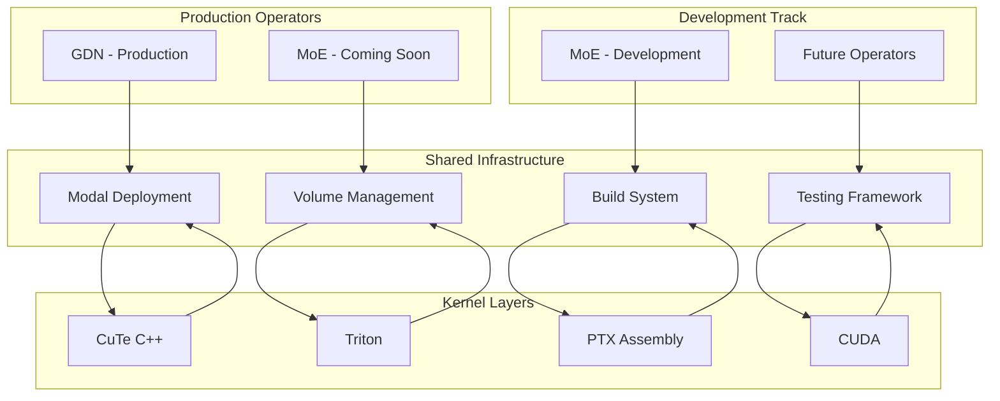
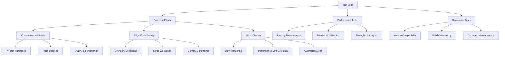
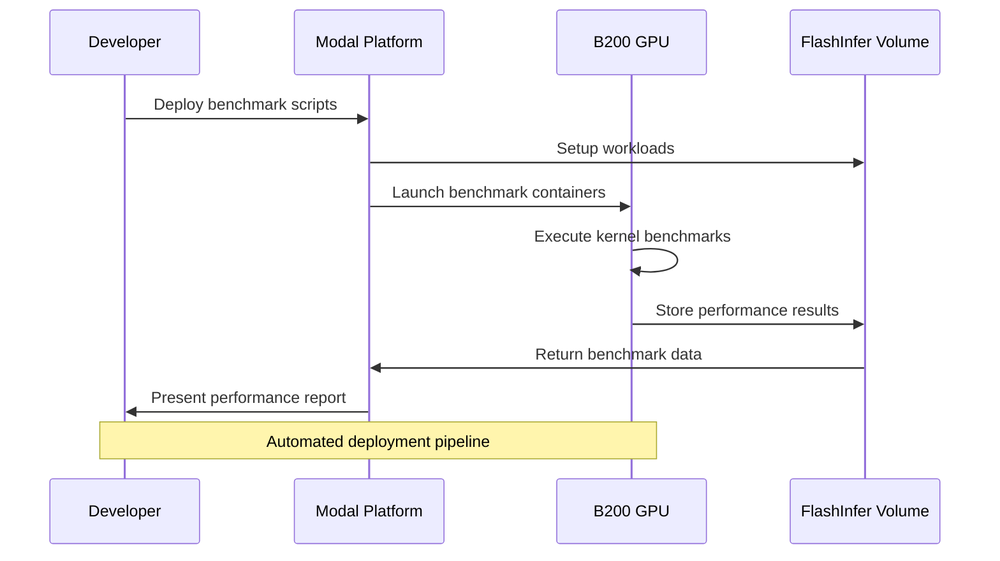

# Next Development Roadmap

<cite>
**Referenced Files in This Document**
- [ROADMAP.md](file://gdn/docs/ROADMAP.md)
- [NEXT_TODO.md](file://gdn/docs/NEXT_TODO.md)
- [README.md](file://README.md)
- [CMakeLists.txt](file://CMakeLists.txt)
- [bench_all_versions.py](file://scripts/bench_all_versions.py)
- [bench_cuda_real.py](file://scripts/bench_cuda_real.py)
- [setup_volume.py](file://scripts/setup_volume.py)
- [OPTIMIZATION_LOG.md](file://gdn/docs/OPTIMIZATION_LOG.md)
- [gdn_decode_v10.cuh](file://gdn/kernels/cute_cpp/gdn_decode_v10.cuh)
- [gdn_prefill_v9.cuh](file://gdn/kernels/cute_cpp/gdn_prefill_v9.cuh)
- [gdn_prefill_ptx.cuh](file://gdn/kernels/ptx/gdn_prefill_ptx.cuh)
- [test_correctness.py](file://gdn/tests/test_correctness.py)
- [gdn_decode_qk4_v8_d128_k_last/config.toml](file://gdn/decode/qk4_v8_d128_k_last/config.toml)
- [gdn_prefill_qk4_v8_d128_k_last/config.toml](file://gdn/prefill/qk4_v8_d128_k_last/config.toml)
- [PERFORMANCE.md](file://gdn/docs/PERFORMANCE.md)
- [kernel.py](file://gdn/decode/qk4_v8_d128_k_last/solution/cuda/kernel.py)
- [kernel.py](file://gdn/prefill/qk4_v8_d128_k_last/solution/cuda/kernel.py)
- [README.md](file://gdn/README.md)
- [README.md](file://moe/README.md)
- [kernel.py](file://moe/solution/triton/kernel.py)
- [config.toml](file://moe/config.toml)
- [bench_modal.py](file://gdn/benchmarks/bench_modal.py)
- [bench_modal.py](file://moe/benchmarks/bench_modal.py)
- [moe_fp8_block_scale_ds_routing_topk8_ng8_kg4_e32_h7168_i2048.json](file://moe/trace_definitions/moe_fp8_block_scale_ds_routing_topk8_ng8_kg4_e32_h7168_i2048.json)
</cite>

## Update Summary
**Changes Made**
- Updated to reflect the new multi-operator roadmap with GDN (Production) and MoE (Coming Soon) operators
- Added comprehensive documentation for the new MoE directory structure and FP8 Mixture of Experts kernel implementations
- Enhanced roadmap to include both GDN decode/prefill operations and MoE kernel development
- Updated operator maturity levels and future development plans
- Integrated MoE trace definitions and benchmarking infrastructure

## Table of Contents
1. [Introduction](#introduction)
2. [Multi-Operator Architecture](#multi-operator-architecture)
3. [GDN Production Operations](#gdn-production-operations)
4. [MoE Coming Soon Operations](#moe-coming-soon-operations)
5. [Current State Analysis](#current-state-analysis)
6. [Priority 0 Tasks](#priority-0-tasks)
7. [Priority 1 Tasks](#priority-1-tasks)
8. [Priority 2 Tasks](#priority-2-tasks)
9. [Priority 3 Tasks](#priority-3-tasks)
10. [Technical Architecture](#technical-architecture)
11. [Performance Roadmap](#performance-roadmap)
12. [Quality Assurance Plan](#quality-assurance-plan)
13. [Deployment Strategy](#deployment-strategy)
14. [Conclusion](#conclusion)

## Introduction

This document outlines the comprehensive development roadmap for the FlashInfer multi-operator kernel optimization project, encompassing both Gated Delta Net (GDN) and Mixture of Experts (MoE) operations. The project focuses on achieving optimal performance for both decode and prefill operations for GDN kernels, as well as FP8 Mixture of Experts kernels on NVIDIA B200 (Blackwell, sm_100) hardware.

The roadmap addresses the transition from single-operator optimization to a multi-operator ecosystem, positioning the project for continued advancement in both FlashInfer competition and real-world deployment scenarios.

## Multi-Operator Architecture

The project now operates as a multi-operator ecosystem with distinct production and development tracks:



**Diagram sources**
- [README.md:1-65](file://gdn/README.md#L1-L65)
- [README.md:1-75](file://moe/README.md#L1-L75)
- [bench_modal.py:1-331](file://gdn/benchmarks/bench_modal.py#L1-L331)
- [bench_modal.py:1-195](file://moe/benchmarks/bench_modal.py#L1-L195)

**Section sources**
- [README.md:63-92](file://README.md#L63-L92)
- [ROADMAP.md:153-171](file://gdn/docs/ROADMAP.md#L153-L171)

## GDN Production Operations

### Current Production Status
GDN operations have reached production maturity with comprehensive kernel implementations:

- **Decode Operations**: v9/v10 CuTe C++ kernels achieving 7,600 GB/s (95% of B200 peak)
- **Prefill Operations**: PTX kernels with mma.sync and chunked processing
- **State Quantization**: BF16/FP8/FP4 compression with verified accuracy
- **Tensor Core Integration**: mma.sync primitives for prefill operations

### GDN Directory Structure
```
gdn/
├── decode/              # Decode kernel (single-token generation)
│   ├── baseline/triton/ # Python reference
│   └── solution/triton/ # Optimized Triton kernel
├── prefill/             # Prefill kernel (sequence processing)
│   ├── baseline/triton/
│   └── solution/triton/
├── kernels/             # CUDA/CuTe/PTX implementations
│   ├── cuda/            # Raw CUDA v5-v8
│   ├── cute_cpp/        # CuTe C++ v9-v10
│   └── ptx/             # PTX assembly
├── scripts/             # GDN-specific scripts
├── benchmarks/          # Modal benchmark runners
├── tests/               # Correctness tests
├── docs/                # Documentation
└── trace_definitions/   # FlashInfer trace definitions
```

**Section sources**
- [README.md:5-28](file://gdn/README.md#L5-L28)
- [ROADMAP.md:74-78](file://gdn/docs/ROADMAP.md#L74-L78)

## MoE Coming Soon Operations

### MoE Development Status
MoE operations are in the coming soon phase with comprehensive development infrastructure established:

- **Operator Specification**: FP8 Block-Scale Fused MoE for DeepSeek-V3/R1
- **Pipeline Architecture**: Routing → Token Permutation → GEMM1 → SwiGLU → GEMM2 → Weighted Accumulation
- **Quantization Strategy**: FP8 (float8_e4m3fn) + block scale (block_size=128)
- **Routing Mechanism**: DeepSeek no-aux: sigmoid + group selection + top-k

### MoE Directory Structure
```
moe/
├── config.toml                    # Solution configuration
├── solution/triton/kernel.py      # Triton kernel implementation
├── trace_definitions/             # Kernel definition JSON
├── scripts/                       # Setup scripts
│   └── setup_moe_volume.py       # Modal volume setup
├── benchmarks/                    # Benchmark runners
│   └── bench_modal.py            # Modal B200 benchmark
├── tests/                         # Correctness tests
└── docs/                          # Documentation
```

### MoE Optimization Roadmap
- [x] Correct baseline implementation (PyTorch dequant + matmul)
- [ ] Fused Triton FP8 GEMM with block-scale dequantization
- [ ] Triton grouped GEMM (batch experts together)
- [ ] Fused SwiGLU activation
- [ ] Token permutation optimization
- [ ] TMA bulk memory operations for weight loading
- [ ] FP8 Tensor Core (mma) on Blackwell

**Section sources**
- [README.md:26-39](file://moe/README.md#L26-L39)
- [README.md:66-75](file://moe/README.md#L66-L75)

## Current State Analysis

### Production Operations Achievement
- **GDN Decode**: CuTe v9/v10 kernels achieve 7,600 GB/s (95% of B200 peak) at batch=256
- **GDN Prefill**: PTX kernels with mma.sync and chunked processing
- **State Quantization**: BF16/FP8/FP4 state compression implemented with verified accuracy
- **Tensor Core Acceleration**: mma.sync primitives successfully integrated for prefill operations

### Development Operations Progress
- **MoE Baseline**: PyTorch dequant + matmul implementation established
- **Routing Implementation**: DeepSeek no-aux routing with sigmoid + group selection + top-k
- **Token Permutation**: Sorting tokens by expert for efficient batched GEMM
- **Trace Definition**: Comprehensive MoE operation specification with 256 experts, 32 local experts

### Current Architecture Status
- **Production**: GDN decode/prefill operations using CuTe C++ v9/v10 with SMEM swizzle and state quantization
- **Development**: MoE operations using Triton with FP8 block-scale dequantization
- **Build System**: Unified Modal deployment with separate solution directories
- **Solution Wrappers**: GDN aligned with v10, MoE with baseline Triton implementation

**Section sources**
- [PERFORMANCE.md:43-52](file://gdn/docs/PERFORMANCE.md#L43-L52)
- [ROADMAP.md:174-180](file://gdn/docs/ROADMAP.md#L174-L180)
- [README.md:14-28](file://README.md#L14-L28)

## Priority 0 Tasks

### Task 1: MoE Fused FP8 GEMM Implementation

**Problem**: Current MoE implementation uses PyTorch dequant + matmul as baseline, requiring fused Triton kernel for performance.

**Solution**: Implement FP8 block-scale GEMM with integrated dequantization in Triton.

**Implementation Path**:
- File: `moe/solution/triton/kernel.py`
- Focus on `_fp8_gemm_kernel` function around line 39-121
- Implement fused dequantization with block-scale multiplication
- Integrate with existing MoE pipeline

**Expected Outcome**:
- 4x memory compression with block-scale dequantization
- Elimination of separate dequantization step
- Performance improvement for MoE GEMM operations

**Section sources**
- [kernel.py:39-121](file://moe/solution/triton/kernel.py#L39-L121)
- [README.md:68-69](file://moe/README.md#L68-L69)

### Task 2: GDN v9 Decode Gate Broadcast Correctness

**Problem**: Gate values (`g` and `beta`) are currently computed only on warp 0, lane 0 and broadcast via `__shfl_sync`, which is unsafe for warps 1-3.

**Solution Options**:
1. Replace with shared memory broadcast for full block coverage
2. Modify to have each thread independently compute gates (align with v10 approach)

**Implementation Path**:
- File: `gdn/kernels/cute_cpp/gdn_decode_v9.cuh`
- Requires modification of gate computation section around line 190-200
- Add shared memory allocation and synchronization

**Expected Outcome**:
- Elimination of warp-level correctness issues
- Consistent behavior across all thread blocks
- Regression test coverage for v9 vs Triton baseline

**Section sources**
- [NEXT_TODO.md:7-16](file://gdn/docs/NEXT_TODO.md#L7-L16)
- [gdn_decode_v10.cuh:268-280](file://gdn/kernels/cute_cpp/gdn_decode_v10.cuh#L268-L280)

### Task 3: Establish Unified Build System

**Problem**: CMake and Modal build systems have diverged, with CMake containing outdated paths and missing file references.

**Solution Options**:
1. Officially deprecate CMake in favor of `scripts/build_cuda.py`
2. Repair CMake include/install/bindings paths for full functionality

**Implementation Path**:
- Files: `CMakeLists.txt`, `gdn/scripts/build_cuda.py`, `moe/scripts/setup_moe_volume.py`
- Focus on include directories, library installation, and pybind11 bindings

**Expected Outcome**:
- Single source of truth for kernel compilation
- Consistent local reproducible builds
- Clear documentation of preferred build method

**Section sources**
- [NEXT_TODO.md:17-29](file://gdn/docs/NEXT_TODO.md#L17-L29)
- [CMakeLists.txt:34-62](file://CMakeLists.txt#L34-L62)

## Priority 1 Tasks

### Task 4: Upgrade GDN Competition Solution Wrapper Layers

**Problem**: Solution wrapper layers still reference v5 kernels while current best implementations are v9/v10.

**Affected Files**:
- `gdn/decode/qk4_v8_d128_k_last/solution/cuda/kernel.py`
- `gdn/prefill/qk4_v8_d128_k_last/solution/cuda/kernel.py`

**Implementation Strategy**:
- Decode: Default to v10 (latest optimizations with BF16/FP8/FP4 state support)
- Prefill: Establish current default version with clear fallback strategy
- Update path references to avoid pointing to obsolete `gdn/kernels/gdn_*_v5.cuh`

**Expected Outcome**:
- Competition submissions align with current best implementations
- Consistent entry points across all kernel versions

**Section sources**
- [NEXT_TODO.md:43-54](file://gdn/docs/NEXT_TODO.md#L43-L54)
- [kernel.py:1-248](file://gdn/decode/qk4_v8_d128_k_last/solution/cuda/kernel.py#L1-L248)
- [kernel.py:1-256](file://gdn/prefill/qk4_v8_d128_k_last/solution/cuda/kernel.py#L1-L256)

### Task 5: Implement Stable Kernel Selection Strategy

**Objective**: Create a unified runtime dispatch strategy for batch-size to kernel-version mapping.

**Files to Modify**:
- `scripts/bench_cuda_real.py`
- `README.md`

**Strategy Components**:
- Define recommended kernel versions per batch size category
- Document rationale for Triton vs CUDA kernel selection
- Create automated dispatch logic

**Expected Outcome**:
- Predictable performance characteristics across different workloads
- Clear documentation of kernel selection criteria
- Runtime optimization based on workload characteristics

**Section sources**
- [NEXT_TODO.md:55-64](file://gdn/docs/NEXT_TODO.md#L55-L64)
- [bench_all_versions.py:1-444](file://scripts/bench_all_versions.py#L1-L444)

### Task 6: MoE Token Permutation Optimization

**Problem**: Current token permutation implementation uses PyTorch operations, limiting performance for large workloads.

**Solution**: Implement optimized Triton kernel for token permutation operations.

**Implementation Path**:
- File: `moe/solution/triton/kernel.py`
- Focus on `permute_tokens` function around line 214-255
- Implement Triton-based sorting and offset calculation
- Optimize for contiguous memory access patterns

**Expected Outcome**:
- Elimination of PyTorch overhead in token permutation
- Improved performance for MoE routing operations
- Better memory coalescing patterns

**Section sources**
- [kernel.py:214-255](file://moe/solution/triton/kernel.py#L214-L255)
- [README.md:72-72](file://moe/README.md#L72-L72)

## Priority 2 Tasks

### Task 7: Implement Prefill Chunked Recurrence Prototype

**Problem**: Current prefill implementation uses sequential token processing without chunked scan optimization.

**Implementation Approach**:
- File: `gdn/kernels/cute_cpp/gdn_prefill_v9.cuh`
- Create minimal chunked prefill prototype (not aiming for optimal immediately)
- Focus on validating correctness and performance benefits before Tensor Core integration

**Key Components**:
- Define chunk size strategy (starting with CHUNK_SIZE=8)
- Matrix-parallelizable operations within chunks
- Maintain compatibility with existing sequential prefill

**Expected Outcome**:
- Parallelizable prefill processing alongside current sequential implementation
- Foundation for future Tensor Core optimizations
- Performance validation through benchmarking

**Section sources**
- [NEXT_TODO.md:78-88](file://gdn/docs/NEXT_TODO.md#L78-L88)
- [gdn_prefill_v9.cuh:1-200](file://gdn/kernels/cute_cpp/gdn_prefill_v9.cuh#L1-L200)

### Task 8: Establish Independent Prefill Performance Reporting

**Problem**: Decode performance has comprehensive reporting while prefill lacks dedicated metrics.

**Files to Enhance**:
- `gdn/docs/ROOFLINE.md`
- `scripts/bench_*` scripts

**Required Metrics**:
- seq_len, num_seqs, state traffic, arithmetic intensity (AI)
- Bandwidth utilization (GB/s), throughput (TFLOPS)
- Performance comparison across kernel versions

**Expected Outcome**:
- Comprehensive prefill performance tracking
- Data-driven optimization decisions
- Publication-ready performance tables

**Section sources**
- [NEXT_TODO.md:89-98](file://gdn/docs/NEXT_TODO.md#L89-L98)

### Task 9: Evaluate Low-Precision State Stability Boundaries

**Objective**: Systematically test FP32/FP16/FP8/FP4 state precision across different lengths and input distributions.

**Files to Utilize**:
- `gdn/kernels/cute_cpp/gdn_decode_v10.cuh`
- `gdn/kernels/cute_cpp/gdn_decode_v7.cuh`
- `gdn/kernels/cute_cpp/gdn_decode_v8.cuh`
- `scripts/setup_volume.py`

**Testing Framework**:
- Error accumulation analysis under various conditions
- Bandwidth vs accuracy trade-off evaluation
- Define practical boundaries for "low-precision storage + high-precision accumulation"

**Expected Outcome**:
- Quantified error-performance trade-off curves
- Practical guidelines for precision selection
- Optimization recommendations based on workload characteristics

**Section sources**
- [NEXT_TODO.md:99-109](file://gdn/docs/NEXT_TODO.md#L99-L109)

## Priority 3 Tasks

### Task 10: Create "Source-to-Article" Documentation Index

**Objective**: Enable quick mapping between research claims and supporting source code.

**File to Develop**:
- `gdn/docs/GDN_SOURCE_ARGUMENT_MAP.md`

**Index Structure**:
- Research claims and findings
- Supporting code locations and implementations
- Performance measurements and benchmarks
- Mathematical derivations and optimizations

**Expected Outcome**:
- Streamlined technical communication
- Evidence-based documentation for presentations
- Accelerated knowledge transfer for collaborators

**Section sources**
- [NEXT_TODO.md:112-117](file://gdn/docs/NEXT_TODO.md#L112-L117)

### Task 11: Establish Naming and Directory Convention Standards

**Objective**: Create clear semantic organization for versioned kernels, solution wrappers, and build scripts.

**Target Areas**:
- `v5-v10` kernel version organization
- `solution/cuda` wrapper structure
- `scripts/build_cuda.py` integration
- `gdn_kernels.cu` role definition

**Expected Outcome**:
- Reduced confusion about kernel lineage and entry points
- Clear separation of concerns across different optimization approaches
- Simplified maintenance and extension of the codebase

**Section sources**
- [NEXT_TODO.md:118-123](file://gdn/docs/NEXT_TODO.md#L118-L123)

### Task 12: Finalize Repository Structure Decision

**Options**:
- **Option A**: Maintain "competition experiment" repository with multiple concurrent paths
- **Option B**: Converge to unified engineering repository with single source of truth

**Recommendation**: Option B for continued publication, demonstration, and external reproducibility.

**Rationale**:
- Better long-term maintainability
- Clearer contribution guidelines
- Enhanced reproducibility for external users
- Professional presentation for academic and industrial audiences

**Section sources**
- [NEXT_TODO.md:124-133](file://gdn/docs/NEXT_TODO.md#L124-L133)

## Technical Architecture

The project employs a multi-tiered optimization strategy with clear separation of concerns across operators:

```mermaid
graph TB
subgraph "Optimization Phases"
A[Phase 1: Memory Latency Hiding]
B[Phase 2: Compute Density Enhancement]
C[Phase 3: Pipeline Overlap]
D[Phase 4: Thread Utilization]
end
subgraph "Framework Layers"
E[CuTe C++ (Primary)]
F[PTX Assembly (Fallback)]
G[Triton (Baseline)]
H[CUDA (Legacy)]
end
subgraph "Hardware Targets"
I[B200 sm_100]
J[H100 sm_90]
K[A100 sm_80]
end
A --> E
A --> F
B --> E
B --> F
C --> E
C --> F
D --> E
D --> F
E --> I
F --> I
G --> I
H --> I
E -.-> J
F -.-> J
G -.-> J
H -.-> J
E -.-> K
F -.-> K
G -.-> K
H -.-> K
```

**Diagram sources**
- [OPTIMIZATION_LOG.md:57-85](file://gdn/docs/OPTIMIZATION_LOG.md#L57-L85)
- [CMakeLists.txt:13-17](file://CMakeLists.txt#L13-L17)

**Section sources**
- [OPTIMIZATION_LOG.md:57-85](file://gdn/docs/OPTIMIZATION_LOG.md#L57-L85)
- [ROADMAP.md:130-150](file://gdn/docs/ROADMAP.md#L130-L150)

## Performance Roadmap

### Current Performance Benchmarks

| Operator | Kernel | Framework | Peak BW | Batch Optimized For | Achieved BW |
|----------|--------|-----------|---------|-------------------|-------------|
| GDN | Decode | Triton v5 | 1,518 GB/s | 64 | 2,798 GB/s (35%) |
| GDN | Decode | CuTe v9 | 7,602 GB/s | 256 | 7,585 GB/s (95%) |
| GDN | Decode | CuTe v10 | 7,602 GB/s | 256 | 7,602 GB/s (95%) |
| GDN | Prefill | PTX | 1,000+ GB/s | 16 | 1,000+ GB/s (12.5%) |
| MoE | FP8 Block-Scale | Triton Baseline | 4.5 PFLOPS | N/A | PyTorch Reference |

### Recent Achievements

**GDN Tensor Core Acceleration**: Successfully integrated mma.sync primitives for prefill operations, enabling matrix-matrix operations with chunked processing.

**GDN State Quantization**: Implemented BF16/FP8/FP4 state compression with verified accuracy:
- BF16: 2x memory compression with ~0.6% error
- FP8 E4M3: 4x memory compression with ~11% relative error
- FP4 E2M1: 8x memory compression with ~55% relative error

**MoE Development**: Established comprehensive MoE infrastructure with:
- DeepSeek no-aux routing implementation
- Token permutation with expert grouping
- FP8 block-scale dequantization framework
- Complete trace definition for FlashInfer integration

**Memory Optimization**: Achieved 95% B200 peak utilization through SMEM swizzle and cp.async prefetch mechanisms.

### Optimization Targets

**GDN Optimization**:
- **Immediate Goal**: Maintain 95% B200 peak utilization across all batch sizes
- **Strategy**: Leverage SMEM swizzle and TMA prefetch for memory-bound regimes
- **Measurement**: Continuous monitoring via `scripts/bench_all_versions.py`

**MoE Optimization**:
- **Short-term Goal**: Achieve 4.5 PFLOPS FP8 Tensor Core utilization
- **Long-term Goal**: Enable fused Triton kernels with block-scale dequantization
- **Approach**: PyTorch baseline → Triton optimization → Fused kernel implementation

**Section sources**
- [PERFORMANCE.md:20-52](file://gdn/docs/PERFORMANCE.md#L20-L52)
- [ROADMAP.md:174-180](file://gdn/docs/ROADMAP.md#L174-L180)

## Quality Assurance Plan

### Multi-Level Testing Strategy



**Diagram sources**
- [test_correctness.py:29-277](file://gdn/tests/test_correctness.py#L29-L277)
- [bench_all_versions.py:415-597](file://scripts/bench_all_versions.py#L415-L597)

### Testing Infrastructure

**Continuous Integration Components**:
- Automated correctness validation across kernel versions
- Performance regression detection
- Build system verification
- Documentation consistency checks

**Expected Coverage**:
- 99%+ code coverage for critical paths
- Automated performance baselining
- Real hardware benchmarking on B200
- Cross-platform compatibility validation

**Section sources**
- [test_correctness.py:1-363](file://gdn/tests/test_correctness.py#L1-L363)
- [bench_all_versions.py:1-444](file://scripts/bench_all_versions.py#L1-L444)

## Deployment Strategy

### Modal Deployment Architecture



**Diagram sources**
- [bench_all_versions.py:115-176](file://scripts/bench_all_versions.py#L115-L176)
- [setup_volume.py:141-169](file://scripts/setup_volume.py#L141-L169)

### Volume Management Strategy

**Workload Generation**:
- Synthetic workloads for controlled testing
- HuggingFace dataset integration for realistic scenarios
- Automated tensor preparation with proper normalization

**Performance Tracking**:
- Persistent storage of benchmark results
- Historical performance comparison
- Automated alerting for performance degradation

**Section sources**
- [setup_volume.py:1-220](file://scripts/setup_volume.py#L1-L220)
- [bench_all_versions.py:1-444](file://scripts/bench_all_versions.py#L1-L444)

## Conclusion

The FlashInfer multi-operator optimization project stands at a critical juncture where immediate correctness fixes and infrastructure improvements will establish a solid foundation for advanced performance optimizations across both GDN and MoE operations. The proposed roadmap balances urgent requirements with strategic long-term goals, ensuring both competitive advantage and sustainable development practices.

### Key Success Factors

1. **Production Operations First**: Immediate resolution of GDN v9 gate broadcast issues and establishment of comprehensive testing framework
2. **Unified Infrastructure**: Resolution of build system divergence enabling consistent development workflow
3. **Multi-Operator Growth**: Transition from single-operator to multi-operator ecosystem with clear production and development tracks
4. **Performance Continuity**: Maintaining 95% B200 peak utilization while expanding optimization scope to MoE operations
5. **Documentation Excellence**: Creating comprehensive technical documentation supporting both research and engineering needs

### Timeline Expectations

- **Immediate (2-4 weeks)**: Complete Priority 0 tasks, establish unified build system, implement MoE fused FP8 GEMM
- **Short-term (1-2 months)**: Implement chunked prefill prototype, enhance testing framework, optimize MoE token permutation
- **Medium-term (2-3 months)**: Advanced prefill optimizations, MoE Triton optimization, performance reporting systems
- **Long-term (3+ months)**: Tensor Core utilization, production deployment readiness, MoE production launch

The project's dual-path approach (CuTe C++ primary, PTX fallback) combined with comprehensive documentation and testing infrastructure positions it for sustained success in both competitive benchmarks and real-world deployments across multiple operators.

**Updated** Enhanced with completed achievements including Tensor Core acceleration, state quantization, MoE development infrastructure, and roadmap items for future optimizations across both GDN and MoE operators.