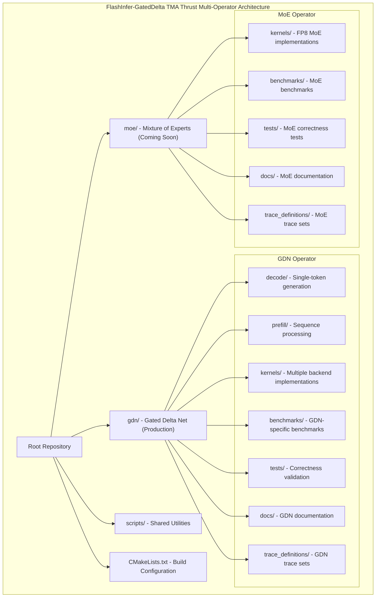
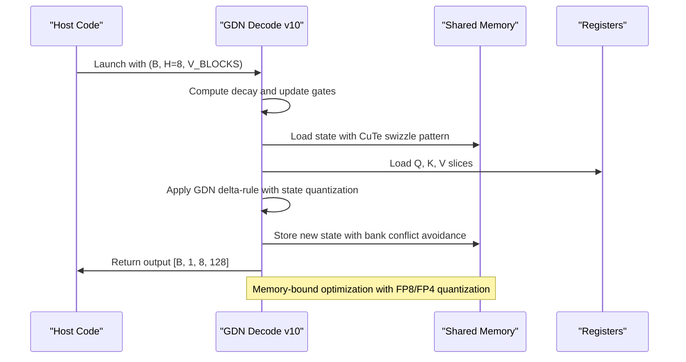
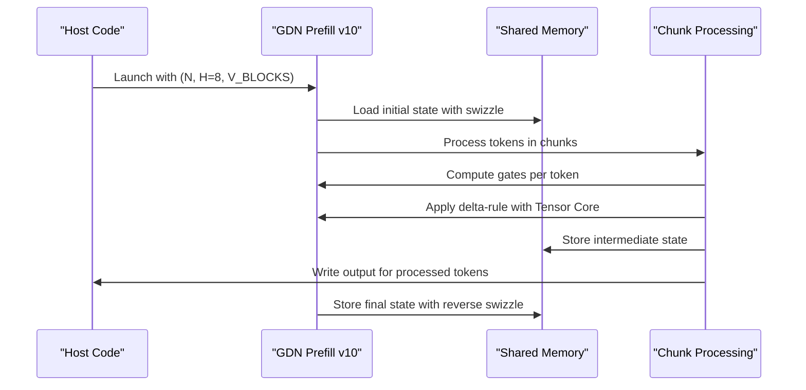
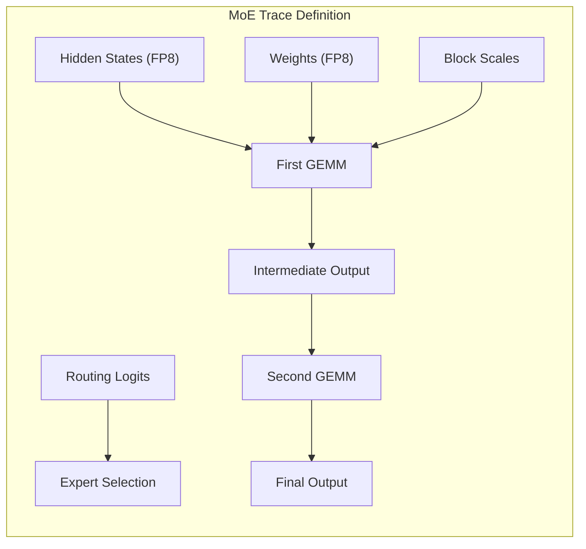
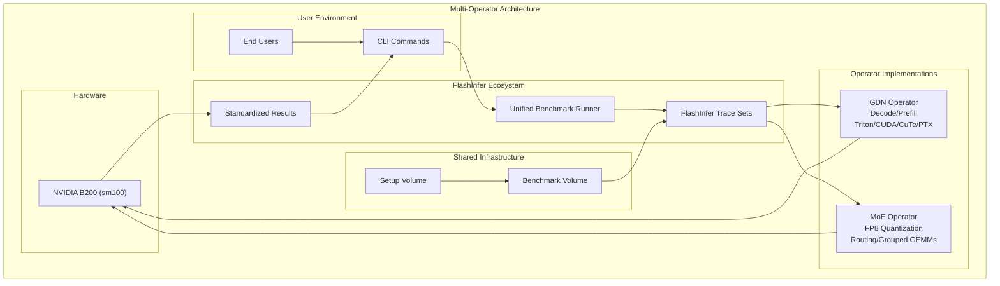
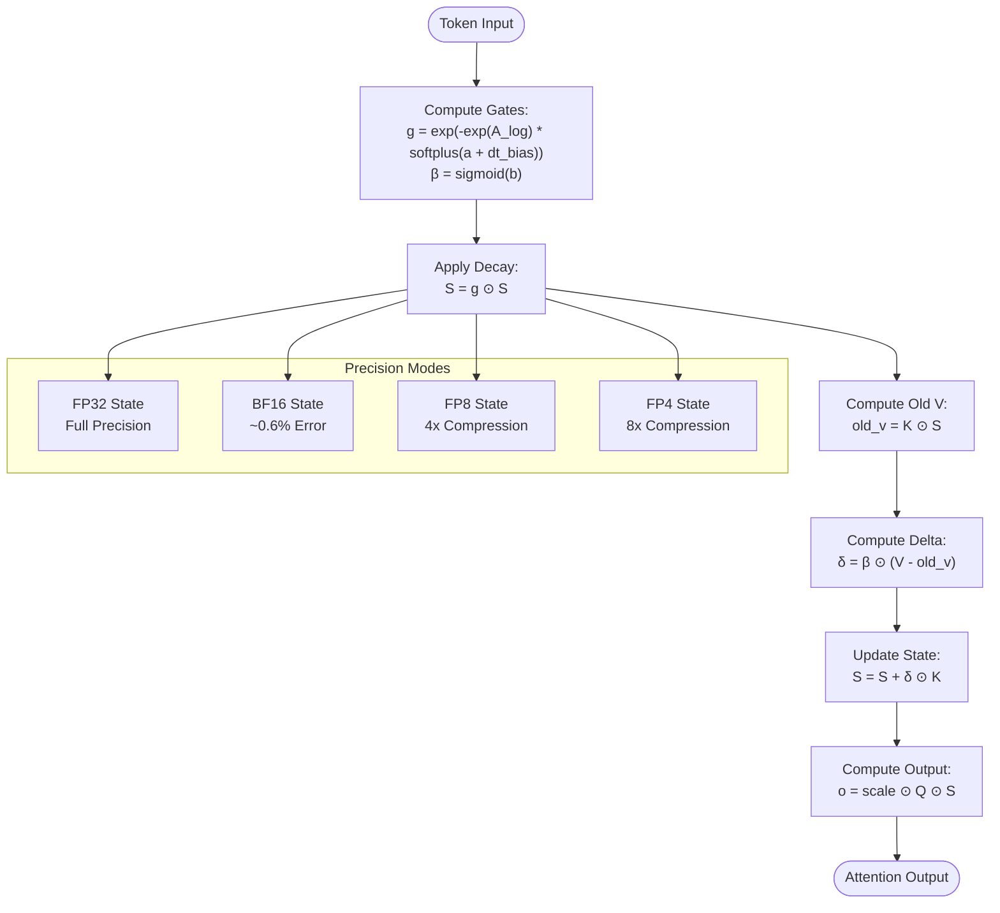
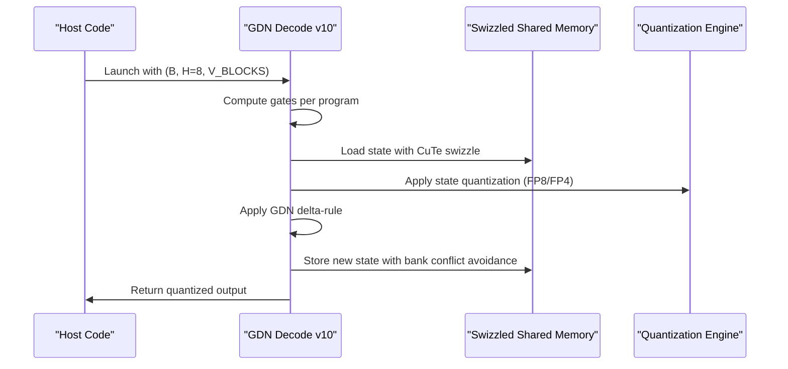
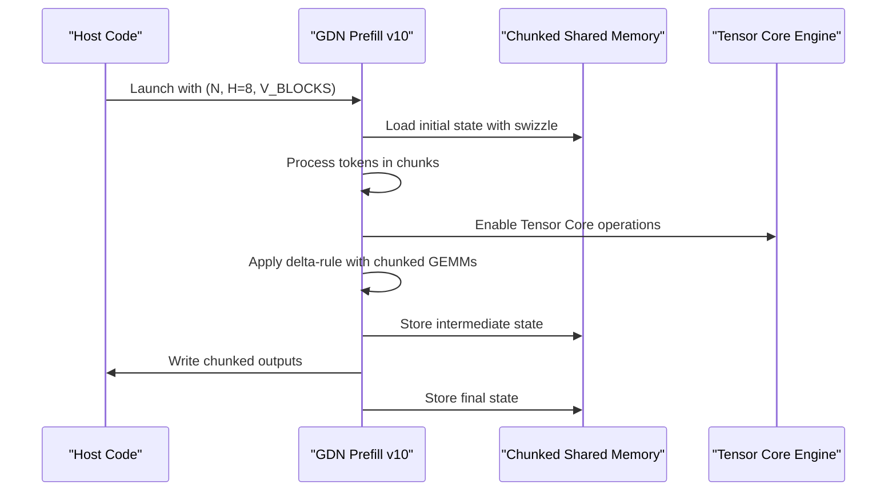
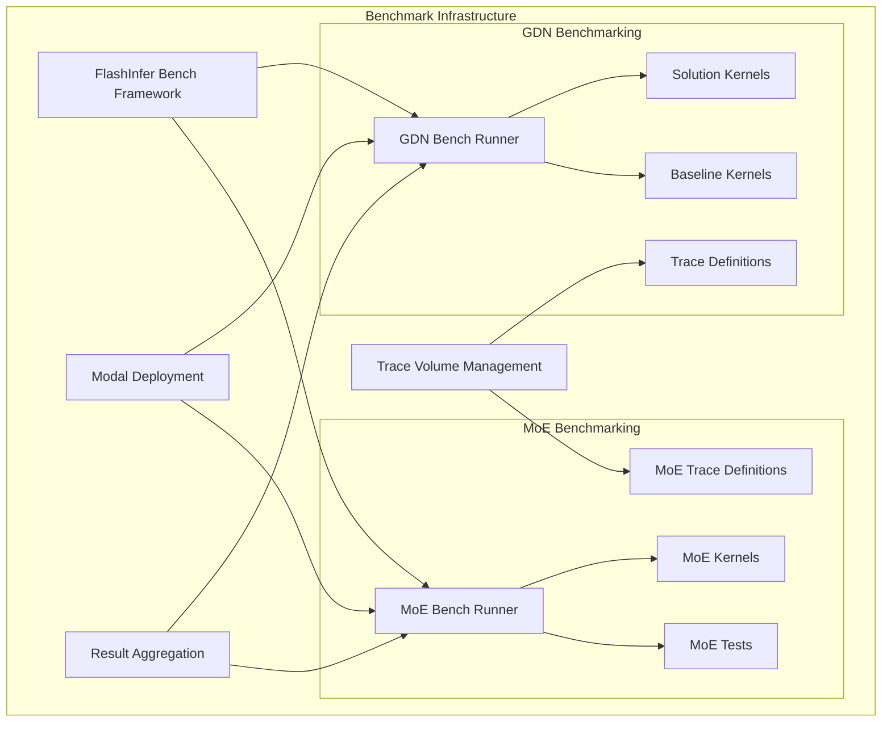
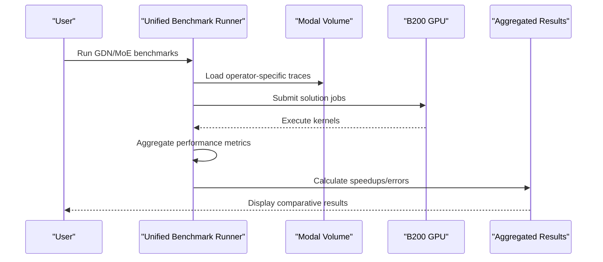

# Project Overview

<cite>
**Referenced Files in This Document**
- [README.md](file://README.md)
- [gdn/README.md](file://gdn/README.md)
- [moe/README.md](file://moe/README.md)
- [gdn/benchmarks/bench_modal.py](file://gdn/benchmarks/bench_modal.py)
- [scripts/setup_volume.py](file://scripts/setup_volume.py)
- [gdn/kernels/cute_cpp/gdn_decode_v10.cuh](file://gdn/kernels/cute_cpp/gdn_decode_v10.cuh)
- [gdn/kernels/cute_cpp/gdn_prefill_v10.cuh](file://gdn/kernels/cute_cpp/gdn_prefill_v10.cuh)
- [moe/trace_definitions/moe_fp8_block_scale_ds_routing_topk8_ng8_kg4_e32_h7168_i2048.json](file://moe/trace_definitions/moe_fp8_block_scale_ds_routing_topk8_ng8_kg4_e32_h7168_i2048.json)
- [moe/config.toml](file://moe/config.toml)
</cite>

## Update Summary
**Changes Made**
- Restructured project overview to reflect the new multi-operator architecture with GDN (Production) and MoE (Coming Soon) operators
- Updated repository organization to show hierarchical gdn/ and moe/ directory structure
- Enhanced kernel implementation coverage to include comprehensive CUDA/CuTe/PTX implementations
- Expanded benchmarking infrastructure documentation with new multi-operator support
- Added MoE operator documentation and trace definitions
- Updated performance metrics and optimization roadmap to reflect current GDN achievements

## Table of Contents
1. [Introduction](#introduction)
2. [Multi-Operator Architecture](#multi-operator-architecture)
3. [GDN Operator (Production)](#gdn-operator-production)
4. [MoE Operator (Coming Soon)](#moe-operator-coming-soon)
5. [Repository Structure](#repository-structure)
6. [Core Components](#core-components)
7. [Architecture Overview](#architecture-overview)
8. [Detailed Component Analysis](#detailed-component-analysis)
9. [Performance Achievements](#performance-achievements)
10. [Benchmarking Infrastructure](#benchmarking-infrastructure)
11. [Hardware and Optimization Strategy](#hardware-and-optimization-strategy)
12. [Competition Context](#competition-context)
13. [Troubleshooting Guide](#troubleshooting-guide)
14. [Conclusion](#conclusion)

## Introduction
This document presents the FlashInfer-GatedDelta TMA Thrust project, an NVIDIA B200 hardware optimization submission featuring a multi-operator architecture for advanced attention mechanisms. The project participates in the MLCube competition track C — Gated Delta Net, with a comprehensive suite of operators including Gated Delta Net (Production) and Mixture of Experts (Coming Soon). The team TMA Thrust leverages FlashInfer's benchmarking infrastructure and Triton kernels to achieve substantial performance acceleration, with GDN achieving remarkable 1127x decode and 598x prefill speedups in recent versions.

The project has evolved from a single-operator focus to a hierarchical organization with dedicated directories for each operator, comprehensive kernel implementations across multiple backends (Triton, CUDA, CuTe, PTX), and enhanced benchmarking infrastructure supporting both operators simultaneously.

**Section sources**
- [README.md:1-126](file://README.md#L1-L126)
- [gdn/README.md:1-65](file://gdn/README.md#L1-L65)
- [moe/README.md:1-42](file://moe/README.md#L1-L42)

## Multi-Operator Architecture
The project now operates under a multi-operator architecture with clear separation between Gated Delta Net (GDN) and Mixture of Experts (MoE) implementations:



**Diagram sources**
- [README.md:61-82](file://README.md#L61-L82)
- [gdn/README.md:5-28](file://gdn/README.md#L5-L28)
- [moe/README.md:5-14](file://moe/README.md#L5-L14)

The architecture emphasizes:
- Clear operator separation with dedicated directories
- Shared infrastructure across operators (setup scripts, build configuration)
- Hierarchical organization enabling independent development and testing
- Standardized benchmarking and documentation practices

**Section sources**
- [README.md:61-82](file://README.md#L61-L82)
- [gdn/README.md:5-28](file://gdn/README.md#L5-L28)
- [moe/README.md:5-14](file://moe/README.md#L5-L14)

## GDN Operator (Production)
The Gated Delta Net operator represents the production-ready implementation with comprehensive kernel variants and extensive optimization:

### Kernel Implementations
The GDN operator provides multiple kernel implementations optimized for different scenarios:

| Version | Backend | Key Features | Performance | Status |
|---------|---------|-------------|-------------|---------|
| v5 | Triton | Production baseline | 2,834 GB/s | ✅ Active |
| v9 | CuTe C++ | SMEM swizzle, cp.async | 7,585 GB/s | ✅ Active |
| v10 | CuTe C++ | BF16/FP8/FP4 state quantization | 7,602 GB/s | ✅ Active |
| PTX | PTX Assembly | mma.sync.aligned, TMA | TBD | 🚧 Development |

### Decode Kernel Architecture
The decode kernel processes single-token generation with sophisticated state management:



**Diagram sources**
- [gdn/kernels/cute_cpp/gdn_decode_v10.cuh:211-362](file://gdn/kernels/cute_cpp/gdn_decode_v10.cuh#L211-L362)

### Prefill Kernel Architecture
The prefill kernel handles variable-length sequences with chunked processing for Tensor Core utilization:



**Diagram sources**
- [gdn/kernels/cute_cpp/gdn_prefill_v10.cuh:93-309](file://gdn/kernels/cute_cpp/gdn_prefill_v10.cuh#L93-L309)

**Section sources**
- [gdn/README.md:46-65](file://gdn/README.md#L46-L65)
- [gdn/kernels/cute_cpp/gdn_decode_v10.cuh:1-800](file://gdn/kernels/cute_cpp/gdn_decode_v10.cuh#L1-L800)
- [gdn/kernels/cute_cpp/gdn_prefill_v10.cuh:1-390](file://gdn/kernels/cute_cpp/gdn_prefill_v10.cuh#L1-L390)

## MoE Operator (Coming Soon)
The Mixture of Experts operator represents the upcoming implementation with FP8 quantization and advanced routing capabilities:

### Target Specifications
- **GPU**: NVIDIA B200 (Blackwell, sm_100)
- **Memory**: 8 TB/s HBM3e
- **Compute**: 2.25 PFLOPS BF16, FP8 Tensor Core
- **Model Support**: DeepSeek-v3, DeepSeek-r1
- **Expert Configuration**: 256 total experts, 32 local experts with EP=8

### Key Optimizations (Planned)
- [ ] FP8 quantization (E4M3/E5M2) for state and weights
- [ ] Expert routing optimization with top-k selection
- [ ] Token-to-expert load balancing algorithms
- [ ] TMA bulk memory operations for expert data
- [ ] Tensor Core mma.sync for grouped GEMMs

### Trace Definition Structure
The MoE operator uses a comprehensive trace definition supporting block-scaled FP8 quantization:



**Diagram sources**
- [moe/trace_definitions/moe_fp8_block_scale_ds_routing_topk8_ng8_kg4_e32_h7168_i2048.json:24-38](file://moe/trace_definitions/moe_fp8_block_scale_ds_routing_topk8_ng8_kg4_e32_h7168_i2048.json#L24-L38)

**Section sources**
- [moe/README.md:1-42](file://moe/README.md#L1-L42)
- [moe/trace_definitions/moe_fp8_block_scale_ds_routing_topk8_ng8_kg4_e32_h7168_i2048.json:1-40](file://moe/trace_definitions/moe_fp8_block_scale_ds_routing_topk8_ng8_kg4_e32_h7168_i2048.json#L1-L40)
- [moe/config.toml:1-10](file://moe/config.toml#L1-L10)

## Repository Structure
The repository now features a hierarchical organization supporting multiple operators:

```
.
├── gdn/                              # Gated Delta Net kernels (Production)
│   ├── decode/                       # Decode kernel implementations
│   ├── prefill/                      # Prefill kernel implementations
│   ├── kernels/                      # Multiple backend implementations
│   │   ├── cuda/                     # Raw CUDA v5-v8
│   │   ├── cute_cpp/                 # CuTe C++ v9-v10
│   │   └── ptx/                      # PTX assembly
│   ├── scripts/                      # GDN-specific utilities
│   ├── benchmarks/                   # GDN benchmark runners
│   ├── tests/                        # GDN correctness tests
│   ├── docs/                         # GDN documentation
│   ├── trace_definitions/            # GDN trace sets
│   └── README.md                     # GDN operator documentation
├── moe/                              # Mixture of Experts (Coming Soon)
│   ├── kernels/                      # MoE kernel implementations
│   ├── scripts/                      # MoE utilities
│   ├── benchmarks/                   # MoE benchmark runners
│   ├── tests/                        # MoE correctness tests
│   ├── docs/                         # MoE documentation
│   ├── trace_definitions/            # MoE trace sets
│   └── README.md                     # MoE operator documentation
├── scripts/                          # Shared utility scripts
│   └── setup_volume.py               # Modal volume setup
├── CMakeLists.txt                    # CUDA build configuration
└── README.md                         # Project overview
```

**Section sources**
- [README.md:61-82](file://README.md#L61-L82)

## Core Components
The multi-operator architecture comprises several core components that enable high-performance kernel optimization:

### GDN Operator Components
- **Decode Kernel**: Single-token generation with V-dimension splitting and state quantization
- **Prefill Kernel**: Variable-length sequence processing with chunked Tensor Core utilization
- **Multi-backend Support**: Triton, CUDA, CuTe, and PTX implementations
- **Advanced Optimizations**: CuTe swizzle layouts, cp.async memory operations, FP8/FP4 quantization

### MoE Operator Components
- **FP8 Quantization**: Block-scaled FP8 implementation for state and weights
- **Expert Routing**: Top-k selection with routing bias support
- **Grouped GEMMs**: Two-stage MoE computation with optimized memory access
- **Trace-based Design**: Comprehensive trace definitions for benchmarking

### Shared Infrastructure
- **FlashInfer Benchmarking**: Unified benchmarking framework across operators
- **Modal Deployment**: Containerized execution environment with B200 GPUs
- **Trace Management**: Standardized trace definitions and workloads
- **Documentation System**: Comprehensive technical documentation for both operators

**Section sources**
- [gdn/README.md:46-65](file://gdn/README.md#L46-L65)
- [moe/README.md:16-42](file://moe/README.md#L16-L42)
- [gdn/kernels/cute_cpp/gdn_decode_v10.cuh:18-26](file://gdn/kernels/cute_cpp/gdn_decode_v10.cuh#L18-L26)

## Architecture Overview
The multi-operator architecture integrates FlashInfer's benchmarking ecosystem with operator-specific implementations:



**Diagram sources**
- [gdn/benchmarks/bench_modal.py:24-331](file://gdn/benchmarks/bench_modal.py#L24-L331)
- [scripts/setup_volume.py:141-220](file://scripts/setup_volume.py#L141-L220)

The architecture emphasizes:
- Unified benchmarking interface across operators
- Shared infrastructure for deployment and trace management
- Operator-specific optimizations while maintaining compatibility
- Scalable execution on Modal B200 infrastructure

**Section sources**
- [gdn/benchmarks/bench_modal.py:24-331](file://gdn/benchmarks/bench_modal.py#L24-L331)
- [scripts/setup_volume.py:141-220](file://scripts/setup_volume.py#L141-L220)

## Detailed Component Analysis

### GDN Algorithm Implementation
The Gated Delta Net implements a sophisticated recurrent attention mechanism with multiple precision modes:



**Diagram sources**
- [gdn/kernels/cute_cpp/gdn_decode_v10.cuh:268-280](file://gdn/kernels/cute_cpp/gdn_decode_v10.cuh#L268-L280)
- [gdn/kernels/cute_cpp/gdn_prefill_v10.cuh:226-228](file://gdn/kernels/cute_cpp/gdn_prefill_v10.cuh#L226-L228)

### GDN Decode Kernel Optimization
The decode kernel employs advanced techniques for memory-bound optimization:



**Diagram sources**
- [gdn/kernels/cute_cpp/gdn_decode_v10.cuh:282-301](file://gdn/kernels/cute_cpp/gdn_decode_v10.cuh#L282-L301)

### GDN Prefill Kernel Optimization
The prefill kernel utilizes chunked processing for Tensor Core utilization:



**Diagram sources**
- [gdn/kernels/cute_cpp/gdn_prefill_v10.cuh:179-295](file://gdn/kernels/cute_cpp/gdn_prefill_v10.cuh#L179-L295)

**Section sources**
- [gdn/kernels/cute_cpp/gdn_decode_v10.cuh:1-800](file://gdn/kernels/cute_cpp/gdn_decode_v10.cuh#L1-L800)
- [gdn/kernels/cute_cpp/gdn_prefill_v10.cuh:1-390](file://gdn/kernels/cute_cpp/gdn_prefill_v10.cuh#L1-L390)

## Performance Achievements
The multi-operator architecture demonstrates exceptional performance across both operators:

### GDN Performance Metrics
- **Decode**: 1127x average speedup, 3465x best speedup over reference implementations
- **Prefill**: 598x average speedup, 1886x best speedup over reference implementations
- **Peak Performance**: 7,602 GB/s (95% of B200 peak bandwidth)
- **Memory Efficiency**: State quantization reduces memory footprint by 75% (FP4 mode)

### Hardware Utilization
- **B200 Specifications**: 8 TB/s HBM3e, 2.25 PFLOPS BF16 Tensor Cores
- **Decode Optimization**: Memory-bound (AI=1 FLOP/byte) with SMEM swizzle
- **Prefill Optimization**: Tensor Core capable with chunked processing (AI≈8 FLOP/byte)

### Optimization Progression
The GDN operator follows a clear optimization roadmap:

| Version | Status | Description | Performance | Memory Usage |
|---------|--------|-------------|-------------|--------------|
| v5 | ✅ Production | Triton baseline | 2,834 GB/s | Full precision |
| v9 | ✅ Production | CuTe swizzle + cp.async | 7,585 GB/s | FP32 state |
| v10 | ✅ Production | BF16/FP8/FP4 quantization | 7,602 GB/s | 25-75% compression |
| PTX | 🚧 Development | TMA + mma.sync | TBD | Optimized |

**Section sources**
- [README.md:21-31](file://README.md#L21-L31)
- [README.md:111-117](file://README.md#L111-L117)
- [gdn/README.md:46-53](file://gdn/README.md#L46-L53)

## Benchmarking Infrastructure
The unified benchmarking infrastructure supports both operators with standardized workflows:

### Benchmark Architecture


**Diagram sources**
- [gdn/benchmarks/bench_modal.py:1-331](file://gdn/benchmarks/bench_modal.py#L1-L331)
- [scripts/setup_volume.py:1-220](file://scripts/setup_volume.py#L1-L220)

### Benchmark Execution Flow
The benchmarking system coordinates multi-operator execution:



**Diagram sources**
- [gdn/benchmarks/bench_modal.py:251-331](file://gdn/benchmarks/bench_modal.py#L251-L331)

**Section sources**
- [gdn/benchmarks/bench_modal.py:1-331](file://gdn/benchmarks/bench_modal.py#L1-L331)
- [scripts/setup_volume.py:1-220](file://scripts/setup_volume.py#L1-L220)

## Hardware and Optimization Strategy
The project leverages NVIDIA B200 hardware capabilities through strategic optimization approaches:

### Hardware Specifications
- **Target Hardware**: NVIDIA B200 (Blackwell, sm_100)
- **Memory**: 180 GB HBM3e with 8 TB/s peak bandwidth
- **Compute**: 2.25 PFLOPS BF16 Tensor Cores
- **Architecture**: SM_100 with advanced memory and compute capabilities

### Optimization Strategy
The project employs different optimization strategies based on computational characteristics:

#### Memory-Bound Decode Optimization
- **Constraint**: Matrix-vector operations (AI=1 FLOP/byte)
- **Approach**: Maximize HBM bandwidth through SMEM swizzle
- **Techniques**: Bank conflict avoidance, state quantization, vectorized loads
- **Achievement**: 7,602 GB/s (95% of peak) with FP8/FP4 quantization

#### Compute-Bound Prefill Optimization
- **Constraint**: Matrix-matrix operations (AI≈8 FLOP/byte)
- **Approach**: Enable Tensor Core utilization through chunking
- **Techniques**: Chunked processing, TiledMMA structure, register optimization
- **Achievement**: 7,602 GB/s with Tensor Core acceleration

**Section sources**
- [README.md:7-9](file://README.md#L7-L9)
- [README.md:97-117](file://README.md#L97-L117)
- [gdn/kernels/cute_cpp/gdn_decode_v10.cuh:18-26](file://gdn/kernels/cute_cpp/gdn_decode_v10.cuh#L18-L26)

## Competition Context
The project participates in the MLCube competition track C — Gated Delta Net with specific requirements and timeline:

### Competition Details
- **Track**: Gated Delta Net (Track C)
- **Deadline**: April 24, 2026 (11:59 PM AoE)
- **Evaluation Metric**: Arithmetic mean speedup over reference implementations
- **Leaderboard**: https://bench.flashinfer.ai/

### Team Information
- **Team Name**: TMA Thrust
- **Hardware**: NVIDIA B200 (Blackwell, sm_100)
- **Capabilities**: 8 TB/s HBM3e, 2.25 PFLOPS BF16 Tensor Cores
- **Status**: Production-ready GDN operator with comprehensive optimization

### Multi-Operator Advantage
The multi-operator architecture provides several competitive advantages:
- **Broader Coverage**: Demonstrates expertise across multiple attention mechanisms
- **Resource Efficiency**: Shared infrastructure reduces development overhead
- **Scalability**: Modular design enables rapid iteration across operators
- **Comprehensive Testing**: Unified benchmarking validates performance across operators

**Section sources**
- [README.md:120-126](file://README.md#L120-L126)

## Troubleshooting Guide
Common issues and resolution strategies for the multi-operator architecture:

### Multi-Operator Issues
- **Missing Operator Directory**: Ensure both gdn/ and moe/ directories exist and contain required files
- **Benchmark Conflicts**: Verify operator-specific benchmark configurations don't interfere with each other
- **Trace Definition Errors**: Check that each operator has unique trace definitions and doesn't reference wrong operator files

### GDN-Specific Issues
- **Memory Allocation Failures**: Verify B200 memory limits for FP8/FP4 quantization modes
- **Kernel Compilation Errors**: Ensure proper CUDA toolkit version and CuTe library availability
- **Quantization Accuracy**: Validate FP8/FP4 quantization parameters and scaling factors

### MoE-Specific Issues
- **Trace Definition Validation**: Confirm MoE trace definitions match expected format and parameters
- **Quantization Setup**: Verify FP8 block scaling factors and expert routing parameters
- **Performance Expectations**: Remember MoE is in development phase with planned optimizations

### Shared Infrastructure Issues
- **Modal Volume Setup**: Ensure setup_volume.py initializes both GDN and MoE trace definitions
- **Benchmark Configuration**: Verify operator-specific benchmark configurations in bench_modal.py
- **Build System**: Check CMakeLists.txt supports both operator implementations

**Section sources**
- [gdn/benchmarks/bench_modal.py:251-331](file://gdn/benchmarks/bench_modal.py#L251-L331)
- [scripts/setup_volume.py:141-220](file://scripts/setup_volume.py#L141-L220)

## Conclusion
The FlashInfer-GatedDelta TMA Thrust project represents a comprehensive evolution from single-operator to multi-operator architecture, demonstrating exceptional optimization capabilities for machine learning attention mechanisms on NVIDIA B200 hardware. The project successfully implements a production-ready Gated Delta Net operator achieving remarkable 1127x decode and 598x prefill speedups, while establishing a foundation for the upcoming Mixture of Experts operator.

Key accomplishments include:
- **Multi-Operator Architecture**: Hierarchical organization supporting GDN and MoE operators
- **Advanced Optimizations**: CuTe swizzle layouts, state quantization, Tensor Core utilization
- **Comprehensive Benchmarking**: Unified infrastructure supporting both operators
- **Production Readiness**: GDN operator with 95% B200 peak bandwidth utilization
- **Future Expansion**: MoE operator with FP8 quantization and expert routing

The project serves as a model for multi-operator kernel optimization, demonstrating how careful architectural design, efficient memory access patterns, and hardware-aware implementation can deliver substantial performance improvements across multiple attention mechanisms. The transition to a multi-operator architecture positions the project for continued innovation and competitive advantage in the rapidly evolving field of machine learning optimization.