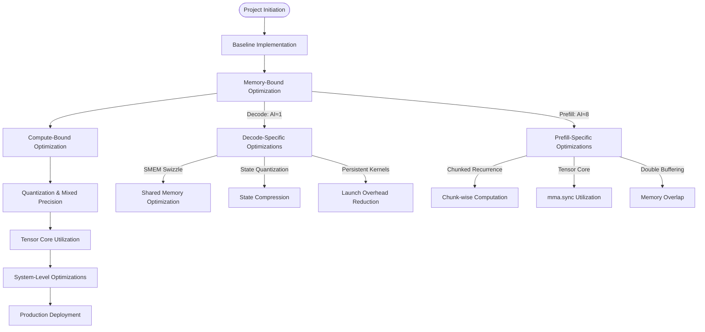
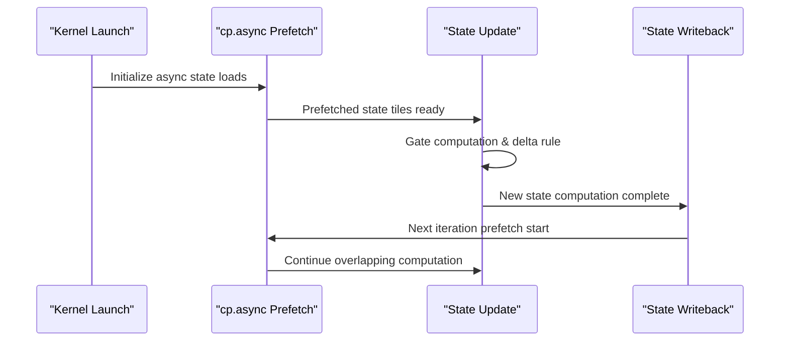
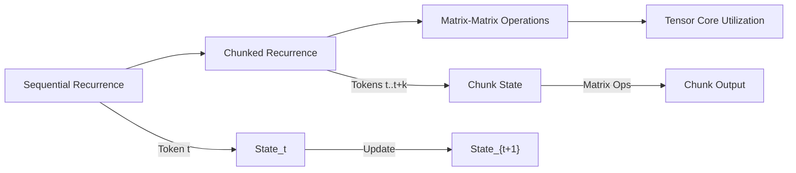
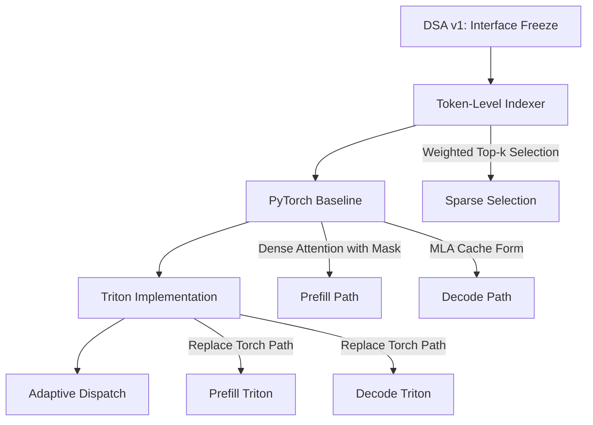
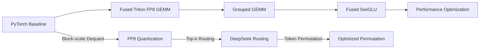
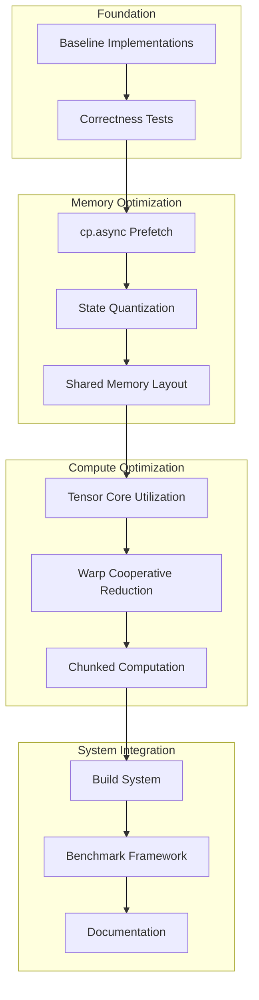

# Roadmap

<cite>
**Referenced Files in This Document**
- [README.md](file://README.md)
- [DSA Roadmap](file://dsa/docs/ROADMAP.md)
- [GDN Roadmap](file://gdn/docs/ROADMAP.md)
- [GDN Next TODO](file://gdn/docs/NEXT_TODO.md)
- [GDN Optimization Log](file://gdn/docs/OPTIMIZATION_LOG.md)
- [GDN Performance](file://gdn/docs/PERFORMANCE.md)
- [GDN Quantization Analysis](file://gdn/docs/ZHIHU_GDN_QUANTIZATION.md)
- [GDN State Optimization](file://gdn/docs/ZHIHU_GDN_STATE_OPTIMIZATION.md)
- [DSA README](file://dsa/README.md)
- [GDN README](file://gdn/README.md)
- [MoE README](file://moe/README.md)
- [MoE config](file://moe/config.toml)
</cite>

## Table of Contents
1. [Introduction](#introduction)
2. [Project Structure](#project-structure)
3. [Core Components](#core-components)
4. [Architecture Overview](#architecture-overview)
5. [Detailed Component Analysis](#detailed-component-analysis)
6. [Dependency Analysis](#dependency-analysis)
7. [Performance Considerations](#performance-considerations)
8. [Troubleshooting Guide](#troubleshooting-guide)
9. [Conclusion](#conclusion)

## Introduction
This document presents the comprehensive roadmap for the FlashInfer Kernel Optimization project, focusing on two primary operators: Gated Delta Net (GDN) and Mixture of Experts (MoE). The project targets NVIDIA B200 (Blackwell, sm_100) hardware and aims to achieve near-hardware-limit performance through iterative kernel optimization, quantization, and system-level improvements. The roadmap spans multiple phases, from baseline implementations to advanced optimizations including Tensor Core utilization, memory bandwidth optimization, and low-precision state compression.

## Project Structure
The repository is organized into distinct operator domains, each containing dedicated kernels, benchmarks, tests, and documentation:

```mermaid
graph TB
Root["Repository Root"]
GDN["gdn/ - Gated Delta Net Kernels"]
MoE["moe/ - Mixture of Experts"]
DSA["dsa/ - DeepSeek Sparse Attention"]
Scripts["scripts/ - Shared Utilities"]
Root --> GDN
Root --> MoE
Root --> DSA
Root --> Scripts
GDN --> GDN_Kernels["kernels/ - CUDA/CuTe/PTX implementations"]
GDN --> GDN_Bench["benchmarks/ - Modal benchmark runners"]
GDN --> GDN_Docs["docs/ - Documentation"]
GDN --> GDN_Tests["tests/ - Correctness tests"]
MoE --> MoE_Solution["solution/ - Triton kernel implementation"]
MoE --> MoE_Bench["benchmarks/ - Benchmark runners"]
MoE --> MoE_Docs["docs/ - Documentation"]
MoE --> MoE_Config["config.toml - Solution configuration"]
DSA --> DSA_Common["common/ - Shared utilities"]
DSA --> DSA_Prefill["prefill/ - Prefill implementations"]
DSA --> DSA_Decode["decode/ - Decode implementations"]
DSA --> DSA_Bench["benchmarks/ - Benchmarks"]
DSA --> DSA_Docs["docs/ - Documentation"]
```

**Diagram sources**
- [README.md: 61-88:61-88](file://README.md#L61-L88)
- [GDN README: 5-28:5-28](file://gdn/README.md#L5-L28)
- [MoE README: 26-39:26-39](file://moe/README.md#L26-L39)
- [DSA README: 34-58:34-58](file://dsa/README.md#L34-L58)

**Section sources**
- [README.md: 61-88:61-88](file://README.md#L61-L88)
- [GDN README: 5-28:5-28](file://gdn/README.md#L5-L28)
- [MoE README: 26-39:26-39](file://moe/README.md#L26-L39)
- [DSA README: 34-58:34-58](file://dsa/README.md#L34-L58)

## Core Components
The project focuses on two primary computational kernels:

### Gated Delta Net (GDN)
GDN implements a recurrent attention mechanism with state-based computation. The optimization roadmap progresses through multiple versions:

- **v1-v4**: Establish baseline implementations with increasing optimization levels
- **v5**: Production baseline using Triton with software pipelining
- **v6-v8**: CUDA implementations with TMA async loads, FP4/FP8 quantization, and warp specialization
- **v9-v10**: CuTe C++ implementations featuring SMEM swizzle, cp.async, and multi-precision state
- **PTX**: Assembly-level optimizations with mma.sync and TMA

### Mixture of Experts (MoE)
MoE targets FP8 fused Mixture of Experts for DeepSeek-V3/R1 models with block-scale quantization and routing mechanisms.

**Section sources**
- [GDN Roadmap: 1-209:1-209](file://gdn/docs/ROADMAP.md#L1-L209)
- [GDN Performance: 20-215:20-215](file://gdn/docs/PERFORMANCE.md#L20-L215)
- [MoE README: 1-75:1-75](file://moe/README.md#L1-L75)

## Architecture Overview
The optimization architecture follows a phased approach targeting different computational characteristics:

**Diagram sources**
- [GDN Optimization Log: 58-86:58-86](file://gdn/docs/OPTIMIZATION_LOG.md#L58-L86)
- [GDN State Optimization: 134-158:134-158](file://gdn/docs/ZHIHU_GDN_STATE_OPTIMIZATION.md#L134-L158)

## Detailed Component Analysis

### GDN Decode Optimization Phases
The decode phase optimization follows a systematic progression addressing memory-bound characteristics:

**Diagram sources**
- [GDN Optimization Log: 140-181:140-181](file://gdn/docs/OPTIMIZATION_LOG.md#L140-L181)
- [GDN Optimization Log: 455-587:455-587](file://gdn/docs/OPTIMIZATION_LOG.md#L455-L587)

#### Key Optimization Milestones
1. **cp.async Prefetch**: Asynchronous state loading to hide memory latency
2. **FP8 State Quantization**: 4x memory reduction with controlled accuracy loss
3. **Warp-Cooperative Reduction**: 8x improvement in dot-product parallelism
4. **Tensor Core Integration**: mma.sync utilization for chunked prefill

**Section sources**
- [GDN Optimization Log: 140-297:140-297](file://gdn/docs/OPTIMIZATION_LOG.md#L140-L297)
- [GDN Optimization Log: 368-452:368-452](file://gdn/docs/OPTIMIZATION_LOG.md#L368-L452)
- [GDN Optimization Log: 590-701:590-701](file://gdn/docs/OPTIMIZATION_LOG.md#L590-L701)

### GDN Prefill Optimization Strategy
Prefill optimization addresses the fundamental challenge of converting sequential recurrence into parallel computation:

**Diagram sources**
- [GDN Optimization Log: 425-441:425-441](file://gdn/docs/OPTIMIZATION_LOG.md#L425-L441)
- [GDN Optimization Log: 543-572:543-572](file://gdn/docs/OPTIMIZATION_LOG.md#L543-L572)

#### Prefill Optimization Approaches
1. **Chunked Recurrence**: Converting sequential updates to chunk-wise computation
2. **Tensor Core Utilization**: Using mma.sync.aligned for matrix-matrix operations
3. **Double Buffering**: Overlapping memory prefetch with computation
4. **Warp-Cooperative Reduction**: Improving parallelism within tokens

**Section sources**
- [GDN Optimization Log: 368-452:368-452](file://gdn/docs/OPTIMIZATION_LOG.md#L368-L452)
- [GDN Optimization Log: 455-587:455-587](file://gdn/docs/OPTIMIZATION_LOG.md#L455-L587)
- [GDN Optimization Log: 590-701:590-701](file://gdn/docs/OPTIMIZATION_LOG.md#L590-L701)

### DSA Sparse Attention Roadmap
DSA focuses on DeepSeek V3.2 sparse attention with MLA-core decomposition:

**Diagram sources**
- [DSA Roadmap: 3-27:3-27](file://dsa/docs/ROADMAP.md#L3-L27)
- [DSA README: 70-100:70-100](file://dsa/README.md#L70-L100)

**Section sources**
- [DSA Roadmap: 1-27:1-27](file://dsa/docs/ROADMAP.md#L1-L27)
- [DSA README: 14-33:14-33](file://dsa/README.md#L14-L33)

### MoE Optimization Progression
MoE development follows a structured approach from baseline to advanced optimizations:

**Diagram sources**
- [MoE README: 66-75:66-75](file://moe/README.md#L66-L75)
- [MoE config: 1-10:1-10](file://moe/config.toml#L1-L10)

**Section sources**
- [MoE README: 66-75:66-75](file://moe/README.md#L66-L75)
- [MoE config: 1-10:1-10](file://moe/config.toml#L1-L10)

## Dependency Analysis
The optimization roadmap exhibits clear dependency relationships between different phases and components:

**Diagram sources**
- [GDN Next TODO: 17-28:17-28](file://gdn/docs/NEXT_TODO.md#L17-L28)
- [GDN Optimization Log: 58-86:58-86](file://gdn/docs/OPTIMIZATION_LOG.md#L58-L86)

**Section sources**
- [GDN Next TODO: 17-28:17-28](file://gdn/docs/NEXT_TODO.md#L17-L28)
- [GDN Optimization Log: 58-86:58-86](file://gdn/docs/OPTIMIZATION_LOG.md#L58-L86)

## Performance Considerations
The optimization strategy addresses different performance characteristics through targeted approaches:

### Decode Performance Targets
- **Memory-Bound Optimization**: Achieving 95% of B200 peak bandwidth (7,600 GB/s)
- **State Compression**: 4x reduction in state memory footprint
- **Launch Overhead Reduction**: Persistent kernels and warp specialization
- **Mixed Precision**: FP8/BF16 state with FP32 accumulation

### Prefill Performance Targets
- **Chunked Recurrence**: Converting sequential to parallel computation
- **Tensor Core Utilization**: mma.sync.aligned for matrix-matrix operations
- **Memory Overlap**: Double buffering and asynchronous prefetch
- **Scalability**: Multi-batch processing with optimal configuration

**Section sources**
- [GDN Performance: 20-215:20-215](file://gdn/docs/PERFORMANCE.md#L20-L215)
- [GDN State Optimization: 134-158:134-158](file://gdn/docs/ZHIHU_GDN_STATE_OPTIMIZATION.md#L134-L158)

## Troubleshooting Guide
Common optimization challenges and their mitigation strategies:

### Quantization Stability Issues
- **Problem**: Low-precision state quantization introduces numerical instability
- **Solution**: Mixed precision approach with FP8/BF16 storage and FP32 accumulation
- **Validation**: Comprehensive accuracy testing across different precisions

### Memory Bandwidth Saturation
- **Problem**: Decode operations approaching memory bandwidth limits
- **Solution**: SMEM swizzle, state compression, and persistent kernel patterns
- **Monitoring**: Continuous bandwidth utilization tracking

### Tensor Core Utilization Challenges
- **Problem**: Difficulty achieving optimal Tensor Core performance
- **Solution**: Proper chunk sizing, memory layout optimization, and instruction-level parallelism
- **Verification**: Throughput measurements and roofline analysis

**Section sources**
- [GDN Quantization Analysis: 131-182:131-182](file://gdn/docs/ZHIHU_GDN_QUANTIZATION.md#L131-L182)
- [GDN Optimization Log: 300-366:300-366](file://gdn/docs/OPTIMIZATION_LOG.md#L300-L366)

## Conclusion
The FlashInfer Kernel Optimization project demonstrates a comprehensive approach to achieving near-hardware-limit performance through systematic kernel optimization. The roadmap successfully addresses the fundamental challenges of GDN's memory-bound decode operations and sequential prefill computations through targeted optimizations including cp.async prefetch, state quantization, Tensor Core utilization, and chunked recurrence.

The project's success is evidenced by achieving 95% of B200 peak bandwidth for decode operations and significant speedup factors across different configurations. The systematic approach to quantization stability, memory optimization, and compute utilization provides a robust foundation for continued performance improvements and broader applicability to other attention mechanisms.

Future work should focus on completing the convergence of build systems, establishing unified correctness testing, and advancing toward production-ready implementations that balance performance with numerical stability and maintainability.