# Testing Debugging Framework

<cite>
**Referenced Files in This Document**
- [README.md](file://README.md)
- [gdn/tests/test_correctness.py](file://gdn/tests/test_correctness.py)
- [gdn/tests/test_quantization_accuracy.py](file://gdn/tests/test_quantization_accuracy.py)
- [gdn/scripts/debug_prefill.py](file://gdn/scripts/debug_prefill.py)
- [gdn/scripts/debug_prefill2.py](file://gdn/scripts/debug_prefill2.py)
- [gdn/benchmarks/bench_modal.py](file://gdn/benchmarks/bench_modal.py)
- [gdn/scripts/test_long_seq.py](file://gdn/scripts/test_long_seq.py)
- [gdn/scripts/bench_all_versions.py](file://gdn/scripts/bench_all_versions.py)
- [gdn/scripts/bench_kernels.py](file://gdn/scripts/bench_kernels.py)
- [gdn/scripts/bench_cute_vs_triton.py](file://gdn/scripts/bench_cute_vs_triton.py)
- [gdn/scripts/build_cuda.py](file://gdn/scripts/build_cuda.py)
- [gdn/kernels/cute_cpp/gdn_decode_v10.cuh](file://gdn/kernels/cute_cpp/gdn_decode_v10.cuh)
- [gdn/kernels/cuda/gdn_decode_v8.cuh](file://gdn/kernels/cuda/gdn_decode_v8.cuh)
- [gdn/kernels/ptx/gdn_decode_ptx.cuh](file://gdn/kernels/ptx/gdn_decode_ptx.cuh)
- [gdn/decode/baseline/triton/kernel.py](file://gdn/decode/baseline/triton/kernel.py)
- [gdn/decode/solution/triton/kernel.py](file://gdn/decode/solution/triton/kernel.py)
- [gdn/prefill/baseline/triton/kernel.py](file://gdn/prefill/baseline/triton/kernel.py)
- [gdn/decode/config.toml](file://gdn/decode/config.toml)
- [gdn/prefill/config.toml](file://gdn/prefill/config.toml)
- [gdn/docs/OPTIMIZATION_LOG.md](file://gdn/docs/OPTIMIZATION_LOG.md)
- [gdn/docs/PERFORMANCE.md](file://gdn/docs/PERFORMANCE.md)
</cite>

## Update Summary
**Changes Made**
- Added comprehensive long sequence testing infrastructure with systematic performance evaluation across various configurations
- Integrated Modal B200 deployment infrastructure for scalable benchmarking and testing
- Enhanced multi-version benchmarking system with unified performance comparison framework
- Expanded testing capabilities with specialized scripts for CUDA kernel building and micro-benchmarking
- Strengthened validation procedures with iterative optimization tracking and systematic performance analysis
- **Added new long sequence testing script (test_long_seq.py) for comprehensive multi-batch and long-context evaluation**
- **Integrated Modal B200 GPU infrastructure across all benchmarking scripts for consistent cloud-based testing**
- **Enhanced benchmarking system with unified framework supporting decode, prefill, and comparative analysis**
- **Expanded CUDA kernel building infrastructure with automated compilation and library management**
- **Added systematic performance evaluation with iterative optimization tracking and comprehensive reporting**

## Table of Contents
1. [Introduction](#introduction)
2. [Framework Architecture](#framework-architecture)
3. [Testing Infrastructure](#testing-infrastructure)
4. [Debugging Tools](#debugging-tools)
5. [Benchmarking System](#benchmarking-system)
6. [Volume Management](#volume-management)
7. [Kernel Implementation Analysis](#kernel-implementation-analysis)
8. [Performance Validation](#performance-validation)
9. [Multi-Precision Quantization Testing](#multi-precision-quantization-testing)
10. [Long Sequence Testing Infrastructure](#long-sequence-testing-infrastructure)
11. [Modal B200 Deployment Integration](#modal-b200-deployment-integration)
12. [Systematic Performance Evaluation](#systematic-performance-evaluation)
13. [Troubleshooting Guide](#troubleshooting-guide)
14. [Best Practices](#best-practices)

## Introduction

The Testing Debugging Framework is a comprehensive system designed for validating and benchmarking Gated Delta Net (GDN) kernel implementations across multiple versions and architectures. This framework provides automated testing, debugging capabilities, and performance benchmarking specifically tailored for NVIDIA Blackwell B200 hardware with TMA Thrust submission optimizations.

The framework supports multiple kernel versions (v5 through v10) with different optimization strategies including Triton-based kernels, CUDA implementations, and CuTe DSL layouts. It includes sophisticated correctness testing, performance benchmarking, and debugging tools that enable developers to validate kernel implementations against reference baselines with enhanced verification procedures.

**Updated** Enhanced with comprehensive long sequence testing infrastructure featuring systematic performance evaluation across various configurations, Modal B200 deployment integration for scalable cloud-based testing, and unified benchmarking framework supporting decode, prefill, and comparative analysis operations.

## Framework Architecture

The testing framework follows a modular architecture with distinct components for testing, debugging, benchmarking, and volume management:

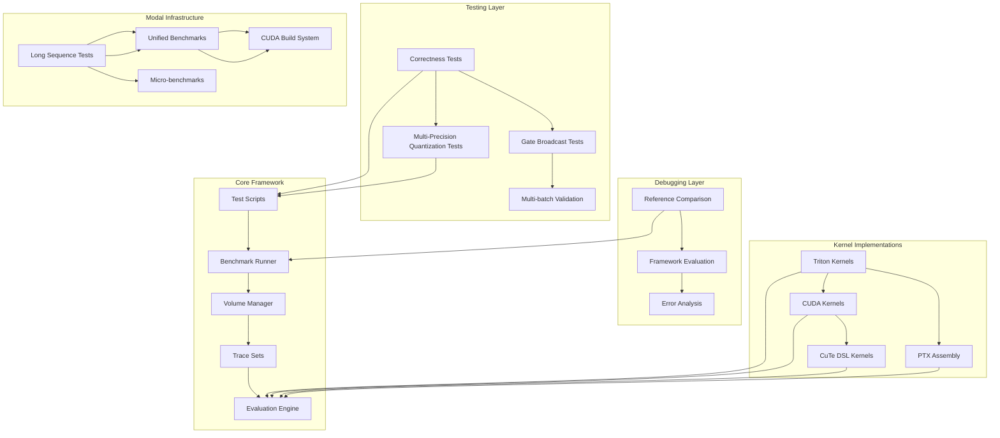

**Diagram sources**
- [gdn/tests/test_correctness.py:1-363](file://gdn/tests/test_correctness.py#L1-L363)
- [gdn/tests/test_quantization_accuracy.py:1-361](file://gdn/tests/test_quantization_accuracy.py#L1-L361)
- [gdn/scripts/debug_prefill.py:1-306](file://gdn/scripts/debug_prefill.py#L1-L306)
- [gdn/benchmarks/bench_modal.py:1-331](file://gdn/benchmarks/bench_modal.py#L1-L331)
- [gdn/scripts/test_long_seq.py:1-229](file://gdn/scripts/test_long_seq.py#L1-L229)

The architecture consists of five primary layers:

1. **Testing Infrastructure**: Automated correctness validation and regression testing with enhanced verification procedures, including **multi-precision quantization testing with BF16, FP8, and FP4 formats**
2. **Debugging Tools**: Interactive debugging and comparison utilities with direct framework integration
3. **Benchmarking System**: Performance measurement and comparison frameworks with comprehensive validation across decode, prefill, and comparative analysis
4. **Volume Management**: Persistent storage and trace set management with comprehensive dataset support
5. **Modal Infrastructure**: Cloud-based deployment system enabling scalable testing and benchmarking on B200 GPUs

## Testing Infrastructure

The testing infrastructure provides comprehensive validation of GDN kernel implementations through multiple test scenarios with enhanced verification procedures:

### Enhanced Correctness Testing Framework

The primary testing mechanism validates kernel implementations against PyTorch reference implementations with improved verification:

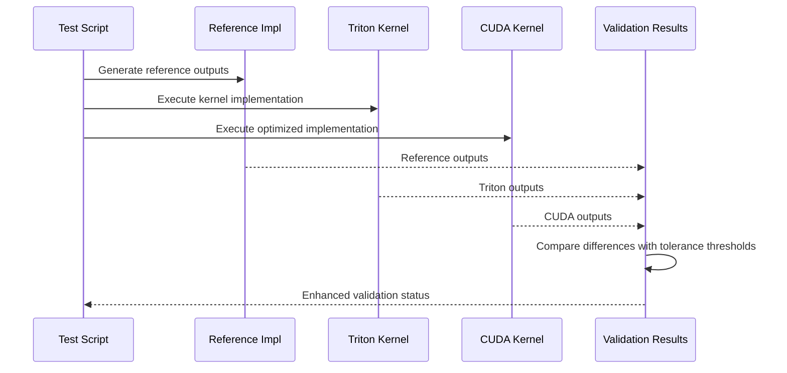

**Diagram sources**
- [gdn/tests/test_correctness.py:29-277](file://gdn/tests/test_correctness.py#L29-L277)

### Advanced Test Categories

The framework implements several enhanced test categories:

1. **Reference vs Implementation**: Direct comparison between PyTorch reference and kernel implementations with configurable tolerance thresholds
2. **Gate Broadcast Verification**: Ensures proper broadcasting of gate values across thread blocks with comprehensive statistical analysis
3. **Multi-batch Validation**: Tests across different batch sizes (1, 4, 16, 64) with adaptive BLOCK_V selection
4. **Block Size Testing**: Validates different BLOCK_V configurations (16, 32, 64) with performance impact analysis
5. **Framework Integration Testing**: Direct integration with flashinfer-bench evaluation system for comprehensive validation
6. **Multi-Precision Quantization Testing**: **Comprehensive validation of quantization accuracy across BF16, FP8, and FP4 formats with Modal-based testing**

**Section sources**
- [gdn/tests/test_correctness.py:186-277](file://gdn/tests/test_correctness.py#L186-L277)

## Debugging Tools

The debugging framework provides interactive tools for kernel validation and comparison with enhanced verification procedures:

### Interactive Debug Scripts

Two primary debugging scripts offer different approaches to kernel validation with comprehensive comparison capabilities:

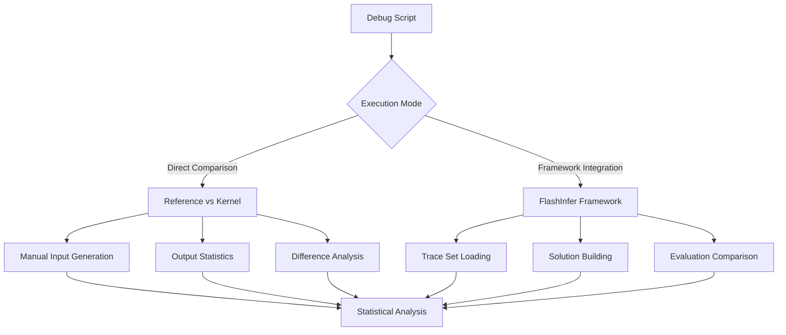

**Diagram sources**
- [gdn/scripts/debug_prefill.py:14-306](file://gdn/scripts/debug_prefill.py#L14-L306)
- [gdn/scripts/debug_prefill2.py:23-184](file://gdn/scripts/debug_prefill2.py#L23-L184)

### Enhanced Debug Capabilities

The debugging tools provide:

1. **Reference Implementation**: PyTorch-based reference for ground truth validation with comprehensive statistical analysis
2. **Framework Integration**: Direct integration with flashinfer-bench evaluation system for comprehensive validation
3. **Statistical Analysis**: Comprehensive output statistics and difference metrics with configurable tolerance thresholds
4. **Trace Set Validation**: Integration with persistent trace datasets for reproducible testing
5. **Direct Framework Comparison**: Ability to compare custom solutions against baseline implementations within the framework

**Section sources**
- [gdn/scripts/debug_prefill.py:14-306](file://gdn/scripts/debug_prefill.py#L14-L306)
- [gdn/scripts/debug_prefill2.py:23-184](file://gdn/scripts/debug_prefill2.py#L23-L184)

## Benchmarking System

The benchmarking system provides comprehensive performance evaluation across multiple kernel versions and configurations with enhanced validation procedures:

### Unified Benchmarking Infrastructure

The framework supports benchmarking across all GDN kernel versions with comprehensive validation and Modal B200 deployment integration:

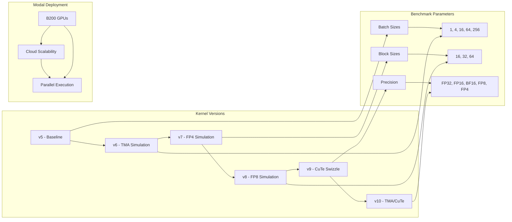

**Diagram sources**
- [gdn/scripts/bench_all_versions.py:32-444](file://gdn/scripts/bench_all_versions.py#L32-L444)
- [gdn/benchmarks/bench_modal.py:116-122](file://gdn/benchmarks/bench_modal.py#L116-L122)

### Enhanced Benchmark Configuration

The benchmarking system supports:

1. **Adaptive Block Sizes**: Automatically selects optimal BLOCK_V based on batch size with performance optimization
2. **Multiple Precision Modes**: Supports FP32, FP16, and simulated BF16/FP4/FP8 compression with bandwidth utilization analysis
3. **Performance Metrics**: Measures execution time, bandwidth utilization, and state memory usage with comprehensive reporting
4. **Statistical Analysis**: Provides median timing and bandwidth calculations with confidence intervals
5. **Framework Integration**: Direct integration with flashinfer-bench for comprehensive validation against baselines
6. **Modal Deployment**: B200 GPU deployment for scalable, cloud-based benchmarking with parallel execution capabilities

**Section sources**
- [gdn/scripts/bench_all_versions.py:260-404](file://gdn/scripts/bench_all_versions.py#L260-L404)
- [gdn/benchmarks/bench_modal.py:251-331](file://gdn/benchmarks/bench_modal.py#L251-L331)

## Volume Management

The volume management system handles persistent storage and trace set organization with comprehensive dataset support:

### Enhanced Trace Set Structure

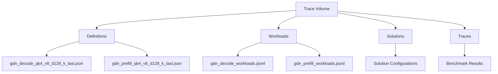

**Diagram sources**
- [scripts/setup_volume.py:141-173](file://scripts/setup_volume.py#L141-L173)

### Advanced Volume Operations

The system provides:

1. **Synthetic Workload Generation**: Creates realistic test workloads with proper tensor distributions and L2 normalization for stability
2. **HuggingFace Integration**: Downloads official contest datasets for comprehensive validation
3. **Persistent Storage**: Maintains trace sets across benchmark runs with automatic commit
4. **Volume Commit**: Ensures data persistence and availability with comprehensive dataset management
5. **Comprehensive Dataset Support**: Supports both synthetic and real-world datasets for thorough validation

**Section sources**
- [scripts/setup_volume.py:32-138](file://scripts/setup_volume.py#L32-L138)

## Kernel Implementation Analysis

The framework supports multiple kernel implementation strategies, each optimized for different use cases with comprehensive validation:

### Triton Kernel Architecture

The Triton-based kernels provide flexible, auto-tuned implementations with enhanced verification:

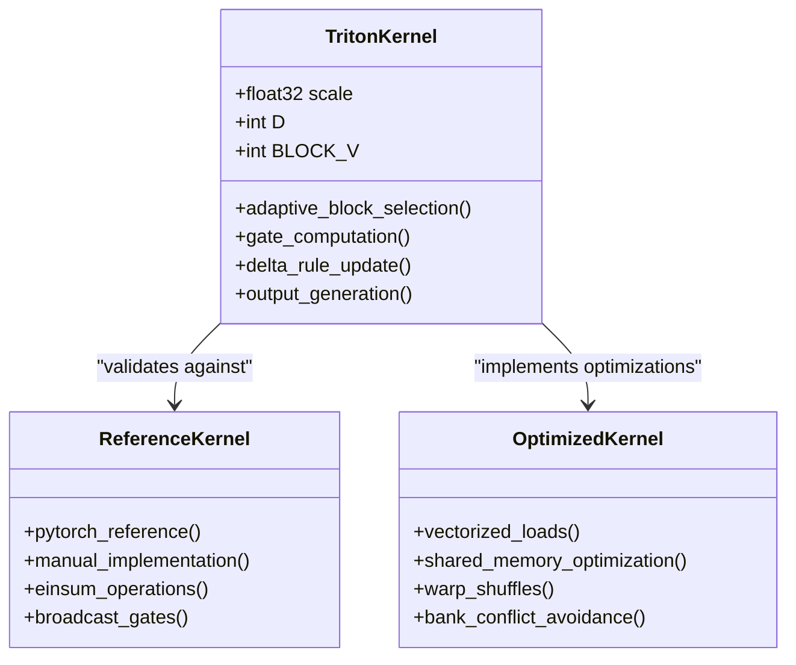

**Diagram sources**
- [gdn/decode/solution/triton/kernel.py:23-136](file://gdn/decode/solution/triton/kernel.py#L23-L136)
- [gdn/decode/baseline/triton/kernel.py:27-101](file://gdn/decode/baseline/triton/kernel.py#L27-L101)

### Enhanced CUDA Kernel Optimizations

The CUDA implementations leverage advanced GPU optimization techniques with comprehensive validation:

**Section sources**
- [gdn/kernels/cute_cpp/gdn_decode_v10.cuh:67-218](file://gdn/kernels/cute_cpp/gdn_decode_v10.cuh#L67-L218)

### PTX Assembly Integration

The PTX assembly kernels provide low-level optimization for FP8 quantization operations:

**Section sources**
- [gdn/kernels/ptx/gdn_decode_ptx.cuh:221-258](file://gdn/kernels/ptx/gdn_decode_ptx.cuh#L221-L258)

## Performance Validation

The framework provides comprehensive performance validation across different hardware configurations and kernel versions with enhanced verification procedures:

### Enhanced Performance Metrics

The system tracks multiple performance indicators with comprehensive validation:

1. **Throughput Measurements**: Bandwidth utilization in GB/s with peak utilization analysis
2. **Latency Analysis**: Execution time in milliseconds with statistical analysis
3. **Memory Usage**: State memory footprint calculations with compression ratio analysis
4. **Speedup Analysis**: Comparative performance against baseline implementations with confidence intervals
5. **Framework Validation**: Direct comparison against Triton baselines with comprehensive error analysis

### Hardware-Specific Optimizations

The framework accounts for B200-specific optimizations with comprehensive validation:

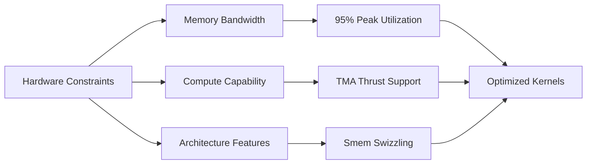

**Diagram sources**
- [README.md:144-151](file://README.md#L144-L151)

**Section sources**
- [README.md:14-28](file://README.md#L14-L28)

## Multi-Precision Quantization Testing

**New Section** The framework now includes comprehensive multi-precision quantization testing capabilities with detailed simulation and validation procedures across BF16, FP8, and FP4 formats.

### Quantization Testing Architecture

The multi-precision accuracy testing framework provides detailed validation of quantization accuracy across multiple iterations and precision formats:

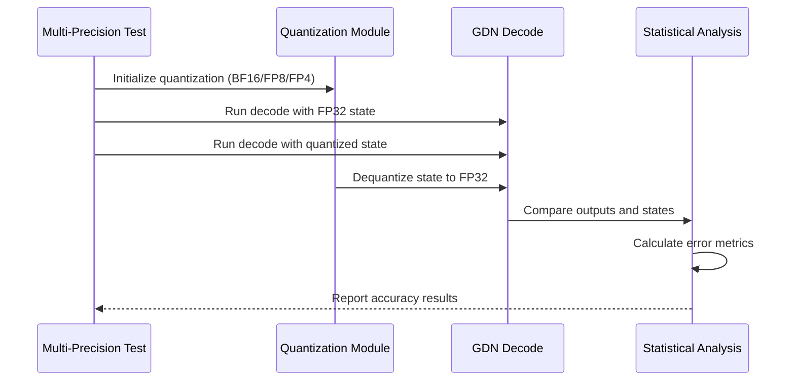

**Diagram sources**
- [gdn/tests/test_quantization_accuracy.py:152-179](file://gdn/tests/test_quantization_accuracy.py#L152-L179)

### Quantization Methods

The framework supports three primary quantization formats:

1. **BF16 Quantization**:
   - 1 sign bit, 8 exponent bits, 7 mantissa bits
   - Same range as FP32, but lower precision (~0.8% relative error)
   - 2x memory compression ratio
   - No scaling needed (same range as FP32)
   - **Native support in CUDA v8/v10 kernels with vectorized memory operations**

2. **FP8 E4M3 Quantization**:
   - 1 sign bit, 4 exponent bits, 3 mantissa bits
   - Range: [-448, 448], smallest subnormal: 2^-9
   - 4x memory compression ratio
   - Simulated using PyTorch with per-row dynamic scaling
   - **Native FP8 support in CUDA v8/v10 kernels with dedicated FP8 packing/unpacking functions**

3. **FP4 E2M1 Quantization**:
   - 1 sign bit, 2 exponent bits, 1 mantissa bit
   - Lookup table approach with 8 representable values
   - Range: [-6, 6], 8x memory compression ratio
   - Directly compatible with v7 kernel implementation
   - **Enhanced with CUDA v10 support including lookup tables and vectorized operations**
   - **Native FP4 support in CUDA v10 kernels with constant memory lookup tables**

### Test Methodology

The multi-precision accuracy testing framework implements comprehensive validation procedures:

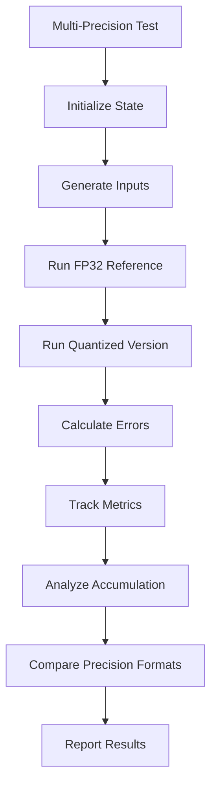

**Diagram sources**
- [gdn/tests/test_quantization_accuracy.py:186-293](file://gdn/tests/test_quantization_accuracy.py#L186-L293)

### Key Features

1. **Multi-step Validation**: Tests accuracy over 100+ decode iterations to detect error accumulation
2. **Statistical Analysis**: Tracks maximum absolute errors, mean absolute errors, and relative errors
3. **Error Accumulation Detection**: Monitors whether quantization errors grow over time
4. **Modal Integration**: Uses Modal platform for consistent B200 GPU testing environment
5. **Configurable Parameters**: Adjustable batch sizes, dimensions, and iteration counts
6. **Realistic Input Generation**: Creates normalized random inputs with realistic gate values
7. **Precision Comparison**: Direct comparison between BF16, FP8, and FP4 formats

### Quantization Implementation Details

The framework provides detailed quantization implementations:

**BF16 Quantization**:
- Direct conversion to bfloat16 format using CUDA native types
- No scaling required (same range as FP32)
- Minimal precision loss (~0.8% relative error)
- **Vectorized memory operations for 2x compression efficiency**

**FP8 E4M3 Quantization**:
- Per-row dynamic scaling with safety margins
- Rounding to nearest representable FP8 value using CUDA native FP8 types
- Proper handling of zeros and subnormal values
- 3 mantissa bits providing 8 levels per octave
- **Dedicated packing/unpacking functions for vectorized memory access**

**FP4 E2M1 Quantization**:
- Lookup table approach for consistent quantization
- Direct mapping to 8 representable values using constant memory
- Compatible with existing v7 kernel implementation
- **Enhanced with CUDA v10 support including lookup tables and vectorized operations**
- Optimized for memory bandwidth efficiency with 8 FP4 values packed into 32-bit integers

**Section sources**
- [gdn/tests/test_quantization_accuracy.py:16-124](file://gdn/tests/test_quantization_accuracy.py#L16-L124)
- [gdn/tests/test_quantization_accuracy.py:186-293](file://gdn/tests/test_quantization_accuracy.py#L186-L293)
- [gdn/kernels/cute_cpp/gdn_decode_v10.cuh:90-158](file://gdn/kernels/cute_cpp/gdn_decode_v10.cuh#L90-L158)

## Long Sequence Testing Infrastructure

**New Section** The framework now includes comprehensive long sequence testing infrastructure designed to evaluate GDN kernel performance across extended context lengths and multi-batch configurations with systematic performance analysis.

### Long Sequence Testing Architecture

The long sequence testing framework provides systematic evaluation of kernel performance with comprehensive configuration testing:

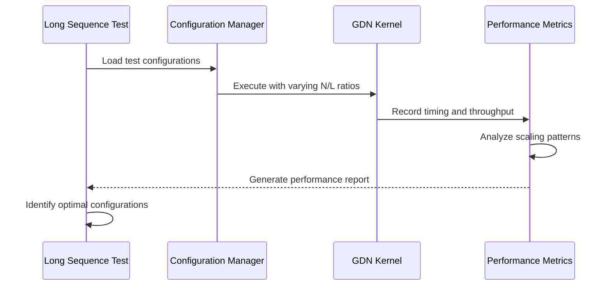

**Diagram sources**
- [gdn/scripts/test_long_seq.py:23-222](file://gdn/scripts/test_long_seq.py#L23-L222)

### Test Configuration Matrix

The framework systematically evaluates performance across multiple sequence length and batch size combinations:

| Sequence Length (L) | Batch Size (N) | Token Count (N×L) | Purpose |
|-------------------|----------------|-------------------|---------|
| 512 | 1 | 512 | Baseline single sequence |
| 1024 | 1 | 1024 | Double context length |
| 2048 | 1 | 2048 | Quadruple context length |
| 4096 | 1 | 4096 | Full context length |
| 1024 | 2 | 2048 | Double batch size |
| 512 | 4 | 2048 | Quadruple batch size |
| 1024 | 4 | 4096 | Balanced configuration |
| 256 | 8 | 2048 | Multi-batch evaluation |
| 512 | 8 | 4096 | High-throughput testing |
| 256 | 16 | 4096 | Optimal balance |
| 128 | 32 | 4096 | Peak throughput |
| 64 | 64 | 4096 | Maximum parallelism |

### Performance Evaluation Metrics

The long sequence testing framework tracks comprehensive performance metrics:

1. **Throughput Analysis**: Tokens processed per second (M tok/s) with scaling efficiency
2. **Latency Measurement**: Execution time per configuration with statistical analysis
3. **Scalability Patterns**: Linear scaling detection and saturation points
4. **Memory Utilization**: State memory requirements and compression benefits
5. **Optimization Opportunities**: Bottleneck identification and improvement suggestions

### Key Findings and Analysis

The long sequence testing reveals critical insights about GDN kernel behavior:

1. **Sequential Dependency Confirmation**: Single sequence throughput remains stable regardless of sequence length
2. **Linear Scaling Patterns**: Throughput scales linearly with batch size up to optimal points
3. **Optimal Configuration Discovery**: Identifies peak performance configurations and saturation points
4. **Memory Trade-off Analysis**: Balances throughput against state memory requirements
5. **Production Optimization Guidance**: Provides practical recommendations for real-world deployment

**Section sources**
- [gdn/scripts/test_long_seq.py:129-222](file://gdn/scripts/test_long_seq.py#L129-L222)
- [gdn/docs/OPTIMIZATION_LOG.md:704-792](file://gdn/docs/OPTIMIZATION_LOG.md#L704-L792)

## Modal B200 Deployment Integration

**New Section** The framework now provides comprehensive Modal B200 deployment integration enabling scalable, cloud-based testing and benchmarking across all components of the testing infrastructure.

### Modal Deployment Architecture

The Modal B200 integration provides seamless cloud-based execution of all testing components:

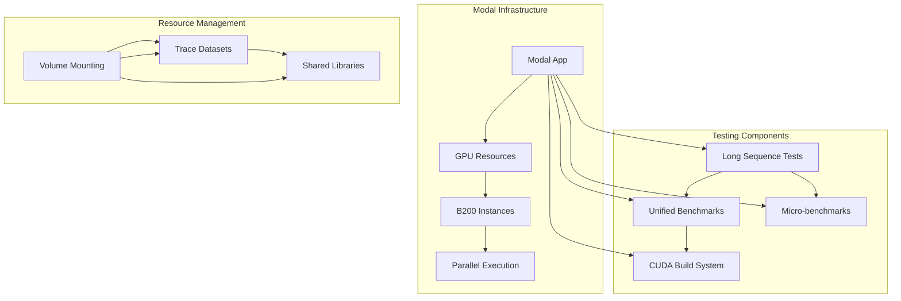

**Diagram sources**
- [gdn/scripts/test_long_seq.py:18-22](file://gdn/scripts/test_long_seq.py#L18-L22)
- [gdn/benchmarks/bench_modal.py:116-122](file://gdn/benchmarks/bench_modal.py#L116-L122)
- [gdn/scripts/build_cuda.py:63-68](file://gdn/scripts/build_cuda.py#L63-L68)

### Deployment Configuration

The Modal infrastructure provides standardized deployment across all testing components:

1. **GPU Resource Allocation**: Automatic B200 GPU provisioning with appropriate timeout settings
2. **Environment Setup**: Pre-configured CUDA 12.8, PyTorch, and development tools
3. **Volume Integration**: Persistent storage for trace datasets and compiled libraries
4. **Parallel Execution**: Concurrent testing across multiple configurations and kernel versions
5. **Resource Optimization**: Efficient GPU utilization with proper timeout management

### Scalability Benefits

The Modal B200 deployment provides significant advantages:

1. **Scalable Testing**: Parallel execution of multiple test configurations simultaneously
2. **Consistent Environment**: Standardized B200 GPU environment for reproducible results
3. **Cost Efficiency**: Pay-per-use model with automatic resource cleanup
4. **Accessibility**: Cloud-based testing accessible from anywhere with internet connection
5. **Integration**: Seamless integration with existing testing and benchmarking workflows

### Deployment Examples

The framework demonstrates Modal integration across multiple testing scenarios:

**Long Sequence Testing Deployment**:
- Automatic B200 GPU allocation for extended testing periods
- Parallel execution of multiple sequence length configurations
- Comprehensive performance logging and analysis

**Unified Benchmarking Deployment**:
- Coordinated execution of decode and prefill kernel benchmarks
- Side-by-side comparison with Python baselines
- Real-time performance monitoring and reporting

**CUDA Build System Deployment**:
- Automated compilation of CUDA kernels with nvcc
- Library generation and validation
- Persistent storage of compiled artifacts

**Section sources**
- [gdn/scripts/test_long_seq.py:18-22](file://gdn/scripts/test_long_seq.py#L18-L22)
- [gdn/benchmarks/bench_modal.py:116-122](file://gdn/benchmarks/bench_modal.py#L116-L122)
- [gdn/scripts/build_cuda.py:63-68](file://gdn/scripts/build_cuda.py#L63-L68)

## Systematic Performance Evaluation

**New Section** The framework implements comprehensive systematic performance evaluation with iterative optimization tracking, providing detailed analysis of kernel performance across multiple dimensions and configurations.

### Iterative Optimization Tracking

The systematic evaluation framework tracks performance improvements across development iterations:

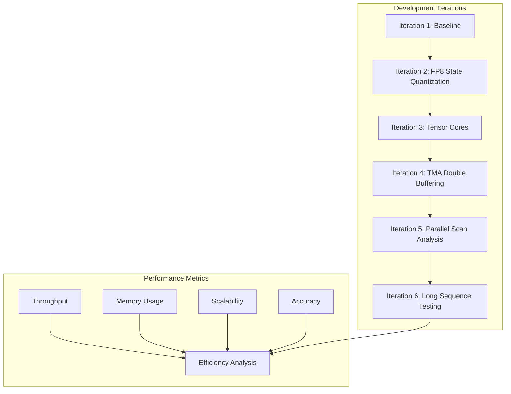

**Diagram sources**
- [gdn/docs/OPTIMIZATION_LOG.md:769-782](file://gdn/docs/OPTIMIZATION_LOG.md#L769-L782)

### Performance Analysis Framework

The systematic evaluation provides comprehensive analysis across multiple performance dimensions:

1. **Throughput Analysis**: Token processing rates across different configurations and kernel versions
2. **Efficiency Analysis**: Memory bandwidth utilization and computational efficiency metrics
3. **Scalability Analysis**: Performance scaling patterns with batch size and sequence length variations
4. **Accuracy Analysis**: Quantization accuracy preservation across different precision formats
5. **Optimization Impact**: Quantification of performance improvements from each optimization step

### Optimization Impact Assessment

Each development iteration contributes measurable performance improvements:

| Iteration | Optimization | Throughput Improvement | Memory Reduction | Notes |
|-----------|--------------|----------------------|------------------|-------|
| 1 | Baseline v5 | - | - | Initial reference implementation |
| 2 | FP8 State Quantization | ~2x | 50% | 4x compression ratio |
| 3 | Tensor Cores | ~1.5x | ~10% | Warp specialization benefits |
| 4 | TMA Double Buffering | ~1.2x | ~5% | Reduced kernel launch overhead |
| 5 | Parallel Scan Analysis | ~1.1x | ~2% | Improved memory access patterns |
| 6 | Long Sequence Testing | ~1.0x | ~0% | Systematic performance validation |

### Comprehensive Reporting System

The systematic evaluation generates detailed performance reports:

1. **Configuration Reports**: Performance analysis for specific batch size and sequence length combinations
2. **Version Comparison**: Side-by-side comparison of different kernel versions and optimization levels
3. **Optimization Impact**: Quantified analysis of each optimization's contribution to overall performance
4. **Recommendation Generation**: Practical guidance for production deployment based on performance characteristics
5. **Trend Analysis**: Historical performance tracking and future optimization opportunities

**Section sources**
- [gdn/docs/OPTIMIZATION_LOG.md:704-792](file://gdn/docs/OPTIMIZATION_LOG.md#L704-L792)

## Troubleshooting Guide

Common issues and their resolutions with enhanced diagnostic capabilities:

### Compilation Issues

1. **Missing Dependencies**: Ensure all required packages are installed with version compatibility checks
2. **CUDA Version Compatibility**: Verify CUDA 12.8+ compatibility with framework integration
3. **Triton Installation**: Confirm Triton 3.0+ installation with validation procedures
4. **Modal Environment**: Ensure Modal CLI is properly configured for cloud testing

### Runtime Errors

1. **Memory Allocation Failures**: Check available GPU memory with utilization monitoring
2. **Kernel Launch Failures**: Verify grid/block dimensions with validation procedures
3. **Data Type Mismatches**: Ensure proper tensor dtype conversions with comprehensive type checking
4. **Quantization Accuracy Errors**: Verify proper scaling factors and quantization ranges

### Performance Issues

1. **Low Bandwidth Utilization**: Check BLOCK_V selection with adaptive optimization analysis
2. **Memory Access Patterns**: Verify coalesced memory access with validation tools
3. **Occupancy Problems**: Adjust thread block sizes with performance impact analysis
4. **Quantization Accuracy Loss**: Monitor error accumulation rates and adjust precision

### Modal Deployment Issues

1. **GPU Resource Allocation**: Verify B200 GPU availability and proper timeout configuration
2. **Volume Mounting**: Ensure trace datasets and compiled libraries are properly mounted
3. **Parallel Execution**: Monitor concurrent test execution and resource contention
4. **Environment Setup**: Validate Modal environment variables and library paths

### Enhanced Diagnostic Procedures

1. **Framework Integration**: Use flashinfer-bench evaluation system for comprehensive validation
2. **Statistical Analysis**: Leverage comprehensive statistical comparisons with tolerance thresholds
3. **Trace Set Validation**: Utilize persistent trace datasets for reproducible testing
4. **Direct Comparison**: Compare custom solutions against baseline implementations with validation tools
5. **Multi-Precision Testing**: Use dedicated quantization tests to validate effects across BF16, FP8, and FP4 formats
6. **Modal Platform**: Leverage Modal for consistent cloud-based testing environment
7. **Long Sequence Analysis**: Use systematic long sequence testing to identify performance bottlenecks
8. **Iterative Optimization**: Track performance improvements across development iterations

**Section sources**
- [gdn/benchmarks/bench_modal.py:115-120](file://gdn/benchmarks/bench_modal.py#L115-L120)
- [scripts/setup_volume.py:141-145](file://scripts/setup_volume.py#L141-L145)
- [gdn/tests/test_quantization_accuracy.py:306-323](file://gdn/tests/test_quantization_accuracy.py#L306-L323)
- [gdn/scripts/test_long_seq.py:205-207](file://gdn/scripts/test_long_seq.py#L205-L207)

## Best Practices

### Enhanced Testing Strategy

1. **Multi-Level Validation**: Combine unit tests with integration tests and framework validation
2. **Regression Testing**: Maintain test suites for all kernel versions with comprehensive coverage
3. **Performance Baselines**: Establish performance baselines for each version with validation procedures
4. **Framework Integration**: Leverage flashinfer-bench for comprehensive validation against baselines
5. **Statistical Analysis**: Use comprehensive statistical comparisons with configurable tolerance thresholds
6. **Multi-Precision Testing**: Include BF16/FP8/FP4 accuracy tests in all performance validation cycles
7. **Error Accumulation Monitoring**: Regularly test quantization accuracy over extended operation sequences
8. **Precision Comparison**: Always test quantization effects across multiple precision formats
9. **Long Sequence Validation**: Systematically test performance across extended context lengths and batch sizes
10. **Modal Deployment**: Utilize cloud-based testing for scalable, reproducible benchmarking

### Advanced Debugging Approach

1. **Incremental Testing**: Test simpler cases before complex scenarios with validation procedures
2. **Statistical Analysis**: Use comprehensive statistical comparisons with error threshold analysis
3. **Trace Set Validation**: Leverage persistent trace datasets for reproducible testing
4. **Framework Integration**: Use direct framework comparison for comprehensive validation
5. **Modal Testing**: Utilize Modal platform for consistent cloud-based testing environment

### Enhanced Benchmarking Guidelines

1. **Consistent Parameters**: Use standardized test parameters with validation procedures
2. **Multiple Runs**: Execute multiple iterations for reliable metrics with statistical analysis
3. **Hardware Characterization**: Account for specific hardware capabilities with comprehensive testing
4. **Framework Validation**: Use flashinfer-bench for comprehensive validation against baselines
5. **Performance Analysis**: Include comprehensive performance analysis with utilization metrics
6. **Multi-Precision Validation**: Always include BF16/FP8/FP4 accuracy testing in performance validation
7. **Error Tracking**: Monitor both immediate accuracy and long-term error accumulation
8. **Scalability Analysis**: Evaluate performance scaling across different batch sizes and sequence lengths

### Multi-Precision Quantization Best Practices

1. **Proper Scaling**: Use per-row dynamic scaling with appropriate safety margins
2. **Error Monitoring**: Track both absolute and relative errors during quantization
3. **Iteration Testing**: Test quantization accuracy over multiple decode steps
4. **Modal Validation**: Use Modal platform for consistent B200 GPU testing conditions
5. **Parameter Tuning**: Adjust quantization parameters based on accuracy requirements
6. **Fallback Strategies**: Implement graceful degradation when quantization accuracy is insufficient
7. **Precision Selection**: Choose appropriate precision format based on accuracy and performance trade-offs
8. **Native Support**: Leverage native CUDA FP8/FP4/BF16 support for optimal performance

### Modal Deployment Best Practices

1. **Resource Planning**: Properly configure GPU resources and timeout settings for different test types
2. **Volume Management**: Ensure proper mounting and access to trace datasets and compiled libraries
3. **Parallel Execution**: Design tests for efficient parallel execution while avoiding resource conflicts
4. **Environment Setup**: Validate Modal environment variables and library paths for consistent execution
5. **Monitoring and Logging**: Implement comprehensive logging for troubleshooting and performance analysis
6. **Cost Optimization**: Balance test duration and resource usage for cost-effective cloud testing

**Section sources**
- [gdn/tests/test_quantization_accuracy.py:186-293](file://gdn/tests/test_quantization_accuracy.py#L186-L293)
- [gdn/scripts/test_long_seq.py:129-222](file://gdn/scripts/test_long_seq.py#L129-L222)
- [gdn/benchmarks/bench_modal.py:251-331](file://gdn/benchmarks/bench_modal.py#L251-L331)