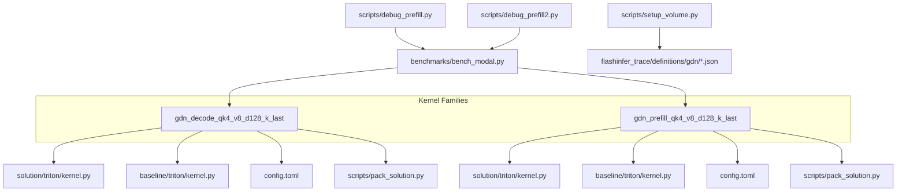
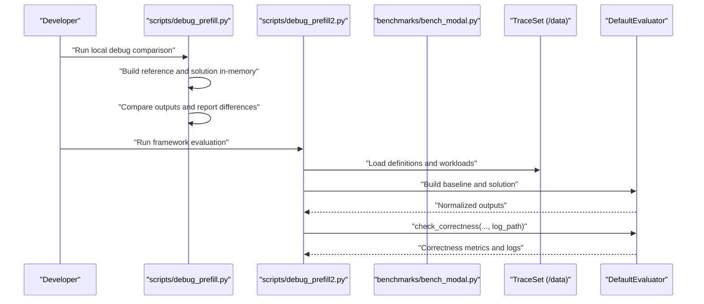
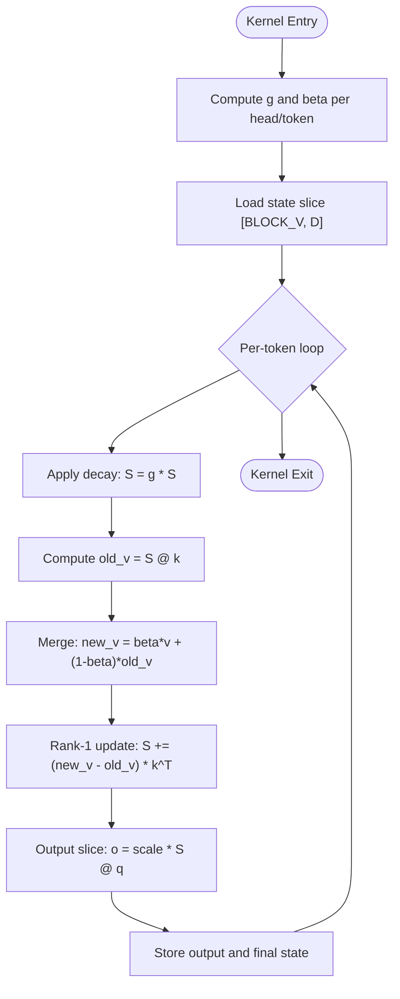
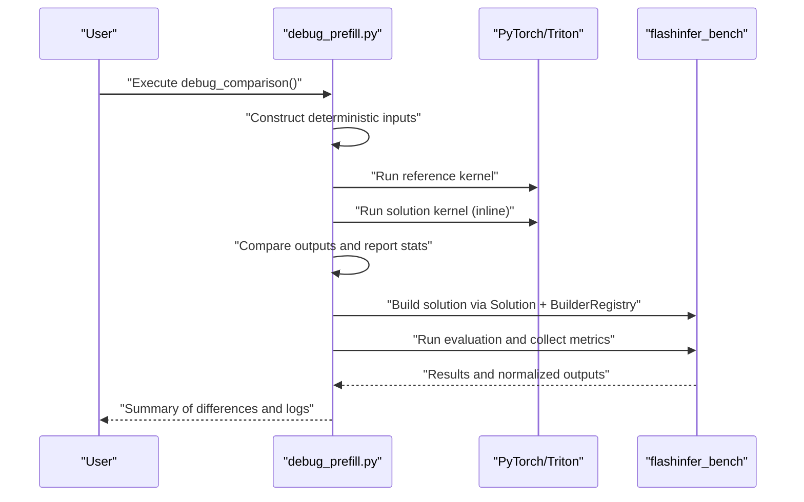
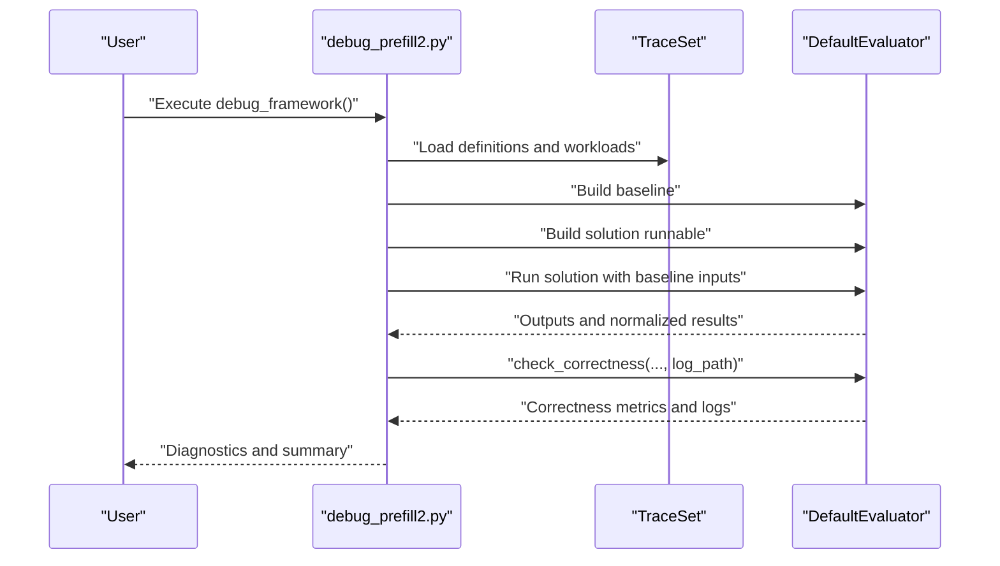
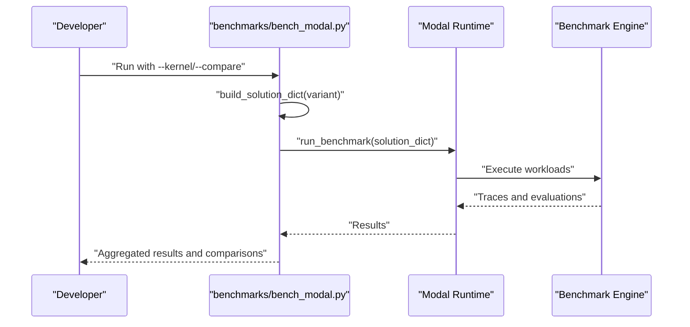
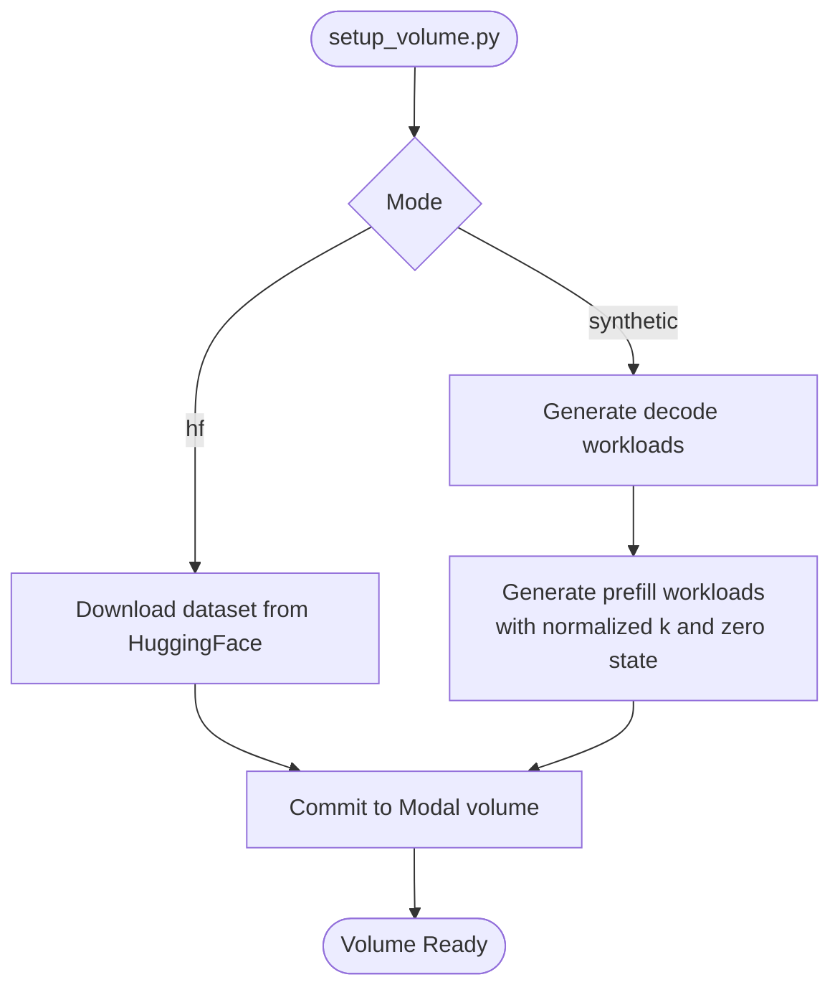
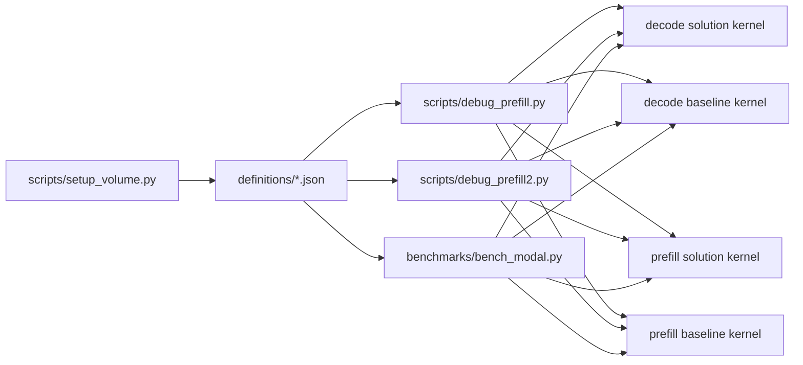

# Troubleshooting and Debugging

<cite>
**Referenced Files in This Document**
- [README.md](file://README.md)
- [benchmarks/bench_modal.py](file://benchmarks/bench_modal.py)
- [scripts/debug_prefill.py](file://scripts/debug_prefill.py)
- [scripts/debug_prefill2.py](file://scripts/debug_prefill2.py)
- [scripts/setup_volume.py](file://scripts/setup_volume.py)
- [gdn_decode_qk4_v8_d128_k_last/config.toml](file://gdn_decode_qk4_v8_d128_k_last/config.toml)
- [gdn_decode_qk4_v8_d128_k_last/solution/triton/kernel.py](file://gdn_decode_qk4_v8_d128_k_last/solution/triton/kernel.py)
- [gdn_decode_qk4_v8_d128_k_last/baseline/triton/kernel.py](file://gdn_decode_qk4_v8_d128_k_last/baseline/triton/kernel.py)
- [gdn_prefill_qk4_v8_d128_k_last/config.toml](file://gdn_prefill_qk4_v8_d128_k_last/config.toml)
- [gdn_prefill_qk4_v8_d128_k_last/solution/triton/kernel.py](file://gdn_prefill_qk4_v8_d128_k_last/solution/triton/kernel.py)
- [gdn_prefill_qk4_v8_d128_k_last/baseline/triton/kernel.py](file://gdn_prefill_qk4_v8_d128_k_last/baseline/triton/kernel.py)
- [gdn_prefill_qk4_v8_d128_k_last/scripts/pack_solution.py](file://gdn_prefill_qk4_v8_d128_k_last/scripts/pack_solution.py)
- [flashinfer_trace/definitions/gdn/gdn_prefill_qk4_v8_d128_k_last.json](file://flashinfer_trace/definitions/gdn/gdn_prefill_qk4_v8_d128_k_last.json)
- [flashinfer_trace/definitions/gdn/gdn_decode_qk4_v8_d128_k_last.json](file://flashinfer_trace/definitions/gdn/gdn_decode_qk4_v8_d128_k_last.json)
</cite>

## Table of Contents
1. [Introduction](#introduction)
2. [Project Structure](#project-structure)
3. [Core Components](#core-components)
4. [Architecture Overview](#architecture-overview)
5. [Detailed Component Analysis](#detailed-component-analysis)
6. [Dependency Analysis](#dependency-analysis)
7. [Performance Considerations](#performance-considerations)
8. [Troubleshooting Guide](#troubleshooting-guide)
9. [Conclusion](#conclusion)

## Introduction
This section provides a comprehensive troubleshooting and debugging guide for the Gated Delta Net kernels used in the submission. It focuses on diagnosing and resolving issues during development, compilation, and execution phases, including CUDA/Triton kernel errors, Triton compilation failures, and runtime performance problems. It also documents debugging techniques using the provided debug scripts, correctness verification procedures against baseline implementations, and systematic approaches to identifying performance bottlenecks, memory access violations, and optimization regressions.

## Project Structure
The repository organizes kernel implementations and debugging utilities per kernel family. Each kernel family includes:
- A solution Triton kernel under solution/triton/kernel.py
- A Python baseline reference under baseline/triton/kernel.py
- A config.toml describing the solution metadata and build specification
- A debug script under scripts/debug_prefill.py or scripts/debug_prefill2.py
- A packing script under scripts/pack_solution.py to produce a solution artifact consumable by the benchmarking framework

**Diagram sources**
- [gdn_decode_qk4_v8_d128_k_last/config.toml:1-10](file://gdn_decode_qk4_v8_d128_k_last/config.toml#L1-L10)
- [gdn_decode_qk4_v8_d128_k_last/solution/triton/kernel.py:1-130](file://gdn_decode_qk4_v8_d128_k_last/solution/triton/kernel.py#L1-L130)
- [gdn_decode_qk4_v8_d128_k_last/baseline/triton/kernel.py:1-101](file://gdn_decode_qk4_v8_d128_k_last/baseline/triton/kernel.py#L1-L101)
- [gdn_prefill_qk4_v8_d128_k_last/config.toml:1-10](file://gdn_prefill_qk4_v8_d128_k_last/config.toml#L1-L10)
- [gdn_prefill_qk4_v8_d128_k_last/solution/triton/kernel.py:1-145](file://gdn_prefill_qk4_v8_d128_k_last/solution/triton/kernel.py#L1-L145)
- [gdn_prefill_qk4_v8_d128_k_last/baseline/triton/kernel.py:1-99](file://gdn_prefill_qk4_v8_d128_k_last/baseline/triton/kernel.py#L1-L99)
- [scripts/debug_prefill.py:1-306](file://scripts/debug_prefill.py#L1-L306)
- [scripts/debug_prefill2.py:1-184](file://scripts/debug_prefill2.py#L1-L184)
- [scripts/setup_volume.py:1-220](file://scripts/setup_volume.py#L1-L220)
- [benchmarks/bench_modal.py:1-308](file://benchmarks/bench_modal.py#L1-L308)
- [flashinfer_trace/definitions/gdn/gdn_decode_qk4_v8_d128_k_last.json:1-153](file://flashinfer_trace/definitions/gdn/gdn_decode_qk4_v8_d128_k_last.json#L1-L153)
- [flashinfer_trace/definitions/gdn/gdn_prefill_qk4_v8_d128_k_last.json:1-156](file://flashinfer_trace/definitions/gdn/gdn_prefill_qk4_v8_d128_k_last.json#L1-L156)

**Section sources**
- [README.md:44-60](file://README.md#L44-L60)
- [benchmarks/bench_modal.py:40-71](file://benchmarks/bench_modal.py#L40-L71)

## Core Components
- Kernel families:
  - gdn_decode_qk4_v8_d128_k_last: decode kernel with GVA (Grouped Value Attention) and k-last state layout
  - gdn_prefill_qk4_v8_d128_k_last: prefill kernel with GVA and k-last state layout
- Build and packaging:
  - config.toml defines solution metadata and build specification (language, entry point, destination passing style)
  - scripts/pack_solution.py packages the solution into a consumable artifact
- Debugging and correctness:
  - scripts/debug_prefill.py and scripts/debug_prefill2.py provide two complementary debugging flows
  - baseline implementations serve as correctness baselines
- Benchmarking and tracing:
  - benchmarks/bench_modal.py orchestrates benchmark runs and collects performance/correctness metrics
  - scripts/setup_volume.py provisions the trace volume with definitions and workloads

**Section sources**
- [gdn_decode_qk4_v8_d128_k_last/config.toml:1-10](file://gdn_decode_qk4_v8_d128_k_last/config.toml#L1-L10)
- [gdn_prefill_qk4_v8_d128_k_last/config.toml:1-10](file://gdn_prefill_qk4_v8_d128_k_last/config.toml#L1-L10)
- [gdn_decode_qk4_v8_d128_k_last/solution/triton/kernel.py:1-130](file://gdn_decode_qk4_v8_d128_k_last/solution/triton/kernel.py#L1-L130)
- [gdn_prefill_qk4_v8_d128_k_last/solution/triton/kernel.py:1-145](file://gdn_prefill_qk4_v8_d128_k_last/solution/triton/kernel.py#L1-L145)
- [scripts/debug_prefill.py:1-306](file://scripts/debug_prefill.py#L1-L306)
- [scripts/debug_prefill2.py:1-184](file://scripts/debug_prefill2.py#L1-L184)
- [benchmarks/bench_modal.py:1-308](file://benchmarks/bench_modal.py#L1-L308)
- [scripts/setup_volume.py:1-220](file://scripts/setup_volume.py#L1-L220)

## Architecture Overview
The debugging and benchmarking pipeline integrates local debug scripts with the flashinfer-bench framework and Modal infrastructure. Two primary flows are supported:
- Direct comparison: run a reference implementation and the solution kernel side-by-side, then compare outputs
- Framework-driven evaluation: build baseline and solution via the benchmark framework, then evaluate correctness and performance

**Diagram sources**
- [scripts/debug_prefill.py:14-306](file://scripts/debug_prefill.py#L14-L306)
- [scripts/debug_prefill2.py:17-184](file://scripts/debug_prefill2.py#L17-L184)
- [benchmarks/bench_modal.py:106-168](file://benchmarks/bench_modal.py#L106-L168)

## Detailed Component Analysis

### Kernel Implementation Patterns
Both decode and prefill kernels follow a similar pattern:
- Gate computation: decay (g) and update (beta) gates derived from A_log, a, dt_bias, and b
- State handling: k-last layout with optional initial state
- GDA delta-rule update: apply decay, compute old_v, merge with new_v, update state
- Output projection: scale * q @ S

**Diagram sources**
- [gdn_decode_qk4_v8_d128_k_last/solution/triton/kernel.py:24-84](file://gdn_decode_qk4_v8_d128_k_last/solution/triton/kernel.py#L24-L84)
- [gdn_prefill_qk4_v8_d128_k_last/solution/triton/kernel.py:24-97](file://gdn_prefill_qk4_v8_d128_k_last/solution/triton/kernel.py#L24-L97)

**Section sources**
- [gdn_decode_qk4_v8_d128_k_last/solution/triton/kernel.py:24-130](file://gdn_decode_qk4_v8_d128_k_last/solution/triton/kernel.py#L24-L130)
- [gdn_prefill_qk4_v8_d128_k_last/solution/triton/kernel.py:24-145](file://gdn_prefill_qk4_v8_d128_k_last/solution/triton/kernel.py#L24-L145)

### Debug Script: scripts/debug_prefill.py
This script performs:
- Deterministic input construction and statistics logging
- Reference implementation execution and statistics
- In-kernel copy of the solution kernel for direct comparison
- Framework-based evaluation using the benchmarking library
- Detailed difference reporting for outputs and new_state

**Diagram sources**
- [scripts/debug_prefill.py:14-306](file://scripts/debug_prefill.py#L14-L306)

**Section sources**
- [scripts/debug_prefill.py:23-167](file://scripts/debug_prefill.py#L23-L167)
- [scripts/debug_prefill.py:168-302](file://scripts/debug_prefill.py#L168-L302)

### Debug Script: scripts/debug_prefill2.py
This script focuses on framework-driven evaluation:
- Loads definitions and workloads from the trace volume
- Builds baseline and solution runnables
- Executes solution with baseline inputs
- Calls DefaultEvaluator.check_correctness with a log path for diagnostics

**Diagram sources**
- [scripts/debug_prefill2.py:17-184](file://scripts/debug_prefill2.py#L17-L184)

**Section sources**
- [scripts/debug_prefill2.py:36-184](file://scripts/debug_prefill2.py#L36-L184)

### Benchmark Orchestration: benchmarks/bench_modal.py
This module:
- Packs solution or baseline artifacts from local files
- Runs benchmarks on Modal B200 with configurable warmup/iterations/trials
- Compares solution vs baseline results and prints side-by-side comparisons
- Aggregates performance metrics and correctness errors

**Diagram sources**
- [benchmarks/bench_modal.py:74-168](file://benchmarks/bench_modal.py#L74-L168)
- [benchmarks/bench_modal.py:241-308](file://benchmarks/bench_modal.py#L241-L308)

**Section sources**
- [benchmarks/bench_modal.py:74-104](file://benchmarks/bench_modal.py#L74-L104)
- [benchmarks/bench_modal.py:112-168](file://benchmarks/bench_modal.py#L112-L168)
- [benchmarks/bench_modal.py:202-239](file://benchmarks/bench_modal.py#L202-L239)

### Definition and Workload Provisioning: scripts/setup_volume.py
This module:
- Generates synthetic workloads for decode and prefill
- Creates prefill workloads with L2-normalized k and zero state stored as safetensors
- Uploads definitions and workloads to the Modal trace volume

**Diagram sources**
- [scripts/setup_volume.py:141-220](file://scripts/setup_volume.py#L141-L220)

**Section sources**
- [scripts/setup_volume.py:32-57](file://scripts/setup_volume.py#L32-L57)
- [scripts/setup_volume.py:60-138](file://scripts/setup_volume.py#L60-L138)
- [scripts/setup_volume.py:141-220](file://scripts/setup_volume.py#L141-L220)

## Dependency Analysis
The following diagram shows how the debug scripts and benchmark runner depend on the kernel implementations and definitions:

**Diagram sources**
- [scripts/debug_prefill.py:104-151](file://scripts/debug_prefill.py#L104-L151)
- [scripts/debug_prefill2.py:57-108](file://scripts/debug_prefill2.py#L57-L108)
- [benchmarks/bench_modal.py:40-71](file://benchmarks/bench_modal.py#L40-L71)
- [flashinfer_trace/definitions/gdn/gdn_decode_qk4_v8_d128_k_last.json:1-153](file://flashinfer_trace/definitions/gdn/gdn_decode_qk4_v8_d128_k_last.json#L1-L153)
- [flashinfer_trace/definitions/gdn/gdn_prefill_qk4_v8_d128_k_last.json:1-156](file://flashinfer_trace/definitions/gdn/gdn_prefill_qk4_v8_d128_k_last.json#L1-L156)

**Section sources**
- [gdn_decode_qk4_v8_d128_k_last/solution/triton/kernel.py:1-130](file://gdn_decode_qk4_v8_d128_k_last/solution/triton/kernel.py#L1-L130)
- [gdn_decode_qk4_v8_d128_k_last/baseline/triton/kernel.py:1-101](file://gdn_decode_qk4_v8_d128_k_last/baseline/triton/kernel.py#L1-L101)
- [gdn_prefill_qk4_v8_d128_k_last/solution/triton/kernel.py:1-145](file://gdn_prefill_qk4_v8_d128_k_last/solution/triton/kernel.py#L1-L145)
- [gdn_prefill_qk4_v8_d128_k_last/baseline/triton/kernel.py:1-99](file://gdn_prefill_qk4_v8_d128_k_last/baseline/triton/kernel.py#L1-L99)

## Performance Considerations
- Triton kernel tuning:
  - Grid/block sizing and BLOCK_V selection impact occupancy and throughput
  - num_warps and shared memory usage should align with head_size and tile sizes
- Numerical stability:
  - Softplus approximation and exponential scaling should avoid overflow
  - L2-normalization of k in prefill workloads prevents state explosion
- Memory access:
  - Strided loads/stores and contiguous tensors reduce register pressure
  - V-dimension splitting improves SM occupancy at small batches
- Benchmark configuration:
  - Warmup, iterations, and trials affect latency stability and statistical significance

[No sources needed since this section provides general guidance]

## Troubleshooting Guide

### Common Issues and Diagnostics

- CUDA/Triton kernel errors
  - Symptoms: NaN/Inf in outputs, segmentation faults, or incorrect shapes
  - Diagnostics:
    - Use scripts/debug_prefill.py to compare reference and solution outputs and compute max absolute and relative differences
    - Enable NaN/Inf checks on outputs and states in debug scripts
  - Resolution:
    - Verify input shapes and strides match kernel expectations
    - Ensure state layout is k-last and properly initialized
    - Confirm BLOCK_V and grid dimensions are consistent with head_size and GVA ratios

- Triton compilation failures
  - Symptoms: Compilation errors, invalid IR, or assertion failures
  - Diagnostics:
    - Reproduce with scripts/debug_prefill2.py to capture detailed logs via DefaultEvaluator.check_correctness
    - Inspect generated IR and kernel launch parameters
  - Resolution:
    - Align dtypes and const expressions with kernel signatures
    - Validate destination_passing_style setting matches kernel expectations

- Runtime performance problems
  - Symptoms: Unstable latency, low occupancy, or unexpected slowdowns
  - Diagnostics:
    - Use benchmarks/bench_modal.py with increased iterations/trials for stable measurements
    - Compare solution vs baseline side-by-side to isolate regressions
  - Resolution:
    - Adjust num_warps and BLOCK_V to improve occupancy
    - Reduce register usage by splitting tiles and minimizing per-program state

- Memory access violations
  - Symptoms: Segmentation faults or out-of-bounds loads/stores
  - Diagnostics:
    - Validate cu_seqlens bounds and per-sequence indices
    - Ensure V-dimension slicing respects BLOCK_V alignment
  - Resolution:
    - Add bounds checks and padding where necessary
    - Use Triton’s masking capabilities for partial tiles

- Correctness verification
  - Procedure:
    - Run scripts/debug_prefill.py to compare reference and solution outputs
    - Use scripts/debug_prefill2.py to invoke DefaultEvaluator.check_correctness and capture logs
    - Compare max absolute and relative errors against tolerance thresholds
  - Edge case testing:
    - Test with varying batch sizes, sequence lengths, and GVA configurations
    - Use scripts/setup_volume.py synthetic workloads to exercise a wide range of inputs

- Log analysis and resolution strategies
  - Use log_path in DefaultEvaluator.check_correctness to capture diagnostic logs
  - Review kernel launch parameters, input shapes, and intermediate statistics
  - Iterate on kernel parameters and data layouts to resolve discrepancies

**Section sources**
- [scripts/debug_prefill.py:95-167](file://scripts/debug_prefill.py#L95-L167)
- [scripts/debug_prefill.py:168-302](file://scripts/debug_prefill.py#L168-L302)
- [scripts/debug_prefill2.py:164-184](file://scripts/debug_prefill2.py#L164-L184)
- [benchmarks/bench_modal.py:202-239](file://benchmarks/bench_modal.py#L202-L239)
- [scripts/setup_volume.py:60-138](file://scripts/setup_volume.py#L60-L138)

### Practical Examples

- Example: Identifying a shape mismatch
  - Symptom: Shape mismatch error during kernel launch
  - Steps:
    - Confirm head_size and GVA ratios in kernel signatures
    - Validate input shapes in definitions and scripts
  - Evidence:
    - Definition files specify head_size and head counts for each kernel family

- Example: Detecting numerical instability
  - Symptom: NaN in outputs after several prefill steps
  - Steps:
    - Use L2-normalized k in prefill workloads to stabilize state updates
    - Monitor state norms and gate magnitudes
  - Evidence:
    - Synthetic prefill workload generation normalizes k and initializes state

- Example: Resolving compilation issues
  - Symptom: Triton compilation failure due to dtype mismatches
  - Steps:
    - Match dtypes in kernel signatures and launch parameters
    - Ensure destination_passing_style setting aligns with build spec
  - Evidence:
    - Build specs and config.toml define language and entry points

**Section sources**
- [flashinfer_trace/definitions/gdn/gdn_prefill_qk4_v8_d128_k_last.json:1-156](file://flashinfer_trace/definitions/gdn/gdn_prefill_qk4_v8_d128_k_last.json#L1-L156)
- [flashinfer_trace/definitions/gdn/gdn_decode_qk4_v8_d128_k_last.json:1-153](file://flashinfer_trace/definitions/gdn/gdn_decode_qk4_v8_d128_k_last.json#L1-L153)
- [gdn_decode_qk4_v8_d128_k_last/config.toml:6-9](file://gdn_decode_qk4_v8_d128_k_last/config.toml#L6-L9)
- [gdn_prefill_qk4_v8_d128_k_last/config.toml:6-9](file://gdn_prefill_qk4_v8_d128_k_last/config.toml#L6-L9)

### Best Practices and Preventive Measures
- Keep definitions and workloads consistent across debug and benchmark runs
- Normalize inputs (e.g., L2-normalize k) to prevent numerical blow-up
- Validate kernel launch parameters and input shapes before execution
- Use deterministic seeds and minimal test cases to isolate issues quickly
- Prefer iterative refinement: start with baseline correctness, then optimize for performance

**Section sources**
- [scripts/setup_volume.py:96-109](file://scripts/setup_volume.py#L96-L109)
- [scripts/debug_prefill.py:20-46](file://scripts/debug_prefill.py#L20-L46)
- [scripts/debug_prefill2.py:146-158](file://scripts/debug_prefill2.py#L146-L158)

## Conclusion
This guide consolidates practical techniques for troubleshooting and debugging the Gated Delta Net kernels. By leveraging the provided debug scripts, correctness baselines, and benchmarking framework, developers can systematically diagnose compilation and runtime issues, verify numerical accuracy, and optimize performance while maintaining reliability across diverse workloads.